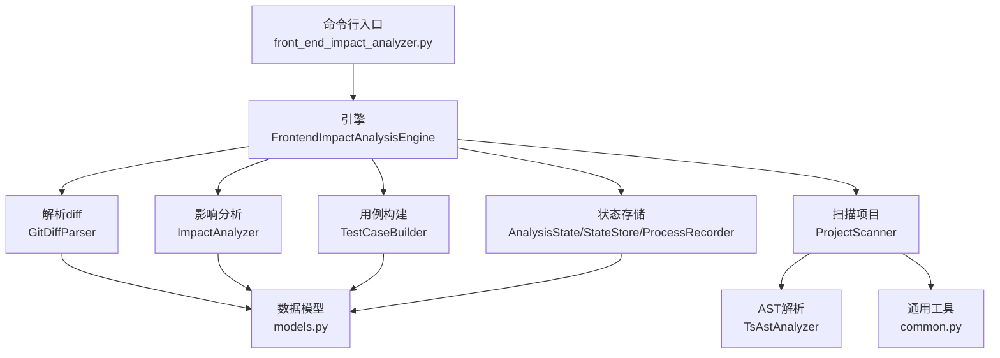
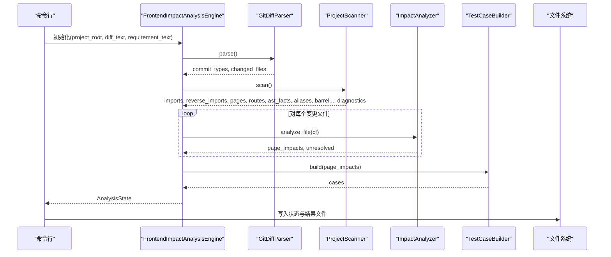
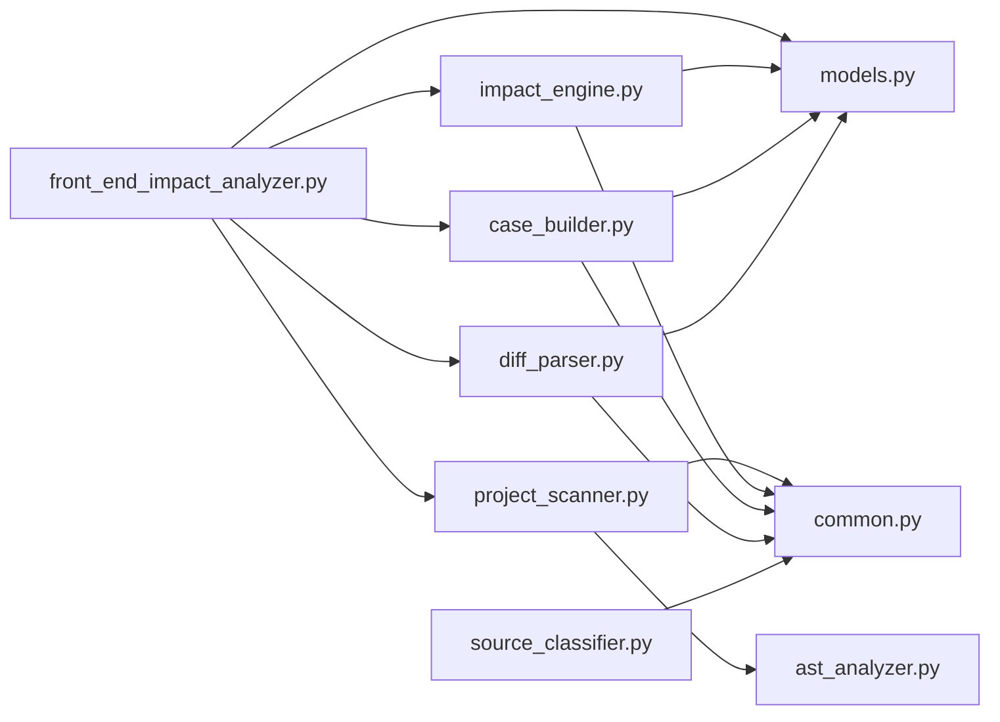

# API参考

<cite>
**本文引用的文件**
- [scripts/front_end_impact_analyzer.py](file://scripts/front_end_impact_analyzer.py)
- [scripts/analyzer/impact_engine.py](file://scripts/analyzer/impact_engine.py)
- [scripts/analyzer/project_scanner.py](file://scripts/analyzer/project_scanner.py)
- [scripts/analyzer/models.py](file://scripts/analyzer/models.py)
- [scripts/analyzer/diff_parser.py](file://scripts/analyzer/diff_parser.py)
- [scripts/analyzer/case_builder.py](file://scripts/analyzer/case_builder.py)
- [scripts/analyzer/common.py](file://scripts/analyzer/common.py)
- [scripts/analyzer/source_classifier.py](file://scripts/analyzer/source_classifier.py)
- [scripts/analyzer/ast_analyzer.py](file://scripts/analyzer/ast_analyzer.py)
- [pyproject.toml](file://pyproject.toml)
- [schemas/analysis-state.schema.json](file://schemas/analysis-state.schema.json)
- [schemas/case-array.schema.json](file://schemas/case-array.schema.json)
- [fixtures/diffs/format_only.diff](file://fixtures/diffs/format_only.diff)
- [fixtures/diffs/shared_search_form.diff](file://fixtures/diffs/shared_search_form.diff)
</cite>

## 目录
1. [简介](#简介)
2. [项目结构](#项目结构)
3. [核心组件](#核心组件)
4. [架构总览](#架构总览)
5. [详细组件分析](#详细组件分析)
6. [依赖分析](#依赖分析)
7. [性能考虑](#性能考虑)
8. [故障排查指南](#故障排查指南)
9. [结论](#结论)
10. [附录](#附录)

## 简介
本文件为前端影响分析器的完整API参考文档，覆盖命令行接口、核心类与方法、数据模型、参数与返回值、异常处理、使用示例、配置与扩展点。该工具通过解析Git diff、扫描项目AST、追踪变更到页面、生成业务用例，输出结构化分析状态与测试用例清单。

## 项目结构
- 命令行入口：scripts/front_end_impact_analyzer.py
- 核心分析管线：
  - scripts/analyzer/diff_parser.py：解析diff，提取变更文件、语义标签、API变更
  - scripts/analyzer/project_scanner.py：扫描项目，构建导入图、页面、路由、AST事实
  - scripts/analyzer/impact_engine.py：从变更文件追踪到页面，生成PageImpact
  - scripts/analyzer/case_builder.py：基于PageImpact生成测试用例
  - scripts/analyzer/models.py：定义AnalysisState、PageImpact、ChangedFile等数据模型
  - scripts/analyzer/common.py：通用工具（路径、别名、模块名推断、去重）
  - scripts/analyzer/source_classifier.py：源码分类与模块猜测
  - scripts/analyzer/ast_analyzer.py：Tree-sitter AST解析与语义标签推导
- 配置与模式：
  - pyproject.toml：项目元信息与依赖
  - schemas/*.json：分析状态与用例输出的JSON Schema

图表来源
- [scripts/front_end_impact_analyzer.py:111-157](file://scripts/front_end_impact_analyzer.py#L111-L157)
- [scripts/analyzer/impact_engine.py:10-188](file://scripts/analyzer/impact_engine.py#L10-L188)
- [scripts/analyzer/project_scanner.py:13-314](file://scripts/analyzer/project_scanner.py#L13-L314)
- [scripts/analyzer/models.py:110-173](file://scripts/analyzer/models.py#L110-L173)
- [scripts/analyzer/ast_analyzer.py:13-241](file://scripts/analyzer/ast_analyzer.py#L13-L241)

章节来源
- [scripts/front_end_impact_analyzer.py:111-157](file://scripts/front_end_impact_analyzer.py#L111-L157)
- [pyproject.toml:1-18](file://pyproject.toml#L1-L18)

## 核心组件
- 命令行接口
  - 参数
    - --project-root：项目根目录（必需）
    - --diff-file：diff文件路径（必需）
    - --requirement-file：需求文本文件路径（可选）
    - --state-output：分析状态输出文件（默认 impact-analysis-state.json）
    - --result-output：结果用例输出文件（默认 impact-analysis-result.json）
  - 返回
    - 成功：写入状态与结果文件，退出码0
    - 失败：写入状态（含致命错误诊断），退出码1
  - 异常处理
    - 捕获运行期异常，记录到ProcessRecorder，设置状态为failed，并在状态中追加致命错误诊断

- FrontendImpactAnalysisEngine
  - 方法
    - run() -> AnalysisState：执行完整分析流水线，返回最终状态
  - 关键步骤
    - 解析diff -> 分类变更文件 -> 扫描项目AST -> 影响分析 -> 生成PageImpact -> 构建测试用例 -> 写入输出

- ImpactAnalyzer
  - 方法
    - analyze_file(cf: ChangedFile) -> (List[PageImpact], Optional[Dict])：从单个变更文件追踪到页面
    - 其他内部方法用于符号匹配、路径搜索、置信度与原因评估

- ProjectScanner
  - 方法
    - scan() -> (imports, reverse_imports, pages, routes, ast_facts, aliases, barrel_files, barrel_evidence, diagnostics)
  - 功能
    - 遍历源文件，解析AST，收集导入/导出/组件/路由/懒加载等信息，构建反向依赖图与路由绑定

- 数据模型
  - AnalysisState：分析状态容器，包含meta、input、parsedDiff、codeGraph、codeImpact、businessImpact、output、processLogs
  - PageImpact：页面影响结果，包含变更文件、页面文件、路由路径、模块名、追踪路径、影响类型、置信度、影响原因、语义标签、匹配符号、API变更
  - ChangedFile：变更文件，包含路径、变更类型、新增/删除行数、符号、语义标签、API变更、文件类型、模块猜测、是否仅格式化
  - RouteInfo：路由信息
  - FileAstFacts：AST解析事实
  - TestCase：测试用例，支持转换为CaseOutput
  - ProcessLog/ProcessRecorder/StateStore：过程日志与状态持久化辅助

章节来源
- [scripts/front_end_impact_analyzer.py:111-157](file://scripts/front_end_impact_analyzer.py#L111-L157)
- [scripts/analyzer/impact_engine.py:26-188](file://scripts/analyzer/impact_engine.py#L26-L188)
- [scripts/analyzer/project_scanner.py:20-314](file://scripts/analyzer/project_scanner.py#L20-L314)
- [scripts/analyzer/models.py:110-173](file://scripts/analyzer/models.py#L110-L173)

## 架构总览
整体流程：命令行解析参数 -> 初始化引擎 -> 解析diff -> 分类变更文件 -> 扫描项目构建图 -> 影响分析 -> 生成PageImpact -> 构建测试用例 -> 输出状态与结果。

图表来源
- [scripts/front_end_impact_analyzer.py:18-100](file://scripts/front_end_impact_analyzer.py#L18-L100)
- [scripts/analyzer/diff_parser.py:60-126](file://scripts/analyzer/diff_parser.py#L60-L126)
- [scripts/analyzer/project_scanner.py:20-80](file://scripts/analyzer/project_scanner.py#L20-L80)
- [scripts/analyzer/impact_engine.py:26-58](file://scripts/analyzer/impact_engine.py#L26-L58)
- [scripts/analyzer/case_builder.py:11-15](file://scripts/analyzer/case_builder.py#L11-L15)

## 详细组件分析

### 命令行接口 API
- 参数
  - --project-root
    - 类型：字符串（路径）
    - 必需：是
    - 作用：指定项目根目录，用于扫描源码与解析相对路径
  - --diff-file
    - 类型：字符串（路径）
    - 必需：是
    - 作用：读取diff文本，作为输入进行分析
  - --requirement-file
    - 类型：字符串（路径）
    - 必需：否
    - 作用：读取需求文本，作为上下文输入
  - --state-output
    - 类型：字符串（路径）
    - 默认："impact-analysis-state.json"
    - 作用：输出分析状态JSON文件
  - --result-output
    - 类型：字符串（路径）
    - 默认："impact-analysis-result.json"
    - 作用：输出测试用例数组JSON文件
- 返回
  - 成功：打印输出文件路径，退出码0
  - 失败：记录致命错误到状态，打印输出文件路径，退出码1
- 异常处理
  - 捕获所有异常，设置状态为failed，追加致命错误诊断，返回非零退出码

章节来源
- [scripts/front_end_impact_analyzer.py:111-157](file://scripts/front_end_impact_analyzer.py#L111-L157)

### FrontendImpactAnalysisEngine
- 构造函数
  - 参数：project_root: Path, diff_text: str, requirement_text: str = ""
  - 初始化AnalysisState、ProcessRecorder、StateStore
- 方法
  - run() -> AnalysisState
    - 步骤：解析diff -> 分类变更文件 -> 扫描项目 -> 影响分析 -> 生成PageImpact -> 统计业务影响 -> 构建用例 -> 写入状态与结果
    - 返回：AnalysisState
- 内部逻辑要点
  - 使用SourceClassifier为变更文件打上file_type与module_guess
  - 使用ProcessRecorder记录各阶段日志
  - 使用StateStore将中间结果写入AnalysisState

章节来源
- [scripts/front_end_impact_analyzer.py:18-100](file://scripts/front_end_impact_analyzer.py#L18-L100)

### GitDiffParser
- 方法
  - parse() -> (List[str], List[ChangedFile])
    - 提取commit类型、变更文件列表
    - 对每个文件统计新增/删除行数，提取符号、语义标签、API变更
    - 若仅格式化变更，则清空符号与语义标签
- 关键行为
  - 符号识别：函数、类、组件、常量等
  - 语义标签：按钮、弹窗、表单、表格、路由、权限、API、状态、导航、校验、列表查询、提交、列、详情、加载、禁用态、导出等
  - API变更：请求字段变更、响应字段变更、枚举变更、分页形状变更、详情结构变更、列表结构变更
  - 格式化判断：比较添加/删除行标准化后的文本是否相同

章节来源
- [scripts/analyzer/diff_parser.py:60-126](file://scripts/analyzer/diff_parser.py#L60-L126)
- [scripts/analyzer/diff_parser.py:128-300](file://scripts/analyzer/diff_parser.py#L128-L300)

### ProjectScanner
- 方法
  - scan() -> (imports, reverse_imports, pages, routes, ast_facts, aliases, barrel_files, barrel_evidence, diagnostics)
- 关键行为
  - 遍历源文件（.ts/.tsx/.js/.jsx），解析AST，收集导入/导出/组件/钩子/JSX标签/属性/路由/懒加载/API调用等
  - 解析路由对象，推断路由与页面的绑定关系，记录诊断
  - 解析别名（tsconfig paths），支持通配符
  - 收集桶文件（reexport）证据
- 路由绑定策略
  - 优先根据lazy import目标定位页面
  - 其次根据component/lazy中的组件名在可达依赖中匹配页面
  - 最后若仅有一个可达页面则猜测绑定

章节来源
- [scripts/analyzer/project_scanner.py:20-80](file://scripts/analyzer/project_scanner.py#L20-L80)
- [scripts/analyzer/project_scanner.py:128-224](file://scripts/analyzer/project_scanner.py#L128-L224)
- [scripts/analyzer/ast_analyzer.py:18-241](file://scripts/analyzer/ast_analyzer.py#L18-L241)

### ImpactAnalyzer
- 方法
  - analyze_file(cf: ChangedFile) -> (List[PageImpact], Optional[Dict])
    - 若仅格式化：返回空影响与无未解决项
    - 若文件类型为page：直接构建“直接”影响
    - 否则：基于符号与反向导入图追踪到页面，合并语义标签，构造PageImpact
  - 内部方法
    - _trace_to_pages：BFS搜索，维护active_symbols与strict_symbols传播
    - _symbols_for_parent：根据import/reexport绑定计算传递的符号集合
    - _impact_type/_confidence/_reason：影响类型、置信度与原因描述
- 置信度规则
  - page/route高
  - business-component/api/hook/store且路径长度<=3高
  - shared-component按语义标签（表单/表格/模态/按钮）给出中/低
  - utils/config-or-schema/style低

章节来源
- [scripts/analyzer/impact_engine.py:26-188](file://scripts/analyzer/impact_engine.py#L26-L188)

### TestCaseBuilder
- 方法
  - build(impacts: List[PageImpact]) -> List[TestCase]
- 用例模板
  - 基础回归、按钮、弹窗、表单、表格、接口调用、查询/筛选/分页/排序、详情、删除、权限、导航、上传、禁用态、路由、接口请求字段变更、响应字段映射、枚举值、分页参数结构、详情接口字段结构、列表接口字段结构
- 业务动作推断
  - 根据语义标签与文件名/路由/路径关键词推断list/detail/create/edit/delete等主流程
- 去重与排序
  - 基于页面名、用例名、优先级、置信度等级排序

章节来源
- [scripts/analyzer/case_builder.py:11-223](file://scripts/analyzer/case_builder.py#L11-L223)

### 数据模型
- AnalysisState
  - 字段：meta、input、parsedDiff、codeGraph、codeImpact、businessImpact、output、processLogs
  - 用途：承载整个分析过程的状态与结果
- PageImpact
  - 字段：changed_file、page_file、route_path、module_name、trace、impact_type、confidence、impact_reason、semantic_tags、matched_symbols、api_changes
- ChangedFile
  - 字段：path、change_type、added_lines、removed_lines、symbols、semantic_tags、api_changes、file_type、module_guess、is_format_only
- RouteInfo
  - 字段：route_path、source_file、linked_page、route_component、parent_route、confidence
- FileAstFacts
  - 字段：imports、import_bindings、resolved_import_bindings、reexports、reexport_bindings、exports、component_names、hook_names、jsx_tags、jsx_props、route_paths、route_components、lazy_imports、api_calls、semantic_tags、identifier_counts
- TestCase/CaseOutput
  - TestCase：page_name、case_name、test_steps、expected_results、case_level、confidence、source_description、sort_priority
  - to_output_dict() -> CaseOutput

章节来源
- [scripts/analyzer/models.py:110-173](file://scripts/analyzer/models.py#L110-L173)

### SourceClassifier
- 方法
  - classify(file_path: str) -> str：按路径与扩展名分类为page、route、api、store、hook、shared-component、business-component、utils、config-or-schema、style、unknown
  - guess_module(file_path: str) -> str：从路径推断模块名

章节来源
- [scripts/analyzer/source_classifier.py:6-36](file://scripts/analyzer/source_classifier.py#L6-L36)

### 通用工具与配置
- common.py
  - 常量：SRC_EXTS、STYLE_EXTS、IGNORE_DIRS、API_NAMES
  - 工具：路径归一化、相对路径、安全读取、去重、标题化、模块名推断、置信度到优先级映射、tsconfig别名加载与解析
- pyproject.toml
  - 项目元信息与依赖：tree-sitter、tree-sitter-typescript

章节来源
- [scripts/analyzer/common.py:1-151](file://scripts/analyzer/common.py#L1-L151)
- [pyproject.toml:1-18](file://pyproject.toml#L1-L18)

## 依赖分析
- 外部依赖
  - tree-sitter与tree-sitter-typescript：AST解析
- 内部模块耦合
  - front_end_impact_analyzer.py 依赖 analyzer.* 组件
  - analyzer.impact_engine.py 依赖 analyzer.models 与 analyzer.common
  - analyzer.project_scanner.py 依赖 analyzer.ast_analyzer 与 analyzer.common
  - analyzer.case_builder.py 依赖 analyzer.common 与 analyzer.models
  - analyzer.diff_parser.py 依赖 analyzer.common 与 analyzer.models
  - analyzer.source_classifier.py 依赖 analyzer.common

图表来源
- [scripts/front_end_impact_analyzer.py:9-15](file://scripts/front_end_impact_analyzer.py#L9-L15)
- [scripts/analyzer/project_scanner.py:8-10](file://scripts/analyzer/project_scanner.py#L8-L10)
- [scripts/analyzer/impact_engine.py:6-7](file://scripts/analyzer/impact_engine.py#L6-L7)
- [scripts/analyzer/case_builder.py:6-7](file://scripts/analyzer/case_builder.py#L6-L7)
- [scripts/analyzer/diff_parser.py:6-7](file://scripts/analyzer/diff_parser.py#L6-L7)
- [scripts/analyzer/source_classifier.py:3](file://scripts/analyzer/source_classifier.py#L3)

章节来源
- [scripts/front_end_impact_analyzer.py:9-15](file://scripts/front_end_impact_analyzer.py#L9-L15)

## 性能考虑
- AST解析与遍历
  - 仅扫描src目录（或项目根目录），忽略node_modules等目录
  - 使用Tree-sitter解析，复杂度与源码大小线性相关
- 路径解析与别名展开
  - tsconfig别名解析采用缓存与去重策略，避免重复IO
- 影响追踪
  - BFS搜索时维护visited集合，避免重复访问
  - 符号传播严格控制，减少无效分支
- I/O与序列化
  - 仅在最后阶段写入状态与结果文件，降低磁盘压力

[本节为一般性指导，不直接分析具体文件]

## 故障排查指南
- 常见问题
  - 无法解析diff：检查diff文件路径与编码；确认diff格式正确
  - 未找到页面或路由绑定失败：检查路由对象结构与组件/懒加载引用
  - 未生成PageImpact：确认变更文件是否为格式化变更；检查符号与语义标签提取
  - 用例为空：确认存在受影响页面或API变更
- 诊断信息
  - AnalysisState.codeGraph.diagnostics：包含未解析导入、未绑定路由等诊断
  - ProcessRecorder记录各阶段日志，便于定位问题
- 错误状态
  - analysisStatus为failed时，状态中包含致命错误诊断与摘要

章节来源
- [scripts/front_end_impact_analyzer.py:125-146](file://scripts/front_end_impact_analyzer.py#L125-L146)
- [scripts/analyzer/project_scanner.py:45-50](file://scripts/analyzer/project_scanner.py#L45-L50)
- [scripts/analyzer/project_scanner.py:193-199](file://scripts/analyzer/project_scanner.py#L193-L199)

## 结论
本API参考文档梳理了前端影响分析器的命令行接口、核心组件、数据模型与工作流。通过清晰的参数说明、返回值类型、异常处理与扩展点，开发者可以快速集成与定制分析流程，生成高质量的测试用例以保障前端变更质量。

[本节为总结性内容，不直接分析具体文件]

## 附录

### 使用示例与最佳实践
- 基本用法
  - 设置项目根目录与diff文件路径，运行命令行程序，生成状态与结果文件
- 需求文本
  - 可选传入requirement-file，增强上下文理解
- diff样例
  - 格式化变更样例：[format_only.diff](file://fixtures/diffs/format_only.diff)
  - 共享组件变更样例：[shared_search_form.diff](file://fixtures/diffs/shared_search_form.diff)

章节来源
- [scripts/front_end_impact_analyzer.py:111-157](file://scripts/front_end_impact_analyzer.py#L111-L157)
- [fixtures/diffs/format_only.diff:1-10](file://fixtures/diffs/format_only.diff#L1-L10)
- [fixtures/diffs/shared_search_form.diff:1-14](file://fixtures/diffs/shared_search_form.diff#L1-L14)

### JSON Schema参考
- 分析状态Schema
  - 定义meta、input、parsedDiff、codeGraph、codeImpact、businessImpact、output、processLogs字段与约束
- 用例数组Schema
  - 定义CaseOutput字段与枚举值

章节来源
- [schemas/analysis-state.schema.json:1-46](file://schemas/analysis-state.schema.json#L1-L46)
- [schemas/case-array.schema.json:1-51](file://schemas/case-array.schema.json#L1-L51)