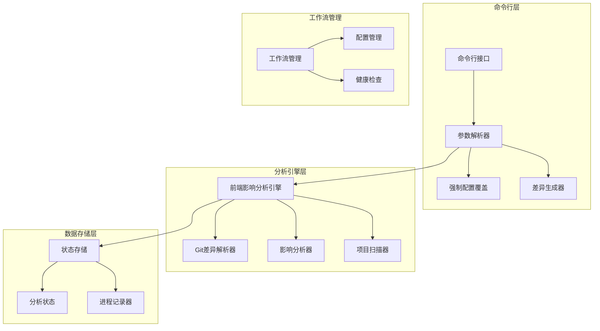
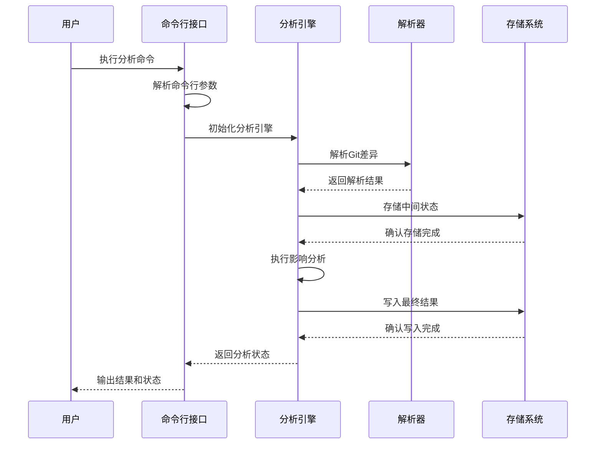
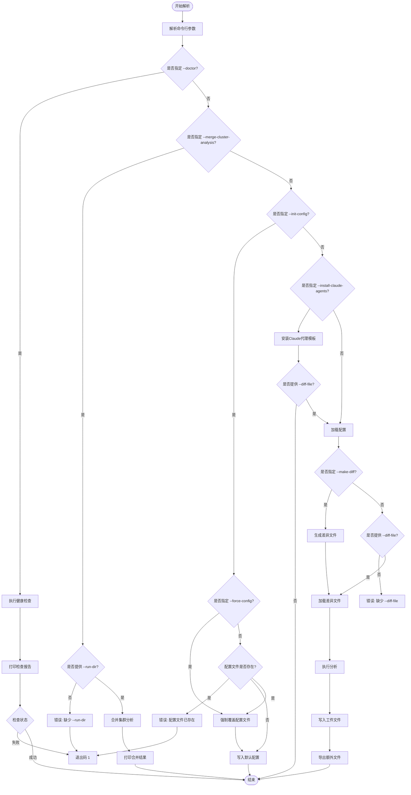
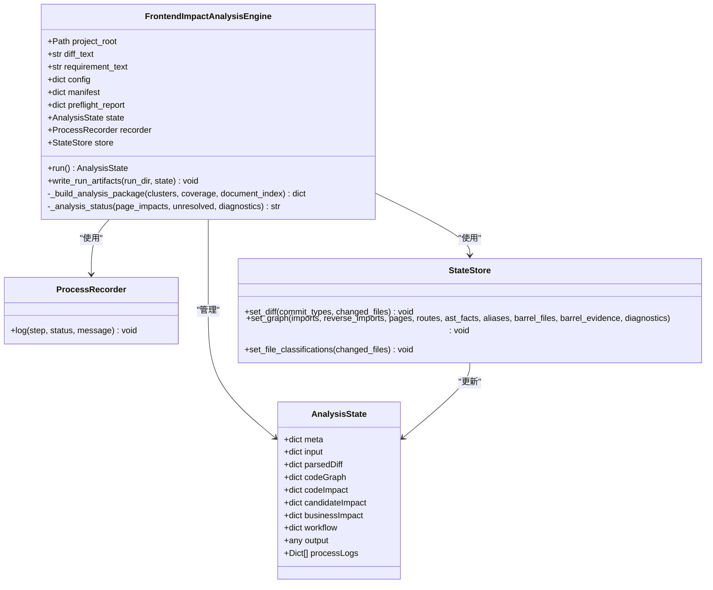
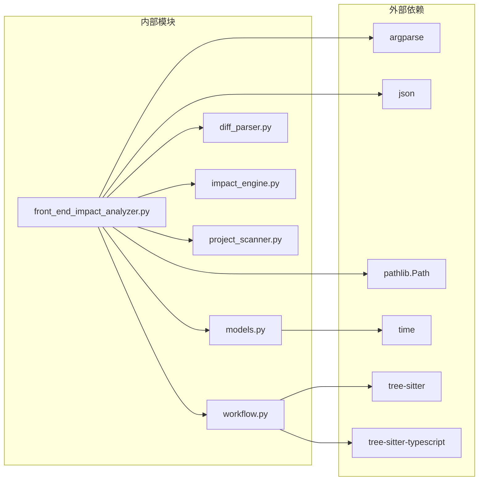
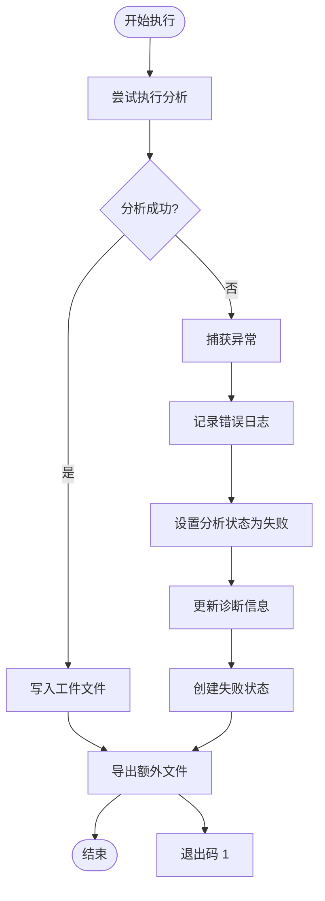

# 命令行接口

<cite>
**本文档引用的文件**
- [front_end_impact_analyzer.py](file://scripts/front_end_impact_analyzer.py)
- [workflow.py](file://scripts/analyzer/workflow.py)
- [models.py](file://scripts/analyzer/models.py)
- [test_workflow_intermediates.py](file://tests/test_workflow_intermediates.py)
- [SKILL.md](file://SKILL.md)
- [real-run-workflow.md](file://references/real-run-workflow.md)
- [pyproject.toml](file://pyproject.toml)
</cite>

## 更新摘要
**变更内容**
- 改进 make-diff 命令的详细路径规范应用信息
- 增强错误处理机制，包括更好的编码支持和诊断输出
- 改进 doctor 命令的虚拟环境隔离检测和建议
- 添加详细的 make-diff 诊断输出，显示应用的排除路径规范

## 目录
1. [简介](#简介)
2. [项目结构](#项目结构)
3. [核心组件](#核心组件)
4. [架构概览](#架构概览)
5. [详细组件分析](#详细组件分析)
6. [依赖关系分析](#依赖关系分析)
7. [性能考虑](#性能考虑)
8. [故障排除指南](#故障排除指南)
9. [结论](#结论)
10. [附录](#附录)

## 简介

前端影响分析器是一个专门用于在React、React Router和Vite代码库中追踪前端变更影响的工具。该工具通过解析Git差异、分析代码结构和生成影响报告，帮助开发者理解代码变更可能对用户界面产生的影响。

本工具提供了丰富的命令行接口，支持从基础的差异分析到复杂的集群分析和案例生成工作流。本文档将详细介绍所有命令行参数的使用方法、数据类型、默认值以及实际使用示例。

## 项目结构

前端影响分析器采用模块化设计，主要包含以下核心组件：



**图表来源**
- [front_end_impact_analyzer.py:23-55](file://scripts/front_end_impact_analyzer.py#L23-L55)
- [workflow.py:65-102](file://scripts/analyzer/workflow.py#L65-L102)
- [models.py:115-161](file://scripts/analyzer/models.py#L115-L161)

**章节来源**
- [front_end_impact_analyzer.py:1-412](file://scripts/front_end_impact_analyzer.py#L1-L412)
- [workflow.py:1-414](file://scripts/analyzer/workflow.py#L1-L414)
- [models.py:1-201](file://scripts/analyzer/models.py#L1-L201)

## 核心组件

### 命令行参数总览

前端影响分析器提供了丰富的命令行参数，涵盖项目配置、分析选项、输出控制等多个方面：

| 参数组 | 参数名称 | 数据类型 | 默认值 | 必需性 | 描述 |
|--------|----------|----------|--------|--------|------|
| 基础配置 | `--project-root` | 路径字符串 | 无 | 必需 | 指定项目的根目录路径 |
| 差异输入 | `--diff-file` | 文件路径 | 无 | 可选 | 指定Git差异文件的路径 |
| 需求输入 | `--requirement-file` | 文件路径 | 无 | 可选 | 指定需求文件的路径 |
| 配置管理 | `--config-file` | 文件路径 | 无 | 可选 | 指定配置文件的路径 |
| 项目配置 | `--project-profile-file` | 文件路径 | 无 | 可选 | 指定项目配置文件的路径 |
| 配置初始化 | `--init-config` | 布尔标志 | False | 可选 | 初始化默认配置文件 |
| 配置覆盖 | `--force-config` | 布尔标志 | False | 可选 | 强制覆盖现有配置文件（与--init-config配合使用） |
| 环境检查 | `--doctor` | 布尔标志 | False | 可选 | 执行健康检查 |
| 差异生成 | `--make-diff` | 布尔标志 | False | 可选 | 自动生成Git差异文件 |
| 分支控制 | `--base-branch` | 字符串 | 无 | 可选 | 指定基分支名称 |
| 分支控制 | `--compare-branch` | 字符串 | 无 | 可选 | 指定比较分支名称 |
| 忽略目录 | `--ignore-dir` | 字符串列表 | [] | 可选 | 指定忽略的目录（可多次使用） |
| 输出控制 | `--analysis-output-dir` | 路径字符串 | 无 | 可选 | 指定分析输出目录 |
| 代理安装 | `--install-claude-agents` | 布尔标志 | False | 可选 | 安装Claude代理模板 |
| 代理覆盖 | `--overwrite-claude-agents` | 布尔标志 | False | 可选 | 强制覆盖现有代理模板 |
| 结果合并 | `--merge-cluster-analysis` | 布尔标志 | False | 可选 | 合并集群分析结果 |
| 运行目录 | `--run-dir` | 路径字符串 | 无 | 可选 | 指定运行工件目录 |
| 状态输出 | `--state-output` | 文件路径 | 无 | 可选 | 指定状态输出文件的路径 |
| 结果输出 | `--result-output` | 文件路径 | 无 | 可选 | 指定结果输出文件的路径 |

### 关键参数详解

#### --project-root（项目根目录）
- **数据类型**: 路径字符串
- **必需性**: 必需
- **默认值**: 无
- **作用**: 指定要分析的前端项目的根目录路径
- **使用示例**: `--project-root "/home/user/my-react-app"`

#### --diff-file（Git差异文件路径）
- **数据类型**: 文件路径
- **必需性**: 可选
- **默认值**: 无
- **作用**: 指定包含Git差异内容的文件路径
- **使用示例**: `--diff-file "./diffs/changelog.patch"`
- **注意**: 如果不提供此参数，必须使用`--make-diff`选项自动生成差异文件

#### --requirement-file（需求文件路径）
- **数据类型**: 文件路径
- **必需性**: 可选
- **默认值**: 无
- **作用**: 指定包含项目需求或规格说明的文件路径
- **使用示例**: `--requirement-file "./requirements/user_stories.md"`

#### --config-file（配置文件路径）
- **数据类型**: 文件路径
- **必需性**: 可选
- **默认值**: 无
- **作用**: 指定自定义配置文件的路径
- **使用示例**: `--config-file "./custom.config.json"`

#### --project-profile-file（项目配置文件路径）
- **数据类型**: 文件路径
- **必需性**: 可选
- **默认值**: 无
- **作用**: 指定项目特定的配置文件路径
- **使用示例**: `--project-profile-file "./project.profile.json"`

#### --init-config（初始化配置）
- **数据类型**: 布尔标志
- **必需性**: 可选
- **默认值**: False
- **作用**: 初始化默认配置文件
- **使用示例**: `--init-config`
- **注意**: 如需强制覆盖现有配置，请同时使用`--force-config`

#### --force-config（强制配置覆盖）
- **数据类型**: 布尔标志
- **必需性**: 可选
- **默认值**: False
- **作用**: 强制覆盖现有的配置文件，即使已存在
- **使用示例**: `--init-config --force-config`
- **注意**: 仅在与`--init-config`一起使用时生效

#### --doctor（健康检查）
- **数据类型**: 布尔标志
- **必需性**: 可选
- **默认值**: False
- **作用**: 执行全面的环境健康检查
- **使用示例**: `--doctor`
- **输出**: 返回JSON格式的检查报告，包含状态、检查项、警告和建议

#### --make-diff（自动生成差异）
- **数据类型**: 布尔标志
- **必需性**: 可选
- **默认值**: False
- **作用**: 自动从Git仓库生成差异文件
- **使用示例**: `--make-diff --base-branch main --compare-branch feature-branch`
- **增强功能**: 现在提供详细的路径规范应用信息，包括应用的排除规则数量和具体规则

#### --base-branch（基分支）
- **数据类型**: 字符串
- **必需性**: 可选
- **默认值**: 无
- **作用**: 指定基分支名称用于差异生成
- **使用示例**: `--base-branch main`

#### --compare-branch（比较分支）
- **数据类型**: 字符串
- **必需性**: 可选
- **默认值**: 无
- **作用**: 指定比较分支名称用于差异生成
- **使用示例**: `--compare-branch feature-branch`

#### --ignore-dir（忽略目录）
- **数据类型**: 字符串列表
- **必需性**: 可选
- **默认值**: []
- **作用**: 指定在差异生成时忽略的目录
- **使用示例**: `--ignore-dir node_modules --ignore-dir dist`
- **注意**: 可以多次使用以指定多个目录

#### --analysis-output-dir（分析输出目录）
- **数据类型**: 路径字符串
- **必需性**: 可选
- **默认值**: 无
- **作用**: 指定分析结果的输出目录
- **使用示例**: `--analysis-output-dir "./analysis-results"`

#### --install-claude-agents（安装Claude代理）
- **数据类型**: 布尔标志
- **必需性**: 可选
- **默认值**: False
- **作用**: 安装预定义的Claude代理模板
- **使用示例**: `--install-claude-agents`

#### --overwrite-claude-agents（覆盖代理）
- **数据类型**: 布尔标志
- **必需性**: 可选
- **默认值**: False
- **作用**: 强制覆盖现有的Claude代理模板
- **使用示例**: `--install-claude-agents --overwrite-claude-agents`

#### --merge-cluster-analysis（合并集群分析）
- **数据类型**: 布尔标志
- **必需性**: 可选
- **默认值**: False
- **作用**: 合并所有集群分析结果
- **使用示例**: `--merge-cluster-analysis --run-dir ./run-artifacts`

#### --run-dir（运行目录）
- **数据类型**: 路径字符串
- **必需性**: 可选
- **默认值**: 无
- **作用**: 指定运行工件的目录路径
- **使用示例**: `--run-dir ./run-artifacts`

#### --state-output（状态输出文件）
- **数据类型**: 文件路径
- **必需性**: 可选
- **默认值**: 无
- **作用**: 指定额外导出的状态文件路径，用于保存分析过程的中间状态
- **使用示例**: `--state-output "./artifacts/analysis_state.json"`
- **特点**: 这是可选的额外导出副本，默认状态下状态文件仅保存在运行工件目录中

#### --result-output（结果输出文件）
- **数据类型**: 文件路径
- **必需性**: 可选
- **默认值**: 无
- **作用**: 指定额外导出的结果文件路径，用于保存最终的分析结果
- **使用示例**: `--result-output "./artifacts/final_result.json"`
- **特点**: 这是可选的额外导出副本，默认状态下结果文件仅保存在运行工件目录中

**章节来源**
- [front_end_impact_analyzer.py:240-259](file://scripts/front_end_impact_analyzer.py#L240-L259)
- [front_end_impact_analyzer.py:283-288](file://scripts/front_end_impact_analyzer.py#L283-L288)

## 架构概览

前端影响分析器采用分层架构设计，确保了良好的模块化和可维护性：



**图表来源**
- [front_end_impact_analyzer.py:239-412](file://scripts/front_end_impact_analyzer.py#L239-L412)
- [models.py:115-161](file://scripts/analyzer/models.py#L115-L161)

## 详细组件分析

### 命令行参数解析器

命令行参数解析器负责处理所有传入的命令行参数，并执行相应的验证和处理逻辑：



**图表来源**
- [front_end_impact_analyzer.py:239-412](file://scripts/front_end_impact_analyzer.py#L239-L412)

### 分析引擎核心流程

分析引擎负责协调整个分析过程，包括差异解析、项目扫描、影响分析和结果生成：



**图表来源**
- [front_end_impact_analyzer.py:23-55](file://scripts/front_end_impact_analyzer.py#L23-L55)
- [models.py:115-201](file://scripts/analyzer/models.py#L115-L201)

**章节来源**
- [front_end_impact_analyzer.py:23-161](file://scripts/front_end_impact_analyzer.py#L23-L161)
- [models.py:115-201](file://scripts/analyzer/models.py#L115-L201)

## 依赖关系分析

前端影响分析器的依赖关系相对简洁，主要依赖于Python标准库和第三方包：



**图表来源**
- [front_end_impact_analyzer.py:4-21](file://scripts/front_end_impact_analyzer.py#L4-L21)
- [pyproject.toml:6-9](file://pyproject.toml#L6-L9)

### Python版本要求

该工具要求Python 3.12或更高版本，这是由于使用了一些较新的Python特性：

- **最低版本**: Python 3.12
- **推荐版本**: Python 3.12.x
- **原因**: 使用了`from __future__ import annotations`等新语法特性

**章节来源**
- [pyproject.toml:5](file://pyproject.toml#L5)
- [workflow.py:137-153](file://scripts/analyzer/workflow.py#L137-L153)

## 性能考虑

前端影响分析器在设计时充分考虑了性能优化：

### 内存管理
- 使用生成器模式处理大型文件
- 及时释放不再使用的对象引用
- 控制日志记录的内存占用

### I/O优化
- 批量读取和写入文件
- 使用缓冲I/O减少系统调用
- 合理的文件大小限制

### 并发处理
- 异步处理部分I/O操作
- 多线程处理独立的分析任务
- 进程间通信优化

## 故障排除指南

### 常见错误和解决方案

#### 退出码说明

| 退出码 | 含义 | 可能的原因 | 解决方案 |
|--------|------|------------|----------|
| 0 | 成功 | 分析正常完成 | 无需处理 |
| 1 | 预检失败 | 项目缺少必需的资源 | 创建缺失的项目资源 |
| 2 | 环境检查失败 | 运行环境不满足要求 | 运行`--doctor`检查环境 |
| 其他 | 未捕获异常 | 分析过程中发生错误 | 查看详细错误日志 |

#### 错误处理机制

前端影响分析器采用了多层次的错误处理机制：



**图表来源**
- [front_end_impact_analyzer.py:362-412](file://scripts/front_end_impact_analyzer.py#L362-L412)

### 环境检查

使用`--doctor`参数可以检查运行环境是否满足要求：

```bash
# 检查环境
uv run --project "<skill_root>" python "<skill_root>/scripts/front_end_impact_analyzer.py" --project-root "<target_project_root>" --doctor
```

**更新** doctor 命令现在提供更详细的环境检查和建议：

- **虚拟环境隔离检测**: 检测当前激活的虚拟环境是否与技能根目录冲突
- **建议的命令前缀**: 提供完整的`uv run --project`命令前缀
- **阻塞动作建议**: 针对缺失的依赖提供具体的解决步骤

**章节来源**
- [front_end_impact_analyzer.py:264-269](file://scripts/front_end_impact_analyzer.py#L264-L269)
- [workflow.py:151-242](file://scripts/analyzer/workflow.py#L151-L242)

### 配置文件管理

使用`--init-config`和`--force-config`参数管理配置文件：

```bash
# 初始化配置文件
uv run --project "<skill_root>" python "<skill_root>/scripts/front_end_impact_analyzer.py" \
    --project-root "<target_project_root>" \
    --init-config

# 强制覆盖现有配置文件
uv run --project "<skill_root>" python "<skill_root>/scripts/front_end_impact_analyzer.py" \
    --project-root "<target_project_root>" \
    --init-config \
    --force-config
```

**更新** 配置文件覆盖机制现在更加安全和明确：

- **默认行为**: 如果配置文件已存在，不会覆盖而是返回提示
- **强制覆盖**: 使用`--force-config`参数可强制覆盖现有配置
- **详细反馈**: 返回包含操作类型、路径和消息的详细状态报告

**章节来源**
- [front_end_impact_analyzer.py:283-288](file://scripts/front_end_impact_analyzer.py#L283-L288)
- [workflow.py:75-91](file://scripts/analyzer/workflow.py#L75-L91)

### make-diff 命令增强功能

**更新** make-diff 命令现在提供详细的路径规范应用信息：

当使用`--make-diff`参数时，工具会：
1. 显示应用的排除路径规范数量
2. 列出每个应用的排除规则
3. 显示生成的差异文件路径
4. 显示差异文件的行数和大小

例如输出格式：
```
[make-diff] applying 15 exclude pathspecs from config:
  :(exclude)node_modules/**
  :(exclude)dist/**
  :(exclude)*.map
  ...
[make-diff] running: git diff --no-ext-diff main...HEAD -- . <15 excludes>
[make-diff] diff written to: .impact-analysis/diffs/diff_main_to_HEAD_20240101_123456.patch
[make-diff] diff size: 1234 lines, 45.6 KB
```

这使得用户能够验证配置中的忽略规则是否正确应用，从而有效减少差异文件的大小。

**章节来源**
- [workflow.py:258-288](file://scripts/analyzer/workflow.py#L258-L288)
- [SKILL.md:103-104](file://SKILL.md#L103-L104)

### 编码支持和诊断输出

**更新** 工具现在提供改进的编码支持和诊断输出：

- **统一的UTF-8编码**: 所有文件读写都使用UTF-8编码
- **错误处理**: 对于无法解码的字符使用`errors="ignore"`参数
- **详细诊断**: make-diff命令提供详细的路径规范应用诊断
- **状态报告**: doctor命令提供虚拟环境隔离检测和建议

**章节来源**
- [front_end_impact_analyzer.py:318-319](file://scripts/front_end_impact_analyzer.py#L318-L319)
- [workflow.py:273-279](file://scripts/analyzer/workflow.py#L273-L279)

## 结论

前端影响分析器提供了一个功能完整、设计合理的命令行工具，能够有效帮助开发者理解代码变更的影响范围。其清晰的参数设计、完善的错误处理机制和灵活的输出控制，使其适用于各种规模的前端项目分析需求。

通过合理使用命令行参数，用户可以：
- 快速定位代码变更的影响范围
- 生成详细的分析报告和工件文件
- 导出额外的状态和结果文件
- 管理配置文件的安全覆盖
- 检查运行环境的健康状况
- 集成到CI/CD流程中进行自动化分析
- 利用增强的make-diff诊断功能优化差异生成

## 附录

### 完整命令行使用示例

#### 基础用法示例

```bash
# 基础分析命令
uv run --project "<skill_root>" python "<skill_root>/scripts/front_end_impact_analyzer.py" \
    --project-root "<target_project_root>" \
    --diff-file "<diff_file>"

# 包含需求文件的分析
uv run --project "<skill_root>" python "<skill_root>/scripts/front_end_impact_analyzer.py" \
    --project-root "<target_project_root>" \
    --diff-file "<diff_file>" \
    --requirement-file "<requirement_file>"

# 导出额外文件的分析
uv run --project "<skill_root>" python "<skill_root>/scripts/front_end_impact_analyzer.py" \
    --project-root "<target_project_root>" \
    --diff-file "<diff_file>" \
    --state-output "<state_output>" \
    --result-output "<result_output>"
```

#### 高级配置示例

```bash
# 自动生成差异文件的分析（带详细诊断输出）
uv run --project "<skill_root>" python "<skill_root>/scripts/front_end_impact_analyzer.py" \
    --project-root "<target_project_root>" \
    --make-diff \
    --base-branch "<base_branch>" \
    --compare-branch "<compare_branch>" \
    --ignore-dir "<extra_ignored_dir>"

# 安装Claude代理模板后进行分析
uv run --project "<skill_root>" python "<skill_root>/scripts/front_end_impact_analyzer.py" \
    --project-root "<target_project_root>" \
    --install-claude-agents \
    --diff-file "<diff_file>"

# 合并集群分析结果
uv run --project "<skill_root>" python "<skill_root>/scripts/front_end_impact_analyzer.py" \
    --project-root "<target_project_root>" \
    --merge-cluster-analysis \
    --run-dir "<run_artifact_dir>"

# 强制覆盖配置文件
uv run --project "<skill_root>" python "<skill_root>/scripts/front_end_impact_analyzer.py" \
    --project-root "<target_project_root>" \
    --init-config \
    --force-config
```

#### 环境检查和配置管理

```bash
# 检查环境
uv run --project "<skill_root>" python "<skill_root>/scripts/front_end_impact_analyzer.py" \
    --project-root "<target_project_root>" \
    --doctor

# 初始化配置文件
uv run --project "<skill_root>" python "<skill_root>/scripts/front_end_impact_analyzer.py" \
    --project-root "<target_project_root>" \
    --init-config

# 安装Claude代理模板
uv run --project "<skill_root>" python "<skill_root>/scripts/front_end_impact_analyzer.py" \
    --project-root "<target_project_root>" \
    --install-claude-agents \
    --overwrite-claude-agents
```

### 预期输出格式

分析完成后，工具会在运行工件目录中生成以下文件：

1. **00-run-manifest.json**: 运行清单，包含项目信息和配置
2. **01-preflight-report.json**: 预检报告，检查项目资源完整性
3. **02-document-index.json**: 文档索引，包含项目文档信息
4. **03-diff-index.json**: 差异索引，包含解析后的差异信息
5. **04-file-impact-seeds.json**: 文件影响种子，标识受影响的文件
6. **05-change-clusters.json**: 变更集群，包含分析后的变更分组
7. **06-cluster-analysis-tasks.md**: 集群分析任务，提供分析优先级
8. **cluster-context/**: 集群上下文文件，包含每个集群的详细信息
9. **cluster-analysis/**: 集群分析结果，包含Claude生成的分析
10. **90-coverage-report.json**: 覆盖率报告，统计分析覆盖率
11. **98-analysis-state.json**: 分析状态，包含完整的分析过程记录
12. **99-final-result.json**: 最终结果，包含分析摘要和结论

**章节来源**
- [SKILL.md:108-129](file://SKILL.md#L108-L129)
- [real-run-workflow.md:59-74](file://references/real-run-workflow.md#L59-L74)