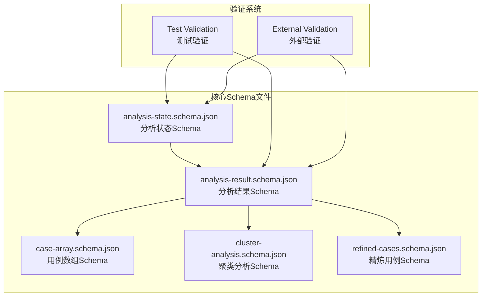
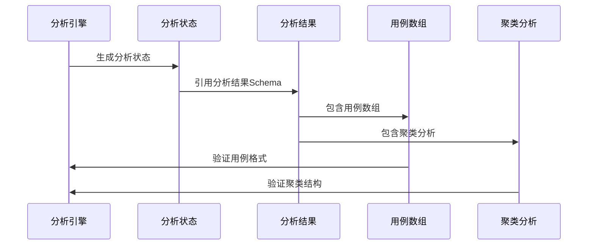
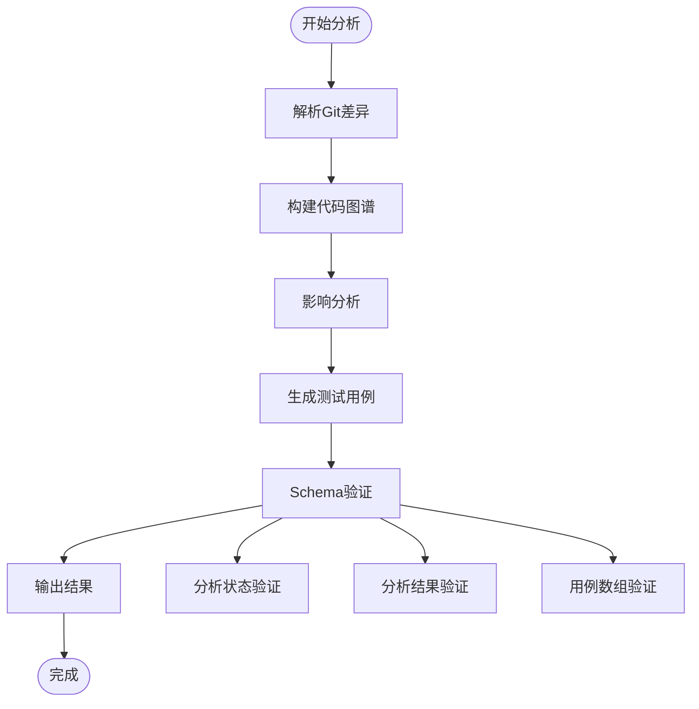
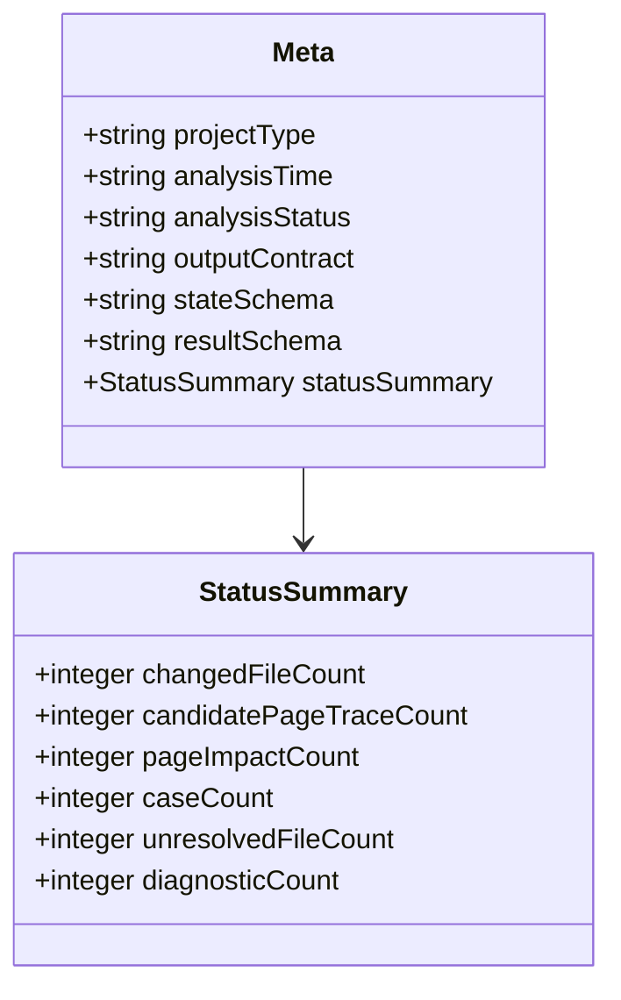
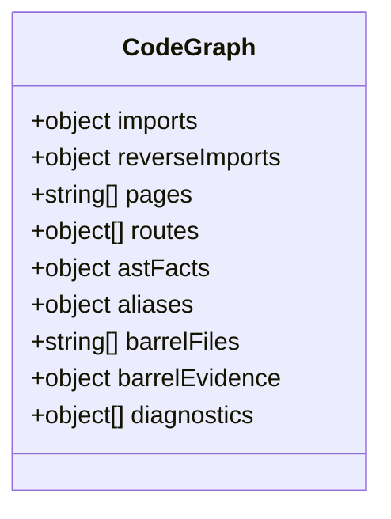
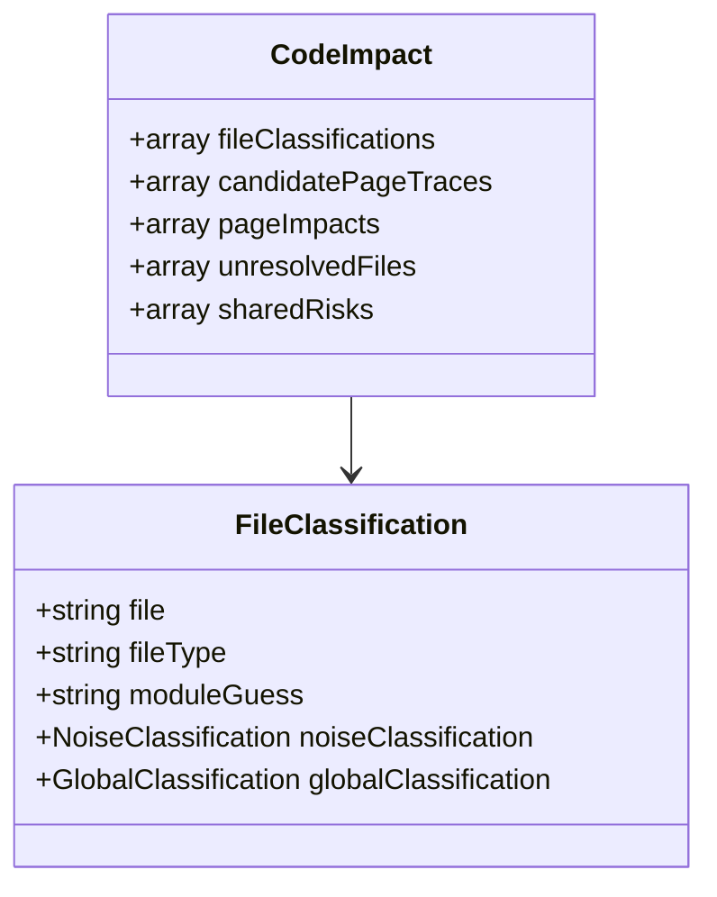
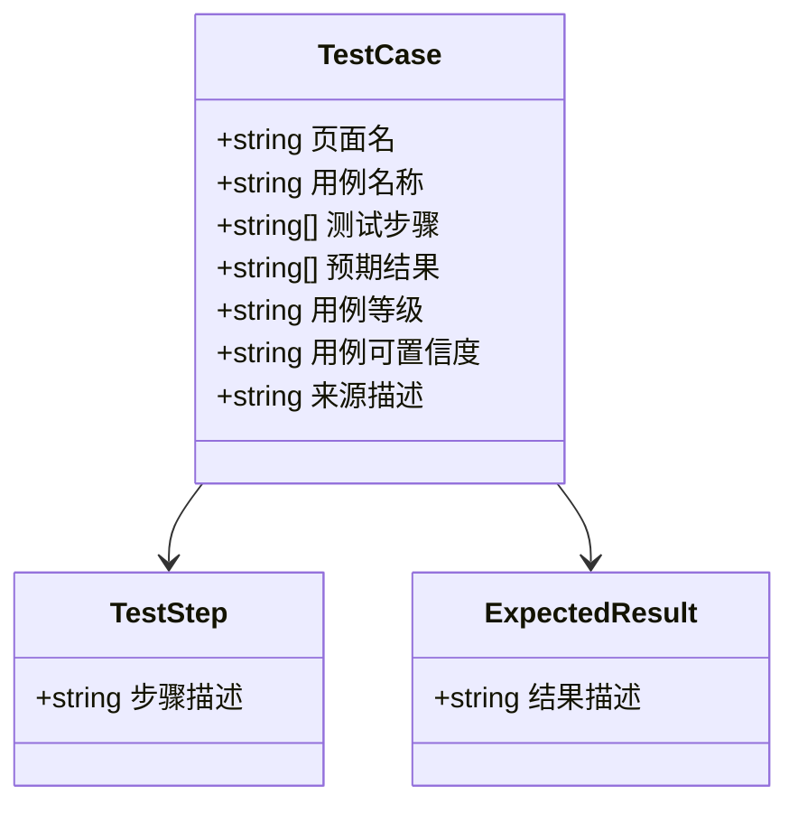
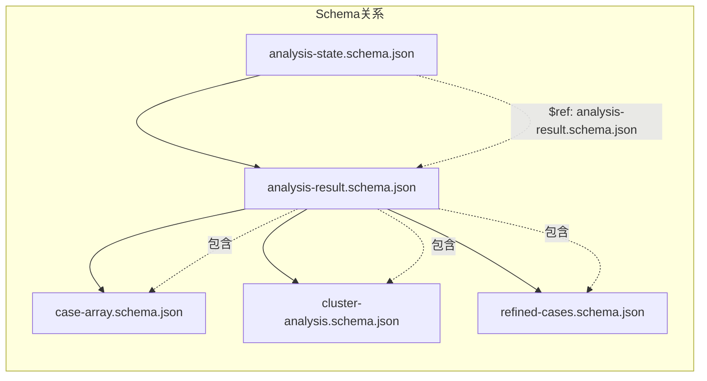
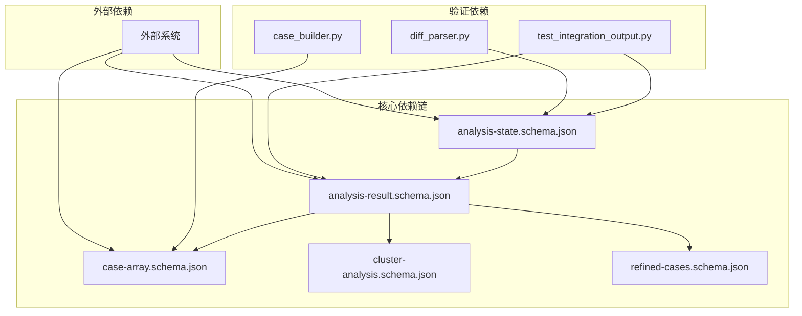

# JSON Schema定义

<cite>
**本文档中引用的文件**
- [analysis-state.schema.json](file://schemas/analysis-state.schema.json)
- [case-array.schema.json](file://schemas/case-array.schema.json)
- [analysis-result.schema.json](file://schemas/analysis-result.schema.json)
- [cluster-analysis.schema.json](file://schemas/cluster-analysis.schema.json)
- [refined-cases.schema.json](file://schemas/refined-cases.schema.json)
- [test_integration_output.py](file://tests/test_integration_output.py)
- [case_builder.py](file://scripts/analyzer/case_builder.py)
- [diff_parser.py](file://scripts/analyzer/diff_parser.py)
</cite>

## 目录
1. [简介](#简介)
2. [项目结构](#项目结构)
3. [核心组件](#核心组件)
4. [架构概览](#架构概览)
5. [详细组件分析](#详细组件分析)
6. [依赖关系分析](#依赖关系分析)
7. [性能考虑](#性能考虑)
8. [故障排除指南](#故障排除指南)
9. [结论](#结论)

## 简介

本文档提供了前端影响分析器JSON Schema定义的完整技术文档。该系统通过分析Git差异来识别前端变更的影响范围，并生成相应的测试用例和影响报告。文档重点涵盖了两个核心Schema文件：`analysis-state.schema.json`（分析状态Schema）和`case-array.schema.json`（用例数组Schema），详细说明了每个字段的类型、必填性、约束条件和验证规则。

## 项目结构

前端影响分析器采用模块化的架构设计，包含多个相互关联的JSON Schema文件，每个文件负责特定的数据结构定义：

**图表来源**
- [analysis-state.schema.json:1-238](file://schemas/analysis-state.schema.json#L1-L238)
- [analysis-result.schema.json:1-180](file://schemas/analysis-result.schema.json#L1-L180)
- [case-array.schema.json:1-51](file://schemas/case-array.schema.json#L1-L51)

**章节来源**
- [analysis-state.schema.json:1-238](file://schemas/analysis-state.schema.json#L1-L238)
- [case-array.schema.json:1-51](file://schemas/case-array.schema.json#L1-L51)

## 核心组件

### 分析状态Schema (analysis-state.schema.json)

分析状态Schema是整个系统的核心数据结构，定义了完整的分析过程状态信息。该Schema采用严格的对象结构，包含元数据、输入数据、解析后的差异、代码图谱、影响分析结果等关键组件。

#### 主要特性
- **严格验证**: 使用`additionalProperties: true`允许扩展字段
- **完整覆盖**: 包含分析过程的所有阶段状态
- **版本管理**: 通过`$id`和`$schema`字段实现版本控制
- **引用机制**: 支持内部Schema引用

#### 关键字段分类

| 字段类别 | 必填性 | 描述 |
|---------|--------|------|
| meta | 必填 | 分析元数据和状态信息 |
| input | 必填 | 原始输入数据 |
| parsedDiff | 必填 | 解析后的Git差异 |
| codeGraph | 必填 | 代码结构图谱 |
| codeImpact | 必填 | 代码影响分析结果 |
| candidateImpact | 必填 | 候选影响分析 |
| businessImpact | 可选 | 已弃用的业务影响信息 |
| workflow | 必填 | 工作流状态信息 |
| output | 引用 | 分析结果输出 |
| processLogs | 必填 | 处理日志记录 |

**章节来源**
- [analysis-state.schema.json:19-236](file://schemas/analysis-state.schema.json#L19-L236)

### 用例数组Schema (case-array.schema.json)

用例数组Schema专门用于定义测试用例的标准格式，采用中文字段名设计，体现了系统的国际化支持能力。

#### 设计特点
- **数组结构**: 整体为数组类型，支持多用例批量验证
- **严格字段**: 使用`additionalProperties: false`限制额外字段
- **中文字段**: 所有字段均使用中文命名
- **枚举约束**: 对等级和置信度进行严格限制

#### 字段规范

| 字段名 | 类型 | 必填性 | 枚举值 | 约束条件 |
|--------|------|--------|--------|----------|
| 页面名 | string | 必填 | - | 非空字符串 |
| 用例名称 | string | 必填 | - | 非空字符串 |
| 测试步骤 | array[string] | 必填 | - | 至少一个元素 |
| 预期结果 | array[string] | 必填 | - | 至少一个元素 |
| 用例等级 | string | 必填 | high, medium, low | 枚举限制 |
| 用例可置信度 | string | 必填 | high, medium, low | 枚举限制 |
| 来源描述 | string | 可选 | - | 字符串类型 |

**章节来源**
- [case-array.schema.json:6-49](file://schemas/case-array.schema.json#L6-L49)

## 架构概览

前端影响分析器采用分层架构设计，各Schema文件之间存在明确的依赖关系和数据流向：

**图表来源**
- [analysis-state.schema.json:230](file://schemas/analysis-state.schema.json#L230)
- [analysis-result.schema.json:125](file://schemas/analysis-result.schema.json#L125)
- [case-array.schema.json:1-51](file://schemas/case-array.schema.json#L1-L51)

### 数据流架构

**图表来源**
- [diff_parser.py:230-301](file://scripts/analyzer/diff_parser.py#L230-L301)
- [case_builder.py:22-121](file://scripts/analyzer/case_builder.py#L22-L121)

## 详细组件分析

### 分析状态Schema深度解析

分析状态Schema采用分层结构设计，每个层级都有明确的职责和验证规则：

#### 元数据层 (meta)
元数据层包含分析的基本信息和状态跟踪：

**图表来源**
- [analysis-state.schema.json:20-53](file://schemas/analysis-state.schema.json#L20-L53)

##### 状态枚举验证
分析状态支持四种状态：
- `running`: 分析进行中
- `success`: 分析成功完成
- `partial_success`: 部分分析成功
- `failed`: 分析失败

**章节来源**
- [analysis-state.schema.json:34-37](file://schemas/analysis-state.schema.json#L34-L37)

#### 输入数据层 (input)
输入数据层支持两种主要输入格式：

| 字段 | 类型 | 描述 | 示例 |
|------|------|------|------|
| requirementText | string | 用户需求文本 | "用户应该能够搜索产品" |
| gitDiffText | string | Git差异文本 | "diff --git ..." |

**章节来源**
- [analysis-state.schema.json:55-62](file://schemas/analysis-state.schema.json#L55-L62)

#### 代码图谱层 (codeGraph)
代码图谱层提供完整的代码结构信息：

**图表来源**
- [analysis-state.schema.json:78-103](file://schemas/analysis-state.schema.json#L78-L103)

##### 图谱组件说明
- **imports/reverseImports**: 模块导入关系映射
- **pages/routes**: 页面和路由配置信息
- **astFacts**: 抽象语法树事实
- **barrelFiles/barrelEvidence**: 框架导出文件信息
- **diagnostics**: 诊断信息集合

**章节来源**
- [analysis-state.schema.json:82-102](file://schemas/analysis-state.schema.json#L82-L102)

#### 影响分析层 (codeImpact)
影响分析层包含多层次的影响评估：

**图表来源**
- [analysis-state.schema.json:105-171](file://schemas/analysis-state.schema.json#L105-L171)

##### 文件分类机制
文件分类包含两个维度的评估：
- **噪声分类 (noiseClassification)**: 识别和评估噪声文件
- **全局分类 (globalClassification)**: 评估文件的全局影响

**章节来源**
- [analysis-state.schema.json:110-151](file://schemas/analysis-state.schema.json#L110-L151)

### 用例数组Schema详细说明

用例数组Schema采用标准化的测试用例格式，支持中文字段名以适应中文开发环境：

#### 用例结构定义

**图表来源**
- [case-array.schema.json:6-49](file://schemas/case-array.schema.json#L6-L49)

#### 等级和置信度体系

| 等级/置信度 | 定义 | 用途 |
|------------|------|------|
| high | 高质量，高度可信 | 关键功能测试 |
| medium | 中等质量，中等可信 | 标准功能测试 |
| low | 低质量，低可信度 | 边缘功能测试 |

**章节来源**
- [case-array.schema.json:37-47](file://schemas/case-array.schema.json#L37-L47)

### 分析结果Schema关联

分析状态Schema通过引用机制与分析结果Schema建立关联：

**图表来源**
- [analysis-state.schema.json:230](file://schemas/analysis-state.schema.json#L230)
- [analysis-result.schema.json:125](file://schemas/analysis-result.schema.json#L125)

**章节来源**
- [analysis-state.schema.json:229-231](file://schemas/analysis-state.schema.json#L229-L231)

## 依赖关系分析

### Schema间依赖关系

前端影响分析器的Schema文件之间存在复杂的依赖关系，形成了一个完整的验证生态系统：

**图表来源**
- [test_integration_output.py:62-89](file://tests/test_integration_output.py#L62-L89)
- [case_builder.py:22-121](file://scripts/analyzer/case_builder.py#L22-L121)
- [diff_parser.py:230-301](file://scripts/analyzer/diff_parser.py#L230-L301)

### 版本兼容性矩阵

| Schema文件 | 版本 | 兼容性 | 依赖关系 |
|-----------|------|--------|----------|
| analysis-state.schema.json | v1.0 | 完全兼容 | 引用analysis-result.schema.json |
| analysis-result.schema.json | v1.0 | 完全兼容 | 包含所有子Schema |
| case-array.schema.json | v1.0 | 完全兼容 | 被analysis-result引用 |
| cluster-analysis.schema.json | v1.0 | 完全兼容 | 被analysis-result引用 |
| refined-cases.schema.json | v1.0 | 完全兼容 | 被analysis-result引用 |

**章节来源**
- [test_integration_output.py:62-89](file://tests/test_integration_output.py#L62-L89)

## 性能考虑

### Schema验证性能优化

前端影响分析器在设计时充分考虑了Schema验证的性能影响：

#### 验证策略
- **延迟验证**: 在需要时才进行Schema验证
- **增量验证**: 仅验证发生变化的数据部分
- **缓存机制**: 缓存已验证的有效数据

#### 性能指标
- **验证时间**: 单个Schema验证通常在毫秒级别
- **内存占用**: Schema定义占用相对较小的内存空间
- **并发处理**: 支持多Schema并行验证

### 数据结构优化

#### 数组验证优化
- **批量验证**: 支持数组元素的批量验证
- **索引优化**: 为常用字段建立索引
- **分页处理**: 大数组支持分页处理

**章节来源**
- [analysis-result.schema.json:125-173](file://schemas/analysis-result.schema.json#L125-L173)

## 故障排除指南

### 常见验证错误及解决方案

#### 字段缺失错误
**错误类型**: 必填字段未提供
**解决方法**: 
1. 检查Schema定义中的`required`数组
2. 确保所有必需字段都已提供
3. 验证字段名称拼写正确

#### 类型不匹配错误
**错误类型**: 字段类型不符合Schema定义
**解决方法**:
1. 检查字段的实际数据类型
2. 确认Schema中定义的类型
3. 进行类型转换或修正数据

#### 枚举值错误
**错误类型**: 枚举值不在允许范围内
**解决方法**:
1. 查看枚举定义的允许值
2. 将值调整为允许的枚举之一
3. 验证业务逻辑的正确性

### 调试工具和技巧

#### Schema验证调试
- **逐层验证**: 从顶层开始逐层验证
- **字段定位**: 使用错误消息定位具体字段
- **数据对比**: 对比实际数据与Schema定义

#### 性能监控
- **验证时间**: 监控Schema验证的耗时
- **内存使用**: 监控验证过程的内存占用
- **错误统计**: 统计常见错误类型和频率

**章节来源**
- [test_integration_output.py:62-89](file://tests/test_integration_output.py#L62-L89)

## 结论

前端影响分析器的JSON Schema定义展现了现代软件工程中数据验证的最佳实践。通过精心设计的Schema结构，系统实现了：

1. **完整性保证**: 通过严格的字段定义确保数据完整性
2. **一致性维护**: 通过枚举和约束条件维护数据一致性
3. **可扩展性**: 通过引用机制支持Schema的演进和扩展
4. **可维护性**: 通过清晰的层次结构提高代码可维护性

这些Schema文件不仅为前端影响分析器提供了强大的数据验证能力，也为外部系统集成了标准的数据交换格式，为未来的系统扩展和集成奠定了坚实的基础。