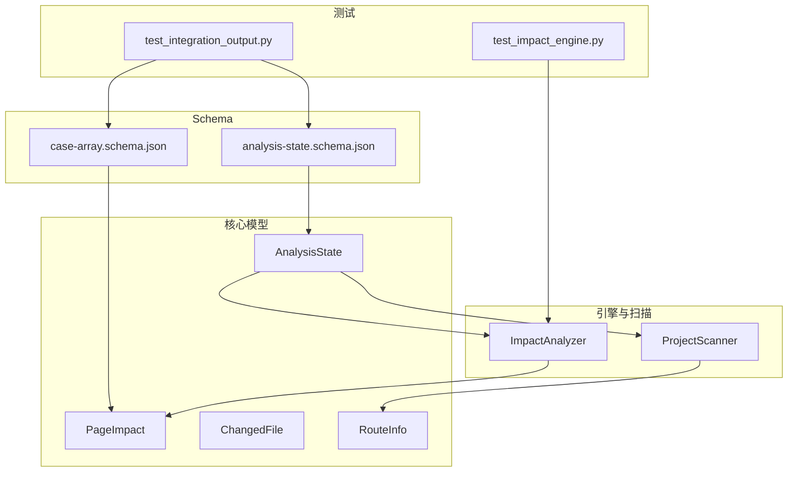
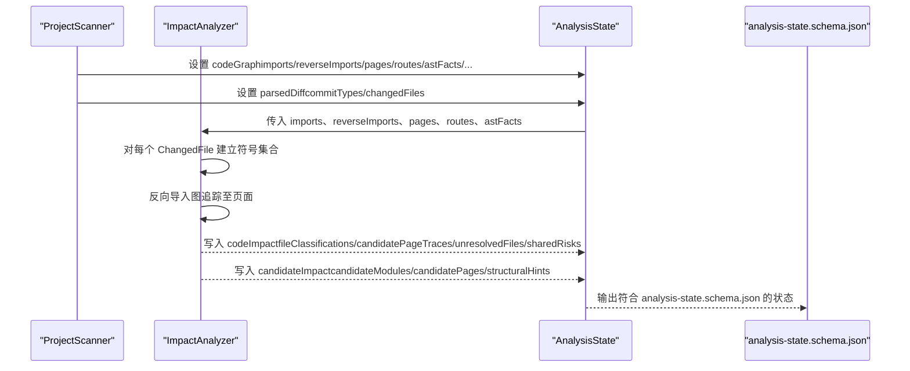
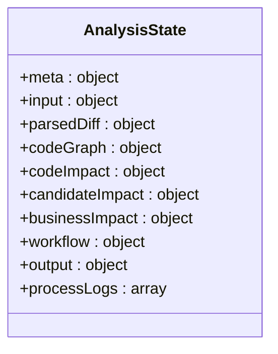
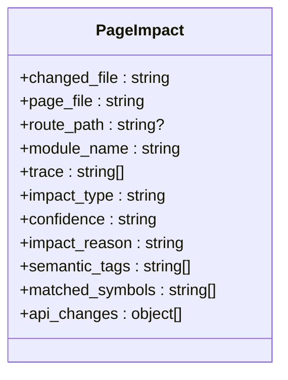
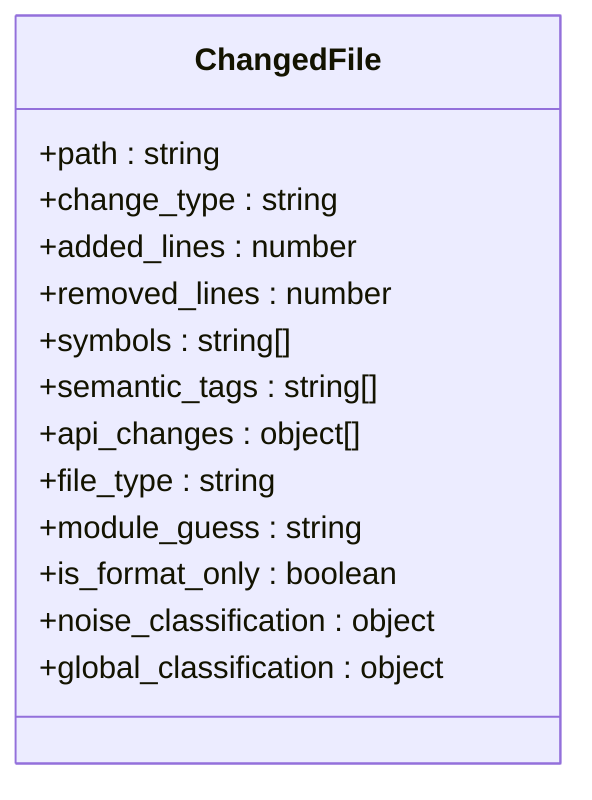
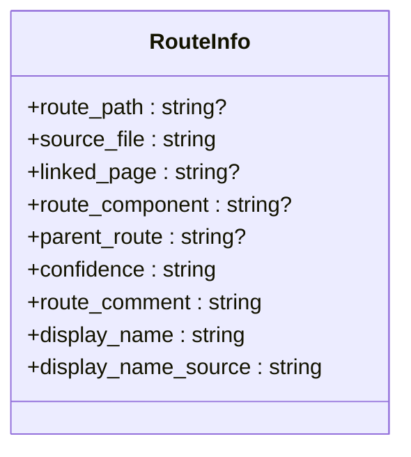
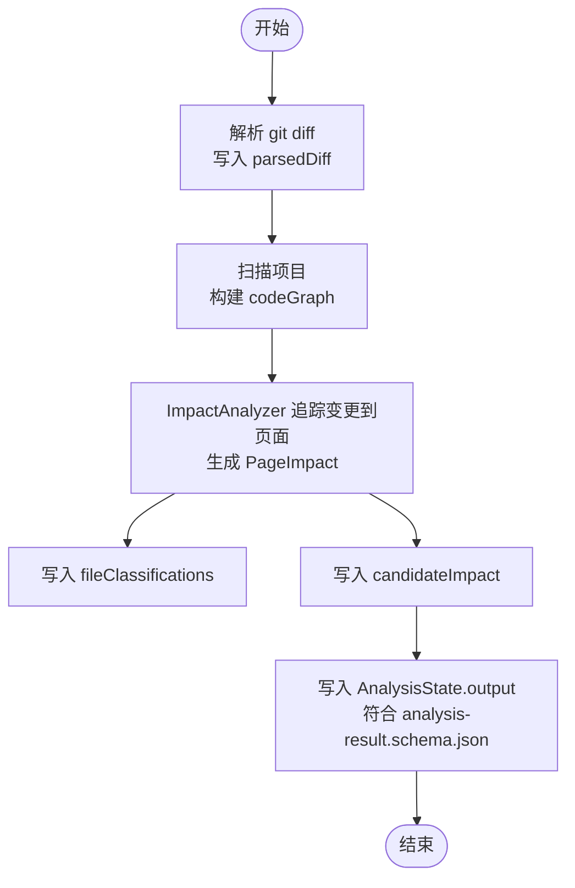
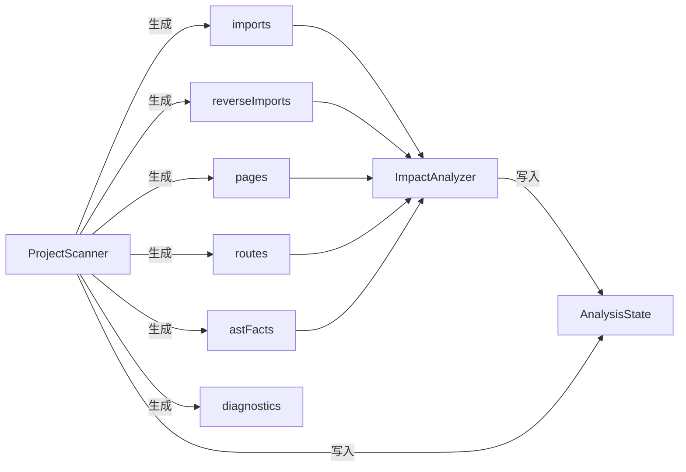

# 数据模型与Schema

<cite>
**本文引用的文件**
- [analysis-state.schema.json](file://schemas/analysis-state.schema.json)
- [case-array.schema.json](file://schemas/case-array.schema.json)
- [models.py](file://scripts/analyzer/models.py)
- [impact_engine.py](file://scripts/analyzer/impact_engine.py)
- [project_scanner.py](file://scripts/analyzer/project_scanner.py)
- [test_integration_output.py](file://tests/test_integration_output.py)
- [test_impact_engine.py](file://tests/test_impact_engine.py)
</cite>

## 目录
1. [简介](#简介)
2. [项目结构](#项目结构)
3. [核心组件](#核心组件)
4. [架构总览](#架构总览)
5. [详细组件分析](#详细组件分析)
6. [依赖分析](#依赖分析)
7. [性能考虑](#性能考虑)
8. [故障排查指南](#故障排查指南)
9. [结论](#结论)
10. [附录](#附录)

## 简介
本文件系统性地梳理前端影响分析器中的数据模型与Schema，重点覆盖以下内容：
- 核心数据结构：AnalysisState、PageImpact、ChangedFile、RouteInfo 的字段定义、数据类型与约束条件
- JSON Schema 定义：analysis-state.schema.json 与 case-array.schema.json 的完整结构与验证规则
- 数据模型间的关系与依赖
- 数据流转过程与状态转换
- 实际数据示例与验证规则指引

## 项目结构
围绕数据模型与Schema的关键文件组织如下：
- schemas 目录：存放分析状态与用例数组的JSON Schema
- scripts/analyzer/models.py：Python数据类与状态容器，承载核心数据结构
- scripts/analyzer/impact_engine.py：基于AST与导入关系进行影响追踪的核心引擎
- scripts/analyzer/project_scanner.py：项目扫描与路由解析，生成导入图与AST事实
- tests：集成测试验证Schema有效性与输出一致性

图表来源
- [analysis-state.schema.json:1-238](file://schemas/analysis-state.schema.json#L1-L238)
- [case-array.schema.json:1-51](file://schemas/case-array.schema.json#L1-L51)
- [models.py:116-201](file://scripts/analyzer/models.py#L116-L201)
- [impact_engine.py:10-188](file://scripts/analyzer/impact_engine.py#L10-L188)
- [project_scanner.py:13-80](file://scripts/analyzer/project_scanner.py#L13-L80)
- [test_integration_output.py:1-90](file://tests/test_integration_output.py#L1-L90)
- [test_impact_engine.py:1-85](file://tests/test_impact_engine.py#L1-L85)

章节来源
- [analysis-state.schema.json:1-238](file://schemas/analysis-state.schema.json#L1-L238)
- [case-array.schema.json:1-51](file://schemas/case-array.schema.json#L1-L51)
- [models.py:116-201](file://scripts/analyzer/models.py#L116-L201)
- [impact_engine.py:10-188](file://scripts/analyzer/impact_engine.py#L10-L188)
- [project_scanner.py:13-80](file://scripts/analyzer/project_scanner.py#L13-L80)
- [test_integration_output.py:1-90](file://tests/test_integration_output.py#L1-L90)
- [test_impact_engine.py:1-85](file://tests/test_impact_engine.py#L1-L85)

## 核心组件
本节从“字段定义、数据类型、约束条件”三个维度，系统化说明核心数据结构。

- AnalysisState（分析状态）
  - 字段与类型
    - meta: object（附加属性允许），必需字段包含 projectType、analysisTime、analysisStatus、outputContract、stateSchema、resultSchema 及 statusSummary
    - input: object（附加属性允许），包含 requirementText、gitDiffText
    - parsedDiff: object（附加属性允许），必需字段 commitTypes、changedFiles；前者为字符串数组，后者为对象数组
    - codeGraph: object（附加属性允许），包含 imports、reverseImports、pages（字符串数组）、routes（对象数组）、astFacts、aliases、barrelFiles、barrelEvidence、diagnostics
    - codeImpact: object（附加属性允许），必需字段 fileClassifications、candidatePageTraces、pageImpacts、unresolvedFiles、sharedRisks
    - candidateImpact: object（附加属性允许），必需字段 candidateModules、candidatePages、structuralHints
    - businessImpact: object（附加属性允许），兼容字段（已标注弃用），包含 affectedModules、affectedPages、affectedFunctions、deprecated
    - workflow: object（附加属性允许），包含 manifest、preflight、documentIndex、diffIndex、fileImpactSeeds、changeClusters、clusterAnalysisTasks、clusterContexts、coverage
    - output: object（引用 analysis-result.schema.json）
    - processLogs: array（对象数组）
  - 约束与语义
    - analysisStatus 枚举限定为 "running" | "success" | "partial_success" | "failed"
    - statusSummary 中各计数字段为非负整数
    - codeImpact 中 pageImpacts 为 candidatePageTraces 的兼容别名
    - businessImpact 已弃用，建议使用 candidateImpact

- PageImpact（页面影响）
  - 字段与类型
    - changed_file: string
    - page_file: string
    - route_path: string | null
    - module_name: string
    - trace: string[]（路径序列）
    - impact_type: string
    - confidence: string
    - impact_reason: string
    - semantic_tags: string[]
    - matched_symbols: string[]
    - api_changes: object[]（键值对数组）
  - 约束与语义
    - confidence 由引擎根据文件类型与追踪深度推断
    - trace 末端为页面文件

- ChangedFile（变更文件）
  - 字段与类型
    - path: string
    - change_type: string
    - added_lines、removed_lines: integer（默认0）
    - symbols、semantic_tags: string[]
    - api_changes: object[]（键值对数组）
    - file_type: string（默认"unknown"）
    - module_guess: string（默认"unknown"）
    - is_format_only: boolean（默认false）
    - noise_classification、global_classification: object（默认空字典）

- RouteInfo（路由信息）
  - 字段与类型
    - route_path: string | null
    - source_file: string
    - linked_page、route_component、parent_route: string | null
    - confidence: string（默认"medium"）
    - route_comment、display_name、display_name_source: string（默认空串）

章节来源
- [analysis-state.schema.json:19-236](file://schemas/analysis-state.schema.json#L19-L236)
- [models.py:116-201](file://scripts/analyzer/models.py#L116-L201)
- [models.py:26-53](file://scripts/analyzer/models.py#L26-L53)
- [models.py:77-90](file://scripts/analyzer/models.py#L77-L90)
- [models.py:42-53](file://scripts/analyzer/models.py#L42-L53)

## 架构总览
下图展示了从项目扫描到影响分析再到状态落盘的整体流程，以及数据模型之间的关系。

图表来源
- [project_scanner.py:20-80](file://scripts/analyzer/project_scanner.py#L20-L80)
- [impact_engine.py:26-58](file://scripts/analyzer/impact_engine.py#L26-L58)
- [models.py:175-201](file://scripts/analyzer/models.py#L175-L201)
- [analysis-state.schema.json:19-236](file://schemas/analysis-state.schema.json#L19-L236)

章节来源
- [project_scanner.py:20-80](file://scripts/analyzer/project_scanner.py#L20-L80)
- [impact_engine.py:26-58](file://scripts/analyzer/impact_engine.py#L26-L58)
- [models.py:175-201](file://scripts/analyzer/models.py#L175-L201)
- [analysis-state.schema.json:19-236](file://schemas/analysis-state.schema.json#L19-L236)

## 详细组件分析

### AnalysisState 数据模型
- 结构要点
  - 必需根字段：meta、input、parsedDiff、codeGraph、codeImpact、candidateImpact、businessImpact、workflow、output、processLogs
  - meta.statusSummary 提供统计指标（变更文件数、候选页面追踪数、页面影响数、用例数、未解析文件数、诊断数），均为非负整数
  - codeImpact.pageImpacts 与 candidatePageTraces 互为兼容字段
  - businessImpact 已弃用，建议使用 candidateImpact
  - output 通过 $ref 引用 analysis-result.schema.json

图表来源
- [models.py:116-161](file://scripts/analyzer/models.py#L116-L161)
- [analysis-state.schema.json:19-236](file://schemas/analysis-state.schema.json#L19-L236)

章节来源
- [models.py:116-161](file://scripts/analyzer/models.py#L116-L161)
- [analysis-state.schema.json:19-236](file://schemas/analysis-state.schema.json#L19-L236)

### PageImpact 数据模型
- 用途：描述从变更文件到页面的影响路径与置信度
- 关键字段
  - changed_file、page_file、route_path、module_name、trace、impact_type、confidence、impact_reason
  - semantic_tags、matched_symbols、api_changes 用于语义与接口风险刻画
- 影响类型与置信度
  - 影响类型：直接（page/route/business-component/api/hook/store）与间接（其他）
  - 置信度：依据文件类型与追踪深度综合判定

图表来源
- [models.py:77-90](file://scripts/analyzer/models.py#L77-L90)
- [impact_engine.py:168-187](file://scripts/analyzer/impact_engine.py#L168-L187)

章节来源
- [models.py:77-90](file://scripts/analyzer/models.py#L77-L90)
- [impact_engine.py:168-187](file://scripts/analyzer/impact_engine.py#L168-L187)

### ChangedFile 数据模型
- 用途：记录变更文件的元信息与分类结果
- 关键字段
  - path、change_type、added_lines、removed_lines、symbols、semantic_tags、api_changes
  - file_type、module_guess、is_format_only、noise_classification、global_classification

图表来源
- [models.py:26-40](file://scripts/analyzer/models.py#L26-L40)

章节来源
- [models.py:26-40](file://scripts/analyzer/models.py#L26-L40)

### RouteInfo 数据模型
- 用途：描述路由与页面的绑定关系及显示信息
- 关键字段
  - route_path、source_file、linked_page、route_component、parent_route、confidence、route_comment、display_name、display_name_source

图表来源
- [models.py:42-53](file://scripts/analyzer/models.py#L42-L53)
- [project_scanner.py:128-227](file://scripts/analyzer/project_scanner.py#L128-L227)

章节来源
- [models.py:42-53](file://scripts/analyzer/models.py#L42-L53)
- [project_scanner.py:128-227](file://scripts/analyzer/project_scanner.py#L128-L227)

### JSON Schema：analysis-state.schema.json
- 根级别必需字段：见上文 AnalysisState
- 元数据与统计：meta.statusSummary 计数字段最小值为0
- 兼容字段：businessImpact 已弃用；pageImpacts 为 candidatePageTraces 的兼容别名
- 输出引用：output 通过 $ref 指向 analysis-result.schema.json

章节来源
- [analysis-state.schema.json:19-236](file://schemas/analysis-state.schema.json#L19-L236)

### JSON Schema：case-array.schema.json
- 数组项必需字段（中文键名）：页面名、用例名称、测试步骤、预期结果、用例等级、用例可置信度、来源描述
- 用例等级与可置信度枚举：high | medium | low
- 测试步骤与预期结果：字符串数组

章节来源
- [case-array.schema.json:6-48](file://schemas/case-array.schema.json#L6-L48)

### 数据流与状态转换
- 输入阶段
  - 解析 git diff，得到 commitTypes 与 changedFiles，写入 parsedDiff
  - 扫描项目，构建 imports、reverseImports、pages、routes、astFacts、aliases、barrelFiles、barrelEvidence、diagnostics，写入 codeGraph
- 分析阶段
  - ImpactAnalyzer 基于反向导入图与 AST 事实追踪变更到页面，生成 PageImpact 列表
  - 将 ChangedFile 的分类与噪声/全局分类写入 codeImpact.fileClassifications
  - 识别候选模块、页面与结构化提示，写入 candidateImpact
- 输出阶段
  - AnalysisState.output 引用 analysis-result.schema.json
  - meta 中包含 analysisStatus、outputContract、stateSchema、resultSchema 与 statusSummary

图表来源
- [project_scanner.py:20-80](file://scripts/analyzer/project_scanner.py#L20-L80)
- [impact_engine.py:26-58](file://scripts/analyzer/impact_engine.py#L26-L58)
- [models.py:175-201](file://scripts/analyzer/models.py#L175-L201)
- [analysis-state.schema.json:19-236](file://schemas/analysis-state.schema.json#L19-L236)

章节来源
- [project_scanner.py:20-80](file://scripts/analyzer/project_scanner.py#L20-L80)
- [impact_engine.py:26-58](file://scripts/analyzer/impact_engine.py#L26-L58)
- [models.py:175-201](file://scripts/analyzer/models.py#L175-L201)
- [analysis-state.schema.json:19-236](file://schemas/analysis-state.schema.json#L19-L236)

### 实际数据示例与验证规则
- 示例与断言参考
  - AnalysisState.output 的 cases/fallbackCases 为空数组，analysisStatus 为 partial_success，outputContract 为 analysis-package-v2，meta 中包含 stateSchema 与 resultSchema 的引用
  - codeImpact 中 candidatePageTraces 与 pageImpacts 相等，sharedRisks 包含共享组件风险提示
  - workflow.preflight.status 为 blocked，changeClusters.clusterCount 为1，clusterContexts[0].clusterId 为 "cluster-001"
  - statusSummary 各计数字段为非负整数
- Schema 验证
  - case-array.schema.json 的 items.required 键集合与中文字段一致
  - analysis-state.schema.json 的 properties.output.$ref 指向 analysis-result.schema.json

章节来源
- [test_integration_output.py:9-59](file://tests/test_integration_output.py#L9-L59)
- [test_integration_output.py:62-90](file://tests/test_integration_output.py#L62-L90)
- [case-array.schema.json:6-48](file://schemas/case-array.schema.json#L6-L48)
- [analysis-state.schema.json:230-230](file://schemas/analysis-state.schema.json#L230-L230)

## 依赖分析
- 组件耦合
  - ImpactAnalyzer 依赖 imports、reverseImports、pages、routes、astFacts
  - ProjectScanner 产出 imports、reverseImports、pages、routes、astFacts、diagnostics，并解析别名与路由记录
  - AnalysisState 作为统一载体，被多个模块写入
- 外部依赖
  - JSON Schema 通过 $ref 引用 analysis-result.schema.json
  - 测试模块验证 Schema 文件存在且结构有效

图表来源
- [project_scanner.py:20-80](file://scripts/analyzer/project_scanner.py#L20-L80)
- [impact_engine.py:10-18](file://scripts/analyzer/impact_engine.py#L10-L18)
- [models.py:175-201](file://scripts/analyzer/models.py#L175-L201)

章节来源
- [project_scanner.py:20-80](file://scripts/analyzer/project_scanner.py#L20-L80)
- [impact_engine.py:10-18](file://scripts/analyzer/impact_engine.py#L10-L18)
- [models.py:175-201](file://scripts/analyzer/models.py#L175-L201)

## 性能考虑
- 追踪复杂度
  - 反向导入图 BFS 追踪页面，时间复杂度与边数与节点数相关；可通过去重与严格符号匹配降低无效分支
- 符号匹配策略
  - 在第一跳仅保留与当前活跃符号匹配的绑定，避免全量传播导致的爆炸式扩展
- 依赖解析
  - tsconfig 别名解析与候选文件扩展会增加 IO 与路径计算成本，建议缓存解析结果与候选集

## 故障排查指南
- 常见问题与定位
  - 无法绑定路由到页面：ProjectScanner 在 _append_route_record 中记录 "unbound-route" 诊断
  - 无法解析导入：ProjectScanner 在解析导入时记录 "unresolved-import" 诊断
  - 格式变更不触发影响：ImpactAnalyzer 在 analyze_file 中跳过 is_format_only=true 的文件
- 建议排查步骤
  - 检查 codeGraph.diagnostics 是否存在未解析导入或未绑定路由
  - 确认 ChangedFile.is_format_only 与 noise/global 分类是否正确
  - 核对 AnalysisState.meta.analysisStatus 与 statusSummary 计数是否符合预期

章节来源
- [project_scanner.py:44-50](file://scripts/analyzer/project_scanner.py#L44-L50)
- [project_scanner.py:193-199](file://scripts/analyzer/project_scanner.py#L193-L199)
- [impact_engine.py:27-28](file://scripts/analyzer/impact_engine.py#L27-L28)
- [test_impact_engine.py:66-85](file://tests/test_impact_engine.py#L66-L85)

## 结论
本文系统化梳理了 AnalysisState、PageImpact、ChangedFile、RouteInfo 的字段定义、数据类型与约束，并结合 analysis-state.schema.json 与 case-array.schema.json 的结构说明了验证规则。通过 ImpactAnalyzer 与 ProjectScanner 的协作，实现了从项目扫描到影响追踪再到状态落盘的完整数据流。测试用例进一步验证了 Schema 的有效性与输出的一致性。建议在后续迭代中逐步淘汰 businessImpact，统一使用 candidateImpact，并持续优化符号匹配与依赖解析策略以提升性能与稳定性。

## 附录
- 字段与类型速查
  - AnalysisState.meta.analysisStatus：枚举 "running" | "success" | "partial_success" | "failed"
  - AnalysisState.codeImpact.pageImpacts：兼容字段，与 candidatePageTraces 等价
  - PageImpact.confidence：由引擎按文件类型与追踪深度推断
  - RouteInfo.confidence：默认 "medium"，若绑定页面则提升为 "high"
- 相关测试断言
  - test_integration_output.py 验证 AnalysisState.output、meta、workflow、codeImpact、output 的结构与值
  - test_impact_engine.py 验证追踪路径、置信度与符号匹配逻辑