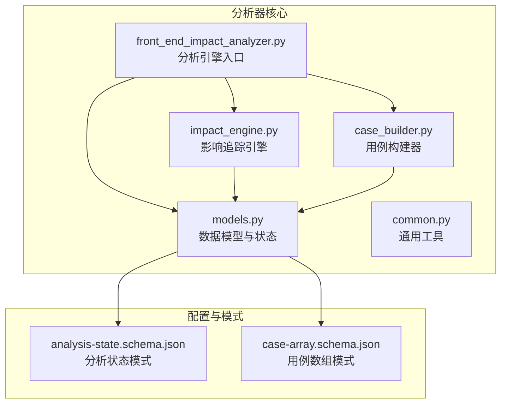
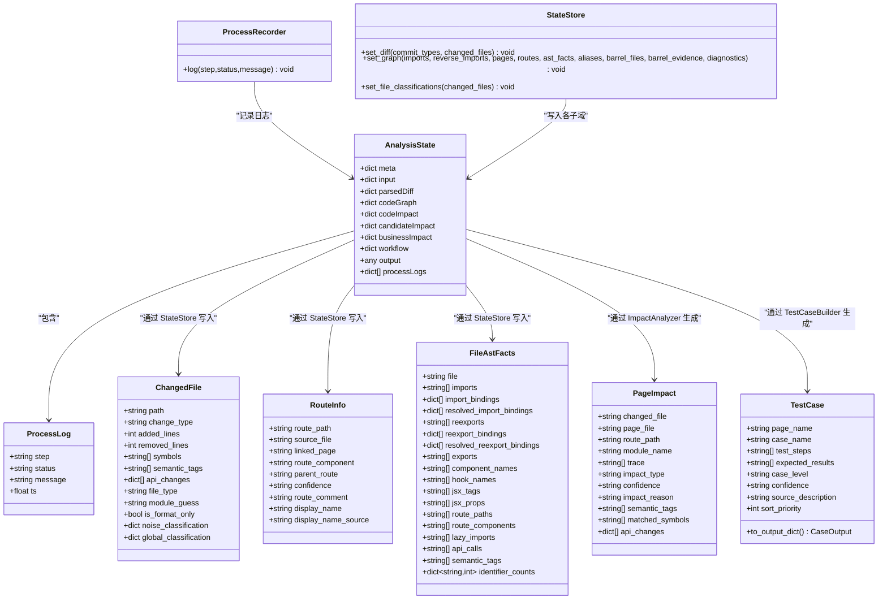
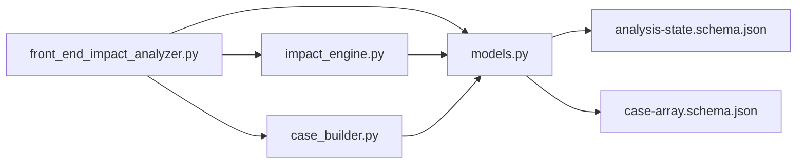

# 核心数据结构

<cite>
**本文引用的文件**
- [scripts/analyzer/models.py](file://scripts/analyzer/models.py)
- [scripts/analyzer/impact_engine.py](file://scripts/analyzer/impact_engine.py)
- [scripts/analyzer/case_builder.py](file://scripts/analyzer/case_builder.py)
- [scripts/analyzer/common.py](file://scripts/analyzer/common.py)
- [scripts/front_end_impact_analyzer.py](file://scripts/front_end_impact_analyzer.py)
- [schemas/analysis-state.schema.json](file://schemas/analysis-state.schema.json)
- [schemas/case-array.schema.json](file://schemas/case-array.schema.json)
- [tests/test_ast_analyzer.py](file://tests/test_ast_analyzer.py)
- [tests/test_impact_engine.py](file://tests/test_impact_engine.py)
</cite>

## 目录
1. [简介](#简介)
2. [项目结构](#项目结构)
3. [核心组件](#核心组件)
4. [架构总览](#架构总览)
5. [详细组件分析](#详细组件分析)
6. [依赖分析](#依赖分析)
7. [性能考虑](#性能考虑)
8. [故障排查指南](#故障排查指南)
9. [结论](#结论)
10. [附录](#附录)

## 简介
本文件系统性梳理前端影响分析器中的核心数据结构，包括 AnalysisState、ChangedFile、PageImpact、RouteInfo、FileAstFacts、TestCase 等，覆盖字段定义、默认值、约束条件、字段级注释、序列化/反序列化方法、数据结构间的关系与依赖，并给出在分析流程中的使用示例与最佳实践。目标是帮助开发者快速理解并正确使用这些数据模型。

## 项目结构
本项目采用模块化设计，核心数据模型集中在 analyzer 模块的 models.py 中，分析流程在 front_end_impact_analyzer.py 中编排，影响追踪在 impact_engine.py 中实现，用例模板生成在 case_builder.py 中实现，通用工具函数在 common.py 中提供。

图表来源
- [scripts/analyzer/models.py:1-201](file://scripts/analyzer/models.py#L1-L201)
- [scripts/analyzer/impact_engine.py:1-188](file://scripts/analyzer/impact_engine.py#L1-L188)
- [scripts/analyzer/case_builder.py:1-228](file://scripts/analyzer/case_builder.py#L1-L228)
- [scripts/analyzer/common.py:1-151](file://scripts/analyzer/common.py#L1-L151)
- [scripts/front_end_impact_analyzer.py:1-403](file://scripts/front_end_impact_analyzer.py#L1-L403)
- [schemas/analysis-state.schema.json:1-238](file://schemas/analysis-state.schema.json#L1-L238)
- [schemas/case-array.schema.json:1-51](file://schemas/case-array.schema.json#L1-L51)

章节来源
- [scripts/analyzer/models.py:1-201](file://scripts/analyzer/models.py#L1-L201)
- [scripts/front_end_impact_analyzer.py:1-403](file://scripts/front_end_impact_analyzer.py#L1-L403)

## 核心组件
本节概述六大核心数据结构：AnalysisState、ChangedFile、PageImpact、RouteInfo、FileAstFacts、TestCase 的职责与典型用途。

- AnalysisState：承载整个分析过程的状态，包含元信息、输入、解析后的 diff、代码图谱、影响结果、候选影响、业务影响、工作流上下文、输出以及进程日志。
- ChangedFile：描述变更文件的属性，如路径、变更类型、增删行数、涉及符号、语义标签、API 变更、文件类型、模块猜测、格式化变更标记、噪声分类与全局分类等。
- PageImpact：描述从变更文件到页面的影响轨迹，包含变更文件、页面文件、路由路径、模块名、追踪路径、影响类型、置信度、影响原因、语义标签、匹配符号、API 变更等。
- RouteInfo：描述路由信息，包含路由路径、源文件、关联页面、路由组件、父路由、置信度、路由注释、显示名及其来源等。
- FileAstFacts：描述文件的 AST 提取事实，包含导入、导入绑定、已解析导入绑定、再导出、再导出绑定、已解析再导出绑定、导出、组件名、Hook 名、JSX 标签、JSX 属性、路由路径、路由组件、懒加载导入、API 调用、语义标签、标识符计数等。
- TestCase：描述测试用例，包含页面名、用例名、测试步骤、预期结果、用例等级、置信度、来源描述、排序优先级，并提供 to_output_dict 方法用于输出字典。

章节来源
- [scripts/analyzer/models.py:8-201](file://scripts/analyzer/models.py#L8-L201)

## 架构总览
下面的类图展示了核心数据结构之间的关系与依赖，以及它们在分析流程中的位置。

图表来源
- [scripts/analyzer/models.py:8-201](file://scripts/analyzer/models.py#L8-L201)

## 详细组件分析

### AnalysisState（分析状态）
- 定位：顶层状态容器，贯穿整个分析生命周期。
- 字段与默认值：
  - meta: 字典，默认空对象，包含项目类型、分析时间、分析状态、输出契约、状态模式、结果模式及状态摘要。
  - input: 字典，默认空对象，包含需求文本与 git diff 文本。
  - parsedDiff: 字典，默认包含 commitTypes 与 changedFiles。
  - codeGraph: 字典，默认包含 imports、reverseImports、pages、routes、astFacts、aliases、barrelFiles、barrelEvidence、diagnostics。
  - codeImpact: 字典，默认包含 fileClassifications、candidatePageTraces、pageImpacts、unresolvedFiles、sharedRisks。
  - candidateImpact: 字典，默认包含 candidateModules、candidatePages、structuralHints。
  - businessImpact: 字典，默认包含 affectedModules、affectedPages、affectedFunctions、deprecated。
  - workflow: 字典，默认包含 manifest、preflight、diffIndex、fileImpactSeeds、changeClusters、clusterAnalysisTasks、clusterContexts、coverage。
  - output: 任意类型，默认空字典。
  - processLogs: 列表，默认空列表。
- 约束与规则：
  - meta 中 analysisStatus 支持枚举值："running"、"success"、"partial_success"、"failed"。
  - codeImpact 的 pageImpacts 为 candidatePageTraces 的兼容别名。
  - businessImpact 已标记为兼容字段，建议使用 candidateImpact。
- 使用示例路径：
  - 初始化与写入运行工件：[scripts/front_end_impact_analyzer.py:39-174](file://scripts/front_end_impact_analyzer.py#L39-L174)
  - JSON 模式校验：[schemas/analysis-state.schema.json:1-238](file://schemas/analysis-state.schema.json#L1-L238)

章节来源
- [scripts/analyzer/models.py:115-161](file://scripts/analyzer/models.py#L115-L161)
- [scripts/front_end_impact_analyzer.py:39-174](file://scripts/front_end_impact_analyzer.py#L39-L174)
- [schemas/analysis-state.schema.json:1-238](file://schemas/analysis-state.schema.json#L1-L238)

### ChangedFile（变更文件）
- 定位：描述单个变更文件的属性，作为分析输入之一。
- 字段与默认值：
  - path: 字符串，变更文件路径。
  - change_type: 字符串，变更类型（如新增、修改、删除）。
  - added_lines: 整数，默认 0。
  - removed_lines: 整数，默认 0。
  - symbols: 字符串列表，默认空列表，表示变更涉及的符号集合。
  - semantic_tags: 字符串列表，默认空列表，表示语义标签（如 form、table、button 等）。
  - api_changes: 字典列表，默认空列表，表示 API 变更细节（如 kind、字段等）。
  - file_type: 字符串，默认 "unknown"，由 SourceClassifier 分类。
  - module_guess: 字符串，默认 "unknown"，由 SourceClassifier 模块猜测。
  - is_format_only: 布尔值，默认 False，表示是否仅为格式化变更。
  - noise_classification: 字典，默认空字典，噪声分类结果。
  - global_classification: 字典，默认空字典，全局分类结果。
- 约束与规则：
  - is_format_only 为 True 时，影响追踪会跳过该文件。
  - file_type 为 "page" 时，直接构建页面直接影响。
- 使用示例路径：
  - 影响追踪入口与跳过逻辑：[scripts/analyzer/impact_engine.py:26-30](file://scripts/analyzer/impact_engine.py#L26-L30)
  - AST 提取事实字段验证：[tests/test_ast_analyzer.py:24-35](file://tests/test_ast_analyzer.py#L24-L35)

章节来源
- [scripts/analyzer/models.py:26-40](file://scripts/analyzer/models.py#L26-L40)
- [scripts/analyzer/impact_engine.py:26-30](file://scripts/analyzer/impact_engine.py#L26-L30)
- [tests/test_ast_analyzer.py:24-35](file://tests/test_ast_analyzer.py#L24-L35)

### PageImpact（页面影响）
- 定位：描述从变更文件到页面的影响轨迹与置信度。
- 字段与默认值：
  - changed_file: 字符串，变更文件路径。
  - page_file: 字符串，受影响页面文件路径。
  - route_path: 可选字符串，关联路由路径。
  - module_name: 字符串，页面所属模块名。
  - trace: 字符串列表，从变更文件到页面的追踪路径。
  - impact_type: 字符串，影响类型（如 direct、indirect）。
  - confidence: 字符串，置信度（high、medium、low）。
  - impact_reason: 字符串，影响原因说明。
  - semantic_tags: 字符串列表，默认空列表。
  - matched_symbols: 字符串列表，默认空列表。
  - api_changes: 字典列表，默认空列表。
- 约束与规则：
  - 影响类型根据 file_type 自动判定。
  - 置信度根据 file_type、trace 长度与语义标签综合计算。
- 使用示例路径：
  - 影响追踪与置信度计算：[scripts/analyzer/impact_engine.py:26-187](file://scripts/analyzer/impact_engine.py#L26-L187)
  - 测试断言示例：[tests/test_impact_engine.py:57-84](file://tests/test_impact_engine.py#L57-L84)

章节来源
- [scripts/analyzer/models.py:77-90](file://scripts/analyzer/models.py#L77-L90)
- [scripts/analyzer/impact_engine.py:26-187](file://scripts/analyzer/impact_engine.py#L26-L187)
- [tests/test_impact_engine.py:57-84](file://tests/test_impact_engine.py#L57-L84)

### RouteInfo（路由信息）
- 定位：描述路由与其页面、组件、父路由等信息。
- 字段与默认值：
  - route_path: 可选字符串，路由路径。
  - source_file: 字符串，路由定义所在文件。
  - linked_page: 可选字符串，默认 None，关联页面。
  - route_component: 可选字符串，默认 None，路由组件名。
  - parent_route: 可选字符串，默认 None，父路由。
  - confidence: 字符串，默认 "medium"。
  - route_comment: 字符串，默认 ""。
  - display_name: 字符串，默认 ""。
  - display_name_source: 字符串，默认 ""。
- 约束与规则：
  - 通过 RouteInfo 构建路由映射，用于将页面与路由路径关联。
- 使用示例路径：
  - 路由映射构建：[scripts/analyzer/impact_engine.py:19-24](file://scripts/analyzer/impact_engine.py#L19-L24)

章节来源
- [scripts/analyzer/models.py:42-53](file://scripts/analyzer/models.py#L42-L53)
- [scripts/analyzer/impact_engine.py:19-24](file://scripts/analyzer/impact_engine.py#L19-L24)

### FileAstFacts（文件 AST 事实）
- 定位：描述文件的 AST 提取事实，供影响追踪与语义分析使用。
- 字段与默认值：
  - file: 字符串，文件路径。
  - imports: 字符串列表，默认空列表。
  - import_bindings: 字典列表，默认空列表。
  - resolved_import_bindings: 字典列表，默认空列表。
  - reexports: 字符串列表，默认空列表。
  - reexport_bindings: 字典列表，默认空列表。
  - resolved_reexport_bindings: 字典列表，默认空列表。
  - exports: 字符串列表，默认空列表。
  - component_names: 字符串列表，默认空列表。
  - hook_names: 字符串列表，默认空列表。
  - jsx_tags: 字符串列表，默认空列表。
  - jsx_props: 字符串列表，默认空列表。
  - route_paths: 字符串列表，默认空列表。
  - route_components: 字符串列表，默认空列表。
  - lazy_imports: 字符串列表，默认空列表。
  - api_calls: 字符串列表，默认空列表。
  - semantic_tags: 字符串列表，默认空列表。
  - identifier_counts: 字典，默认空字典，标识符计数。
- 约束与规则：
  - 用于符号匹配、导入绑定解析、再导出解析与语义标签合并。
- 使用示例路径：
  - AST 提取事实字段断言：[tests/test_ast_analyzer.py:24-35](file://tests/test_ast_analyzer.py#L24-L35)

章节来源
- [scripts/analyzer/models.py:55-75](file://scripts/analyzer/models.py#L55-L75)
- [tests/test_ast_analyzer.py:24-35](file://tests/test_ast_analyzer.py#L24-L35)

### TestCase（测试用例）
- 定位：描述测试用例，支持输出为 CaseOutput 字典。
- 字段与默认值：
  - page_name: 字符串，页面名。
  - case_name: 字符串，用例名。
  - test_steps: 字符串列表，测试步骤。
  - expected_results: 字符串列表，预期结果。
  - case_level: 字符串，用例等级（high、medium、low）。
  - confidence: 字符串，置信度（high、medium、low）。
  - source_description: 字符串，来源描述。
  - sort_priority: 整数，默认 99，用于排序。
- 约束与规则：
  - to_output_dict 返回 CaseOutput 字典，键为中文字段名。
- 使用示例路径：
  - 用例构建与去重排序：[scripts/analyzer/case_builder.py:15-228](file://scripts/analyzer/case_builder.py#L15-L228)
  - JSON 模式校验：[schemas/case-array.schema.json:1-51](file://schemas/case-array.schema.json#L1-L51)

章节来源
- [scripts/analyzer/models.py:8-16](file://scripts/analyzer/models.py#L8-L16)
- [scripts/analyzer/models.py:92-113](file://scripts/analyzer/models.py#L92-L113)
- [scripts/analyzer/case_builder.py:15-228](file://scripts/analyzer/case_builder.py#L15-L228)
- [schemas/case-array.schema.json:1-51](file://schemas/case-array.schema.json#L1-L51)

## 依赖分析
- AnalysisState 依赖 ProcessLog、ChangedFile、RouteInfo、FileAstFacts、PageImpact、TestCase 以填充各子域。
- ImpactAnalyzer 依赖 ChangedFile、RouteInfo、FileAstFacts 生成 PageImpact。
- TestCaseBuilder 依赖 PageImpact 生成 TestCase。
- StateStore 与 ProcessRecorder 将中间结果写入 AnalysisState。
- front_end_impact_analyzer.py 作为入口，协调上述组件并持久化 AnalysisState 与最终结果。

图表来源
- [scripts/front_end_impact_analyzer.py:1-403](file://scripts/front_end_impact_analyzer.py#L1-L403)
- [scripts/analyzer/impact_engine.py:1-188](file://scripts/analyzer/impact_engine.py#L1-L188)
- [scripts/analyzer/case_builder.py:1-228](file://scripts/analyzer/case_builder.py#L1-L228)
- [scripts/analyzer/models.py:1-201](file://scripts/analyzer/models.py#L1-L201)
- [schemas/analysis-state.schema.json:1-238](file://schemas/analysis-state.schema.json#L1-L238)
- [schemas/case-array.schema.json:1-51](file://schemas/case-array.schema.json#L1-L51)

章节来源
- [scripts/front_end_impact_analyzer.py:1-403](file://scripts/front_end_impact_analyzer.py#L1-L403)
- [scripts/analyzer/impact_engine.py:1-188](file://scripts/analyzer/impact_engine.py#L1-L188)
- [scripts/analyzer/case_builder.py:1-228](file://scripts/analyzer/case_builder.py#L1-L228)
- [scripts/analyzer/models.py:1-201](file://scripts/analyzer/models.py#L1-L201)

## 性能考虑
- 数据结构默认值使用工厂函数，避免共享可变对象导致的副作用。
- 影响追踪使用队列与去重策略，减少重复访问与冗余路径。
- 去重与排序在用例构建阶段进行，降低输出规模与提升稳定性。
- JSON 序列化通过 asdict 将 dataclass 转换为字典，便于持久化与模式校验。

## 故障排查指南
- 影响追踪失败：
  - 检查 ChangedFile.is_format_only 是否为 True。
  - 检查 file_type 与 semantic_tags 是否为空。
  - 检查 reverse_imports 与 ast_facts 是否包含目标文件的事实。
- 用例生成异常：
  - 检查 PageImpact 的 semantic_tags 与 api_changes 是否为空。
  - 检查 TestCase.sort_priority 与 case_level 的排序逻辑。
- 状态持久化问题：
  - 确认 AnalysisState 的 meta、codeGraph、codeImpact、candidateImpact、businessImpact、workflow、output、processLogs 是否按 schema 完整填充。
  - 使用 JSON 模式校验工具验证输出。

章节来源
- [scripts/analyzer/impact_engine.py:26-187](file://scripts/analyzer/impact_engine.py#L26-L187)
- [scripts/analyzer/case_builder.py:15-228](file://scripts/analyzer/case_builder.py#L15-L228)
- [schemas/analysis-state.schema.json:1-238](file://schemas/analysis-state.schema.json#L1-L238)
- [schemas/case-array.schema.json:1-51](file://schemas/case-array.schema.json#L1-L51)

## 结论
本文档系统梳理了 AnalysisState、ChangedFile、PageImpact、RouteInfo、FileAstFacts、TestCase 六大核心数据结构的定义、字段、默认值、约束、关系与在分析流程中的使用方式，并提供了序列化/反序列化方法与模式校验依据。遵循本文档的字段级注释与使用示例，可有效提升数据一致性与分析结果的可靠性。

## 附录

### 字段级注释与使用示例索引
- AnalysisState
  - meta.analysisStatus：枚举值，控制整体分析状态。
  - codeGraph.routes：包含 RouteInfo 对象，用于页面-路由映射。
  - codeImpact.pageImpacts：与 candidatePageTraces 兼容。
  - businessImpact.deprecated：兼容字段，建议使用 candidateImpact。
  - 使用示例：[scripts/front_end_impact_analyzer.py:39-174](file://scripts/front_end_impact_analyzer.py#L39-L174)
- ChangedFile
  - is_format_only：跳过格式化变更。
  - file_type 与 module_guess：影响追踪与模块识别。
  - 使用示例：[scripts/analyzer/impact_engine.py:26-30](file://scripts/analyzer/impact_engine.py#L26-L30)
- PageImpact
  - impact_type 与 confidence：自动计算。
  - matched_symbols 与 semantic_tags：用于原因说明与排序。
  - 使用示例：[scripts/analyzer/impact_engine.py:26-187](file://scripts/analyzer/impact_engine.py#L26-L187)
- RouteInfo
  - route_path 与 linked_page：建立路由-页面映射。
  - 使用示例：[scripts/analyzer/impact_engine.py:19-24](file://scripts/analyzer/impact_engine.py#L19-L24)
- FileAstFacts
  - import_bindings 与 resolved_import_bindings：符号匹配与绑定解析。
  - semantic_tags：语义标签合并。
  - 使用示例：[tests/test_ast_analyzer.py:24-35](file://tests/test_ast_analyzer.py#L24-L35)
- TestCase
  - to_output_dict：输出 CaseOutput 字典。
  - 使用示例：[scripts/analyzer/models.py:103-113](file://scripts/analyzer/models.py#L103-L113)

### 序列化与反序列化方法
- 序列化：
  - 使用 dataclasses.asdict 将 dataclass 实例转换为字典，便于 JSON 持久化。
  - 示例路径：[scripts/analyzer/models.py:167-168](file://scripts/analyzer/models.py#L167-L168)、[scripts/front_end_impact_analyzer.py:173-174](file://scripts/front_end_impact_analyzer.py#L173-L174)
- 反序列化：
  - 使用 JSON 解析后，将字典赋值给 AnalysisState 或其他数据结构的字段。
  - 模式校验：[schemas/analysis-state.schema.json:1-238](file://schemas/analysis-state.schema.json#L1-L238)、[schemas/case-array.schema.json:1-51](file://schemas/case-array.schema.json#L1-L51)