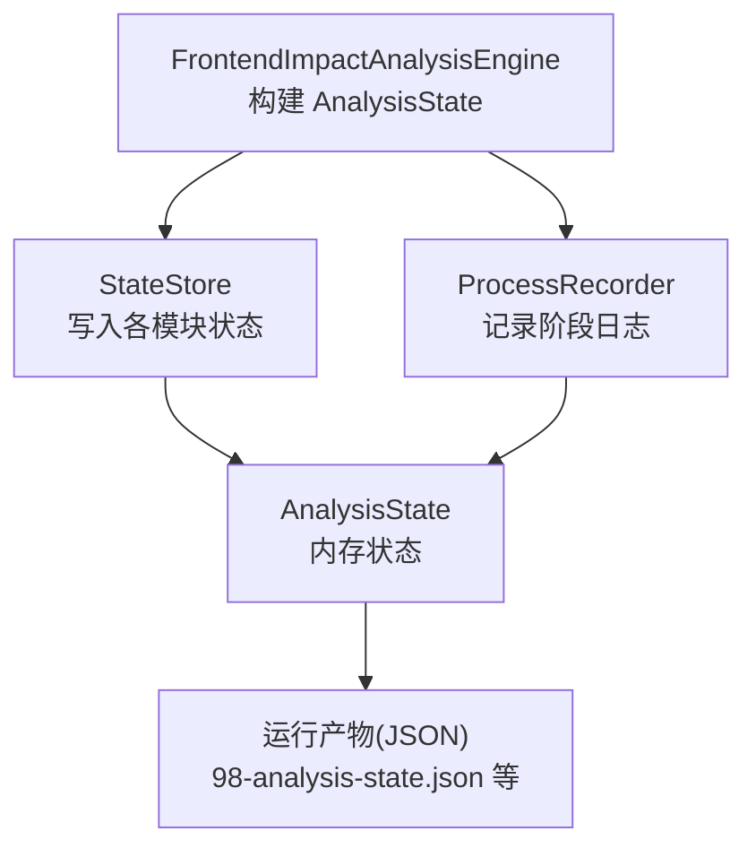
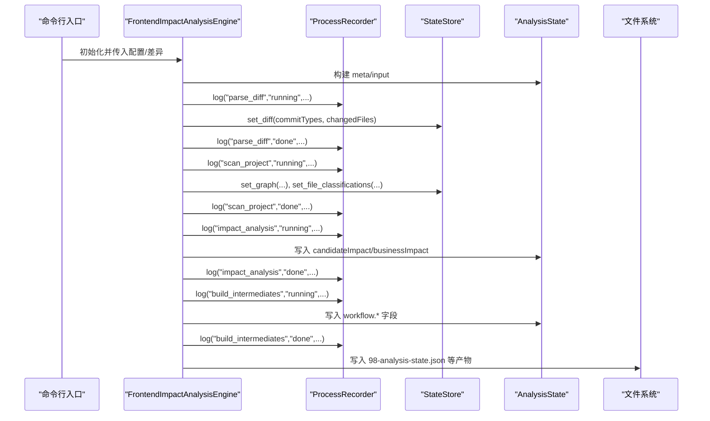
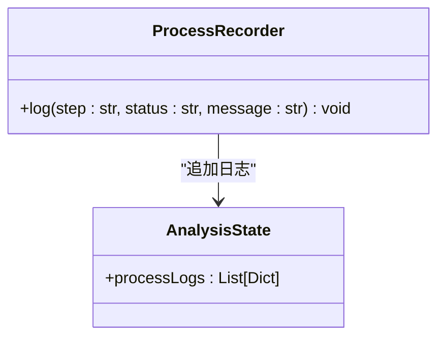
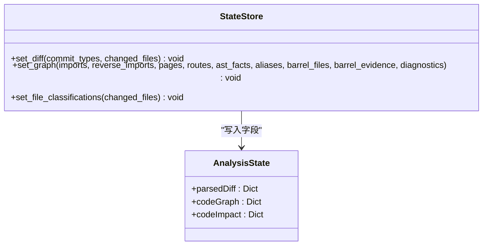
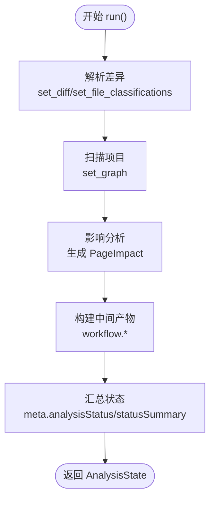
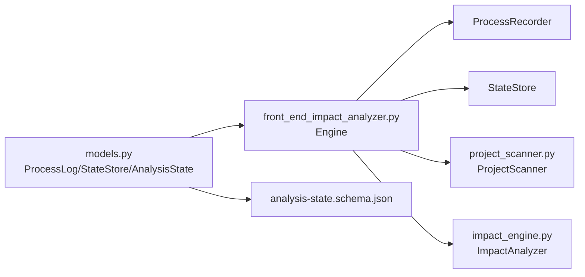

# 进程日志与状态管理

<cite>
**本文档引用的文件**
- [scripts/analyzer/models.py](file://scripts/analyzer/models.py)
- [scripts/analyzer/impact_engine.py](file://scripts/analyzer/impact_engine.py)
- [scripts/analyzer/project_scanner.py](file://scripts/analyzer/project_scanner.py)
- [scripts/front_end_impact_analyzer.py](file://scripts/front_end_impact_analyzer.py)
- [schemas/analysis-state.schema.json](file://schemas/analysis-state.schema.json)
</cite>

## 目录
1. [简介](#简介)
2. [项目结构](#项目结构)
3. [核心组件](#核心组件)
4. [架构总览](#架构总览)
5. [详细组件分析](#详细组件分析)
6. [依赖关系分析](#依赖关系分析)
7. [性能考量](#性能考量)
8. [故障排除指南](#故障排除指南)
9. [结论](#结论)

## 简介
本文件系统性地文档化了前端影响分析流水线中的“进程日志”与“状态管理”机制，重点覆盖以下内容：
- ProcessLog 数据结构的设计与用途
- ProcessRecorder 类的日志记录流程与调用点
- StateStore 类的状态写入接口与各字段语义
- 分析过程中的状态转换与日志记录策略
- 状态持久化与 Schema 对齐的最佳实践
- 错误处理与异常情况下的日志记录策略
- 状态管理的完整性与可靠性保障

## 项目结构
该分析引擎以“状态驱动”的方式组织：前端入口负责构建 AnalysisState，随后通过 ProcessRecorder 记录阶段日志，通过 StateStore 写入各模块状态；最终在运行产物中以 JSON 形式持久化。

图表来源
- [scripts/front_end_impact_analyzer.py:39-160](file://scripts/front_end_impact_analyzer.py#L39-L160)
- [scripts/analyzer/models.py:163-200](file://scripts/analyzer/models.py#L163-L200)

章节来源
- [scripts/front_end_impact_analyzer.py:39-160](file://scripts/front_end_impact_analyzer.py#L39-L160)
- [scripts/analyzer/models.py:163-200](file://scripts/analyzer/models.py#L163-L200)

## 核心组件
- ProcessLog：单条进程日志的数据结构，包含步骤、状态、消息与时间戳。
- ProcessRecorder：围绕 AnalysisState 的日志记录器，统一追加到 processLogs。
- StateStore：围绕 AnalysisState 的状态写入器，提供 set_* 方法将中间结果写入对应命名空间。
- AnalysisState：全局状态容器，包含 meta/input/parsedDiff/codeGraph/codeImpact/candidateImpact/businessImpact/workflow/output/processLogs 等字段。

章节来源
- [scripts/analyzer/models.py:18-24](file://scripts/analyzer/models.py#L18-L24)
- [scripts/analyzer/models.py:163-168](file://scripts/analyzer/models.py#L163-L168)
- [scripts/analyzer/models.py:171-200](file://scripts/analyzer/models.py#L171-L200)
- [scripts/analyzer/models.py:115-160](file://scripts/analyzer/models.py#L115-L160)

## 架构总览
下图展示了从入口到状态落盘的关键交互路径，以及日志与状态的写入时序。

图表来源
- [scripts/front_end_impact_analyzer.py:56-160](file://scripts/front_end_impact_analyzer.py#L56-L160)
- [scripts/analyzer/models.py:163-200](file://scripts/analyzer/models.py#L163-L200)

## 详细组件分析

### ProcessLog 数据结构
- 字段
  - step：阶段标识（如 parse_diff、scan_project、impact_analysis 等）
  - status：阶段状态（running/done/skipped/failed）
  - message：阶段说明或统计信息
  - ts：日志时间戳，默认使用当前时间
- 用途
  - 作为 AnalysisState.processLogs 的元素，用于记录分析流水线的执行轨迹与关键指标
  - 通过 ProcessRecorder.log 统一追加，保证日志格式一致

章节来源
- [scripts/analyzer/models.py:18-24](file://scripts/analyzer/models.py#L18-L24)
- [scripts/analyzer/models.py:163-168](file://scripts/analyzer/models.py#L163-L168)

### ProcessRecorder 类
- 职责
  - 暴露 log(step, status, message) 接口
  - 将 ProcessLog 实例转换为字典后追加到 AnalysisState.processLogs
- 调用点
  - parse_diff 阶段：开始与结束两条日志
  - scan_project 阶段：开始与结束两条日志
  - impact_analysis 阶段：开始与结束两条日志
  - build_intermediates 阶段：开始与结束两条日志
  - build_cases 阶段：标记为 skipped（未生成模板用例）
  - 异常捕获：捕获异常后记录 analysis failed 日志，并设置 meta.analysisStatus

图表来源
- [scripts/analyzer/models.py:163-168](file://scripts/analyzer/models.py#L163-L168)
- [scripts/front_end_impact_analyzer.py:60-104](file://scripts/front_end_impact_analyzer.py#L60-L104)
- [scripts/front_end_impact_analyzer.py:367-384](file://scripts/front_end_impact_analyzer.py#L367-L384)

章节来源
- [scripts/analyzer/models.py:163-168](file://scripts/analyzer/models.py#L163-L168)
- [scripts/front_end_impact_analyzer.py:60-104](file://scripts/front_end_impact_analyzer.py#L60-L104)
- [scripts/front_end_impact_analyzer.py:367-384](file://scripts/front_end_impact_analyzer.py#L367-L384)

### StateStore 类与状态写入
- set_diff(commit_types, changed_files)
  - 写入 parsedDiff.commitTypes 与 parsedDiff.changedFiles
  - changedFiles 通过 asdict 序列化
- set_graph(imports, reverse_imports, pages, routes, ast_facts, aliases, barrel_files, barrel_evidence, diagnostics)
  - 写入 codeGraph.imports、reverseImports、pages、routes、astFacts、aliases、barrelFiles、barrelEvidence、diagnostics
  - routes 通过 asdict 序列化
- set_file_classifications(changed_files)
  - 写入 codeImpact.fileClassifications，包含 file、fileType、moduleGuess、noiseClassification、globalClassification 等字段

图表来源
- [scripts/analyzer/models.py:171-200](file://scripts/analyzer/models.py#L171-L200)
- [scripts/front_end_impact_analyzer.py:70-77](file://scripts/front_end_impact_analyzer.py#L70-L77)
- [scripts/front_end_impact_analyzer.py:116-144](file://scripts/front_end_impact_analyzer.py#L116-L144)

章节来源
- [scripts/analyzer/models.py:171-200](file://scripts/analyzer/models.py#L171-L200)
- [scripts/front_end_impact_analyzer.py:70-77](file://scripts/front_end_impact_analyzer.py#L70-L77)
- [scripts/front_end_impact_analyzer.py:116-144](file://scripts/front_end_impact_analyzer.py#L116-L144)

### 分析过程中的状态转换与日志记录
- 解析差异阶段
  - 读取 Git Diff 文本，解析出变更类型与文件列表
  - 使用 SourceClassifier 与 GlobalChangeClassifier 为每个 ChangedFile 填充分类信息
  - 通过 StateStore.set_diff 与 set_file_classifications 写入 parsedDiff 与 codeImpact
  - 通过 ProcessRecorder.log 记录开始与结束
- 扫描项目阶段
  - ProjectScanner 扫描导入关系、反向导入、页面、路由、AST 特征、别名、条目文件等
  - 写入 codeGraph 并记录扫描统计
- 影响分析阶段
  - ImpactAnalyzer 基于反向导入与语义标签追踪变更到页面，生成 PageImpact 列表
  - 写入 codeImpact.candidatePageTraces/pageImpacts/unresolvedFiles/sharedRisks
  - 写入 candidateImpact/businessImpact
- 中间产物构建阶段
  - 构建 diffIndex、文件影响种子、变更聚类、文档索引、聚类上下文、覆盖率等
  - 写入 workflow.* 字段
- 结果与状态汇总
  - 计算 meta.analysisStatus 与 meta.statusSummary
  - 生成输出包结构与最终结果

图表来源
- [scripts/front_end_impact_analyzer.py:56-160](file://scripts/front_end_impact_analyzer.py#L56-L160)
- [scripts/analyzer/impact_engine.py:26-58](file://scripts/analyzer/impact_engine.py#L26-L58)
- [scripts/analyzer/project_scanner.py:20-80](file://scripts/analyzer/project_scanner.py#L20-L80)

章节来源
- [scripts/front_end_impact_analyzer.py:56-160](file://scripts/front_end_impact_analyzer.py#L56-L160)
- [scripts/analyzer/impact_engine.py:26-58](file://scripts/analyzer/impact_engine.py#L26-L58)
- [scripts/analyzer/project_scanner.py:20-80](file://scripts/analyzer/project_scanner.py#L20-L80)

### 错误处理与异常日志策略
- 入口异常捕获
  - 在 main() 中捕获异常，调用 ProcessRecorder.log("analysis","failed",...) 记录失败原因
  - 设置 meta.analysisStatus 为 failed
  - 在 codeGraph.diagnostics 中追加致命错误诊断项
  - 输出阻断态的运行产物与状态
- 诊断注入
  - ProjectScanner 在无法解析导入或路由绑定失败时，向 diagnostics 注入诊断项
  - 影响分析阶段若无法追踪到页面，会生成 unresolved 文件项

章节来源
- [scripts/front_end_impact_analyzer.py:367-384](file://scripts/front_end_impact_analyzer.py#L367-L384)
- [scripts/analyzer/project_scanner.py:44-50](file://scripts/analyzer/project_scanner.py#L44-L50)
- [scripts/analyzer/project_scanner.py:193-199](file://scripts/analyzer/project_scanner.py#L193-L199)
- [scripts/analyzer/impact_engine.py:33-39](file://scripts/analyzer/impact_engine.py#L33-L39)

## 依赖关系分析
- ProcessRecorder 与 StateStore 均依赖 AnalysisState 的字段结构
- 影响分析依赖 ImpactAnalyzer 的追踪逻辑
- 扫描阶段依赖 ProjectScanner 的导入解析与 AST 提取
- 最终产物依赖 JSON 序列化与 Schema 校验

图表来源
- [scripts/analyzer/models.py:163-200](file://scripts/analyzer/models.py#L163-L200)
- [scripts/front_end_impact_analyzer.py:39-160](file://scripts/front_end_impact_analyzer.py#L39-L160)
- [scripts/analyzer/project_scanner.py:13-80](file://scripts/analyzer/project_scanner.py#L13-L80)
- [scripts/analyzer/impact_engine.py:10-58](file://scripts/analyzer/impact_engine.py#L10-L58)
- [schemas/analysis-state.schema.json:1-238](file://schemas/analysis-state.schema.json#L1-L238)

章节来源
- [scripts/analyzer/models.py:163-200](file://scripts/analyzer/models.py#L163-L200)
- [scripts/front_end_impact_analyzer.py:39-160](file://scripts/front_end_impact_analyzer.py#L39-L160)
- [scripts/analyzer/project_scanner.py:13-80](file://scripts/analyzer/project_scanner.py#L13-L80)
- [scripts/analyzer/impact_engine.py:10-58](file://scripts/analyzer/impact_engine.py#L10-L58)
- [schemas/analysis-state.schema.json:1-238](file://schemas/analysis-state.schema.json#L1-L238)

## 性能考量
- 日志与状态序列化
  - ProcessLog 与各模型对象通过 asdict 序列化，避免直接传递复杂对象，降低耦合
- 复杂度与遍历
  - 影响分析采用广度优先搜索追踪，复杂度与图规模相关；建议控制聚类规模与上下文大小
- I/O 与产物写入
  - 运行产物按阶段分文件写入，便于增量调试与回放
- 诊断与告警
  - diagnostics 用于记录解析失败与绑定问题，有助于快速定位问题根因

[本节为通用性能讨论，不直接分析具体文件]

## 故障排除指南
- 常见问题与定位
  - 无法解析导入：检查 imports 与别名映射，确认目标文件存在且扩展名匹配
  - 路由未绑定页面：检查路由定义与页面组件导出一致性
  - 影响分析无结果：确认 ChangedFile 是否被噪声过滤或全局变更策略跳过
- 日志与诊断
  - 查看 processLogs 的阶段状态与 message，结合 codeGraph.diagnostics 的致命错误项
  - 若 meta.analysisStatus 为 failed，优先排查 diagnostics 中的 type=fatal-error 项
- 产物核对
  - 使用 analysis-state.schema.json 校验 98-analysis-state.json 的结构完整性

章节来源
- [scripts/analyzer/project_scanner.py:44-50](file://scripts/analyzer/project_scanner.py#L44-L50)
- [scripts/analyzer/project_scanner.py:193-199](file://scripts/analyzer/project_scanner.py#L193-L199)
- [scripts/front_end_impact_analyzer.py:367-384](file://scripts/front_end_impact_analyzer.py#L367-L384)
- [schemas/analysis-state.schema.json:1-238](file://schemas/analysis-state.schema.json#L1-L238)

## 结论
本系统通过 AnalysisState 统一承载分析状态，借助 ProcessRecorder 与 StateStore 实现“可观测、可追踪、可持久化”的状态管理。日志与诊断贯穿全流程，配合 JSON 产物与 Schema 校验，确保状态的完整性与可靠性。建议在后续迭代中持续完善诊断信息的丰富度与可读性，并根据实际规模优化聚类与上下文收集策略，以进一步提升性能与可维护性。