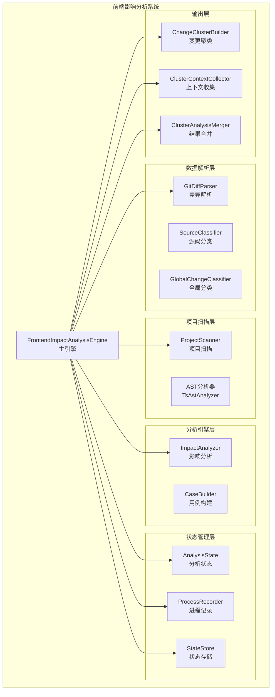
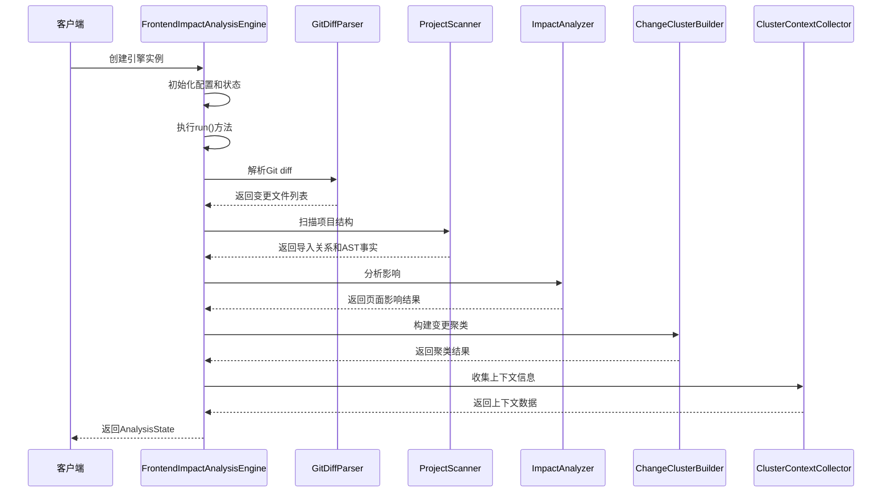
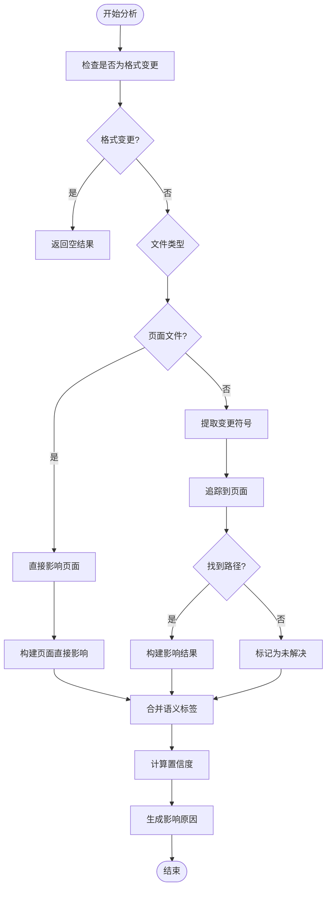
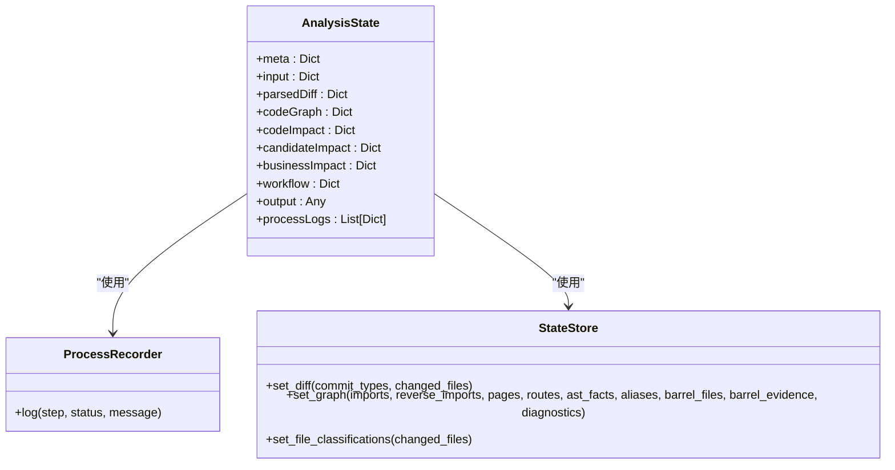
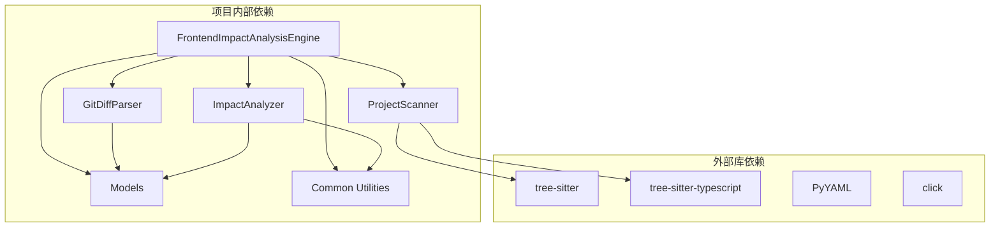

# FrontendImpactAnalysisEngine类

<cite>
**本文档引用的文件**
- [scripts/analyzer/impact_engine.py](file://scripts/analyzer/impact_engine.py)
- [scripts/front_end_impact_analyzer.py](file://scripts/front_end_impact_analyzer.py)
- [scripts/analyzer/models.py](file://scripts/analyzer/models.py)
- [scripts/analyzer/common.py](file://scripts/analyzer/common.py)
- [scripts/analyzer/project_scanner.py](file://scripts/analyzer/project_scanner.py)
- [scripts/analyzer/diff_parser.py](file://scripts/analyzer/diff_parser.py)
- [tests/test_impact_engine.py](file://tests/test_impact_engine.py)
</cite>

## 目录
1. [简介](#简介)
2. [项目结构](#项目结构)
3. [核心组件](#核心组件)
4. [架构概览](#架构概览)
5. [详细组件分析](#详细组件分析)
6. [依赖分析](#依赖分析)
7. [性能考虑](#性能考虑)
8. [故障排除指南](#故障排除指南)
9. [结论](#结论)
10. [附录](#附录)

## 简介

FrontendImpactAnalysisEngine是前端影响分析引擎的核心类，负责执行完整的前端变更影响分析流程。该引擎通过解析Git diff、扫描项目结构、分析代码依赖关系，最终生成影响分析报告和测试用例建议。

该引擎采用模块化设计，将复杂的分析流程分解为多个独立的处理阶段，每个阶段都有明确的输入输出和错误处理机制。引擎支持React、React Router和Vite项目的前端变更影响分析，能够自动识别页面、路由、组件等关键元素，并追踪变更的影响范围。

## 项目结构

前端影响分析系统采用分层架构设计，主要包含以下核心模块：



**图表来源**
- [scripts/front_end_impact_analyzer.py:23-55](file://scripts/front_end_impact_analyzer.py#L23-L55)
- [scripts/analyzer/impact_engine.py:10-188](file://scripts/analyzer/impact_engine.py#L10-L188)

**章节来源**
- [scripts/front_end_impact_analyzer.py:1-403](file://scripts/front_end_impact_analyzer.py#L1-L403)

## 核心组件

### FrontendImpactAnalysisEngine类

FrontendImpactAnalysisEngine是整个分析系统的核心控制器，负责协调各个组件完成完整的分析流程。

#### 构造函数参数

| 参数名 | 类型 | 默认值 | 必填 | 描述 |
|--------|------|--------|------|------|
| project_root | Path | - | 是 | 项目根目录路径 |
| diff_text | str | - | 是 | Git diff文本内容 |
| requirement_text | str | "" | 否 | 需求文档文本 |
| config | dict \| None | None | 否 | 配置字典，如果为None则自动加载 |
| manifest | dict \| None | None | 否 | 运行清单，如果为None则自动生成 |
| preflight_report | dict \| None | None | 否 | 预检报告，如果为None则自动检查 |

#### 初始化过程

引擎初始化时会执行以下关键步骤：

1. **配置加载**：从项目根目录加载或创建配置文件
2. **运行清单构建**：生成唯一的运行标识和输出目录
3. **预检检查**：验证项目环境和必需的目录是否存在
4. **状态初始化**：创建AnalysisState、ProcessRecorder和StateStore实例

#### 主要属性

| 属性名 | 类型 | 描述 |
|--------|------|------|
| project_root | Path | 项目根目录路径 |
| diff_text | str | Git diff文本内容 |
| requirement_text | str | 需求文档内容 |
| config | dict | 分析配置 |
| manifest | dict | 运行清单 |
| preflight_report | dict | 预检报告 |
| state | AnalysisState | 分析状态对象 |
| recorder | ProcessRecorder | 进程记录器 |
| store | StateStore | 状态存储器 |

**章节来源**
- [scripts/front_end_impact_analyzer.py:23-55](file://scripts/front_end_impact_analyzer.py#L23-L55)
- [scripts/analyzer/models.py:115-161](file://scripts/analyzer/models.py#L115-L161)

## 架构概览

FrontendImpactAnalysisEngine采用流水线式架构，将复杂的分析任务分解为多个独立的处理阶段：



**图表来源**
- [scripts/front_end_impact_analyzer.py:56-160](file://scripts/front_end_impact_analyzer.py#L56-L160)

## 详细组件分析

### run()方法完整执行流程

FrontendImpactAnalysisEngine.run()方法是整个分析流程的核心，执行以下详细步骤：

#### 第一阶段：差异解析（parse_diff）

1. **Git diff解析**：使用GitDiffParser解析原始diff文本
2. **变更类型识别**：提取提交类型和变更文件列表
3. **噪声过滤**：应用噪声分类器过滤不重要的变更
4. **符号提取**：从变更内容中提取函数、类、组件等符号
5. **语义标签**：识别表单、按钮、表格等语义标签

#### 第二阶段：项目扫描（scan_project）

1. **AST分析**：使用TsAstAnalyzer分析所有源码文件
2. **导入关系构建**：建立正向和反向导入关系图
3. **页面识别**：识别React页面组件
4. **路由分析**：解析路由配置和绑定关系
5. **别名解析**：处理TypeScript路径别名

#### 第三阶段：影响分析（impact_analysis）

1. **文件分类**：对每个变更文件进行类型分类
2. **符号匹配**：匹配变更符号与AST中的实际符号
3. **路径追踪**：使用BFS算法追踪到页面的路径
4. **影响评估**：计算影响类型、置信度和原因
5. **结果聚合**：汇总所有页面影响结果

#### 第四阶段：中间产物构建（build_intermediates）

1. **变更聚类**：将相关的变更组织成集群
2. **上下文收集**：为每个聚类收集相关文档和代码上下文
3. **覆盖率分析**：计算分析覆盖率和诊断信息
4. **任务生成**：生成需要人工分析的任务清单

#### 第五阶段：结果输出

1. **分析包构建**：组织最终的分析结果
2. **状态更新**：更新分析状态和摘要信息
3. **文件写入**：将中间产物和最终结果写入文件

**章节来源**
- [scripts/front_end_impact_analyzer.py:56-160](file://scripts/front_end_impact_analyzer.py#L56-L160)

### ImpactAnalyzer类详细分析

ImpactAnalyzer是影响分析的核心算法实现，负责将变更文件追踪到具体的页面组件。

#### 核心算法：BFS路径追踪



**图表来源**
- [scripts/analyzer/impact_engine.py:26-58](file://scripts/analyzer/impact_engine.py#L26-L58)
- [scripts/analyzer/impact_engine.py:77-105](file://scripts/analyzer/impact_engine.py#L77-L105)

#### 符号匹配算法

符号匹配是影响分析的关键步骤，算法考虑以下因素：

1. **导入绑定匹配**：检查导入声明中的符号绑定
2. **重新导出匹配**：处理模块间的重新导出关系
3. **严格符号模式**：在严格模式下精确匹配符号
4. **通配符处理**：支持*和default导入的通配符匹配

**章节来源**
- [scripts/analyzer/impact_engine.py:107-162](file://scripts/analyzer/impact_engine.py#L107-L162)

### 数据模型和状态管理

#### AnalysisState状态结构

AnalysisState是引擎的核心状态容器，包含以下主要部分：



**图表来源**
- [scripts/analyzer/models.py:115-161](file://scripts/analyzer/models.py#L115-L161)
- [scripts/analyzer/models.py:163-201](file://scripts/analyzer/models.py#L163-L201)

#### 变更文件模型

ChangedFile模型表示单个变更文件的所有相关信息：

| 字段名 | 类型 | 描述 |
|--------|------|------|
| path | str | 文件路径 |
| change_type | str | 变更类型（modified/added/deleted） |
| added_lines | int | 新增行数 |
| removed_lines | int | 删除行数 |
| symbols | List[str] | 提取的符号列表 |
| semantic_tags | List[str] | 语义标签列表 |
| api_changes | List[Dict] | API变更信息 |
| file_type | str | 文件类型分类 |
| module_guess | str | 模块猜测 |
| is_format_only | bool | 是否为格式变更 |
| noise_classification | Dict | 噪声分类结果 |
| global_classification | Dict | 全局分类结果 |

**章节来源**
- [scripts/analyzer/models.py:27-40](file://scripts/analyzer/models.py#L27-L40)

## 依赖分析

### 外部依赖关系



**图表来源**
- [pyproject.toml:6-9](file://pyproject.toml#L6-L9)
- [scripts/front_end_impact_analyzer.py:9-20](file://scripts/front_end_impact_analyzer.py#L9-L20)

### 内部模块耦合

引擎内部模块之间存在清晰的职责分离：

1. **控制层**：FrontendImpactAnalysisEngine负责整体流程控制
2. **解析层**：GitDiffParser和各种分类器负责数据解析
3. **扫描层**：ProjectScanner负责项目结构分析
4. **分析层**：ImpactAnalyzer负责核心算法实现
5. **工具层**：各种工具类提供通用功能支持

**章节来源**
- [scripts/front_end_impact_analyzer.py:1-403](file://scripts/front_end_impact_analyzer.py#L1-L403)

## 性能考虑

### 时间复杂度分析

1. **差异解析**：O(n)，其中n为diff行数
2. **项目扫描**：O(m×k)，其中m为源码文件数，k为平均文件复杂度
3. **影响分析**：O(e×d)，其中e为边数，d为平均深度
4. **聚类分析**：O(c×p)，其中c为聚类数，p为平均聚类大小

### 内存优化策略

1. **增量处理**：按文件处理避免一次性加载所有数据
2. **去重机制**：使用集合和字典确保唯一性
3. **延迟计算**：只在需要时计算昂贵的操作
4. **状态复用**：在不同阶段间共享计算结果

### 并行处理机会

当前实现为串行处理，未来可以考虑：
- AST分析的并行化
- 路径追踪的并行化
- 上下文收集的并行化

## 故障排除指南

### 常见错误类型

1. **预检失败**：项目缺少必需的目录或文件
2. **语法错误**：源码存在语法错误导致AST解析失败
3. **导入解析失败**：无法解析某些导入路径
4. **内存不足**：大型项目可能导致内存溢出

### 错误恢复机制

引擎提供了多层次的错误处理：

1. **预检检查**：在开始分析前验证环境
2. **渐进式处理**：即使部分失败也尽量返回可用结果
3. **诊断信息**：记录详细的错误信息用于调试
4. **状态回滚**：在异常情况下保持状态一致性

### 调试技巧

1. **查看中间产物**：检查diff解析、项目扫描等中间结果
2. **启用详细日志**：通过ProcessRecorder查看详细执行过程
3. **单元测试**：运行测试用例验证特定功能
4. **配置调整**：根据项目特点调整分析参数

**章节来源**
- [scripts/front_end_impact_analyzer.py:361-399](file://scripts/front_end_impact_analyzer.py#L361-L399)

## 结论

FrontendImpactAnalysisEngine是一个设计精良的前端变更影响分析系统，具有以下特点：

1. **模块化设计**：清晰的职责分离和接口定义
2. **可扩展性**：支持新的分析算法和数据源
3. **健壮性**：完善的错误处理和恢复机制
4. **可观测性**：详细的日志记录和状态跟踪
5. **实用性**：提供可操作的分析结果和建议

该引擎适用于React、React Router和Vite项目，能够有效帮助开发团队理解代码变更的影响范围，提高代码质量和发布安全性。

## 附录

### 使用示例

#### 基本使用

```python
from pathlib import Path
from scripts.front_end_impact_analyzer import FrontendImpactAnalysisEngine

# 读取diff文件
diff_text = Path("changes.diff").read_text()

# 创建引擎实例
engine = FrontendImpactAnalysisEngine(
    project_root=Path("/path/to/project"),
    diff_text=diff_text,
    requirement_text="需求文档内容"
)

# 执行分析
state = engine.run()

# 获取结果
print(state.output)
```

#### 高级配置

```python
# 自定义配置
config = {
    "analysis": {
        "maxClustersForDeepAnalysis": 50,
        "maxFilesPerClusterContext": 10
    }
}

engine = FrontendImpactAnalysisEngine(
    project_root=Path("/path/to/project"),
    diff_text=diff_text,
    config=config
)
```

### 最佳实践

1. **定期清理缓存**：定期清理AST缓存以避免过期数据
2. **合理设置阈值**：根据项目规模调整聚类和上下文限制
3. **监控资源使用**：关注内存和CPU使用情况
4. **版本兼容性**：确保与项目使用的TypeScript版本兼容
5. **测试覆盖**：为关键分析逻辑编写单元测试

### API参考

#### FrontendImpactAnalysisEngine.run()

- **返回值**：AnalysisState对象
- **异常**：抛出Exception并在状态中记录错误
- **副作用**：写入运行产物文件

#### 影响分析算法

- **时间复杂度**：O(V+E)，其中V为节点数，E为边数
- **空间复杂度**：O(V+E)
- **准确性**：基于AST分析，准确率高但可能有遗漏