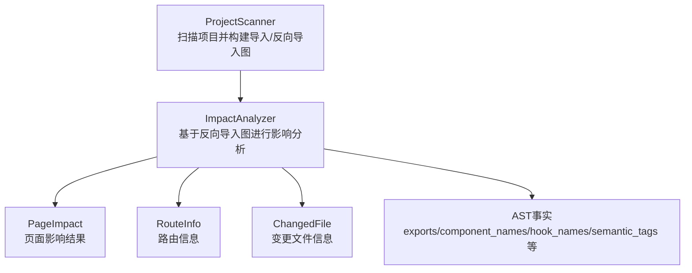
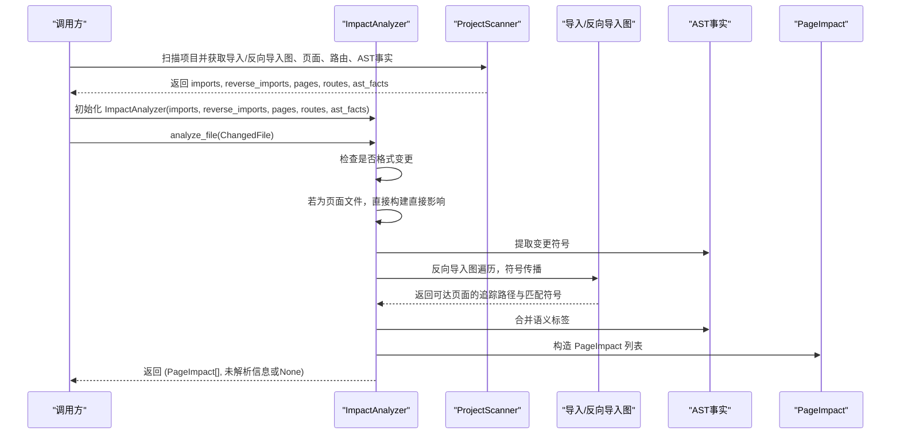
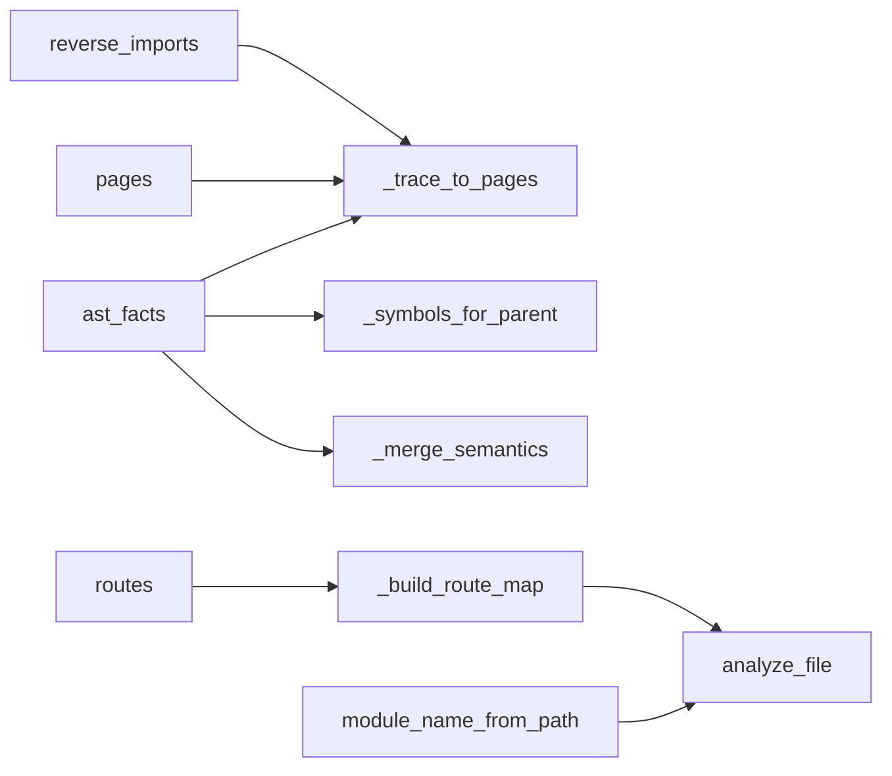
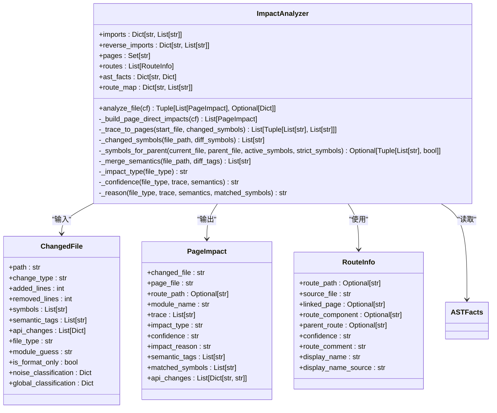

# ImpactAnalyzer类

<cite>
**本文引用的文件**
- [impact_engine.py](file://scripts/analyzer/impact_engine.py)
- [models.py](file://scripts/analyzer/models.py)
- [common.py](file://scripts/analyzer/common.py)
- [project_scanner.py](file://scripts/analyzer/project_scanner.py)
- [test_impact_engine.py](file://tests/test_impact_engine.py)
- [front_end_impact_analyzer.py](file://scripts/front_end_impact_analyzer.py)
</cite>

## 目录
1. [简介](#简介)
2. [项目结构](#项目结构)
3. [核心组件](#核心组件)
4. [架构总览](#架构总览)
5. [详细组件分析](#详细组件分析)
6. [依赖分析](#依赖分析)
7. [性能考虑](#性能考虑)
8. [故障排查指南](#故障排查指南)
9. [结论](#结论)
10. [附录](#附录)

## 简介
本文件为 ImpactAnalyzer 类的完整API文档，聚焦于 analyze_file() 方法的实现逻辑与技术细节。文档涵盖：
- 反向导入图遍历策略与符号传播机制
- 语义标签合并与置信度评估
- 方法参数、返回值的数据结构与处理逻辑
- 使用示例与性能优化建议
- 与项目扫描器、模型定义等组件的交互关系与依赖约束

## 项目结构
ImpactAnalyzer 位于 analyzer 包中，负责基于反向导入图（reverse imports）从变更文件向上追溯到页面，并生成 PageImpact 结果。其输入来自 ProjectScanner 的扫描产物：导入图、反向导入图、页面集合、路由信息以及AST事实。

图表来源
- [project_scanner.py:20-80](file://scripts/analyzer/project_scanner.py#L20-L80)
- [impact_engine.py:10-18](file://scripts/analyzer/impact_engine.py#L10-L18)
- [models.py:26-90](file://scripts/analyzer/models.py#L26-L90)

章节来源
- [project_scanner.py:20-80](file://scripts/analyzer/project_scanner.py#L20-L80)
- [impact_engine.py:10-18](file://scripts/analyzer/impact_engine.py#L10-L18)
- [models.py:26-90](file://scripts/analyzer/models.py#L26-L90)

## 核心组件
- ImpactAnalyzer：核心分析器，提供 analyze_file() 主入口，内部实现反向导入图遍历、符号传播、语义标签合并与置信度评估。
- ChangedFile：表示一次变更的文件信息，包含文件路径、变更类型、符号、语义标签、API变更等。
- PageImpact：表示从变更文件到页面的影响结果，包含追踪路径、路由、置信度、语义标签、匹配符号等。
- RouteInfo：路由信息，用于建立页面与路由的映射。
- AST事实：每个文件的AST解析结果，包含导入绑定、导出、组件名、钩子名、语义标签等。

章节来源
- [impact_engine.py:10-188](file://scripts/analyzer/impact_engine.py#L10-L188)
- [models.py:26-90](file://scripts/analyzer/models.py#L26-L90)

## 架构总览
ImpactAnalyzer 的工作流以“反向导入图”为核心，自变更文件向上回溯，结合AST事实中的符号与语义标签，最终生成 PageImpact 列表。若无法通过反向导入图追溯到页面，则返回低置信度的未解析信息。

图表来源
- [impact_engine.py:26-58](file://scripts/analyzer/impact_engine.py#L26-L58)
- [impact_engine.py:77-105](file://scripts/analyzer/impact_engine.py#L77-L105)
- [project_scanner.py:20-80](file://scripts/analyzer/project_scanner.py#L20-L80)

## 详细组件分析

### ImpactAnalyzer 类
- 负责基于反向导入图进行文件影响分析，输出 PageImpact 列表与可选的未解析信息。
- 关键属性
  - imports: 正向导入图（文件 -> 导入列表）
  - reverse_imports: 反向导入图（文件 -> 被该文件依赖的父文件列表）
  - pages: 页面文件集合
  - routes: 路由信息列表
  - ast_facts: 文件级AST事实字典
  - route_map: 页面到路由路径的映射
- 关键方法
  - analyze_file(cf: ChangedFile) -> Tuple[List[PageImpact], Optional[Dict]]
  - _build_page_direct_impacts(cf: ChangedFile) -> List[PageImpact]
  - _trace_to_pages(start_file: str, changed_symbols: List[str]) -> List[Tuple[List[str], List[str]]]
  - _changed_symbols(file_path: str, diff_symbols: List[str]) -> List[str]
  - _symbols_for_parent(current_file: str, parent_file: str, active_symbols: List[str], strict_symbols: bool) -> Optional[Tuple[List[str], bool]]
  - _merge_semantics(file_path: str, diff_tags: List[str]) -> List[str]
  - _impact_type(file_type: str) -> str
  - _confidence(file_type: str, trace: List[str], semantics: List[str]) -> str
  - _reason(file_type: str, trace: List[str], semantics: List[str], matched_symbols: List[str]) -> str

章节来源
- [impact_engine.py:10-188](file://scripts/analyzer/impact_engine.py#L10-L188)

#### analyze_file() 方法详解
- 输入
  - cf: ChangedFile，包含变更文件路径、变更类型、符号、语义标签、API变更、文件类型、模块猜测等
- 处理逻辑
  - 若 is_format_only 为真，直接返回空结果与 None
  - 若 file_type 为 page，直接调用 _build_page_direct_impacts 构建直接影响
  - 否则：
    - 通过 _changed_symbols 提取与AST事实匹配的变更符号
    - 通过 _trace_to_pages 在反向导入图上进行BFS遍历，收集可达页面及其匹配符号
    - 若无追踪结果，返回空影响与低置信度原因
    - 对每个追踪路径，构造 PageImpact，填充模块名、路由、影响类型、置信度、影响原因、语义标签、匹配符号、API变更等
- 输出
  - 影响结果列表：List[PageImpact]
  - 未解析信息：Optional[Dict]，包含文件、文件类型、置信度、原因等

章节来源
- [impact_engine.py:26-58](file://scripts/analyzer/impact_engine.py#L26-L58)

#### 反向导入图遍历与符号传播
- BFS队列元素包含：(当前文件, 追踪路径, 活跃符号, 是否严格模式)
- 访问控制：按 (当前文件, 活跃符号元组, 严格标志) 去重，避免重复搜索
- 终止条件：当前文件属于页面集合时，记录该路径与活跃符号
- 子节点扩展：遍历 reverse_imports[current_file] 中的父文件，调用 _symbols_for_parent 计算下一跳的活跃符号与严格标志
- 去重：对相同路径与匹配符号组合去重，保留唯一追踪

章节来源
- [impact_engine.py:77-105](file://scripts/analyzer/impact_engine.py#L77-L105)

#### 符号传播规则（_symbols_for_parent）
- 输入：当前文件、父文件、活跃符号、严格标志
- 规则
  - 若非严格模式：保持活跃符号不变，切换到非严格模式
  - 若严格模式：
    - 解析 import_bindings：匹配导入来源为当前文件的绑定，根据导入名与本地标识符计数决定是否保留符号
    - 解析 reexport_bindings：匹配重导出来源为当前文件的绑定，决定导出符号集合
  - 若有重导出匹配：返回去重后的导出符号集合，严格模式保持
  - 若有导入匹配：返回去重后的导入符号集合，严格模式降级为非严格
  - 若无活跃符号：返回 None（终止该分支）

章节来源
- [impact_engine.py:119-162](file://scripts/analyzer/impact_engine.py#L119-L162)

#### 语义标签合并（_merge_semantics）
- 将变更文件的 diff_tags 与 AST事实中的 semantic_tags 合并，去重并保持顺序

章节来源
- [impact_engine.py:164-166](file://scripts/analyzer/impact_engine.py#L164-L166)

#### 影响类型与置信度评估
- 影响类型：page/route/business-component/api/hook/store -> direct；其他 -> indirect
- 置信度：
  - page/route：high
  - business-component/api/hook/store 且追踪长度<=3：high
  - shared-component：若语义标签包含 form/table/modal/button 则 medium，否则 low
  - utils/config-or-schema/style：low
  - 其他：medium
- 影响原因：拼接文件类型、追踪步数、语义标签与匹配符号

章节来源
- [impact_engine.py:168-187](file://scripts/analyzer/impact_engine.py#L168-L187)

#### 页面直接影响（_build_page_direct_impacts）
- 当变更文件即为页面时，直接构造 PageImpact，影响类型为 direct，置信度 high，追踪路径仅包含自身

章节来源
- [impact_engine.py:60-75](file://scripts/analyzer/impact_engine.py#L60-L75)

### 数据模型
- ChangedFile：变更文件信息，含路径、变更类型、符号、语义标签、API变更、文件类型、模块猜测、格式变更标记等
- PageImpact：页面影响结果，含变更文件、页面文件、路由路径、模块名、追踪路径、影响类型、置信度、影响原因、语义标签、匹配符号、API变更
- RouteInfo：路由信息，含路由路径、源文件、关联页面、路由组件、父路由、置信度、注释、显示名等
- AST事实：文件级AST解析结果，含导入/导出/组件名/钩子名/语义标签/标识符计数等

章节来源
- [models.py:26-90](file://scripts/analyzer/models.py#L26-L90)

### 与 ProjectScanner 的交互
- ProjectScanner 扫描项目，构建：
  - imports：正向导入图
  - reverse_imports：反向导入图
  - pages：页面集合
  - routes：路由信息
  - ast_facts：AST事实字典
- ImpactAnalyzer 依赖这些输入进行分析

章节来源
- [project_scanner.py:20-80](file://scripts/analyzer/project_scanner.py#L20-L80)
- [impact_engine.py:10-18](file://scripts/analyzer/impact_engine.py#L10-L18)

### 与前端引擎的集成
- FrontendImpactAnalysisEngine 在运行时：
  - 解析diff，分类变更文件
  - 调用 ProjectScanner 获取图与AST事实
  - 实例化 ImpactAnalyzer 并逐个分析变更文件
  - 收集 PageImpact，写入分析状态与中间产物

章节来源
- [front_end_impact_analyzer.py:56-104](file://scripts/front_end_impact_analyzer.py#L56-L104)

## 依赖分析
- ImpactAnalyzer 依赖：
  - 反向导入图 reverse_imports：用于向上回溯
  - 页面集合 pages：作为终止条件
  - 路由信息 routes：用于页面到路由路径的映射
  - AST事实 ast_facts：用于符号提取、导入绑定、重导出绑定、标识符计数、语义标签等
  - 工具函数 module_name_from_path：从路径推断模块名
- 内部耦合：
  - analyze_file 依赖 _build_page_direct_impacts、_trace_to_pages、_merge_semantics、_confidence、_reason 等辅助方法
  - _trace_to_pages 依赖 _symbols_for_parent 与 ast_facts
  - _symbols_for_parent 依赖 ast_facts 的 import_bindings、reexport_bindings、identifier_counts

图表来源
- [impact_engine.py:10-188](file://scripts/analyzer/impact_engine.py#L10-L188)
- [common.py:54-67](file://scripts/analyzer/common.py#L54-L67)

章节来源
- [impact_engine.py:10-188](file://scripts/analyzer/impact_engine.py#L10-L188)
- [common.py:54-67](file://scripts/analyzer/common.py#L54-L67)

## 性能考虑
- 时间复杂度
  - BFS遍历：O(V + E)，其中 V 为文件数，E 为反向导入边数
  - 符号传播：每条边最多进行常数次符号匹配与去重
  - 去重：使用三元组键 (文件, 活跃符号元组, 严格标志) 与字符串键 "路径::符号"，避免重复搜索
- 空间复杂度
  - visited 集合与结果列表受可达页面数量与路径数量影响
- 优化建议
  - 预先去重 imports/ast_facts，减少重复计算
  - 对大项目可限制最大追踪深度或引入启发式剪枝（如仅保留与语义标签相关的路径）
  - 使用更高效的符号匹配结构（如哈希表）加速导入/重导出绑定查找
  - 将 _symbols_for_parent 的匹配逻辑缓存到 ast_facts 中，避免重复解析

[本节为通用性能讨论，不直接分析具体文件]

## 故障排查指南
- 无法追溯到页面
  - 现象：返回空影响与低置信度原因，原因通常为“无法通过反向导入图追溯到页面”
  - 排查：检查 reverse_imports 是否正确构建、页面集合是否包含目标页面、AST事实是否包含导出/组件名/钩子名
- 符号未匹配
  - 现象：matched_symbols 为空
  - 排查：确认 ChangedFile.symbols 与 AST事实中的 exports/component_names/hook_names 是否一致
- 置信度偏低
  - 现象：shared-component 或 utils/config-or-schema/style 类型的置信度为 low/medium
  - 排查：结合语义标签与追踪长度评估是否合理
- 单元测试参考
  - 测试覆盖了共享组件到页面的间接影响、符号过滤、格式变更跳过等场景

章节来源
- [test_impact_engine.py:11-85](file://tests/test_impact_engine.py#L11-L85)

## 结论
ImpactAnalyzer 通过反向导入图与符号传播，实现了从变更文件到页面的高效影响分析。其设计将“符号匹配”“语义标签”“路由映射”“置信度评估”有机结合，既保证了准确性，又具备良好的可扩展性。在实际工程中，建议配合 ProjectScanner 的高质量输入与前端引擎的整体流程，以获得稳定可靠的分析结果。

[本节为总结性内容，不直接分析具体文件]

## 附录

### API 定义与使用示例

- analyze_file(cf: ChangedFile) -> Tuple[List[PageImpact], Optional[Dict]]
  - 参数
    - cf: ChangedFile，包含变更文件路径、变更类型、符号、语义标签、API变更、文件类型、模块猜测、格式变更标记等
  - 返回
    - PageImpact 列表：每个元素代表一条从变更文件到页面的影响路径
    - 未解析信息字典：当无法通过反向导入图追溯到页面时返回，包含文件、文件类型、置信度、原因等
  - 示例（基于测试）
    - 共享组件变更到页面的间接影响：参见 [test_impact_engine.py:11-40](file://tests/test_impact_engine.py#L11-L40)
    - 符号过滤：参见 [test_impact_engine.py:42-64](file://tests/test_impact_engine.py#L42-L64)
    - 格式变更跳过：参见 [test_impact_engine.py:66-85](file://tests/test_impact_engine.py#L66-L85)

- 内部方法
  - _build_page_direct_impacts(cf: ChangedFile) -> List[PageImpact]
  - _trace_to_pages(start_file: str, changed_symbols: List[str]) -> List[Tuple[List[str], List[str]]]
  - _changed_symbols(file_path: str, diff_symbols: List[str]) -> List[str]
  - _symbols_for_parent(current_file: str, parent_file: str, active_symbols: List[str], strict_symbols: bool) -> Optional[Tuple[List[str], bool]]
  - _merge_semantics(file_path: str, diff_tags: List[str]) -> List[str]
  - _impact_type(file_type: str) -> str
  - _confidence(file_type: str, trace: List[str], semantics: List[str]) -> str
  - _reason(file_type: str, trace: List[str], semantics: List[str], matched_symbols: List[str]) -> str

章节来源
- [impact_engine.py:26-187](file://scripts/analyzer/impact_engine.py#L26-L187)
- [test_impact_engine.py:11-85](file://tests/test_impact_engine.py#L11-L85)

### 数据结构与复杂度

图表来源
- [impact_engine.py:10-188](file://scripts/analyzer/impact_engine.py#L10-L188)
- [models.py:26-90](file://scripts/analyzer/models.py#L26-L90)