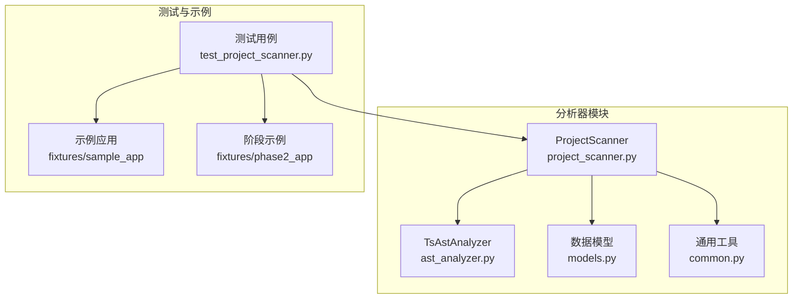
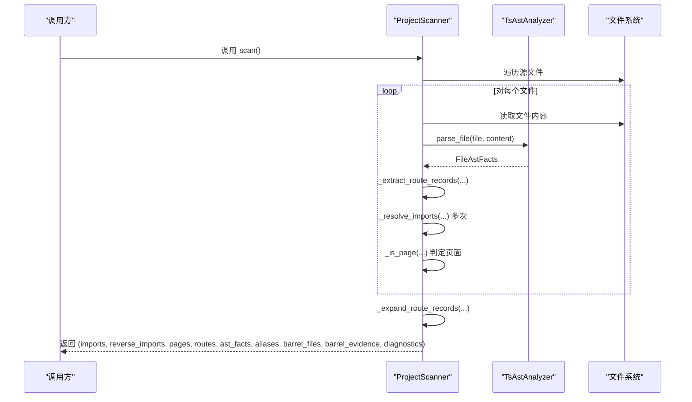
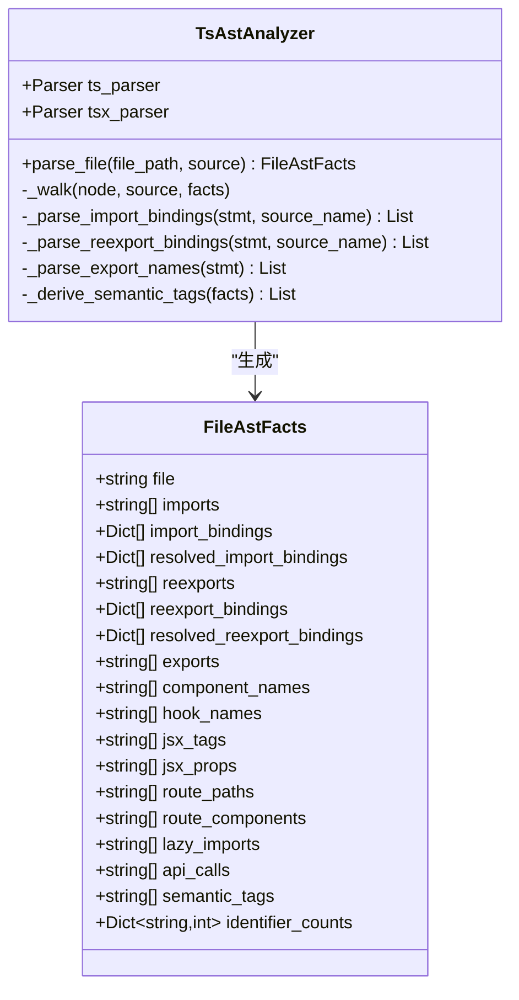
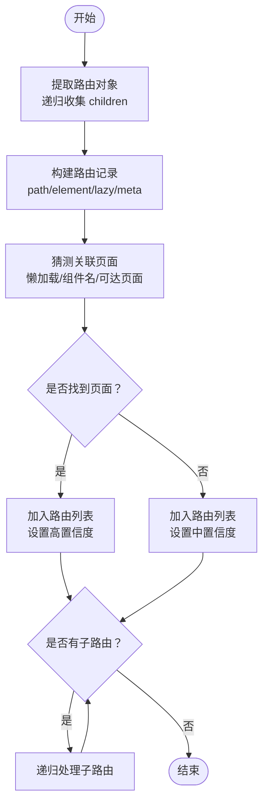
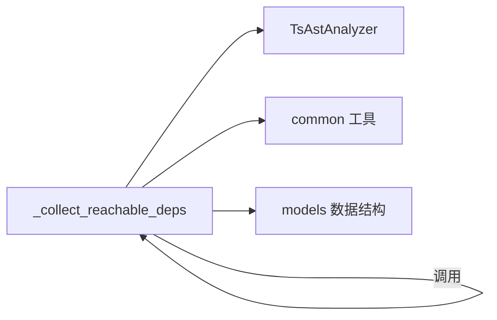

# ProjectScanner类

<cite>
**本文引用的文件**
- [project_scanner.py](file://scripts/analyzer/project_scanner.py)
- [ast_analyzer.py](file://scripts/analyzer/ast_analyzer.py)
- [models.py](file://scripts/analyzer/models.py)
- [common.py](file://scripts/analyzer/common.py)
- [test_project_scanner.py](file://tests/test_project_scanner.py)
- [index.tsx](file://fixtures/sample_app/src/routes/index.tsx)
- [UserListPage.tsx](file://fixtures/sample_app/src/pages/users/UserListPage.tsx)
- [SearchForm.tsx](file://fixtures/sample_app/src/components/shared/SearchForm.tsx)
- [userApi.ts](file://fixtures/sample_app/src/services/userApi.ts)
- [index.tsx](file://fixtures/phase2_app/src/routes/index.tsx)
</cite>

## 目录
1. [简介](#简介)
2. [项目结构](#项目结构)
3. [核心组件](#核心组件)
4. [架构总览](#架构总览)
5. [详细组件分析](#详细组件分析)
6. [依赖关系分析](#依赖关系分析)
7. [性能考量](#性能考量)
8. [故障排查指南](#故障排查指南)
9. [结论](#结论)
10. [附录](#附录)

## 简介
本文件为 ProjectScanner 类的详细API文档，聚焦于 scan() 方法的完整实现，涵盖以下方面：
- AST 解析：基于 Tree-Sitter 的 TypeScript/TSX 解析与静态分析
- 导入关系收集：常规导入、重导出、懒加载与别名解析
- 页面识别：基于路径约定与组件/JSX特征的页面判定
- 路由分析：从路由对象中提取路径、组件、懒加载与显示名，并建立路由到页面的绑定
- 返回数据结构：imports、reverse_imports、pages、routes、ast_facts、aliases、barrel_files、barrel_evidence、diagnostics
- 静态分析算法流程与性能考虑
- 配置选项与使用示例
- 与 Tree-Sitter 解析器的集成方式

## 项目结构
ProjectScanner 所在模块位于 scripts/analyzer，主要依赖如下：
- ast_analyzer.py：封装 Tree-Sitter 解析器与 AST 遍历逻辑
- models.py：定义返回数据结构（如 RouteInfo、FileAstFacts）
- common.py：通用工具函数（路径处理、别名解析、读取文件、去重等）
- tests/test_project_scanner.py：行为验证与示例断言

图表来源
- [project_scanner.py:13-383](file://scripts/analyzer/project_scanner.py#L13-L383)
- [ast_analyzer.py:13-242](file://scripts/analyzer/ast_analyzer.py#L13-L242)
- [models.py:43-75](file://scripts/analyzer/models.py#L43-L75)
- [common.py:74-151](file://scripts/analyzer/common.py#L74-L151)
- [test_project_scanner.py:8-80](file://tests/test_project_scanner.py#L8-L80)

章节来源
- [project_scanner.py:13-383](file://scripts/analyzer/project_scanner.py#L13-L383)
- [ast_analyzer.py:13-242](file://scripts/analyzer/ast_analyzer.py#L13-L242)
- [models.py:43-75](file://scripts/analyzer/models.py#L43-L75)
- [common.py:74-151](file://scripts/analyzer/common.py#L74-L151)
- [test_project_scanner.py:8-80](file://tests/test_project_scanner.py#L8-L80)

## 核心组件
- ProjectScanner：扫描项目、构建导入图、识别页面、解析路由并生成分析结果
- TsAstAnalyzer：基于 Tree-Sitter 的 AST 遍历，抽取导入/导出、组件名、JSX、路由信息、API 调用、语义标签等
- 数据模型：
  - RouteInfo：路由信息数据结构
  - FileAstFacts：单文件 AST 分析结果
- 通用工具：
  - 别名解析（tsconfig paths）与候选目标生成
  - 文件读取与安全解码
  - 去重与顺序保持

章节来源
- [project_scanner.py:13-383](file://scripts/analyzer/project_scanner.py#L13-L383)
- [ast_analyzer.py:13-242](file://scripts/analyzer/ast_analyzer.py#L13-L242)
- [models.py:43-75](file://scripts/analyzer/models.py#L43-L75)
- [common.py:74-151](file://scripts/analyzer/common.py#L74-L151)

## 架构总览
ProjectScanner 的 scan() 是主入口，其工作流如下：
- 初始化：解析 tsconfig 别名、创建 AST 分析器实例
- 遍历源文件：收集 TS/TSX/JS/JSX 源文件
- 对每个文件：
  - 使用 TsAstAnalyzer 进行 AST 解析，得到 FileAstFacts
  - 抽取路由对象记录（含嵌套 children）
  - 解析导入/重导出/懒加载，结合别名与候选扩展名解析为相对路径
  - 记录反向导入映射、页面集合、桶文件（reexport）证据
  - 识别页面：根据路径约定与组件/JSX特征
- 路由展开：递归构建完整路由树，尝试将路由绑定到页面，记录诊断信息
- 返回：导入图、反向导入、页面集、路由集、AST 事实、别名、桶文件、桶证据、诊断

图表来源
- [project_scanner.py:20-80](file://scripts/analyzer/project_scanner.py#L20-L80)
- [ast_analyzer.py:18-30](file://scripts/analyzer/ast_analyzer.py#L18-L30)

章节来源
- [project_scanner.py:20-80](file://scripts/analyzer/project_scanner.py#L20-L80)
- [ast_analyzer.py:18-30](file://scripts/analyzer/ast_analyzer.py#L18-L30)

## 详细组件分析

### ProjectScanner.scan() 方法详解
- 输入：项目根目录 Path
- 输出：九元组
  - imports: Dict[str, List[str]] —— 每个文件的直接导入（相对路径，去重且保持顺序）
  - reverse_imports: Dict[str, List[str]] —— 反向导入映射（被哪些文件导入）
  - pages: List[str] —— 页面文件列表（按路径排序去重）
  - routes: List[RouteInfo] —— 路由信息列表
  - ast_facts: Dict[str, Dict] —— 每个文件的 AST 事实字典
  - aliases: Dict[str, List[str]] —— tsconfig 别名映射（键为别名前缀，值为候选路径模式）
  - barrel_files: List[str] —— 重导出文件（reexport）列表
  - barrel_evidence: Dict[str, List[str]] —— 桶文件对应的导入证据（即其导出的文件）
  - diagnostics: List[Dict] —— 诊断信息（未解析导入、未绑定路由等）

- 关键步骤
  - 收集源文件：遍历 src 或项目根目录，过滤忽略目录与指定扩展名
  - AST 解析：对每个文件调用 TsAstAnalyzer.parse_file，得到 FileAstFacts
  - 路由记录提取：使用 Tree-Sitter 解析器在 TSX/JSX 中定位路由对象，递归收集 children
  - 导入解析：合并常规导入、重导出、懒加载与路由中的懒加载目标，结合别名与候选扩展名解析为绝对/相对路径
  - 反向导入：维护 reverse_imports 映射
  - 页面识别：若文件路径包含 pages/views 且存在组件名或 JSX 标签，则视为页面
  - 桶文件识别：若存在重导出，则标记为桶文件并记录导入证据
  - 路由展开：递归拼接父子路径，尝试将路由绑定到页面（通过组件名匹配、可达页面集合、懒加载目标），记录诊断
  - 去重与顺序：对导入、反向导入、页面进行去重与顺序保持

- 返回的数据结构说明
  - imports：键为相对文件路径，值为该文件导入的相对路径列表
  - reverse_imports：键为被导入的相对文件路径，值为导入它的文件列表
  - pages：页面文件相对路径列表
  - routes：RouteInfo 列表，包含 route_path、source_file、linked_page、route_component、parent_route、confidence、route_comment、display_name、display_name_source
  - ast_facts：键为相对文件路径，值为 FileAstFacts 的字典表示
  - aliases：别名映射，支持通配符与多目标
  - barrel_files：重导出文件列表
  - barrel_evidence：桶文件与其导出证据（即其导入的文件）
  - diagnostics：诊断项，包含类型、文件、目标与消息

章节来源
- [project_scanner.py:20-80](file://scripts/analyzer/project_scanner.py#L20-L80)
- [models.py:43-75](file://scripts/analyzer/models.py#L43-L75)

### AST 解析与 Tree-Sitter 集成
- 解析器初始化：TsAstAnalyzer 在构造时创建 TS 与 TSX 两套解析器
- 解析流程：对每个文件编码为字节，调用对应解析器解析为语法树，再遍历节点抽取信息
- 遍历策略：递归遍历子节点，按节点类型与字段提取导入/导出、组件名、JSX、路由、API 调用、语义标签等
- 语义标签推导：根据 JSX 标签、属性、API 调用、路由信息等综合生成

图表来源
- [ast_analyzer.py:13-242](file://scripts/analyzer/ast_analyzer.py#L13-L242)
- [models.py:56-75](file://scripts/analyzer/models.py#L56-L75)

章节来源
- [ast_analyzer.py:13-242](file://scripts/analyzer/ast_analyzer.py#L13-L242)
- [models.py:56-75](file://scripts/analyzer/models.py#L56-L75)

### 导入关系收集与别名解析
- 导入来源：常规 import、export from（重导出）、import() 懒加载、路由对象中的 lazy 字段
- 别名解析：支持 tsconfig paths 与通配符，支持 extends 继承多个配置层级
- 候选扩展名：当目标为相对路径时，尝试 .ts/.tsx/.js/.jsx 以及 index.ts/tsx/js/jsx
- 结果：将所有解析后的路径转换为相对于项目根的相对路径，去重并保持顺序

章节来源
- [project_scanner.py:93-121](file://scripts/analyzer/project_scanner.py#L93-L121)
- [common.py:74-151](file://scripts/analyzer/common.py#L74-L151)

### 页面识别算法
- 路径约定：文件路径包含 pages 或 views
- 组件/JSX特征：文件 AST 中存在 component_names 或 jsx_tags
- 结果：收集所有满足条件的页面文件，去重并保持顺序

章节来源
- [project_scanner.py:122-127](file://scripts/analyzer/project_scanner.py#L122-L127)

### 路由分析与绑定
- 路由对象提取：在 TSX/JSX 中定位路由对象，递归收集 children
- 字段解析：path、element/component、lazy、meta/handle/name/title 等
- 路由路径拼接：支持相对/绝对路径、父路径继承
- 页面绑定策略：
  - 若存在懒加载目标，优先尝试解析为页面
  - 若存在组件名，检查可达页面中是否存在同名组件或导出
  - 若仅有一个可达页面，回退绑定
  - 否则标记为未绑定路由
- 诊断：记录未解析导入与未绑定路由

图表来源
- [project_scanner.py:128-228](file://scripts/analyzer/project_scanner.py#L128-L228)

章节来源
- [project_scanner.py:128-228](file://scripts/analyzer/project_scanner.py#L128-L228)

### 数据结构与返回值
- imports：键为相对文件路径，值为导入的相对路径列表
- reverse_imports：键为被导入的相对文件路径，值为导入它的文件列表
- pages：页面文件相对路径列表
- routes：RouteInfo 列表
- ast_facts：键为相对文件路径，值为 FileAstFacts 的字典表示
- aliases：别名映射（支持通配符与多目标）
- barrel_files：重导出文件列表
- barrel_evidence：桶文件与其导入证据
- diagnostics：诊断项列表

章节来源
- [project_scanner.py:20-80](file://scripts/analyzer/project_scanner.py#L20-L80)
- [models.py:43-75](file://scripts/analyzer/models.py#L43-L75)

### 使用示例与配置
- 基本用法
  - 实例化 ProjectScanner 并调用 scan() 获取九元组
  - 示例断言参考测试用例，展示别名解析、页面识别、路由绑定与诊断输出
- 配置选项
  - tsconfig paths：通过 load_tsconfig_aliases 与 resolve_alias_targets 自动解析
  - 忽略目录：IGNORE_DIRS 控制遍历范围
  - 源文件扩展名：SRC_EXTS 控制扫描范围
- 示例文件
  - sample_app：包含别名、页面、路由与组件
  - phase2_app：包含多跳桶文件、嵌套路由与缺失页面的诊断

章节来源
- [test_project_scanner.py:8-80](file://tests/test_project_scanner.py#L8-L80)
- [common.py:8-151](file://scripts/analyzer/common.py#L8-L151)
- [index.tsx:1-20](file://fixtures/sample_app/src/routes/index.tsx#L1-L20)
- [UserListPage.tsx:1-14](file://fixtures/sample_app/src/pages/users/UserListPage.tsx#L1-L14)
- [SearchForm.tsx:1-9](file://fixtures/sample_app/src/components/shared/SearchForm.tsx#L1-L9)
- [userApi.ts:1-4](file://fixtures/sample_app/src/services/userApi.ts#L1-L4)
- [index.tsx:1-45](file://fixtures/phase2_app/src/routes/index.tsx#L1-L45)

## 依赖关系分析
- ProjectScanner 依赖
  - TsAstAnalyzer：提供 AST 解析能力
  - common：提供路径处理、别名解析、文件读取、去重等工具
  - models：提供 RouteInfo、FileAstFacts 等数据结构
- 内部依赖链
  - scan() 调用 _collect_source_files、_extract_route_records、_resolve_imports、_is_page、_expand_route_records
  - _expand_route_records 递归调用 _append_route_record
  - _append_route_record 调用 _guess_linked_page 与 _collect_reachable_deps
  - _guess_linked_page 调用 _resolve_imports 与 _collect_reachable_deps

图表来源
- [project_scanner.py:82-228](file://scripts/analyzer/project_scanner.py#L82-L228)
- [ast_analyzer.py:18-30](file://scripts/analyzer/ast_analyzer.py#L18-L30)
- [models.py:43-75](file://scripts/analyzer/models.py#L43-L75)
- [common.py:74-151](file://scripts/analyzer/common.py#L74-L151)

章节来源
- [project_scanner.py:82-228](file://scripts/analyzer/project_scanner.py#L82-L228)
- [ast_analyzer.py:18-30](file://scripts/analyzer/ast_analyzer.py#L18-L30)
- [models.py:43-75](file://scripts/analyzer/models.py#L43-L75)
- [common.py:74-151](file://scripts/analyzer/common.py#L74-L151)

## 性能考量
- 时间复杂度
  - 遍历源文件：O(F)，F 为源文件数量
  - 每文件 AST 解析：近似 O(N)，N 为源码字符数
  - 导入解析与候选扩展名尝试：O(K)，K 为导入/重导出/懒加载条目数
  - 页面识别：O(M)，M 为组件/JSX节点数
  - 路由展开：O(R)，R 为路由记录数
  - 反向导入与桶文件：O(E)，E 为边数（导入关系）
- 空间复杂度
  - 主要为存储 imports、reverse_imports、pages、routes、ast_facts、barrel_*、diagnostics 的线性开销
- 优化建议
  - 缓存 AST 解析结果（若重复扫描同一项目）
  - 将别名解析结果缓存至内存，避免重复读取 tsconfig
  - 对大项目启用增量扫描（仅扫描变更文件）
  - 限制扫描深度与忽略目录，减少 IO 与解析量

[本节为通用性能讨论，不直接分析具体文件]

## 故障排查指南
- 常见诊断类型
  - unresolved-import：无法解析的导入目标（可能为别名未命中或文件不存在）
  - unbound-route：路由无法绑定到页面（组件名不匹配、懒加载目标不可达、无唯一可达页面）
- 定位方法
  - 检查 aliases 是否正确加载（tsconfig paths 与 extends）
  - 检查导入路径是否符合候选扩展名规则（.ts/.tsx/.js/.jsx 与 index.*）
  - 检查页面路径是否包含 pages/views 且存在组件/JSX特征
  - 检查路由对象字段（path、element/component、lazy、meta/handle/name/title）
- 参考测试
  - 断言包含未解析导入与未绑定路由的诊断项，便于对照修复

章节来源
- [project_scanner.py:44-50](file://scripts/analyzer/project_scanner.py#L44-L50)
- [project_scanner.py:193-199](file://scripts/analyzer/project_scanner.py#L193-L199)
- [test_project_scanner.py:78-79](file://tests/test_project_scanner.py#L78-L79)

## 结论
ProjectScanner 通过 Tree-Sitter AST 解析与静态分析，实现了对前端项目的导入关系、页面识别与路由绑定。其设计以数据结构为中心，返回标准化的结果，便于后续影响分析与用例生成。配合别名解析与诊断机制，能够在复杂项目中稳定运行并提供可操作的反馈。

[本节为总结性内容，不直接分析具体文件]

## 附录

### API 定义与参数说明
- ProjectScanner(project_root: Path)
  - 参数：项目根目录 Path
  - 行为：初始化别名与 AST 分析器
- scan() -> Tuple[...]
  - 返回：九元组（见“核心组件”小节）

章节来源
- [project_scanner.py:14-17](file://scripts/analyzer/project_scanner.py#L14-L17)
- [project_scanner.py:20](file://scripts/analyzer/project_scanner.py#L20)

### 关键内部方法概览
- _collect_source_files() -> List[Path]
- _extract_route_records(file_path, content) -> List[Dict]
- _collect_route_objects(node, source, source_bytes) -> List[Dict]
- _build_route_record(node, source, source_bytes) -> Optional[Dict]
- _append_route_record(results, rel_file, record, imports, ast_facts, pages, diagnostics, parent_path, parent_route) -> None
- _guess_linked_page(rel_file, route_component, route_lazy_import, imports, ast_facts, pages) -> Optional[str]
- _collect_reachable_deps(start_file, imports) -> List[str]
- _resolve_imports(current_dir, raw_target) -> List[Path]
- _resolve_candidate(base) -> Optional[Path]
- _is_page(rel_file, facts) -> bool

章节来源
- [project_scanner.py:82-228](file://scripts/analyzer/project_scanner.py#L82-L228)