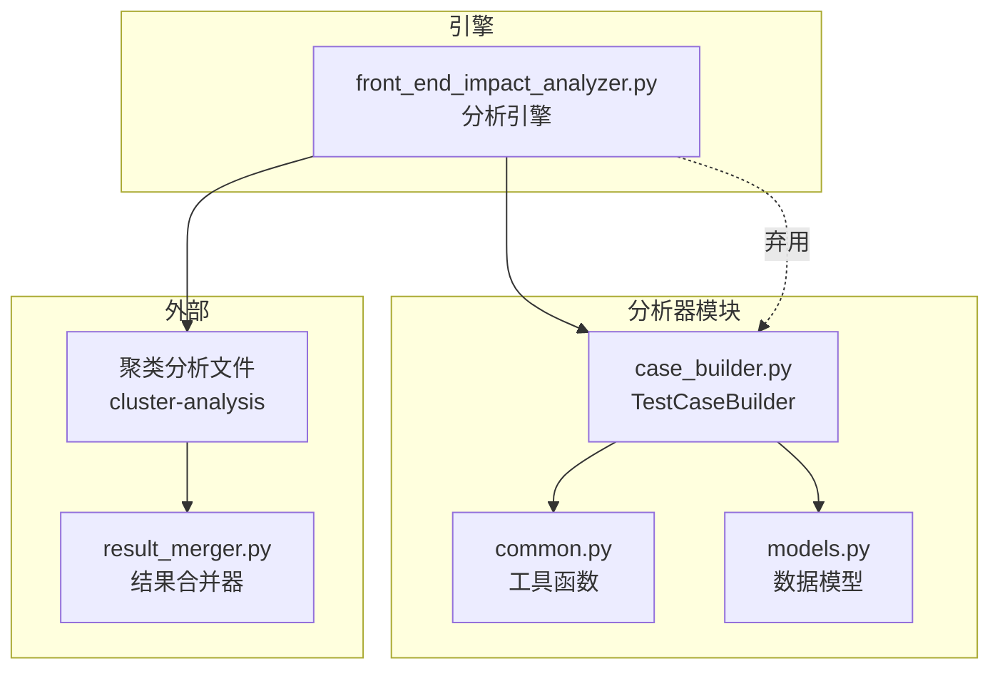
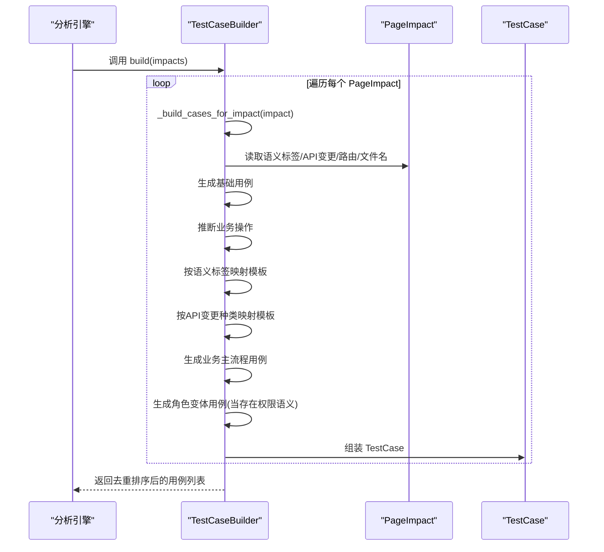
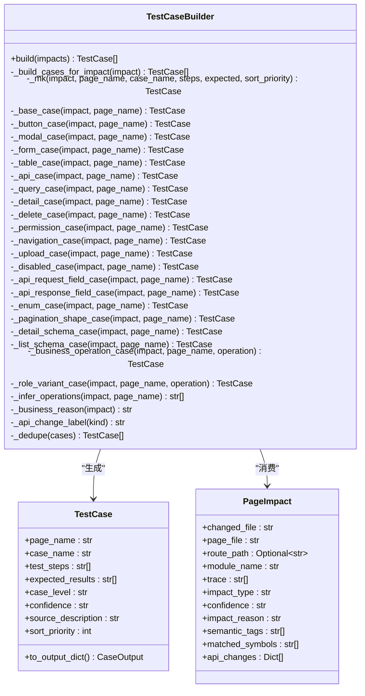
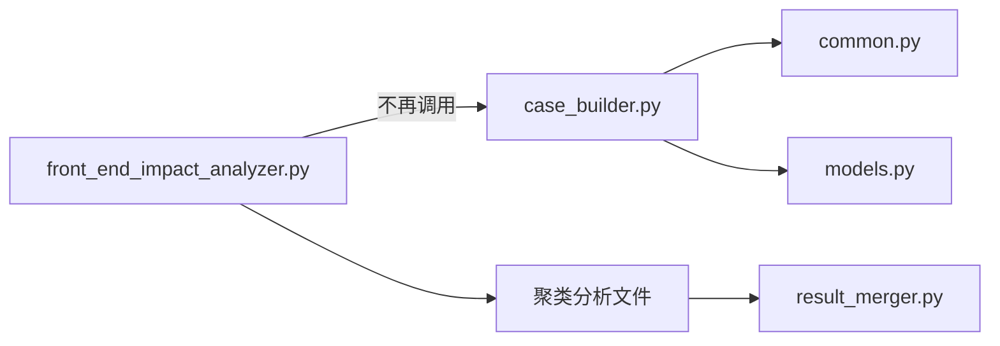

# TestCaseBuilder类

<cite>
**本文引用的文件**
- [case_builder.py](file://scripts/analyzer/case_builder.py)
- [models.py](file://scripts/analyzer/models.py)
- [common.py](file://scripts/analyzer/common.py)
- [front_end_impact_analyzer.py](file://scripts/front_end_impact_analyzer.py)
- [AGENTS.md](file://AGENTS.md)
</cite>

## 目录
1. [简介](#简介)
2. [项目结构](#项目结构)
3. [核心组件](#核心组件)
4. [架构总览](#架构总览)
5. [详细组件分析](#详细组件分析)
6. [依赖关系分析](#依赖关系分析)
7. [性能考量](#性能考量)
8. [故障排查指南](#故障排查指南)
9. [结论](#结论)
10. [附录](#附录)

## 简介
本文件为TestCaseBuilder类的完整API文档，聚焦于其build()方法的实现逻辑与用例生成策略。文档覆盖：
- 不同类型测试用例的生成规则与优先级
- 用例模板系统、工厂模式的应用与扩展机制
- 基础用例、业务场景用例、API变更用例、权限验证用例等的生成规则
- 自定义用例类型的扩展指南与最佳实践
- 与分析结果的映射关系及输出模型

特别说明：该模块当前处于弃用状态，模板用例不再作为主工作流的一部分，最终QA用例应来自Claude编写的聚类分析文件并通过result_merger进行合并。本文件保留以作历史参考与迁移指导。

## 项目结构
TestCaseBuilder位于分析器子包scripts/analyzer中，依赖通用工具与数据模型，并与前端分析引擎协同工作。

图表来源
- [case_builder.py:15-228](file://scripts/analyzer/case_builder.py#L15-L228)
- [models.py:77-112](file://scripts/analyzer/models.py#L77-L112)
- [common.py:37-72](file://scripts/analyzer/common.py#L37-L72)
- [front_end_impact_analyzer.py:56-160](file://scripts/front_end_impact_analyzer.py#L56-L160)

章节来源
- [case_builder.py:1-228](file://scripts/analyzer/case_builder.py#L1-L228)
- [models.py:18-112](file://scripts/analyzer/models.py#L18-L112)
- [common.py:1-151](file://scripts/analyzer/common.py#L1-L151)
- [front_end_impact_analyzer.py:1-200](file://scripts/front_end_impact_analyzer.py#L1-L200)

## 核心组件
- TestCaseBuilder：负责将PageImpact集合转换为TestCase列表，内置语义到用例模板的映射与去重排序逻辑。
- 数据模型：
  - PageImpact：承载页面影响分析结果，包含语义标签、匹配符号、API变更等。
  - TestCase：承载单个测试用例，包含页面名、用例名、测试步骤、预期结果、用例等级、置信度、来源描述与排序优先级。
- 工具函数：
  - title_from_file：从文件路径生成页面标题。
  - uniq_keep_order：去重并保持顺序。
  - confidence_to_priority：将置信度映射为用例等级。

章节来源
- [case_builder.py:15-228](file://scripts/analyzer/case_builder.py#L15-L228)
- [models.py:77-112](file://scripts/analyzer/models.py#L77-L112)
- [common.py:37-72](file://scripts/analyzer/common.py#L37-L72)

## 架构总览
TestCaseBuilder采用“工厂+模板”的组合模式：
- build()遍历PageImpact，委托内部工厂方法生成多种用例模板。
- 语义标签驱动模板映射，API变更种类驱动API专用模板。
- 业务操作推断用于生成业务主流程用例与角色变体用例。
- 最终通过去重与排序得到稳定有序的用例序列。

图表来源
- [case_builder.py:16-64](file://scripts/analyzer/case_builder.py#L16-L64)
- [case_builder.py:66-228](file://scripts/analyzer/case_builder.py#L66-L228)
- [models.py:92-112](file://scripts/analyzer/models.py#L92-L112)

## 详细组件分析

### 类结构与职责

图表来源
- [case_builder.py:15-228](file://scripts/analyzer/case_builder.py#L15-L228)
- [models.py:77-112](file://scripts/analyzer/models.py#L77-L112)

章节来源
- [case_builder.py:15-228](file://scripts/analyzer/case_builder.py#L15-L228)
- [models.py:77-112](file://scripts/analyzer/models.py#L77-L112)

### build()方法实现逻辑
- 输入：PageImpact列表
- 输出：去重并按多关键字排序的TestCase列表
- 关键步骤：
  - 遍历每个PageImpact，调用内部工厂方法生成用例组
  - 合并所有用例组，调用去重与排序
- 去重与排序依据：
  - 去重：以(页面名, 用例名)为键
  - 排序：页面名、sort_priority、用例等级、置信度、用例名

章节来源
- [case_builder.py:16-21, 209-228:16-21](file://scripts/analyzer/case_builder.py#L16-L21)
- [case_builder.py:209-228](file://scripts/analyzer/case_builder.py#L209-L228)

### 用例模板系统与工厂模式
- 语义标签映射：根据PageImpact的semantic_tags选择对应的模板构建器
- API变更映射：根据PageImpact.api_changes中的kind选择API专用模板
- 业务操作推断：从页面名、文件名、路由等文本中识别业务操作，生成业务主流程用例
- 角色变体用例：当存在权限语义时，为每种业务操作生成角色差异验证用例

章节来源
- [case_builder.py:22-64](file://scripts/analyzer/case_builder.py#L22-L64)
- [case_builder.py:123-152](file://scripts/analyzer/case_builder.py#L123-L152)
- [case_builder.py:154-175](file://scripts/analyzer/case_builder.py#L154-L175)

### 用例类型与生成规则

#### 基础用例
- 名称：页面基础回归
- 步骤：进入页面，观察页面初始化渲染
- 预期：页面可正常加载，页面无报错、无白屏、无异常提示
- 优先级：10

章节来源
- [case_builder.py:83-84](file://scripts/analyzer/case_builder.py#L83-L84)

#### 业务场景用例
- 列表浏览与关键操作验证：适用于包含列表、索引、表格等语义或文本关键词
- 详情查看主流程验证：适用于detail、view、info等语义或文本关键词
- 新增主流程验证：适用于create、new、add等语义或文本关键词
- 编辑主流程验证：适用于edit、update等语义或文本关键词
- 删除主流程验证：适用于delete、remove等语义或文本关键词
- 其他业务主流程验证：默认兜底

章节来源
- [case_builder.py:123-134](file://scripts/analyzer/case_builder.py#L123-L134)
- [case_builder.py:154-175](file://scripts/analyzer/case_builder.py#L154-L175)

#### API变更用例
- 请求字段变更验证：请求字段新增/删除/重命名
- 响应字段映射验证：响应字段变化后页面展示与容错
- 枚举值与状态映射验证：枚举值映射与异常处理
- 分页参数结构验证：分页参数名与结构、总数与翻页行为
- 详情接口字段结构验证：详情字段变化后的展示与回显
- 列表接口字段结构验证：列表字段变化后的展示与筛选

章节来源
- [case_builder.py:48-58](file://scripts/analyzer/case_builder.py#L48-L58)
- [case_builder.py:110-121](file://scripts/analyzer/case_builder.py#L110-L121)

#### 权限验证用例
- 权限可见性与可操作性验证：不同角色下的页面可见性与按钮/字段可操作性
- 角色权限差异验证：针对列表查看、详情查看、新增、编辑、删除、访问等操作的角色差异

章节来源
- [case_builder.py:38, 61-63:38-63](file://scripts/analyzer/case_builder.py#L38-L63)
- [case_builder.py:101-102](file://scripts/analyzer/case_builder.py#L101-L102)
- [case_builder.py:136-152](file://scripts/analyzer/case_builder.py#L136-L152)

#### 其他UI交互用例
- 按钮入口与点击行为验证
- 弹窗打开关闭与提交验证
- 表单展示校验与提交流程验证
- 列表列展示与表格交互验证
- 接口调用与页面反馈验证
- 查询筛选分页排序验证
- 详情展示与回显验证
- 删除流程与结果反馈验证
- 导航/路由进入跳转与返回验证
- 上传流程验证
- 禁用态与只读态验证

章节来源
- [case_builder.py:85-109](file://scripts/analyzer/case_builder.py#L85-L109)
- [case_builder.py:103-105](file://scripts/analyzer/case_builder.py#L103-L105)

### 用例模板系统与扩展机制
- 模板映射：
  - 语义标签到模板：如button、modal、form、validation、table、columns、api、list-query、detail、delete、permission、navigation、upload、disabled-state、route等
  - API变更种类到模板：如request-field-change、response-field-change、enum-change、pagination-shape-change、detail-schema-change、list-schema-change
- 扩展建议：
  - 在映射表中添加新的语义标签与模板构建器
  - 在API映射表中添加新的API变更种类与模板构建器
  - 为业务操作推断增加新的关键词或正则表达式
  - 为角色变体用例增加新的操作类型
- 最佳实践：
  - 保持模板构建器的单一职责，仅负责组装步骤与预期
  - 使用统一的优先级与排序策略
  - 通过_source_description聚合影响原因、业务动作、命中符号、接口风险、模块等信息

章节来源
- [case_builder.py:27-43, 47-58:27-58](file://scripts/analyzer/case_builder.py#L27-L58)
- [case_builder.py:177-196](file://scripts/analyzer/case_builder.py#L177-L196)

### 与分析结果的映射关系
- PageImpact到TestCase：
  - 页面名：由文件名推导
  - 用例等级与置信度：由置信度映射
  - 来源描述：聚合影响原因、业务动作、命中符号、接口风险、模块等
  - 排序优先级：由具体模板设定
- 输出模型：
  - TestCase.to_output_dict()将用例映射为中文字段的字典，便于后续导出

章节来源
- [case_builder.py:66-81](file://scripts/analyzer/case_builder.py#L66-L81)
- [models.py:92-112](file://scripts/analyzer/models.py#L92-L112)

## 依赖关系分析
- 内部依赖：
  - common.title_from_file：生成页面标题
  - common.uniq_keep_order：去重与顺序保持
  - common.confidence_to_priority：置信度到等级映射
  - models.PageImpact：输入数据结构
  - models.TestCase：输出数据结构
- 外部依赖：
  - 分析引擎front_end_impact_analyzer.py：当前工作流中不再直接调用build_cases，模板用例已弃用
  - 聚类分析与合并器：最终用例应来自Claude编写的聚类分析文件并通过result_merger合并

图表来源
- [front_end_impact_analyzer.py:146](file://scripts/front_end_impact_analyzer.py#L146)
- [case_builder.py:11-12](file://scripts/analyzer/case_builder.py#L11-L12)
- [models.py:77-112](file://scripts/analyzer/models.py#L77-L112)
- [common.py:37-72](file://scripts/analyzer/common.py#L37-L72)

章节来源
- [front_end_impact_analyzer.py:56-160](file://scripts/front_end_impact_analyzer.py#L56-L160)
- [case_builder.py:11-12](file://scripts/analyzer/case_builder.py#L11-L12)
- [models.py:77-112](file://scripts/analyzer/models.py#L77-L112)
- [common.py:37-72](file://scripts/analyzer/common.py#L37-L72)

## 性能考量
- 时间复杂度：
  - build()对每个PageImpact生成若干模板用例，整体复杂度近似O(N*M)，其中N为PageImpact数量，M为平均模板数
  - 去重与排序：O(K log K)，K为生成用例总数
- 空间复杂度：
  - 存储中间用例列表与去重集合，空间复杂度O(K)
- 优化建议：
  - 控制模板映射规模，避免冗余模板
  - 对大体量PageImpact进行分批处理
  - 在上游阶段减少噪声影响，降低无效模板生成

## 故障排查指南
- 用例为空：
  - 确认PageImpact是否包含有效语义标签或API变更
  - 检查业务操作推断是否命中关键词
- 用例重复：
  - 检查页面名与用例名是否唯一
  - 确认去重逻辑未误判
- 优先级异常：
  - 检查模板的sort_priority设置
  - 确认排序键的优先级顺序符合预期
- 来源描述不完整：
  - 检查影响原因、业务动作、命中符号、接口风险、模块等字段是否填充

章节来源
- [case_builder.py:209-228](file://scripts/analyzer/case_builder.py#L209-L228)
- [case_builder.py:177-196](file://scripts/analyzer/case_builder.py#L177-L196)

## 结论
TestCaseBuilder提供了完备的模板用例生成体系，通过语义标签、API变更与业务操作推断，将结构化的PageImpact转化为可执行的测试用例。尽管当前工作流已弃用模板用例，但其设计仍具备良好的扩展性与可维护性，适合在迁移完成后作为项目特定模板系统的基座。

## 附录

### API定义与使用示例（路径）
- 构造与入口
  - [build(impacts):16-21](file://scripts/analyzer/case_builder.py#L16-L21)
- 模板构建器（示例路径）
  - [基础用例:83-84](file://scripts/analyzer/case_builder.py#L83-L84)
  - [业务主流程用例:123-134](file://scripts/analyzer/case_builder.py#L123-L134)
  - [API变更用例:110-121](file://scripts/analyzer/case_builder.py#L110-L121)
  - [权限验证用例:101-102](file://scripts/analyzer/case_builder.py#L101-L102)
  - [导航/路由用例:103-105](file://scripts/analyzer/case_builder.py#L103-L105)
- 辅助方法（示例路径）
  - [去重与排序:209-228](file://scripts/analyzer/case_builder.py#L209-L228)
  - [业务原因聚合:177-196](file://scripts/analyzer/case_builder.py#L177-L196)
  - [页面标题生成:47-51](file://scripts/analyzer/common.py#L47-L51)
  - [去重与顺序保持:37-44](file://scripts/analyzer/common.py#L37-L44)
  - [置信度到等级映射:70-71](file://scripts/analyzer/common.py#L70-L71)