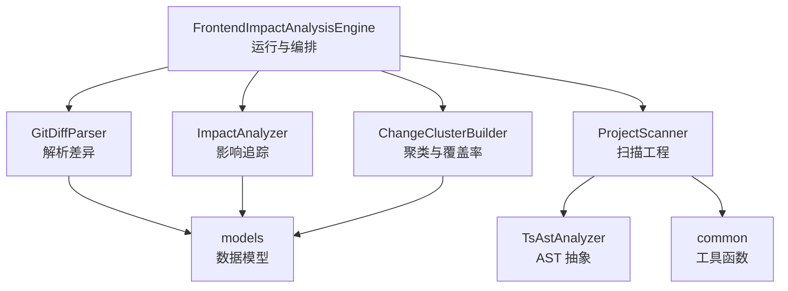
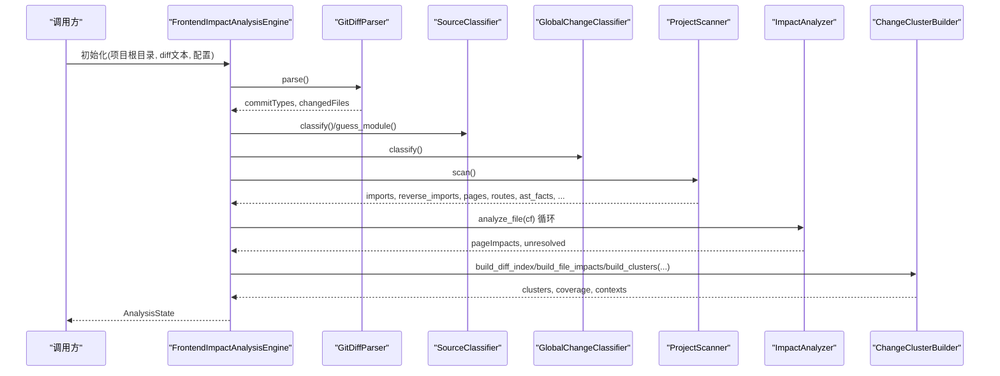
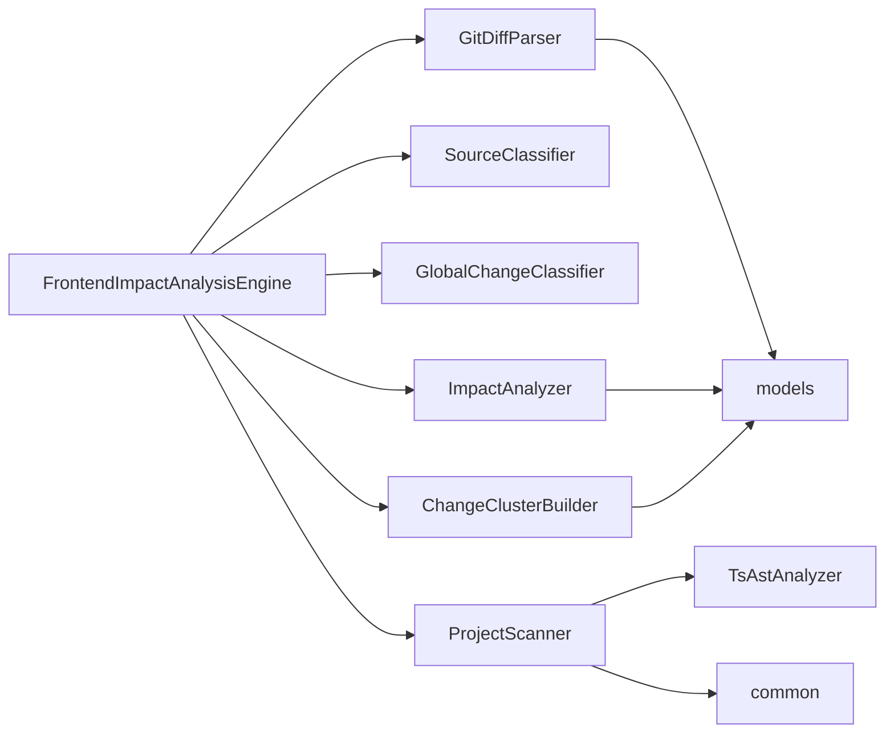

# 核心类与方法

<cite>
**本文引用的文件**
- [scripts/front_end_impact_analyzer.py](file://scripts/front_end_impact_analyzer.py)
- [scripts/analyzer/impact_engine.py](file://scripts/analyzer/impact_engine.py)
- [scripts/analyzer/project_scanner.py](file://scripts/analyzer/project_scanner.py)
- [scripts/analyzer/case_builder.py](file://scripts/analyzer/case_builder.py)
- [scripts/analyzer/models.py](file://scripts/analyzer/models.py)
- [scripts/analyzer/ast_analyzer.py](file://scripts/analyzer/ast_analyzer.py)
- [scripts/analyzer/common.py](file://scripts/analyzer/common.py)
- [scripts/analyzer/diff_parser.py](file://scripts/analyzer/diff_parser.py)
- [scripts/analyzer/source_classifier.py](file://scripts/analyzer/source_classifier.py)
- [scripts/analyzer/noise_classifier.py](file://scripts/analyzer/noise_classifier.py)
- [scripts/analyzer/global_change_classifier.py](file://scripts/analyzer/global_change_classifier.py)
- [scripts/analyzer/cluster_builder.py](file://scripts/analyzer/cluster_builder.py)
- [tests/test_impact_engine.py](file://tests/test_impact_engine.py)
- [tests/test_project_scanner.py](file://tests/test_project_scanner.py)
</cite>

## 目录
1. [简介](#简介)
2. [项目结构](#项目结构)
3. [核心组件](#核心组件)
4. [架构总览](#架构总览)
5. [详细组件分析](#详细组件分析)
6. [依赖分析](#依赖分析)
7. [性能考虑](#性能考虑)
8. [故障排查指南](#故障排查指南)
9. [结论](#结论)
10. [附录](#附录)

## 简介
本文件面向使用者与维护者，系统化梳理前端影响分析引擎的核心类与方法，重点覆盖以下内容：
- FrontendImpactAnalysisEngine 类的完整 API 文档，尤其是 run() 方法的执行流程、输入输出与返回值。
- ImpactAnalyzer、ProjectScanner、TestCaseBuilder 等核心类的公共方法签名、参数说明、返回值类型与典型用法。
- 类之间的依赖关系与交互模式，以及异常处理与错误码说明。
- 使用示例与最佳实践，帮助快速集成与扩展。

## 项目结构
该分析器采用“扫描-分类-影响追踪-聚类-产物生成”的流水线式设计，核心模块如下：
- 前端影响分析引擎：FrontendImpactAnalysisEngine（入口与编排）
- 工程扫描与路由解析：ProjectScanner（AST 解析、别名解析、路由绑定）
- 影响追踪与页面映射：ImpactAnalyzer（反向依赖图、符号传播、页面追踪）
- 变更分类与噪声过滤：SourceClassifier、NoiseClassifier、GlobalChangeClassifier
- 差异解析与语义标签抽取：GitDiffParser
- AST 抽象语法树分析：TsAstAnalyzer
- 数据模型与状态存储：models（数据类、状态记录器、状态存储）
- 公共工具与常量：common
- 用例模板构建（历史参考）：TestCaseBuilder
- 聚合与中间产物：ChangeClusterBuilder

图表来源
- [scripts/front_end_impact_analyzer.py:56-160](file://scripts/front_end_impact_analyzer.py#L56-L160)
- [scripts/analyzer/project_scanner.py:20-80](file://scripts/analyzer/project_scanner.py#L20-L80)
- [scripts/analyzer/impact_engine.py:26-58](file://scripts/analyzer/impact_engine.py#L26-L58)
- [scripts/analyzer/cluster_builder.py:16-90](file://scripts/analyzer/cluster_builder.py#L16-L90)
- [scripts/analyzer/diff_parser.py:62-110](file://scripts/analyzer/diff_parser.py#L62-L110)
- [scripts/analyzer/ast_analyzer.py:18-30](file://scripts/analyzer/ast_analyzer.py#L18-L30)
- [scripts/analyzer/common.py:17-96](file://scripts/analyzer/common.py#L17-L96)
- [scripts/analyzer/models.py:26-161](file://scripts/analyzer/models.py#L26-L161)

章节来源
- [scripts/front_end_impact_analyzer.py:23-160](file://scripts/front_end_impact_analyzer.py#L23-L160)
- [scripts/analyzer/project_scanner.py:13-80](file://scripts/analyzer/project_scanner.py#L13-L80)
- [scripts/analyzer/impact_engine.py:10-58](file://scripts/analyzer/impact_engine.py#L10-L58)
- [scripts/analyzer/cluster_builder.py:11-90](file://scripts/analyzer/cluster_builder.py#L11-L90)
- [scripts/analyzer/diff_parser.py:11-110](file://scripts/analyzer/diff_parser.py#L11-L110)
- [scripts/analyzer/ast_analyzer.py:13-30](file://scripts/analyzer/ast_analyzer.py#L13-L30)
- [scripts/analyzer/common.py:1-96](file://scripts/analyzer/common.py#L1-L96)
- [scripts/analyzer/models.py:18-161](file://scripts/analyzer/models.py#L18-L161)

## 核心组件
本节聚焦于核心类的公共 API 与职责边界，便于直接查阅与复用。

- FrontendImpactAnalysisEngine
  - 职责：接收 Git diff、配置与预检报告，驱动整条分析流水线，产出 AnalysisState 与最终结果包。
  - 关键方法：
    - run() -> AnalysisState：执行完整分析流程，返回统一状态对象。
    - write_run_artifacts(run_dir: Path, state: AnalysisState) -> None：将中间产物与最终结果写入指定目录。
    - 内部辅助：_build_analysis_package(...)、_analysis_status(...)。

- ImpactAnalyzer
  - 职责：基于反向导入图与 AST 事实，从变更文件追踪到页面，计算影响类型、置信度与原因。
  - 关键方法：
    - analyze_file(cf: ChangedFile) -> Tuple[List[PageImpact], Optional[Dict]]：对单个变更文件进行影响分析，返回页面影响列表与未解析诊断（若存在）。
    - _trace_to_pages(start_file: str, changed_symbols: List[str]) -> List[Tuple[List[str], List[str]]]：广度优先搜索反向依赖，找到可达页面路径与匹配符号。
    - _changed_symbols(...)、_symbols_for_parent(...)、_merge_semantics(...)、_impact_type(...)、_confidence(...)、_reason(...)：内部策略方法。

- ProjectScanner
  - 职责：遍历源码、解析 AST、提取导入/导出/路由信息、解析 tsconfig 别名、识别页面与路由。
  - 关键方法：
    - scan() -> Tuple[...]: 返回 imports、reverse_imports、pages、routes、ast_facts、aliases、barrel_files、barrel_evidence、diagnostics。
    - _resolve_imports(...)、_resolve_candidate(...)、_is_page(...)、_append_route_record(...)、_guess_linked_page(...)、_collect_reachable_deps(...)：内部实现细节。

- TestCaseBuilder（历史参考）
  - 职责：根据 PageImpact 推导测试用例模板（已弃用为模板生成，现由外部 Claude 生成并合并）。
  - 关键方法：
    - build(impacts: List[PageImpact]) -> List[TestCase]：生成用例清单并去重排序。

- 数据模型与状态
  - ChangedFile、RouteInfo、FileAstFacts、PageImpact、TestCase、AnalysisState、ProcessLog、ProcessRecorder、StateStore：承载输入、中间态与输出的数据结构与持久化。

章节来源
- [scripts/front_end_impact_analyzer.py:23-160](file://scripts/front_end_impact_analyzer.py#L23-L160)
- [scripts/analyzer/impact_engine.py:10-188](file://scripts/analyzer/impact_engine.py#L10-L188)
- [scripts/analyzer/project_scanner.py:13-383](file://scripts/analyzer/project_scanner.py#L13-L383)
- [scripts/analyzer/case_builder.py:15-228](file://scripts/analyzer/case_builder.py#L15-L228)
- [scripts/analyzer/models.py:18-201](file://scripts/analyzer/models.py#L18-L201)

## 架构总览
下面以序列图展示 FrontendImpactAnalysisEngine.run() 的端到端流程：

图表来源
- [scripts/front_end_impact_analyzer.py:56-160](file://scripts/front_end_impact_analyzer.py#L56-L160)
- [scripts/analyzer/diff_parser.py:62-110](file://scripts/analyzer/diff_parser.py#L62-L110)
- [scripts/analyzer/source_classifier.py:6-36](file://scripts/analyzer/source_classifier.py#L6-L36)
- [scripts/analyzer/global_change_classifier.py:8-57](file://scripts/analyzer/global_change_classifier.py#L8-L57)
- [scripts/analyzer/project_scanner.py:20-80](file://scripts/analyzer/project_scanner.py#L20-L80)
- [scripts/analyzer/impact_engine.py:26-58](file://scripts/analyzer/impact_engine.py#L26-L58)
- [scripts/analyzer/cluster_builder.py:16-90](file://scripts/analyzer/cluster_builder.py#L16-L90)

## 详细组件分析

### FrontendImpactAnalysisEngine 类 API
- 构造函数
  - 参数
    - project_root: Path
    - diff_text: str
    - requirement_text: str = ""
    - config: dict | None = None
    - manifest: dict | None = None
    - preflight_report: dict | None = None
  - 作用：初始化分析元数据、配置、预检报告与状态存储。
- run() -> AnalysisState
  - 执行步骤
    - 解析 diff：GitDiffParser.parse()
    - 文件分类：SourceClassifier + GlobalChangeClassifier
    - 工程扫描：ProjectScanner.scan()
    - 影响分析：ImpactAnalyzer.analyze_file() 对每个变更文件
    - 中间产物：构建 diff index、file impact seeds、change clusters、cluster contexts、coverage
    - 结果封装：_build_analysis_package() 生成最终分析包
  - 返回值：AnalysisState（包含 meta、input、codeGraph、codeImpact、candidateImpact、businessImpact、workflow、output、processLogs）
- write_run_artifacts(run_dir: Path, state: AnalysisState) -> None
  - 将 run manifest、preflight、document index、diff index、file impact seeds、change clusters、cluster tasks、cluster contexts、coverage、analysis state、final result 写入 run_dir
- 内部方法
  - _build_analysis_package(clusters, coverage, document_index) -> dict
  - _analysis_status(page_impacts, unresolved, diagnostics) -> str

使用示例（路径引用）
- [scripts/front_end_impact_analyzer.py:56-160](file://scripts/front_end_impact_analyzer.py#L56-L160)
- [scripts/front_end_impact_analyzer.py:162-175](file://scripts/front_end_impact_analyzer.py#L162-L175)

最佳实践
- 在调用 run() 前确保传入有效的 diff 文本与配置。
- 若需要保留中间产物，使用 write_run_artifacts() 输出到指定目录。
- 分析状态中的 meta.analysisStatus 可用于判断整体执行结果。

章节来源
- [scripts/front_end_impact_analyzer.py:23-175](file://scripts/front_end_impact_analyzer.py#L23-L175)
- [scripts/analyzer/models.py:115-161](file://scripts/analyzer/models.py#L115-L161)

### ImpactAnalyzer 类 API
- 构造函数
  - 参数
    - imports: Dict[str, List[str]]
    - reverse_imports: Dict[str, List[str]]
    - pages: List[str]
    - routes: List[RouteInfo]
    - ast_facts: Dict[str, Dict]
  - 作用：建立反向导入图、页面集合、路由映射与 AST 事实索引。
- analyze_file(cf: ChangedFile) -> Tuple[List[PageImpact], Optional[Dict]]
  - 输入：单个 ChangedFile
  - 处理逻辑
    - 若 format-only 或噪声文件，返回空影响与无诊断
    - 若文件类型为 page，直接构建直接影响
    - 否则：计算变更符号 -> 符号传播追踪至页面 -> 合并语义标签 -> 生成 PageImpact 列表
    - 若无法追踪到页面，返回未解析诊断
  - 返回：(List[PageImpact], Optional[Dict])，其中诊断字典包含 file、fileType、confidence、reason
- 内部方法
  - _build_page_direct_impacts(cf: ChangedFile) -> List[PageImpact]
  - _trace_to_pages(start_file: str, changed_symbols: List[str]) -> List[Tuple[List[str], List[str]]]
  - _changed_symbols(file_path: str, diff_symbols: List[str]) -> List[str]
  - _symbols_for_parent(current_file: str, parent_file: str, active_symbols: List[str], strict_symbols: bool) -> Optional[Tuple[List[str], bool]]
  - _merge_semantics(file_path: str, diff_tags: List[str]) -> List[str]
  - _impact_type(file_type: str) -> str
  - _confidence(file_type: str, trace: List[str], semantics: List[str]) -> str
  - _reason(file_type: str, trace: List[str], semantics: List[str], matched_symbols: List[str]) -> str

使用示例（路径引用）
- [scripts/analyzer/impact_engine.py:26-58](file://scripts/analyzer/impact_engine.py#L26-L58)
- [tests/test_impact_engine.py:11-85](file://tests/test_impact_engine.py#L11-L85)

最佳实践
- 确保传入的 imports、reverse_imports、pages、routes、ast_facts 来自同一轮 ProjectScanner.scan()。
- 对 format-only 或噪声文件，analyze_file() 会短路返回，避免无效计算。
- 当返回诊断非空时，应结合 diagnostics 与 PageImpact 语义标签综合评估。

章节来源
- [scripts/analyzer/impact_engine.py:10-188](file://scripts/analyzer/impact_engine.py#L10-L188)
- [tests/test_impact_engine.py:11-85](file://tests/test_impact_engine.py#L11-L85)

### ProjectScanner 类 API
- 构造函数
  - 参数：project_root: Path
  - 作用：初始化 AST 分析器、tsconfig 别名解析。
- scan() -> Tuple[...]
  - 返回
    - imports: Dict[str, List[str]]
    - reverse_imports: Dict[str, List[str]]
    - pages: List[str]
    - routes: List[RouteInfo]
    - ast_facts: Dict[str, Dict]
    - aliases: Dict[str, List[str]]
    - barrel_files: List[str]
    - barrel_evidence: Dict[str, List[str]]
    - diagnostics: List[Dict[str, str]]
  - 关键步骤
    - 遍历源文件、解析 AST、提取导入/导出/路由信息
    - 解析 tsconfig 别名，解析相对导入与别名导入
    - 识别页面与路由，绑定路由与页面
    - 收集诊断（未解析导入、未绑定路由等）

使用示例（路径引用）
- [scripts/analyzer/project_scanner.py:20-80](file://scripts/analyzer/project_scanner.py#L20-L80)
- [tests/test_project_scanner.py:8-80](file://tests/test_project_scanner.py#L8-L80)

最佳实践
- 确保 tsconfig.json 存在且可解析，以便正确解析别名。
- 若存在多级继承（extends），内部会递归加载父配置。
- 对于 barrel 文件（index 导出），可作为间接依赖证据。

章节来源
- [scripts/analyzer/project_scanner.py:13-383](file://scripts/analyzer/project_scanner.py#L13-L383)
- [tests/test_project_scanner.py:8-80](file://tests/test_project_scanner.py#L8-L80)

### TestCaseBuilder 类 API（历史参考）
- 构造函数：无参数
- build(impacts: List[PageImpact]) -> List[TestCase]
  - 根据 PageImpact 推导业务操作与语义标签，生成用例模板清单
  - 去重与排序：按页面名、排序优先级、用例等级、置信度排序
- 内部方法（若干 _xxx_case(...) 与 _infer_operations(...)、_business_reason(...)）

注意
- 模板用例生成已弃用，当前流程要求由 Claude 生成并合并。

使用示例（路径引用）
- [scripts/analyzer/case_builder.py:15-228](file://scripts/analyzer/case_builder.py#L15-L228)

章节来源
- [scripts/analyzer/case_builder.py:15-228](file://scripts/analyzer/case_builder.py#L15-L228)

### 数据模型与状态
- ChangedFile：变更文件元信息（路径、变更类型、行数统计、符号、语义标签、API 变更、文件类型、模块猜测、是否仅格式化、噪声分类、全局分类）
- RouteInfo：路由信息（路径、源文件、绑定页面、组件、父路由、置信度、注释、显示名等）
- FileAstFacts：AST 提取的事实（导入/导出/绑定、组件名、Hook 名、JSX 标签/属性、路由信息、懒加载、API 调用、语义标签、标识符计数）
- PageImpact：页面影响（变更文件、页面文件、路由路径、模块名、追踪路径、影响类型、置信度、原因、语义标签、匹配符号、API 变更）
- TestCase：测试用例（页面名、用例名、步骤、预期、等级、置信度、来源描述、排序优先级）
- AnalysisState：分析状态（meta、input、parsedDiff、codeGraph、codeImpact、candidateImpact、businessImpact、workflow、output、processLogs）
- ProcessLog、ProcessRecorder、StateStore：过程日志与状态持久化

使用示例（路径引用）
- [scripts/analyzer/models.py:26-201](file://scripts/analyzer/models.py#L26-L201)

章节来源
- [scripts/analyzer/models.py:18-201](file://scripts/analyzer/models.py#L18-L201)

### 工具与辅助类
- TsAstAnalyzer：解析 TS/TSX，提取导入/导出/绑定、组件/Hook、JSX、路由、懒加载、API 调用、语义标签
- SourceClassifier：文件类型分类与模块猜测
- NoiseClassifier：噪声分类（格式化、注释、导入、类型、文本、样式、测试、锁文件、生成物等）
- GlobalChangeClassifier：全局变更分类（应用入口、Provider、Layout、主题/全局样式、国际化、鉴权/权限、请求基础设施、路由根）
- ChangeClusterBuilder：构建 diff index、file impact seeds、change clusters、coverage
- GitDiffParser：解析 diff，抽取符号、语义标签、API 变更、格式化判断
- common：路径规范化、相对路径、安全读取、去重、标题转换、模块名推断、别名解析、TS 配置加载

使用示例（路径引用）
- [scripts/analyzer/ast_analyzer.py:13-242](file://scripts/analyzer/ast_analyzer.py#L13-L242)
- [scripts/analyzer/source_classifier.py:6-36](file://scripts/analyzer/source_classifier.py#L6-L36)
- [scripts/analyzer/noise_classifier.py:37-181](file://scripts/analyzer/noise_classifier.py#L37-L181)
- [scripts/analyzer/global_change_classifier.py:8-90](file://scripts/analyzer/global_change_classifier.py#L8-L90)
- [scripts/analyzer/cluster_builder.py:11-304](file://scripts/analyzer/cluster_builder.py#L11-L304)
- [scripts/analyzer/diff_parser.py:11-302](file://scripts/analyzer/diff_parser.py#L11-L302)
- [scripts/analyzer/common.py:1-151](file://scripts/analyzer/common.py#L1-L151)

章节来源
- [scripts/analyzer/ast_analyzer.py:13-242](file://scripts/analyzer/ast_analyzer.py#L13-L242)
- [scripts/analyzer/source_classifier.py:6-36](file://scripts/analyzer/source_classifier.py#L6-L36)
- [scripts/analyzer/noise_classifier.py:37-181](file://scripts/analyzer/noise_classifier.py#L37-L181)
- [scripts/analyzer/global_change_classifier.py:8-90](file://scripts/analyzer/global_change_classifier.py#L8-L90)
- [scripts/analyzer/cluster_builder.py:11-304](file://scripts/analyzer/cluster_builder.py#L11-L304)
- [scripts/analyzer/diff_parser.py:11-302](file://scripts/analyzer/diff_parser.py#L11-L302)
- [scripts/analyzer/common.py:1-151](file://scripts/analyzer/common.py#L1-L151)

## 依赖分析
- 组件耦合
  - FrontendImpactAnalysisEngine 依赖 GitDiffParser、SourceClassifier、GlobalChangeClassifier、ProjectScanner、ImpactAnalyzer、ChangeClusterBuilder 与 models。
  - ProjectScanner 依赖 TsAstAnalyzer 与 common。
  - ImpactAnalyzer 依赖 models 与 common。
  - ChangeClusterBuilder 依赖 models 与 common。
  - GitDiffParser 依赖 models 与 NoiseClassifier。
- 外部依赖
  - tree_sitter 与 tree_sitter_typescript 用于 AST 解析。
  - Python 标准库（pathlib、json、collections、re、time 等）。
- 循环依赖
  - 未发现直接循环依赖；各模块通过数据类与函数接口解耦。

图表来源
- [scripts/front_end_impact_analyzer.py:15-20](file://scripts/front_end_impact_analyzer.py#L15-L20)
- [scripts/analyzer/project_scanner.py:8-18](file://scripts/analyzer/project_scanner.py#L8-L18)
- [scripts/analyzer/impact_engine.py:6-7](file://scripts/analyzer/impact_engine.py#L6-L7)
- [scripts/analyzer/cluster_builder.py:7-8](file://scripts/analyzer/cluster_builder.py#L7-L8)
- [scripts/analyzer/diff_parser.py:6-8](file://scripts/analyzer/diff_parser.py#L6-L8)
- [scripts/analyzer/ast_analyzer.py:6-10](file://scripts/analyzer/ast_analyzer.py#L6-L10)
- [scripts/analyzer/models.py:3-5](file://scripts/analyzer/models.py#L3-L5)

章节来源
- [scripts/front_end_impact_analyzer.py:15-20](file://scripts/front_end_impact_analyzer.py#L15-L20)
- [scripts/analyzer/project_scanner.py:8-18](file://scripts/analyzer/project_scanner.py#L8-L18)
- [scripts/analyzer/impact_engine.py:6-7](file://scripts/analyzer/impact_engine.py#L6-L7)
- [scripts/analyzer/cluster_builder.py:7-8](file://scripts/analyzer/cluster_builder.py#L7-L8)
- [scripts/analyzer/diff_parser.py:6-8](file://scripts/analyzer/diff_parser.py#L6-L8)
- [scripts/analyzer/ast_analyzer.py:6-10](file://scripts/analyzer/ast_analyzer.py#L6-L10)
- [scripts/analyzer/models.py:3-5](file://scripts/analyzer/models.py#L3-L5)

## 性能考虑
- AST 解析成本
  - ProjectScanner 遍历源文件并逐个解析，建议在大型项目上启用忽略目录（如 node_modules、.git 等）与合理缓存策略。
- 符号传播复杂度
  - ImpactAnalyzer 的 _trace_to_pages 使用广度优先搜索，复杂度与反向导入图规模相关；可通过限制最大深度或命中页面集合减少搜索空间。
- 聚类与覆盖率
  - ChangeClusterBuilder 的聚类按页面或模块+语义标签分组，建议控制深度聚类数量以平衡覆盖率与人工成本。
- I/O 与磁盘
  - write_run_artifacts() 会写出大量 JSON 与 Markdown 文件，建议在 SSD 上执行并预留足够磁盘空间。

## 故障排查指南
- 常见错误与诊断
  - 未解析导入：ProjectScanner 在解析导入时若无法解析目标，会记录诊断项（类型为 unresolved-import）。
  - 未绑定路由：当路由记录无法绑定到页面时，会记录诊断项（类型为 unbound-route）。
  - 分析状态判断：FrontendImpactAnalysisEngine._analysis_status() 会根据 preflight、page_impacts、unresolved、diagnostics 综合判定最终状态。
- 错误码与状态
  - analysisStatus：success/partial_success/blocked/failed
  - 状态摘要：changedFileCount、candidatePageTraceCount、pageImpactCount、caseCount、unresolvedFileCount、diagnosticCount
- 建议排查步骤
  - 检查 tsconfig 别名配置是否正确，确保 ProjectScanner 能解析 alias。
  - 审核 diagnostics 输出，修复未解析导入与未绑定路由问题。
  - 对于 format-only 或噪声文件，确认 NoiseClassifier 的分类是否合理。
  - 若 run() 抛出异常，查看 processLogs 与 fatal-error 诊断项。

使用示例（路径引用）
- [scripts/front_end_impact_analyzer.py:176-186](file://scripts/front_end_impact_analyzer.py#L176-L186)
- [scripts/front_end_impact_analyzer.py:367-384](file://scripts/front_end_impact_analyzer.py#L367-L384)
- [scripts/analyzer/project_scanner.py:44-51](file://scripts/analyzer/project_scanner.py#L44-L51)
- [scripts/analyzer/project_scanner.py:193-199](file://scripts/analyzer/project_scanner.py#L193-L199)

章节来源
- [scripts/front_end_impact_analyzer.py:176-186](file://scripts/front_end_impact_analyzer.py#L176-L186)
- [scripts/front_end_impact_analyzer.py:367-384](file://scripts/front_end_impact_analyzer.py#L367-L384)
- [scripts/analyzer/project_scanner.py:44-51](file://scripts/analyzer/project_scanner.py#L44-L51)
- [scripts/analyzer/project_scanner.py:193-199](file://scripts/analyzer/project_scanner.py#L193-L199)

## 结论
本文档提供了前端影响分析引擎核心类与方法的完整 API 文档，明确了各组件职责、交互流程与关键参数，并给出了使用示例与最佳实践。对于生产集成，建议：
- 明确 diff 输入与配置，确保 tsconfig 与工程结构可被正确解析。
- 关注 NoiseClassifier 与 GlobalChangeClassifier 的分类结果，避免对噪声与全局变更进行过度深入分析。
- 借助中间产物（clusters、contexts、coverage）指导后续的人工评审与用例生成。

## 附录
- 测试用例参考
  - 影响追踪：共享组件到页面的间接影响、符号过滤、格式化变更跳过
  - 工程扫描：别名解析、路由绑定、barrel 文件与多跳依赖
- 相关文件
  - [tests/test_impact_engine.py:11-85](file://tests/test_impact_engine.py#L11-L85)
  - [tests/test_project_scanner.py:8-80](file://tests/test_project_scanner.py#L8-L80)