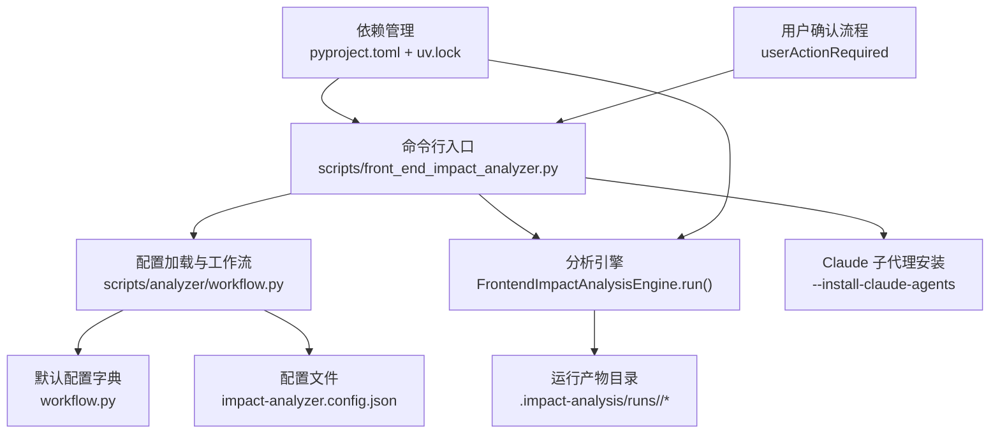
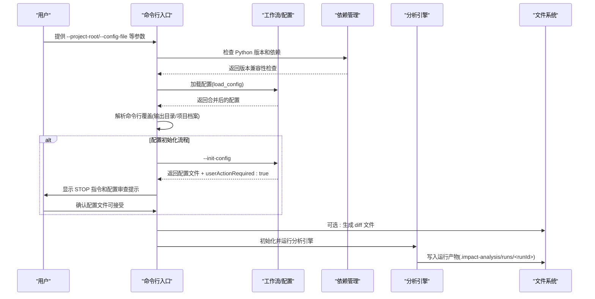
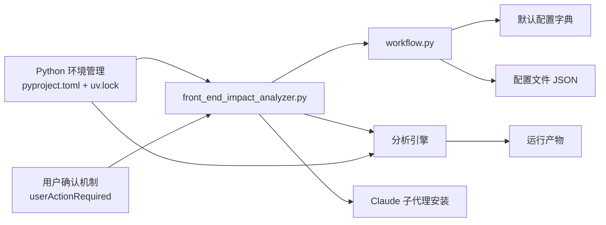

# 配置选项

<cite>
**本文引用的文件**
- [agents/openai.yaml](file://agents/openai.yaml)
- [pyproject.toml](file://pyproject.toml)
- [pyrightconfig.json](file://pyrightconfig.json)
- [uv.lock](file://uv.lock)
- [scripts/front_end_impact_analyzer.py](file://scripts/front_end_impact_analyzer.py)
- [scripts/analyzer/workflow.py](file://scripts/analyzer/workflow.py)
- [schemas/analysis-result.schema.json](file://schemas/analysis-result.schema.json)
- [schemas/analysis-state.schema.json](file://schemas/analysis-state.schema.json)
- [references/agent-usage.md](file://references/agent-usage.md)
- [references/impact-rules.md](file://references/impact-rules.md)
- [references/project-conventions.md](file://references/project-conventions.md)
- [SKILL.md](file://SKILL.md)
</cite>

## 更新摘要
**变更内容**
- 新增配置初始化流程的安全增强：新增 `userActionRequired` 字段和强制用户确认步骤
- 确保用户在继续分析前审查配置文件，防止误用默认配置
- 更新配置初始化流程的交互逻辑和安全检查机制

## 目录
1. [简介](#简介)
2. [项目结构](#项目结构)
3. [核心组件](#核心组件)
4. [架构总览](#架构总览)
5. [详细组件分析](#详细组件分析)
6. [依赖分析](#依赖分析)
7. [性能考虑](#性能考虑)
8. [故障排查指南](#故障排查指南)
9. [结论](#结论)
10. [附录](#附录)

## 简介
本文件系统化梳理前端影响分析器的配置体系，覆盖默认配置、运行时配置、CLI 参数与环境变量、配置优先级与继承关系、代理工具集成（Claude Code）以及自定义扩展点。目标是帮助使用者快速上手、稳定复用并安全扩展该分析流程。

**更新** 新增配置初始化流程的安全增强，确保用户在继续分析前必须审查和确认配置文件。

## 项目结构
与配置相关的关键位置与职责：
- 默认配置与加载：位于工作流模块中，提供默认配置字典与深合并策略
- 运行时配置文件：impact-analyzer.config.json（JSON 格式）
- CLI 入口：脚本入口负责解析命令行参数、加载配置、生成 diff、执行分析与输出结果
- 代理工具集成：通过安装 Claude 子代理模板，配合分析包进行聚类深度分析
- 模式约束：状态与结果 JSON Schema 定义了输出契约，便于下游工具消费
- 依赖管理：通过 uv 和 pyproject.toml 管理 Python 版本和依赖
- **配置安全增强**：新增 `userActionRequired` 字段，强制用户确认配置文件

**图表来源**
- [scripts/front_end_impact_analyzer.py:239-403](file://scripts/front_end_impact_analyzer.py#L239-L403)
- [scripts/analyzer/workflow.py:15-103](file://scripts/analyzer/workflow.py#L15-L103)
- [pyproject.toml:16-19](file://pyproject.toml#L16-L19)
- [SKILL.md:12-21](file://SKILL.md#L12-L21)

**章节来源**
- [scripts/front_end_impact_analyzer.py:239-403](file://scripts/front_end_impact_analyzer.py#L239-L403)
- [scripts/analyzer/workflow.py:15-103](file://scripts/analyzer/workflow.py#L15-L103)
- [pyproject.toml:16-19](file://pyproject.toml#L16-L19)
- [SKILL.md:12-21](file://SKILL.md#L12-L21)

## 核心组件
- 默认配置字典：定义项目、路径、diff 忽略规则、分析参数等键空间
- 配置加载与深合并：若未发现配置文件则使用默认配置；若存在配置文件，则以默认配置为基底进行深合并
- CLI 参数覆盖：支持在命令行显式指定配置文件、输出目录、项目档案文件等，用于临时覆盖配置
- 运行清单与预检：根据配置构建运行清单、执行预检检查（如仓库 wiki、需求、规范目录是否存在）
- **Python 版本管理**：通过 `python-preference = "managed"` 确保一致的 Python 版本（>=3.12）
- **配置安全增强**：新增 `userActionRequired` 字段，强制用户确认配置文件后再继续分析流程

**更新** 新增配置安全增强机制，确保用户在继续分析前必须审查配置文件。

**章节来源**
- [scripts/analyzer/workflow.py:15-103](file://scripts/analyzer/workflow.py#L15-L103)
- [scripts/front_end_impact_analyzer.py:280-308](file://scripts/front_end_impact_analyzer.py#L280-L308)
- [pyproject.toml:16-19](file://pyproject.toml#L16-L19)
- [SKILL.md:12-21](file://SKILL.md#L12-L21)

## 架构总览
下图展示配置在端到端流程中的作用与流向，包括新增的用户确认步骤：

**图表来源**
- [scripts/front_end_impact_analyzer.py:239-403](file://scripts/front_end_impact_analyzer.py#L239-L403)
- [scripts/analyzer/workflow.py:65-77](file://scripts/analyzer/workflow.py#L65-L77)
- [pyproject.toml:16-19](file://pyproject.toml#L16-L19)
- [SKILL.md:12-21](file://SKILL.md#L12-L21)

## 详细组件分析

### 配置文件结构与选项
- 配置文件名：impact-analyzer.config.json
- 默认配置键空间：
  - project：项目元信息与默认分支、源码根目录
  - paths：文档与产物路径（项目档案、仓库 Wiki、需求、规范、diff、输出目录）
  - diff：忽略目录、忽略文件、忽略通配符
  - analysis：上下文预算、是否要求特定文档、聚类深度分析上限等
- CLI 覆盖项：
  - --analysis-output-dir：临时覆盖输出目录
  - --project-profile-file：临时覆盖项目档案文件路径
  - --config-file：指定配置文件路径
- 预检检查：
  - 根据 analysis.requireRepoWiki/requireRequirements/requireSpecs 判定缺失是否阻断
- **用户确认机制**：
  - `userActionRequired` 字段：当配置文件首次生成时返回 `true`
  - 停止指令：显示 `>>> STOP: Do NOT proceed to diff or analysis yet. <<<`
  - 审查指导：指导用户检查关键配置项（diff 忽略规则、路径配置、文档要求）

**更新** 新增用户确认机制，确保配置文件在使用前经过用户审查。

**章节来源**
- [scripts/analyzer/workflow.py:15-62](file://scripts/analyzer/workflow.py#L15-L62)
- [scripts/analyzer/workflow.py:105-134](file://scripts/analyzer/workflow.py#L105-L134)
- [scripts/front_end_impact_analyzer.py:280-308](file://scripts/front_end_impact_analyzer.py#L280-L308)
- [SKILL.md:12-21](file://SKILL.md#L12-L21)

### agents/openai.yaml 的配置格式
- 当前内容仅包含 interface.display_name 字段，用于标识代理界面显示名称
- 若需扩展代理工具集成，请参考 Claude 子代理模板安装与使用

**章节来源**
- [agents/openai.yaml:1-3](file://agents/openai.yaml#L1-L3)

### 环境变量与运行时配置
- 环境变量：未在代码中直接读取环境变量
- 运行时配置来源：
  - 默认配置字典
  - 项目根目录下的 impact-analyzer.config.json
  - 命令行参数对配置的临时覆盖
- **Python 版本管理**：
  - 通过 `python-preference = "managed"` 确保 uv 管理 Python 版本
  - `environments = ["python_version >= '3.12'"]` 指定最低 Python 版本要求
  - 依赖工具：uv：推荐使用 uv run --project <skill_root> 执行脚本
  - Python 版本要求：>=3.12
  - 依赖库：tree-sitter、tree-sitter-typescript
- **配置安全增强**：
  - `userActionRequired` 字段：在配置初始化时返回 `true`
  - 强制用户确认：必须明确确认配置文件可接受才能继续

**更新** 新增配置安全增强配置说明。

**章节来源**
- [scripts/analyzer/workflow.py:137-189](file://scripts/analyzer/workflow.py#L137-L189)
- [pyproject.toml:1-18](file://pyproject.toml#L1-L18)
- [pyproject.toml:16-19](file://pyproject.toml#L16-L19)
- [SKILL.md:12-21](file://SKILL.md#L12-L21)

### 配置优先级与继承关系
- 优先级顺序（从高到低）：
  1) 命令行参数覆盖（--analysis-output-dir、--project-profile-file、--config-file）
  2) 项目配置文件 impact-analyzer.config.json
  3) 默认配置字典
- 合并策略：深合并（递归地将用户配置覆盖到默认配置上）
- 继承关系：
  - 分支默认值：若未设置，默认使用 main 与 HEAD
  - 路径解析：相对路径基于项目根目录解析
  - 文档要求：analysis.require* 控制预检是否阻断
- **用户确认流程**：
  - 配置初始化时：`userActionRequired = true`
  - 用户确认后：继续执行后续流程
  - 配置文件存在时：直接加载使用，不进行用户确认

**更新** 新增用户确认流程的优先级和继承关系说明。

**章节来源**
- [scripts/analyzer/workflow.py:65-77](file://scripts/analyzer/workflow.py#L65-L77)
- [scripts/analyzer/workflow.py:80-102](file://scripts/analyzer/workflow.py#L80-L102)
- [scripts/front_end_impact_analyzer.py:297-308](file://scripts/front_end_impact_analyzer.py#L297-L308)
- [SKILL.md:12-21](file://SKILL.md#L12-L21)

### 代理工具集成（Claude Code）
- 安装子代理模板：
  - --install-claude-agents：将 agents/claude 下的模板复制到目标项目 .claude/agents/
  - --overwrite-claude-agents：强制覆盖同名文件
- 使用流程：
  - 生成分析包（包含聚类、证据包、下一步建议）
  - 逐个聚类进行深度分析，写入 cluster-analysis/*.analysis.json
  - 合并聚类分析，得到最终 cases
- 输出契约：
  - 分析包与最终结果遵循 schemas/analysis-result.schema.json
  - 状态快照遵循 schemas/analysis-state.schema.json

**章节来源**
- [references/agent-usage.md:1-127](file://references/agent-usage.md#L1-L127)
- [scripts/analyzer/workflow.py:222-265](file://scripts/analyzer/workflow.py#L222-L265)
- [schemas/analysis-result.schema.json:1-180](file://schemas/analysis-result.schema.json#L1-L180)
- [schemas/analysis-state.schema.json:1-238](file://schemas/analysis-state.schema.json#L1-L238)

### 自定义分析行为与扩展
- 项目约定与扩展点：
  - 项目约定：页面、路由、别名、桶导出等常见约定
  - 扩展别名处理：可在扫描器中补充额外别名约定
- 影响规则与映射：
  - 不同语义标签映射到测试用例模板
- 工作流扩展：
  - 通过 analysis.* 配置控制上下文大小、聚类数量、注释证据上限等
  - 通过 diff.* 配置排除噪声，提升聚类质量

**章节来源**
- [references/project-conventions.md:1-20](file://references/project-conventions.md#L1-L20)
- [references/impact-rules.md:1-19](file://references/impact-rules.md#L1-L19)
- [scripts/analyzer/workflow.py:328-336](file://scripts/analyzer/workflow.py#L328-L336)

### 配置示例与最佳实践
- 示例：初始化默认配置
  - 命令：uv run --project "<skill_root>" python "<skill_root>/scripts/front_end_impact_analyzer.py" --project-root "<target_project_root>" --init-config
  - **用户确认**：首次生成配置文件时，系统会返回 `userActionRequired: true`，必须等待用户确认后才能继续
- 最佳实践：
  - 在项目根目录维护 impact-analyzer.config.json，避免每次运行都传参
  - 将 diff.ignoreDirs/ignoreFiles/ignoreGlobs 设为项目通用噪声模式
  - 为 analysis.requireRepoWiki/requireRequirements/requireSpecs 设置符合团队规范的策略
  - 使用 --analysis-output-dir 临时切换输出目录，便于并行或隔离运行
  - 对大型 diff，优先使用聚类深度分析，而非一次性全量分析
  - **Python 环境管理**：使用 uv 管理 Python 版本，确保 >=3.12
  - **配置安全**：首次运行时务必仔细审查配置文件，特别是 diff 忽略规则和路径设置

**更新** 新增配置安全最佳实践和用户确认流程说明。

**章节来源**
- [SKILL.md:51-56](file://SKILL.md#L51-L56)
- [scripts/front_end_impact_analyzer.py:297-308](file://scripts/front_end_impact_analyzer.py#L297-L308)
- [pyproject.toml:16-19](file://pyproject.toml#L16-L19)
- [SKILL.md:12-21](file://SKILL.md#L12-L21)

## 依赖分析
- CLI 与工作流模块耦合：CLI 负责参数解析与运行编排，工作流模块负责配置加载与预检
- 引擎与工作流耦合：引擎在运行过程中读取配置，决定聚类深度、上下文预算等
- 代理集成：通过安装模板与后续合并步骤衔接
- **依赖管理**：通过 pyproject.toml 和 uv.lock 管理 Python 版本和依赖，确保环境一致性
- **配置安全依赖**：用户确认机制依赖于配置初始化流程和 CLI 交互逻辑

**更新** 新增配置安全依赖分析。

**图表来源**
- [scripts/front_end_impact_analyzer.py:239-403](file://scripts/front_end_impact_analyzer.py#L239-L403)
- [scripts/analyzer/workflow.py:15-103](file://scripts/analyzer/workflow.py#L15-L103)
- [pyproject.toml:16-19](file://pyproject.toml#L16-L19)
- [SKILL.md:12-21](file://SKILL.md#L12-L21)

**章节来源**
- [scripts/front_end_impact_analyzer.py:239-403](file://scripts/front_end_impact_analyzer.py#L239-L403)
- [scripts/analyzer/workflow.py:15-103](file://scripts/analyzer/workflow.py#L15-L103)
- [pyproject.toml:16-19](file://pyproject.toml#L16-L19)
- [SKILL.md:12-21](file://SKILL.md#L12-L21)

## 性能考虑
- 上下文预算控制：analysis.maxClusterContextChars、maxSnippetChars、maxFilesPerClusterContext 等限制聚类证据规模
- 聚类深度上限：analysis.maxClustersForDeepAnalysis 控制需要人工深度分析的聚类数量
- 噪声过滤：通过 diff.ignoreDirs/ignoreFiles/ignoreGlobs 减少无效文件参与分析
- 路径解析与别名：合理配置 tsconfig 别名与桶导出，减少回溯成本
- **Python 版本优化**：通过 managed 模式确保一致的 Python 运行环境，避免版本冲突导致的性能问题
- **配置性能优化**：合理的 diff 忽略规则可以将 diff 大小减少 10-100 倍，显著提升分析性能

**更新** 新增配置性能优化考虑。

**章节来源**
- [scripts/analyzer/workflow.py:30-61](file://scripts/analyzer/workflow.py#L30-L61)
- [scripts/analyzer/workflow.py:328-336](file://scripts/analyzer/workflow.py#L328-L336)
- [pyproject.toml:16-19](file://pyproject.toml#L16-L19)
- [SKILL.md:103](file://SKILL.md#L103)

## 故障排查指南
- 环境检查：
  - 使用 --doctor 检查 uv、Python 版本、tree-sitter 依赖、技能根目录与 git 状态
  - **Python 版本检查**：确保 Python >=3.12，检查 uv 是否正确管理 Python 版本
- 预检阻断：
  - 若 analysis.require* 为真且对应目录缺失，预检会阻断；根据 01-preflight-report.json 中 blockingActions 处理
- 运行产物定位：
  - 运行产物目录由 run manifest 决定；可通过 --state-output/--result-output 导出状态与结果
- 合并失败：
  - 确保已写入 cluster-analysis/*.analysis.json 并使用 --merge-cluster-analysis 合并
- 代理问题：
  - 未安装子代理时，无法自动完成聚类分析；使用 --install-claude-agents 安装并确认覆盖策略
- **依赖问题**：
  - 检查 uv.lock 文件确保依赖版本一致
  - 使用 `uv sync` 同步依赖环境
- **配置问题**：
  - 如果配置初始化后没有继续执行，检查 `userActionRequired` 字段是否为 `true`
  - 确保在首次运行时仔细审查配置文件并确认其可接受性
  - 如需重置配置，使用 `--force-config` 参数重新生成

**更新** 新增配置问题排查指南。

**章节来源**
- [scripts/analyzer/workflow.py:137-189](file://scripts/analyzer/workflow.py#L137-L189)
- [scripts/analyzer/workflow.py:105-134](file://scripts/analyzer/workflow.py#L105-L134)
- [references/agent-usage.md:55-68](file://references/agent-usage.md#L55-L68)
- [pyproject.toml:16-19](file://pyproject.toml#L16-L19)
- [SKILL.md:12-21](file://SKILL.md#L12-L21)

## 结论
本配置体系以"默认配置 + 用户配置 + CLI 覆盖"的分层设计实现灵活可控的分析行为。通过合理的上下文预算、噪声过滤与聚类深度控制，既能保证大规模变更的可管理性，又能借助代理工具实现高质量的人机协同深度分析。

**新增的配置安全增强机制确保了分析流程的安全性和可控性**。通过 `userActionRequired` 字段和强制用户确认步骤，系统能够在配置初始化时阻止自动继续执行，要求用户必须审查并确认配置文件的正确性。这一机制有效防止了用户误用默认配置而产生意外的分析结果，特别是在 diff 忽略规则和路径配置等关键设置上。

**Python 版本管理配置确保了开发环境的一致性和可靠性**，通过 uv 的 managed 模式和环境锁定机制，避免了版本冲突问题，提升了项目的可重复性和稳定性。建议在团队内统一配置与约定，结合 JSON Schema 约束确保输出一致性。

## 附录

### 配置键空间速览
- project
  - name：项目名称
  - defaultBaseBranch：默认基线分支
  - defaultCompareBranch：对比分支
  - sourceRoot：源码根目录
- paths
  - projectProfileFile：项目档案文件
  - repoWikiDir：仓库 Wiki 目录
  - requirementsDir：需求文档目录
  - specsDir：开发规范目录
  - diffDir：diff 输出目录
  - outputDir：运行产物输出目录
- diff
  - ignoreDirs：忽略目录列表
  - ignoreFiles：忽略文件列表
  - ignoreGlobs：忽略通配符列表
- analysis
  - requireRepoWiki：是否要求仓库 Wiki
  - requireRequirements：是否要求需求文档
  - requireSpecs：是否要求规范文档
  - maxClustersForDeepAnalysis：聚类深度分析上限
  - maxFilesPerClusterContext：每聚类最大文件数
  - maxDocumentSnippetsPerCluster：每聚类最大文档片段数
  - maxSnippetChars：单片段最大字符数
  - maxClusterContextChars：聚类上下文总字符数预算
  - maxCommentEvidencePerCluster：每聚类最大注释证据数

**章节来源**
- [scripts/analyzer/workflow.py:15-62](file://scripts/analyzer/workflow.py#L15-L62)

### Python 版本管理配置
- **python-preference = "managed"**：启用 uv 管理 Python 版本，确保项目使用一致的 Python 环境
- **environments**：指定 Python 版本要求，确保 >=3.12
- **依赖锁定**：通过 uv.lock 文件锁定所有依赖版本，确保开发环境一致性
- **开发环境配置**：pyrightconfig.json 提供类型检查和代码导航支持

**更新** 新增 Python 版本管理配置说明。

**章节来源**
- [pyproject.toml:16-19](file://pyproject.toml#L16-L19)
- [uv.lock:1-134](file://uv.lock#L1-L134)
- [pyrightconfig.json:1-18](file://pyrightconfig.json#L1-L18)

### 配置安全增强机制
- **userActionRequired 字段**：在配置初始化时返回 `true`，强制用户确认
- **停止指令**：显示 `>>> STOP: Do NOT proceed to diff or analysis yet. <<<` 提醒用户暂停
- **审查指导**：指导用户检查关键配置项，包括 diff 忽略规则、路径配置、文档要求
- **确认流程**：用户必须明确确认配置文件可接受后才能继续后续分析流程
- **配置保护**：防止误用默认配置，确保分析结果的准确性

**更新** 新增配置安全增强机制说明。

**章节来源**
- [scripts/analyzer/workflow.py:75-104](file://scripts/analyzer/workflow.py#L75-L104)
- [SKILL.md:12-21](file://SKILL.md#L12-L21)