# 代理使用指南

<cite>
**本文档引用的文件**
- [AGENTS.md](file://AGENTS.md)
- [references/agent-usage.md](file://references/agent-usage.md)
- [scripts/front_end_impact_analyzer.py](file://scripts/front_end_impact_analyzer.py)
- [scripts/analyzer/workflow.py](file://scripts/analyzer/workflow.py)
- [agents/claude/change-intent-judge.md](file://agents/claude/change-intent-judge.md)
- [agents/claude/evidence-checker.md](file://agents/claude/evidence-checker.md)
- [agents/claude/case-writer.md](file://agents/claude/case-writer.md)
- [agents/claude/case-refiner.md](file://agents/claude/case-refiner.md)
- [internal/HANDOFF.md](file://internal/HANDOFF.md)
- [pyproject.toml](file://pyproject.toml)
- [schemas/analysis-result.schema.json](file://schemas/analysis-result.schema.json)
- [schemas/cluster-analysis.schema.json](file://schemas/cluster-analysis.schema.json)
</cite>

## 目录
1. [简介](#简介)
2. [项目架构概览](#项目架构概览)
3. [核心组件与职责](#核心组件与职责)
4. [代理工作流程](#代理工作流程)
5. [Claude子代理模板](#claude子代理模板)
6. [配置与环境要求](#配置与环境要求)
7. [运行时工件管理](#运行时工件管理)
8. [质量保证与验证](#质量保证与验证)
9. [故障排除指南](#故障排除指南)
10. [最佳实践](#最佳实践)

## 简介

前端影响分析器是一个专为Claude Code和Codex等AI代理设计的技能包，用于分析React、React Router和Vite代码库中的前端变更影响。该项目的核心理念是"Python收集证据并验证结构，Claude执行基于证据的语义判断和措辞"。

该系统采用分层架构，通过严格的证据收集和聚类机制，确保最终生成的QA用例都是具体、可执行且有证据支持的。

## 项目架构概览

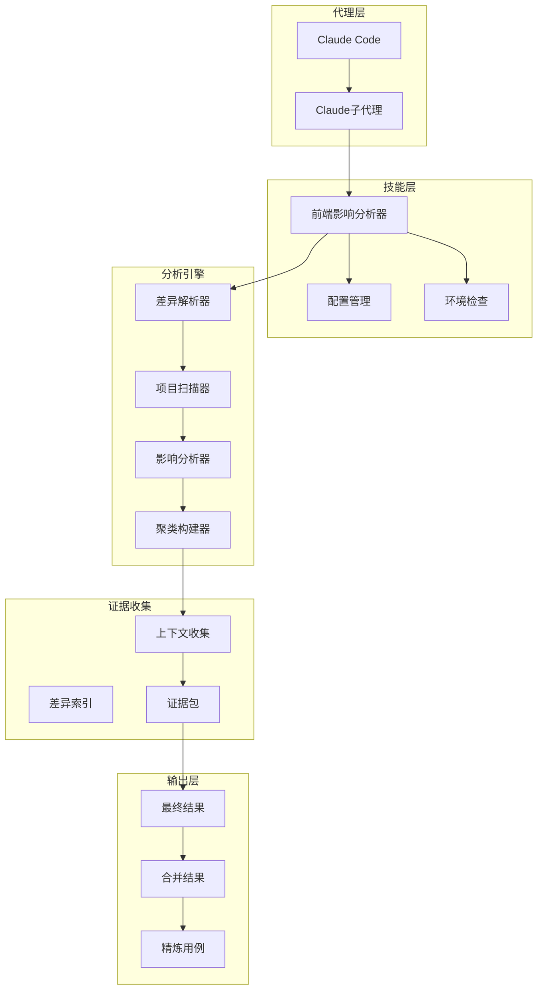

**图表来源**
- [internal/HANDOFF.md:35-70](file://internal/HANDOFF.md#L35-L70)
- [AGENTS.md:190-491](file://AGENTS.md#L190-L491)

## 核心组件与职责

### 分析引擎组件

前端影响分析器包含以下核心分析组件：

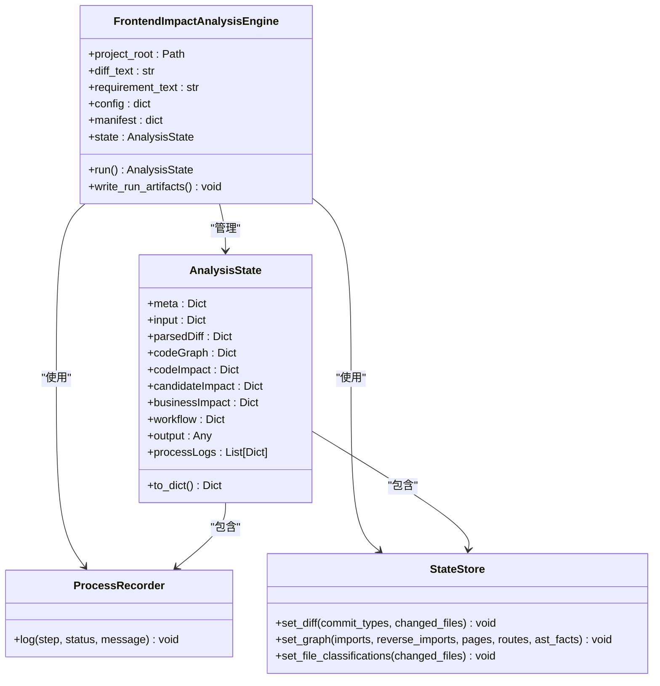

**图表来源**
- [scripts/front_end_impact_analyzer.py:38-282](file://scripts/front_end_impact_analyzer.py#L38-L282)
- [scripts/analyzer/models.py:115-200](file://scripts/analyzer/models.py#L115-L200)

### 工作流管理组件

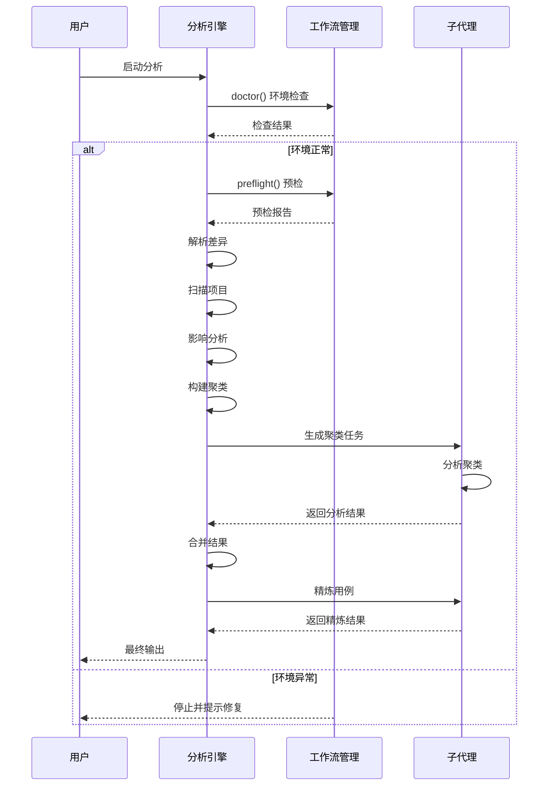

**图表来源**
- [scripts/analyzer/workflow.py:168-259](file://scripts/analyzer/workflow.py#L168-L259)
- [references/agent-usage.md:16-42](file://references/agent-usage.md#L16-L42)

**章节来源**
- [scripts/front_end_impact_analyzer.py:38-282](file://scripts/front_end_impact_analyzer.py#L38-L282)
- [scripts/analyzer/models.py:115-200](file://scripts/analyzer/models.py#L115-L200)
- [scripts/analyzer/workflow.py:168-259](file://scripts/analyzer/workflow.py#L168-L259)

## 代理工作流程

### 标准分析流程

前端影响分析器遵循严格的两阶段工作流程：

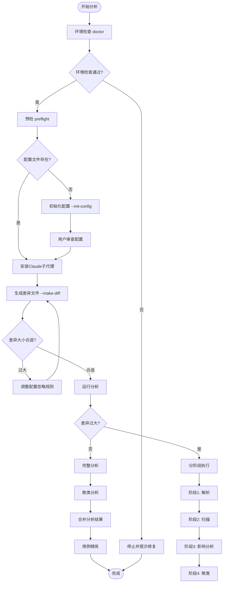

**图表来源**
- [references/agent-usage.md:16-42](file://references/agent-usage.md#L16-L42)
- [scripts/analyzer/workflow.py:262-305](file://scripts/analyzer/workflow.py#L262-L305)

### 分阶段执行模式

对于大型差异文件，系统支持分阶段执行以提高效率：

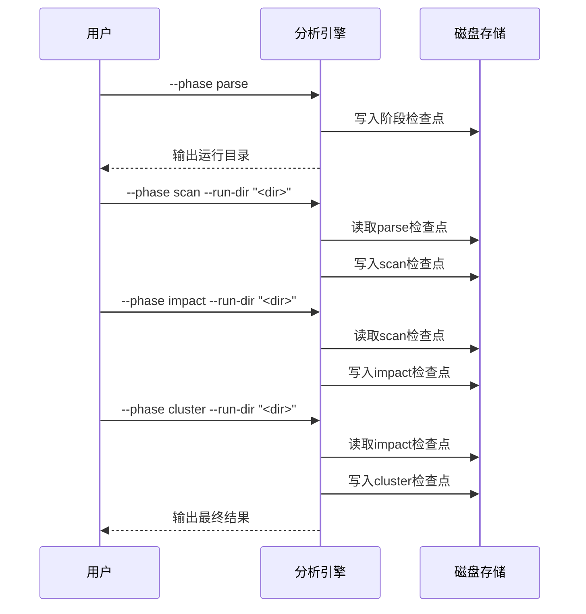

**图表来源**
- [references/agent-usage.md:30-34](file://references/agent-usage.md#L30-L34)
- [scripts/front_end_impact_analyzer.py:288-479](file://scripts/front_end_impact_analyzer.py#L288-L479)

**章节来源**
- [references/agent-usage.md:16-42](file://references/agent-usage.md#L16-L42)
- [scripts/analyzer/workflow.py:262-305](file://scripts/analyzer/workflow.py#L262-L305)
- [scripts/front_end_impact_analyzer.py:288-479](file://scripts/front_end_impact_analyzer.py#L288-L479)

## Claude子代理模板

### 变更意图判定器

变更意图判定器负责确定每个聚类的精确用户可见变更：

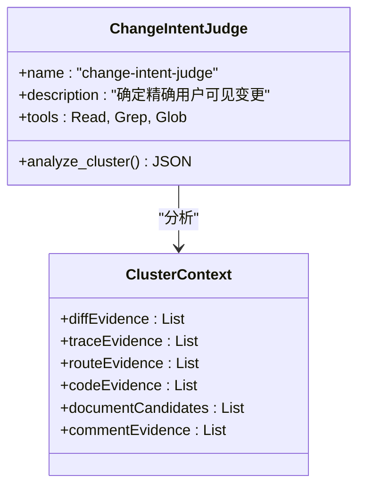

**图表来源**
- [agents/claude/change-intent-judge.md:1-59](file://agents/claude/change-intent-judge.md#L1-L59)

### 证据检查器

证据检查器验证已声明的影响和用例是否得到代码、路由、差异和文档证据的支持：

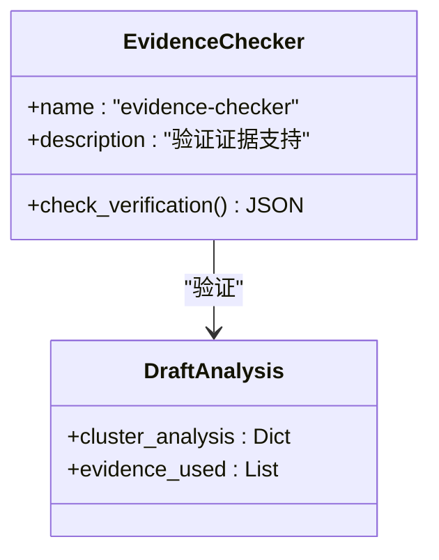

**图表来源**
- [agents/claude/evidence-checker.md:1-48](file://agents/claude/evidence-checker.md#L1-L48)

### 用例编写器

用例编写器为已验证的聚类分析编写具体的证据支持的QA用例：

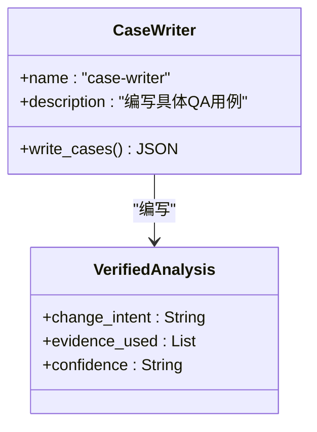

**图表来源**
- [agents/claude/case-writer.md:1-64](file://agents/claude/case-writer.md#L1-L64)

### 用例精炼器

用例精炼器在不改变意图或范围的前提下优化最终用例：

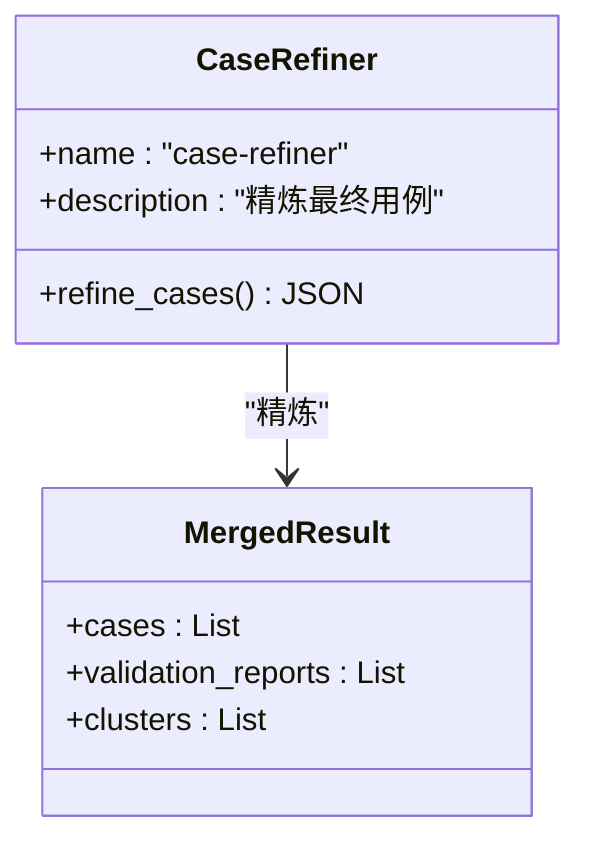

**图表来源**
- [agents/claude/case-refiner.md:1-75](file://agents/claude/case-refiner.md#L1-L75)

**章节来源**
- [agents/claude/change-intent-judge.md:1-59](file://agents/claude/change-intent-judge.md#L1-L59)
- [agents/claude/evidence-checker.md:1-48](file://agents/claude/evidence-checker.md#L1-L48)
- [agents/claude/case-writer.md:1-64](file://agents/claude/case-writer.md#L1-L64)
- [agents/claude/case-refiner.md:1-75](file://agents/claude/case-refiner.md#L1-L75)

## 配置与环境要求

### 环境检查

系统提供全面的环境检查功能：

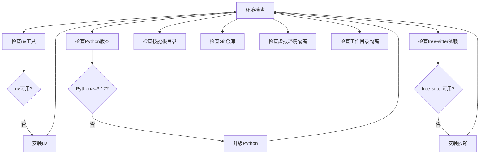

**图表来源**
- [scripts/analyzer/workflow.py:168-259](file://scripts/analyzer/workflow.py#L168-L259)

### 配置文件结构

默认配置文件包含以下关键部分：

| 配置类别 | 关键字段 | 默认值 | 说明 |
|---------|----------|--------|------|
| 项目设置 | name, defaultBaseBranch, defaultCompareBranch, sourceRoot | 前端项目, main, HEAD, "." | 项目基本信息 |
| 路径配置 | projectProfileFile, repoWikiDir, requirementsDir, specsDir, diffDir, outputDir | 影响分析项目档案, repo-wiki, requirements, specs, .impact-analysis/diffs, .impact-analysis/runs | 文件路径设置 |
| 差异过滤 | includePaths, ignoreDirs, ignoreFiles, ignoreGlobs | 空数组, 多个忽略目录, 锁文件列表, 模式匹配 | 差异文件过滤规则 |
| 分析设置 | requireRepoWiki, requireRequirements, requireSpecs, maxClustersForDeepAnalysis, phasedExecutionThreshold | True, False, False, 500, 1000 | 分析行为控制 |

**章节来源**
- [scripts/analyzer/workflow.py:16-66](file://scripts/analyzer/workflow.py#L16-L66)
- [scripts/analyzer/workflow.py:168-259](file://scripts/analyzer/workflow.py#L168-L259)

## 运行时工件管理

### 工件目录结构

每次运行都会创建独立的运行目录，包含所有中间产物和最终结果：

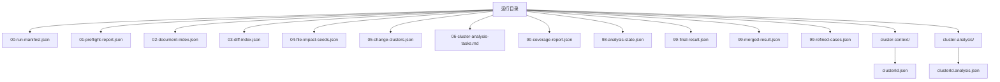

**图表来源**
- [internal/HANDOFF.md:123-141](file://internal/HANDOFF.md#L123-L141)

### 工件状态管理

系统维护严格的状态跟踪机制：

| 工件类型 | 生成时机 | 用途 | 保留策略 |
|---------|----------|------|----------|
| 99-final-result.json | 初始分析完成 | 初步分析包 | 作为后续处理的基础 |
| 99-merged-result.json | 聚类分析合并后 | 最终结果 | 主要输出文件 |
| 99-refined-cases.json | 用例精炼后 | 精炼后的最终用例 | 最终交付物 |
| 98-analysis-state.json | 分析过程中 | 状态快照 | 供合并使用 |
| cluster-context/*.json | 聚类分析期间 | 聚类证据包 | 支持Claude分析 |
| cluster-analysis/*.analysis.json | Claude分析后 | 聚类分析结果 | 合并输入 |

**章节来源**
- [internal/HANDOFF.md:123-141](file://internal/HANDOFF.md#L123-L141)
- [scripts/front_end_impact_analyzer.py:189-220](file://scripts/front_end_impact_analyzer.py#L189-L220)

## 质量保证与验证

### JSON模式验证

系统使用严格的JSON模式确保输出质量：

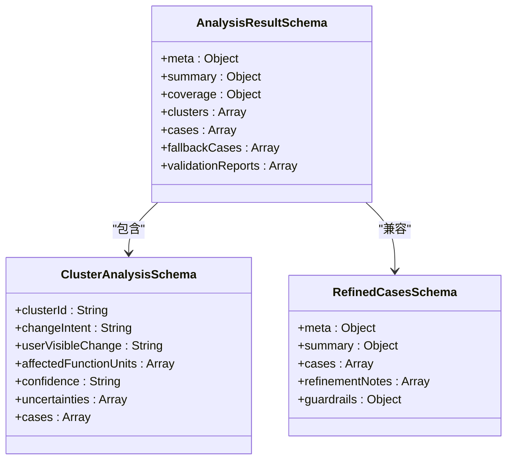

**图表来源**
- [schemas/analysis-result.schema.json:1-180](file://schemas/analysis-result.schema.json#L1-L180)
- [schemas/cluster-analysis.schema.json:1-85](file://schemas/cluster-analysis.schema.json#L1-L85)

### 质量控制规则

系统实施严格的质量控制规则：

| 规则类型 | 控制要点 | 违规后果 |
|---------|----------|----------|
| 输出纪律 | 不重新分类格式化变更 | 保持原分析结果 |
| 不扩展原则 | 不将共享组件变更扩展到无关页面 | 维护分析精度 |
| 不发明原则 | 不添加未在证据中出现的功能 | 确保结论可靠性 |
| 不执行原则 | 不执行测试用例 | 保持客观性 |
| 不硬编码原则 | 不将特定项目的文件夹结构写入技能 | 提高通用性 |

**章节来源**
- [references/agent-usage.md:110-123](file://references/agent-usage.md#L110-L123)
- [schemas/analysis-result.schema.json:1-180](file://schemas/analysis-result.schema.json#L1-L180)
- [schemas/cluster-analysis.schema.json:1-85](file://schemas/cluster-analysis.schema.json#L1-L85)

## 故障排除指南

### 常见问题诊断

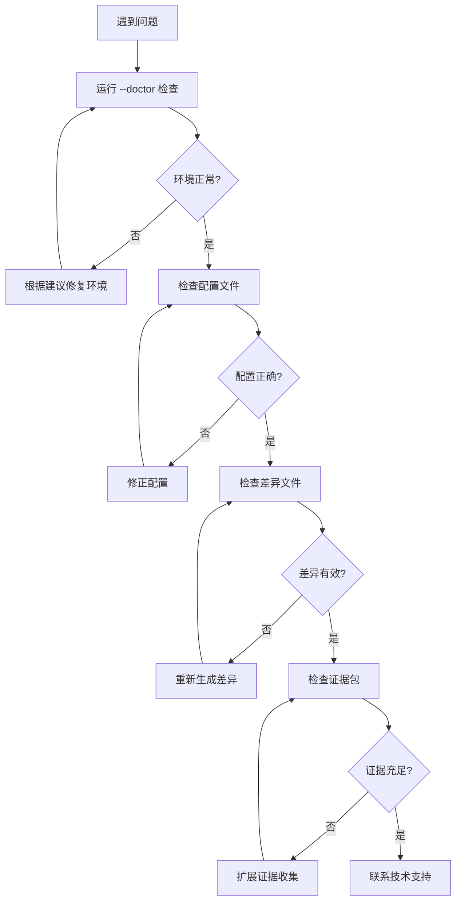

### 状态处理策略

系统根据分析状态采取不同的处理策略：

| 状态 | 处理方式 | 输出内容 |
|------|----------|----------|
| success | 使用分析包 | 完整的最终结果 |
| partial_success | 谨慎使用分析包 | 包含警告和诊断信息 |
| failed | 不发明回退输出 | 详细的致命诊断信息 |

**章节来源**
- [references/agent-usage.md:90-109](file://references/agent-usage.md#L90-L109)
- [scripts/analyzer/workflow.py:221-231](file://scripts/analyzer/workflow.py#L221-L231)

## 最佳实践

### 代理使用最佳实践

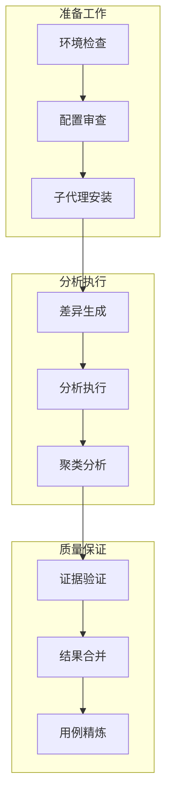

### 性能优化建议

1. **分阶段执行**：对于大型差异文件，优先使用分阶段执行模式
2. **合理配置**：根据项目规模调整聚类数量和上下文大小限制
3. **证据收集**：确保足够的证据收集，避免过度裁剪
4. **并行处理**：利用聚类分析的并行特性提高效率

### 安全使用建议

1. **环境隔离**：确保技能环境与目标项目环境完全隔离
2. **权限控制**：限制对敏感文件的访问权限
3. **输出验证**：始终验证最终输出的准确性和完整性
4. **审计日志**：保留完整的分析过程记录

**章节来源**
- [references/agent-usage.md:124-134](file://references/agent-usage.md#L124-L134)
- [internal/HANDOFF.md:442-462](file://internal/HANDOFF.md#L442-L462)