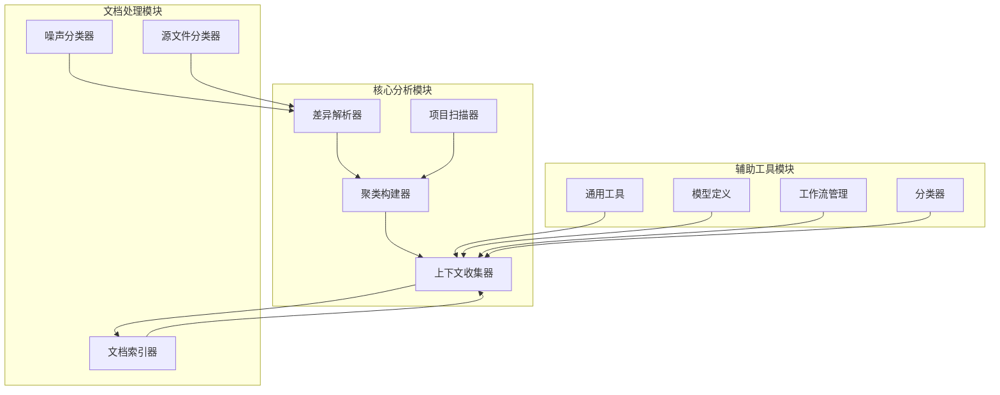
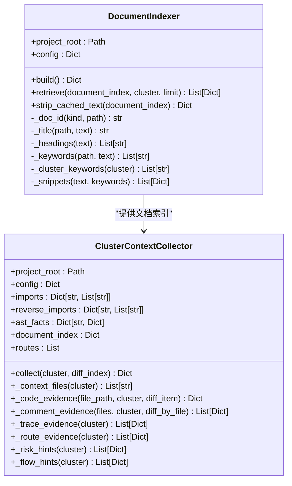
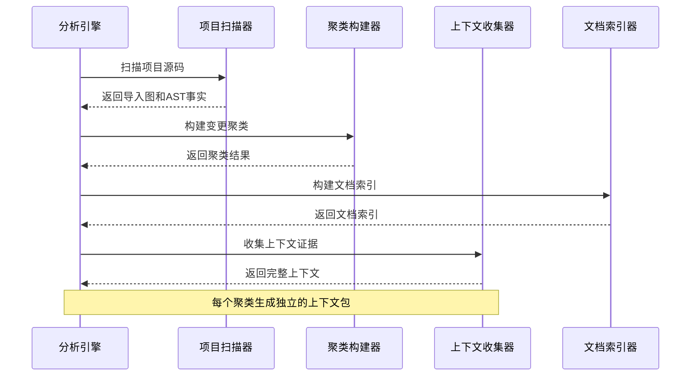
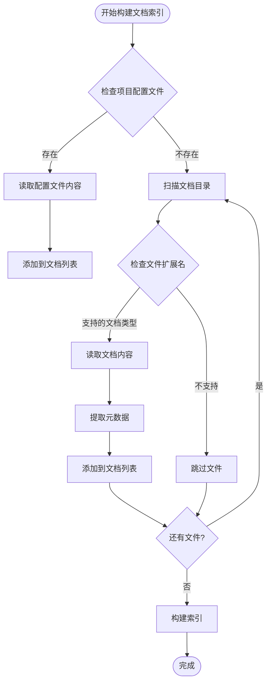
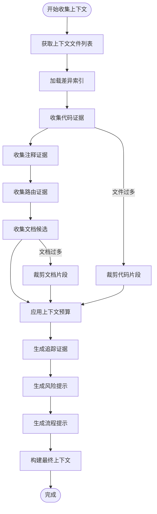
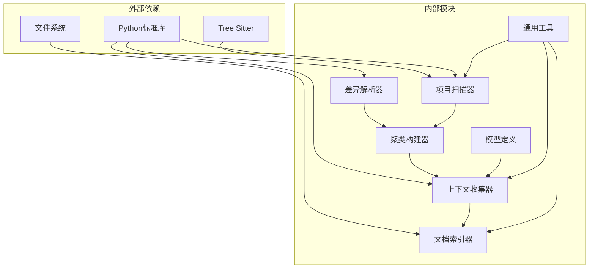

# 上下文收集系统

<cite>
**本文档引用的文件**
- [context_collector.py](file://scripts/analyzer/context_collector.py)
- [project_scanner.py](file://scripts/analyzer/project_scanner.py)
- [models.py](file://scripts/analyzer/models.py)
- [common.py](file://scripts/analyzer/common.py)
- [front_end_impact_analyzer.py](file://scripts/front_end_impact_analyzer.py)
- [diff_parser.py](file://scripts/analyzer/diff_parser.py)
- [cluster_builder.py](file://scripts/analyzer/cluster_builder.py)
- [workflow.py](file://scripts/analyzer/workflow.py)
- [noise_classifier.py](file://scripts/analyzer/noise_classifier.py)
- [source_classifier.py](file://scripts/analyzer/source_classifier.py)
</cite>

## 目录
1. [简介](#简介)
2. [项目结构](#项目结构)
3. [核心组件](#核心组件)
4. [架构概览](#架构概览)
5. [详细组件分析](#详细组件分析)
6. [依赖关系分析](#依赖关系分析)
7. [性能考虑](#性能考虑)
8. [故障排除指南](#故障排除指南)
9. [结论](#结论)

## 简介

上下文收集系统是前端影响分析引擎的核心模块，负责从多个数据源收集和整合信息，为每个变更集群生成完整的分析上下文。该系统通过文档索引、代码证据、注释证据和路由证据等多种渠道，为后续的AI分析提供全面的信息支持。

系统采用多阶段处理策略，首先构建文档索引，然后根据变更集群的特征选择合适的证据类型，最后进行上下文预算控制以确保输出的可管理性。

## 项目结构

前端影响分析系统采用模块化设计，主要包含以下核心模块：

**图表来源**
- [front_end_impact_analyzer.py:141-169](file://scripts/front_end_impact_analyzer.py#L141-L169)
- [context_collector.py:176-240](file://scripts/analyzer/context_collector.py#L176-L240)

**章节来源**
- [front_end_impact_analyzer.py:141-169](file://scripts/front_end_impact_analyzer.py#L141-L169)
- [context_collector.py:176-240](file://scripts/analyzer/context_collector.py#L176-L240)

## 核心组件

### 文档索引器 (DocumentIndexer)

文档索引器负责扫描和索引项目中的文档文件，包括项目配置文件、wiki文档、需求规格等。它支持多种文档格式（Markdown、TXT、JSON、YAML等），并为每个文档提取标题、标题层级、关键词等元数据。

**图表来源**
- [context_collector.py:15-96](file://scripts/analyzer/context_collector.py#L15-L96)
- [context_collector.py:176-240](file://scripts/analyzer/context_collector.py#L176-L240)

### 变更集群上下文收集器

变更集群上下文收集器是系统的核心协调器，负责根据变更集群的特征收集相应的证据。它支持多种证据类型：

- **代码证据**：直接修改的文件内容和相关的导入/导出信息
- **注释证据**：从代码注释中提取的业务相关信息
- **路由证据**：与变更相关的路由绑定信息
- **文档候选**：从文档索引中检索的相关文档片段
- **风险提示**：针对特定类型的变更提供的分析建议

**章节来源**
- [context_collector.py:176-240](file://scripts/analyzer/context_collector.py#L176-L240)
- [context_collector.py:241-618](file://scripts/analyzer/context_collector.py#L241-L618)

## 架构概览

系统采用流水线式处理架构，每个阶段都有明确的职责分工：

**图表来源**
- [front_end_impact_analyzer.py:133-170](file://scripts/front_end_impact_analyzer.py#L133-L170)
- [context_collector.py:203-239](file://scripts/analyzer/context_collector.py#L203-L239)

**章节来源**
- [front_end_impact_analyzer.py:133-170](file://scripts/front_end_impact_analyzer.py#L133-L170)
- [context_collector.py:203-239](file://scripts/analyzer/context_collector.py#L203-L239)

## 详细组件分析

### 文档索引构建流程

文档索引器采用递归扫描策略，支持多种文档类型和配置选项：

**图表来源**
- [context_collector.py:20-59](file://scripts/analyzer/context_collector.py#L20-L59)

### 上下文收集算法

上下文收集器实现了智能的证据选择和预算控制机制：

**图表来源**
- [context_collector.py:203-239](file://scripts/analyzer/context_collector.py#L203-L239)
- [context_collector.py:575-614](file://scripts/analyzer/context_collector.py#L575-L614)

**章节来源**
- [context_collector.py:203-239](file://scripts/analyzer/context_collector.py#L203-L239)
- [context_collector.py:575-614](file://scripts/analyzer/context_collector.py#L575-L614)

### 关键配置参数

系统提供了丰富的配置选项来控制上下文收集行为：

| 参数名称 | 默认值 | 描述 |
|---------|--------|------|
| maxFilesPerClusterContext | 8 | 每个聚类最多包含的文件数量 |
| maxDocumentSnippetsPerCluster | 6 | 每个聚类最多包含的文档片段数量 |
| maxSnippetChars | 5000 | 单个代码片段的最大字符数 |
| maxClusterContextChars | 60000 | 单个聚类上下文的最大字符数 |
| maxCommentEvidencePerCluster | 20 | 每个聚类最多包含的注释证据数量 |
| clusterContextBatchSize | 10 | 批处理大小 |

**章节来源**
- [workflow.py:52-65](file://scripts/analyzer/workflow.py#L52-L65)
- [context_collector.py:204-205](file://scripts/analyzer/context_collector.py#L204-L205)

## 依赖关系分析

系统采用松耦合的设计，各组件之间的依赖关系清晰明确：

**图表来源**
- [project_scanner.py:8-18](file://scripts/analyzer/project_scanner.py#L8-L18)
- [context_collector.py:9](file://scripts/analyzer/context_collector.py#L9)

**章节来源**
- [project_scanner.py:8-18](file://scripts/analyzer/project_scanner.py#L8-L18)
- [context_collector.py:9](file://scripts/analyzer/context_collector.py#L9)

## 性能考虑

### 缓存策略

系统实现了多层次的缓存机制来优化性能：

1. **文件内容缓存**：在单次分析会话中缓存已读取的文件内容
2. **树解析缓存**：避免重复解析相同的AST树
3. **文档文本缓存**：在内存中保留文档索引但移除大文本字段

### 内存管理

- 使用生成器模式处理大量数据
- 实施严格的上下文预算控制
- 及时释放不再需要的大对象

### 并行处理

- 批量处理多个聚类上下文
- 并行扫描项目文件
- 异步I/O操作

## 故障排除指南

### 常见问题及解决方案

**问题1：文档索引为空**
- 检查文档目录配置是否正确
- 确认文档文件具有正确的扩展名
- 验证文档内容是否可读

**问题2：上下文收集超时**
- 调整maxClusterContextChars参数
- 减少clusterContextBatchSize
- 检查磁盘I/O性能

**问题3：内存使用过高**
- 增加maxClusterContextChars限制
- 启用文档文本缓存剥离功能
- 优化项目扫描范围

**章节来源**
- [context_collector.py:620-660](file://scripts/analyzer/context_collector.py#L620-L660)
- [workflow.py:134-163](file://scripts/analyzer/workflow.py#L134-L163)

## 结论

上下文收集系统通过精心设计的多源证据收集机制，为前端影响分析提供了全面而精确的信息基础。系统的核心优势包括：

1. **多源证据整合**：同时处理代码、文档、注释和路由等多种证据类型
2. **智能预算控制**：确保输出的可管理性和可分析性
3. **灵活的配置选项**：适应不同规模和复杂度的项目需求
4. **高效的性能表现**：通过缓存和批处理优化处理速度

该系统为后续的AI分析提供了高质量的输入，显著提升了前端变更影响分析的准确性和效率。