# 上下文收集系统

<cite>
**本文档引用的文件**
- [context_collector.py](file://scripts/analyzer/context_collector.py)
- [project_scanner.py](file://scripts/analyzer/project_scanner.py)
- [models.py](file://scripts/analyzer/models.py)
- [common.py](file://scripts/analyzer/common.py)
- [front_end_impact_analyzer.py](file://scripts/front_end_impact_analyzer.py)
- [diff_parser.py](file://scripts/analyzer/diff_parser.py)
- [cluster_builder.py](file://scripts/analyzer/cluster_builder.py)
- [workflow.py](file://scripts/analyzer/workflow.py)
- [noise_classifier.py](file://scripts/analyzer/noise_classifier.py)
- [source_classifier.py](file://scripts/analyzer/source_classifier.py)
</cite>

## 更新摘要
**变更内容**
- 新增轻量级stub上下文收集功能，支持快速处理大量浅分析集群
- 实现批量处理优化，通过 `clusterContextBatchSize` 参数控制批量大小
- 增强上下文收集系统的性能和可扩展性
- 新增分阶段执行机制，通过 `phasedExecutionThreshold` 控制大规模分析的执行策略

## 目录
1. [简介](#简介)
2. [项目结构](#项目结构)
3. [核心组件](#核心组件)
4. [架构概览](#架构概览)
5. [详细组件分析](#详细组件分析)
6. [批量处理优化](#批量处理优化)
7. [轻量级stub上下文收集](#轻量级stub上下文收集)
8. [分阶段执行机制](#分阶段执行机制)
9. [依赖关系分析](#依赖关系分析)
10. [性能考虑](#性能考虑)
11. [故障排除指南](#故障排除指南)
12. [结论](#结论)

## 简介

上下文收集系统是前端影响分析引擎的核心模块，负责从多个数据源收集和整合信息，为每个变更集群生成完整的分析上下文。该系统通过文档索引、代码证据、注释证据和路由证据等多种渠道，为后续的AI分析提供全面的信息支持。

系统采用多阶段处理策略，首先构建文档索引，然后根据变更集群的特征选择合适的证据类型，最后进行上下文预算控制以确保输出的可管理性。**新增的批量处理优化、轻量级stub上下文功能和分阶段执行机制**使得系统能够高效处理大规模变更分析场景。

## 项目结构

前端影响分析系统采用模块化设计，主要包含以下核心模块：

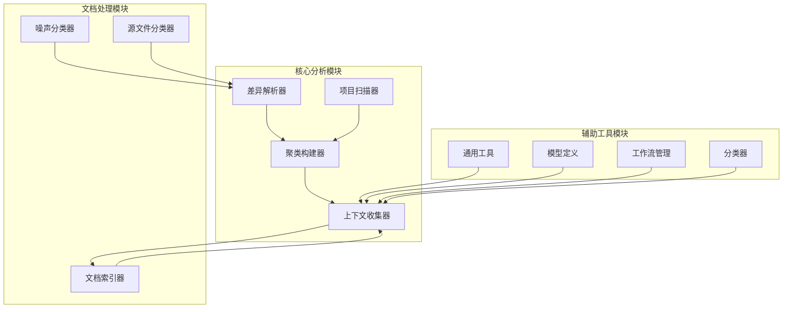
```mermaid
graph TB
subgraph "核心分析模块"
A[差异解析器]
B[项目扫描器]
C[聚类构建器]
D[上下文收集器]
end
subgraph "辅助工具模块"
E[通用工具]
F[模型定义]
G[工作流管理]
H[分类器]
end
subgraph "文档处理模块"
I[文档索引器]
J[噪声分类器]
K[源文件分类器]
end
A --> C
B --> C
C --> D
D --> I
E --> D
F --> D
G --> D
H --> D
I --> D
J --> A
K --> A
```

**图表来源**
- [front_end_impact_analyzer.py:141-169](file://scripts/front_end_impact_analyzer.py#L141-L169)
- [context_collector.py:176-240](file://scripts/analyzer/context_collector.py#L176-L240)

**章节来源**
- [front_end_impact_analyzer.py:141-169](file://scripts/front_end_impact_analyzer.py#L141-L169)
- [context_collector.py:176-240](file://scripts/analyzer/context_collector.py#L176-L240)

## 核心组件

### 文档索引器 (DocumentIndexer)

文档索引器负责扫描和索引项目中的文档文件，包括项目配置文件、wiki文档、需求规格等。它支持多种文档格式（Markdown、TXT、JSON、YAML等），并为每个文档提取标题、标题层级、关键词等元数据。

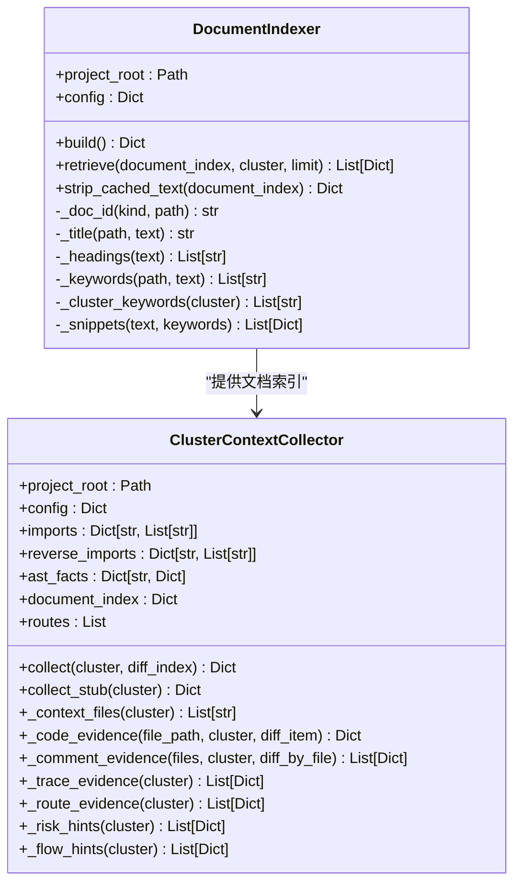
```mermaid
classDiagram
class DocumentIndexer {
+project_root : Path
+config : Dict
+build() Dict
+retrieve(document_index, cluster, limit) List[Dict]
+strip_cached_text(document_index) Dict
-_doc_id(kind, path) str
-_title(path, text) str
-_headings(text) List[str]
-_keywords(path, text) List[str]
-_cluster_keywords(cluster) List[str]
-_snippets(text, keywords) List[Dict]
}
class ClusterContextCollector {
+project_root : Path
+config : Dict
+imports : Dict[str, List[str]]
+reverse_imports : Dict[str, List[str]]
+ast_facts : Dict[str, Dict]
+document_index : Dict
+routes : List
+collect(cluster, diff_index) Dict
+collect_stub(cluster) Dict
+_context_files(cluster) List[str]
+_code_evidence(file_path, cluster, diff_item) Dict
+_comment_evidence(files, cluster, diff_by_file) List[Dict]
+_trace_evidence(cluster) List[Dict]
+_route_evidence(cluster) List[Dict]
+_risk_hints(cluster) List[Dict]
+_flow_hints(cluster) List[Dict]
}
DocumentIndexer --> ClusterContextCollector : "提供文档索引"
```

**图表来源**
- [context_collector.py:15-96](file://scripts/analyzer/context_collector.py#L15-L96)
- [context_collector.py:176-240](file://scripts/analyzer/context_collector.py#L176-L240)

### 变更集群上下文收集器

变更集群上下文收集器是系统的核心协调器，负责根据变更集群的特征收集相应的证据。**新增了轻量级stub上下文收集功能**，支持快速处理不需要深度分析的集群。

#### 全量上下文收集 (`collect` 方法)
支持多种证据类型：
- **代码证据**：直接修改的文件内容和相关的导入/导出信息
- **注释证据**：从代码注释中提取的业务相关信息
- **路由证据**：与变更相关的路由绑定信息
- **文档候选**：从文档索引中检索的相关文档片段
- **风险提示**：针对特定类型的变更提供的分析建议

#### 轻量级stub上下文收集 (`collect_stub` 方法)
**新增功能**，用于处理不需要深度分析的集群：
- **零文件I/O**：跳过所有文件读取操作
- **结构化摘要**：仅捕获集群字典中已存在的结构化信息
- **快速处理**：对数百个浅层集群进行近实时处理

**章节来源**
- [context_collector.py:176-240](file://scripts/analyzer/context_collector.py#L176-L240)
- [context_collector.py:241-618](file://scripts/analyzer/context_collector.py#L241-L618)

## 架构概览

系统采用流水线式处理架构，每个阶段都有明确的职责分工：

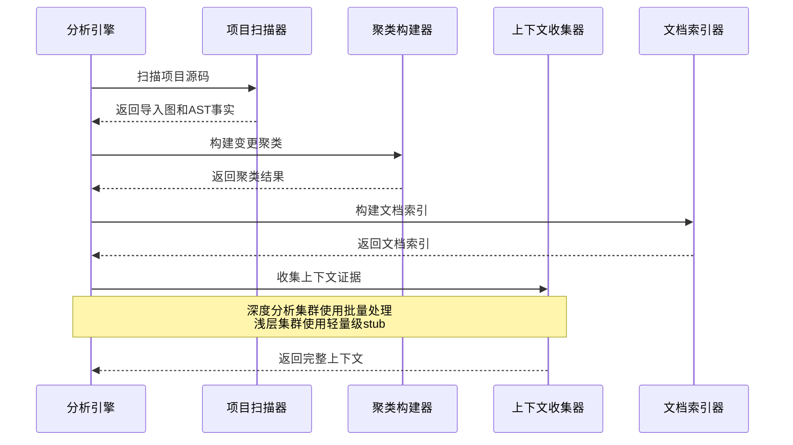
```mermaid
sequenceDiagram
participant Engine as 分析引擎
participant Scanner as 项目扫描器
participant Builder as 聚类构建器
participant Collector as 上下文收集器
participant Indexer as 文档索引器
Engine->>Scanner : 扫描项目源码
Scanner-->>Engine : 返回导入图和AST事实
Engine->>Builder : 构建变更聚类
Builder-->>Engine : 返回聚类结果
Engine->>Indexer : 构建文档索引
Indexer-->>Engine : 返回文档索引
Engine->>Collector : 收集上下文证据
Note over Engine,Collector : 深度分析集群使用批量处理<br/>浅层集群使用轻量级stub
Collector-->>Engine : 返回完整上下文
```

**图表来源**
- [front_end_impact_analyzer.py:133-170](file://scripts/front_end_impact_analyzer.py#L133-L170)
- [context_collector.py:203-239](file://scripts/analyzer/context_collector.py#L203-L239)

**章节来源**
- [front_end_impact_analyzer.py:133-170](file://scripts/front_end_impact_analyzer.py#L133-L170)
- [context_collector.py:203-239](file://scripts/analyzer/context_collector.py#L203-L239)

## 详细组件分析

### 文档索引构建流程

文档索引器采用递归扫描策略，支持多种文档类型和配置选项：

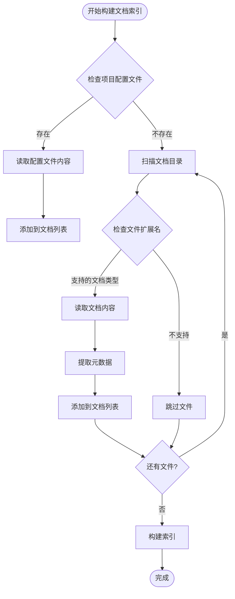
```mermaid
flowchart TD
Start([开始构建文档索引]) --> CheckProfile{检查项目配置文件}
CheckProfile --> |存在| ReadProfile[读取配置文件内容]
CheckProfile --> |不存在| ScanDirs[扫描文档目录]
ReadProfile --> AddProfile[添加到文档列表]
ScanDirs --> CheckExt{检查文件扩展名}
CheckExt --> |支持的文档类型| ReadDoc[读取文档内容]
CheckExt --> |不支持| SkipDoc[跳过文件]
ReadDoc --> ExtractMeta[提取元数据]
ExtractMeta --> AddDoc[添加到文档列表]
AddDoc --> MoreFiles{还有文件?}
SkipDoc --> MoreFiles
MoreFiles --> |是| ScanDirs
MoreFiles --> |否| BuildIndex[构建索引]
BuildIndex --> End([完成])
```

**图表来源**
- [context_collector.py:20-59](file://scripts/analyzer/context_collector.py#L20-L59)

### 上下文收集算法

上下文收集器实现了智能的证据选择和预算控制机制，**新增了批量处理优化和轻量级stub上下文功能**：

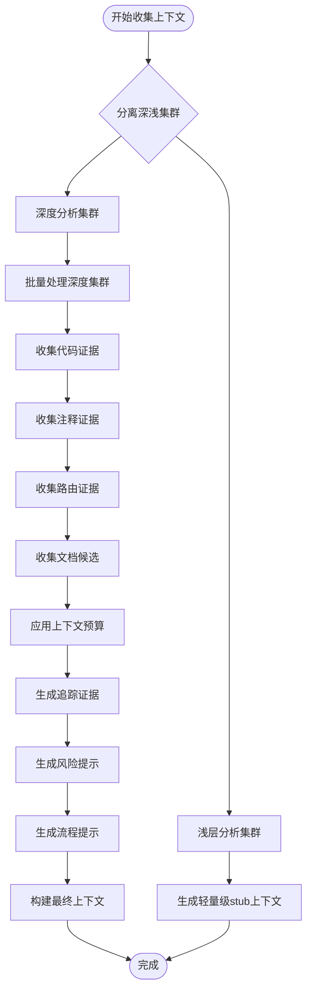
```mermaid
flowchart TD
Start([开始收集上下文]) --> SplitClusters{分离深浅集群}
SplitClusters --> DeepClusters[深度分析集群]
SplitClusters --> ShallowClusters[浅层分析集群]
DeepClusters --> BatchProcess[批量处理深度集群]
BatchProcess --> CollectCode[收集代码证据]
CollectCode --> CollectComments[收集注释证据]
CollectComments --> CollectRoutes[收集路由证据]
CollectRoutes --> CollectDocs[收集文档候选]
CollectDocs --> BudgetControl[应用上下文预算]
BudgetControl --> TraceEvidence[生成追踪证据]
TraceEvidence --> RiskHints[生成风险提示]
RiskHints --> FlowHints[生成流程提示]
FlowHints --> BuildContext[构建最终上下文]
ShallowClusters --> StubContext[生成轻量级stub上下文]
BuildContext --> End([完成])
StubContext --> End
```

**图表来源**
- [context_collector.py:203-239](file://scripts/analyzer/context_collector.py#L203-L239)
- [context_collector.py:575-614](file://scripts/analyzer/context_collector.py#L575-L614)

**章节来源**
- [context_collector.py:203-239](file://scripts/analyzer/context_collector.py#L203-L239)
- [context_collector.py:575-614](file://scripts/analyzer/context_collector.py#L575-L614)

### 关键配置参数

系统提供了丰富的配置选项来控制上下文收集行为，**新增了批量处理和分阶段执行相关参数**：

| 参数名称 | 默认值 | 描述 |
|---------|--------|------|
| maxFilesPerClusterContext | 8 | 每个聚类最多包含的文件数量 |
| maxDocumentSnippetsPerCluster | 6 | 每个聚类最多包含的文档片段数量 |
| maxSnippetChars | 5000 | 单个代码片段的最大字符数 |
| maxClusterContextChars | 60000 | 单个聚类上下文的最大字符数 |
| maxCommentEvidencePerCluster | 20 | 每个聚类最多包含的注释证据数量 |
| clusterContextBatchSize | 10 | 批处理大小（新增） |
| phasedExecutionThreshold | 1000 | 分阶段执行阈值（新增） |
| maxClustersForDeepAnalysis | 500 | 深度分析的最大聚类数量 |

**章节来源**
- [workflow.py:52-65](file://scripts/analyzer/workflow.py#L52-L65)
- [context_collector.py:204-205](file://scripts/analyzer/context_collector.py#L204-L205)

## 批量处理优化

### 批量处理实现

系统实现了智能的批量处理机制，通过 `clusterContextBatchSize` 参数控制批量大小：

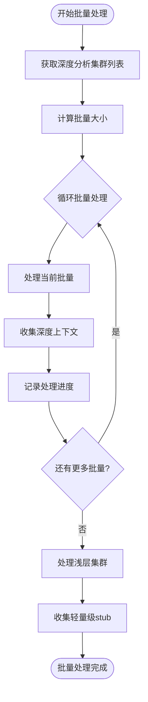
```mermaid
flowchart TD
Start([开始批量处理]) --> GetClusters[获取深度分析集群列表]
GetClusters --> CalcBatchSize[计算批量大小]
CalcBatchSize --> LoopBatches{循环批量处理}
LoopBatches --> ProcessBatch[处理当前批量]
ProcessBatch --> CollectDeep[收集深度上下文]
CollectDeep --> LogProgress[记录处理进度]
LogProgress --> NextBatch{还有更多批量?}
NextBatch --> |是| LoopBatches
NextBatch --> |否| ProcessShallow[处理浅层集群]
ProcessShallow --> CollectStubs[收集轻量级stub]
CollectStubs --> Complete[完成批量处理]
Complete([批量处理完成])
```

**图表来源**
- [front_end_impact_analyzer.py:580-607](file://scripts/front_end_impact_analyzer.py#L580-L607)

### 批量处理算法

批量处理算法实现了高效的集群上下文收集：

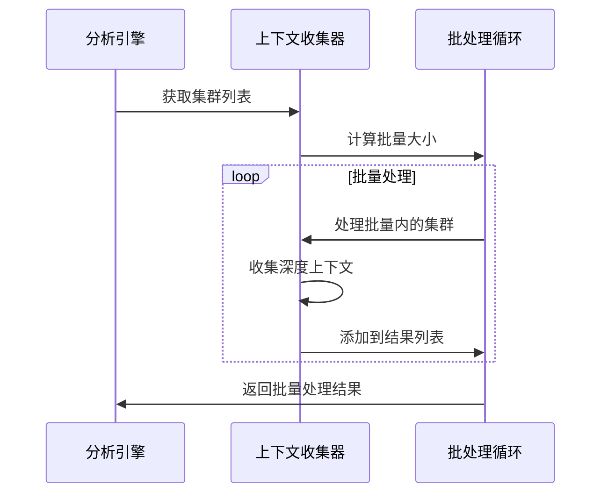
```mermaid
sequenceDiagram
participant Engine as 分析引擎
participant Collector as 上下文收集器
participant Batch as 批处理循环
Engine->>Collector : 获取集群列表
Collector->>Batch : 计算批量大小
loop 批量处理
Batch->>Collector : 处理批量内的集群
Collector->>Collector : 收集深度上下文
Collector->>Batch : 添加到结果列表
end
Batch->>Engine : 返回批量处理结果
```

**图表来源**
- [front_end_impact_analyzer.py:570-587](file://scripts/front_end_impact_analyzer.py#L570-L587)

**章节来源**
- [front_end_impact_analyzer.py:580-607](file://scripts/front_end_impact_analyzer.py#L580-L607)
- [front_end_impact_analyzer.py:570-587](file://scripts/front_end_impact_analyzer.py#L570-L587)

## 轻量级stub上下文收集

### stub上下文收集机制

**新增功能**，用于快速处理不需要深度分析的集群：

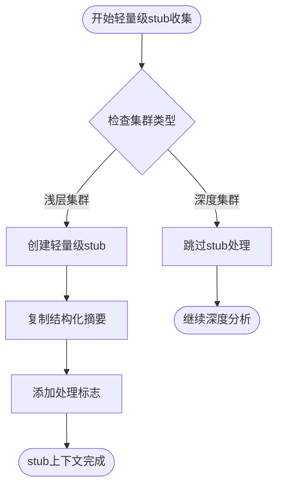
```mermaid
flowchart TD
Start([开始轻量级stub收集]) --> CheckClusterType{检查集群类型}
CheckClusterType --> |浅层集群| CreateStub[创建轻量级stub]
CreateStub --> CopySummary[复制结构化摘要]
CopySummary --> AddFlags[添加处理标志]
AddFlags --> ReturnStub[返回stub上下文]
ReturnStub([stub上下文完成])
CheckClusterType --> |深度集群| SkipStub[跳过stub处理]
SkipStub --> Continue[继续深度分析]
Continue([继续深度分析])
```

**图表来源**
- [context_collector.py:241-262](file://scripts/analyzer/context_collector.py#L241-L262)

### stub上下文结构

轻量级stub上下文包含最小化的必要信息：

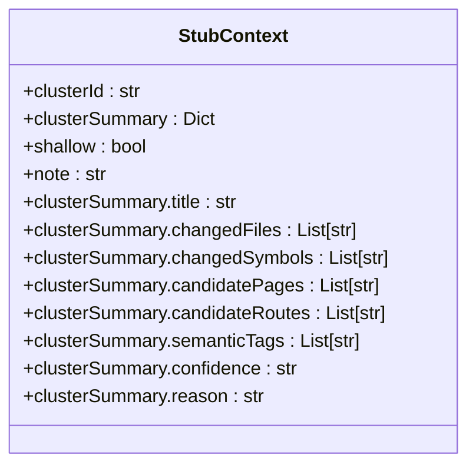
```mermaid
classDiagram
class StubContext {
+clusterId : str
+clusterSummary : Dict
+shallow : bool
+note : str
+clusterSummary.title : str
+clusterSummary.changedFiles : List[str]
+clusterSummary.changedSymbols : List[str]
+clusterSummary.candidatePages : List[str]
+clusterSummary.candidateRoutes : List[str]
+clusterSummary.semanticTags : List[str]
+clusterSummary.confidence : str
+clusterSummary.reason : str
}
```

**图表来源**
- [context_collector.py:241-262](file://scripts/analyzer/context_collector.py#L241-L262)

**章节来源**
- [context_collector.py:241-262](file://scripts/analyzer/context_collector.py#L241-L262)

## 分阶段执行机制

### 自动分阶段检测

系统实现了智能的分阶段执行机制，通过 `phasedExecutionThreshold` 参数控制大规模分析的执行策略：

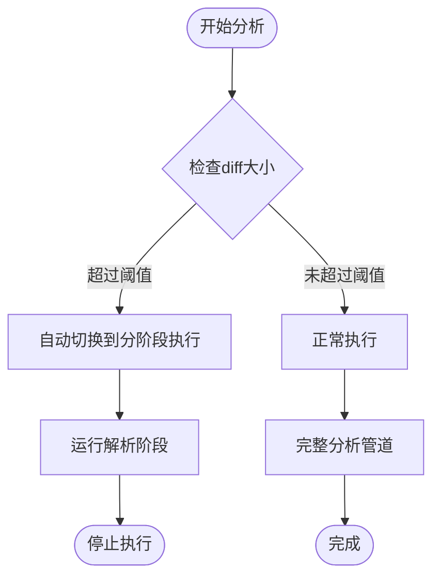
```mermaid
flowchart TD
Start([开始分析]) --> CheckDiffSize{检查diff大小}
CheckDiffSize --> |超过阈值| AutoPhase[自动切换到分阶段执行]
CheckDiffSize --> |未超过阈值| NormalExecution[正常执行]
AutoPhase --> RunParsePhase[运行解析阶段]
RunParsePhase --> Stop[停止等待人工干预]
NormalExecution --> FullPipeline[完整分析管道]
FullPipeline --> End([完成])
Stop([停止执行])
```

**图表来源**
- [front_end_impact_analyzer.py:751-757](file://scripts/front_end_impact_analyzer.py#L751-L757)

### 分阶段执行流程

分阶段执行提供了更安全的大规模分析方式：

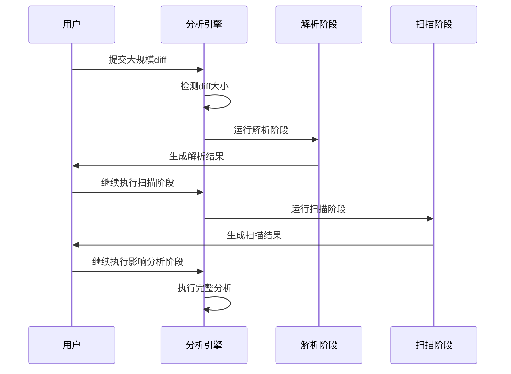
```mermaid
sequenceDiagram
participant User as 用户
participant Engine as 分析引擎
participant ParsePhase as 解析阶段
participant ScanPhase as 扫描阶段
User->>Engine : 提交大规模diff
Engine->>Engine : 检测diff大小
Engine->>ParsePhase : 运行解析阶段
ParsePhase->>User : 生成解析结果
User->>Engine : 继续执行扫描阶段
Engine->>ScanPhase : 运行扫描阶段
ScanPhase->>User : 生成扫描结果
User->>Engine : 继续执行影响分析阶段
Engine->>Engine : 执行完整分析
```

**图表来源**
- [front_end_impact_analyzer.py:288-348](file://scripts/front_end_impact_analyzer.py#L288-L348)

**章节来源**
- [front_end_impact_analyzer.py:751-757](file://scripts/front_end_impact_analyzer.py#L751-L757)
- [front_end_impact_analyzer.py:288-348](file://scripts/front_end_impact_analyzer.py#L288-L348)

## 依赖关系分析

系统采用松耦合的设计，各组件之间的依赖关系清晰明确：

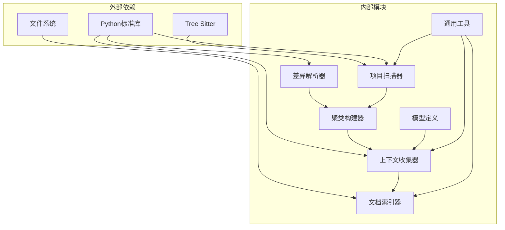
```mermaid
graph TB
subgraph "外部依赖"
A[Tree Sitter]
B[Python标准库]
C[文件系统]
end
subgraph "内部模块"
D[差异解析器]
E[项目扫描器]
F[聚类构建器]
G[上下文收集器]
H[文档索引器]
I[模型定义]
J[通用工具]
end
A --> E
B --> D
B --> E
B --> G
C --> H
D --> F
E --> F
F --> G
G --> H
I --> G
J --> G
J --> H
J --> E
```

**图表来源**
- [project_scanner.py:8-18](file://scripts/analyzer/project_scanner.py#L8-L18)
- [context_collector.py:9](file://scripts/analyzer/context_collector.py#L9)

**章节来源**
- [project_scanner.py:8-18](file://scripts/analyzer/project_scanner.py#L8-L18)
- [context_collector.py:9](file://scripts/analyzer/context_collector.py#L9)

## 性能考虑

### 缓存策略

系统实现了多层次的缓存机制来优化性能：

1. **文件内容缓存**：在单次分析会话中缓存已读取的文件内容
2. **树解析缓存**：避免重复解析相同的AST树
3. **文档文本缓存**：在内存中保留文档索引但移除大文本字段

### 内存管理

- 使用生成器模式处理大量数据
- 实施严格的上下文预算控制
- 及时释放不再需要的大对象

### 批量处理优化

**新增功能**，通过以下方式提升性能：

1. **批量I/O操作**：减少文件系统调用次数
2. **内存优化**：浅层集群使用轻量级stub避免大对象分配
3. **并行处理**：批量内并行处理多个集群
4. **渐进式处理**：支持大规模集群的渐进式分析

### 分阶段执行优化

**新增功能**，通过以下方式优化大规模分析：

1. **渐进式加载**：避免一次性加载所有数据
2. **阶段化验证**：在每个阶段验证数据完整性
3. **用户交互**：允许用户在关键节点进行决策
4. **错误隔离**：分阶段执行便于错误定位和恢复

### 并行处理

- 批量处理多个聚类上下文
- 并行扫描项目文件
- 异步I/O操作

## 故障排除指南

### 常见问题及解决方案

**问题1：文档索引为空**
- 检查文档目录配置是否正确
- 确认文档文件具有正确的扩展名
- 验证文档内容是否可读

**问题2：上下文收集超时**
- 调整maxClusterContextChars参数
- 减少clusterContextBatchSize
- 检查磁盘I/O性能

**问题3：内存使用过高**
- 增加maxClusterContextChars限制
- 启用文档文本缓存剥离功能
- 优化项目扫描范围

**问题4：批量处理性能不佳**
- 调整clusterContextBatchSize参数
- 检查系统资源限制
- 考虑使用分阶段执行策略

**问题5：分阶段执行失败**
- 检查前置阶段的输出文件
- 验证项目根路径一致性
- 确认时间戳顺序正确

**章节来源**
- [context_collector.py:620-660](file://scripts/analyzer/context_collector.py#L620-L660)
- [workflow.py:134-163](file://scripts/analyzer/workflow.py#L134-L163)

## 结论

上下文收集系统通过精心设计的多源证据收集机制，为前端影响分析提供了全面而精确的信息基础。**新增的批量处理优化、轻量级stub上下文功能和分阶段执行机制**显著提升了系统的性能和可扩展性。

系统的核心优势包括：

1. **多源证据整合**：同时处理代码、文档、注释和路由等多种证据类型
2. **智能预算控制**：确保输出的可管理性和可分析性
3. **灵活的配置选项**：适应不同规模和复杂度的项目需求
4. **高效的性能表现**：通过缓存、批处理和轻量级stub优化处理速度
5. **可扩展的架构**：支持大规模变更分析场景
6. **智能的执行策略**：通过分阶段执行机制安全处理大规模分析任务

该系统为后续的AI分析提供了高质量的输入，显著提升了前端变更影响分析的准确性和效率。**批量处理优化**使得系统能够高效处理数千个变更集群，**轻量级stub上下文功能**确保了对不需要深度分析的集群进行快速响应，**分阶段执行机制**为大规模分析提供了安全可靠的执行保障。