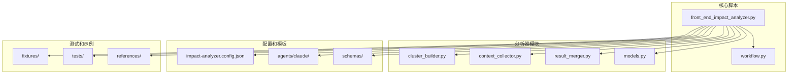
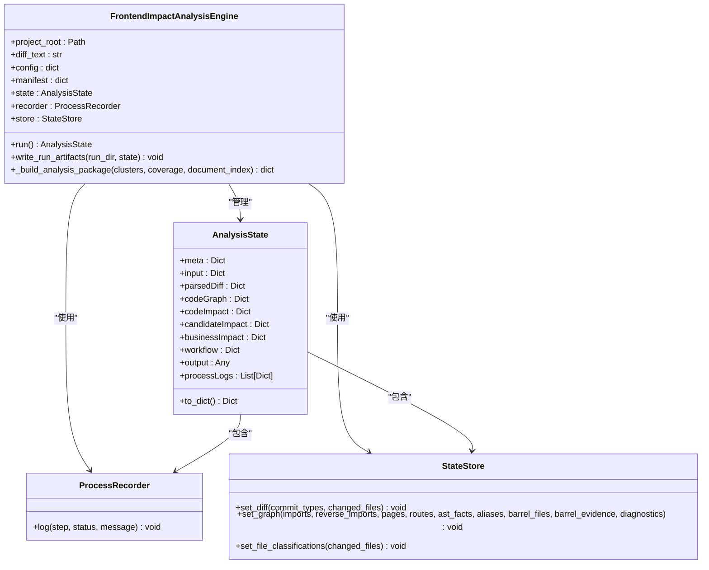
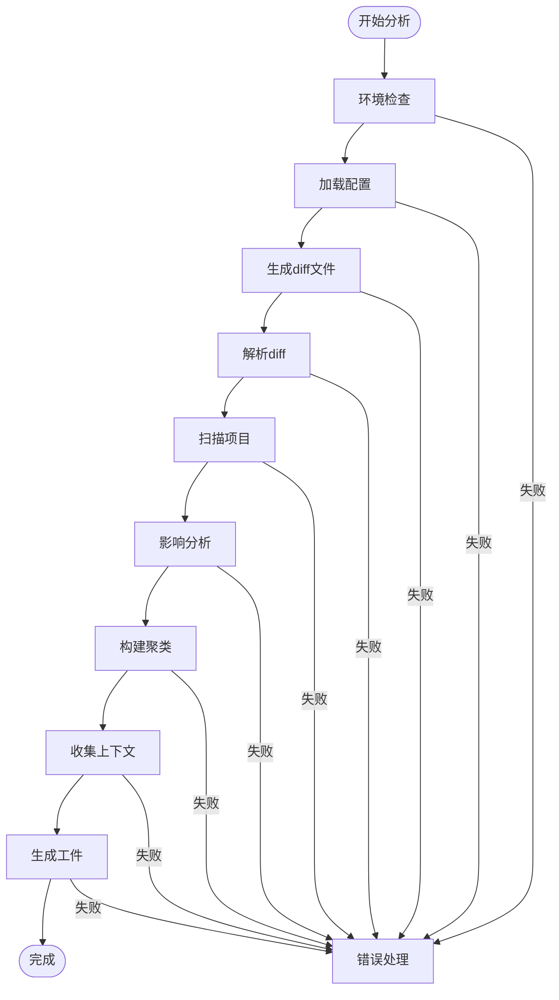
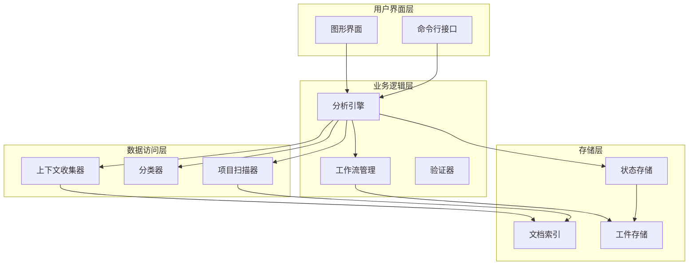
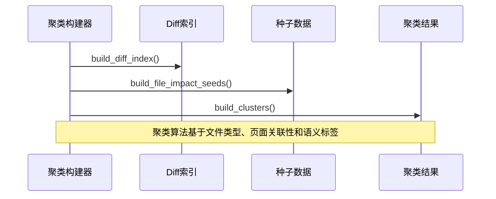
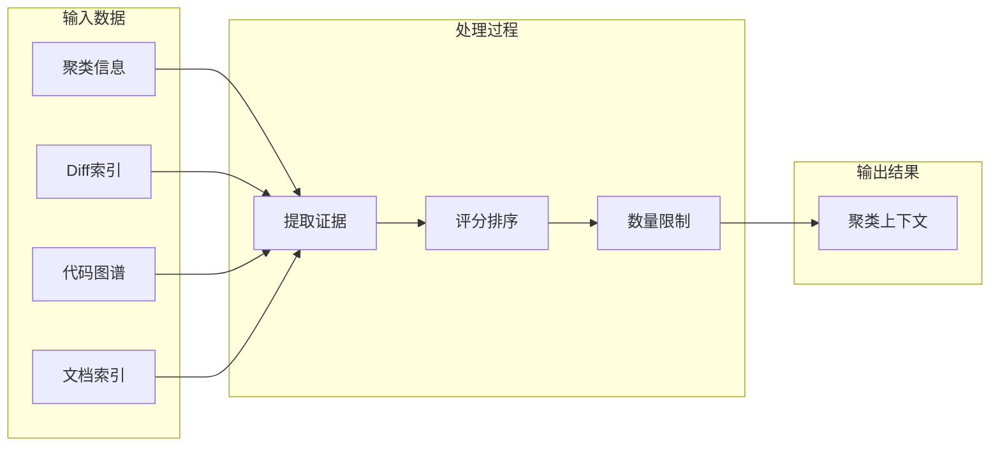
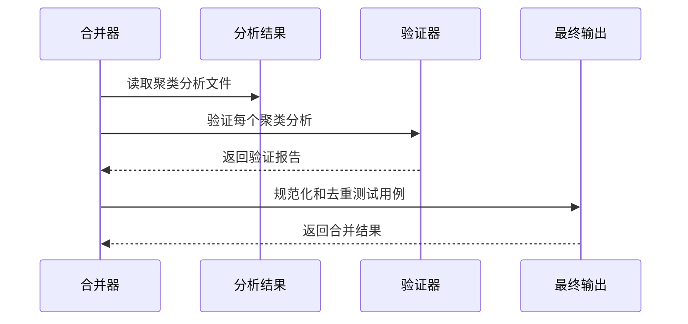
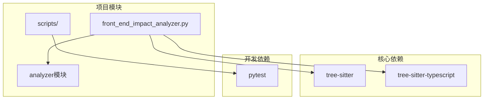

# 前端影响分析器真实运行工作流程

<cite>
**本文档中引用的文件**
- [real-run-workflow.md](file://references/real-run-workflow.md)
- [workflow.py](file://scripts/analyzer/workflow.py)
- [front_end_impact_analyzer.py](file://scripts/front_end_impact_analyzer.py)
- [REAL_RUN_REVIEW.md](file://internal/REAL_RUN_REVIEW.md)
- [pyproject.toml](file://pyproject.toml)
- [models.py](file://scripts/analyzer/models.py)
- [cluster_builder.py](file://scripts/analyzer/cluster_builder.py)
- [context_collector.py](file://scripts/analyzer/context_collector.py)
- [result_merger.py](file://scripts/analyzer/result_merger.py)
- [sample_merged_result.json](file://fixtures/expected/sample_merged_result.json)
- [sample_cluster_analysis.json](file://fixtures/expected/sample_cluster_analysis.json)
- [analysis-result.schema.json](file://schemas/analysis-result.schema.json)
</cite>

## 目录
1. [简介](#简介)
2. [项目结构](#项目结构)
3. [核心组件](#核心组件)
4. [架构概览](#架构概览)
5. [详细组件分析](#详细组件分析)
6. [依赖关系分析](#依赖关系分析)
7. [性能考虑](#性能考虑)
8. [故障排除指南](#故障排除指南)
9. [结论](#结论)

## 简介

前端影响分析器是一个专门设计用于在React、React Router和Vite代码库中追踪前端变更影响的技能型分析器。该工具的核心目标是通过系统化的工作流程，帮助QA工程师识别和验证由代码变更可能产生的用户可见影响。

该工作流程特别适用于真实项目的diff验证，旨在学习聚类、证据包、Claude集群分析和验证是否足够用于实际的QA工作。工具提供了完整的端到端分析管道，从代码变更检测到最终的测试用例生成。

## 项目结构

项目采用模块化的架构设计，主要包含以下核心目录和文件：

**图表来源**
- [front_end_impact_analyzer.py:1-100](file://scripts/front_end_impact_analyzer.py#L1-100)
- [workflow.py:1-100](file://scripts/analyzer/workflow.py#L1-100)

**章节来源**
- [front_end_impact_analyzer.py:1-100](file://scripts/front_end_impact_analyzer.py#L1-100)
- [pyproject.toml:1-20](file://pyproject.toml#L1-20)

## 核心组件

### 分析引擎 (FrontendImpactAnalysisEngine)

分析引擎是整个系统的核心，负责协调所有分析组件并管理分析状态。它实现了完整的分析生命周期，从解析diff到生成最终结果。

**图表来源**
- [models.py:115-200](file://scripts/analyzer/models.py#L115-200)
- [front_end_impact_analyzer.py:38-282](file://scripts/front_end_impact_analyzer.py#L38-282)

### 工作流管理器 (Workflow Manager)

工作流管理器提供了完整的命令行接口，支持分阶段执行和批量处理功能。

**图表来源**
- [workflow.py:175-266](file://scripts/analyzer/workflow.py#L175-266)
- [front_end_impact_analyzer.py:288-800](file://scripts/front_end_impact_analyzer.py#L288-800)

**章节来源**
- [front_end_impact_analyzer.py:38-282](file://scripts/front_end_impact_analyzer.py#L38-282)
- [workflow.py:16-116](file://scripts/analyzer/workflow.py#L16-116)

## 架构概览

系统采用分层架构设计，每个层次都有明确的职责分工：

**图表来源**
- [front_end_impact_analyzer.py:38-282](file://scripts/front_end_impact_analyzer.py#L38-282)
- [workflow.py:118-173](file://scripts/analyzer/workflow.py#L118-173)

## 详细组件分析

### 聚类构建器 (ChangeClusterBuilder)

聚类构建器负责将相关的代码变更组织成有意义的聚类，以便进行深入分析。

**图表来源**
- [cluster_builder.py:92-149](file://scripts/analyzer/cluster_builder.py#L92-149)

聚类构建过程的关键特性包括：

1. **智能分组策略**：根据文件类型（页面、路由、API、共享组件等）进行分组
2. **全局变更处理**：特殊处理跨模块的全局变更
3. **深度分析优先级**：为最有价值的聚类分配深度分析优先级
4. **聚类质量控制**：限制深度分析聚类数量以控制计算成本

**章节来源**
- [cluster_builder.py:11-150](file://scripts/analyzer/cluster_builder.py#L11-150)

### 上下文收集器 (ClusterContextCollector)

上下文收集器负责为每个聚类收集相关的代码和文档证据。

**图表来源**
- [context_collector.py:176-200](file://scripts/analyzer/context_collector.py#L176-200)

上下文收集的关键功能包括：

1. **多源证据收集**：从diff、代码和文档中提取相关信息
2. **智能评分机制**：基于关键词匹配和上下文相关性对证据进行评分
3. **预算控制**：限制每个聚类的上下文大小以保证性能
4. **缓存优化**：避免重复读取相同的文件内容

**章节来源**
- [context_collector.py:176-200](file://scripts/analyzer/context_collector.py#L176-200)

### 结果合并器 (ClusterAnalysisMerger)

结果合并器负责整合Claude的聚类分析结果并生成最终的测试用例。

**图表来源**
- [result_merger.py:12-96](file://scripts/analyzer/result_merger.py#L12-96)

合并过程的主要步骤：

1. **分析文件读取**：扫描并读取所有聚类分析文件
2. **验证和规范化**：使用验证器检查分析质量和完整性
3. **用例规范化**：统一不同格式的测试用例结构
4. **去重和汇总**：消除重复用例并生成统计摘要

**章节来源**
- [result_merger.py:12-96](file://scripts/analyzer/result_merger.py#L12-96)

## 依赖关系分析

系统依赖关系清晰，主要依赖于Python生态系统中的核心库：

**图表来源**
- [pyproject.toml:6-14](file://pyproject.toml#L6-14)

**章节来源**
- [pyproject.toml:1-20](file://pyproject.toml#L1-20)

## 性能考虑

系统在设计时充分考虑了性能优化：

### 批处理机制
- 支持分批处理聚类上下文，避免内存溢出
- 可配置的批大小以平衡内存使用和处理速度

### 缓存策略
- 文件内容缓存避免重复I/O操作
- 文档索引缓存提高检索效率

### 内存管理
- 大对象序列化时移除冗余字段
- 分阶段写入减少峰值内存占用

### 并行处理
- 多线程文件扫描
- 批量上下文收集优化

## 故障排除指南

### 常见问题诊断

1. **环境检查失败**
   - 确保安装了uv包管理器
   - 验证Python版本满足3.12+要求
   - 检查tree-sitter相关依赖是否正确安装

2. **Git工作树问题**
   - 确保在正确的Git工作树中运行
   - 检查项目根目录的.git文件夹是否存在

3. **配置文件问题**
   - 使用`--force-config`覆盖现有配置
   - 检查配置文件路径和权限
   - 验证JSON格式的有效性

4. **聚类分析缺失**
   - 检查`cluster-analysis`目录中的分析文件
   - 确认每个需要深度分析的聚类都已生成分析
   - 验证分析文件的JSON格式正确性

### 性能优化建议

1. **调整批大小**：对于大型项目，适当减小批大小以控制内存使用
2. **优化忽略规则**：合理配置忽略目录和文件以减少扫描时间
3. **限制聚类数量**：通过配置参数限制深度分析的聚类数量
4. **清理缓存**：定期清理临时文件和缓存目录

**章节来源**
- [workflow.py:175-266](file://scripts/analyzer/workflow.py#L175-266)
- [REAL_RUN_REVIEW.md:1-197](file://internal/REAL_RUN_REVIEW.md#L1-197)

## 结论

前端影响分析器提供了一个完整、可扩展的解决方案来分析前端代码变更的影响。通过系统化的工作流程和模块化的架构设计，该工具能够有效地：

1. **自动化分析流程**：从代码变更检测到测试用例生成的完整自动化
2. **高质量证据收集**：智能地从多种来源收集相关证据
3. **灵活的聚类策略**：根据变更性质和影响范围进行智能分组
4. **可验证的结果**：通过验证器确保输出的质量和一致性

该工作流程特别适合在真实项目中进行验证，能够帮助团队建立可靠的前端变更影响分析实践。通过持续的迭代和改进，该工具将继续提升其在实际QA工作中的价值。