# 前端影响分析器技能文档

<cite>
**本文档引用的文件**
- [SKILL.md](file://SKILL.md)
- [AGENTS.md](file://AGENTS.md)
- [HANDOFF.md](file://internal/HANDOFF.md)
- [pyproject.toml](file://pyproject.toml)
- [front_end_impact_analyzer.py](file://scripts/front_end_impact_analyzer.py)
- [models.py](file://scripts/analyzer/models.py)
- [diff_parser.py](file://scripts/analyzer/diff_parser.py)
- [project_scanner.py](file://scripts/analyzer/project_scanner.py)
- [impact_engine.py](file://scripts/analyzer/impact_engine.py)
- [cluster_builder.py](file://scripts/analyzer/cluster_builder.py)
- [common.py](file://scripts/analyzer/common.py)
- [analysis-result.schema.json](file://schemas/analysis-result.schema.json)
- [impact-rules.md](file://references/impact-rules.md)
- [route-conventions.md](file://references/route-conventions.md)
</cite>

## 目录
1. [项目概述](#项目概述)
2. [核心工作流程](#核心工作流程)
3. [系统架构](#系统架构)
4. [核心组件分析](#核心组件分析)
5. [详细组件分析](#详细组件分析)
6. [依赖关系分析](#依赖关系分析)
7. [性能考虑](#性能考虑)
8. [故障排除指南](#故障排除指南)
9. [结论](#结论)

## 项目概述

前端影响分析器是一个专为React、React Router和Vite项目设计的智能分析工具，能够将前端变更影响转化为可执行的QA测试案例。该工具通过静态分析技术，从代码变更中提取证据，并将其转换为面向业务的功能性影响分析。

### 主要特性

- **AST驱动的代码理解**：使用tree-sitter解析TypeScript/JavaScript代码
- **导入/反向导入依赖追踪**：构建完整的模块依赖图
- **路由页面绑定**：支持嵌套路由和懒加载路由
- **别名解析**：支持tsconfig路径别名和扩展
- **桶装导出处理**：支持多层导出重定向
- **过程状态持久化**：确定性的JSON输出格式

## 核心工作流程

### 1. 环境检查和配置
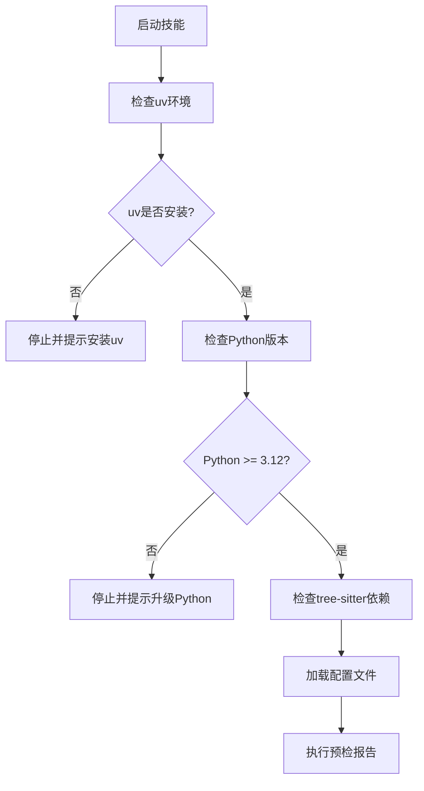

### 2. 变更检测和分类
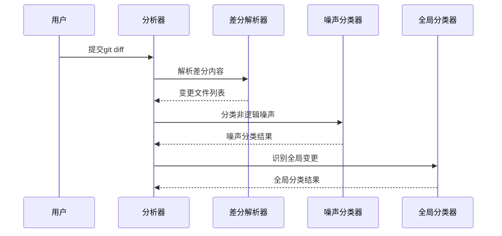

### 3. 项目扫描和依赖分析
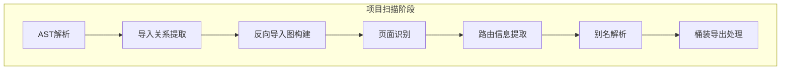

### 4. 影响追踪和聚类

## 系统架构

### 整体架构设计
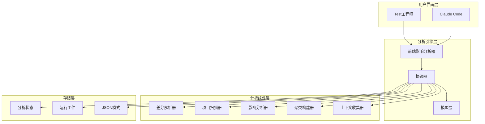

### 数据流架构
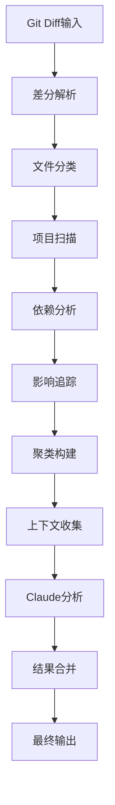

## 核心组件分析

### 分析器引擎 (FrontendImpactAnalysisEngine)
分析器引擎是整个系统的协调中心，负责管理完整的分析流程：

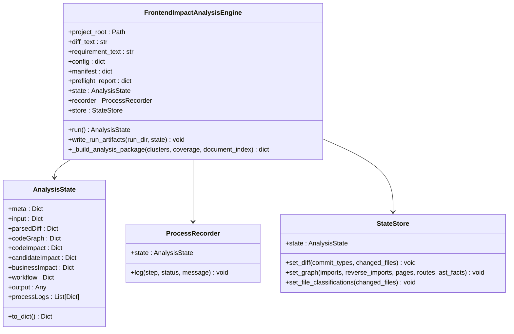

**章节来源**
- [front_end_impact_analyzer.py:38-187](file://scripts/front_end_impact_analyzer.py#L38-L187)
- [models.py:116-169](file://scripts/analyzer/models.py#L116-L169)

### 差分解析器 (GitDiffParser)
差分解析器负责解析git diff输出，提取语义信息和变更类型：

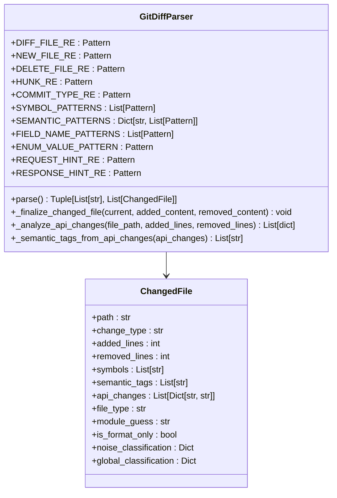

**章节来源**
- [diff_parser.py:11-302](file://scripts/analyzer/diff_parser.py#L11-L302)
- [models.py:27-40](file://scripts/analyzer/models.py#L27-L40)

### 项目扫描器 (ProjectScanner)
项目扫描器执行全面的代码分析，构建依赖图和路由信息：

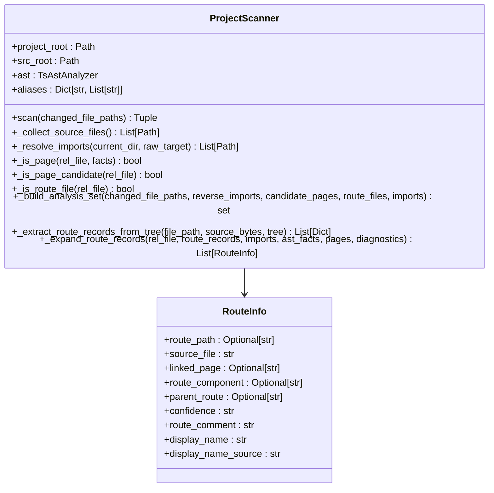

**章节来源**
- [project_scanner.py:13-509](file://scripts/analyzer/project_scanner.py#L13-L509)
- [models.py:43-53](file://scripts/analyzer/models.py#L43-L53)

### 影响分析器 (ImpactAnalyzer)
影响分析器负责将代码变更追踪到具体的页面和功能：

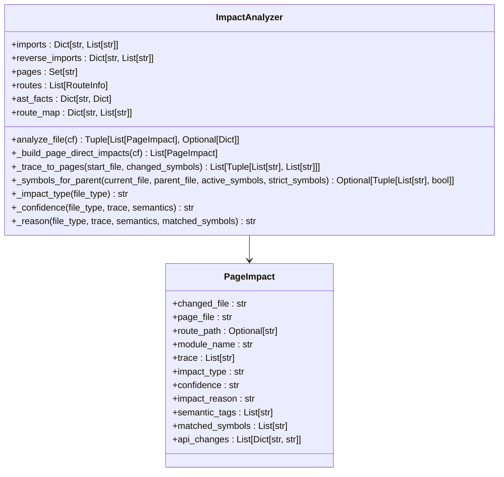

**章节来源**
- [impact_engine.py:10-188](file://scripts/analyzer/impact_engine.py#L10-L188)
- [models.py:78-90](file://scripts/analyzer/models.py#L78-L90)

### 聚类构建器 (ChangeClusterBuilder)
聚类构建器将相关的变更组合成分析集群：

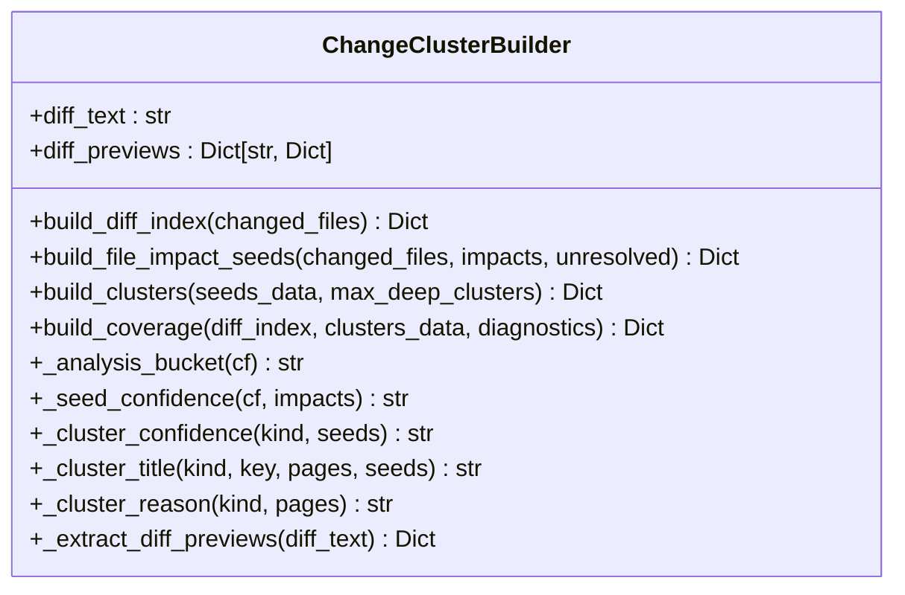

**章节来源**
- [cluster_builder.py:11-312](file://scripts/analyzer/cluster_builder.py#L11-L312)

## 详细组件分析

### 配置管理系统
配置系统提供了灵活的项目定制能力：

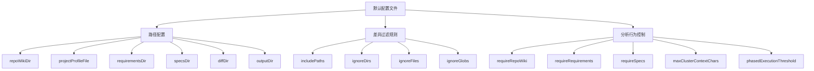

### 运行工件管理
每次分析都会生成完整的运行工件集：

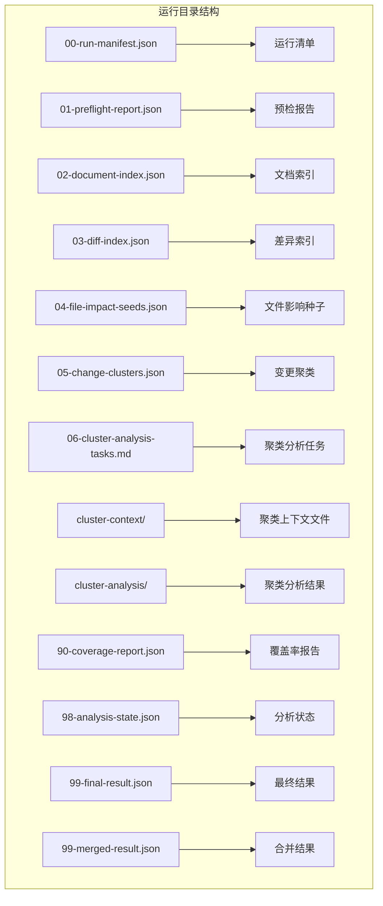

### Claude代理集成
系统支持多个Claude Code代理模板：

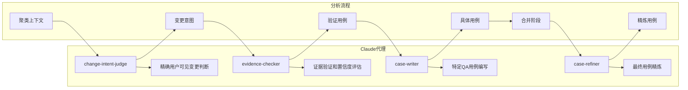

## 依赖关系分析

### 外部依赖
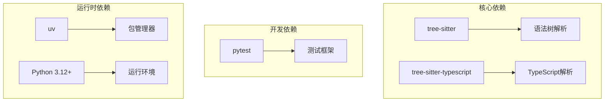

### 内部模块依赖
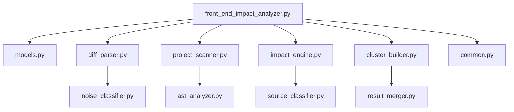

**章节来源**
- [pyproject.toml:1-20](file://pyproject.toml#L1-L20)

## 性能考虑

### 大型项目优化策略
1. **分阶段执行**：对于大型diff（超过1000行），自动启用分阶段执行
2. **增量分析**：仅对受变更影响的文件进行完整AST分析
3. **内存优化**：使用轻量级导入扫描作为第一阶段
4. **批处理上下文**：聚类上下文收集支持批处理以减少I/O开销

### 缓存机制
- **树缓存**：在第一阶段解析的AST树在第二阶段复用
- **路径规范化**：统一路径格式避免重复计算
- **去重机制**：确保分析结果的唯一性和一致性

## 故障排除指南

### 常见问题诊断
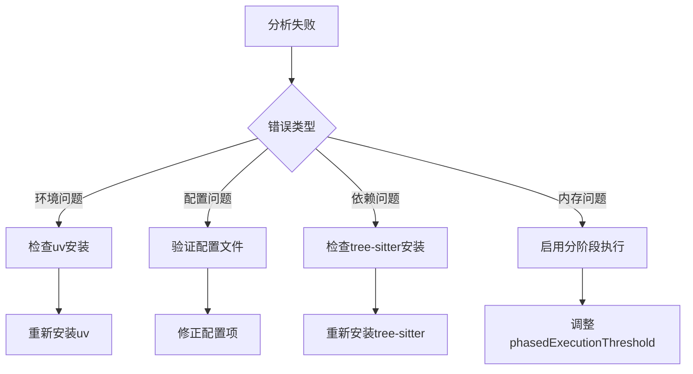

### 错误恢复策略
1. **预检失败**：根据预检报告中的阻塞动作进行修复
2. **未解析导入**：检查tsconfig别名配置和文件路径
3. **路由绑定失败**：验证路由定义和页面组件匹配
4. **聚类分析缺失**：检查聚类上下文文件生成情况

**章节来源**
- [HANDOFF.md:104-114](file://internal/HANDOFF.md#L104-L114)

## 结论

前端影响分析器提供了一个完整的工程化解决方案，将静态分析与人工智能相结合，实现了从代码变更到可执行测试用例的自动化转换。其核心优势包括：

1. **确定性输出**：严格的JSON模式保证了输出的一致性和可验证性
2. **渐进式分析**：支持分阶段执行，适应不同规模的项目需求
3. **证据驱动**：每个结论都有相应的代码和文档证据支撑
4. **可扩展性**：模块化的架构设计便于功能扩展和定制

该工具特别适合处理大型PR和发布版本的变更影响分析，能够显著提高QA团队的工作效率和质量保证水平。