# 工作流管理

<cite>
**本文档引用的文件**
- [scripts/analyzer/workflow.py](file://scripts/analyzer/workflow.py)
- [scripts/front_end_impact_analyzer.py](file://scripts/front_end_impact_analyzer.py)
- [references/real-run-workflow.md](file://references/real-run-workflow.md)
- [references/agent-usage.md](file://references/agent-usage.md)
- [internal/REAL_RUN_REVIEW.md](file://internal/REAL_RUN_REVIEW.md)
- [scripts/analyzer/models.py](file://scripts/analyzer/models.py)
- [tests/test_workflow_intermediates.py](file://tests/test_workflow_intermediates.py)
- [tests/test_integration_output.py](file://tests/test_integration_output.py)
- [pyproject.toml](file://pyproject.toml)
</cite>

## 目录
1. [简介](#简介)
2. [项目结构](#项目结构)
3. [核心组件](#核心组件)
4. [架构概览](#架构概览)
5. [详细组件分析](#详细组件分析)
6. [依赖关系分析](#依赖关系分析)
7. [性能考虑](#性能考虑)
8. [故障排除指南](#故障排除指南)
9. [结论](#结论)

## 简介

前端影响分析器是一个专为React、React Router和Vite代码库设计的技能导向分析器，用于追踪前端变更的影响范围。该系统采用分阶段工作流管理，支持从简单的单阶段执行到复杂的多阶段检查点工作流。

该工作流管理系统的核心目标是：
- 自动化前端变更影响分析流程
- 支持大规模项目的渐进式分析
- 提供完整的中间产物检查点
- 实现人机协作的案例生成流程
- 确保分析结果的可追溯性和可验证性

## 项目结构

项目采用模块化的架构设计，主要包含以下核心目录：

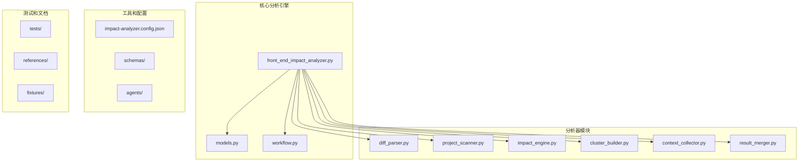

**图表来源**
- [scripts/front_end_impact_analyzer.py:1-884](file://scripts/front_end_impact_analyzer.py#L1-L884)
- [scripts/analyzer/workflow.py:1-524](file://scripts/analyzer/workflow.py#L1-L524)

**章节来源**
- [scripts/front_end_impact_analyzer.py:1-884](file://scripts/front_end_impact_analyzer.py#L1-L884)
- [pyproject.toml:1-20](file://pyproject.toml#L1-L20)

## 核心组件

### 分析状态管理

系统使用AnalysisState类来管理整个分析过程的状态，包含以下关键部分：

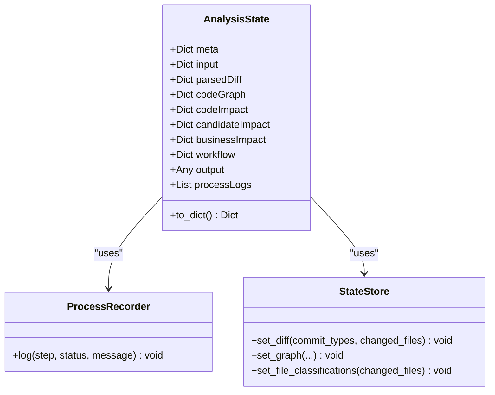

**图表来源**
- [scripts/analyzer/models.py:115-200](file://scripts/analyzer/models.py#L115-L200)

### 分阶段工作流

系统实现了五阶段的分析工作流，每个阶段都有明确的输入输出和检查点：

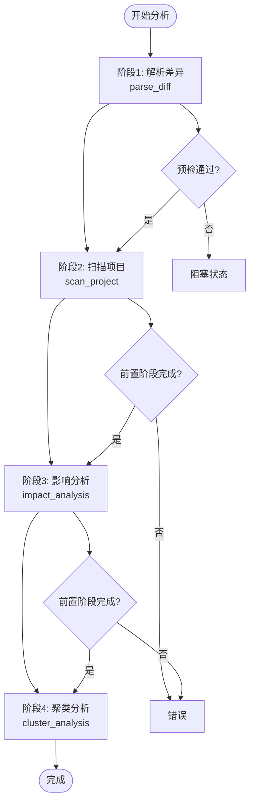

**图表来源**
- [scripts/front_end_impact_analyzer.py:287-647](file://scripts/front_end_impact_analyzer.py#L287-L647)

**章节来源**
- [scripts/analyzer/models.py:115-200](file://scripts/analyzer/models.py#L115-L200)
- [scripts/front_end_impact_analyzer.py:287-647](file://scripts/front_end_impact_analyzer.py#L287-L647)

## 架构概览

### 整体架构设计

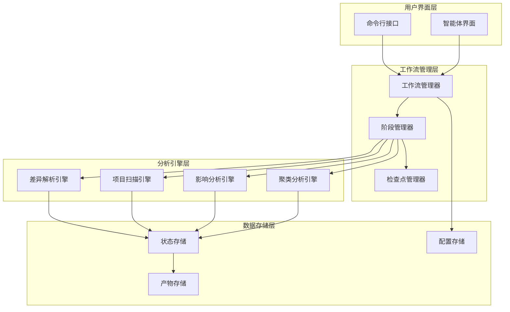

**图表来源**
- [scripts/analyzer/workflow.py:68-106](file://scripts/analyzer/workflow.py#L68-L106)
- [scripts/front_end_impact_analyzer.py:37-69](file://scripts/front_end_impact_analyzer.py#L37-L69)

### 配置管理系统

系统采用分层配置策略，支持默认配置、项目配置和运行时配置的合并：

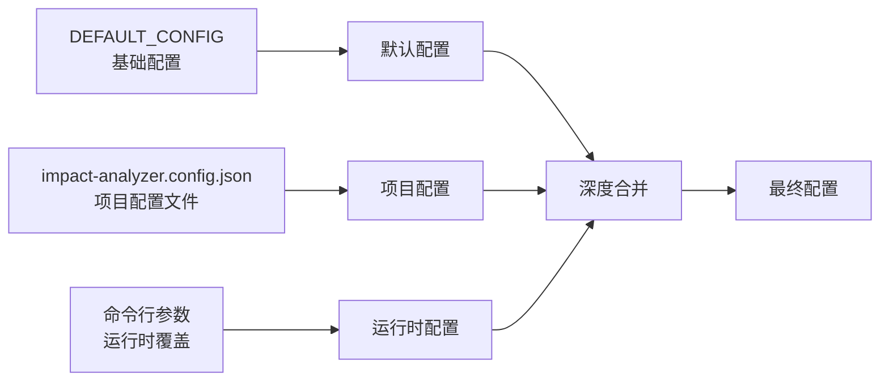

**图表来源**
- [scripts/analyzer/workflow.py:16-75](file://scripts/analyzer/workflow.py#L16-L75)

**章节来源**
- [scripts/analyzer/workflow.py:68-106](file://scripts/analyzer/workflow.py#L68-L106)
- [scripts/analyzer/workflow.py:16-75](file://scripts/analyzer/workflow.py#L16-L75)

## 详细组件分析

### 前环境检查系统

前环境检查系统确保分析环境满足所有要求：

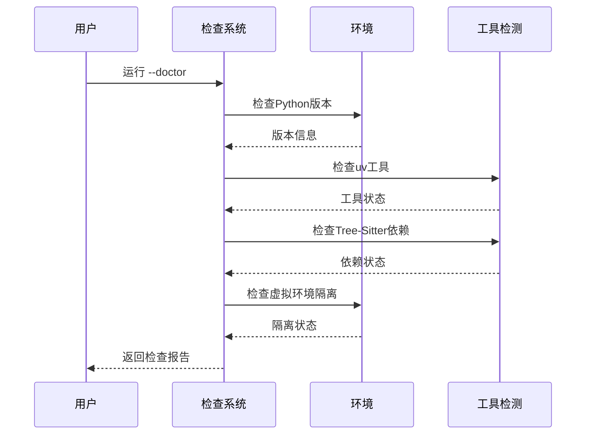

**图表来源**
- [scripts/analyzer/workflow.py:166-257](file://scripts/analyzer/workflow.py#L166-L257)

### 分阶段执行机制

系统支持灵活的分阶段执行模式：

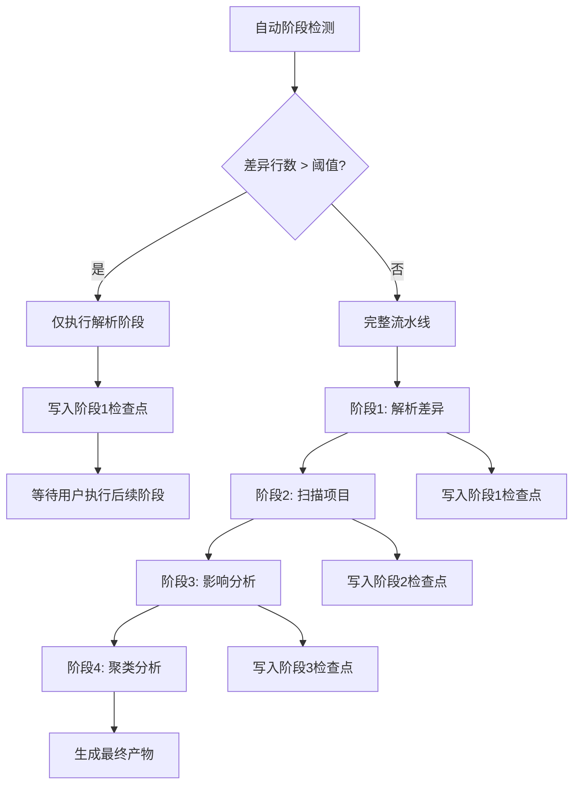

**图表来源**
- [scripts/front_end_impact_analyzer.py:756-762](file://scripts/front_end_impact_analyzer.py#L756-L762)
- [scripts/analyzer/workflow.py:422-524](file://scripts/analyzer/workflow.py#L422-L524)

### 检查点管理系统

每个分析阶段都会生成对应的检查点文件，确保工作流的可恢复性：

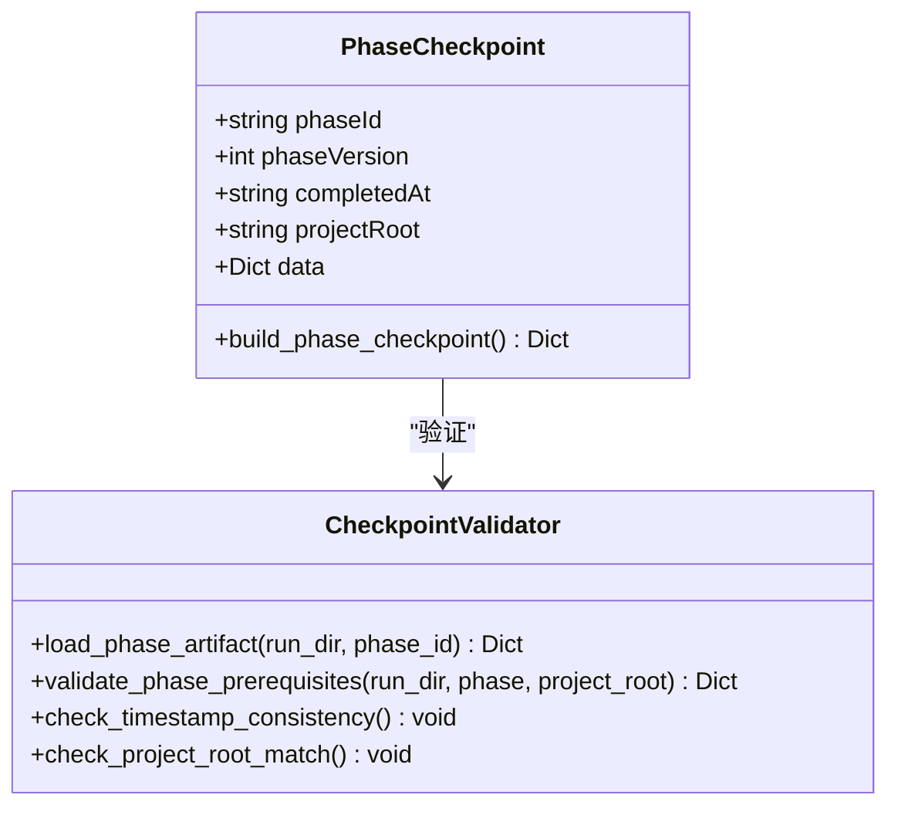

**图表来源**
- [scripts/analyzer/workflow.py:445-505](file://scripts/analyzer/workflow.py#L445-L505)

**章节来源**
- [scripts/analyzer/workflow.py:422-524](file://scripts/analyzer/workflow.py#L422-L524)
- [scripts/front_end_impact_analyzer.py:756-762](file://scripts/front_end_impact_analyzer.py#L756-L762)

### 产物生成和管理

分析完成后生成多种类型的产物文件：

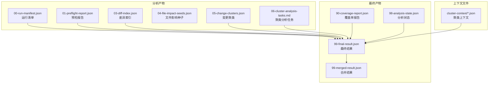

**图表来源**
- [scripts/front_end_impact_analyzer.py:188-218](file://scripts/front_end_impact_analyzer.py#L188-L218)

**章节来源**
- [scripts/front_end_impact_analyzer.py:188-218](file://scripts/front_end_impact_analyzer.py#L188-L218)

## 依赖关系分析

### 外部依赖管理

系统对外部依赖有明确的要求和检测机制：

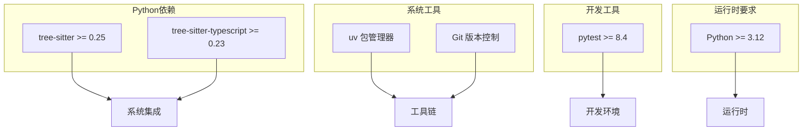

**图表来源**
- [pyproject.toml:6-14](file://pyproject.toml#L6-L14)

### 内部模块依赖

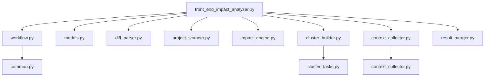

**图表来源**
- [scripts/front_end_impact_analyzer.py:9-34](file://scripts/front_end_impact_analyzer.py#L9-L34)

**章节来源**
- [pyproject.toml:1-20](file://pyproject.toml#L1-L20)
- [scripts/front_end_impact_analyzer.py:9-34](file://scripts/front_end_impact_analyzer.py#L9-L34)

## 性能考虑

### 大规模差异处理

系统针对大规模差异提供了优化策略：

1. **阈值自动分阶段**: 当差异行数超过配置阈值时，自动切换到分阶段执行模式
2. **批处理上下文收集**: 对深度分析的聚类进行批处理，减少I/O开销
3. **状态数据压缩**: 在最终状态文件中移除大型数据结构，只保留必要信息

### 内存优化策略

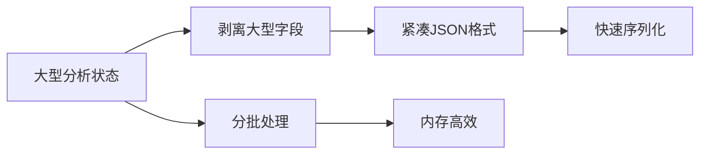

**图表来源**
- [scripts/front_end_impact_analyzer.py:205-217](file://scripts/front_end_impact_analyzer.py#L205-L217)

### 并行处理能力

系统支持多阶段并行执行，在满足依赖关系的前提下最大化利用计算资源。

## 故障排除指南

### 常见问题诊断

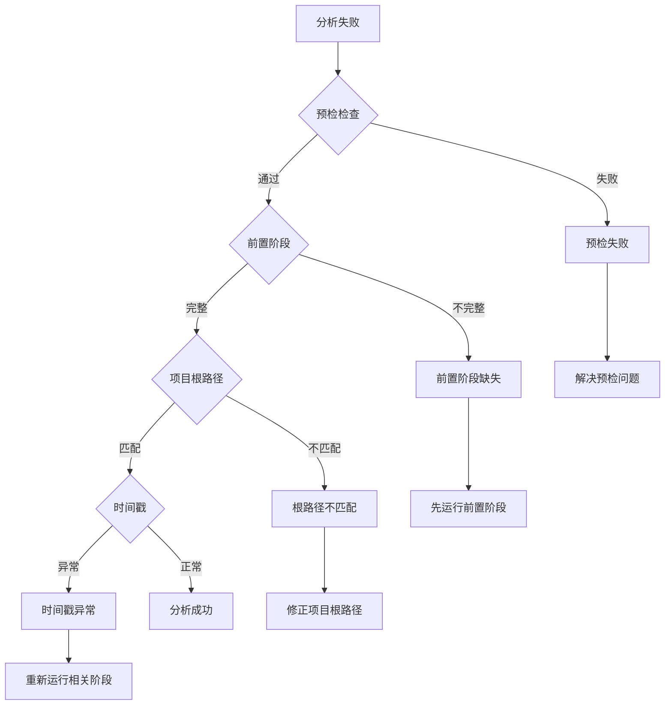

**图表来源**
- [scripts/analyzer/workflow.py:476-505](file://scripts/analyzer/workflow.py#L476-L505)

### 环境配置问题

当遇到环境配置问题时，可以使用`--doctor`选项进行全面检查：

1. **Python版本检查**: 确保使用Python 3.12或更高版本
2. **依赖包检查**: 验证Tree-Sitter相关包是否正确安装
3. **工具链检查**: 确认uv包管理器可用
4. **虚拟环境隔离**: 检测可能的虚拟环境冲突

**章节来源**
- [scripts/analyzer/workflow.py:166-257](file://scripts/analyzer/workflow.py#L166-L257)
- [scripts/analyzer/workflow.py:476-505](file://scripts/analyzer/workflow.py#L476-L505)

## 结论

前端影响分析器的工作流管理系统具有以下特点：

1. **模块化设计**: 清晰的模块分离和职责划分
2. **可扩展性**: 支持自定义配置和扩展点
3. **可靠性**: 完善的检查点机制和错误处理
4. **效率性**: 针对大规模项目的性能优化
5. **可用性**: 友好的命令行接口和智能体集成

该系统为前端变更影响分析提供了一个完整、可靠且高效的解决方案，特别适合在大型React项目中实施持续的质量保证流程。