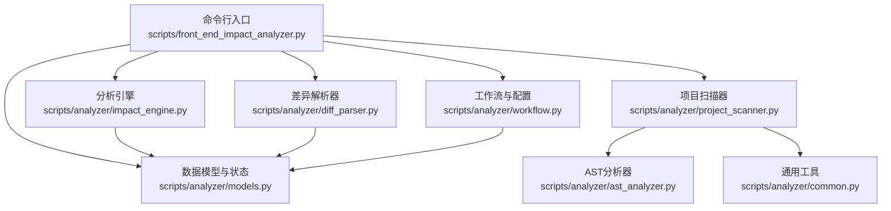
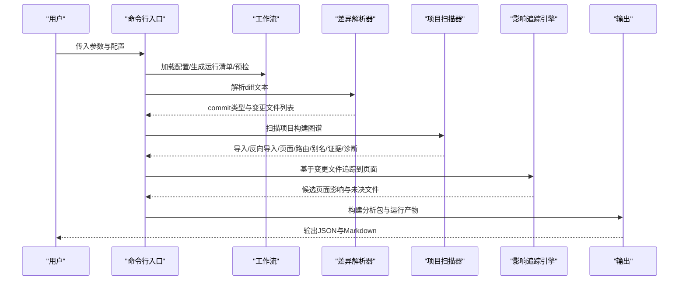
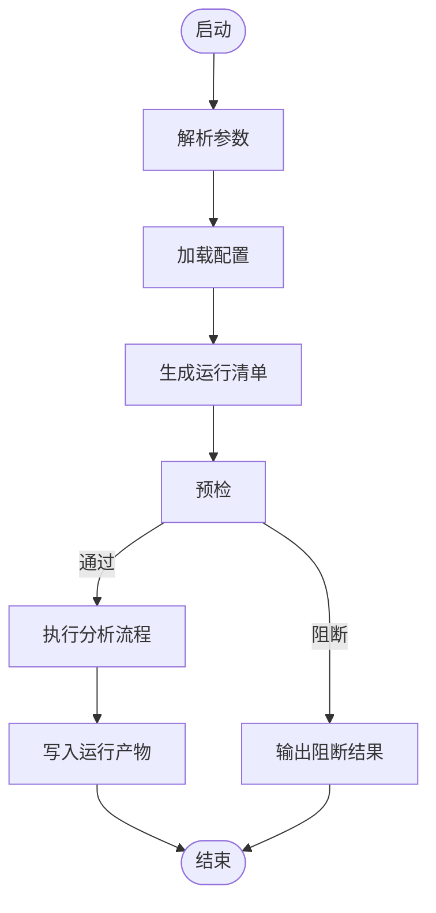
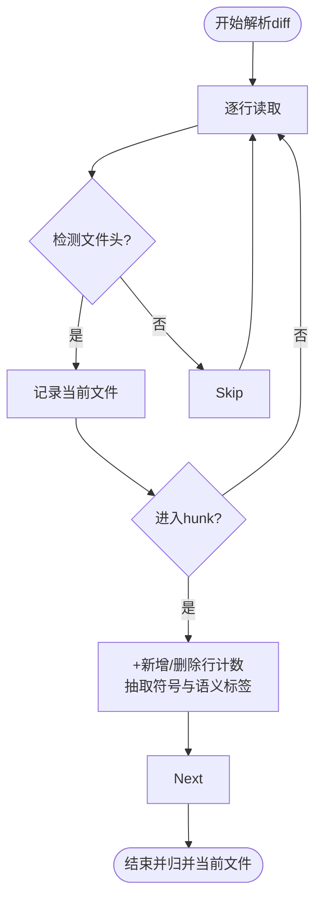
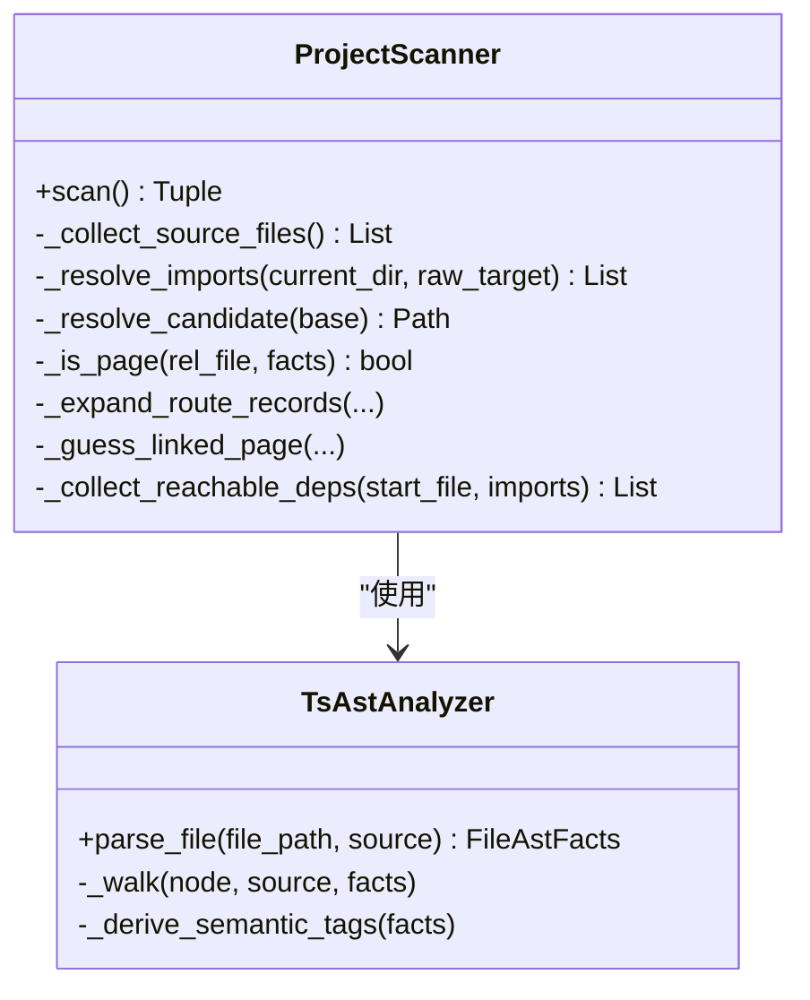
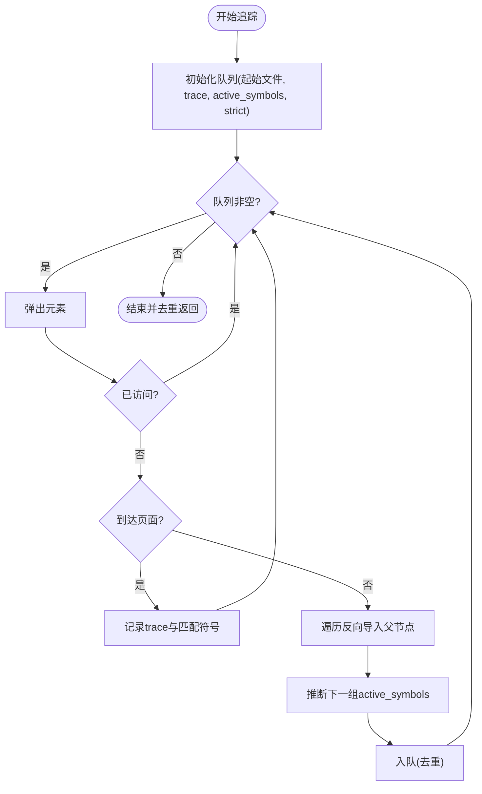
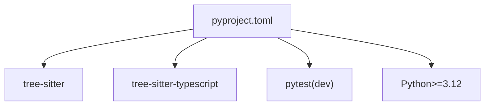

# 开发指南

<cite>
**本文引用的文件**
- [pyproject.toml](file://pyproject.toml)
- [scripts/front_end_impact_analyzer.py](file://scripts/front_end_impact_analyzer.py)
- [scripts/analyzer/workflow.py](file://scripts/analyzer/workflow.py)
- [scripts/analyzer/models.py](file://scripts/analyzer/models.py)
- [scripts/analyzer/common.py](file://scripts/analyzer/common.py)
- [scripts/analyzer/project_scanner.py](file://scripts/analyzer/project_scanner.py)
- [scripts/analyzer/ast_analyzer.py](file://scripts/analyzer/ast_analyzer.py)
- [scripts/analyzer/impact_engine.py](file://scripts/analyzer/impact_engine.py)
- [scripts/analyzer/diff_parser.py](file://scripts/analyzer/diff_parser.py)
- [scripts/analyzer/source_classifier.py](file://scripts/analyzer/source_classifier.py)
- [scripts/analyzer/case_builder.py](file://scripts/analyzer/case_builder.py)
- [tests/conftest.py](file://tests/conftest.py)
- [references/project-conventions.md](file://references/project-conventions.md)
- [references/route-conventions.md](file://references/route-conventions.md)
- [agents/openai.yaml](file://agents/openai.yaml)
</cite>

## 目录
1. [简介](#简介)
2. [项目结构](#项目结构)
3. [核心组件](#核心组件)
4. [架构总览](#架构总览)
5. [详细组件分析](#详细组件分析)
6. [依赖分析](#依赖分析)
7. [性能考虑](#性能考虑)
8. [故障排查指南](#故障排查指南)
9. [结论](#结论)
10. [附录](#附录)

## 简介
本指南面向希望参与“前端影响分析器”项目的开发者，涵盖开发环境搭建、依赖安装与配置、测试策略与套件结构、代码贡献规范、扩展与新增测试用例的方法、调试技巧与常用工具、TODO与未来方向、发布与版本管理等。目标是帮助新贡献者快速上手并高效参与开发。

## 项目结构
该项目采用“脚本驱动 + 分析器模块”的组织方式，核心入口为命令行脚本，分析流程由多个子模块协同完成：解析变更、扫描项目、构建图谱、追踪影响、聚类与上下文收集、输出分析包等。

图表来源
- [scripts/front_end_impact_analyzer.py:23-160](file://scripts/front_end_impact_analyzer.py#L23-L160)
- [scripts/analyzer/workflow.py:15-102](file://scripts/analyzer/workflow.py#L15-L102)
- [scripts/analyzer/project_scanner.py:13-80](file://scripts/analyzer/project_scanner.py#L13-L80)
- [scripts/analyzer/ast_analyzer.py:13-31](file://scripts/analyzer/ast_analyzer.py#L13-L31)
- [scripts/analyzer/impact_engine.py:10-58](file://scripts/analyzer/impact_engine.py#L10-L58)
- [scripts/analyzer/diff_parser.py:11-110](file://scripts/analyzer/diff_parser.py#L11-L110)
- [scripts/analyzer/models.py:116-201](file://scripts/analyzer/models.py#L116-L201)

章节来源
- [pyproject.toml:1-18](file://pyproject.toml#L1-L18)
- [scripts/front_end_impact_analyzer.py:239-403](file://scripts/front_end_impact_analyzer.py#L239-L403)

## 核心组件
- 命令行入口与运行引擎
  - 负责解析参数、加载配置、生成运行清单、预检、执行分析、写入产物与最终结果。
- 工作流与配置
  - 提供默认配置、路径解析、运行目录创建、预检与诊断、Doctor建议等。
- 数据模型与状态
  - 统一承载分析过程中的元数据、输入、中间图谱、候选影响、业务影响、工作流与输出。
- 差异解析器
  - 解析Git diff，提取变更文件、统计增删行数、识别噪声、抽取语义标签与API变更。
- 项目扫描器
  - 基于Tree-sitter解析TS/TSX，构建导入/反向导入、页面、路由、别名、条目导出证据、诊断信息。
- 影响追踪引擎
  - 基于反向导入关系与页面集合进行BFS追踪，结合语义标签与符号推断，生成页面影响。
- AST分析器
  - 抽取导入/导出、组件名、Hook名、JSX标签/属性、路由对象、懒加载、API调用、语义标签等。
- 通用工具
  - 路径规范化、相对路径、去重、模块名推断、别名解析、tsconfig加载与归一化。
- 源文件分类器
  - 将文件归类到页面、路由、API、状态、Hook、共享组件、业务组件、工具、配置/模式等类别。
- 用例构建器（历史）
  - 已标记为弃用，仅保留作为历史参考；最终用例需经Claude聚类分析并合并。

章节来源
- [scripts/front_end_impact_analyzer.py:23-160](file://scripts/front_end_impact_analyzer.py#L23-L160)
- [scripts/analyzer/workflow.py:15-102](file://scripts/analyzer/workflow.py#L15-L102)
- [scripts/analyzer/models.py:116-201](file://scripts/analyzer/models.py#L116-L201)
- [scripts/analyzer/diff_parser.py:11-110](file://scripts/analyzer/diff_parser.py#L11-L110)
- [scripts/analyzer/project_scanner.py:13-80](file://scripts/analyzer/project_scanner.py#L13-L80)
- [scripts/analyzer/impact_engine.py:10-58](file://scripts/analyzer/impact_engine.py#L10-L58)
- [scripts/analyzer/ast_analyzer.py:13-31](file://scripts/analyzer/ast_analyzer.py#L13-L31)
- [scripts/analyzer/common.py:17-151](file://scripts/analyzer/common.py#L17-L151)
- [scripts/analyzer/source_classifier.py:6-36](file://scripts/analyzer/source_classifier.py#L6-L36)
- [scripts/analyzer/case_builder.py:1-7](file://scripts/analyzer/case_builder.py#L1-L7)

## 架构总览
整体流程从命令行入口开始，依次执行差异解析、项目扫描、影响追踪、聚类与上下文构建，最终输出分析包与运行产物。Doctor用于环境健康检查，支持生成推荐命令与阻塞项。

图表来源
- [scripts/front_end_impact_analyzer.py:56-160](file://scripts/front_end_impact_analyzer.py#L56-L160)
- [scripts/analyzer/workflow.py:105-135](file://scripts/analyzer/workflow.py#L105-L135)
- [scripts/analyzer/diff_parser.py:62-110](file://scripts/analyzer/diff_parser.py#L62-L110)
- [scripts/analyzer/project_scanner.py:20-80](file://scripts/analyzer/project_scanner.py#L20-L80)
- [scripts/analyzer/impact_engine.py:26-58](file://scripts/analyzer/impact_engine.py#L26-L58)

## 详细组件分析

### 命令行入口与运行引擎
- 职责
  - 解析参数、加载配置、生成运行清单、预检、执行分析、写入中间产物与最终结果。
  - 支持Doctor、生成默认配置、安装Claude代理模板、合并聚类分析结果等子命令。
- 关键流程
  - 预检通过后，按顺序执行差异解析、项目扫描、影响追踪、聚类与上下文构建、输出分析包。
  - 失败时记录致命错误并输出阻断结果。
- 产物
  - 运行清单、预检报告、文档索引、差异索引、文件影响种子、变更聚类、聚类任务、聚类上下文、覆盖率、分析状态、最终结果等。

图表来源
- [scripts/front_end_impact_analyzer.py:239-403](file://scripts/front_end_impact_analyzer.py#L239-L403)
- [scripts/analyzer/workflow.py:105-135](file://scripts/analyzer/workflow.py#L105-L135)

章节来源
- [scripts/front_end_impact_analyzer.py:239-403](file://scripts/front_end_impact_analyzer.py#L239-L403)

### 工作流与配置
- 默认配置
  - 包含项目名称、分支默认值、源根、路径集合（项目档案、wiki、需求、规格、diff与输出目录）、差异忽略规则、分析参数（最大聚类数、上下文大小限制等）。
- Doctor
  - 检查uv、Python版本、tree-sitter相关依赖、技能根目录、Git工作树，给出推荐命令与阻断建议。
- 预检
  - 检查wiki、需求、规格目录是否存在（可配置是否强制），以及Git工作树状态。
- 运行目录
  - 自动创建输出目录与子目录（聚类上下文与分析）。

章节来源
- [scripts/analyzer/workflow.py:15-102](file://scripts/analyzer/workflow.py#L15-L102)
- [scripts/analyzer/workflow.py:137-189](file://scripts/analyzer/workflow.py#L137-L189)
- [scripts/analyzer/workflow.py:105-135](file://scripts/analyzer/workflow.py#L105-L135)
- [scripts/analyzer/workflow.py:214-219](file://scripts/analyzer/workflow.py#L214-L219)

### 数据模型与状态
- 关键模型
  - AnalysisState：统一承载meta、input、parsedDiff、codeGraph、codeImpact、candidateImpact、businessImpact、workflow、output、processLogs。
  - ProcessRecorder/StateStore：记录步骤日志与写入中间状态。
  - ChangedFile、RouteInfo、FileAstFacts、PageImpact、TestCase：用于描述变更文件、路由信息、AST事实、页面影响与测试用例。
- 设计要点
  - 使用dataclass与字典结构组合，便于序列化与持久化。
  - 通过StateStore集中写入各阶段产出，保证一致性。

章节来源
- [scripts/analyzer/models.py:116-201](file://scripts/analyzer/models.py#L116-L201)

### 差异解析器
- 功能
  - 解析diff头部、新增/删除/修改文件、hunk块，统计新增/删除行数。
  - 提取符号、语义标签、识别格式化变更、噪声过滤、API变更（请求/响应字段、枚举、分页、详情、列表结构）。
- 性能与健壮性
  - 通过正则匹配与去重策略减少重复计算。
  - 对格式化变更进行归一化比较，避免误判为功能性变更。

图表来源
- [scripts/analyzer/diff_parser.py:62-110](file://scripts/analyzer/diff_parser.py#L62-L110)
- [scripts/analyzer/diff_parser.py:143-151](file://scripts/analyzer/diff_parser.py#L143-L151)

章节来源
- [scripts/analyzer/diff_parser.py:11-302](file://scripts/analyzer/diff_parser.py#L11-L302)

### 项目扫描器
- 功能
  - 遍历源码（支持src根或项目根），基于AST抽取导入/导出、组件名、Hook名、JSX标签/属性、路由对象、懒加载、API调用、语义标签。
  - 解析别名（tsconfig路径别名、@/等），解析barrel导出证据，识别页面与路由绑定。
- 路由解析
  - 支持对象数组、懒加载、嵌套子路由、注释标题、显示名来源等。
- 诊断
  - 记录无法解析的导入、未绑定路由等。

图表来源
- [scripts/analyzer/project_scanner.py:13-80](file://scripts/analyzer/project_scanner.py#L13-L80)
- [scripts/analyzer/ast_analyzer.py:13-31](file://scripts/analyzer/ast_analyzer.py#L13-L31)

章节来源
- [scripts/analyzer/project_scanner.py:13-383](file://scripts/analyzer/project_scanner.py#L13-L383)
- [scripts/analyzer/ast_analyzer.py:13-242](file://scripts/analyzer/ast_analyzer.py#L13-L242)

### 影响追踪引擎
- 功能
  - 基于反向导入关系与页面集合进行BFS搜索，推断符号传递与严格/宽松模式，生成页面影响列表。
  - 结合语义标签与文件类型确定影响类型与置信度。
- 关键逻辑
  - 符号传递：根据import/reexport绑定与标识符出现次数决定是否传递符号。
  - 路由映射：将页面映射到路由路径，用于用例与报告描述。

图表来源
- [scripts/analyzer/impact_engine.py:77-105](file://scripts/analyzer/impact_engine.py#L77-L105)
- [scripts/analyzer/impact_engine.py:119-162](file://scripts/analyzer/impact_engine.py#L119-L162)

章节来源
- [scripts/analyzer/impact_engine.py:10-188](file://scripts/analyzer/impact_engine.py#L10-L188)

### 通用工具与别名解析
- 路径与模块名
  - 规范化路径、相对路径、去重、模块名推断（忽略src/pages/views等目录与文件扩展名）。
- 别名解析
  - 递归加载tsconfig，支持extends、baseUrl、paths、通配符，将别名转换为真实路径候选。
- 安全读取
  - 处理编码异常与IO异常，避免中断。

章节来源
- [scripts/analyzer/common.py:17-151](file://scripts/analyzer/common.py#L17-L151)

### 源文件分类器
- 功能
  - 基于路径与文件名后缀将文件归类到页面、路由、API、状态、Hook、共享组件、业务组件、工具、配置/模式等。
  - 提供模块名猜测。

章节来源
- [scripts/analyzer/source_classifier.py:6-36](file://scripts/analyzer/source_classifier.py#L6-L36)

### 用例构建器（历史）
- 状态
  - 已标记为弃用，不再直接生成模板用例；最终用例需经Claude聚类分析并合并。
- 作用
  - 保留作为历史参考，便于理解用例生成思路与优先级排序。

章节来源
- [scripts/analyzer/case_builder.py:1-7](file://scripts/analyzer/case_builder.py#L1-L7)

## 依赖分析
- 运行时依赖
  - tree-sitter与tree-sitter-typescript用于TS/TSX解析。
- 开发依赖
  - pytest用于测试。
- Python版本
  - 要求Python 3.12及以上。

图表来源
- [pyproject.toml:6-14](file://pyproject.toml#L6-L14)

章节来源
- [pyproject.toml:1-18](file://pyproject.toml#L1-L18)

## 性能考虑
- AST解析
  - Tree-sitter解析器按文件粒度执行，避免重复解析；AST事实在内存中复用。
- 图构建
  - 导入/反向导入、页面、路由、别名、barrel证据均以字典/列表形式存储，便于快速查找。
- 追踪算法
  - BFS搜索配合访问集去重，严格/宽松符号传递减少无效传播。
- I/O与缓存
  - Doctor与预检减少不必要的外部调用；运行目录结构化输出便于增量分析与调试。

[本节为通用指导，不直接分析具体文件]

## 故障排查指南
- Doctor检查
  - 检查uv、Python版本、tree-sitter依赖、技能根目录、Git工作树；根据阻断项给出推荐命令。
- 阻断场景
  - 预检发现wiki/需求/规格目录缺失且要求存在时，输出阻断结果并列出修复动作。
- 常见问题
  - 未安装uv或未使用uv运行：Doctor会提示使用uv run并指定技能根目录。
  - Python版本过低：提示使用Python 3.12或更高。
  - tree-sitter相关依赖未就绪：提示使用uv sync或uv run确保依赖可用。
  - 项目根非Git工作树：提示设置正确的--project-root。

章节来源
- [scripts/analyzer/workflow.py:137-189](file://scripts/analyzer/workflow.py#L137-L189)
- [scripts/analyzer/workflow.py:313-325](file://scripts/analyzer/workflow.py#L313-L325)
- [scripts/front_end_impact_analyzer.py:314-359](file://scripts/front_end_impact_analyzer.py#L314-L359)

## 结论
本项目通过清晰的模块划分与稳健的工作流，实现了从Git diff到页面影响的自动化追踪，并提供了可扩展的聚类与上下文收集机制。遵循本文档的开发与贡献流程，可确保高质量地迭代与维护该分析器。

[本节为总结，不直接分析具体文件]

## 附录

### A. 开发环境搭建与依赖安装
- Python版本
  - 使用Python 3.12或更高版本。
- 依赖安装
  - 推荐使用uv管理依赖与运行环境，确保tree-sitter与tree-sitter-typescript可用。
- 配置文件
  - 可通过命令生成默认配置文件，或在项目根目录提供自定义配置覆盖默认项。

章节来源
- [pyproject.toml:5-9](file://pyproject.toml#L5-L9)
- [scripts/analyzer/workflow.py:74-77](file://scripts/analyzer/workflow.py#L74-L77)

### B. 测试策略与测试套件结构
- 测试组织
  - tests目录下包含针对各分析器模块的单元测试与集成测试样例。
- 入口配置
  - tests/conftest.py将scripts目录加入sys.path，便于pytest导入内部模块。
- 建议
  - 为新增模块补充单元测试；对关键流程（如diff解析、项目扫描、影响追踪）编写集成测试，覆盖边界与异常路径。

章节来源
- [tests/conftest.py:1-12](file://tests/conftest.py#L1-L12)

### C. 代码贡献指南
- 编码规范
  - 使用Python 3.12+语法与类型注解；模块内保持高内聚、低耦合；公共函数与类提供清晰的职责边界。
- 提交规范
  - 变更应附带测试用例；对关键流程增加注释与文档片段路径引用。
- Pull Request流程
  - 在本地通过测试与Doctor检查；在PR中说明变更动机、影响范围与测试覆盖情况。

[本节为通用指导，不直接分析具体文件]

### D. 如何添加新的测试用例与扩展现有功能
- 新增测试用例
  - 在tests目录下新增测试文件，参考现有测试风格；使用fixtures目录提供的样本应用与diff样例。
- 扩展功能
  - 在scripts/analyzer下新增模块时，遵循现有数据模型与状态写入方式；在命令行入口中注册新步骤或开关。
- 文档与示例
  - 在references目录补充项目约定与路由约定说明，便于后续维护与扩展。

章节来源
- [references/project-conventions.md:1-20](file://references/project-conventions.md#L1-L20)
- [references/route-conventions.md:1-11](file://references/route-conventions.md#L1-L11)

### E. 调试技巧与开发工具
- Doctor
  - 使用--doctor检查环境依赖与命令建议，快速定位问题。
- 运行产物
  - 分析过程中生成的中间产物（diff索引、文件影响种子、变更聚类、聚类上下文、覆盖率、分析状态等）可用于离线调试与复盘。
- 常用命令
  - 使用uv run --project <skill_root> python <script>运行分析器，确保依赖可用。

章节来源
- [scripts/analyzer/workflow.py:137-189](file://scripts/analyzer/workflow.py#L137-L189)
- [scripts/front_end_impact_analyzer.py:280-296](file://scripts/front_end_impact_analyzer.py#L280-L296)

### F. TODO与未来发展方向
- TODO
  - 仓库中存在TODO.md文件（未在当前目录树中），建议在项目根目录补充并维护该文件，明确短期与长期目标。
- 未来方向
  - 增强对复杂别名与多层tsconfig继承的支持。
  - 扩展对更多前端框架与路由生态的兼容性。
  - 优化聚类与上下文收集策略，提升大规模项目的分析效率与准确性。

[本节为概念性内容，不直接分析具体文件]

### G. 发布流程与版本管理
- 版本
  - 当前版本在pyproject.toml中声明，建议遵循语义化版本控制。
- 发布建议
  - 在发布前确保Doctor检查通过、测试全部通过、变更日志更新；在CI中执行端到端验证。

章节来源
- [pyproject.toml:3](file://pyproject.toml#L3)

### H. 项目约定与路由约定
- 项目约定
  - 推荐假设：源码位于src/，页面常见于src/pages或src/views；支持相对导入、@/导入、tsconfig路径别名与barrel导出。
  - 一般化规则：优先提取可复用模式而非硬编码规则；将特定项目路径与命名习惯作为补充启发式。
- 路由约定
  - 支持路由对象数组、懒加载路由、嵌套子路由、路由与页面绑定（直接导入、懒导入、组件名匹配）。

章节来源
- [references/project-conventions.md:3-19](file://references/project-conventions.md#L3-L19)
- [references/route-conventions.md:3-11](file://references/route-conventions.md#L3-L11)

### I. 代理与接口配置
- OpenAI代理接口显示名
  - agents/openai.yaml中定义了接口显示名为“Frontend Impact Analyzer”。

章节来源
- [agents/openai.yaml:1-3](file://agents/openai.yaml#L1-L3)