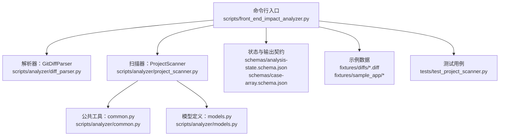
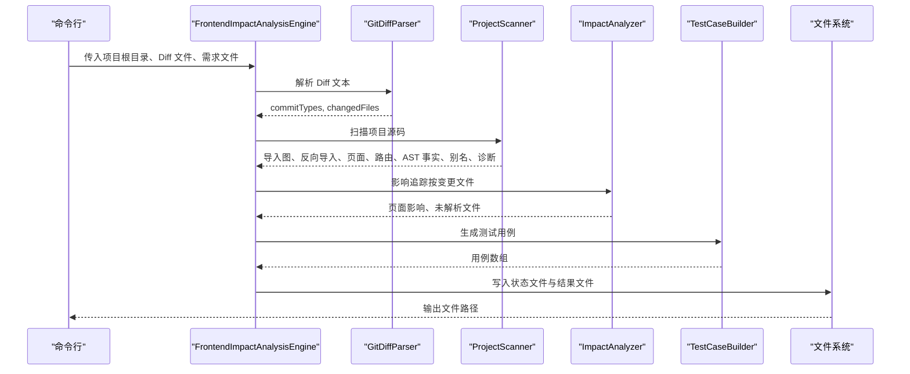
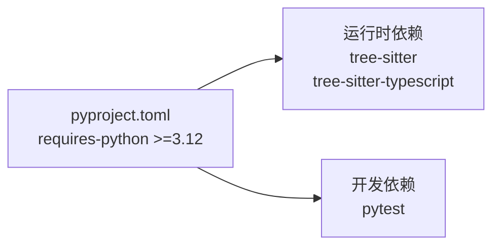

# 快速开始

<cite>
**本文引用的文件**
- [pyproject.toml](file://pyproject.toml)
- [front_end_impact_analyzer.py](file://scripts/front_end_impact_analyzer.py)
- [models.py](file://scripts/analyzer/models.py)
- [diff_parser.py](file://scripts/analyzer/diff_parser.py)
- [project_scanner.py](file://scripts/analyzer/project_scanner.py)
- [common.py](file://scripts/analyzer/common.py)
- [analysis-state.schema.json](file://schemas/analysis-state.schema.json)
- [case-array.schema.json](file://schemas/case-array.schema.json)
- [shared_search_form.diff](file://fixtures/diffs/shared_search_form.diff)
- [SearchForm.tsx](file://fixtures/sample_app/src/components/shared/SearchForm.tsx)
- [UserListPage.tsx](file://fixtures/sample_app/src/pages/users/UserListPage.tsx)
- [test_project_scanner.py](file://tests/test_project_scanner.py)
</cite>

## 目录
1. [简介](#简介)
2. [项目结构](#项目结构)
3. [核心组件](#核心组件)
4. [架构总览](#架构总览)
5. [详细组件分析](#详细组件分析)
6. [依赖分析](#依赖分析)
7. [性能考虑](#性能考虑)
8. [故障排除指南](#故障排除指南)
9. [结论](#结论)
10. [附录](#附录)

## 简介
本指南面向初学者与一线开发者，帮助你在本地快速完成“前端影响分析器”的安装、配置与首次运行。你将学到：
- 环境要求（Python 3.12+）
- 安装步骤与基础配置
- 命令行参数详解（必需与可选）
- 如何准备 Git Diff 文件与项目根目录
- 从安装到输出结果的完整示例流程
- 常见问题与排障建议

## 项目结构
该仓库采用脚本驱动的命令行工具形式，核心入口位于 scripts/front_end_impact_analyzer.py；分析逻辑分布在 scripts/analyzer 子模块中；JSON Schema 定义了状态与输出契约；fixtures 提供示例项目与 Diff；tests 验证扫描与路由绑定等行为。

图表来源
- [front_end_impact_analyzer.py:111-157](file://scripts/front_end_impact_analyzer.py#L111-L157)
- [diff_parser.py:10-126](file://scripts/analyzer/diff_parser.py#L10-L126)
- [project_scanner.py:13-80](file://scripts/analyzer/project_scanner.py#L13-L80)
- [common.py:1-151](file://scripts/analyzer/common.py#L1-L151)
- [models.py:18-173](file://scripts/analyzer/models.py#L18-L173)
- [analysis-state.schema.json:1-46](file://schemas/analysis-state.schema.json#L1-L46)
- [case-array.schema.json:1-51](file://schemas/case-array.schema.json#L1-L51)

章节来源
- [front_end_impact_analyzer.py:1-157](file://scripts/front_end_impact_analyzer.py#L1-L157)
- [pyproject.toml:1-18](file://pyproject.toml#L1-L18)

## 核心组件
- 命令行引擎：负责解析参数、读取 Diff 与需求文本、驱动分析流程、写入状态与结果文件。
- 解析器：将 Git Diff 文本解析为变更文件列表与语义标签，识别格式化改动与 API 字段变化。
- 扫描器：遍历项目源码，构建导入图、反向导入、页面集合、路由信息、AST 派生事实与别名映射。
- 公共工具：路径规范化、别名解析、TSConfig 路径解析、去重与标题化等。
- 数据模型：统一的状态结构、过程日志、变更文件、页面影响、测试用例等。
- Schema：定义分析状态与输出用例数组的 JSON 结构契约。

章节来源
- [front_end_impact_analyzer.py:18-109](file://scripts/front_end_impact_analyzer.py#L18-L109)
- [diff_parser.py:10-126](file://scripts/analyzer/diff_parser.py#L10-L126)
- [project_scanner.py:13-80](file://scripts/analyzer/project_scanner.py#L13-L80)
- [common.py:1-151](file://scripts/analyzer/common.py#L1-L151)
- [models.py:18-173](file://scripts/analyzer/models.py#L18-L173)
- [analysis-state.schema.json:1-46](file://schemas/analysis-state.schema.json#L1-L46)
- [case-array.schema.json:1-51](file://schemas/case-array.schema.json#L1-L51)

## 架构总览
下图展示了从命令行到最终输出的关键调用序列，涵盖 Diff 解析、项目扫描、影响追踪、用例生成与状态落盘。

图表来源
- [front_end_impact_analyzer.py:40-99](file://scripts/front_end_impact_analyzer.py#L40-L99)
- [diff_parser.py:60-126](file://scripts/analyzer/diff_parser.py#L60-L126)
- [project_scanner.py:20-80](file://scripts/analyzer/project_scanner.py#L20-L80)

## 详细组件分析

### 命令行与运行流程
- 参数说明
  - --project-root：必填，项目根目录路径（绝对或相对均可）。
  - --diff-file：必填，Git Diff 文件路径。
  - --requirement-file：可选，需求说明文件路径（用于业务影响维度的输入）。
  - --state-output：可选，分析状态输出文件名，默认 impact-analysis-state.json。
  - --result-output：可选，分析结果输出文件名，默认 impact-analysis-result.json。
- 运行时行为
  - 读取 Diff 与需求文本（UTF-8，无法解码则忽略错误字符）。
  - 初始化 AnalysisState、ProcessRecorder、StateStore。
  - 依次执行：解析 Diff → 分类变更文件 → 扫描项目 → 影响分析 → 用例构建 → 写入输出。
  - 异常时记录致命错误并设置状态为失败。

章节来源
- [front_end_impact_analyzer.py:111-157](file://scripts/front_end_impact_analyzer.py#L111-L157)
- [models.py:111-173](file://scripts/analyzer/models.py#L111-L173)

### Diff 解析器
- 功能要点
  - 提取提交类型（如 feat/fix/refactor 等）。
  - 识别新增/删除/修改文件。
  - 在 hunk 区域内统计新增/删除行数。
  - 提取符号（函数/类/组件）与语义标签（按钮、表单、路由、权限、API、状态、导航、校验、分页查询、提交、列、详情、加载、禁用态、导出等）。
  - 判断是否仅格式化改动（不提取符号与语义标签）。
  - 对 API/服务相关文件或强 API 信号行进行字段级变更分析（请求/响应字段增删改、枚举变化），并生成语义标签。
- 性能与健壮性
  - 使用正则匹配与预编译，避免重复开销。
  - 对空内容与格式化差异做短路处理。

章节来源
- [diff_parser.py:10-126](file://scripts/analyzer/diff_parser.py#L10-L126)
- [diff_parser.py:128-200](file://scripts/analyzer/diff_parser.py#L128-L200)

### 项目扫描器
- 功能要点
  - 收集源文件（支持 .ts/.tsx/.js/.jsx），忽略常见目录（如 node_modules、.git 等）。
  - 解析 TS/JS 文件的 AST 事实（导入、绑定、再导出、导出、组件名、Hook、JSX 标签与属性、路由路径/组件、懒加载、API 调用、标识符计数等）。
  - 解析 tsconfig 路径别名，支持 extends 与多目标别名。
  - 构建导入图与反向导入，识别页面（在 pages/views 目录且含组件/JSX 的文件）。
  - 提取路由记录并尝试绑定到页面（支持懒加载与组件名推断），无法绑定时记录诊断。
  - 收集 barrel 文件与证据。
- 错误与诊断
  - 未解析导入、未绑定路由等诊断项会被记录，便于后续排查。

章节来源
- [project_scanner.py:13-80](file://scripts/analyzer/project_scanner.py#L13-L80)
- [project_scanner.py:82-200](file://scripts/analyzer/project_scanner.py#L82-L200)
- [common.py:74-151](file://scripts/analyzer/common.py#L74-L151)

### 影响分析与用例构建
- 影响分析
  - 基于导入图与路由信息，从每个变更文件向上追踪至页面，生成 PageImpact。
  - 统计受影响模块、页面与函数，汇总共享风险（如共享组件变更可能影响多个页面）。
- 用例构建
  - 将页面影响转换为测试用例，包含页面名、用例名、测试步骤、预期结果、用例等级、可置信度与来源描述。
- 状态与输出
  - AnalysisState 记录元信息、输入、解析后的 Diff、代码图、影响、业务影响、输出用例与过程日志。
  - 状态文件与结果文件均以 UTF-8 写出，便于后续校验与集成。

章节来源
- [front_end_impact_analyzer.py:40-99](file://scripts/front_end_impact_analyzer.py#L40-L99)
- [models.py:72-108](file://scripts/analyzer/models.py#L72-L108)
- [analysis-state.schema.json:1-46](file://schemas/analysis-state.schema.json#L1-L46)
- [case-array.schema.json:1-51](file://schemas/case-array.schema.json#L1-L51)

## 依赖分析
- Python 版本要求：>=3.12
- 关键依赖：tree-sitter、tree-sitter-typescript
- 开发依赖：pytest（用于测试）

图表来源
- [pyproject.toml:1-18](file://pyproject.toml#L1-L18)

章节来源
- [pyproject.toml:1-18](file://pyproject.toml#L1-L18)

## 性能考虑
- 大型项目扫描
  - 仅扫描 .ts/.tsx/.js/.jsx 源文件，忽略 node_modules、.git 等目录，减少 IO。
  - AST 解析与导入解析采用一次遍历，避免重复计算。
- 正则与字符串处理
  - 预编译正则表达式，减少运行时开销。
  - 对格式化差异进行快速判断，跳过符号与语义标签提取。
- I/O 与编码
  - 统一使用 UTF-8 读取，遇到编码错误时忽略并继续，保证稳定性。

章节来源
- [project_scanner.py:82-91](file://scripts/analyzer/project_scanner.py#L82-L91)
- [diff_parser.py:141-148](file://scripts/analyzer/diff_parser.py#L141-L148)
- [common.py:28-34](file://scripts/analyzer/common.py#L28-L34)

## 故障排除指南
- Python 版本不满足
  - 症状：安装或运行时报版本不兼容。
  - 处理：升级 Python 至 3.12 或更高版本。
- 缺少依赖
  - 症状：运行时报缺失 tree-sitter 或 tree-sitter-typescript。
  - 处理：通过包管理器安装依赖，确保版本符合 pyproject.toml 中的范围约束。
- Diff 文件为空或格式异常
  - 症状：解析后 changedFiles 为空，或部分文件未被识别。
  - 处理：确认 diff 文件包含标准 diff 标识与 hunk 行；必要时重新生成 diff。
- 项目根目录不正确
  - 症状：扫描不到页面、路由或导入关系异常。
  - 处理：确保 --project-root 指向包含 src 或根目录的正确路径；检查 tsconfig 路径别名配置。
- 未解析导入/未绑定路由
  - 症状：状态文件中的 diagnostics 包含 unresolved-import 或 unbound-route。
  - 处理：检查别名映射、相对路径拼接与实际文件存在性；确认路由组件与页面绑定逻辑。
- 输出文件未生成或内容为空
  - 症状：state-output 或 result-output 不存在或为空。
  - 处理：确认命令行参数正确；查看控制台输出的写入路径；检查异常分支是否触发（状态为 failed 时会写入致命错误）。

章节来源
- [front_end_impact_analyzer.py:125-152](file://scripts/front_end_impact_analyzer.py#L125-L152)
- [project_scanner.py:44-50](file://scripts/analyzer/project_scanner.py#L44-L50)
- [project_scanner.py:193-199](file://scripts/analyzer/project_scanner.py#L193-L199)

## 结论
通过本指南，你已掌握环境准备、安装配置、命令行使用与输出解读。建议在首次运行前准备好规范的 Git Diff 与项目根目录，并参考附录中的示例与测试用例加深理解。若遇到问题，优先检查 Python 版本、依赖安装与路径配置。

## 附录

### 环境要求与安装步骤
- 环境要求
  - Python：3.12 及以上
  - 依赖：tree-sitter、tree-sitter-typescript
- 安装步骤（通用）
  - 准备虚拟环境并激活。
  - 安装项目依赖（根据你的包管理器选择安装 tree-sitter 与 tree-sitter-typescript）。
  - 确认 Python 版本满足要求。
- 基础配置
  - 确保项目根目录包含 src 或可被扫描的源文件。
  - 若使用 TypeScript 别名，请确保 tsconfig.json 配置正确，以便扫描器解析别名。

章节来源
- [pyproject.toml:5-9](file://pyproject.toml#L5-L9)
- [common.py:74-96](file://scripts/analyzer/common.py#L74-L96)

### 准备 Git Diff 文件与项目根目录
- Git Diff 文件
  - 使用 git diff > my.patch 生成标准 diff 文件。
  - 示例 diff 文件可参考 fixtures/diffs 下的样例。
- 项目根目录
  - 选择包含 src 或根目录的路径作为 --project-root。
  - 示例项目可参考 fixtures/sample_app。

章节来源
- [shared_search_form.diff:1-14](file://fixtures/diffs/shared_search_form.diff#L1-L14)
- [SearchForm.tsx:1-8](file://fixtures/sample_app/src/components/shared/SearchForm.tsx#L1-L8)
- [UserListPage.tsx:1-14](file://fixtures/sample_app/src/pages/users/UserListPage.tsx#L1-L14)

### 命令行使用示例
- 基本用法
  - 假设你已在当前目录准备了 my.patch 与项目根目录。
  - 执行命令：python scripts/front_end_impact_analyzer.py --project-root /path/to/project --diff-file ./my.patch
- 输出文件
  - 默认输出：impact-analysis-state.json 与 impact-analysis-result.json。
  - 可通过 --state-output 与 --result-output 自定义输出文件名。
- 参数对照
  - --project-root：必填，项目根目录。
  - --diff-file：必填，Diff 文件路径。
  - --requirement-file：可选，需求说明文件路径。
  - --state-output：可选，状态文件输出路径。
  - --result-output：可选，结果文件输出路径。

章节来源
- [front_end_impact_analyzer.py:111-157](file://scripts/front_end_impact_analyzer.py#L111-L157)

### 第一个分析运行的完整示例
- 步骤概览
  - 准备项目根目录与 Git Diff 文件。
  - 运行命令行工具，等待分析完成。
  - 查看状态文件与结果文件。
- 依据示例
  - 使用 fixtures/sample_app 作为项目根目录。
  - 使用 fixtures/diffs/shared_search_form.diff 作为 Diff 文件。
  - 参考测试用例验证扫描与路由绑定行为。

章节来源
- [test_project_scanner.py:8-27](file://tests/test_project_scanner.py#L8-L27)
- [SearchForm.tsx:1-8](file://fixtures/sample_app/src/components/shared/SearchForm.tsx#L1-L8)
- [UserListPage.tsx:1-14](file://fixtures/sample_app/src/pages/users/UserListPage.tsx#L1-L14)
- [shared_search_form.diff:1-14](file://fixtures/diffs/shared_search_form.diff#L1-L14)

### JSON Schema 与输出契约
- 分析状态契约
  - 定义 meta、input、parsedDiff、codeGraph、codeImpact、businessImpact、output、processLogs 等字段。
- 用例数组契约
  - 定义页面名、用例名称、测试步骤、预期结果、用例等级、可置信度、来源描述等字段。

章节来源
- [analysis-state.schema.json:1-46](file://schemas/analysis-state.schema.json#L1-L46)
- [case-array.schema.json:1-51](file://schemas/case-array.schema.json#L1-L51)