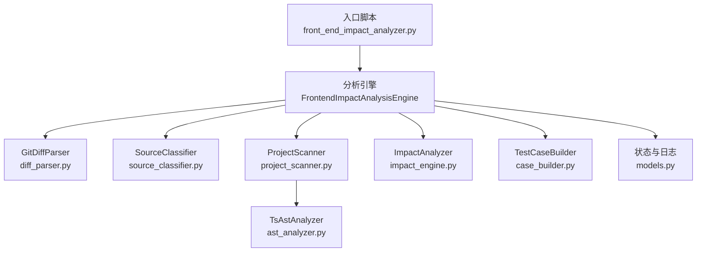
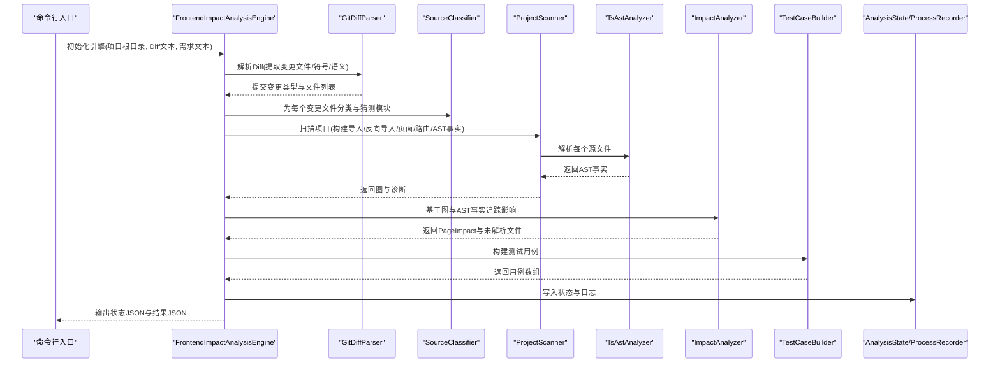
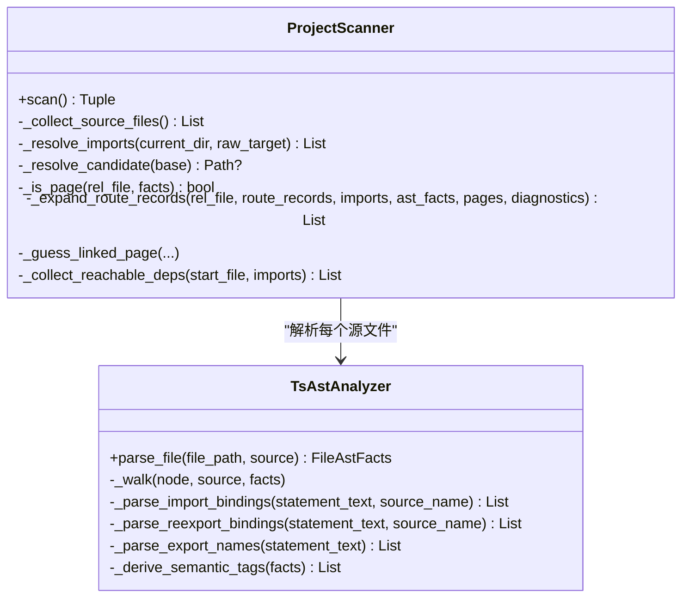
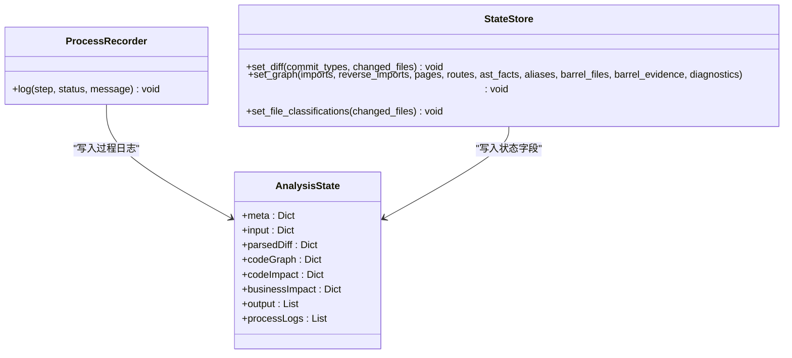
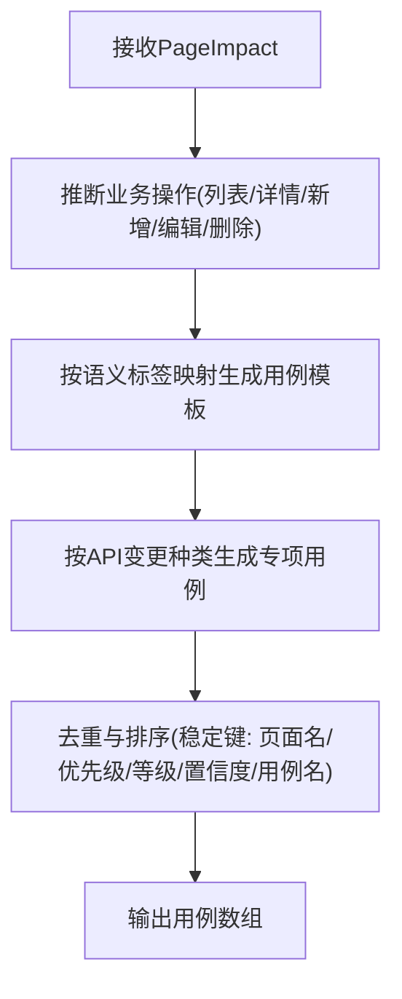
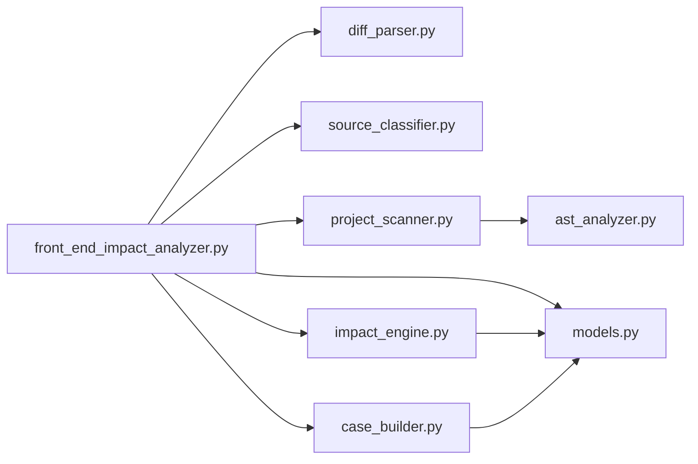
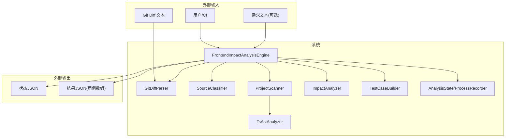
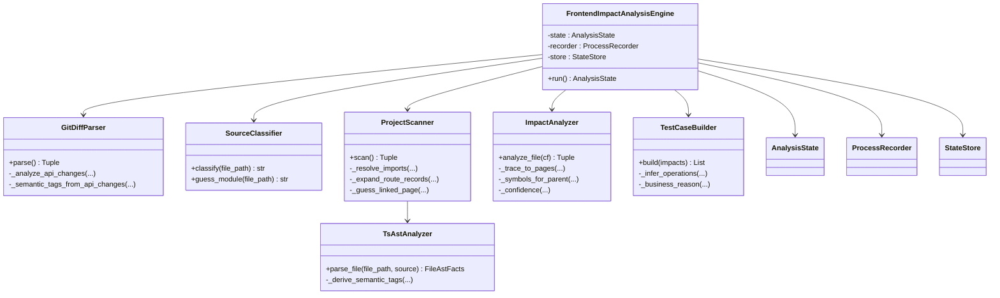

# 技术架构

<cite>
**本文引用的文件**
- [scripts/front_end_impact_analyzer.py](file://scripts/front_end_impact_analyzer.py)
- [scripts/analyzer/impact_engine.py](file://scripts/analyzer/impact_engine.py)
- [scripts/analyzer/project_scanner.py](file://scripts/analyzer/project_scanner.py)
- [scripts/analyzer/diff_parser.py](file://scripts/analyzer/diff_parser.py)
- [scripts/analyzer/ast_analyzer.py](file://scripts/analyzer/ast_analyzer.py)
- [scripts/analyzer/source_classifier.py](file://scripts/analyzer/source_classifier.py)
- [scripts/analyzer/case_builder.py](file://scripts/analyzer/case_builder.py)
- [scripts/analyzer/models.py](file://scripts/analyzer/models.py)
- [pyproject.toml](file://pyproject.toml)
- [schemas/analysis-state.schema.json](file://schemas/analysis-state.schema.json)
- [references/impact-rules.md](file://references/impact-rules.md)
- [references/project-conventions.md](file://references/project-conventions.md)
- [tests/test_impact_engine.py](file://tests/test_impact_engine.py)
</cite>

## 目录
1. [引言](#引言)
2. [项目结构](#项目结构)
3. [核心组件](#核心组件)
4. [架构总览](#架构总览)
5. [详细组件分析](#详细组件分析)
6. [依赖关系分析](#依赖关系分析)
7. [性能考量](#性能考量)
8. [故障排查指南](#故障排查指南)
9. [结论](#结论)
10. [附录](#附录)

## 引言
本技术架构文档面向前端影响分析器（Frontend Impact Analyzer），聚焦于从输入 Git Diff 到最终输出测试用例的完整数据流与控制流。系统采用分层架构、管道模式与事件驱动模式相结合的设计：引擎层负责编排与状态管理，解析层负责语义抽取与分类，扫描层负责项目级图构建，分析层负责影响追踪与置信度评估，生成层负责测试用例构建与去重排序。文档还阐述了状态管理模式与 ProcessRecorder 的作用，系统边界与集成方式，以及性能、可扩展性与可维护性的权衡与约束。

## 项目结构
系统以“脚本入口 + 分析器子模块”的组织方式呈现，核心位于 scripts/analyzer 下，入口脚本负责组装与调度。项目遵循功能域划分：diff 解析、AST 抽取、项目扫描、影响分析、用例构建、状态与日志记录等模块职责清晰，便于独立演进与测试。

图表来源
- [scripts/front_end_impact_analyzer.py:18-100](file://scripts/front_end_impact_analyzer.py#L18-L100)
- [scripts/analyzer/diff_parser.py:10-126](file://scripts/analyzer/diff_parser.py#L10-L126)
- [scripts/analyzer/source_classifier.py:6-36](file://scripts/analyzer/source_classifier.py#L6-L36)
- [scripts/analyzer/project_scanner.py:13-80](file://scripts/analyzer/project_scanner.py#L13-L80)
- [scripts/analyzer/impact_engine.py:10-188](file://scripts/analyzer/impact_engine.py#L10-L188)
- [scripts/analyzer/case_builder.py:10-223](file://scripts/analyzer/case_builder.py#L10-L223)
- [scripts/analyzer/models.py:141-173](file://scripts/analyzer/models.py#L141-L173)
- [scripts/analyzer/ast_analyzer.py:13-30](file://scripts/analyzer/ast_analyzer.py#L13-L30)

章节来源
- [scripts/front_end_impact_analyzer.py:18-100](file://scripts/front_end_impact_analyzer.py#L18-L100)
- [pyproject.toml:1-18](file://pyproject.toml#L1-L18)

## 核心组件
- 前端影响分析引擎（FrontendImpactAnalysisEngine）
  - 负责整体流程编排、状态初始化与持久化、过程日志记录、错误兜底与状态汇总。
- 影响分析器（ImpactAnalyzer）
  - 基于反向依赖图与页面集合进行广度优先追踪，结合语义标签与符号匹配计算置信度与影响原因。
- 项目扫描器（ProjectScanner）
  - 扫描源码目录，构建导入/反向导入图、页面集合、路由信息、AST 事实、别名与桶导出证据，并产出诊断信息。
- Git Diff 解析器（GitDiffParser）
  - 解析变更文件、统计新增/删除行数、提取符号与语义标签、识别格式化变更与 API 字段变更。
- AST 分析器（TsAstAnalyzer）
  - 使用 Tree-sitter 解析 TS/TSX，抽取导入/导出、组件名、Hook 名、JSX 标签与属性、路由定义、懒加载、API 调用等。
- 源码分类器（SourceClassifier）
  - 基于路径与文件名推断文件类型与模块名，用于影响分析与用例生成。
- 测试用例构建器（TestCaseBuilder）
  - 基于 PageImpact 与语义标签、API 变更推断业务操作，生成多类测试用例并去重排序。
- 状态与日志（AnalysisState、ProcessRecorder、StateStore）
  - 统一的状态载体与过程日志记录器，支持 JSON Schema 对外契约与状态持久化。

章节来源
- [scripts/front_end_impact_analyzer.py:18-100](file://scripts/front_end_impact_analyzer.py#L18-L100)
- [scripts/analyzer/impact_engine.py:10-188](file://scripts/analyzer/impact_engine.py#L10-L188)
- [scripts/analyzer/project_scanner.py:13-80](file://scripts/analyzer/project_scanner.py#L13-L80)
- [scripts/analyzer/diff_parser.py:10-126](file://scripts/analyzer/diff_parser.py#L10-L126)
- [scripts/analyzer/ast_analyzer.py:13-30](file://scripts/analyzer/ast_analyzer.py#L13-L30)
- [scripts/analyzer/source_classifier.py:6-36](file://scripts/analyzer/source_classifier.py#L6-L36)
- [scripts/analyzer/case_builder.py:10-223](file://scripts/analyzer/case_builder.py#L10-L223)
- [scripts/analyzer/models.py:110-173](file://scripts/analyzer/models.py#L110-L173)

## 架构总览
系统采用“事件驱动 + 管道”模式：
- 入口脚本作为事件源，按阶段触发各子模块执行。
- 各子模块通过统一的数据模型（AnalysisState）传递中间结果，形成数据管道。
- 影响分析器基于图搜索与语义规则进行事件处理，输出 PageImpact。
- 用例构建器基于 PageImpact 与规则映射生成测试用例数组。

图表来源
- [scripts/front_end_impact_analyzer.py:40-99](file://scripts/front_end_impact_analyzer.py#L40-L99)
- [scripts/analyzer/diff_parser.py:60-126](file://scripts/analyzer/diff_parser.py#L60-L126)
- [scripts/analyzer/project_scanner.py:20-80](file://scripts/analyzer/project_scanner.py#L20-L80)
- [scripts/analyzer/ast_analyzer.py:18-30](file://scripts/analyzer/ast_analyzer.py#L18-L30)
- [scripts/analyzer/impact_engine.py:26-105](file://scripts/analyzer/impact_engine.py#L26-L105)
- [scripts/analyzer/case_builder.py:11-15](file://scripts/analyzer/case_builder.py#L11-L15)
- [scripts/analyzer/models.py:141-173](file://scripts/analyzer/models.py#L141-L173)

## 详细组件分析

### 数据流分析：从 Git Diff 到测试用例
- 输入 Git Diff 文本经 GitDiffParser 解析，得到变更类型与变更文件列表，同时提取符号、语义标签与 API 变更。
- SourceClassifier 为每个变更文件打上文件类型与模块名，供后续分析与用例生成使用。
- ProjectScanner 扫描项目，构建导入/反向导入图、页面集合、路由信息、AST 事实、别名与桶导出证据，并收集诊断信息。
- ImpactAnalyzer 基于反向导入图与页面集合进行广度优先搜索，结合语义标签与符号匹配，计算影响类型、置信度与影响原因，输出 PageImpact。
- TestCaseBuilder 基于 PageImpact 与语义标签、API 变更推断业务操作，生成多类测试用例并去重排序。
- AnalysisState/ProcessRecorder 记录元信息、输入、代码图、代码影响、业务影响、输出与过程日志，最终写入 JSON 文件。

图表来源
- [scripts/front_end_impact_analyzer.py:40-99](file://scripts/front_end_impact_analyzer.py#L40-L99)
- [scripts/analyzer/diff_parser.py:60-126](file://scripts/analyzer/diff_parser.py#L60-L126)
- [scripts/analyzer/project_scanner.py:20-80](file://scripts/analyzer/project_scanner.py#L20-L80)
- [scripts/analyzer/impact_engine.py:26-105](file://scripts/analyzer/impact_engine.py#L26-L105)
- [scripts/analyzer/case_builder.py:11-15](file://scripts/analyzer/case_builder.py#L11-L15)
- [scripts/analyzer/models.py:141-173](file://scripts/analyzer/models.py#L141-L173)

章节来源
- [scripts/front_end_impact_analyzer.py:40-99](file://scripts/front_end_impact_analyzer.py#L40-L99)
- [scripts/analyzer/diff_parser.py:60-126](file://scripts/analyzer/diff_parser.py#L60-L126)
- [scripts/analyzer/project_scanner.py:20-80](file://scripts/analyzer/project_scanner.py#L20-L80)
- [scripts/analyzer/impact_engine.py:26-105](file://scripts/analyzer/impact_engine.py#L26-L105)
- [scripts/analyzer/case_builder.py:11-15](file://scripts/analyzer/case_builder.py#L11-L15)
- [scripts/analyzer/models.py:141-173](file://scripts/analyzer/models.py#L141-L173)

### 影响分析器（ImpactAnalyzer）算法
- 关键逻辑：从变更文件出发，沿反向导入边进行广度优先搜索，遇到页面即记录一条路径与匹配符号；根据文件类型、路径长度、语义标签与符号严格性计算置信度与影响原因。
- 符号传播：当父文件导入绑定或再导出绑定命中当前活跃符号集时，更新活跃符号集，实现“符号严格性”与“通配符/默认导入”的区分处理。
- 页面直接影响：若变更文件为页面，则直接生成高置信度的直接影响记录。

图表来源
- [scripts/analyzer/impact_engine.py:26-105](file://scripts/analyzer/impact_engine.py#L26-L105)
- [scripts/analyzer/impact_engine.py:119-162](file://scripts/analyzer/impact_engine.py#L119-L162)

章节来源
- [scripts/analyzer/impact_engine.py:26-105](file://scripts/analyzer/impact_engine.py#L26-L105)
- [scripts/analyzer/impact_engine.py:119-162](file://scripts/analyzer/impact_engine.py#L119-L162)
- [tests/test_impact_engine.py:11-40](file://tests/test_impact_engine.py#L11-L40)
- [tests/test_impact_engine.py:42-64](file://tests/test_impact_engine.py#L42-L64)
- [tests/test_impact_engine.py:66-85](file://tests/test_impact_engine.py#L66-L85)

### 项目扫描器（ProjectScanner）与 AST 分析器（TsAstAnalyzer）
- ProjectScanner
  - 收集源文件，解析每个文件的 AST 事实，构建导入/反向导入图、页面集合、路由信息、桶导出证据与诊断。
  - 支持相对导入、别名导入、桶导出与懒加载路由组件的解析与绑定。
- TsAstAnalyzer
  - 使用 Tree-sitter 解析 TS/TSX，抽取导入/导出、组件名、Hook 名、JSX 标签与属性、路由定义、懒加载、API 调用等，并派生语义标签。

图表来源
- [scripts/analyzer/project_scanner.py:13-80](file://scripts/analyzer/project_scanner.py#L13-L80)
- [scripts/analyzer/ast_analyzer.py:13-30](file://scripts/analyzer/ast_analyzer.py#L13-L30)
- [scripts/analyzer/ast_analyzer.py:34-113](file://scripts/analyzer/ast_analyzer.py#L34-L113)
- [scripts/analyzer/ast_analyzer.py:115-189](file://scripts/analyzer/ast_analyzer.py#L115-L189)
- [scripts/analyzer/ast_analyzer.py:191-207](file://scripts/analyzer/ast_analyzer.py#L191-L207)
- [scripts/analyzer/ast_analyzer.py:209-241](file://scripts/analyzer/ast_analyzer.py#L209-L241)

章节来源
- [scripts/analyzer/project_scanner.py:13-80](file://scripts/analyzer/project_scanner.py#L13-L80)
- [scripts/analyzer/ast_analyzer.py:13-30](file://scripts/analyzer/ast_analyzer.py#L13-L30)
- [scripts/analyzer/ast_analyzer.py:34-113](file://scripts/analyzer/ast_analyzer.py#L34-L113)
- [scripts/analyzer/ast_analyzer.py:115-189](file://scripts/analyzer/ast_analyzer.py#L115-L189)
- [scripts/analyzer/ast_analyzer.py:191-207](file://scripts/analyzer/ast_analyzer.py#L191-L207)
- [scripts/analyzer/ast_analyzer.py:209-241](file://scripts/analyzer/ast_analyzer.py#L209-L241)

### 状态管理模式与 ProcessRecorder
- AnalysisState
  - 统一承载元信息、输入、解析后的 Diff、代码图、代码影响、业务影响、输出与过程日志。
- ProcessRecorder
  - 在关键阶段记录步骤、状态与消息，写入 AnalysisState 的 processLogs。
- StateStore
  - 将 Diff 解析结果、图与诊断、文件分类等写入 AnalysisState 对应字段，保证状态一致性。

图表来源
- [scripts/analyzer/models.py:110-173](file://scripts/analyzer/models.py#L110-L173)
- [scripts/analyzer/models.py:141-173](file://scripts/analyzer/models.py#L141-L173)

章节来源
- [scripts/analyzer/models.py:110-173](file://scripts/analyzer/models.py#L110-L173)
- [scripts/analyzer/models.py:141-173](file://scripts/analyzer/models.py#L141-L173)

### 用例构建器（TestCaseBuilder）与规则映射
- 基于 PageImpact 的语义标签与 API 变更种类，推断业务操作（列表/详情/新增/编辑/删除），生成多类测试用例模板。
- 通过置信度到优先级的映射，结合排序键（页面名、优先级、等级、置信度、用例名）进行稳定排序与去重。

图表来源
- [scripts/analyzer/case_builder.py:17-59](file://scripts/analyzer/case_builder.py#L17-L59)
- [scripts/analyzer/case_builder.py:149-170](file://scripts/analyzer/case_builder.py#L149-L170)
- [scripts/analyzer/case_builder.py:204-223](file://scripts/analyzer/case_builder.py#L204-L223)

章节来源
- [scripts/analyzer/case_builder.py:17-59](file://scripts/analyzer/case_builder.py#L17-L59)
- [scripts/analyzer/case_builder.py:149-170](file://scripts/analyzer/case_builder.py#L149-L170)
- [scripts/analyzer/case_builder.py:204-223](file://scripts/analyzer/case_builder.py#L204-L223)
- [references/impact-rules.md:1-19](file://references/impact-rules.md#L1-L19)

## 依赖关系分析
- 外部依赖
  - tree-sitter 与 tree-sitter-typescript：用于高性能语法解析。
  - pytest：开发依赖，用于单元测试。
- 内部模块耦合
  - 入口脚本依赖所有分析子模块；各子模块之间通过数据模型解耦，仅在运行时通过 AnalysisState 传递中间结果。
  - ProjectScanner 依赖 TsAstAnalyzer；ImpactAnalyzer 依赖 ProjectScanner 的图与 AST 事实；TestCaseBuilder 依赖 ImpactAnalyzer 的 PageImpact。

图表来源
- [scripts/front_end_impact_analyzer.py:9-15](file://scripts/front_end_impact_analyzer.py#L9-L15)
- [scripts/analyzer/project_scanner.py:8-10](file://scripts/analyzer/project_scanner.py#L8-L10)
- [pyproject.toml:6-9](file://pyproject.toml#L6-L9)

章节来源
- [pyproject.toml:6-9](file://pyproject.toml#L6-L9)
- [scripts/front_end_impact_analyzer.py:9-15](file://scripts/front_end_impact_analyzer.py#L9-L15)
- [scripts/analyzer/project_scanner.py:8-10](file://scripts/analyzer/project_scanner.py#L8-L10)

## 性能考量
- 解析阶段
  - GitDiffParser 逐行扫描，时间复杂度近似 O(N)，其中 N 为 Diff 行数。
  - TsAstAnalyzer 使用 Tree-sitter，单文件解析近似 O(M)，M 为源码字符数；整体受源文件数量与大小影响。
- 图构建与搜索
  - ProjectScanner 构建导入/反向导入图与页面集合，整体近似 O(F·E)，F 为源文件数，E 为平均依赖数。
  - ImpactAnalyzer 广度优先搜索，最坏情况下可能遍历全图，但通过“符号严格性”与“已访问剪枝”降低搜索空间。
- 优化建议
  - 对大项目启用增量扫描与缓存（例如缓存 AST 事实与导入图）。
  - 在符号传播阶段引入“活跃符号集大小阈值”与“最大搜索深度”，避免极端分支导致的性能退化。
  - 将用例构建的模板生成与去重排序提前到内存中进行，减少重复计算。

[本节为通用性能讨论，不直接分析具体文件]

## 故障排查指南
- 常见问题与定位
  - 无法解析导入：ProjectScanner 会记录“无法解析导入目标”的诊断，检查 tsconfig 别名、桶导出与相对路径拼接。
  - 路由未绑定页面：ProjectScanner 会记录“无法将路由绑定到页面”的诊断，检查路由定义中的组件名或懒加载路径。
  - 影响追踪失败：ImpactAnalyzer 返回未解析文件，通常因反向导入链中断或符号未匹配，检查变更文件是否被正确分类与符号提取。
  - 格式化变更：GitDiffParser 识别格式化变更并跳过符号与语义分析，确保不会产生误影响。
- 日志与状态
  - 使用 ProcessRecorder 记录每一步状态，结合 AnalysisState 的 processLogs 定位失败阶段。
  - 当发生异常时，入口脚本会设置分析状态为 failed，并写入致命错误诊断。

章节来源
- [scripts/analyzer/project_scanner.py:44-50](file://scripts/analyzer/project_scanner.py#L44-L50)
- [scripts/analyzer/project_scanner.py:193-199](file://scripts/analyzer/project_scanner.py#L193-L199)
- [scripts/analyzer/diff_parser.py:141-144](file://scripts/analyzer/diff_parser.py#L141-L144)
- [scripts/front_end_impact_analyzer.py:124-146](file://scripts/front_end_impact_analyzer.py#L124-L146)

## 结论
该系统以清晰的分层与管道模式实现了从 Git Diff 到测试用例的自动化影响分析。通过 AST 与符号传播、路由绑定与页面追踪，结合语义标签与 API 变更规则，生成覆盖广泛业务场景的测试用例。状态与日志机制保障了可观测性与可审计性。未来可在增量扫描、符号传播阈值与搜索深度限制等方面进一步提升性能与稳定性。

[本节为总结性内容，不直接分析具体文件]

## 附录

### 系统上下文图

图表来源
- [scripts/front_end_impact_analyzer.py:111-152](file://scripts/front_end_impact_analyzer.py#L111-L152)
- [scripts/analyzer/models.py:110-173](file://scripts/analyzer/models.py#L110-L173)

### 组件分解图（代码级）

图表来源
- [scripts/front_end_impact_analyzer.py:18-100](file://scripts/front_end_impact_analyzer.py#L18-L100)
- [scripts/analyzer/diff_parser.py:10-126](file://scripts/analyzer/diff_parser.py#L10-L126)
- [scripts/analyzer/source_classifier.py:6-36](file://scripts/analyzer/source_classifier.py#L6-L36)
- [scripts/analyzer/project_scanner.py:13-80](file://scripts/analyzer/project_scanner.py#L13-L80)
- [scripts/analyzer/ast_analyzer.py:13-30](file://scripts/analyzer/ast_analyzer.py#L13-L30)
- [scripts/analyzer/impact_engine.py:10-188](file://scripts/analyzer/impact_engine.py#L10-L188)
- [scripts/analyzer/case_builder.py:10-223](file://scripts/analyzer/case_builder.py#L10-L223)
- [scripts/analyzer/models.py:110-173](file://scripts/analyzer/models.py#L110-L173)

### 系统边界与集成模式
- 系统边界
  - 输入：Git Diff 文本、可选的需求文本、项目根目录。
  - 输出：状态 JSON（包含元信息、输入、代码图、代码影响、业务影响、输出与过程日志）、结果 JSON（测试用例数组）。
- 集成模式
  - 命令行集成：通过入口脚本接收参数并输出文件。
  - JSON Schema 对外契约：AnalysisState 与结果数组均受 JSON Schema 约束，便于下游工具消费。
  - 规则与约定：项目约定与影响规则文档作为补充配置，指导分类与用例映射。

章节来源
- [scripts/front_end_impact_analyzer.py:111-152](file://scripts/front_end_impact_analyzer.py#L111-L152)
- [schemas/analysis-state.schema.json:1-46](file://schemas/analysis-state.schema.json#L1-L46)
- [references/project-conventions.md:1-20](file://references/project-conventions.md#L1-L20)
- [references/impact-rules.md:1-19](file://references/impact-rules.md#L1-L19)