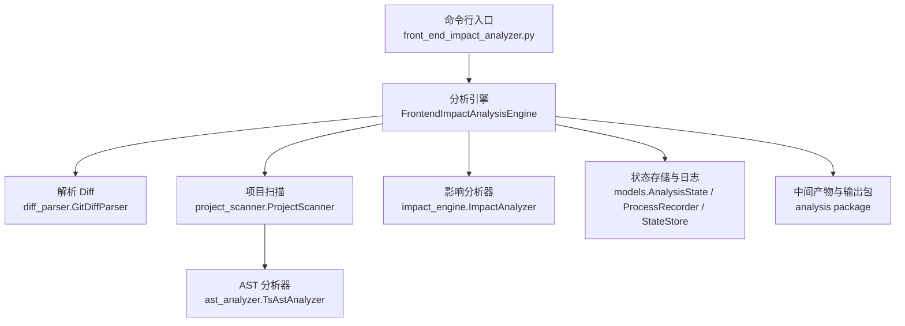
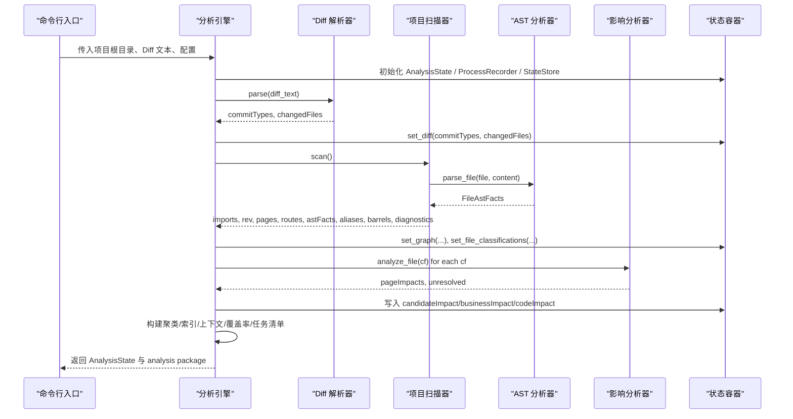
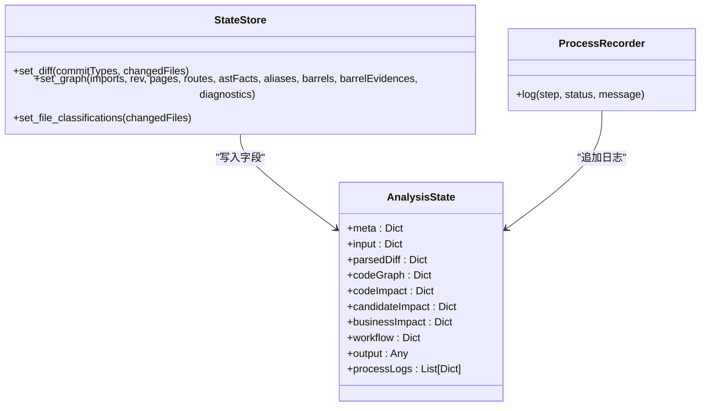
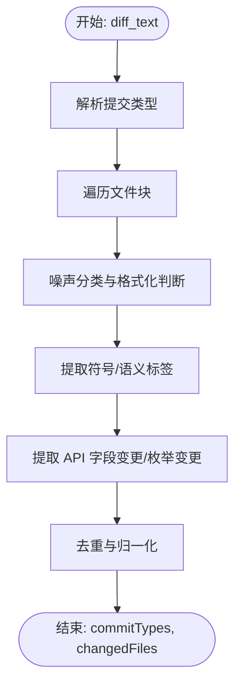
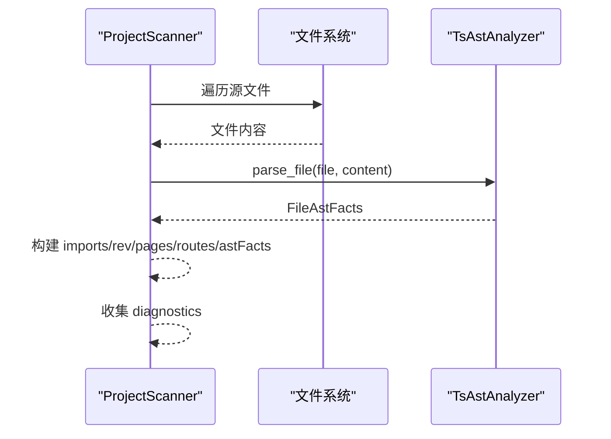
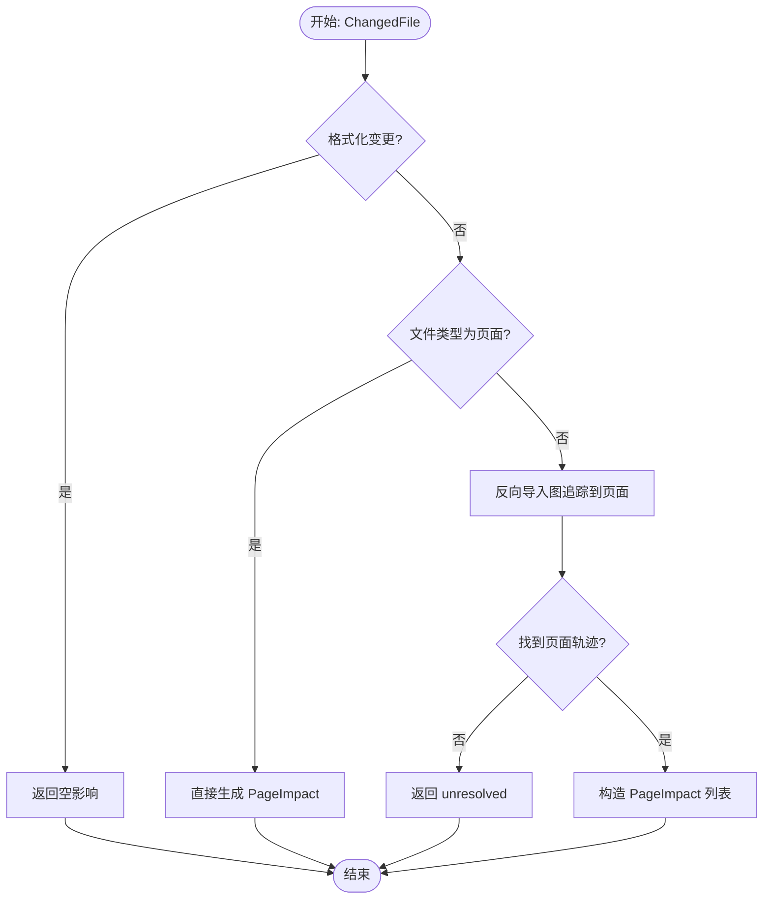
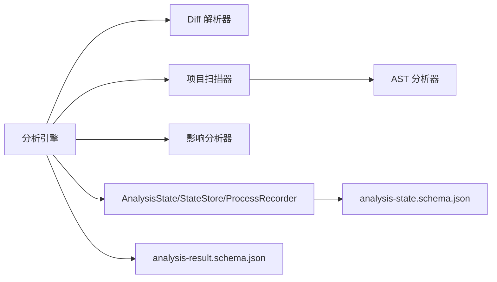
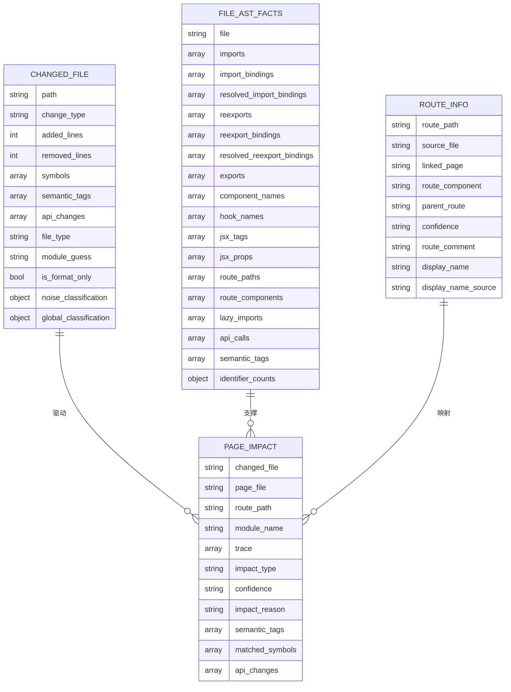
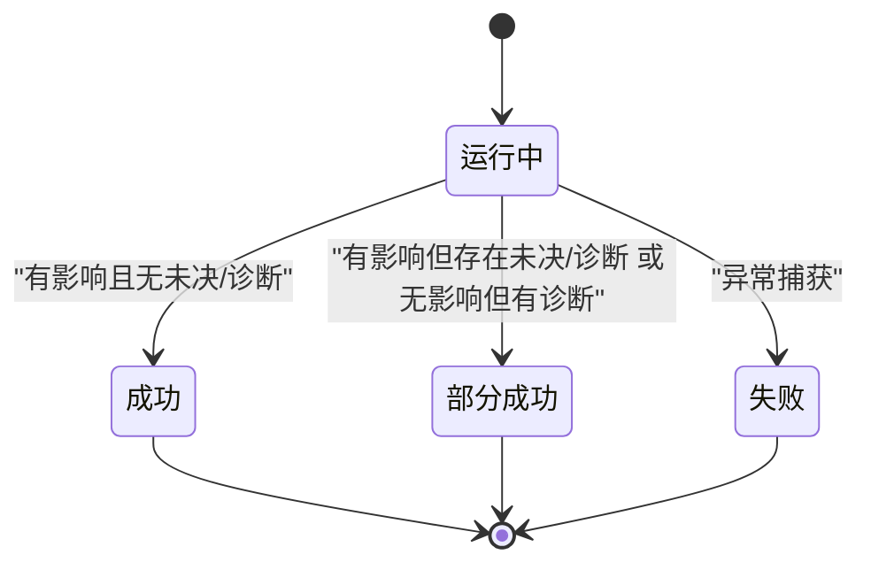

# 数据流分析

<cite>
**本文引用的文件**
- [scripts/front_end_impact_analyzer.py](file://scripts/front_end_impact_analyzer.py)
- [scripts/analyzer/models.py](file://scripts/analyzer/models.py)
- [scripts/analyzer/diff_parser.py](file://scripts/analyzer/diff_parser.py)
- [scripts/analyzer/project_scanner.py](file://scripts/analyzer/project_scanner.py)
- [scripts/analyzer/impact_engine.py](file://scripts/analyzer/impact_engine.py)
- [scripts/analyzer/ast_analyzer.py](file://scripts/analyzer/ast_analyzer.py)
- [scripts/analyzer/common.py](file://scripts/analyzer/common.py)
- [scripts/analyzer/case_builder.py](file://scripts/analyzer/case_builder.py)
- [schemas/analysis-state.schema.json](file://schemas/analysis-state.schema.json)
- [schemas/case-array.schema.json](file://schemas/case-array.schema.json)
- [fixtures/diffs/format_only.diff](file://fixtures/diffs/format_only.diff)
- [fixtures/diffs/shared_search_form.diff](file://fixtures/diffs/shared_search_form.diff)
- [tests/test_integration_output.py](file://tests/test_integration_output.py)
</cite>

## 目录
1. [简介](#简介)
2. [项目结构](#项目结构)
3. [核心组件](#核心组件)
4. [架构总览](#架构总览)
5. [详细组件分析](#详细组件分析)
6. [依赖关系分析](#依赖关系分析)
7. [性能考量](#性能考量)
8. [故障排查指南](#故障排查指南)
9. [结论](#结论)
10. [附录](#附录)

## 简介
本文件面向“前端影响分析器”项目，系统化梳理从输入 Git Diff 到最终输出分析包（analysis package）的完整数据流。重点覆盖以下方面：
- 输入 Git Diff 的解析与噪声过滤
- 项目扫描与 AST 提取
- 影响追踪与页面映射
- 变更聚类与上下文构建
- AnalysisState 状态管理与 ProcessRecorder 日志记录
- 关键数据模型及其关系
- 数据流图与状态转换图
- 性能特征与瓶颈识别
- 错误处理与异常数据策略

## 项目结构
项目采用按功能域划分的模块化组织方式，核心分析流程集中在脚本入口与 analyzer 子模块中，数据契约通过 JSON Schema 定义。

图表来源
- [scripts/front_end_impact_analyzer.py:23-160](file://scripts/front_end_impact_analyzer.py#L23-L160)
- [scripts/analyzer/diff_parser.py:11-110](file://scripts/analyzer/diff_parser.py#L11-L110)
- [scripts/analyzer/project_scanner.py:13-80](file://scripts/analyzer/project_scanner.py#L13-L80)
- [scripts/analyzer/ast_analyzer.py:13-30](file://scripts/analyzer/ast_analyzer.py#L13-L30)
- [scripts/analyzer/impact_engine.py:10-58](file://scripts/analyzer/impact_engine.py#L10-L58)
- [scripts/analyzer/models.py:116-169](file://scripts/analyzer/models.py#L116-L169)

章节来源
- [scripts/front_end_impact_analyzer.py:23-160](file://scripts/front_end_impact_analyzer.py#L23-L160)

## 核心组件
- 前端影响分析引擎：负责编排全流程，维护 AnalysisState，记录 ProcessLog，并生成最终 analysis package。
- Diff 解析器：解析 Git Diff 文本，提取变更文件、语义标签、API 变更等。
- 项目扫描器：遍历源码，构建导入/反向导入图、页面集合、路由信息、AST 事实与诊断。
- 影响分析器：基于反向导入图与 AST 事实，从变更文件追踪到页面，生成 PageImpact。
- 状态管理：AnalysisState 作为统一状态容器，StateStore 提供写入方法，ProcessRecorder 记录步骤日志。
- AST 分析器：Tree-sitter 驱动，抽取导入导出、组件/钩子/JSX、路由、API 调用等语义信息。
- 公共工具：路径规范化、别名解析、去重、标题化等。

章节来源
- [scripts/analyzer/models.py:116-201](file://scripts/analyzer/models.py#L116-L201)
- [scripts/analyzer/diff_parser.py:11-110](file://scripts/analyzer/diff_parser.py#L11-L110)
- [scripts/analyzer/project_scanner.py:13-80](file://scripts/analyzer/project_scanner.py#L13-L80)
- [scripts/analyzer/impact_engine.py:10-58](file://scripts/analyzer/impact_engine.py#L10-L58)
- [scripts/analyzer/ast_analyzer.py:13-30](file://scripts/analyzer/ast_analyzer.py#L13-L30)
- [scripts/analyzer/common.py:17-96](file://scripts/analyzer/common.py#L17-L96)

## 架构总览
下图展示从输入 Git Diff 到输出 analysis package 的端到端数据流：

图表来源
- [scripts/front_end_impact_analyzer.py:56-160](file://scripts/front_end_impact_analyzer.py#L56-L160)
- [scripts/analyzer/diff_parser.py:62-110](file://scripts/analyzer/diff_parser.py#L62-L110)
- [scripts/analyzer/project_scanner.py:20-80](file://scripts/analyzer/project_scanner.py#L20-L80)
- [scripts/analyzer/ast_analyzer.py:18-30](file://scripts/analyzer/ast_analyzer.py#L18-L30)
- [scripts/analyzer/impact_engine.py:26-58](file://scripts/analyzer/impact_engine.py#L26-L58)
- [scripts/analyzer/models.py:175-201](file://scripts/analyzer/models.py#L175-L201)

## 详细组件分析

### 组件一：AnalysisState 状态管理与 ProcessRecorder
- AnalysisState：统一承载元数据、输入、解析结果、代码图谱、影响、候选影响、业务影响、工作流中间产物、输出以及过程日志。
- StateStore：提供 set_diff、set_graph、set_file_classifications 等方法，将中间结果写入 AnalysisState 对应字段。
- ProcessRecorder：以 ProcessLog 形式追加日志，记录每个步骤的状态与消息，便于可观测性与排障。

图表来源
- [scripts/analyzer/models.py:116-201](file://scripts/analyzer/models.py#L116-L201)

章节来源
- [scripts/analyzer/models.py:116-201](file://scripts/analyzer/models.py#L116-L201)

### 组件二：Git Diff 解析与噪声过滤
- 解析阶段：提取 commit 类型、逐个文件块、统计新增/删除行数、识别符号与语义标签、判定格式化变更、提取 API 字段变更与枚举变更。
- 噪声过滤：根据噪声分类决定是否保留符号、语义标签与 API 变更，避免对非逻辑变更进行影响分析。

图表来源
- [scripts/analyzer/diff_parser.py:62-130](file://scripts/analyzer/diff_parser.py#L62-L130)

章节来源
- [scripts/analyzer/diff_parser.py:11-302](file://scripts/analyzer/diff_parser.py#L11-L302)

### 组件三：项目扫描与 AST 提取
- 扫描阶段：收集源文件、解析导入/导出/重导出/懒加载、构建反向导入图、识别页面与路由、提取 AST 事实（组件名、Hook、JSX、路由、API 调用、语义标签等），并记录未解析导入与路由绑定问题等诊断。
- AST 分析器：基于 Tree-sitter 抽取结构化事实，统一去重与语义标签推导。

图表来源
- [scripts/analyzer/project_scanner.py:20-80](file://scripts/analyzer/project_scanner.py#L20-L80)
- [scripts/analyzer/ast_analyzer.py:18-30](file://scripts/analyzer/ast_analyzer.py#L18-L30)

章节来源
- [scripts/analyzer/project_scanner.py:13-383](file://scripts/analyzer/project_scanner.py#L13-L383)
- [scripts/analyzer/ast_analyzer.py:13-200](file://scripts/analyzer/ast_analyzer.py#L13-L200)
- [scripts/analyzer/common.py:17-96](file://scripts/analyzer/common.py#L17-L96)

### 组件四：影响追踪与页面映射
- 影响分析器：基于反向导入图与 AST 事实，从变更文件出发进行广度优先搜索，匹配活跃符号，最终映射到页面与路由，生成 PageImpact 并附带置信度与原因说明。
- 特殊路径：页面文件直接产生高置信度直接影响；共享组件若无符号匹配则可能无法追踪到页面，返回 unresolved。

图表来源
- [scripts/analyzer/impact_engine.py:26-58](file://scripts/analyzer/impact_engine.py#L26-L58)

章节来源
- [scripts/analyzer/impact_engine.py:10-188](file://scripts/analyzer/impact_engine.py#L10-L188)

### 组件五：聚类、索引与上下文构建
- 变更聚类：基于 diff 索引与影响种子，构建变更簇，支持深度分析阈值控制。
- 文档索引：为后续上下文收集准备文档候选。
- 上下文收集：围绕每个聚类收集相关源文件与证据，形成 cluster-context。
- 覆盖率与任务：计算覆盖率，生成聚类分析任务清单，供人工/自动化进一步细化。

章节来源
- [scripts/front_end_impact_analyzer.py:116-144](file://scripts/front_end_impact_analyzer.py#L116-L144)

### 组件六：测试用例模板生成（已弃用）
- 当前主流程不自动生成模板用例；最终用例需经人工/外部工具（如 Claude）在聚类分析后生成，并由合并器整合。
- 该模块保留仅作历史参考。

章节来源
- [scripts/analyzer/case_builder.py:1-228](file://scripts/analyzer/case_builder.py#L1-L228)

## 依赖关系分析
- 引擎层依赖解析层、扫描层、分析层与状态层；状态层提供统一数据载体与日志。
- 扫描层依赖 AST 分析器与公共工具；AST 分析器依赖 Tree-sitter。
- 输出层依赖 JSON Schema 校验 analysis-state 与用例数组结构。

图表来源
- [scripts/front_end_impact_analyzer.py:23-55](file://scripts/front_end_impact_analyzer.py#L23-L55)
- [scripts/analyzer/models.py:116-201](file://scripts/analyzer/models.py#L116-L201)
- [schemas/analysis-state.schema.json:1-238](file://schemas/analysis-state.schema.json#L1-L238)

章节来源
- [scripts/analyzer/models.py:116-201](file://scripts/analyzer/models.py#L116-L201)
- [schemas/analysis-state.schema.json:1-238](file://schemas/analysis-state.schema.json#L1-L238)

## 性能考量
- I/O 密集：项目扫描阶段需要遍历大量源文件并解析 AST，是主要耗时点。
- 解析成本：Tree-sitter 解析与正则匹配（语义标签、API 变更）会随文件规模线性增长。
- 图搜索：影响追踪使用广度优先搜索，复杂度与反向导入图规模、符号匹配数量相关。
- 去重与归一化：多处使用去重与字符串归一化，建议在大项目中保持合理的缓存与增量更新策略。
- 并发优化：当前实现为串行流程，可考虑对独立文件的 AST 解析与扫描阶段引入并发（注意避免共享状态竞争）。

[本节为通用性能讨论，不直接分析具体文件]

## 故障排查指南
- 预检阻断：若预检报告 status 为 blocked，则直接输出阻断结果与下一步指引。
- 异常捕获：运行期异常会被记录到 ProcessRecorder，并在 AnalysisState 中追加 fatal-error 诊断，同时设置 analysisStatus 为 failed。
- 未解析导入与路由绑定：扫描阶段会记录 unresolved-import 与 unbound-route 诊断，影响覆盖率与页面追踪。
- 格式化变更：被噪声分类识别为 shouldAnalyze=false 的文件不会参与影响分析，属于预期行为。
- 状态与输出一致性：analysis package 的 meta 与 summary 字段由 AnalysisState 同步生成，确保状态与输出一致。

章节来源
- [scripts/front_end_impact_analyzer.py:314-398](file://scripts/front_end_impact_analyzer.py#L314-L398)
- [scripts/analyzer/project_scanner.py:45-50](file://scripts/analyzer/project_scanner.py#L45-L50)
- [scripts/analyzer/project_scanner.py:193-199](file://scripts/analyzer/project_scanner.py#L193-L199)
- [scripts/analyzer/diff_parser.py:112-129](file://scripts/analyzer/diff_parser.py#L112-L129)

## 结论
本分析器以 AnalysisState 为核心状态容器，串联起 Diff 解析、项目扫描、AST 提取、影响追踪与聚类上下文构建等环节。ProcessRecorder 提供了完整的可观测性日志；JSON Schema 明确了状态与输出的数据契约。当前主流程不自动生成测试用例，最终用例需经外部工具与合并器产出。整体流程清晰、模块职责明确，适合在大型前端项目中进行持续集成与影响评估。

[本节为总结性内容，不直接分析具体文件]

## 附录

### 关键数据模型与关系
- ChangedFile：表示单个变更文件，包含路径、变更类型、新增/删除行数、符号、语义标签、API 变更、噪声分类与全局分类等。
- FileAstFacts：表示单文件的 AST 提取结果，包括导入/导出/重导出、组件名、Hook 名、JSX 标签/属性、路由路径/组件、懒加载、API 调用、语义标签与标识符计数。
- RouteInfo：表示路由记录，包含路由路径、来源文件、绑定页面、组件名、父子关系、置信度与显示名等。
- PageImpact：表示从变更文件到页面的影响，包含页面文件、路由路径、模块名、追踪路径、影响类型、置信度、原因、语义标签、匹配符号与 API 变更。
- AnalysisState：统一状态容器，包含 meta/input/parsedDiff/codeGraph/codeImpact/candidateImpact/businessImpact/workflow/output/processLogs 等字段。
- ProcessLog：记录步骤、状态、消息与时间戳的日志条目。

图表来源
- [scripts/analyzer/models.py:27-90](file://scripts/analyzer/models.py#L27-L90)

章节来源
- [scripts/analyzer/models.py:27-90](file://scripts/analyzer/models.py#L27-L90)

### 数据流图（端到端）

图表来源
- [scripts/front_end_impact_analyzer.py:56-160](file://scripts/front_end_impact_analyzer.py#L56-L160)
- [scripts/analyzer/diff_parser.py:62-110](file://scripts/analyzer/diff_parser.py#L62-L110)
- [scripts/analyzer/project_scanner.py:20-80](file://scripts/analyzer/project_scanner.py#L20-L80)
- [scripts/analyzer/ast_analyzer.py:18-30](file://scripts/analyzer/ast_analyzer.py#L18-L30)
- [scripts/analyzer/impact_engine.py:26-58](file://scripts/analyzer/impact_engine.py#L26-L58)

### 状态转换图（AnalysisState.meta.analysisStatus）

图表来源
- [scripts/front_end_impact_analyzer.py:176-185](file://scripts/front_end_impact_analyzer.py#L176-L185)

### 示例与验证
- 格式化变更样例：format_only.diff 展示了仅空白字符变化的场景，通常会被噪声分类标记为无需分析。
- 功能变更样例：shared_search_form.diff 展示了共享组件变更，会生成页面影响与聚类上下文。
- 集成测试断言：验证 analysis package 的结构、状态摘要、聚类与覆盖率等字段。

章节来源
- [fixtures/diffs/format_only.diff:1-10](file://fixtures/diffs/format_only.diff#L1-L10)
- [fixtures/diffs/shared_search_form.diff:1-14](file://fixtures/diffs/shared_search_form.diff#L1-L14)
- [tests/test_integration_output.py:9-60](file://tests/test_integration_output.py#L9-L60)