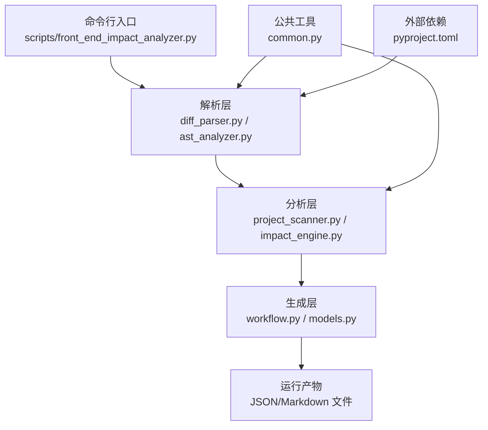
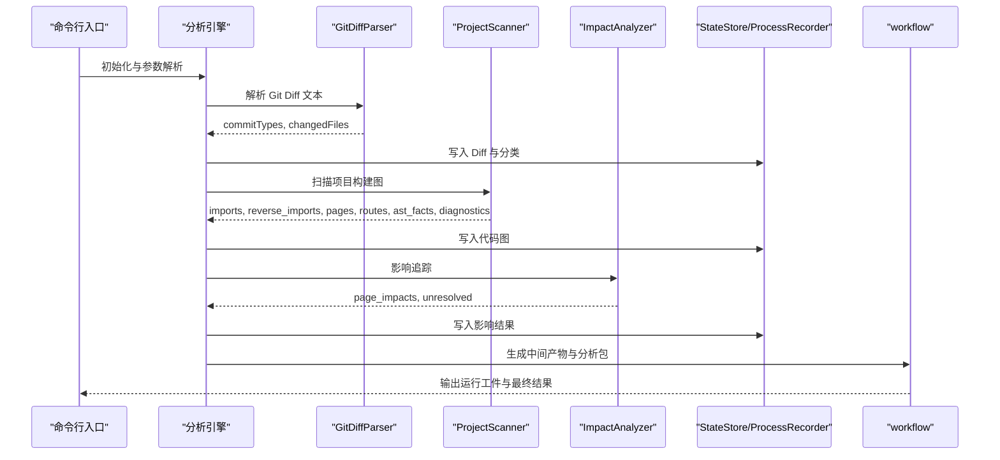
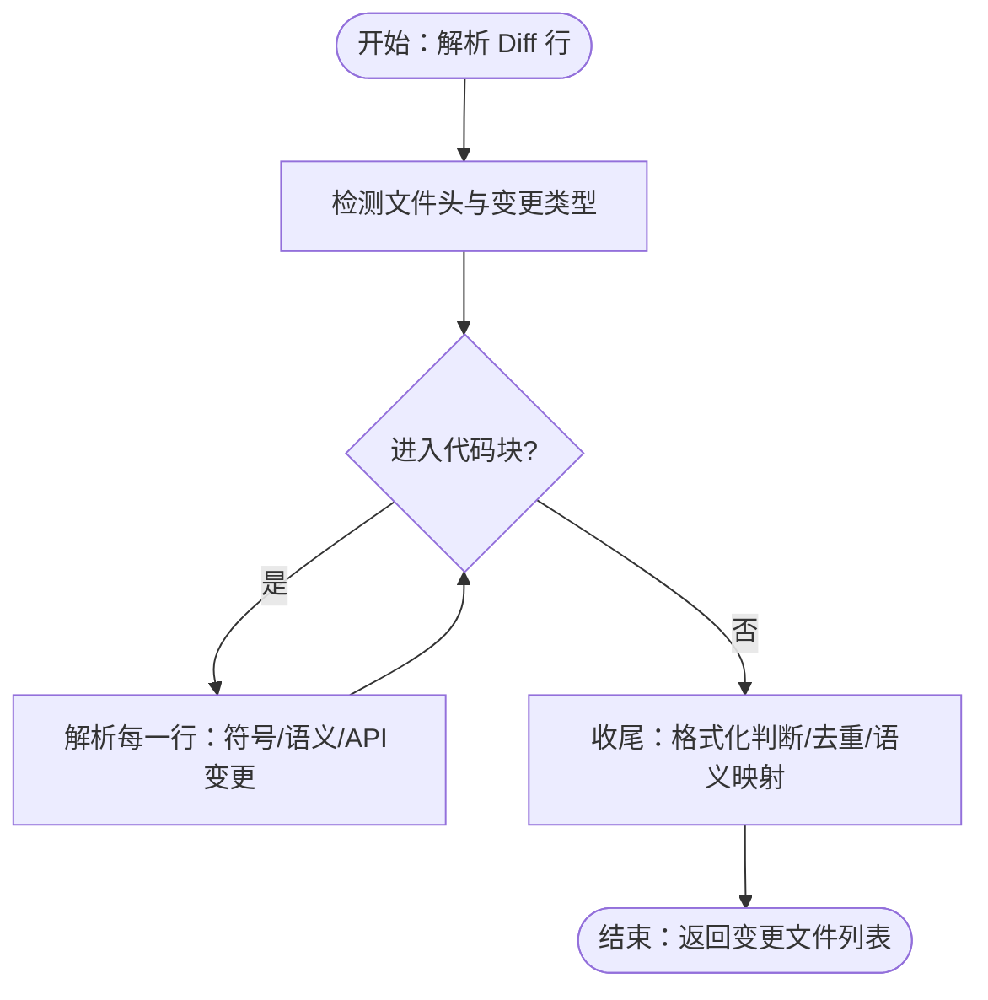
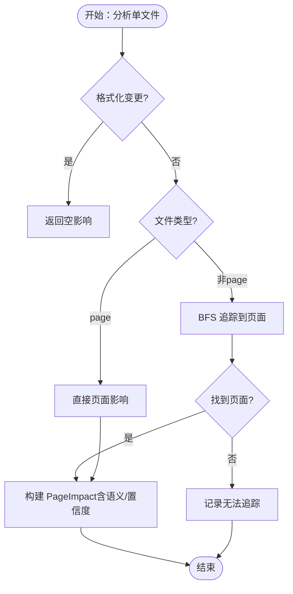
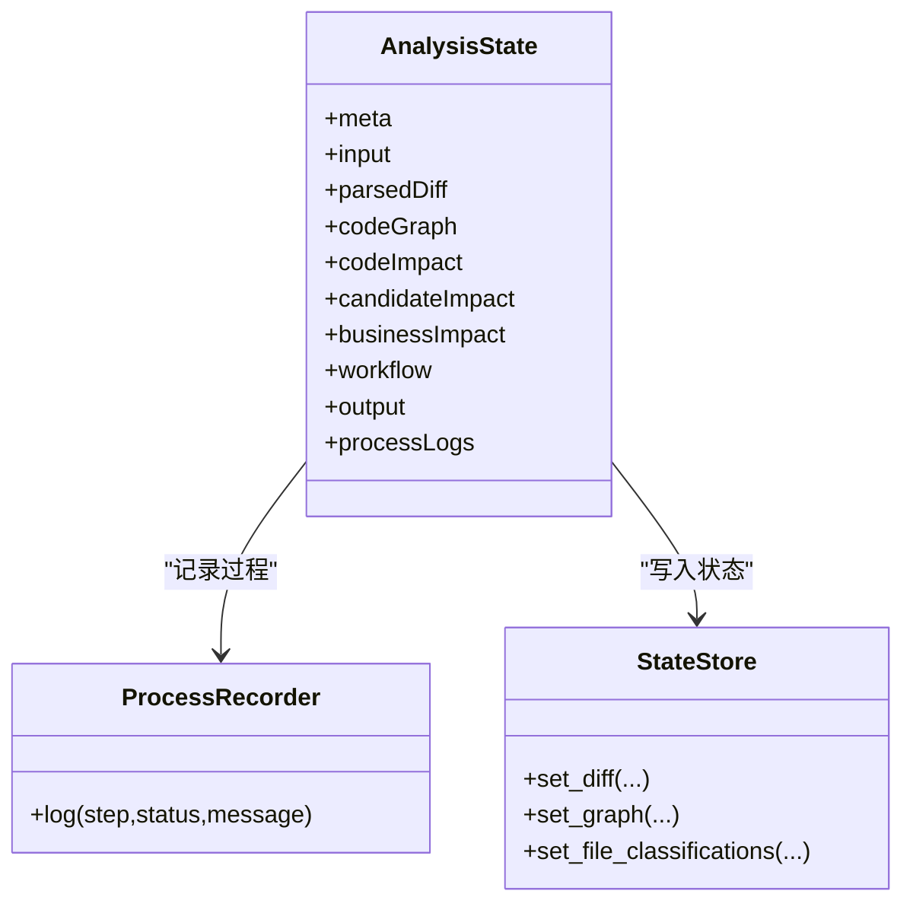
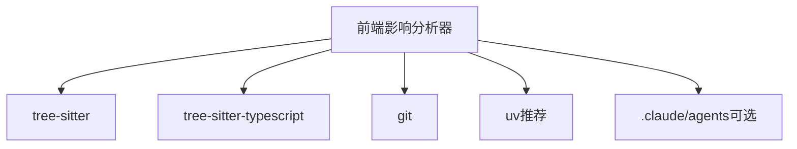
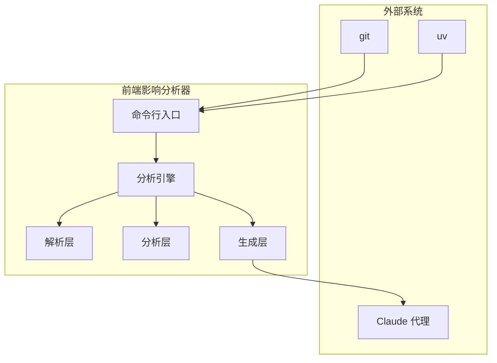

# 整体架构设计

<cite>
**本文引用的文件**
- [scripts/front_end_impact_analyzer.py](file://scripts/front_end_impact_analyzer.py)
- [scripts/analyzer/diff_parser.py](file://scripts/analyzer/diff_parser.py)
- [scripts/analyzer/ast_analyzer.py](file://scripts/analyzer/ast_analyzer.py)
- [scripts/analyzer/project_scanner.py](file://scripts/analyzer/project_scanner.py)
- [scripts/analyzer/impact_engine.py](file://scripts/analyzer/impact_engine.py)
- [scripts/analyzer/models.py](file://scripts/analyzer/models.py)
- [scripts/analyzer/common.py](file://scripts/analyzer/common.py)
- [scripts/analyzer/workflow.py](file://scripts/analyzer/workflow.py)
- [pyproject.toml](file://pyproject.toml)
- [references/agent-usage.md](file://references/agent-usage.md)
- [references/impact-rules.md](file://references/impact-rules.md)
</cite>

## 目录
1. [引言](#引言)
2. [项目结构](#项目结构)
3. [核心组件](#核心组件)
4. [架构总览](#架构总览)
5. [详细组件分析](#详细组件分析)
6. [依赖分析](#依赖分析)
7. [性能考虑](#性能考虑)
8. [故障排查指南](#故障排查指南)
9. [结论](#结论)
10. [附录](#附录)

## 引言
本文件面向前端影响分析器的整体架构设计，聚焦于分层架构与管道模式的数据流组织，阐述从 Git Diff 输入到 AST 解析、再到影响分析与结果产出的完整链路。文档同时解释事件驱动模式在 ProcessRecorder 中的实现，明确系统边界与外部依赖，并给出可扩展性、性能与可维护性的设计原则与权衡。

## 项目结构
该仓库采用“脚本入口 + analyzer 子包”的组织方式：顶层入口负责命令行参数解析、运行编排与产物写入；analyzer 子包按职责拆分为解析层（diff_parser、ast_analyzer）、分析层（project_scanner、impact_engine）与生成层（workflow、状态模型）。公共工具与常量集中在 common 模块，模型定义集中于 models 模块。

图表来源
- [scripts/front_end_impact_analyzer.py:23-160](file://scripts/front_end_impact_analyzer.py#L23-L160)
- [scripts/analyzer/diff_parser.py:11-110](file://scripts/analyzer/diff_parser.py#L11-L110)
- [scripts/analyzer/ast_analyzer.py:13-31](file://scripts/analyzer/ast_analyzer.py#L13-L31)
- [scripts/analyzer/project_scanner.py:13-80](file://scripts/analyzer/project_scanner.py#L13-L80)
- [scripts/analyzer/impact_engine.py:10-58](file://scripts/analyzer/impact_engine.py#L10-L58)
- [scripts/analyzer/workflow.py:15-62](file://scripts/analyzer/workflow.py#L15-L62)
- [scripts/analyzer/models.py:115-161](file://scripts/analyzer/models.py#L115-L161)
- [scripts/analyzer/common.py:1-151](file://scripts/analyzer/common.py#L1-L151)
- [pyproject.toml:6-9](file://pyproject.toml#L6-L9)

章节来源
- [scripts/front_end_impact_analyzer.py:23-160](file://scripts/front_end_impact_analyzer.py#L23-L160)
- [scripts/analyzer/workflow.py:15-62](file://scripts/analyzer/workflow.py#L15-L62)

## 核心组件
- 前端影响分析引擎（FrontendImpactAnalysisEngine）
  - 职责：编排整个分析流程，协调解析、扫描、分析与中间产物生成；维护 AnalysisState 与 ProcessRecorder。
  - 关键步骤：解析 Diff → 分类文件类型与噪声 → 扫描项目构建图 → 影响追踪 → 构建变更簇与上下文 → 产出分析包与运行工件。
- 解析层
  - GitDiffParser：解析 Git Diff 文本，提取变更文件、新增/删除行数、语义标签、API 变更等。
  - TsAstAnalyzer：基于 Tree-sitter 对 TS/TSX 源码进行语法树遍历，抽取导入导出、组件名、Hook 名、JSX 标签与属性、路由信息、API 调用等事实。
- 分析层
  - ProjectScanner：扫描源码，构建导入/反向导入图、页面集合、路由信息、AST 事实、别名与条目文件证据，输出诊断信息。
  - ImpactAnalyzer：以变更文件为起点，沿反向导入图回溯，结合符号匹配与语义标签，生成页面级影响清单。
- 生成层
  - AnalysisState/ProcessRecorder/StateStore：统一的状态容器与过程记录器，支撑中间产物持久化与后续合并。
  - workflow：配置加载、预检、运行目录与工件管理、Claude 代理模板安装、Diff 生成等。
- 公共模块
  - common：路径处理、去重、模块名推断、TS 配置别名解析、API 名集合等。
  - models：数据模型（ChangedFile、RouteInfo、FileAstFacts、PageImpact、AnalysisState 等）与过程日志。

章节来源
- [scripts/front_end_impact_analyzer.py:23-160](file://scripts/front_end_impact_analyzer.py#L23-L160)
- [scripts/analyzer/diff_parser.py:11-110](file://scripts/analyzer/diff_parser.py#L11-L110)
- [scripts/analyzer/ast_analyzer.py:13-31](file://scripts/analyzer/ast_analyzer.py#L13-L31)
- [scripts/analyzer/project_scanner.py:13-80](file://scripts/analyzer/project_scanner.py#L13-L80)
- [scripts/analyzer/impact_engine.py:10-58](file://scripts/analyzer/impact_engine.py#L10-L58)
- [scripts/analyzer/models.py:115-161](file://scripts/analyzer/models.py#L115-L161)
- [scripts/analyzer/common.py:1-151](file://scripts/analyzer/common.py#L1-L151)

## 架构总览
系统采用“分层 + 管道”的混合架构：
- 分层架构
  - 解析层：负责从文本/源码中抽取结构化事实。
  - 分析层：基于事实与图结构进行推理与影响追踪。
  - 生成层：组织中间产物、状态与最终输出。
- 管道模式
  - 数据在各层之间以“只读事实”或“中间状态”形式传递，避免紧耦合。
  - 每个阶段的输出作为下一阶段的输入，形成线性流水线。
- 事件驱动
  - ProcessRecorder 通过 AnalysisState 的 processLogs 记录每个阶段的开始、完成与失败，便于可观测与回放。

图表来源
- [scripts/front_end_impact_analyzer.py:56-160](file://scripts/front_end_impact_analyzer.py#L56-L160)
- [scripts/analyzer/diff_parser.py:62-110](file://scripts/analyzer/diff_parser.py#L62-L110)
- [scripts/analyzer/project_scanner.py:20-80](file://scripts/analyzer/project_scanner.py#L20-L80)
- [scripts/analyzer/impact_engine.py:26-58](file://scripts/analyzer/impact_engine.py#L26-L58)
- [scripts/analyzer/models.py:163-169](file://scripts/analyzer/models.py#L163-L169)
- [scripts/analyzer/workflow.py:214-219](file://scripts/analyzer/workflow.py#L214-L219)

## 详细组件分析

### 解析层：GitDiffParser 与 TsAstAnalyzer
- GitDiffParser
  - 功能：识别新增/删除/修改文件、统计行数、提取符号与语义标签、识别格式化变更、抽取 API 字段变更（请求/响应/枚举/分页/详情/列表）。
  - 复杂度：逐行扫描，时间复杂度近似 O(N)，空间复杂度受变更行与正则匹配结果影响。
  - 边界：对非 API 目录的文件采用启发式判断是否纳入 API 变更分析。
- TsAstAnalyzer
  - 功能：基于 Tree-sitter 解析 TS/TSX，抽取导入/导出/再导出、绑定信息、组件/Hook/JSX 标签与属性、路由对象、懒加载、API 调用、派生语义标签。
  - 复杂度：树遍历 O(M)，M 为节点数；派生语义标签为常数次字符串匹配。
  - 优化：使用 uniq_keep_order 去重并保持顺序，减少下游重复处理。

图表来源
- [scripts/analyzer/diff_parser.py:62-130](file://scripts/analyzer/diff_parser.py#L62-L130)

章节来源
- [scripts/analyzer/diff_parser.py:11-302](file://scripts/analyzer/diff_parser.py#L11-L302)
- [scripts/analyzer/ast_analyzer.py:13-242](file://scripts/analyzer/ast_analyzer.py#L13-L242)

### 分析层：ProjectScanner 与 ImpactAnalyzer
- ProjectScanner
  - 功能：收集源文件、解析 AST、建立导入/反向导入图、识别页面、解析路由对象、解析别名、发现条目文件、生成诊断。
  - 复杂度：对每个文件执行一次 AST 解析与一次路由对象提取，整体 O(F·(M+F))，F 为文件数，M 为平均节点数。
  - 优化：使用集合与字典去重，延迟解析别名目标，仅在需要时解析路由对象。
- ImpactAnalyzer
  - 功能：从变更文件出发，沿反向导入图 BFS 回溯，结合符号匹配与语义标签，生成 PageImpact 列表与置信度。
  - 复杂度：BFS 最坏情况下遍历所有可达节点，O(V+E)，V 为文件数，E 为导入边数。
  - 语义规则：依据 impact-rules.md 将语义标签映射到测试关注点，指导用例优先级与覆盖范围。

图表来源
- [scripts/analyzer/impact_engine.py:26-105](file://scripts/analyzer/impact_engine.py#L26-L105)
- [references/impact-rules.md:3-19](file://references/impact-rules.md#L3-L19)

章节来源
- [scripts/analyzer/project_scanner.py:13-383](file://scripts/analyzer/project_scanner.py#L13-L383)
- [scripts/analyzer/impact_engine.py:10-188](file://scripts/analyzer/impact_engine.py#L10-L188)
- [references/impact-rules.md:3-19](file://references/impact-rules.md#L3-L19)

### 生成层：状态、记录与工作流
- AnalysisState/ProcessRecorder/StateStore
  - AnalysisState：统一承载元数据、输入、解析后的 Diff、代码图、候选影响、业务影响、工作流中间产物与最终输出。
  - ProcessRecorder：以 AnalysisState 为载体，记录每个阶段的 step/status/message/ts，形成可审计的执行轨迹。
  - StateStore：封装对 AnalysisState 的写入操作，保证数据一致性与结构化。
- workflow
  - 配置加载与默认值合并、运行清单生成、预检（检查 repo wiki/requirements/specs、git 工作区、依赖可用性）、运行目录创建、Diff 生成、Claude 代理模板安装、工件写入与合并。

图表来源
- [scripts/analyzer/models.py:115-201](file://scripts/analyzer/models.py#L115-L201)

章节来源
- [scripts/analyzer/models.py:115-201](file://scripts/analyzer/models.py#L115-L201)
- [scripts/analyzer/workflow.py:15-62](file://scripts/analyzer/workflow.py#L15-L62)

### 事件驱动模式：ProcessRecorder 的实现
- 设计要点
  - 使用 AnalysisState.processLogs 作为事件存储，每一步调用 log(step, status, message) 即产生一条事件。
  - 事件包含时间戳，便于排序与回放。
  - 在异常分支中记录失败事件，确保可观测性。
- 应用场景
  - parse_diff、scan_project、impact_analysis、build_intermediates 等阶段均通过 log 记录状态变化。
  - 合并阶段（--merge-cluster-analysis）可读取 AnalysisState 获取路由显示名与图证据，提升人工校验效率。

章节来源
- [scripts/front_end_impact_analyzer.py:367-384](file://scripts/front_end_impact_analyzer.py#L367-L384)
- [scripts/analyzer/models.py:163-169](file://scripts/analyzer/models.py#L163-L169)

## 依赖分析
- 内部依赖
  - front_end_impact_analyzer.py 依赖 analyzer 包内各模块，形成清晰的分层调用关系。
  - common 提供跨模块共享能力（路径、别名、去重、模块名推断），降低耦合。
- 外部依赖
  - tree-sitter 与 tree-sitter-typescript：用于高性能语法解析。
  - pytest：开发环境测试依赖。
- 系统边界
  - 输入：Git Diff 文本、可选需求/规范/维基目录、配置文件。
  - 输出：运行工件（JSON/Markdown）、最终分析包、合并后用例包。
  - 外部工具：git、uv（推荐命令前缀）、Claude 代理模板（可选）。

图表来源
- [pyproject.toml:6-9](file://pyproject.toml#L6-L9)
- [scripts/analyzer/workflow.py:137-189](file://scripts/analyzer/workflow.py#L137-L189)
- [references/agent-usage.md:16-68](file://references/agent-usage.md#L16-L68)

章节来源
- [pyproject.toml:1-18](file://pyproject.toml#L1-L18)
- [scripts/analyzer/workflow.py:137-189](file://scripts/analyzer/workflow.py#L137-L189)
- [references/agent-usage.md:16-68](file://references/agent-usage.md#L16-L68)

## 性能考虑
- 时间复杂度
  - Diff 解析：O(N)，N 为行数。
  - AST 解析：对每个文件一次，整体 O(F·M)。
  - 影响追踪：BFS，最坏 O(V+E)。
- 空间复杂度
  - 导入/反向导入图、AST 事实、路由与诊断占用内存，建议大项目启用忽略目录与文件策略。
- 优化建议
  - 使用 uniq_keep_order 保持顺序的同时去重，减少重复计算。
  - 限制最大簇数量与上下文大小，避免大规模深分析导致内存压力。
  - 通过 noise classification 排除格式化等非逻辑噪声，缩短分析链路。
  - 并行化（如多进程扫描 AST）需谨慎，注意共享状态与锁开销。

[本节为通用性能讨论，不直接分析具体文件]

## 故障排查指南
- 预检阻塞
  - 若 repo wiki/requirements/specs 缺失且被要求，预检会标记 blocked，需先满足要求或调整配置。
- 运行失败
  - 异常捕获后记录 fatal-error 诊断，设置 analysisStatus 为 failed，并输出状态摘要。
- 无法追踪到页面
  - 当反向导入无法到达页面时，返回 unresolved，建议检查导入链、别名解析与条目文件。
- 低置信度影响
  - 共享组件、样式、工具函数等通常置信度较低，应结合语义标签与 API 变更进一步验证。
- Claude 合并
  - 使用 --merge-cluster-analysis 合并人工分析结果，遵循输出规范与验证报告。

章节来源
- [scripts/front_end_impact_analyzer.py:314-359](file://scripts/front_end_impact_analyzer.py#L314-L359)
- [scripts/front_end_impact_analyzer.py:367-384](file://scripts/front_end_impact_analyzer.py#L367-L384)
- [scripts/analyzer/impact_engine.py:33-39](file://scripts/analyzer/impact_engine.py#L33-L39)
- [references/agent-usage.md:83-127](file://references/agent-usage.md#L83-L127)

## 结论
该系统通过“解析层-分析层-生成层”的分层与管道模式，实现了从 Git Diff 到页面影响的高效追踪；借助 ProcessRecorder 的事件驱动记录，提供了良好的可观测性与可审计性。通过配置化的预检、运行目录与工件管理，以及与 Claude 代理的协作，系统在可扩展性、性能与可维护性方面达成平衡。建议在大型项目中合理设置忽略规则、控制簇规模与上下文大小，并充分利用语义标签与 API 变更证据提升置信度。

[本节为总结性内容，不直接分析具体文件]

## 附录
- 系统上下文图（概念性）
  - 展示了前端影响分析器与外部系统（git、uv、Claude 代理）的关系，以及内部模块的职责分工。

[本图为概念性上下文图，不直接映射具体源码文件，故不提供图表来源]