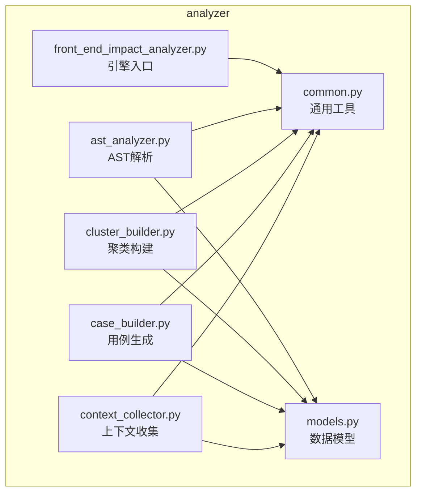
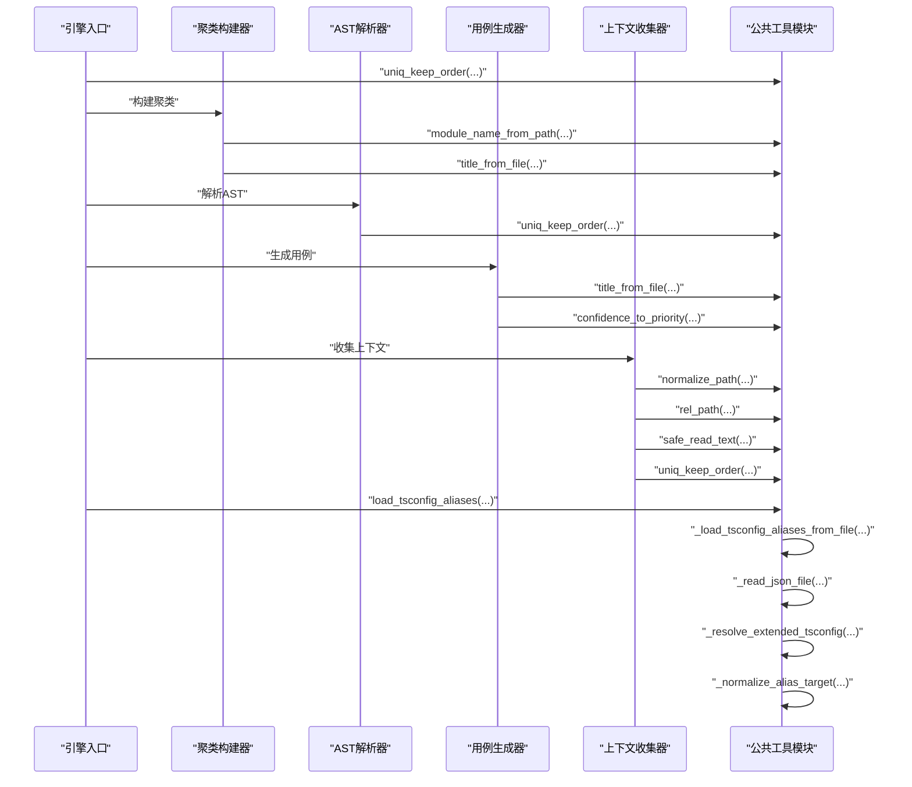
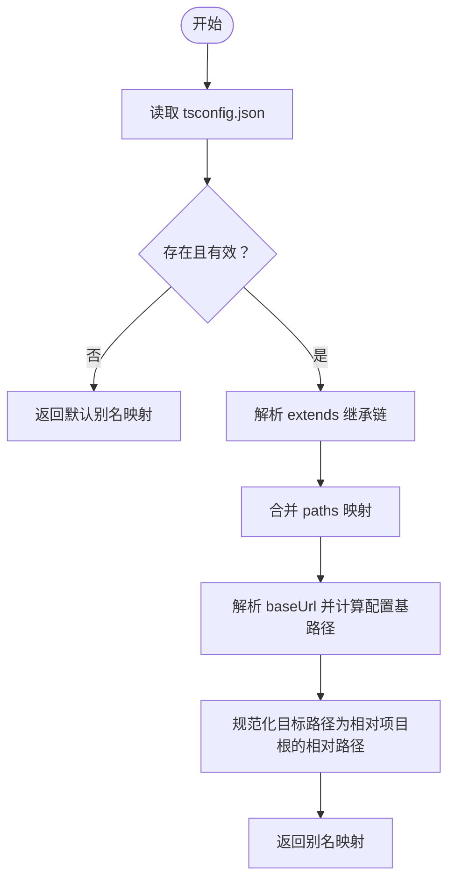
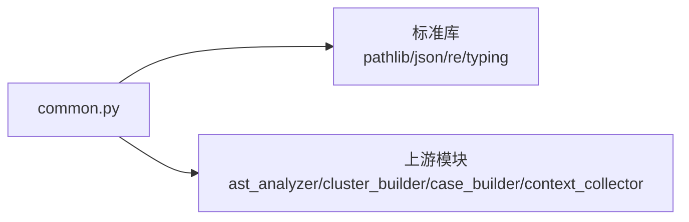

# 公共工具模块

<cite>
**本文档引用的文件**
- [scripts/analyzer/common.py](file://scripts/analyzer/common.py)
- [scripts/analyzer/ast_analyzer.py](file://scripts/analyzer/ast_analyzer.py)
- [scripts/analyzer/cluster_builder.py](file://scripts/analyzer/cluster_builder.py)
- [scripts/analyzer/case_builder.py](file://scripts/analyzer/case_builder.py)
- [scripts/analyzer/context_collector.py](file://scripts/analyzer/context_collector.py)
- [scripts/front_end_impact_analyzer.py](file://scripts/front_end_impact_analyzer.py)
- [scripts/analyzer/models.py](file://scripts/analyzer/models.py)
</cite>

## 目录
1. [简介](#简介)
2. [项目结构](#项目结构)
3. [核心组件](#核心组件)
4. [架构总览](#架构总览)
5. [详细组件分析](#详细组件分析)
6. [依赖分析](#依赖分析)
7. [性能考虑](#性能考虑)
8. [故障排查指南](#故障排查指南)
9. [结论](#结论)
10. [附录](#附录)

## 简介
本文件系统化梳理公共工具模块（common.py）的功能与实现，覆盖路径处理、字符串操作、数据结构处理、模块名推断、配置别名解析等通用能力，并结合实际使用场景说明参数规范、返回值格式、性能特征、错误处理与兼容性要点。同时提供最佳实践建议与常见问题排查方法，帮助开发者在前端影响分析流水线中高效、稳定地复用这些工具。

## 项目结构
公共工具模块位于 analyzer 子包内，被多个分析阶段广泛复用，包括 AST 解析、聚类构建、用例生成、上下文收集等。其职责是提供跨模块的通用能力，确保数据一致性与可维护性。

图表来源
- [scripts/analyzer/common.py:1-151](file://scripts/analyzer/common.py#L1-L151)
- [scripts/analyzer/ast_analyzer.py:1-200](file://scripts/analyzer/ast_analyzer.py#L1-L200)
- [scripts/analyzer/cluster_builder.py:1-200](file://scripts/analyzer/cluster_builder.py#L1-L200)
- [scripts/analyzer/case_builder.py:1-200](file://scripts/analyzer/case_builder.py#L1-L200)
- [scripts/analyzer/context_collector.py:1-200](file://scripts/analyzer/context_collector.py#L1-L200)
- [scripts/front_end_impact_analyzer.py:1-403](file://scripts/front_end_impact_analyzer.py#L1-L403)
- [scripts/analyzer/models.py:1-201](file://scripts/analyzer/models.py#L1-L201)

章节来源
- [scripts/analyzer/common.py:1-151](file://scripts/analyzer/common.py#L1-L151)
- [scripts/analyzer/ast_analyzer.py:1-200](file://scripts/analyzer/ast_analyzer.py#L1-L200)
- [scripts/analyzer/cluster_builder.py:1-200](file://scripts/analyzer/cluster_builder.py#L1-L200)
- [scripts/analyzer/case_builder.py:1-200](file://scripts/analyzer/case_builder.py#L1-L200)
- [scripts/analyzer/context_collector.py:1-200](file://scripts/analyzer/context_collector.py#L1-L200)
- [scripts/front_end_impact_analyzer.py:1-403](file://scripts/front_end_impact_analyzer.py#L1-L403)
- [scripts/analyzer/models.py:1-201](file://scripts/analyzer/models.py#L1-L201)

## 核心组件
本模块提供以下核心能力：
- 路径标准化与相对路径计算：统一路径分隔符、处理相对路径与异常情况
- 安全文本读取：支持 UTF-8 并优雅处理编码错误
- 去重并保持顺序：对字符串列表进行去重，保留首次出现顺序
- 模块名推断：从文件路径推断模块名，用于聚类与报告
- 标题化文件名：将文件名转换为人类可读标题
- 优先级映射：将置信度映射到优先级
- TypeScript 配置别名解析：解析 tsconfig 的 paths 与 baseUrl，支持 extends 继承链
- JSON 安全读取与扩展解析：安全读取 JSON 文件并处理循环继承

章节来源
- [scripts/analyzer/common.py:17-151](file://scripts/analyzer/common.py#L17-L151)

## 架构总览
公共工具模块作为“基础设施层”，向上游各分析器提供统一的数据清洗与转换能力。其典型调用链如下：

图表来源
- [scripts/front_end_impact_analyzer.py:106-114](file://scripts/front_end_impact_analyzer.py#L106-L114)
- [scripts/analyzer/cluster_builder.py:6-8](file://scripts/analyzer/cluster_builder.py#L6-L8)
- [scripts/analyzer/ast_analyzer.py:9-29](file://scripts/analyzer/ast_analyzer.py#L9-L29)
- [scripts/analyzer/case_builder.py:10-11](file://scripts/analyzer/case_builder.py#L10-L11)
- [scripts/analyzer/context_collector.py:7-8](file://scripts/analyzer/context_collector.py#L7-L8)
- [scripts/analyzer/common.py:74-151](file://scripts/analyzer/common.py#L74-L151)

## 详细组件分析

### 路径处理与文本读取
- normalize_path(p: str) -> str
  - 功能：将路径中的反斜杠替换为正斜杠并去除首尾空白，统一路径分隔符
  - 参数：p（字符串，文件路径）
  - 返回：标准化后的路径字符串
  - 使用场景：统一路径表示，避免平台差异导致的比较与拼接问题
  - 兼容性：适用于 Windows 与 Unix 风格路径
  - 章节来源
    - [scripts/analyzer/common.py:17-18](file://scripts/analyzer/common.py#L17-L18)

- rel_path(path: Path, root: Path) -> str
  - 功能：计算 path 相对于 root 的相对路径；若无法计算则直接返回标准化后的绝对路径
  - 参数：path（绝对或相对路径）、root（基准根路径）
  - 返回：相对或标准化路径字符串
  - 错误处理：捕获异常并回退为标准化绝对路径
  - 使用场景：文档索引、报告输出、日志记录
  - 章节来源
    - [scripts/analyzer/common.py:21-25](file://scripts/analyzer/common.py#L21-L25)
    - [scripts/analyzer/context_collector.py:27-27](file://scripts/analyzer/context_collector.py#L27-L27)

- safe_read_text(path: Path) -> str
  - 功能：安全读取文件文本，优先 UTF-8；遇到编码错误时忽略错误字符
  - 参数：path（文件路径）
  - 返回：文件内容字符串（可能包含被忽略的字符）
  - 错误处理：捕获 UnicodeDecodeError 与其它异常并回退为空字符串
  - 使用场景：文档解析、配置读取、调试诊断
  - 章节来源
    - [scripts/analyzer/common.py:28-34](file://scripts/analyzer/common.py#L28-L34)
    - [scripts/analyzer/context_collector.py:22-23](file://scripts/analyzer/context_collector.py#L22-L23)

- load_tsconfig_aliases(project_root: Path) -> Dict[str, List[str]]
  - 功能：加载 tsconfig.json 中的路径别名映射，支持 extends 继承链
  - 参数：project_root（项目根目录）
  - 返回：别名到目标模式列表的映射
  - 实现要点：递归解析 extends、合并 paths、规范化 baseUrl 与目标路径
  - 使用场景：别名解析、导入路径还原
  - 章节来源
    - [scripts/analyzer/common.py:74-79](file://scripts/analyzer/common.py#L74-L79)
    - [scripts/analyzer/common.py:99-123](file://scripts/analyzer/common.py#L99-L123)
    - [scripts/analyzer/common.py:126-130](file://scripts/analyzer/common.py#L126-L130)
    - [scripts/analyzer/common.py:133-139](file://scripts/analyzer/common.py#L133-L139)
    - [scripts/analyzer/common.py:142-150](file://scripts/analyzer/common.py#L142-L150)

- resolve_alias_targets(project_root: Path, raw_target: str, aliases: Dict[str, List[str]]) -> List[Path]
  - 功能：根据别名映射将原始目标展开为真实候选路径
  - 参数：raw_target（别名目标字符串）、aliases（别名映射）
  - 返回：候选真实路径列表
  - 使用场景：导入解析、路径还原
  - 章节来源
    - [scripts/analyzer/common.py:82-96](file://scripts/analyzer/common.py#L82-L96)

### 字符串操作与数据结构处理
- uniq_keep_order(items: List[str]) -> List[str]
  - 功能：对字符串列表进行去重并保持首次出现顺序
  - 参数：items（字符串列表）
  - 返回：去重后的字符串列表
  - 复杂度：时间 O(n)，空间 O(n)
  - 使用场景：聚类键、标签集合、关键词提取、API 变更类型
  - 章节来源
    - [scripts/analyzer/common.py:37-44](file://scripts/analyzer/common.py#L37-L44)
    - [scripts/analyzer/ast_analyzer.py:27-29](file://scripts/analyzer/ast_analyzer.py#L27-L29)
    - [scripts/analyzer/cluster_builder.py:64-68](file://scripts/analyzer/cluster_builder.py#L64-L68)
    - [scripts/analyzer/cluster_builder.py:108-113](file://scripts/analyzer/cluster_builder.py#L108-L113)
    - [scripts/analyzer/case_builder.py:174-175](file://scripts/analyzer/case_builder.py#L174-L175)
    - [scripts/analyzer/case_builder.py:191-192](file://scripts/analyzer/case_builder.py#L191-L192)
    - [scripts/analyzer/context_collector.py:64-64](file://scripts/analyzer/context_collector.py#L64-L64)
    - [scripts/analyzer/context_collector.py:110-110](file://scripts/analyzer/context_collector.py#L110-L110)
    - [scripts/analyzer/context_collector.py:121-121](file://scripts/analyzer/context_collector.py#L121-L121)
    - [scripts/analyzer/context_collector.py:134-134](file://scripts/analyzer/context_collector.py#L134-L134)
    - [scripts/analyzer/context_collector.py:146-146](file://scripts/analyzer/context_collector.py#L146-L146)
    - [scripts/analyzer/context_collector.py:226-226](file://scripts/analyzer/context_collector.py#L226-L226)
    - [scripts/analyzer/context_collector.py:248-248](file://scripts/analyzer/context_collector.py#L248-L248)
    - [scripts/analyzer/context_collector.py:374-374](file://scripts/analyzer/context_collector.py#L374-L374)
    - [scripts/analyzer/context_collector.py:529-529](file://scripts/analyzer/context_collector.py#L529-L529)

- title_from_file(path_str: str) -> str
  - 功能：将文件名转换为人类可读标题（驼峰/短横线/下划线转空格，再标题化）
  - 参数：path_str（文件路径）
  - 返回：标题化字符串
  - 使用场景：页面标题、用例标题、报告标题
  - 章节来源
    - [scripts/analyzer/common.py:47-51](file://scripts/analyzer/common.py#L47-L51)
    - [scripts/analyzer/case_builder.py:24-24](file://scripts/analyzer/case_builder.py#L24-L24)
    - [scripts/analyzer/cluster_builder.py:221-222](file://scripts/analyzer/cluster_builder.py#L221-L222)

- module_name_from_path(path_str: str) -> str
  - 功能：从文件路径推断模块名，忽略常见目录与文件扩展名
  - 参数：path_str（文件路径）
  - 返回：模块名字符串（默认 unknown）
  - 使用场景：聚类标题、模块维度统计
  - 章节来源
    - [scripts/analyzer/common.py:54-67](file://scripts/analyzer/common.py#L54-L67)
    - [scripts/analyzer/cluster_builder.py:221-222](file://scripts/analyzer/cluster_builder.py#L221-L222)
    - [scripts/analyzer/impact_engine.py:48-48](file://scripts/analyzer/impact_engine.py#L48-L48)
    - [scripts/analyzer/source_classifier.py:34-34](file://scripts/analyzer/source_classifier.py#L34-L34)

- confidence_to_priority(conf: str) -> str
  - 功能：将置信度映射为优先级（high/medium 保持，其他映射为 low）
  - 参数：conf（置信度字符串）
  - 返回：优先级字符串
  - 使用场景：用例优先级、任务调度
  - 章节来源
    - [scripts/analyzer/common.py:70-71](file://scripts/analyzer/common.py#L70-L71)
    - [scripts/analyzer/case_builder.py:77-77](file://scripts/analyzer/case_builder.py#L77-L77)

### 配置别名解析流程

图表来源
- [scripts/analyzer/common.py:74-79](file://scripts/analyzer/common.py#L74-L79)
- [scripts/analyzer/common.py:99-123](file://scripts/analyzer/common.py#L99-L123)
- [scripts/analyzer/common.py:126-130](file://scripts/analyzer/common.py#L126-L130)
- [scripts/analyzer/common.py:133-139](file://scripts/analyzer/common.py#L133-L139)
- [scripts/analyzer/common.py:142-150](file://scripts/analyzer/common.py#L142-L150)

## 依赖分析
公共工具模块内部依赖关系清晰，主要依赖标准库（pathlib、json、re、typing），对外提供稳定的 API。上游模块通过统一导入使用这些工具，形成高内聚、低耦合的设计。

图表来源
- [scripts/analyzer/common.py:1-151](file://scripts/analyzer/common.py#L1-L151)
- [scripts/analyzer/ast_analyzer.py:1-11](file://scripts/analyzer/ast_analyzer.py#L1-L11)
- [scripts/analyzer/cluster_builder.py:1-8](file://scripts/analyzer/cluster_builder.py#L1-L8)
- [scripts/analyzer/case_builder.py:1-12](file://scripts/analyzer/case_builder.py#L1-L12)
- [scripts/analyzer/context_collector.py:1-8](file://scripts/analyzer/context_collector.py#L1-L8)

章节来源
- [scripts/analyzer/common.py:1-151](file://scripts/analyzer/common.py#L1-L151)

## 性能考虑
- uniq_keep_order：基于集合去重，时间复杂度 O(n)，适合大规模列表去重；注意输入为字符串列表，避免重复转换
- normalize_path/rel_path/safe_read_text：均为 O(1) 或 O(m)（m 为路径长度），开销极小
- tsconfig 别名解析：递归解析 extends，最坏情况下与继承层级成正比；建议缓存解析结果或在工程范围内复用
- JSON 安全读取：异常分支会回退为空字典，避免中断流程；对大文件读取建议配合分段策略

[本节为通用性能讨论，不直接分析特定文件]

## 故障排查指南
- 路径相对化失败
  - 现象：rel_path 返回绝对路径而非期望的相对路径
  - 原因：path 不在 root 下或路径不存在
  - 处理：检查传入路径是否合法，必要时使用 normalize_path 统一格式
  - 章节来源
    - [scripts/analyzer/common.py:21-25](file://scripts/analyzer/common.py#L21-L25)

- 文本读取乱码或失败
  - 现象：safe_read_text 返回空字符串或部分字符丢失
  - 原因：非 UTF-8 编码或文件损坏
  - 处理：确认文件编码；如需保留原样可自定义读取策略
  - 章节来源
    - [scripts/analyzer/common.py:28-34](file://scripts/analyzer/common.py#L28-L34)

- 别名解析不生效
  - 现象：resolve_alias_targets 返回空列表
  - 原因：raw_target 未匹配任何别名前缀或 tsconfig 未正确加载
  - 处理：检查 tsconfig.json 的 paths 与 baseUrl；确认 load_tsconfig_aliases 已正确调用
  - 章节来源
    - [scripts/analyzer/common.py:82-96](file://scripts/analyzer/common.py#L82-L96)
    - [scripts/analyzer/common.py:99-123](file://scripts/analyzer/common.py#L99-L123)

- 去重后顺序不符合预期
  - 现象：uniq_keep_order 未按预期顺序保留
  - 原因：输入列表中存在大小写差异或多余空白
  - 处理：在调用前统一大小写与空白
  - 章节来源
    - [scripts/analyzer/common.py:37-44](file://scripts/analyzer/common.py#L37-L44)

## 结论
公共工具模块通过一组轻量、稳健的通用函数，为前端影响分析流水线提供了统一的数据清洗与转换能力。其设计遵循“单一职责、低耦合”的原则，既满足高性能要求，又具备良好的错误恢复与兼容性。建议在新模块中优先复用这些工具，减少重复实现，提升整体一致性与可维护性。

[本节为总结性内容，不直接分析特定文件]

## 附录

### 函数清单与使用场景速查
- normalize_path(p: str) -> str
  - 场景：路径标准化、跨平台兼容
- rel_path(path: Path, root: Path) -> str
  - 场景：相对路径计算、报告输出
- safe_read_text(path: Path) -> str
  - 场景：安全读取、文档解析
- uniq_keep_order(items: List[str]) -> List[str]
  - 场景：去重并保序、标签集合、关键词提取
- title_from_file(path_str: str) -> str
  - 场景：标题化、用例/页面命名
- module_name_from_path(path_str: str) -> str
  - 场景：模块名推断、聚类标题
- confidence_to_priority(conf: str) -> str
  - 场景：优先级映射、任务调度
- load_tsconfig_aliases(project_root: Path) -> Dict[str, List[str]]
  - 场景：别名解析、导入路径还原
- resolve_alias_targets(project_root: Path, raw_target: str, aliases: Dict[str, List[str]]) -> List[Path]
  - 场景：别名展开、路径还原

### 最佳实践建议
- 在处理路径时始终使用 normalize_path 与 rel_path，避免平台差异
- 对外部文本输入使用 safe_read_text，确保稳定性
- 对所有列表型输出（标签、关键词、路径）统一调用 uniq_keep_order
- 在聚类与报告中使用 title_from_file 与 module_name_from_path，保证命名一致性
- 将 tsconfig 别名解析结果缓存，避免重复 IO 与解析
- 对置信度映射统一使用 confidence_to_priority，便于后续排序与过滤

[本节为通用建议，不直接分析特定文件]