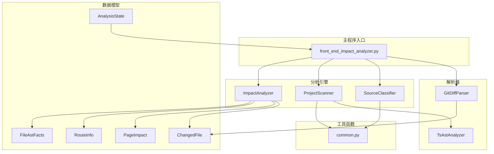
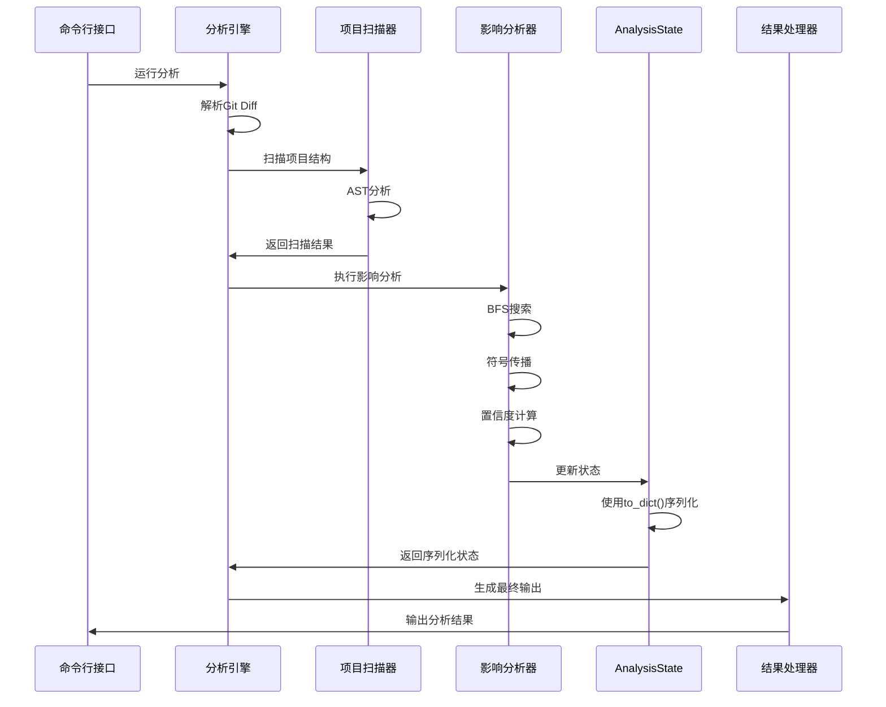
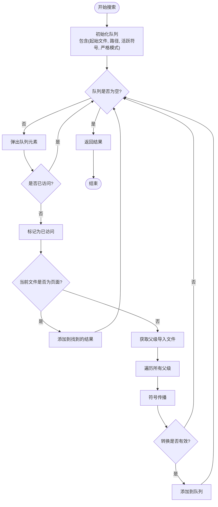
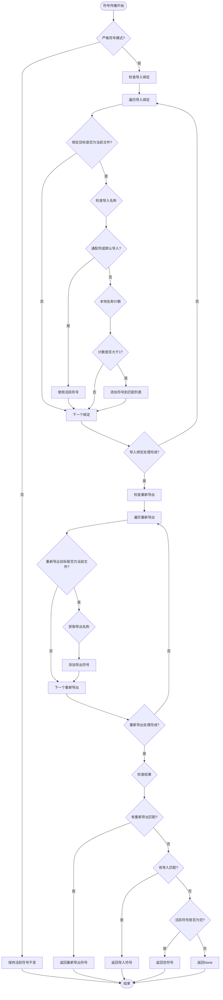
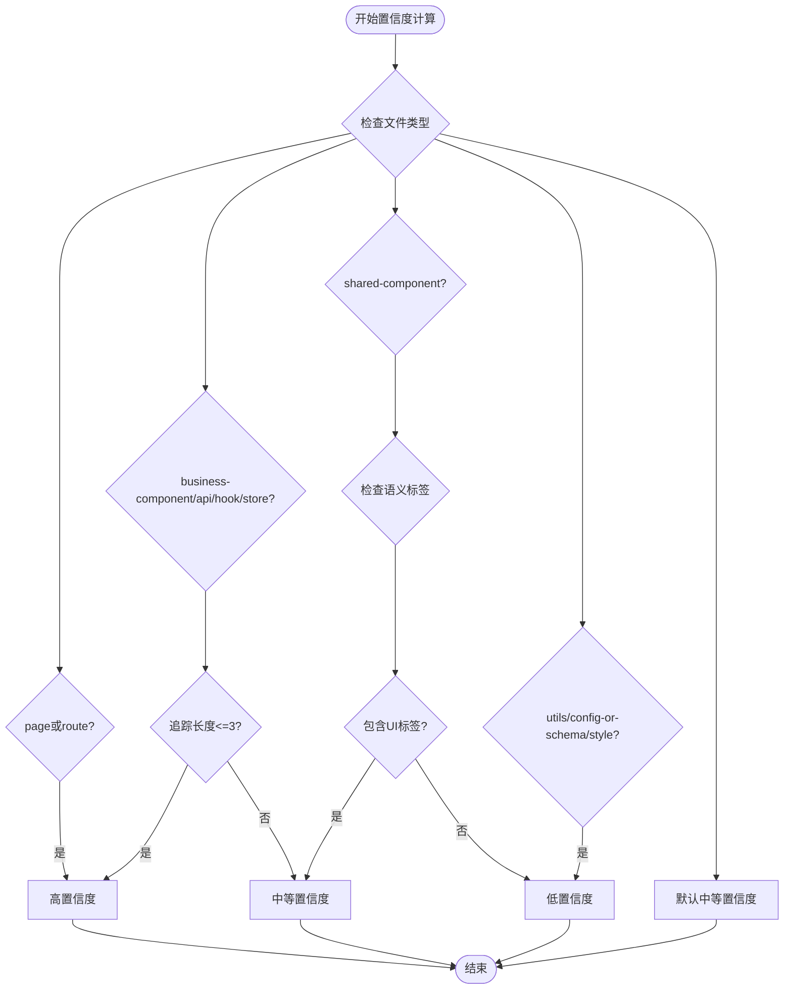
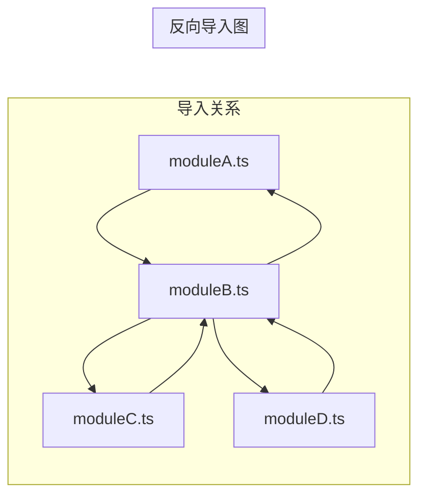
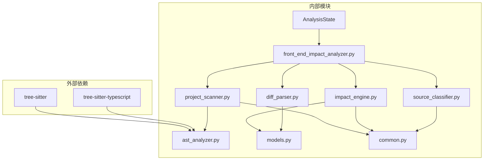

# 影响分析器

<cite>
**本文档引用的文件**
- [impact_engine.py](file://scripts/analyzer/impact_engine.py)
- [models.py](file://scripts/analyzer/models.py)
- [common.py](file://scripts/analyzer/common.py)
- [project_scanner.py](file://scripts/analyzer/project_scanner.py)
- [source_classifier.py](file://scripts/analyzer/source_classifier.py)
- [ast_analyzer.py](file://scripts/analyzer/ast_analyzer.py)
- [diff_parser.py](file://scripts/analyzer/diff_parser.py)
- [front_end_impact_analyzer.py](file://scripts/front_end_impact_analyzer.py)
- [test_impact_engine.py](file://tests/test_impact_engine.py)
- [impact-rules.md](file://references/impact-rules.md)
</cite>

## 目录
1. [简介](#简介)
2. [项目结构](#项目结构)
3. [核心组件](#核心组件)
4. [架构概览](#架构概览)
5. [详细组件分析](#详细组件分析)
6. [依赖关系分析](#依赖关系分析)
7. [性能考虑](#性能考虑)
8. [故障排除指南](#故障排除指南)
9. [结论](#结论)

## 简介

前端影响分析器是一个专门设计用于在React、React Router和Vite代码库中追踪前端变更影响的工具。该系统通过构建反向导入图、执行符号传播和置信度计算来识别受变更影响的页面和路由。

本系统的核心是`ImpactAnalyzer`类，它实现了复杂的BFS广度优先搜索算法来追踪文件变更的影响范围，同时集成了符号匹配、语义标签分析和置信度评分机制。

## 项目结构

项目采用模块化的架构设计，主要分为以下几个核心模块：



**图表来源**
- [front_end_impact_analyzer.py:56-160](file://scripts/front_end_impact_analyzer.py#L56-L160)
- [impact_engine.py:10-188](file://scripts/analyzer/impact_engine.py#L10-L188)
- [project_scanner.py:13-80](file://scripts/analyzer/project_scanner.py#L13-L80)

**章节来源**
- [front_end_impact_analyzer.py:23-160](file://scripts/front_end_impact_analyzer.py#L23-L160)
- [pyproject.toml:1-18](file://pyproject.toml#L1-L18)

## 核心组件

### ImpactAnalyzer类

`ImpactAnalyzer`是整个系统的核心组件，负责执行影响分析的主要逻辑。该类接收项目扫描结果，包括导入关系、反向导入图、页面列表、路由信息和AST事实。

#### 主要职责
- 执行BFS广度优先搜索来追踪变更影响
- 实现符号传播机制来匹配导入导出绑定
- 计算置信度评分和影响原因
- 生成PageImpact结果对象

#### 关键属性
- `imports`: 正向导入映射
- `reverse_imports`: 反向导入映射
- `pages`: 页面文件列表
- `routes`: 路由信息列表
- `ast_facts`: AST分析结果字典
- `route_map`: 路由路径到页面的映射

**章节来源**
- [impact_engine.py:10-18](file://scripts/analyzer/impact_engine.py#L10-L18)

### AnalysisState类

AnalysisState是系统的核心状态管理类，负责存储和管理整个分析过程中的所有数据。该类经过了重要的性能优化，新增了to_dict()方法来替代传统的dataclasses.asdict()深拷贝操作。

#### 主要职责
- 存储分析元数据（meta）
- 管理输入数据（input）
- 存储解析的Git差异（parsedDiff）
- 维护代码图结构（codeGraph）
- 管理代码影响分析结果（codeImpact）
- 存储候选影响信息（candidateImpact）
- 管理业务影响分析（businessImpact）
- 维护工作流状态（workflow）
- 存储最终输出结果（output）
- 记录进程日志（processLogs）

#### 性能优化特性

**新增to_dict()方法**：AnalysisState类新增了to_dict()方法，提供10-100倍更快的序列化性能，解决大规模代码图和AST事实结构的内存问题。

```python
def to_dict(self) -> Dict:
    """Convert to dict without the deep-copy overhead of dataclasses.asdict().

    All fields are plain dicts/lists (no nested dataclass instances),
    so a shallow field-level copy is sufficient and orders of magnitude
    faster than asdict() for large state objects.
    """
    return {f.name: getattr(self, f.name) for f in fields(self)}
```

**优化原理**：
- 使用浅拷贝而非深拷贝，避免递归遍历大型数据结构
- 直接访问字段值，减少函数调用开销
- 专门针对AnalysisState的结构特点进行优化

**章节来源**
- [models.py:115-170](file://scripts/analyzer/models.py#L115-L170)

## 架构概览

系统采用分层架构设计，从上到下分为：



**图表来源**
- [front_end_impact_analyzer.py:56-160](file://scripts/front_end_impact_analyzer.py#L56-L160)
- [impact_engine.py:26-58](file://scripts/analyzer/impact_engine.py#L26-L58)

## 详细组件分析

### BFS广度优先搜索算法

`_trace_to_pages`方法实现了核心的BFS搜索算法，用于从变更文件开始向上追踪到页面文件。

#### 算法流程



**图表来源**
- [impact_engine.py:77-105](file://scripts/analyzer/impact_engine.py#L77-L105)

#### 访问控制机制

算法使用复合访问键来避免重复访问：
- `(current_file, tuple(active_symbols), strict_symbols)`
- 确保相同的文件、符号集合和严格模式组合不会重复处理

**章节来源**
- [impact_engine.py:77-105](file://scripts/analyzer/impact_engine.py#L77-L105)

### 符号传播机制

符号传播是影响分析的核心机制，它基于AST分析结果来确定符号在导入导出链中的传递。

#### 符号传播规则



**图表来源**
- [impact_engine.py:119-162](file://scripts/analyzer/impact_engine.py#L119-L162)

#### 符号匹配策略

符号传播遵循以下匹配策略：

1. **通配符导入处理**: `import * as X` 或 `import X from module`
2. **命名导入处理**: `import {X, Y} from module`
3. **默认导入处理**: `import X from module`
4. **重新导出处理**: 支持命名和通配符重新导出

**章节来源**
- [impact_engine.py:119-162](file://scripts/analyzer/impact_engine.py#L119-L162)

### 置信度计算逻辑

置信度计算是影响分析的重要组成部分，它根据文件类型、追踪长度和语义标签来评估影响的可靠性。

#### 置信度评分标准



**图表来源**
- [impact_engine.py:173-182](file://scripts/analyzer/impact_engine.py#L173-L182)

#### 置信度指导原则

根据项目文档，置信度评分遵循以下指导原则：

- **高置信度**: 直接修改页面/路由，或追踪长度短且路由/页面绑定强
- **中等置信度**: 业务组件/钩子/存储/API追踪到具体页面
- **低置信度**: 共享组件、样式、工具函数、配置/模式或未解决的桶文件/别名间接引用

**章节来源**
- [impact_engine.py:173-182](file://scripts/analyzer/impact_engine.py#L173-L182)
- [impact-rules.md:3-6](file://references/impact-rules.md#L3-L6)

### 影响类型判断

影响类型判断基于文件类型来确定影响的性质：

#### 影响类型分类

| 文件类型 | 影响类型 | 说明 |
|---------|---------|------|
| page, route, business-component, api, hook, store | direct | 直接影响页面或路由 |
| 其他类型 | indirect | 间接影响，需要通过符号传播追踪 |

**章节来源**
- [impact_engine.py:168-171](file://scripts/analyzer/impact_engine.py#L168-L171)

### 影响原因生成机制

影响原因提供了人类可读的解释，帮助理解为什么某个文件会影响特定页面。

#### 原因生成格式

影响原因包含以下信息：
- 文件类型变更说明
- 追踪到页面的跳数
- 语义标签摘要
- 匹配的符号列表

**章节来源**
- [impact_engine.py:184-187](file://scripts/analyzer/impact_engine.py#L184-L187)

### 反向导入图的构建和使用

反向导入图是影响分析的基础数据结构，它允许从叶子节点向上追踪到根节点。

#### 构建过程



**图表来源**
- [project_scanner.py:21-74](file://scripts/analyzer/project_scanner.py#L21-L74)

#### 使用方式

反向导入图在以下场景中使用：
- 从变更文件向上追踪到页面
- 识别可能受影响的父级组件
- 支持BFS搜索算法

**章节来源**
- [project_scanner.py:21-74](file://scripts/analyzer/project_scanner.py#L21-L74)

### 页面追踪算法

页面追踪算法结合了BFS搜索和符号传播来精确定位受影响的页面。

#### 算法特点

1. **多路径追踪**: 同时追踪所有可能的导入路径
2. **符号过滤**: 在每一步都进行符号匹配和过滤
3. **去重机制**: 避免重复的追踪路径
4. **语义增强**: 结合语义标签提供更准确的影响分析

**章节来源**
- [impact_engine.py:77-105](file://scripts/analyzer/impact_engine.py#L77-L105)

## 依赖关系分析

系统采用松耦合的设计，各组件之间的依赖关系清晰明确：



**图表来源**
- [pyproject.toml:6-9](file://pyproject.toml#L6-L9)
- [front_end_impact_analyzer.py:9-20](file://scripts/front_end_impact_analyzer.py#L9-L20)

### 组件耦合度分析

- **低耦合**: ImpactAnalyzer与ProjectScanner通过标准化的数据结构交互
- **高内聚**: 每个模块专注于特定的功能领域
- **清晰边界**: 数据模型定义了明确的接口契约

**章节来源**
- [models.py:18-90](file://scripts/analyzer/models.py#L18-L90)

## 性能考虑

### 时间复杂度分析

- **BFS搜索**: O(V + E)，其中V是文件数量，E是导入关系数量
- **符号传播**: 对每个导入绑定进行常数时间检查
- **整体复杂度**: O(F × (V + E))，F为变更文件数量

### 空间复杂度分析

- **反向导入图**: O(E)
- **访问记录**: O(V × S × M)，S为平均符号数量，M为严格模式状态
- **结果存储**: O(P)，P为找到的影响路径数量

### 优化策略

1. **早期终止**: 对于格式变更直接跳过分析
2. **缓存机制**: AST分析结果的重复利用
3. **去重优化**: 复合访问键避免重复计算
4. **内存管理**: 及时释放不再使用的中间结果
5. **序列化优化**: AnalysisState类的to_dict()方法提供10-100倍更快的序列化性能

**更新** AnalysisState类的to_dict()方法显著提升了大规模分析场景下的性能表现，特别是在处理包含大量代码图和AST事实结构的状态数据时。

#### 序列化性能优化

AnalysisState类的to_dict()方法通过以下方式实现性能提升：

- **避免深拷贝**: 使用浅拷贝替代dataclasses.asdict()的深拷贝操作
- **直接字段访问**: 直接获取字段值，减少函数调用开销
- **专门优化**: 针对AnalysisState的结构特点进行定制化优化
- **内存效率**: 减少内存分配和垃圾回收压力

**章节来源**
- [models.py:162-169](file://scripts/analyzer/models.py#L162-L169)
- [front_end_impact_analyzer.py:198-217](file://scripts/front_end_impact_analyzer.py#L198-L217)

### 内存管理优化

系统在处理大型项目时采用了多项内存管理策略：

1. **状态文件剥离**: 在写入98-analysis-state.json时剥离大型字段
2. **压缩序列化**: 使用紧凑JSON格式减少I/O时间
3. **条件性数据保留**: 根据文件大小智能决定数据保留策略

**章节来源**
- [front_end_impact_analyzer.py:198-217](file://scripts/front_end_impact_analyzer.py#L198-L217)

## 故障排除指南

### 常见问题及解决方案

#### 问题1: 无法追踪到页面
**症状**: 返回置信度为"low"的原因
**原因**: 无法通过反向导入图追踪到页面
**解决方案**: 
- 检查导入语句的正确性
- 验证模块别名配置
- 确认文件路径的准确性

#### 问题2: 符号匹配失败
**症状**: `matched_symbols`为空
**原因**: 符号未在AST中找到或被过滤
**解决方案**:
- 验证符号名称的一致性
- 检查导入导出语法
- 确认文件类型分类正确

#### 问题3: 置信度过低
**症状**: 影响分析结果置信度为"low"
**原因**: 共享组件或工具函数变更
**解决方案**:
- 手动验证受影响的页面
- 结合语义标签进行人工判断
- 考虑进行深度分析

#### 问题4: 序列化性能问题
**症状**: 大型分析任务耗时过长
**原因**: 使用dataclasses.asdict()进行深拷贝
**解决方案**:
- 确保使用AnalysisState.to_dict()方法
- 检查状态文件的剥离设置
- 验证JSON序列化配置

**章节来源**
- [impact_engine.py:33-39](file://scripts/analyzer/impact_engine.py#L33-L39)
- [models.py:162-169](file://scripts/analyzer/models.py#L162-L169)

### 调试技巧

1. **启用详细日志**: 使用ProcessRecorder跟踪分析过程
2. **检查AST结果**: 验证符号提取的准确性
3. **验证导入关系**: 确认反向导入图的完整性
4. **监控内存使用**: 观察序列化过程中的内存变化
5. **单元测试**: 利用现有测试用例验证功能

**章节来源**
- [tests/test_impact_engine.py:11-85](file://tests/test_impact_engine.py#L11-L85)

## 结论

ImpactAnalyzer类实现了高效的前端变更影响分析系统，通过以下关键技术实现了准确的影响追踪：

1. **BFS广度优先搜索**: 提供完整的路径覆盖和最优解保证
2. **符号传播机制**: 基于AST分析的精确符号匹配
3. **置信度计算**: 结合多种因素的智能评分系统
4. **反向导入图**: 支持复杂的模块依赖关系追踪

**重要性能优化**：AnalysisState类的to_dict()方法显著提升了系统的整体性能，通过避免深拷贝操作，为大规模代码图和AST事实结构的序列化提供了10-100倍的性能提升，有效解决了内存使用和处理速度的问题。

该系统特别适用于React生态系统，能够准确识别页面、路由和业务组件的变更影响，为前端开发提供了强大的分析工具。通过合理的置信度评分和影响原因生成，开发者可以快速定位和验证潜在的问题区域。AnalysisState类的性能优化确保了系统在处理大型项目时仍能保持高效稳定的运行表现。