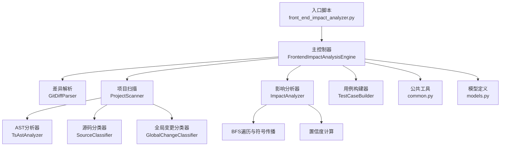
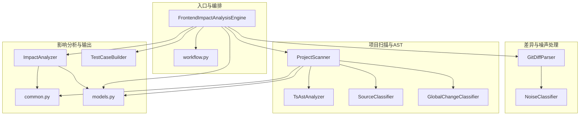
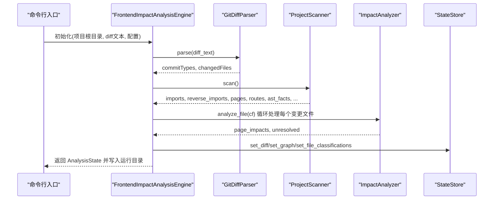
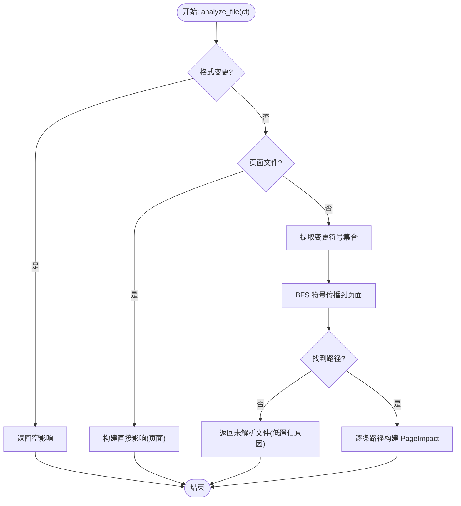
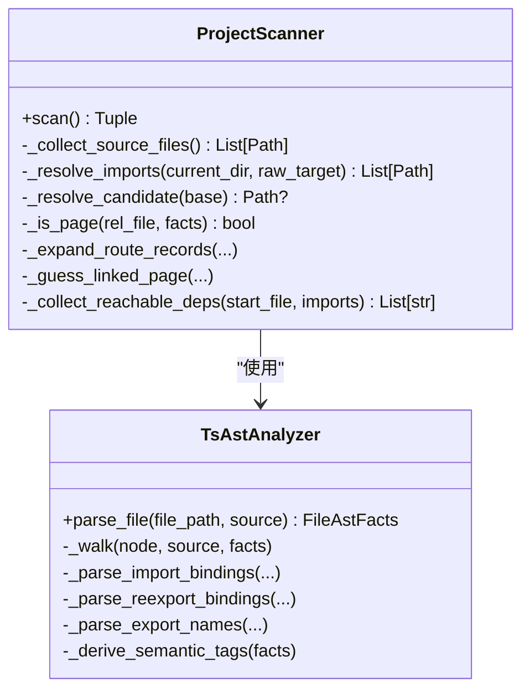
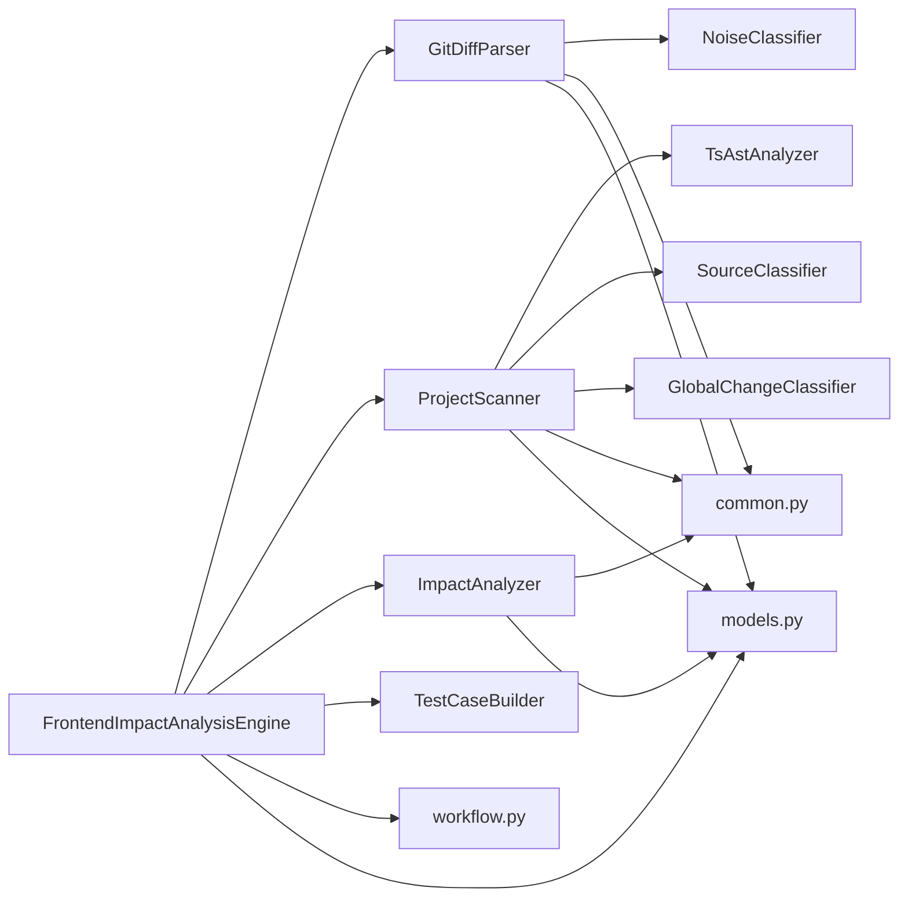

# 核心组件设计

<cite>
**本文档引用的文件**
- [scripts/front_end_impact_analyzer.py](file://scripts/front_end_impact_analyzer.py)
- [scripts/analyzer/impact_engine.py](file://scripts/analyzer/impact_engine.py)
- [scripts/analyzer/project_scanner.py](file://scripts/analyzer/project_scanner.py)
- [scripts/analyzer/case_builder.py](file://scripts/analyzer/case_builder.py)
- [scripts/analyzer/common.py](file://scripts/analyzer/common.py)
- [scripts/analyzer/models.py](file://scripts/analyzer/models.py)
- [scripts/analyzer/ast_analyzer.py](file://scripts/analyzer/ast_analyzer.py)
- [scripts/analyzer/diff_parser.py](file://scripts/analyzer/diff_parser.py)
- [scripts/analyzer/source_classifier.py](file://scripts/analyzer/source_classifier.py)
- [scripts/analyzer/global_change_classifier.py](file://scripts/analyzer/global_change_classifier.py)
- [scripts/analyzer/workflow.py](file://scripts/analyzer/workflow.py)
- [scripts/analyzer/noise_classifier.py](file://scripts/analyzer/noise_classifier.py)
- [tests/test_impact_engine.py](file://tests/test_impact_engine.py)
- [tests/test_project_scanner.py](file://tests/test_project_scanner.py)
- [pyproject.toml](file://pyproject.toml)
</cite>

## 目录
1. [简介](#简介)
2. [项目结构](#项目结构)
3. [核心组件](#核心组件)
4. [架构总览](#架构总览)
5. [详细组件分析](#详细组件分析)
6. [依赖关系分析](#依赖关系分析)
7. [性能考虑](#性能考虑)
8. [故障排查指南](#故障排查指南)
9. [结论](#结论)
10. [附录](#附录)

## 简介
本设计文档聚焦于前端影响分析系统的核心组件，围绕 FrontendImpactAnalysisEngine 主控制器的职责与协调机制展开，深入解析 ImpactAnalyzer 的影响追踪算法（BFS 遍历、符号传播与置信度计算），并系统化文档化 ProjectScanner 的项目扫描与 AST 解析能力、TestCaseBuilder 的测试用例生成策略以及公共工具模块 common 的共享功能。同时，文档给出组件间依赖关系与接口契约，提供组件类图与交互序列图，帮助读者快速理解并高效扩展该分析引擎。

## 项目结构
项目采用按功能域划分的模块化组织方式，核心分析逻辑集中在 scripts/analyzer 下，入口脚本位于 scripts/front_end_impact_analyzer.py，测试用例位于 tests 目录。关键目录与文件如下：
- 入口与编排：scripts/front_end_impact_analyzer.py
- 分析器子系统：scripts/analyzer/*.py
- 测试：tests/*.py
- 依赖声明：pyproject.toml

图表来源
- [scripts/front_end_impact_analyzer.py:23-160](file://scripts/front_end_impact_analyzer.py#L23-L160)
- [scripts/analyzer/project_scanner.py:13-80](file://scripts/analyzer/project_scanner.py#L13-L80)
- [scripts/analyzer/impact_engine.py:10-188](file://scripts/analyzer/impact_engine.py#L10-L188)
- [scripts/analyzer/case_builder.py:15-228](file://scripts/analyzer/case_builder.py#L15-L228)
- [scripts/analyzer/common.py:1-151](file://scripts/analyzer/common.py#L1-L151)
- [scripts/analyzer/models.py:18-201](file://scripts/analyzer/models.py#L18-L201)
- [scripts/analyzer/ast_analyzer.py:13-242](file://scripts/analyzer/ast_analyzer.py#L13-L242)
- [scripts/analyzer/diff_parser.py:11-110](file://scripts/analyzer/diff_parser.py#L11-L110)
- [scripts/analyzer/source_classifier.py:6-36](file://scripts/analyzer/source_classifier.py#L6-L36)
- [scripts/analyzer/global_change_classifier.py:8-90](file://scripts/analyzer/global_change_classifier.py#L8-L90)

章节来源
- [scripts/front_end_impact_analyzer.py:23-160](file://scripts/front_end_impact_analyzer.py#L23-L160)
- [pyproject.toml:1-18](file://pyproject.toml#L1-L18)

## 核心组件
本节概述各核心组件的职责与协作关系：
- FrontendImpactAnalysisEngine：主控制器，负责从差异解析到项目扫描、影响分析、中间产物构建、最终输出打包的全流程编排。
- GitDiffParser：解析 Git diff 文本，提取变更文件、语义标签、API 变更等信息，并进行噪声过滤。
- ProjectScanner：扫描项目源码，构建导入/反向导入图、页面集合、路由信息、AST 事实与别名映射，产出可用于影响分析的数据结构。
- ImpactAnalyzer：基于 BFS 的影响追踪器，结合符号传播与 AST 事实，计算到页面的传播路径与置信度。
- TestCaseBuilder：根据 PageImpact 生成测试用例模板（当前为历史参考，实际 QA 案例由 Claude 人工分析生成）。
- common：提供路径规范化、去重、TS 配置别名解析、模块名推断等通用能力。
- models：统一的状态、日志、数据模型定义，贯穿整个分析过程。
- 工作流与配置：workflow 提供配置加载、运行清单、预检、运行目录创建等基础设施。

章节来源
- [scripts/front_end_impact_analyzer.py:23-160](file://scripts/front_end_impact_analyzer.py#L23-L160)
- [scripts/analyzer/diff_parser.py:11-110](file://scripts/analyzer/diff_parser.py#L11-L110)
- [scripts/analyzer/project_scanner.py:13-80](file://scripts/analyzer/project_scanner.py#L13-L80)
- [scripts/analyzer/impact_engine.py:10-188](file://scripts/analyzer/impact_engine.py#L10-L188)
- [scripts/analyzer/case_builder.py:15-228](file://scripts/analyzer/case_builder.py#L15-L228)
- [scripts/analyzer/common.py:1-151](file://scripts/analyzer/common.py#L1-L151)
- [scripts/analyzer/models.py:18-201](file://scripts/analyzer/models.py#L18-L201)
- [scripts/analyzer/workflow.py:65-135](file://scripts/analyzer/workflow.py#L65-L135)

## 架构总览
整体架构遵循“入口编排 + 多子分析器协同”的模式。FrontendImpactAnalysisEngine 作为主控制器，串联差异解析、项目扫描、影响分析、中间产物构建与最终输出打包。各子组件通过 models 中的统一数据结构进行解耦协作。

图表来源
- [scripts/front_end_impact_analyzer.py:23-160](file://scripts/front_end_impact_analyzer.py#L23-L160)
- [scripts/analyzer/diff_parser.py:11-110](file://scripts/analyzer/diff_parser.py#L11-L110)
- [scripts/analyzer/project_scanner.py:13-80](file://scripts/analyzer/project_scanner.py#L13-L80)
- [scripts/analyzer/impact_engine.py:10-188](file://scripts/analyzer/impact_engine.py#L10-L188)
- [scripts/analyzer/case_builder.py:15-228](file://scripts/analyzer/case_builder.py#L15-L228)
- [scripts/analyzer/common.py:1-151](file://scripts/analyzer/common.py#L1-L151)
- [scripts/analyzer/models.py:18-201](file://scripts/analyzer/models.py#L18-L201)
- [scripts/analyzer/workflow.py:65-135](file://scripts/analyzer/workflow.py#L65-L135)

## 详细组件分析

### FrontendImpactAnalysisEngine 主控制器
职责与协调机制：
- 初始化配置、运行清单与预检报告，构造 AnalysisState 与 ProcessRecorder/StateStore。
- 执行完整流水线：解析差异 → 分类与噪声过滤 → 项目扫描 → 影响分析 → 中间产物构建 → 输出打包。
- 统计候选模块、页面与结构化提示，汇总诊断与覆盖率信息，生成最终分析包。

关键流程要点：
- 差异解析阶段：使用 GitDiffParser 提取变更文件与语义标签，结合 SourceClassifier 与 GlobalChangeClassifier 完成文件类型与全局影响标记。
- 项目扫描阶段：ProjectScanner 基于 TsAstAnalyzer 产出导入/反向导入图、页面集合、路由信息、AST 事实与别名映射。
- 影响分析阶段：ImpactAnalyzer 对每个变更文件执行 BFS 符号传播，计算到页面的传播路径与置信度。
- 中间产物构建阶段：构建变更聚类、文档索引、上下文收集与覆盖率统计，形成可交付给 Claude 的分析任务清单。
- 输出阶段：组装 AnalysisState 与最终结果包，写入运行目录。

图表来源
- [scripts/front_end_impact_analyzer.py:56-160](file://scripts/front_end_impact_analyzer.py#L56-L160)
- [scripts/analyzer/diff_parser.py:62-110](file://scripts/analyzer/diff_parser.py#L62-L110)
- [scripts/analyzer/project_scanner.py:20-80](file://scripts/analyzer/project_scanner.py#L20-L80)
- [scripts/analyzer/impact_engine.py:26-58](file://scripts/analyzer/impact_engine.py#L26-L58)

章节来源
- [scripts/front_end_impact_analyzer.py:23-160](file://scripts/front_end_impact_analyzer.py#L23-L160)

### ImpactAnalyzer 影响追踪算法
实现要点：
- 数据结构：保存导入图、反向导入图、页面集合、路由信息与 AST 事实，构建路由映射以支持页面到路由的关联。
- 文件级影响判定：
  - 若为格式变更，直接跳过。
  - 若为页面文件，直接生成“直接”影响。
  - 否则提取变更符号集，执行 BFS 符号传播。
- BFS 符号传播：
  - 使用队列存储(当前文件, 路径, 活跃符号, 是否严格符号)。
  - 访问键包含(文件, 活跃符号元组, 严格标志)，避免重复访问。
  - 若到达页面，记录路径与匹配符号；否则遍历反向导入父节点。
  - 符号传递规则：根据 import/reexport 绑定与标识符出现次数决定是否保留/扩展活跃符号。
- 置信度与影响原因：
  - 影响类型：页面/路由/业务组件/API/Hook/Store 等归为“直接”，其余为“间接”。
  - 置信度：页面/路由高；业务组件/API/Hook/Store 且传播深度≤3 高；共享组件按语义标签（如 form/table/modal/button）降级；工具/配置/样式低。
  - 影响原因：包含文件类型、传播步数、语义标签与命中符号等信息。

图表来源
- [scripts/analyzer/impact_engine.py:26-105](file://scripts/analyzer/impact_engine.py#L26-L105)
- [scripts/analyzer/impact_engine.py:119-162](file://scripts/analyzer/impact_engine.py#L119-L162)
- [scripts/analyzer/impact_engine.py:173-187](file://scripts/analyzer/impact_engine.py#L173-L187)

章节来源
- [scripts/analyzer/impact_engine.py:10-188](file://scripts/analyzer/impact_engine.py#L10-L188)
- [tests/test_impact_engine.py:11-85](file://tests/test_impact_engine.py#L11-L85)

### ProjectScanner 项目扫描与 AST 解析
功能要点：
- 遍历源码目录（忽略特定目录与扩展名），读取文件内容，交由 TsAstAnalyzer 解析。
- 解析导入/导出/重导出、绑定关系、组件名、Hook 名、JSX 标签与属性、路由对象、懒加载等信息。
- 构建导入图与反向导入图，识别页面与路由，提取别名映射与桶文件证据。
- 支持 tsconfig 继承与多目标别名，解析路由对象树，推断页面绑定与显示名称。
- 产出诊断信息（未解析导入、未绑定路由等）。

图表来源
- [scripts/analyzer/project_scanner.py:13-383](file://scripts/analyzer/project_scanner.py#L13-L383)
- [scripts/analyzer/ast_analyzer.py:13-242](file://scripts/analyzer/ast_analyzer.py#L13-L242)

章节来源
- [scripts/analyzer/project_scanner.py:13-383](file://scripts/analyzer/project_scanner.py#L13-L383)
- [scripts/analyzer/ast_analyzer.py:13-242](file://scripts/analyzer/ast_analyzer.py#L13-L242)
- [tests/test_project_scanner.py:8-80](file://tests/test_project_scanner.py#L8-L80)

### TestCaseBuilder 测试用例生成策略
策略说明：
- 当前为历史参考实现，不再参与主流程；最终 QA 案例需由 Claude 基于聚类上下文人工生成。
- 根据 PageImpact 的语义标签与 API 变更，生成多种用例模板（按钮、弹窗、表单、表格、API、查询、详情、删除、权限、导航、上传、禁用态等）。
- 基于业务操作推断（列表、详情、新增、编辑、删除），并生成角色变体用例。
- 去重与排序：按页面名、优先级、置信度与等级排序，保证输出稳定。

章节来源
- [scripts/analyzer/case_builder.py:15-228](file://scripts/analyzer/case_builder.py#L15-L228)

### 公共工具模块 common
共享功能：
- 路径与编码：路径规范化、相对路径计算、安全读取文本。
- 去重与标题：保持顺序的去重、文件名转标题。
- 模块名推断：从路径中抽取模块名。
- 配置别名：加载 tsconfig 的 paths，解析别名目标，支持继承与多目标。
- 常量：源码扩展名、样式扩展名、忽略目录、API 名称集合。

章节来源
- [scripts/analyzer/common.py:1-151](file://scripts/analyzer/common.py#L1-L151)

### 模型与状态管理
数据模型：
- ProcessLog/AnalysisState：记录流程日志与分析状态。
- ChangedFile/RouteInfo/FileAstFacts/PageImpact/TestCase：承载差异、路由、AST、影响与用例数据。
- StateStore：封装对 AnalysisState 的写入操作，确保状态一致性。

章节来源
- [scripts/analyzer/models.py:18-201](file://scripts/analyzer/models.py#L18-L201)

## 依赖关系分析
组件间依赖与耦合：
- FrontendImpactAnalysisEngine 依赖 GitDiffParser、ProjectScanner、ImpactAnalyzer、TestCaseBuilder、common、models、workflow。
- ProjectScanner 依赖 TsAstAnalyzer、SourceClassifier、GlobalChangeClassifier、common、models。
- ImpactAnalyzer 依赖 common、models。
- GitDiffParser 依赖 NoiseClassifier、common、models。
- TestCaseBuilder 依赖 common、models。
- workflow 提供配置与运行时基础设施。

图表来源
- [scripts/front_end_impact_analyzer.py:23-160](file://scripts/front_end_impact_analyzer.py#L23-L160)
- [scripts/analyzer/project_scanner.py:13-80](file://scripts/analyzer/project_scanner.py#L13-L80)
- [scripts/analyzer/impact_engine.py:10-188](file://scripts/analyzer/impact_engine.py#L10-L188)
- [scripts/analyzer/case_builder.py:15-228](file://scripts/analyzer/case_builder.py#L15-L228)
- [scripts/analyzer/workflow.py:65-135](file://scripts/analyzer/workflow.py#L65-L135)

章节来源
- [scripts/front_end_impact_analyzer.py:23-160](file://scripts/front_end_impact_analyzer.py#L23-L160)
- [scripts/analyzer/project_scanner.py:13-80](file://scripts/analyzer/project_scanner.py#L13-L80)
- [scripts/analyzer/impact_engine.py:10-188](file://scripts/analyzer/impact_engine.py#L10-L188)
- [scripts/analyzer/case_builder.py:15-228](file://scripts/analyzer/case_builder.py#L15-L228)
- [scripts/analyzer/workflow.py:65-135](file://scripts/analyzer/workflow.py#L65-L135)

## 性能考虑
- BFS 符号传播剪枝：通过访问键避免重复探索，减少重复计算。
- 符号传递优化：仅在标识符计数大于阈值或通配导入时扩展活跃符号，降低符号爆炸。
- 扫描阶段去重与顺序保持：导入/反向导入、页面、别名等均使用去重与顺序保持策略，避免冗余。
- 路由绑定与可达性：先收集可达依赖再推断页面绑定，减少无效搜索。
- I/O 与解析：批量读取文件内容，AST 解析按文件粒度进行，避免不必要的重复解析。

## 故障排查指南
常见问题与定位建议：
- 预检阻塞：若预检报告 status 为 blocked，检查仓库 Wiki、需求与规范目录是否存在，按 blockingActions 提示创建或生成。
- 未解析导入：ProjectScanner 在诊断中记录“unresolved-import”，检查别名配置与目标路径是否正确。
- 未绑定路由：记录“unbound-route”，检查路由对象中的 path/component/lazy 字段与页面可达性。
- 影响分析为空：若为格式变更或噪声文件，NoiseClassifier 会标记不应分析；检查 shouldAnalyze 与逻辑变更评分。
- 状态写入失败：确认输出目录可写，运行目录创建逻辑正常。

章节来源
- [scripts/front_end_impact_analyzer.py:314-359](file://scripts/front_end_impact_analyzer.py#L314-L359)
- [scripts/analyzer/project_scanner.py:193-200](file://scripts/analyzer/project_scanner.py#L193-L200)
- [scripts/analyzer/noise_classifier.py:37-80](file://scripts/analyzer/noise_classifier.py#L37-L80)

## 结论
本设计文档系统化梳理了前端影响分析引擎的核心组件与交互机制。FrontendImpactAnalysisEngine 作为主控制器，将差异解析、项目扫描、影响分析与中间产物构建有机整合；ImpactAnalyzer 的 BFS 符号传播与置信度计算提供了稳健的影响追踪能力；ProjectScanner 通过 AST 解析与路由推断，为分析提供高质量的代码图谱。公共工具模块 common 提供跨组件的通用能力，模型与状态管理确保分析过程的可观测与可追溯。建议在后续迭代中进一步优化符号传播的启发式规则与性能指标，增强对复杂路由与别名场景的鲁棒性。

## 附录
- 依赖声明：项目依赖 tree-sitter 与 tree-sitter-typescript，要求 Python 3.12+。
- 测试覆盖：测试用例验证共享组件到页面的传播、符号过滤与格式变更跳过等关键行为。

章节来源
- [pyproject.toml:1-18](file://pyproject.toml#L1-L18)
- [tests/test_impact_engine.py:11-85](file://tests/test_impact_engine.py#L11-L85)
- [tests/test_project_scanner.py:8-80](file://tests/test_project_scanner.py#L8-L80)