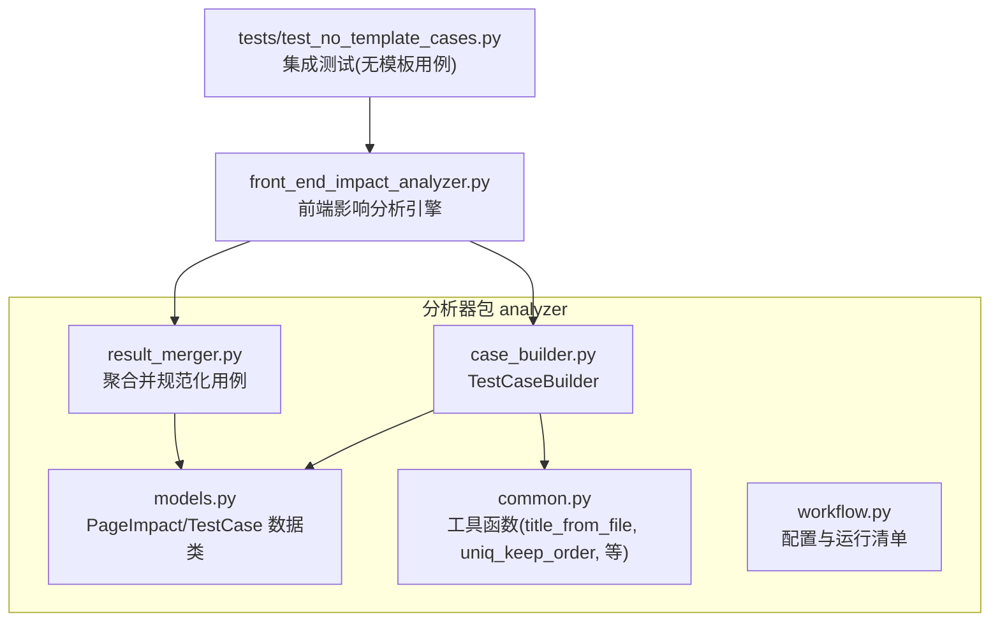
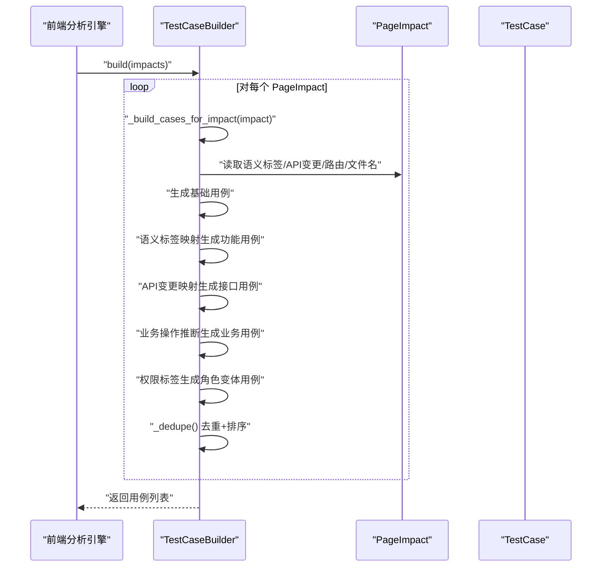
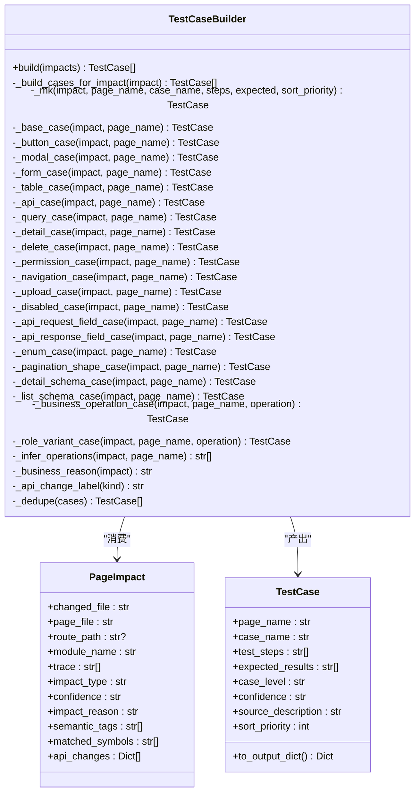
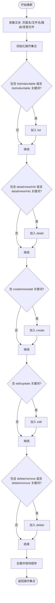
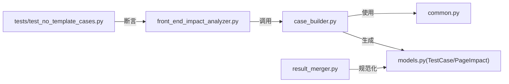

# 测试用例生成器

<cite>
**本文引用的文件**
- [scripts/analyzer/case_builder.py](file://scripts/analyzer/case_builder.py)
- [scripts/analyzer/models.py](file://scripts/analyzer/models.py)
- [scripts/analyzer/common.py](file://scripts/analyzer/common.py)
- [scripts/front_end_impact_analyzer.py](file://scripts/front_end_impact_analyzer.py)
- [scripts/analyzer/result_merger.py](file://scripts/analyzer/result_merger.py)
- [tests/test_no_template_cases.py](file://tests/test_no_template_cases.py)
- [tests/test_integration_output.py](file://tests/test_integration_output.py)
- [fixtures/sample_app/src/pages/users/UserListPage.tsx](file://fixtures/sample_app/src/pages/users/UserListPage.tsx)
- [fixtures/sample_app/src/components/shared/SearchForm.tsx](file://fixtures/sample_app/src/components/shared/SearchForm.tsx)
</cite>

## 目录
1. [简介](#简介)
2. [项目结构](#项目结构)
3. [核心组件](#核心组件)
4. [架构总览](#架构总览)
5. [详细组件分析](#详细组件分析)
6. [依赖分析](#依赖分析)
7. [性能考虑](#性能考虑)
8. [故障排查指南](#故障排查指南)
9. [结论](#结论)
10. [附录](#附录)

## 简介
本文件面向“测试用例生成器”组件，系统化阐述 TestCaseBuilder 类的测试用例生成策略与实现细节。该组件用于从页面影响分析结果中生成结构化的测试用例，覆盖基础用例、业务场景用例、API 变更用例以及权限验证用例等类型。尽管该模块在当前主流程中已标记为历史参考（不再直接生成模板用例），但其模板系统、参数注入逻辑与排序去重算法仍具备重要参考价值。

## 项目结构
测试用例生成器位于 analyzer 包内，与模型定义、通用工具、前端分析引擎及结果合并器共同组成完整的分析流水线。

图表来源
- [scripts/analyzer/case_builder.py:15-228](file://scripts/analyzer/case_builder.py#L15-L228)
- [scripts/analyzer/models.py:77-112](file://scripts/analyzer/models.py#L77-L112)
- [scripts/analyzer/common.py:47-71](file://scripts/analyzer/common.py#L47-L71)
- [scripts/front_end_impact_analyzer.py:56-160](file://scripts/front_end_impact_analyzer.py#L56-L160)
- [scripts/analyzer/result_merger.py:12-90](file://scripts/analyzer/result_merger.py#L12-L90)

章节来源
- [scripts/analyzer/case_builder.py:1-228](file://scripts/analyzer/case_builder.py#L1-L228)
- [scripts/analyzer/models.py:1-201](file://scripts/analyzer/models.py#L1-L201)
- [scripts/analyzer/common.py:1-151](file://scripts/analyzer/common.py#L1-L151)
- [scripts/front_end_impact_analyzer.py:1-403](file://scripts/front_end_impact_analyzer.py#L1-L403)
- [scripts/analyzer/result_merger.py:1-217](file://scripts/analyzer/result_merger.py#L1-L217)

## 核心组件
- TestCaseBuilder：根据页面影响(PageImpact)生成多类型测试用例，内置语义标签到用例类型的映射、业务操作推断、API 变更专项用例生成、角色变体用例生成与去重排序。
- PageImpact/TestCase：承载输入影响与输出用例的数据结构，支持导出为标准字典格式。
- 工具函数：标题化、去重、置信度到优先级映射等。

章节来源
- [scripts/analyzer/case_builder.py:15-228](file://scripts/analyzer/case_builder.py#L15-L228)
- [scripts/analyzer/models.py:77-112](file://scripts/analyzer/models.py#L77-L112)
- [scripts/analyzer/common.py:37-71](file://scripts/analyzer/common.py#L37-L71)

## 架构总览
TestCaseBuilder 的生成流程围绕 PageImpact 展开：先构建基础用例，再依据语义标签映射生成功能型用例，随后根据 API 变更种类生成接口型用例，最后结合业务操作推断与权限标签生成业务与权限用例，并进行去重与排序。

图表来源
- [scripts/analyzer/case_builder.py:16-64](file://scripts/analyzer/case_builder.py#L16-L64)
- [scripts/analyzer/case_builder.py:209-227](file://scripts/analyzer/case_builder.py#L209-L227)

章节来源
- [scripts/analyzer/case_builder.py:15-228](file://scripts/analyzer/case_builder.py#L15-L228)

## 详细组件分析

### TestCaseBuilder 类
- 输入：页面影响列表(List[PageImpact])
- 输出：去重并排序后的测试用例列表(List[TestCase])
- 关键方法：
  - build：聚合所有影响的用例
  - _build_cases_for_impact：按标签与 API 变更生成用例组
  - 各类用例生成器：基础、按钮、弹窗、表单、表格、接口、查询、详情、删除、权限、导航、上传、禁用态、API 请求/响应字段、枚举、分页形状、详情/列表结构
  - _business_operation_case：基于推断的业务操作生成主流程用例
  - _role_variant_case：生成角色差异用例
  - _infer_operations：从页面/路由/文件名文本中推断业务操作(list/detail/create/edit/delete)
  - _business_reason/_api_change_label：生成来源描述与接口风险标签
  - _dedupe：按页面名、优先级、置信度排序并去重

图表来源
- [scripts/analyzer/case_builder.py:15-228](file://scripts/analyzer/case_builder.py#L15-L228)
- [scripts/analyzer/models.py:77-112](file://scripts/analyzer/models.py#L77-L112)

章节来源
- [scripts/analyzer/case_builder.py:15-228](file://scripts/analyzer/case_builder.py#L15-L228)
- [scripts/analyzer/models.py:77-112](file://scripts/analyzer/models.py#L77-L112)

### 用例模板系统与生成逻辑
- 基础用例：页面基础回归，覆盖页面加载、初始化渲染与错误提示。
- 功能型用例：通过语义标签映射生成，如按钮、弹窗、表单、表格、查询、详情、删除、导航、上传、禁用态等。
- API 变更用例：针对请求字段、响应字段、枚举、分页形状、详情/列表结构等变更生成专项用例。
- 业务场景用例：基于推断的业务操作(list/detail/create/edit/delete)，生成主流程用例。
- 权限验证用例：当存在 permission 标签或操作时，生成角色差异用例，覆盖不同角色下的可见性与可操作性。

章节来源
- [scripts/analyzer/case_builder.py:22-64](file://scripts/analyzer/case_builder.py#L22-L64)
- [scripts/analyzer/case_builder.py:83-121](file://scripts/analyzer/case_builder.py#L83-L121)
- [scripts/analyzer/case_builder.py:123-152](file://scripts/analyzer/case_builder.py#L123-L152)

### 参数注入与来源描述
- 来源描述由业务原因、路由路径、变更文件等拼接而成，便于追溯用例来源。
- 置信度映射为用例等级，排序优先级用于稳定输出顺序。

章节来源
- [scripts/analyzer/case_builder.py:66-81](file://scripts/analyzer/case_builder.py#L66-L81)
- [scripts/analyzer/common.py:70-71](file://scripts/analyzer/common.py#L70-L71)

### 代码生成算法与去重排序
- 去重：以(页面名, 用例名)为键，保持首次出现顺序。
- 排序：按页面名、排序优先级、用例等级、置信度、用例名排序，确保输出稳定且可读。

章节来源
- [scripts/analyzer/case_builder.py:209-227](file://scripts/analyzer/case_builder.py#L209-L227)

### 业务操作推断
- 通过页面名、文件名、路由路径与文本关键词匹配，推断业务操作集合(list/detail/create/edit/delete)，并去重保持顺序。

图表来源
- [scripts/analyzer/case_builder.py:154-175](file://scripts/analyzer/case_builder.py#L154-L175)

章节来源
- [scripts/analyzer/case_builder.py:154-175](file://scripts/analyzer/case_builder.py#L154-L175)

### 用例类型分类与生成规则
- 基础用例：始终生成，覆盖页面加载与初始化。
- 功能型用例：按语义标签映射生成，如 button/modal/form/table/list-query/detail/delete/navigation/upload/disabled-state/route。
- API 变更用例：按 api_changes 中的 kind 映射生成，如 request-field-change/response-field-change/enum-change/pagination-shape-change/detail-schema-change/list-schema-change。
- 业务场景用例：基于推断操作生成 list/detail/create/edit/delete 主流程用例。
- 权限验证用例：当存在 permission 标签或操作时，生成角色差异用例，覆盖不同角色下的可见性与可操作性。

章节来源
- [scripts/analyzer/case_builder.py:27-43](file://scripts/analyzer/case_builder.py#L27-L43)
- [scripts/analyzer/case_builder.py:47-58](file://scripts/analyzer/case_builder.py#L47-L58)
- [scripts/analyzer/case_builder.py:123-152](file://scripts/analyzer/case_builder.py#L123-L152)

### 定制化选项
- 语义标签映射：可在映射表中增加新的标签与用例生成器绑定。
- API 变更映射：可在 API 映射表中增加新的 kind 与用例生成器绑定。
- 排序优先级：可通过 sort_priority 调整用例排序权重。
- 来源描述：可通过 _business_reason 扩展来源信息字段。

章节来源
- [scripts/analyzer/case_builder.py:27-58](file://scripts/analyzer/case_builder.py#L27-L58)
- [scripts/analyzer/case_builder.py:66-81](file://scripts/analyzer/case_builder.py#L66-L81)
- [scripts/analyzer/case_builder.py:177-196](file://scripts/analyzer/case_builder.py#L177-L196)

### 实际生成示例与最佳实践
- 示例场景：共享搜索表单(SearchForm)与用户列表(UserListPage)组合，可能产生“表单提交”“按钮点击”“列表加载”“禁用态”等用例。
- 最佳实践：
  - 在 PageImpact 中准确标注语义标签与 API 变更，提升用例覆盖面。
  - 使用稳定的页面名与路由路径，便于来源描述与排序。
  - 控制用例粒度，避免重复与冗余，优先覆盖关键业务路径与异常分支。
  - 结合权限标签与业务操作推断，补充角色差异与主流程用例。

章节来源
- [fixtures/sample_app/src/pages/users/UserListPage.tsx:1-14](file://fixtures/sample_app/src/pages/users/UserListPage.tsx#L1-L14)
- [fixtures/sample_app/src/components/shared/SearchForm.tsx:1-9](file://fixtures/sample_app/src/components/shared/SearchForm.tsx#L1-L9)
- [scripts/analyzer/case_builder.py:89-90](file://scripts/analyzer/case_builder.py#L89-L90)
- [scripts/analyzer/case_builder.py:123-134](file://scripts/analyzer/case_builder.py#L123-L134)

## 依赖分析
- TestCaseBuilder 依赖 PageImpact 与 TestCase 数据结构，依赖 common 中的标题化与去重工具。
- 前端分析引擎在主流程中跳过模板用例生成，仅输出“需要 Claude 聚合”的中间产物；最终用例由结果合并器从 cluster-analysis 文件规范化而来。
- 测试用例验证了主流程不生成模板用例的行为。

图表来源
- [scripts/analyzer/case_builder.py:11-12](file://scripts/analyzer/case_builder.py#L11-L12)
- [scripts/analyzer/common.py:47-71](file://scripts/analyzer/common.py#L47-L71)
- [scripts/analyzer/models.py:77-112](file://scripts/analyzer/models.py#L77-L112)
- [scripts/front_end_impact_analyzer.py:146-148](file://scripts/front_end_impact_analyzer.py#L146-L148)
- [scripts/analyzer/result_merger.py:12-90](file://scripts/analyzer/result_merger.py#L12-L90)
- [tests/test_no_template_cases.py:8-21](file://tests/test_no_template_cases.py#L8-L21)

章节来源
- [scripts/analyzer/case_builder.py:1-228](file://scripts/analyzer/case_builder.py#L1-L228)
- [scripts/analyzer/models.py:1-201](file://scripts/analyzer/models.py#L1-L201)
- [scripts/analyzer/common.py:1-151](file://scripts/analyzer/common.py#L1-L151)
- [scripts/front_end_impact_analyzer.py:146-148](file://scripts/front_end_impact_analyzer.py#L146-L148)
- [scripts/analyzer/result_merger.py:1-217](file://scripts/analyzer/result_merger.py#L1-L217)
- [tests/test_no_template_cases.py:1-21](file://tests/test_no_template_cases.py#L1-L21)

## 性能考虑
- 时间复杂度：对每个 PageImpact 生成若干用例，整体复杂度近似 O(N×K)，其中 N 为影响数量，K 为平均标签与 API 变更数量。
- 空间复杂度：存储用例列表与去重集合，空间复杂度 O(N×K)。
- 优化建议：
  - 减少不必要的标签与 API 变更种类，降低映射分支数。
  - 在生成前对 PageImpact 做预过滤，剔除低置信度或无关影响。
  - 并行化生成过程（需注意去重与排序的线程安全）。

## 故障排查指南
- 无模板用例生成：当前主流程会跳过模板用例生成，断言 cases/fallbackCases 为空，processLogs 中记录“build_cases”被跳过。
- 来源描述缺失：若缺少路由路径、变更文件或影响原因，来源描述可能不完整，影响可追溯性。
- 用例重复：若页面名或用例名重复，会被去重；请检查生成器映射与输入数据。
- 权限与业务用例缺失：当未检测到 permission 标签或无法推断业务操作时，不会生成相应用例。

章节来源
- [scripts/front_end_impact_analyzer.py:146-148](file://scripts/front_end_impact_analyzer.py#L146-L148)
- [tests/test_no_template_cases.py:8-21](file://tests/test_no_template_cases.py#L8-L21)
- [scripts/analyzer/case_builder.py:66-81](file://scripts/analyzer/case_builder.py#L66-L81)
- [scripts/analyzer/case_builder.py:209-227](file://scripts/analyzer/case_builder.py#L209-L227)

## 结论
TestCaseBuilder 提供了完善的测试用例模板系统与生成逻辑，能够从页面影响中自动派生多种类型的用例。尽管当前主流程不再直接生成模板用例，但其设计思想与实现细节仍可作为后续用例生成与规范化流程的重要参考。通过合理利用语义标签、API 变更与业务操作推断，可显著提升用例覆盖率与质量。

## 附录
- 数据模型字段说明
  - PageImpact：包含变更文件、页面文件、路由路径、模块名、影响原因、置信度、语义标签、匹配符号、API 变更等。
  - TestCase：包含页面名、用例名、测试步骤、预期结果、用例等级、置信度、来源描述、排序优先级，并支持导出为标准字典格式。

章节来源
- [scripts/analyzer/models.py:77-112](file://scripts/analyzer/models.py#L77-L112)