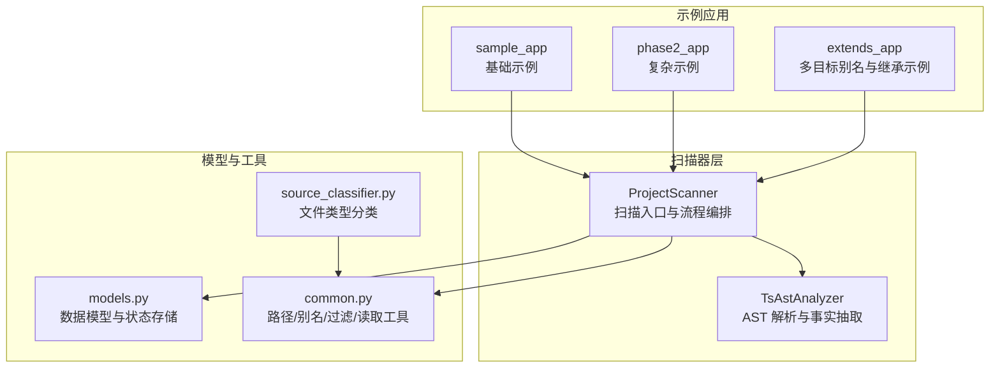
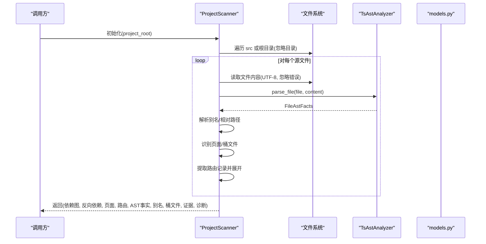
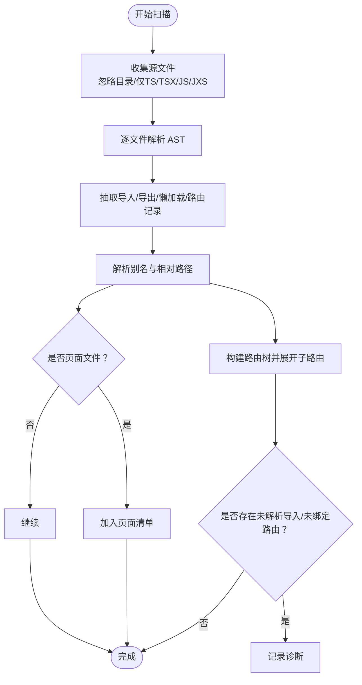
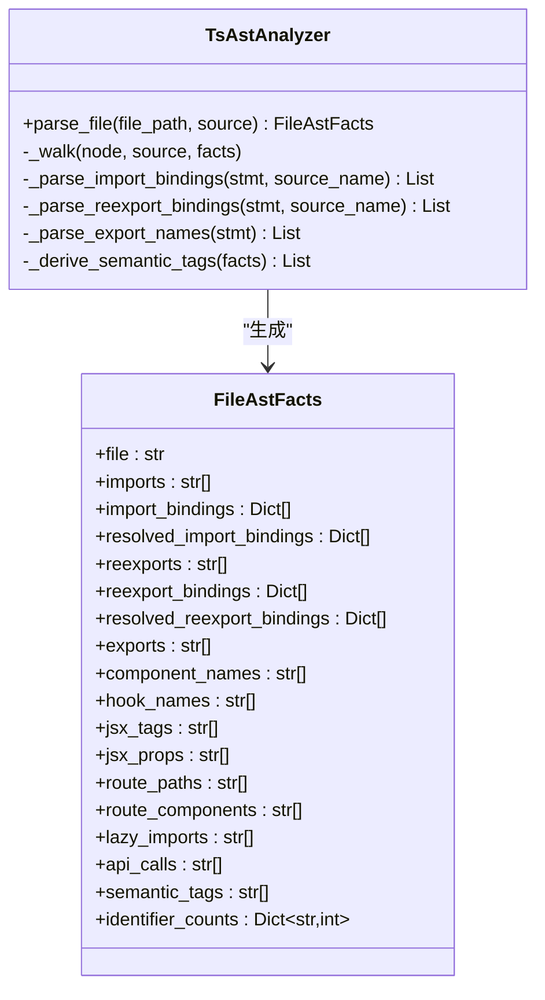
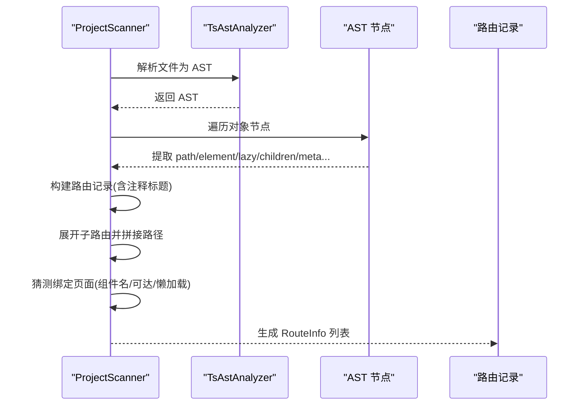
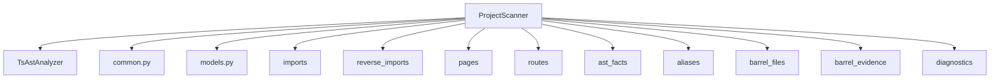

# 项目扫描器

<cite>
**本文引用的文件**
- [scripts/analyzer/project_scanner.py](file://scripts/analyzer/project_scanner.py)
- [scripts/analyzer/ast_analyzer.py](file://scripts/analyzer/ast_analyzer.py)
- [scripts/analyzer/models.py](file://scripts/analyzer/models.py)
- [scripts/analyzer/common.py](file://scripts/analyzer/common.py)
- [scripts/analyzer/source_classifier.py](file://scripts/analyzer/source_classifier.py)
- [tests/test_project_scanner.py](file://tests/test_project_scanner.py)
- [fixtures/sample_app/src/routes/index.tsx](file://fixtures/sample_app/src/routes/index.tsx)
- [fixtures/sample_app/src/pages/users/UserListPage.tsx](file://fixtures/sample_app/src/pages/users/UserListPage.tsx)
- [fixtures/sample_app/src/components/shared/SearchForm.tsx](file://fixtures/sample_app/src/components/shared/SearchForm.tsx)
- [fixtures/phase2_app/src/routes/index.tsx](file://fixtures/phase2_app/src/routes/index.tsx)
- [fixtures/phase2_app/src/pages/index.ts](file://fixtures/phase2_app/src/pages/index.ts)
- [fixtures/phase2_app/src/pages/reports/index.ts](file://fixtures/phase2_app/src/pages/reports/index.ts)
- [fixtures/sample_app/tsconfig.json](file://fixtures/sample_app/tsconfig.json)
- [fixtures/extends_app/tsconfig.json](file://fixtures/extends_app/tsconfig.json)
- [fixtures/extends_app/tsconfig.base.json](file://fixtures/extends_app/tsconfig.base.json)
</cite>

## 目录
1. [简介](#简介)
2. [项目结构](#项目结构)
3. [核心组件](#核心组件)
4. [架构总览](#架构总览)
5. [详细组件分析](#详细组件分析)
6. [依赖关系分析](#依赖关系分析)
7. [性能考量](#性能考量)
8. [故障排查指南](#故障排查指南)
9. [结论](#结论)
10. [附录](#附录)

## 简介
本文件系统性地文档化“项目扫描器”组件，重点围绕 ProjectScanner 类的项目结构扫描能力，涵盖文件发现、类型分类、AST 解析与路由识别流程；解释如何识别页面文件、路由配置、业务组件与共享模块；并给出扫描过程中的文件过滤规则、路径解析逻辑、依赖关系提取机制、扫描配置选项、性能优化策略与错误处理机制。同时提供基于仓库中示例应用的实际扫描示例与输出格式说明。

## 项目结构
项目采用按功能分层的组织方式：扫描器负责遍历源码、解析 AST 并抽取依赖与路由信息；公共工具模块提供路径规范化、别名解析、忽略目录与扩展名等通用能力；模型定义了扫描产物的数据结构；测试用例覆盖典型场景与边界情况。

图表来源
- [scripts/analyzer/project_scanner.py:13-80](file://scripts/analyzer/project_scanner.py#L13-L80)
- [scripts/analyzer/ast_analyzer.py:13-30](file://scripts/analyzer/ast_analyzer.py#L13-L30)
- [scripts/analyzer/models.py:43-75](file://scripts/analyzer/models.py#L43-L75)
- [scripts/analyzer/common.py:8-151](file://scripts/analyzer/common.py#L8-L151)
- [scripts/analyzer/source_classifier.py:6-36](file://scripts/analyzer/source_classifier.py#L6-L36)

章节来源
- [scripts/analyzer/project_scanner.py:13-80](file://scripts/analyzer/project_scanner.py#L13-L80)
- [scripts/analyzer/ast_analyzer.py:13-30](file://scripts/analyzer/ast_analyzer.py#L13-L30)
- [scripts/analyzer/models.py:43-75](file://scripts/analyzer/models.py#L43-L75)
- [scripts/analyzer/common.py:8-151](file://scripts/analyzer/common.py#L8-L151)
- [scripts/analyzer/source_classifier.py:6-36](file://scripts/analyzer/source_classifier.py#L6-L36)

## 核心组件
- ProjectScanner：扫描入口，负责收集源文件、逐文件解析 AST、提取导入/导出/懒加载/路由记录、解析别名与相对路径、识别页面文件、构建路由树、生成诊断信息与扫描图谱。
- TsAstAnalyzer：基于 Tree-sitter 的 TypeScript/TSX 解析器，抽取导入绑定、组件名、JSX 标签与属性、路由路径/组件/懒加载、API 调用、语义标签等。
- models：定义 RouteInfo、FileAstFacts 等数据结构，用于承载扫描结果与中间事实。
- common：提供扩展名集合、忽略目录集合、API 名称集合、路径规范化、相对路径计算、安全读取、去重保持顺序、模块名推断、tsconfig 别名加载与解析等。
- source_classifier：对文件进行粗粒度类型分类（页面、路由、业务组件、共享组件、样式、工具等）。

章节来源
- [scripts/analyzer/project_scanner.py:13-80](file://scripts/analyzer/project_scanner.py#L13-L80)
- [scripts/analyzer/ast_analyzer.py:13-242](file://scripts/analyzer/ast_analyzer.py#L13-L242)
- [scripts/analyzer/models.py:43-75](file://scripts/analyzer/models.py#L43-L75)
- [scripts/analyzer/common.py:8-151](file://scripts/analyzer/common.py#L8-L151)
- [scripts/analyzer/source_classifier.py:6-36](file://scripts/analyzer/source_classifier.py#L6-L36)

## 架构总览
下图展示从扫描入口到输出产物的整体流程：ProjectScanner 遍历源码 → 读取内容 → AST 解析 → 抽取导入/导出/懒加载/路由记录 → 解析别名与相对路径 → 识别页面 → 构建路由树 → 产出依赖图、页面清单、路由清单、AST 事实、别名映射、桶文件证据与诊断。

图表来源
- [scripts/analyzer/project_scanner.py:20-80](file://scripts/analyzer/project_scanner.py#L20-L80)
- [scripts/analyzer/ast_analyzer.py:18-30](file://scripts/analyzer/ast_analyzer.py#L18-L30)
- [scripts/analyzer/models.py:43-75](file://scripts/analyzer/models.py#L43-L75)

## 详细组件分析

### ProjectScanner 扫描流程与关键方法
- 扫描入口 scan：初始化容器，遍历源文件，逐个解析 AST，抽取导入/导出/懒加载/路由记录，解析别名与相对路径，构建依赖图与反向依赖，识别页面与桶文件，提取路由并展开为 RouteInfo 列表，最终返回完整扫描图谱。
- 文件收集 _collect_source_files：在 src 存在时优先扫描 src，否则扫描项目根；忽略指定目录；仅收集受支持扩展名的文件。
- 路径解析 _resolve_imports/_resolve_candidate：支持相对路径与别名；对候选路径尝试多种扩展名与 index.* 形式；返回首个存在的文件路径。
- 页面识别 _is_page：判断是否位于 pages 或 views 目录，并且存在组件名或 JSX 标签。
- 路由记录提取 _extract_route_records/_collect_route_objects/_build_route_record：基于 AST 遍历对象节点，提取 path、element/component、lazy、children、meta/name/title 等字段，支持注释标题推断与最近注释收集。
- 路由展开 _append_route_record/_expand_route_records：递归展开子路由，拼接父子路径，猜测绑定页面（基于组件名、可达页面、懒加载目标），生成 RouteInfo 并记录置信度。
- 路由路径拼接 _join_route_paths：处理绝对/相对路径与重复斜杠。
- 可达依赖收集 _collect_reachable_deps：基于导入图做广度优先收集。
- 未绑定路由诊断：当存在 path 但无法绑定到页面时，记录 unbound-route 诊断。
- 未解析导入诊断：当别名/相对路径无法解析到具体文件时，记录 unresolved-import 诊断。

图表来源
- [scripts/analyzer/project_scanner.py:82-127](file://scripts/analyzer/project_scanner.py#L82-L127)
- [scripts/analyzer/project_scanner.py:128-228](file://scripts/analyzer/project_scanner.py#L128-L228)

章节来源
- [scripts/analyzer/project_scanner.py:20-80](file://scripts/analyzer/project_scanner.py#L20-L80)
- [scripts/analyzer/project_scanner.py:82-127](file://scripts/analyzer/project_scanner.py#L82-L127)
- [scripts/analyzer/project_scanner.py:128-228](file://scripts/analyzer/project_scanner.py#L128-L228)

### AST 解析与事实抽取（TsAstAnalyzer）
- 解析器选择：根据文件扩展名选择 TS 或 TSX 解析器。
- 导入/导出：提取 import/re-export 语句的目标与命名绑定；支持默认、命名与命名空间导入/导出。
- 组件与 Hook：识别函数声明与变量声明中的组件名与以 use 开头的 Hook 名。
- JSX：记录 JSX 标签与属性，用于语义标签推断。
- 路由：从对象字面量中提取 path、element/component、lazy 等键值。
- API 调用：匹配常见 API 名称集合，记录调用片段。
- 语义标签：综合 JSX 标签、属性与 API 调用，推断按钮、模态框、表单、表格、上传、禁用状态、路由、API、列表查询、提交、删除、详情、状态等标签。
- 去重与排序：对各类事实进行去重并保持顺序。

图表来源
- [scripts/analyzer/ast_analyzer.py:13-242](file://scripts/analyzer/ast_analyzer.py#L13-L242)
- [scripts/analyzer/models.py:56-75](file://scripts/analyzer/models.py#L56-L75)

章节来源
- [scripts/analyzer/ast_analyzer.py:13-242](file://scripts/analyzer/ast_analyzer.py#L13-L242)
- [scripts/analyzer/models.py:56-75](file://scripts/analyzer/models.py#L56-L75)

### 路由识别与绑定（ProjectScanner）
- 路由记录提取：通过 AST 遍历对象字面量，识别 path、element/component、lazy、children、meta/name/title 等字段；支持注释标题推断。
- 路由展开：递归展开 children，拼接父子路径；根据组件名、可达页面、懒加载目标猜测绑定页面；若无法绑定则记录诊断。
- 路由路径拼接：处理绝对/相对路径与重复斜杠，保证路径规范。
- 输出：RouteInfo 列表，包含路由路径、源文件、绑定页面、组件名、父路由、置信度、显示名与来源、注释等。

图表来源
- [scripts/analyzer/project_scanner.py:238-314](file://scripts/analyzer/project_scanner.py#L238-L314)
- [scripts/analyzer/project_scanner.py:128-228](file://scripts/analyzer/project_scanner.py#L128-L228)

章节来源
- [scripts/analyzer/project_scanner.py:238-314](file://scripts/analyzer/project_scanner.py#L238-L314)
- [scripts/analyzer/project_scanner.py:128-228](file://scripts/analyzer/project_scanner.py#L128-L228)

### 文件类型分类（SourceClassifier）
- 分类依据：样式、非源文件、页面、路由、API、状态/上下文、Hook、共享组件、业务组件、工具、常量/枚举/模式等。
- 模块名推断：从路径中提取模块名，忽略 src/pages/components/features/router/routes 等层级。

章节来源
- [scripts/analyzer/source_classifier.py:6-36](file://scripts/analyzer/source_classifier.py#L6-L36)

## 依赖关系分析
- ProjectScanner 依赖：
  - TsAstAnalyzer：用于 AST 解析与事实抽取。
  - common：提供扩展名、忽略目录、API 名称、路径工具、别名加载与解析、安全读取、去重等。
  - models：使用 RouteInfo、FileAstFacts 等数据结构承载扫描结果。
- 依赖图谱：
  - 依赖图 imports：每个文件的直接依赖列表。
  - 反向依赖 reverse_imports：每个文件被哪些文件依赖。
  - 页面 pages：位于 pages/views 目录且包含组件/JSX 的文件。
  - 路由 routes：由路由记录展开生成的 RouteInfo 列表。
  - AST 事实 ast_facts：每文件的解析事实。
  - 别名 aliases：tsconfig 别名映射。
  - 桶文件 barrel_files 与证据 barrel_evidence：导出 reexports 的文件及其依赖证据。
  - 诊断 diagnostics：未解析导入与未绑定路由等问题。

图表来源
- [scripts/analyzer/project_scanner.py:20-80](file://scripts/analyzer/project_scanner.py#L20-L80)
- [scripts/analyzer/ast_analyzer.py:13-30](file://scripts/analyzer/ast_analyzer.py#L13-L30)
- [scripts/analyzer/models.py:43-75](file://scripts/analyzer/models.py#L43-L75)
- [scripts/analyzer/common.py:8-151](file://scripts/analyzer/common.py#L8-L151)

章节来源
- [scripts/analyzer/project_scanner.py:20-80](file://scripts/analyzer/project_scanner.py#L20-L80)

## 性能考量
- 文件遍历与过滤：仅扫描 src 或项目根目录，忽略大量常见开发目录；仅处理受支持扩展名，减少 IO 与解析成本。
- 安全读取：统一使用 UTF-8 读取并忽略解码错误，避免异常中断。
- 去重与顺序：对导入、导出、组件名、JSX 标签等进行去重并保持顺序，降低后续处理负担。
- 路由展开：递归展开子路由时，先收集可达页面再进行猜测绑定，避免重复计算。
- 路径解析：对候选路径尝试多种扩展名与 index.* 形式，命中即止，减少不必要的文件系统访问。
- 语义标签：基于少量正则与集合判断，复杂度低，适合大规模文件扫描。

[本节为通用性能建议，不直接分析具体文件，故无章节来源]

## 故障排查指南
- 未解析导入诊断 unresolved-import：
  - 现象：别名或相对路径无法解析到具体文件。
  - 排查：检查 tsconfig 别名配置、路径大小写、文件是否存在与扩展名。
  - 参考：[scripts/analyzer/project_scanner.py:44-50](file://scripts/analyzer/project_scanner.py#L44-L50)
- 未绑定路由诊断 unbound-route：
  - 现象：存在 path 但无法绑定到页面（组件名/可达页面/懒加载目标均无法匹配）。
  - 排查：确认路由组件是否导出、页面文件是否在 pages/views 目录、懒加载路径是否正确。
  - 参考：[scripts/analyzer/project_scanner.py:193-199](file://scripts/analyzer/project_scanner.py#L193-L199)
- 多目标别名与继承：
  - 现象：同一别名映射多个真实路径（如 @views/* 映射到不存在与存在路径）。
  - 排查：检查 tsconfig 的 extends 与 paths 配置，确保路径解析符合预期。
  - 参考：[fixtures/extends_app/tsconfig.json:1-4](file://fixtures/extends_app/tsconfig.json#L1-L4), [fixtures/extends_app/tsconfig.base.json:1-10](file://fixtures/extends_app/tsconfig.base.json#L1-L10)
- 桶文件（Barrel）：
  - 现象：存在 reexports 的文件被识别为桶文件，其导出证据可用于拓扑分析。
  - 排查：确认 barrel 文件是否正确聚合导出。
  - 参考：[scripts/analyzer/project_scanner.py:67-69](file://scripts/analyzer/project_scanner.py#L67-L69)

章节来源
- [scripts/analyzer/project_scanner.py:44-50](file://scripts/analyzer/project_scanner.py#L44-L50)
- [scripts/analyzer/project_scanner.py:193-199](file://scripts/analyzer/project_scanner.py#L193-L199)
- [fixtures/extends_app/tsconfig.json:1-4](file://fixtures/extends_app/tsconfig.json#L1-L4)
- [fixtures/extends_app/tsconfig.base.json:1-10](file://fixtures/extends_app/tsconfig.base.json#L1-L10)

## 结论
ProjectScanner 将文件发现、AST 解析、路径解析、页面识别与路由绑定整合为一套高效的前端代码扫描方案。通过 tsconfig 别名解析、桶文件识别与路由记录提取，能够准确还原项目的页面、路由与依赖关系；配合诊断信息与去重排序，既保证准确性又兼顾性能。结合示例应用与测试用例，可快速验证扫描效果并定位问题。

[本节为总结性内容，不直接分析具体文件，故无章节来源]

## 附录

### 扫描配置选项与行为
- 支持的源文件扩展名：.ts/.tsx/.js/.jsx
- 忽略目录：node_modules、.git、.idea、.vscode、dist、build、coverage、.next、out、tmp、temp
- 默认别名：@/* -> src/*
- 别名解析：支持通配符与多目标映射，支持 tsconfig extends
- 路由识别：支持 path、element/component、lazy、children、meta/name/title 等键
- 页面识别：位于 pages 或 views 目录，且包含组件名或 JSX 标签
- 语义标签：基于 JSX 标签、属性与 API 调用推断

章节来源
- [scripts/analyzer/common.py:8-151](file://scripts/analyzer/common.py#L8-L151)
- [scripts/analyzer/project_scanner.py:122-127](file://scripts/analyzer/project_scanner.py#L122-L127)
- [scripts/analyzer/ast_analyzer.py:210-242](file://scripts/analyzer/ast_analyzer.py#L210-L242)

### 实际扫描示例与输出格式
- 示例一：基础应用（sample_app）
  - 页面：src/pages/users/UserListPage.tsx、src/pages/users/UserDetailPage.tsx
  - 路由：/users、/users/detail，注释标题与 meta.title 作为显示名来源
  - 依赖：routes/index.tsx 依赖两个页面；页面依赖共享组件 SearchForm.tsx
  - 产物：imports、reverse_imports、pages、routes、ast_facts、aliases、barrel_files、barrel_evidence、diagnostics
  - 参考：
    - [fixtures/sample_app/src/routes/index.tsx:1-20](file://fixtures/sample_app/src/routes/index.tsx#L1-L20)
    - [fixtures/sample_app/src/pages/users/UserListPage.tsx:1-14](file://fixtures/sample_app/src/pages/users/UserListPage.tsx#L1-L14)
    - [fixtures/sample_app/src/components/shared/SearchForm.tsx:1-9](file://fixtures/sample_app/src/components/shared/SearchForm.tsx#L1-L9)
    - [tests/test_project_scanner.py:8-34](file://tests/test_project_scanner.py#L8-L34)
- 示例二：复杂应用（phase2_app）
  - 页面：reports、audit、admin 多级页面；包含懒加载与缺失页面
  - 路由：/reports、/audit、/admin 及其子路由；存在未绑定路由 /broken
  - 桶文件：pages/index.ts 与 pages/reports/index.ts
  - 诊断：未解析导入与未绑定路由
  - 参考：
    - [fixtures/phase2_app/src/routes/index.tsx:1-45](file://fixtures/phase2_app/src/routes/index.tsx#L1-L45)
    - [fixtures/phase2_app/src/pages/index.ts:1-2](file://fixtures/phase2_app/src/pages/index.ts#L1-L2)
    - [fixtures/phase2_app/src/pages/reports/index.ts:1-2](file://fixtures/phase2_app/src/pages/reports/index.ts#L1-L2)
    - [tests/test_project_scanner.py:49-80](file://tests/test_project_scanner.py#L49-L80)
- 示例三：多目标别名与继承（extends_app）
  - 别名：@shared/*、@views/*（多目标）
  - 页面：src/pages/account/AccountPage.tsx
  - 路由：/account 绑定页面
  - 参考：
    - [fixtures/extends_app/tsconfig.json:1-4](file://fixtures/extends_app/tsconfig.json#L1-L4)
    - [fixtures/extends_app/tsconfig.base.json:1-10](file://fixtures/extends_app/tsconfig.base.json#L1-L10)
    - [tests/test_project_scanner.py:36-47](file://tests/test_project_scanner.py#L36-L47)

### 输出格式说明
- 依赖图 imports：键为相对文件路径，值为该文件的直接依赖列表（相对路径）
- 反向依赖 reverse_imports：键为相对文件路径，值为依赖该文件的文件列表
- 页面 pages：位于 pages/views 目录且包含组件/JSX 的文件列表
- 路由 routes：RouteInfo 列表，包含 route_path、source_file、linked_page、route_component、parent_route、confidence、route_comment、display_name、display_name_source
- AST 事实 ast_facts：键为相对文件路径，值为 FileAstFacts 的字典形式
- 别名 aliases：tsconfig 别名映射
- 桶文件 barrel_files：存在 reexports 的文件列表
- 桶证据 barrel_evidence：桶文件与其依赖证据
- 诊断 diagnostics：包含 unresolved-import 与 unbound-route 等诊断项

章节来源
- [scripts/analyzer/models.py:43-75](file://scripts/analyzer/models.py#L43-L75)
- [scripts/analyzer/models.py:115-149](file://scripts/analyzer/models.py#L115-L149)
- [scripts/analyzer/project_scanner.py:20-80](file://scripts/analyzer/project_scanner.py#L20-L80)