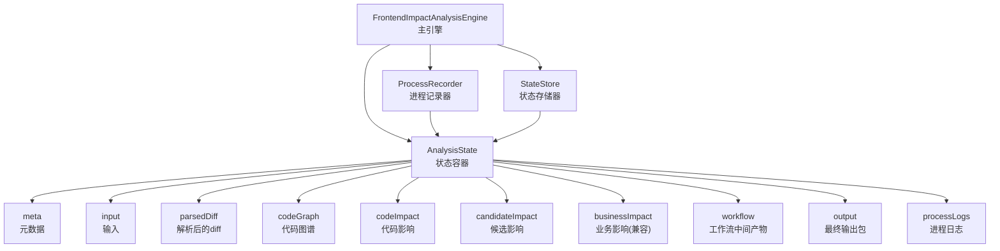
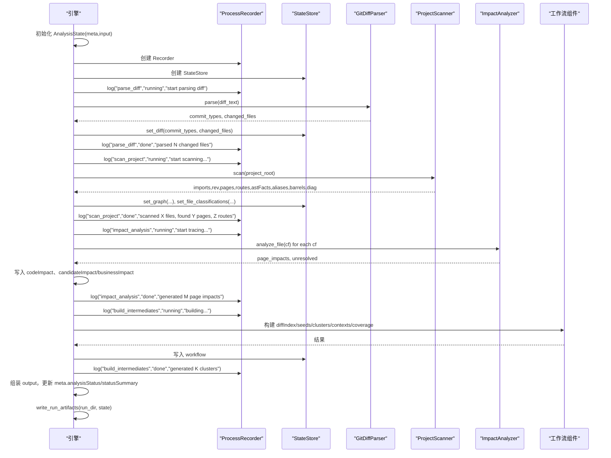
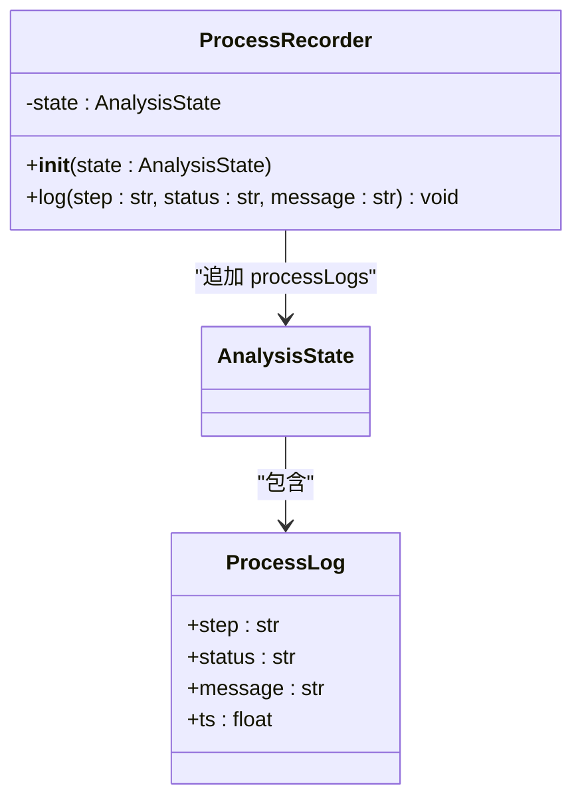
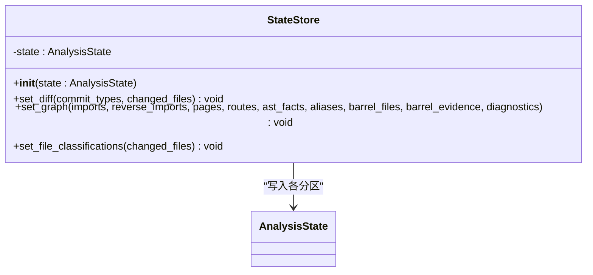
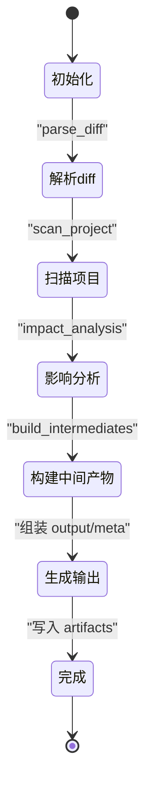
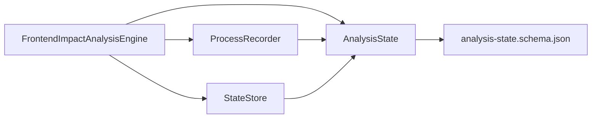

# 状态管理机制

<cite>
**本文档引用的文件**
- [scripts/analyzer/models.py](file://scripts/analyzer/models.py)
- [schemas/analysis-state.schema.json](file://schemas/analysis-state.schema.json)
- [scripts/front_end_impact_analyzer.py](file://scripts/front_end_impact_analyzer.py)
- [scripts/analyzer/impact_engine.py](file://scripts/analyzer/impact_engine.py)
- [scripts/analyzer/project_scanner.py](file://scripts/analyzer/project_scanner.py)
- [scripts/analyzer/common.py](file://scripts/analyzer/common.py)
- [scripts/analyzer/case_builder.py](file://scripts/analyzer/case_builder.py)
</cite>

## 目录
1. [简介](#简介)
2. [项目结构](#项目结构)
3. [核心组件](#核心组件)
4. [架构总览](#架构总览)
5. [详细组件分析](#详细组件分析)
6. [依赖关系分析](#依赖关系分析)
7. [性能考量](#性能考量)
8. [故障排查指南](#故障排查指南)
9. [结论](#结论)

## 简介
本文件系统性阐述前端影响分析器的状态管理机制，重点覆盖：
- AnalysisState 数据模型的设计与字段语义
- ProcessRecorder 的进程记录与状态追踪
- 状态生命周期管理与持久化策略
- 状态变更触发条件与同步机制
- 状态查询与更新的操作接口
- 状态图与时序图
- 性能影响与内存占用分析
- 并发访问的线程安全考虑

## 项目结构
该分析器采用“状态驱动”的流水线式设计：以 AnalysisState 为核心载体，贯穿解析、扫描、影响分析、聚类与输出生成等阶段；通过 ProcessRecorder 记录过程日志，通过 StateStore 统一写入各阶段产出，最终以 JSON 文件形式持久化到运行目录。

图表来源
- [scripts/front_end_impact_analyzer.py:56-160](file://scripts/front_end_impact_analyzer.py#L56-L160)
- [scripts/analyzer/models.py:115-200](file://scripts/analyzer/models.py#L115-L200)

章节来源
- [scripts/front_end_impact_analyzer.py:23-160](file://scripts/front_end_impact_analyzer.py#L23-L160)
- [scripts/analyzer/models.py:115-200](file://scripts/analyzer/models.py#L115-L200)

## 核心组件
- AnalysisState：统一的状态容器，承载分析全生命周期的数据结构。
- ProcessRecorder：轻量的日志记录器，向状态追加结构化的进程日志。
- StateStore：面向领域对象的写入器，负责将解析、扫描、分析等阶段的结果写入 AnalysisState 对应分区。

章节来源
- [scripts/analyzer/models.py:115-200](file://scripts/analyzer/models.py#L115-L200)
- [scripts/front_end_impact_analyzer.py:56-160](file://scripts/front_end_impact_analyzer.py#L56-L160)

## 架构总览
状态管理贯穿以下阶段：
- 初始化：构造 AnalysisState，设置 meta/input，并创建 Recorder/Store。
- 解析阶段：GitDiffParser 解析 diff，写入 parsedDiff。
- 扫描阶段：ProjectScanner 建立 imports/reverseImports/pages/routes/astFacts 等，写入 codeGraph。
- 影响分析：ImpactAnalyzer 基于代码图谱追踪变更到页面，写入 codeImpact。
- 工作流中间产物：构建 diffIndex、fileImpactSeeds、changeClusters、clusterContexts、coverage 等，写入 workflow。
- 输出生成：组装 analysis package，写入 output，并更新 meta 中的 analysisStatus 与 statusSummary。
- 持久化：将 AnalysisState 与最终结果写入运行目录的 JSON 文件。

图表来源
- [scripts/front_end_impact_analyzer.py:56-160](file://scripts/front_end_impact_analyzer.py#L56-L160)
- [scripts/analyzer/models.py:163-200](file://scripts/analyzer/models.py#L163-L200)

## 详细组件分析

### AnalysisState 数据模型
AnalysisState 是整个分析流程的核心状态容器，采用字典分区组织，便于按阶段增量填充与后续持久化。

- 字段概览
  - meta：分析元信息，含 projectType、analysisTime、analysisStatus、outputContract、stateSchema、resultSchema、statusSummary 等。
  - input：输入信息，包含 requirementText（需求文本）与 gitDiffText（diff 文本）。
  - parsedDiff：解析后的变更集合，包含 commitTypes（提交类型数组）与 changedFiles（变更文件对象数组）。
  - codeGraph：代码图谱，包含 imports、reverseImports、pages、routes、astFacts、aliases、barrelFiles、barrelEvidence、diagnostics。
  - codeImpact：代码影响，包含 fileClassifications、candidatePageTraces、pageImpacts（兼容别名）、unresolvedFiles、sharedRisks。
  - candidateImpact：候选影响，包含 candidateModules、candidatePages、structuralHints。
  - businessImpact：业务影响（兼容字段），包含 affectedModules、affectedPages、affectedFunctions、deprecated。
  - workflow：工作流中间产物，包含 manifest、preflight、diffIndex、fileImpactSeeds、changeClusters、clusterAnalysisTasks、clusterContexts、coverage。
  - output：最终输出包，包含 analysis package 的摘要、覆盖率、集群列表等。
  - processLogs：进程日志数组，记录每个阶段的开始、结束与错误信息。

- 字段含义与约束
  - 通过 JSON Schema 定义了必需字段与结构约束，确保状态一致性与可验证性。
  - analysisStatus 支持 running/success/partial_success/failed 状态，用于表达分析完成度与质量。
  - statusSummary 提供统计维度，如变更文件数、候选页面追踪数、未解决文件数、诊断数等。

- 复杂度与数据结构
  - codeGraph：键空间为相对路径字符串，值为结构化对象，整体为稀疏图表示，内存开销与源文件数量近似线性。
  - codeImpact：数组长度与变更文件数及追踪到页面数相关，典型情况下与 O(N) 成正比。
  - workflow：包含多个中间索引与上下文，规模取决于聚类数量与上下文收集范围。

章节来源
- [scripts/analyzer/models.py:115-200](file://scripts/analyzer/models.py#L115-L200)
- [schemas/analysis-state.schema.json:1-238](file://schemas/analysis-state.schema.json#L1-L238)

### ProcessRecorder 进程记录器
- 职责
  - 在 AnalysisState.processLogs 中追加结构化的 ProcessLog 条目，包含 step、status、message、ts（时间戳）。
  - 通过 asdict 将 dataclass 转换为字典，保证 JSON 可序列化。
- 触发点
  - 在关键阶段开始与结束时调用，例如 parse_diff、scan_project、impact_analysis、build_intermediates。
  - 发生异常时也会记录失败日志，便于问题定位。
- 同步机制
  - 单线程顺序写入，无需锁保护；日志条目按阶段顺序累积，便于回溯。

图表来源
- [scripts/analyzer/models.py:163-169](file://scripts/analyzer/models.py#L163-L169)
- [scripts/analyzer/models.py:19-24](file://scripts/analyzer/models.py#L19-L24)

章节来源
- [scripts/analyzer/models.py:163-169](file://scripts/analyzer/models.py#L163-L169)

### StateStore 状态存储器
- 职责
  - 将解析、扫描、分类等阶段的结构化数据写入 AnalysisState 对应分区。
  - 提供 set_diff、set_graph、set_file_classifications 等方法，封装写入细节。
- 写入策略
  - 直接赋值字典字段，避免深拷贝；对复杂对象进行 asdict 序列化。
  - 对 routes 使用 asdict 包装，确保 JSON 兼容。
- 与 ProcessRecorder 的协作
  - 在写入前后配合 ProcessRecorder 记录阶段日志，形成“写入即记录”的一致性。

图表来源
- [scripts/analyzer/models.py:171-200](file://scripts/analyzer/models.py#L171-L200)

章节来源
- [scripts/analyzer/models.py:171-200](file://scripts/analyzer/models.py#L171-L200)

### 状态生命周期管理
- 初始化：FrontendImpactAnalysisEngine 构造 AnalysisState，设置 meta 与 input。
- 运行期：各阶段通过 StateStore 写入，通过 ProcessRecorder 记录日志。
- 结束：根据 page_impacts、unresolved、diagnostics 与 preflight 报告计算 analysisStatus，更新 statusSummary。
- 持久化：write_run_artifacts 将 AnalysisState 与最终结果写入 run_dir 下的 JSON 文件。

图表来源
- [scripts/front_end_impact_analyzer.py:56-160](file://scripts/front_end_impact_analyzer.py#L56-L160)

章节来源
- [scripts/front_end_impact_analyzer.py:56-160](file://scripts/front_end_impact_analyzer.py#L56-L160)

### 状态变更触发条件与同步机制
- 触发条件
  - 解析阶段：GitDiffParser 完成解析后，触发 set_diff 与 processLogs 更新。
  - 扫描阶段：ProjectScanner 完成扫描后，触发 set_graph、set_file_classifications 与 processLogs 更新。
  - 影响分析：ImpactAnalyzer 逐文件分析后，更新 codeImpact、candidateImpact/businessImpact。
  - 工作流：ChangeClusterBuilder、DocumentIndexer、ClusterContextCollector 等完成后，更新 workflow。
  - 异常：捕获异常后，记录失败日志并设置 analysisStatus 为 failed。
- 同步机制
  - 单线程顺序执行，无并发写入，天然具备同步性。
  - 日志与状态写入在同一阶段内成对出现，保证可观测性与一致性。

章节来源
- [scripts/front_end_impact_analyzer.py:56-160](file://scripts/front_end_impact_analyzer.py#L56-L160)

### 状态查询与更新操作接口
- 查询接口
  - 直接访问 AnalysisState 的任意分区字段，如 state.meta、state.codeGraph、state.codeImpact、state.workflow、state.output。
  - 通过 JSON Schema 验证状态结构，确保字段存在性与类型正确性。
- 更新接口
  - 使用 StateStore 的 set_* 方法更新对应分区。
  - 使用 ProcessRecorder 的 log 方法记录阶段日志。
  - 在引擎末尾统一更新 meta.analysisStatus 与 statusSummary。

章节来源
- [scripts/analyzer/models.py:115-200](file://scripts/analyzer/models.py#L115-L200)
- [scripts/front_end_impact_analyzer.py:56-160](file://scripts/front_end_impact_analyzer.py#L56-L160)

### 状态持久化策略
- 运行时产物
  - 00-run-manifest.json、01-preflight-report.json、02-document-index.json、03-diff-index.json、04-file-impact-seeds.json、05-change-clusters.json、06-cluster-analysis-tasks.md、cluster-context/*.json、90-coverage-report.json、98-analysis-state.json、99-final-result.json。
- 策略
  - 以 JSON 文件形式保存，便于外部工具消费与审计。
  - analysis-state.json 与 final-result.json 作为最终状态快照，支持离线复盘与二次处理。

章节来源
- [scripts/front_end_impact_analyzer.py:162-175](file://scripts/front_end_impact_analyzer.py#L162-L175)

## 依赖关系分析
- 组件耦合
  - FrontendImpactAnalysisEngine 依赖 AnalysisState、ProcessRecorder、StateStore。
  - ProcessRecorder 仅依赖 AnalysisState 的 processLogs。
  - StateStore 仅依赖 AnalysisState 的各分区字段。
- 外部依赖
  - JSON Schema 用于状态结构校验。
  - 各分析子模块（ProjectScanner、ImpactAnalyzer、ClusterBuilder 等）通过 StateStore 与 ProcessRecorder 与主引擎解耦。

图表来源
- [scripts/front_end_impact_analyzer.py:23-55](file://scripts/front_end_impact_analyzer.py#L23-L55)
- [scripts/analyzer/models.py:115-200](file://scripts/analyzer/models.py#L115-L200)
- [schemas/analysis-state.schema.json:1-238](file://schemas/analysis-state.schema.json#L1-L238)

章节来源
- [scripts/front_end_impact_analyzer.py:23-55](file://scripts/front_end_impact_analyzer.py#L23-L55)
- [scripts/analyzer/models.py:115-200](file://scripts/analyzer/models.py#L115-L200)
- [schemas/analysis-state.schema.json:1-238](file://schemas/analysis-state.schema.json#L1-L238)

## 性能考量
- 时间复杂度
  - ProjectScanner 扫描源文件并建立 imports/reverseImports/pages/routes/astFacts，整体与源文件数量 N 近似线性 O(N)。
  - ImpactAnalyzer 的追踪算法基于 BFS，每条变更文件的追踪复杂度与依赖图规模相关，通常远小于全图规模。
  - 聚类与上下文收集受变更文件数与页面追踪数影响，典型为 O(N log N) 或更优。
- 空间复杂度
  - AnalysisState 的 codeGraph 为稀疏图，内存与边数近似线性；candidateImpact 与 codeImpact 的数组长度与追踪结果数量相关。
  - workflow 中的中间索引与上下文随聚类数量增长，建议在大规模项目上限制聚类深度与上下文大小。
- I/O 与序列化
  - JSON 序列化开销与状态体量成正比；建议在大型运行中分阶段落盘，避免一次性写出超大 JSON。
- 并发与线程安全
  - 当前实现为单线程顺序执行，天然无竞态；若引入多线程，需对 AnalysisState 的写入加锁或采用不可变快照模式。

[本节为通用性能讨论，不直接分析具体文件]

## 故障排查指南
- 常见问题
  - preflight 报告阻塞：当 preflight.status 为 blocked 时，analysisStatus 设为 partial_success，并输出阻塞动作摘要。
  - 影响分析失败：异常被捕获后，记录 fatal-error 诊断并设置 analysisStatus 为 failed。
  - 未解决文件与诊断：当存在 unresolved 或 diagnostics 时，analysisStatus 为 partial_success。
- 定位手段
  - 查看 processLogs 中各阶段的开始/结束与错误消息。
  - 检查 codeGraph.diagnostics 与 codeImpact.unresolvedFiles。
  - 对照 analysis-state.json 与 final-result.json 的 meta.statusSummary 字段核对统计信息。

章节来源
- [scripts/front_end_impact_analyzer.py:176-185](file://scripts/front_end_impact_analyzer.py#L176-L185)
- [scripts/front_end_impact_analyzer.py:367-384](file://scripts/front_end_impact_analyzer.py#L367-L384)

## 结论
本状态管理机制以 AnalysisState 为中心，辅以 ProcessRecorder 的日志记录与 StateStore 的分区写入，实现了从解析、扫描、分析到输出的完整生命周期管理。JSON Schema 保障了状态结构的可验证性，运行时产物便于外部集成与审计。当前实现为单线程顺序执行，具备良好的一致性与可观测性；在扩展至多线程时，建议引入不可变快照或细粒度锁以保证线程安全。