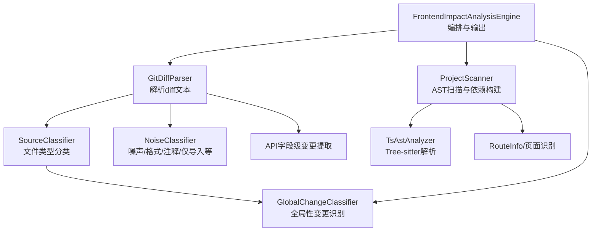
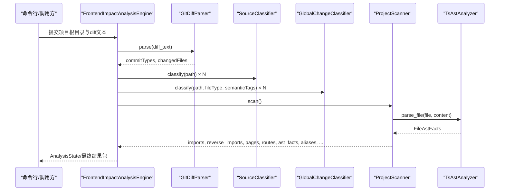
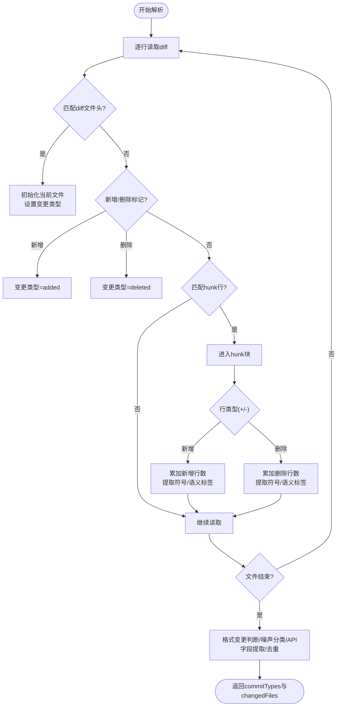
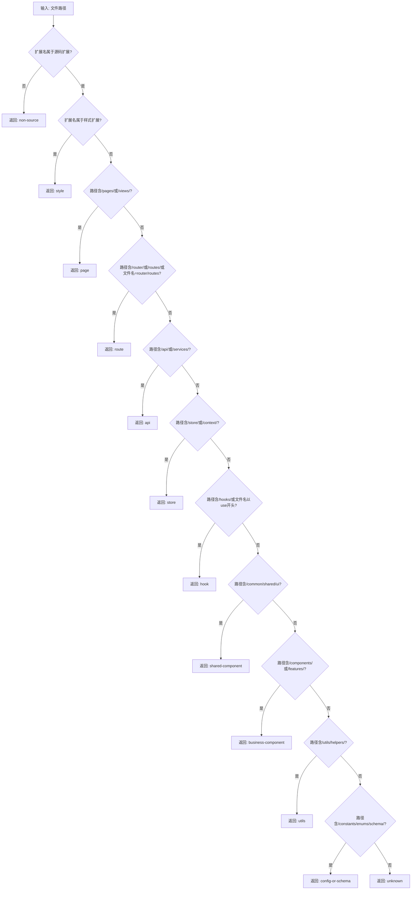
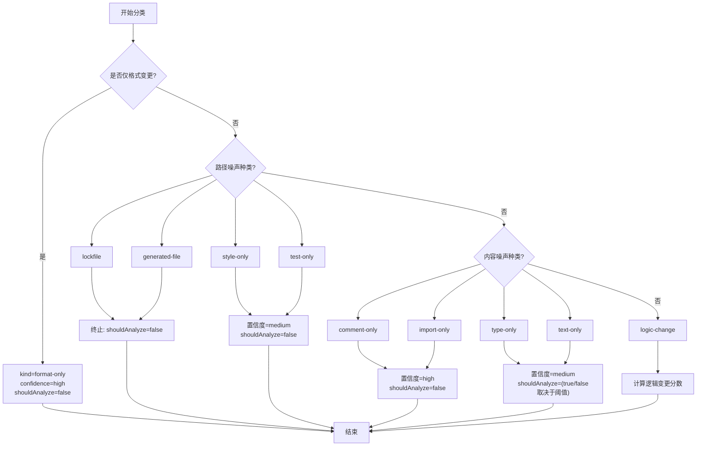
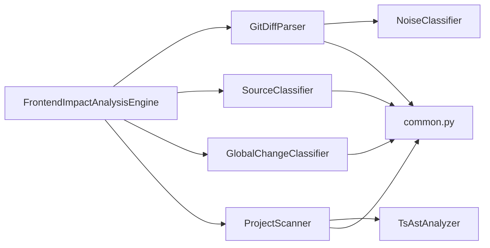

# 代码变更分析

<cite>
**本文引用的文件**
- [scripts/analyzer/diff_parser.py](file://scripts/analyzer/diff_parser.py)
- [scripts/analyzer/source_classifier.py](file://scripts/analyzer/source_classifier.py)
- [scripts/analyzer/models.py](file://scripts/analyzer/models.py)
- [scripts/analyzer/common.py](file://scripts/analyzer/common.py)
- [scripts/analyzer/noise_classifier.py](file://scripts/analyzer/noise_classifier.py)
- [scripts/analyzer/global_change_classifier.py](file://scripts/analyzer/global_change_classifier.py)
- [scripts/analyzer/ast_analyzer.py](file://scripts/analyzer/ast_analyzer.py)
- [scripts/analyzer/project_scanner.py](file://scripts/analyzer/project_scanner.py)
- [scripts/front_end_impact_analyzer.py](file://scripts/front_end_impact_analyzer.py)
- [fixtures/diffs/format_only.diff](file://fixtures/diffs/format_only.diff)
- [fixtures/diffs/shared_search_form.diff](file://fixtures/diffs/shared_search_form.diff)
- [fixtures/diffs/symbol_change.diff](file://fixtures/diffs/symbol_change.diff)
- [tests/test_diff_parser.py](file://tests/test_diff_parser.py)
- [references/project-conventions.md](file://references/project-conventions.md)
- [references/route-conventions.md](file://references/route-conventions.md)
</cite>

## 目录
1. [简介](#简介)
2. [项目结构](#项目结构)
3. [核心组件](#核心组件)
4. [架构总览](#架构总览)
5. [详细组件分析](#详细组件分析)
6. [依赖分析](#依赖分析)
7. [性能考虑](#性能考虑)
8. [故障排查指南](#故障排查指南)
9. [结论](#结论)
10. [附录](#附录)

## 简介
本文件围绕“代码变更分析”能力，系统阐述 GitDiffParser 如何解析 Git 差异内容，完成文件类型识别、符号提取与语义标签生成，并对 API 层字段变更进行细粒度分类；同时说明 SourceClassifier 的文件类型判断逻辑（页面、业务组件、共享组件、路由、API、状态、工具等），并给出变更分析的算法原理、性能优化策略、典型使用案例与最佳实践。

## 项目结构
该分析器以“差异解析 → 文件分类 → 全局分类 → AST 扫描 → 影响追踪 → 聚类与输出”的流水线组织代码，关键模块如下：
- 差异解析：GitDiffParser 将 diff 文本拆分为变更文件，抽取符号与语义标签，识别格式变更与噪声类别，并在必要时提取 API 字段级变更。
- 文件分类：SourceClassifier 基于路径与扩展名判断文件类型，辅助后续影响分析与聚类。
- 全局分类：GlobalChangeClassifier 识别应用入口、Provider、Layout、主题、国际化、鉴权、权限、请求基础设施、路由根等全局性变更。
- AST 分析：TsAstAnalyzer 使用 Tree-sitter 解析 TS/TSX 源码，抽取导入导出、组件/Hook 名称、JSX 标签与属性、路由定义、懒加载、API 调用及派生语义标签。
- 项目扫描：ProjectScanner 遍历源码、解析别名、建立依赖图、识别页面与路由记录。
- 主引擎：FrontendImpactAnalysisEngine 协调上述模块，产出分析状态与最终结果包。

图表来源
- [scripts/front_end_impact_analyzer.py:56-160](file://scripts/front_end_impact_analyzer.py#L56-L160)
- [scripts/analyzer/diff_parser.py:62-130](file://scripts/analyzer/diff_parser.py#L62-L130)
- [scripts/analyzer/source_classifier.py:6-32](file://scripts/analyzer/source_classifier.py#L6-L32)
- [scripts/analyzer/noise_classifier.py:37-80](file://scripts/analyzer/noise_classifier.py#L37-L80)
- [scripts/analyzer/global_change_classifier.py:8-57](file://scripts/analyzer/global_change_classifier.py#L8-L57)
- [scripts/analyzer/project_scanner.py:13-80](file://scripts/analyzer/project_scanner.py#L13-L80)
- [scripts/analyzer/ast_analyzer.py:13-30](file://scripts/analyzer/ast_analyzer.py#L13-L30)

章节来源
- [scripts/front_end_impact_analyzer.py:56-160](file://scripts/front_end_impact_analyzer.py#L56-L160)
- [scripts/analyzer/diff_parser.py:62-130](file://scripts/analyzer/diff_parser.py#L62-L130)
- [scripts/analyzer/source_classifier.py:6-32](file://scripts/analyzer/source_classifier.py#L6-L32)
- [scripts/analyzer/noise_classifier.py:37-80](file://scripts/analyzer/noise_classifier.py#L37-L80)
- [scripts/analyzer/global_change_classifier.py:8-57](file://scripts/analyzer/global_change_classifier.py#L8-L57)
- [scripts/analyzer/project_scanner.py:13-80](file://scripts/analyzer/project_scanner.py#L13-L80)
- [scripts/analyzer/ast_analyzer.py:13-30](file://scripts/analyzer/ast_analyzer.py#L13-L30)

## 核心组件
- GitDiffParser：解析 diff 文本，识别新增/删除/修改文件、统计增删行数、抽取符号、生成语义标签、识别格式变更、噪声分类、API 字段级变更（请求/响应/分页/详情/枚举）。
- SourceClassifier：基于路径与扩展名判断文件类型，覆盖页面、路由、API、状态、Hook、共享组件、业务组件、工具、样式、配置/模式等。
- NoiseClassifier：根据路径与内容特征判定“仅格式/注释/导入/类型/文本/样式/测试/锁定文件/生成物”等噪声类别，决定是否纳入逻辑分析。
- GlobalChangeClassifier：识别应用入口、Provider/Layout、主题/全局样式、国际化、鉴权/权限、请求基础设施、路由根等全局性变更。
- TsAstAnalyzer：Tree-sitter 解析 TS/TSX，抽取导入导出、组件/Hook、JSX 标签/属性、路由定义、懒加载、API 调用，派生语义标签。
- ProjectScanner：遍历源码、解析别名、建立依赖图、识别页面与路由记录。
- FrontendImpactAnalysisEngine：串联各模块，产出分析状态与结果包。

章节来源
- [scripts/analyzer/diff_parser.py:11-130](file://scripts/analyzer/diff_parser.py#L11-L130)
- [scripts/analyzer/source_classifier.py:6-32](file://scripts/analyzer/source_classifier.py#L6-L32)
- [scripts/analyzer/noise_classifier.py:37-80](file://scripts/analyzer/noise_classifier.py#L37-L80)
- [scripts/analyzer/global_change_classifier.py:8-57](file://scripts/analyzer/global_change_classifier.py#L8-L57)
- [scripts/analyzer/ast_analyzer.py:13-30](file://scripts/analyzer/ast_analyzer.py#L13-L30)
- [scripts/analyzer/project_scanner.py:13-80](file://scripts/analyzer/project_scanner.py#L13-L80)
- [scripts/front_end_impact_analyzer.py:56-160](file://scripts/front_end_impact_analyzer.py#L56-L160)

## 架构总览
下图展示了从 Git diff 到最终分析产物的关键流程与模块交互：

图表来源
- [scripts/front_end_impact_analyzer.py:56-160](file://scripts/front_end_impact_analyzer.py#L56-L160)
- [scripts/analyzer/diff_parser.py:62-130](file://scripts/analyzer/diff_parser.py#L62-L130)
- [scripts/analyzer/source_classifier.py:6-32](file://scripts/analyzer/source_classifier.py#L6-L32)
- [scripts/analyzer/global_change_classifier.py:8-57](file://scripts/analyzer/global_change_classifier.py#L8-L57)
- [scripts/analyzer/project_scanner.py:13-80](file://scripts/analyzer/project_scanner.py#L13-L80)
- [scripts/analyzer/ast_analyzer.py:13-30](file://scripts/analyzer/ast_analyzer.py#L13-L30)

## 详细组件分析

### GitDiffParser 组件分析
- 功能职责
  - 解析 diff 文本，识别文件增删改、统计增删行数。
  - 抽取符号（函数/常量/类/大写 JSX 标签）与语义标签（按钮/模态/表单/表格/路由/API/状态/导航/校验/列表查询/提交/列/详情/加载/禁用/导出等）。
  - 判断“仅格式变更”，并据此跳过噪声分析。
  - 噪声分类：根据路径与内容信号（锁文件/生成物/样式/测试/注释/导入/类型/文本）决定是否分析。
  - API 字段级变更：请求参数/响应数据/分页/详情/列表 Schema 变更，以及枚举值变更，支持重命名与新增/删除两类变化。
  - 去重：对 API 变更按 kind/change/field/from 去重，保证输出稳定。

- 关键实现要点
  - 文件边界与块解析：通过正则匹配 diff 文件头、新增/删除标记、hunk 行，逐行读取并区分新增/删除内容。
  - 符号与语义提取：使用多组正则分别匹配函数/常量/类/大写 JSX 标签；语义标签基于关键词集合（大小写不敏感或特定大小写敏感规则）。
  - 格式变更判断：将新增/删除行拼接后做空白与引号等归一化比较，若一致则视为仅格式变更。
  - API 变更提取：先按提示词（请求/响应/分页/详情/列表/枚举）分类行，再从花括号对象中提取标识符或回退到常规字段名提取；最后汇总为变更项并去重。
  - 语义标签派生：根据 API 变更映射到语义标签集合，如请求字段变更映射到 api 与 submit，响应映射到 api，分页映射到 api 与 list-query 等。

- 复杂度与性能
  - 时间复杂度：O(N)（N 为 diff 行数），每行仅做常数次正则匹配与少量字符串处理。
  - 空间复杂度：O(S)（S 为新增/删除行集合与提取的符号/标签/变更项数量）。
  - 优化策略：正则预编译；统一去重使用集合；格式变更快速短路；仅在必要时进行 API 字段提取与枚举提取。

- 示例与用法
  - 格式变更：参考 [fixtures/diffs/format_only.diff](file://fixtures/diffs/format_only.diff)，解析后应标记为仅格式变更，不应进入逻辑分析。
  - 符号变更：参考 [fixtures/diffs/symbol_change.diff](file://fixtures/diffs/symbol_change.diff)，解析后应提取到新符号与语义标签。
  - 共享组件变更：参考 [fixtures/diffs/shared_search_form.diff](file://fixtures/diffs/shared_search_form.diff)，解析后应识别为共享组件、表单、按钮、禁用状态、提交等语义标签。
  - API 字段级变更：参考 [tests/test_diff_parser.py:56-88](file://tests/test_diff_parser.py#L56-L88)，验证请求/响应/分页/详情/列表 Schema 与枚举变更的识别与去重。

图表来源
- [scripts/analyzer/diff_parser.py:62-130](file://scripts/analyzer/diff_parser.py#L62-L130)
- [scripts/analyzer/diff_parser.py:143-195](file://scripts/analyzer/diff_parser.py#L143-L195)
- [scripts/analyzer/diff_parser.py:197-301](file://scripts/analyzer/diff_parser.py#L197-L301)

章节来源
- [scripts/analyzer/diff_parser.py:11-302](file://scripts/analyzer/diff_parser.py#L11-L302)
- [fixtures/diffs/format_only.diff:1-10](file://fixtures/diffs/format_only.diff#L1-L10)
- [fixtures/diffs/shared_search_form.diff:1-14](file://fixtures/diffs/shared_search_form.diff#L1-L14)
- [fixtures/diffs/symbol_change.diff:1-12](file://fixtures/diffs/symbol_change.diff#L1-L12)
- [tests/test_diff_parser.py:6-155](file://tests/test_diff_parser.py#L6-L155)

### SourceClassifier 组件分析
- 功能职责：根据文件路径与扩展名判断文件类型，用于后续影响分析与聚类。
- 判断逻辑（优先级与覆盖范围）
  - 样式文件：CSS/SCSS/LESS 等。
  - 非源码：非 .ts/.tsx/.js/.jsx 结尾且不在源码扩展集内的文件。
  - 页面：路径包含 /pages/ 或 /views/。
  - 路由：路径包含 /router/ 或 /routes/，或文件名为 router.ts/tsx、routes.ts/tsx。
  - API：路径包含 /api/ 或 /services/。
  - 状态：路径包含 /store/ 或 /context/。
  - Hook：路径包含 /hooks/ 或文件名以 use 开头。
  - 共享组件：路径包含 /components/common/、/common/、/shared/、/ui/。
  - 业务组件：路径包含 /components/ 或 /features/。
  - 工具：路径包含 /utils/ 或 /helpers/。
  - 配置/模式：路径包含 /constants/、/enums/、/schema/。
  - 默认：unknown。

图表来源
- [scripts/analyzer/source_classifier.py:6-32](file://scripts/analyzer/source_classifier.py#L6-L32)

章节来源
- [scripts/analyzer/source_classifier.py:6-32](file://scripts/analyzer/source_classifier.py#L6-L32)

### NoiseClassifier 组件分析
- 功能职责：对每个变更文件进行噪声/格式/注释/导入/类型/文本/样式/测试/锁文件/生成物等分类，决定是否纳入逻辑分析。
- 分类依据
  - 路径噪声：锁文件、生成物、样式、测试/夹具/模拟。
  - 内容噪声：仅注释、仅导入/导出、仅类型声明、仅文本键值行。
  - 逻辑评分：不同噪声类别赋予不同逻辑变更分数，便于后续聚类与优先级排序。
- 决策流程
  - 若已判定为仅格式变更，则直接标记为 format-only，置 shouldAnalyze=false。
  - 否则检查路径噪声种类，若为锁文件/生成物/样式/测试，则置 shouldAnalyze=false。
  - 若仍为逻辑变更，再检查内容噪声种类，按 medium/high 置信度与 shouldAnalyze 控制。

图表来源
- [scripts/analyzer/noise_classifier.py:37-80](file://scripts/analyzer/noise_classifier.py#L37-L80)
- [scripts/analyzer/noise_classifier.py:97-157](file://scripts/analyzer/noise_classifier.py#L97-L157)

章节来源
- [scripts/analyzer/noise_classifier.py:37-181](file://scripts/analyzer/noise_classifier.py#L37-L181)

### GlobalChangeClassifier 组件分析
- 功能职责：识别全局性变更，避免对所有页面进行影响扩展分析。
- 识别规则
  - 应用入口：位于 src 根目录下的 app/main 文件。
  - Provider/Layout：路径包含 providers/provider/layout/shell 或对应文件名。
  - 主题/全局样式：文件名包含 theme/design-token/global.css。
  - 国际化：文件名包含 i18n/locale 或 locales 目录。
  - 鉴权/权限：路径包含 permission/auth/access。
  - 请求基础设施：常见客户端/拦截器文件或 api/services 客户端。
  - 路由根：路由入口文件（index/router/routes）。
- 输出包含 isGlobal、kind、signals、置信度、建议分析策略等。

章节来源
- [scripts/analyzer/global_change_classifier.py:8-90](file://scripts/analyzer/global_change_classifier.py#L8-L90)

### AST 解析与语义标签派生
- TsAstAnalyzer 使用 Tree-sitter 解析 TS/TSX，抽取：
  - 导入/导出/重导出、绑定信息（默认/命名/命名空间/通配）。
  - 组件/Hook 名称（首字母大写/以 use 开头）。
  - JSX 标签与属性。
  - 路由路径/组件/懒加载。
  - API 调用（基于 API_NAMES 集合）。
  - 派生语义标签：按钮/模态/表单/表格/上传/禁用状态/路由/API/列表查询/提交/删除/详情/状态等。
- ProjectScanner 遍历源码、解析别名、建立依赖图、识别页面与路由记录，并收集未解析导入等诊断信息。

章节来源
- [scripts/analyzer/ast_analyzer.py:13-242](file://scripts/analyzer/ast_analyzer.py#L13-L242)
- [scripts/analyzer/project_scanner.py:13-200](file://scripts/analyzer/project_scanner.py#L13-L200)

## 依赖分析
- 模块耦合
  - FrontendImpactAnalysisEngine 作为编排者，依赖 GitDiffParser、SourceClassifier、GlobalChangeClassifier、ProjectScanner。
  - ProjectScanner 依赖 TsAstAnalyzer 与公共工具（路径/别名/去重等）。
  - GitDiffParser 依赖公共工具与噪声分类器。
- 外部依赖
  - Tree-sitter 语言库（TypeScript/TSX）。
  - 正则表达式与 Python 标准库。
- 循环依赖
  - 未发现循环依赖迹象；模块间为单向依赖。

图表来源
- [scripts/front_end_impact_analyzer.py:56-160](file://scripts/front_end_impact_analyzer.py#L56-L160)
- [scripts/analyzer/project_scanner.py:13-80](file://scripts/analyzer/project_scanner.py#L13-L80)
- [scripts/analyzer/diff_parser.py:6-8](file://scripts/analyzer/diff_parser.py#L6-L8)
- [scripts/analyzer/common.py:1-151](file://scripts/analyzer/common.py#L1-L151)

章节来源
- [scripts/front_end_impact_analyzer.py:56-160](file://scripts/front_end_impact_analyzer.py#L56-L160)
- [scripts/analyzer/project_scanner.py:13-80](file://scripts/analyzer/project_scanner.py#L13-L80)
- [scripts/analyzer/diff_parser.py:6-8](file://scripts/analyzer/diff_parser.py#L6-L8)
- [scripts/analyzer/common.py:1-151](file://scripts/analyzer/common.py#L1-L151)

## 性能考虑
- 正则预编译：所有正则在模块级别预编译，避免重复开销。
- 去重与集合：使用集合进行去重与快速查找，降低重复处理成本。
- 快速短路：格式变更与噪声分类在早期阶段即决定是否继续分析，减少后续处理。
- 顺序与优先级：先做路径/内容噪声判断，再做 API 字段提取，避免对非逻辑变更做昂贵操作。
- I/O 与编码：统一安全读取与 UTF-8 错误忽略策略，确保稳定性。
- AST 解析：Tree-sitter 解析器复用，按需解析 TS/TSX，避免不必要的解析。

## 故障排查指南
- 常见问题
  - 仅格式变更被误判为逻辑变更：确认格式变更归一化逻辑是否正确，检查空白/引号处理。
  - 噪声文件未被过滤：检查路径与内容噪声识别规则，确认 shouldAnalyze 是否被错误置为 true。
  - API 字段变更漏检：检查提示词与花括号内标识符提取逻辑，确保回退到字段名提取。
  - 未解析导入：查看 ProjectScanner 的诊断输出，确认别名解析与候选文件存在性。
- 排查步骤
  - 使用测试用例定位问题：参考 [tests/test_diff_parser.py:6-155](file://tests/test_diff_parser.py#L6-L155) 中的断言点。
  - 对照样例 diff：参考 [fixtures/diffs/format_only.diff](file://fixtures/diffs/format_only.diff)、[fixtures/diffs/shared_search_form.diff](file://fixtures/diffs/shared_search_form.diff)、[fixtures/diffs/symbol_change.diff](file://fixtures/diffs/symbol_change.diff)。
  - 检查噪声分类输出：核对 noise_classification 字段中的 kind、signals、shouldAnalyze、logicChangeScore。
  - 检查全局分类输出：核对 global_classification 的 isGlobal/kind/signals/reason。

章节来源
- [tests/test_diff_parser.py:6-155](file://tests/test_diff_parser.py#L6-L155)
- [fixtures/diffs/format_only.diff:1-10](file://fixtures/diffs/format_only.diff#L1-L10)
- [fixtures/diffs/shared_search_form.diff:1-14](file://fixtures/diffs/shared_search_form.diff#L1-L14)
- [fixtures/diffs/symbol_change.diff:1-12](file://fixtures/diffs/symbol_change.diff#L1-L12)
- [scripts/analyzer/noise_classifier.py:37-181](file://scripts/analyzer/noise_classifier.py#L37-L181)
- [scripts/analyzer/global_change_classifier.py:8-90](file://scripts/analyzer/global_change_classifier.py#L8-L90)

## 结论
本分析器通过 GitDiffParser 的高效解析与噪声过滤、SourceClassifier 的精准文件类型识别、GlobalChangeClassifier 的全局性变更洞察，结合 ProjectScanner 的 AST 驱动依赖图与语义标签派生，形成从差异到影响的完整链路。其正则预编译、集合去重、快照短路与 Tree-sitter 解析等策略确保了在大型前端项目中的可扩展性与稳定性。配合测试用例与样例 diff，用户可快速掌握各类变更场景的识别与处理方式。

## 附录
- 使用建议
  - 在 CI 中优先使用 make-diff 生成标准化 diff 输入，确保路径一致性。
  - 对样式/测试/锁文件/生成物等噪声文件保持默认过滤策略，避免干扰主流程。
  - 对共享组件与路由根变更，结合全局分类建议进行跨页面影响评估。
  - 对 API 字段级变更，优先关注重命名与新增/删除，结合语义标签进行影响范围收敛。
- 最佳实践
  - 明确项目约定：参考 [references/project-conventions.md](file://references/project-conventions.md) 与 [references/route-conventions.md](file://references/route-conventions.md)，统一页面、路由与别名风格。
  - 逐步引入更严格的噪声规则与语义标签映射，持续提升覆盖率与准确性。
  - 将分析结果与聚类任务结合，借助人工评审与证据收集，形成高质量的用例与风险报告。