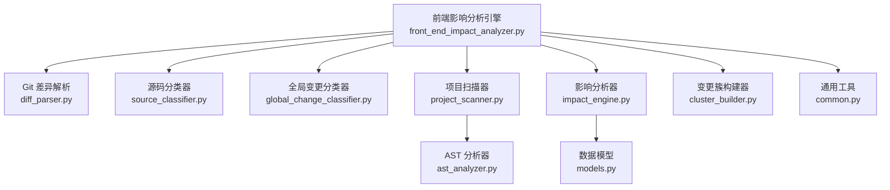
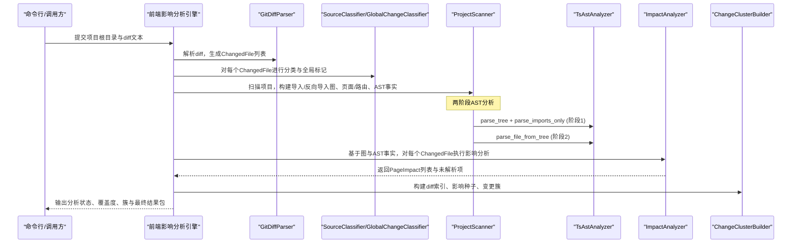
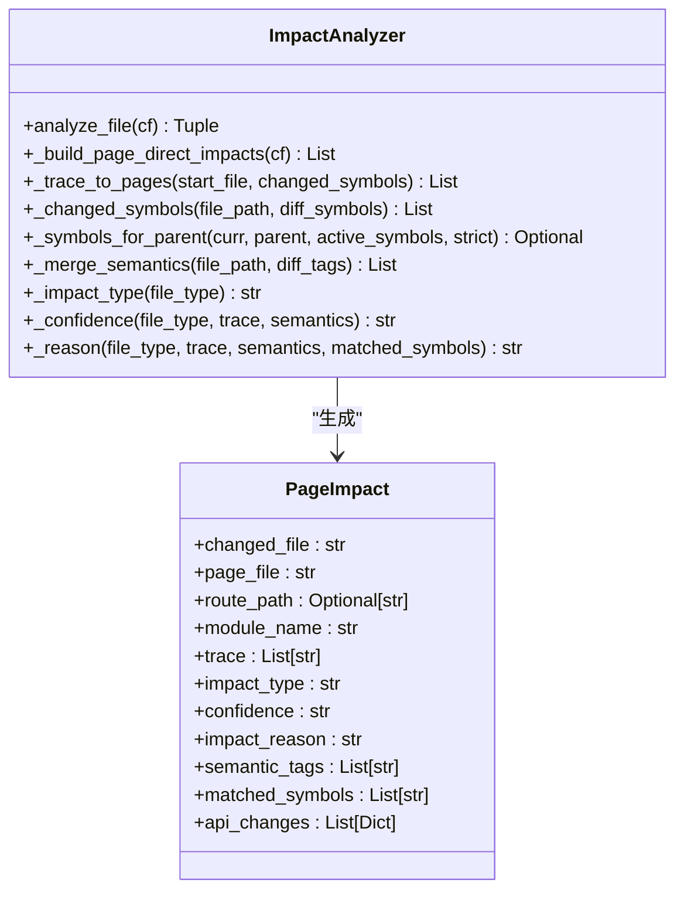
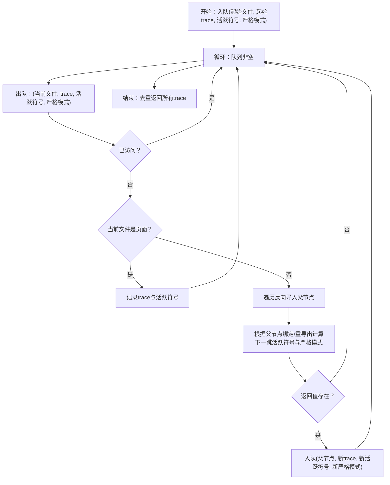
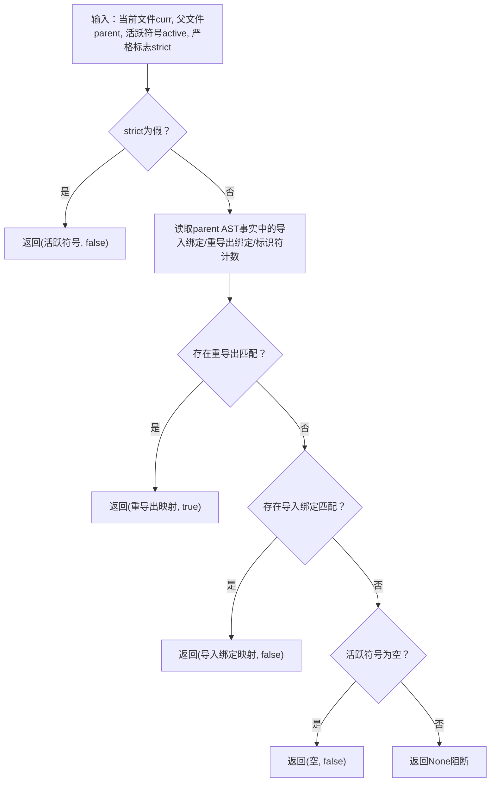
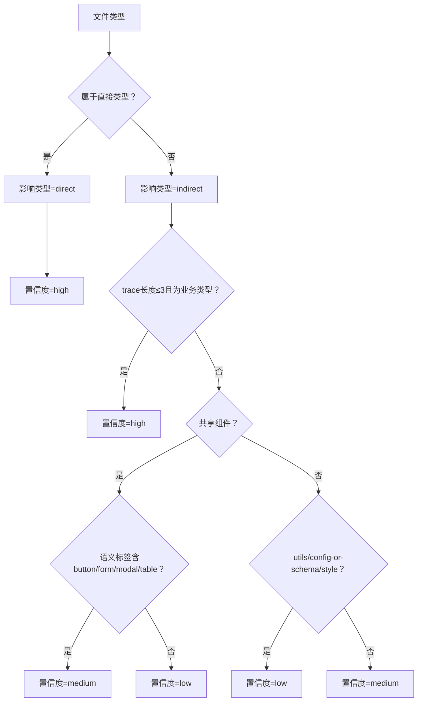
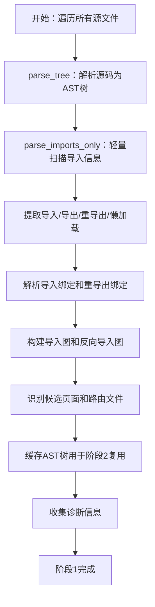
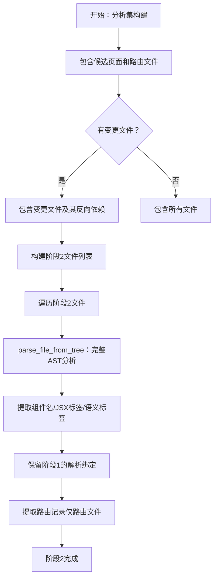
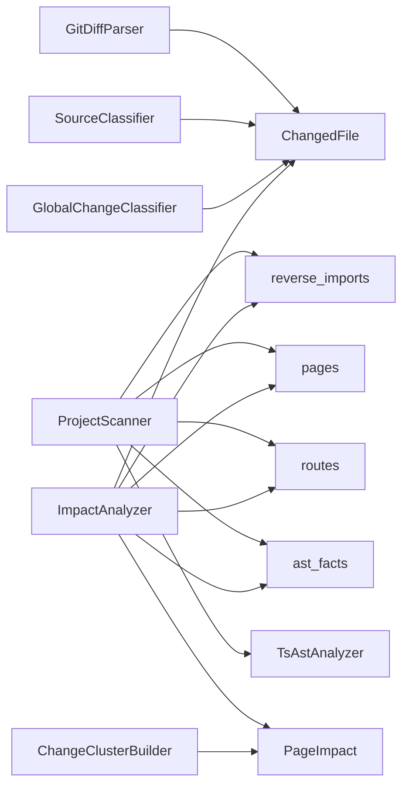

# 影响追踪

<cite>
**本文引用的文件**   
- [scripts/front_end_impact_analyzer.py](file://scripts/front_end_impact_analyzer.py)
- [scripts/analyzer/impact_engine.py](file://scripts/analyzer/impact_engine.py)
- [scripts/analyzer/project_scanner.py](file://scripts/analyzer/project_scanner.py)
- [scripts/analyzer/ast_analyzer.py](file://scripts/analyzer/ast_analyzer.py)
- [scripts/analyzer/diff_parser.py](file://scripts/analyzer/diff_parser.py)
- [scripts/analyzer/common.py](file://scripts/analyzer/common.py)
- [scripts/analyzer/source_classifier.py](file://scripts/analyzer/source_classifier.py)
- [scripts/analyzer/noise_classifier.py](file://scripts/analyzer/noise_classifier.py)
- [scripts/analyzer/global_change_classifier.py](file://scripts/analyzer/global_change_classifier.py)
- [scripts/analyzer/cluster_builder.py](file://scripts/analyzer/cluster_builder.py)
- [scripts/analyzer/models.py](file://scripts/analyzer/models.py)
- [references/impact-rules.md](file://references/impact-rules.md)
- [references/project-conventions.md](file://references/project-conventions.md)
- [tests/test_impact_engine.py](file://tests/test_impact_engine.py)
- [tests/test_project_scanner.py](file://tests/test_project_scanner.py)
- [tests/test_workflow_intermediates.py](file://tests/test_workflow_intermediates.py)
</cite>

## 目录
1. [简介](#简介)
2. [项目结构](#项目结构)
3. [核心组件](#核心组件)
4. [架构总览](#架构总览)
5. [详细组件分析](#详细组件分析)
6. [依赖分析](#依赖分析)
7. [性能考虑](#性能考虑)
8. [故障排查指南](#故障排查指南)
9. [结论](#结论)
10. [附录](#附录)

## 简介
本文件面向"影响追踪"功能，系统性阐述 ImpactAnalyzer 的核心算法与实现细节，包括：
- 反向导入图遍历与 BFS 路径查找
- 符号传播与严格/宽松模式下的匹配策略
- 页面影响计算与置信度评分
- 影响类型（直接影响/间接影响）分类逻辑
- 与项目扫描结果的集成流程
- 复杂度分析与性能优化建议
- 典型场景与测试用例映射

**更新** 新增两阶段AST分析能力：parse_imports_only和parse_file_from_tree方法的引入，以及智能分析集构建

## 项目结构
该分析器采用分层设计：顶层引擎负责编排；扫描器构建代码图；差异解析与分类器过滤噪声；影响分析器执行反向导入图上的 BFS；聚类器将影响结果组织为可执行的变更簇。

**图表来源**
- [scripts/front_end_impact_analyzer.py:56-160](file://scripts/front_end_impact_analyzer.py#L56-L160)
- [scripts/analyzer/project_scanner.py:20-80](file://scripts/analyzer/project_scanner.py#L20-L80)
- [scripts/analyzer/impact_engine.py:10-58](file://scripts/analyzer/impact_engine.py#L10-L58)
- [scripts/analyzer/ast_analyzer.py:13-30](file://scripts/analyzer/ast_analyzer.py#L13-L30)
- [scripts/analyzer/diff_parser.py:62-110](file://scripts/analyzer/diff_parser.py#L62-L110)
- [scripts/analyzer/source_classifier.py:6-35](file://scripts/analyzer/source_classifier.py#L6-L35)
- [scripts/analyzer/global_change_classifier.py:8-57](file://scripts/analyzer/global_change_classifier.py#L8-L57)
- [scripts/analyzer/cluster_builder.py:11-90](file://scripts/analyzer/cluster_builder.py#L11-L90)
- [scripts/analyzer/common.py:17-67](file://scripts/analyzer/common.py#L17-L67)

**章节来源**
- [scripts/front_end_impact_analyzer.py:56-160](file://scripts/front_end_impact_analyzer.py#L56-L160)
- [references/project-conventions.md:3-19](file://references/project-conventions.md#L3-L19)

## 核心组件
- 影响分析器 ImpactAnalyzer：执行反向导入图上的 BFS，进行符号传播与页面影响计算，输出 PageImpact 结果与置信度。
- 项目扫描器 ProjectScanner：构建正向/反向导入图、识别页面与路由、提取 AST 事实。**更新** 实现两阶段AST分析：先轻量扫描导入信息，再对关键文件进行完整AST分析。
- AST 分析器 TsAstAnalyzer：从源码中抽取导入/导出、组件名、Hook 名、JSX 标签/属性、路由定义、懒加载、API 调用等语义标签。**更新** 支持parse_imports_only和parse_file_from_tree两种分析模式。
- 差异解析器 GitDiffParser：解析 git diff，提取变更文件、新增/删除行数、符号与语义标签、API 字段变更。
- 源码分类器 SourceClassifier：按路径规则将文件归类为 page、route、api、store、hook、shared-component、business-component、utils、config-or-schema、style 等。
- 全局变更分类器 GlobalChangeClassifier：识别应用入口、Provider、Layout、主题/全局样式、国际化、权限/认证、请求基础设施、根路由等跨切面变更。
- 变更簇构建器 ChangeClusterBuilder：将影响结果按页面或模块+语义标签聚类，决定是否需要深度分析。
- 通用工具 common：路径规范化、别名解析、去重等。
- 数据模型 models：ChangedFile、RouteInfo、FileAstFacts、PageImpact、AnalysisState 等。

**章节来源**
- [scripts/analyzer/impact_engine.py:10-187](file://scripts/analyzer/impact_engine.py#L10-L187)
- [scripts/analyzer/project_scanner.py:13-80](file://scripts/analyzer/project_scanner.py#L13-L80)
- [scripts/analyzer/ast_analyzer.py:13-242](file://scripts/analyzer/ast_analyzer.py#L13-L242)
- [scripts/analyzer/diff_parser.py:11-302](file://scripts/analyzer/diff_parser.py#L11-L302)
- [scripts/analyzer/source_classifier.py:6-35](file://scripts/analyzer/source_classifier.py#L6-L35)
- [scripts/analyzer/global_change_classifier.py:8-89](file://scripts/analyzer/global_change_classifier.py#L8-L89)
- [scripts/analyzer/cluster_builder.py:11-304](file://scripts/analyzer/cluster_builder.py#L11-L304)
- [scripts/analyzer/common.py:17-151](file://scripts/analyzer/common.py#L17-L151)
- [scripts/analyzer/models.py:18-201](file://scripts/analyzer/models.py#L18-L201)

## 架构总览
影响追踪的端到端流程如下：

**图表来源**
- [scripts/front_end_impact_analyzer.py:56-160](file://scripts/front_end_impact_analyzer.py#L56-L160)
- [scripts/analyzer/diff_parser.py:62-110](file://scripts/analyzer/diff_parser.py#L62-L110)
- [scripts/analyzer/source_classifier.py:6-35](file://scripts/analyzer/source_classifier.py#L6-L35)
- [scripts/analyzer/global_change_classifier.py:8-57](file://scripts/analyzer/global_change_classifier.py#L8-L57)
- [scripts/analyzer/project_scanner.py:20-80](file://scripts/analyzer/project_scanner.py#L20-L80)
- [scripts/analyzer/ast_analyzer.py:18-30](file://scripts/analyzer/ast_analyzer.py#L18-L30)
- [scripts/analyzer/impact_engine.py:26-58](file://scripts/analyzer/impact_engine.py#L26-L58)
- [scripts/analyzer/cluster_builder.py:16-90](file://scripts/analyzer/cluster_builder.py#L16-L90)

## 详细组件分析

### ImpactAnalyzer 核心算法
ImpactAnalyzer 是影响追踪的中枢，负责：
- 将变更文件映射到页面影响
- 在反向导入图上执行广度优先搜索（BFS）
- 进行符号传播与匹配，区分严格/宽松模式
- 计算影响类型与置信度，生成影响原因说明

**图表来源**
- [scripts/analyzer/impact_engine.py:10-187](file://scripts/analyzer/impact_engine.py#L10-L187)
- [scripts/analyzer/models.py:77-90](file://scripts/analyzer/models.py#L77-L90)

#### 反向导入图与 BFS 路径查找
- 输入：变更文件路径、反向导入图 reverse_imports、页面集合 pages、路由映射 route_map、AST 事实 ast_facts
- 算法：以变更文件为起点，使用队列进行 BFS 遍历，遇到页面节点即记录一条完整 trace
- 关键点：
  - 访问状态由 (当前文件, 活跃符号元组, 严格模式标志) 组成，避免重复访问
  - 到达页面后不立即终止，继续探索其他分支，确保找到所有可达路径
  - 最终对重复 trace 去重

**图表来源**
- [scripts/analyzer/impact_engine.py:77-105](file://scripts/analyzer/impact_engine.py#L77-L105)

**章节来源**
- [scripts/analyzer/impact_engine.py:26-105](file://scripts/analyzer/impact_engine.py#L26-L105)

#### 符号传播与匹配策略
- 活跃符号来源：变更文件的 diff 中提取的符号，以及 AST 中导出/组件/Hook 名称
- 匹配规则：
  - 宽松模式（strict_symbols 为 False）：沿边传递活跃符号不变
  - 严格模式（strict_symbols 为 True）：
    - 通过 import_bindings 匹配本地标识符数量 > 1 的绑定
    - 通过 reexport_bindings 匹配重导出映射
    - 若同时存在重导出与绑定匹配，优先重导出
    - 若无活跃符号但允许无符号传播，则保留空集
- 作用：在反向遍历时，仅当符号可能被使用时才继续传播，减少无效分支

**图表来源**
- [scripts/analyzer/impact_engine.py:119-162](file://scripts/analyzer/impact_engine.py#L119-L162)
- [scripts/analyzer/ast_analyzer.py:116-190](file://scripts/analyzer/ast_analyzer.py#L116-L190)

**章节来源**
- [scripts/analyzer/impact_engine.py:107-162](file://scripts/analyzer/impact_engine.py#L107-L162)
- [scripts/analyzer/ast_analyzer.py:116-190](file://scripts/analyzer/ast_analyzer.py#L116-L190)

#### 页面影响计算与置信度
- 影响类型：
  - 直接：page、route、business-component、api、hook、store
  - 间接：其余类型
- 置信度：
  - page/route：高
  - business-component/api/hook/store 且 trace 长度 ≤ 3：高
  - shared-component：若语义标签包含 form/table/modal/button 等则中，否则低
  - utils/config-or-schema/style：低
  - 其他：中
- 影响原因：包含文件类型、trace 步数、语义标签与匹配符号摘要

**图表来源**
- [scripts/analyzer/impact_engine.py:168-187](file://scripts/analyzer/impact_engine.py#L168-L187)
- [references/impact-rules.md:3-6](file://references/impact-rules.md#L3-L6)

**章节来源**
- [scripts/analyzer/impact_engine.py:168-187](file://scripts/analyzer/impact_engine.py#L168-L187)
- [references/impact-rules.md:3-6](file://references/impact-rules.md#L3-L6)

#### 影响类型分类逻辑
- 直接影响：page、route、business-component、api、hook、store
- 间接影响：其他类型（如 utils、config-or-schema、shared-component、style 等）

**章节来源**
- [scripts/analyzer/impact_engine.py:168-171](file://scripts/analyzer/impact_engine.py#L168-L171)

### 两阶段AST分析系统

**更新** 项目扫描与 AST 抽取现在采用两阶段分析策略，显著提升性能和资源利用率。

#### 阶段1：轻量导入扫描（parse_imports_only）
- 目标：快速构建完整的导入/反向导入图，不进行昂贵的完整AST遍历
- 方法：使用parse_imports_only方法，仅从顶级AST节点提取导入、导出、重导出和懒加载信息
- 性能优势：比完整AST遍历快5-10倍，避免解析JSX标签、组件名、Hook等复杂信息
- 输出：构建完整的import_graph、reverse_imports、candidate_pages、route_files等

**图表来源**
- [scripts/analyzer/project_scanner.py:37-98](file://scripts/analyzer/project_scanner.py#L37-L98)
- [scripts/analyzer/ast_analyzer.py:29-37](file://scripts/analyzer/ast_analyzer.py#L29-L37)

#### 阶段2：智能分析集构建与完整AST分析（parse_file_from_tree）
- 目标：对真正需要的文件进行完整AST分析，获取组件名、JSX标签、语义标签等详细信息
- 智能分析集构建：仅对以下文件进行完整分析：
  - 变更文件（来自diff）
  - 变更文件的反向依赖链
  - 候选页面文件（需要组件名/JSX标签）
  - 路由文件（需要路由记录提取）
- 方法：使用parse_file_from_tree方法，复用阶段1的AST树，避免重新解析

**图表来源**
- [scripts/analyzer/project_scanner.py:107-151](file://scripts/analyzer/project_scanner.py#L107-L151)
- [scripts/analyzer/ast_analyzer.py:39-49](file://scripts/analyzer/ast_analyzer.py#L39-L49)

#### AST分析器方法详解
- parse_tree：解析源码为AST树，返回(tree, source_bytes)，供两个分析方法复用
- parse_imports_only：轻量扫描，仅提取导入/导出/重导出/懒加载信息
- parse_file_from_tree：完整AST遍历，提取所有语义信息并衍生语义标签
- parse_file：传统方法，先parse_tree再parse_file_from_tree

**章节来源**
- [scripts/analyzer/project_scanner.py:37-151](file://scripts/analyzer/project_scanner.py#L37-L151)
- [scripts/analyzer/ast_analyzer.py:21-53](file://scripts/analyzer/ast_analyzer.py#L21-L53)

### 差异解析与噪声过滤
- GitDiffParser：
  - 解析提交类型、变更文件、新增/删除行数
  - 提取符号与语义标签，识别 API 字段变更（请求/响应字段重命名、枚举变化等）
  - 生成 ChangedFile 的 symbols、semantic_tags、api_changes
- NoiseClassifier：
  - 基于路径与内容判断噪音类型（格式化、注释、导入、类型、文本、测试、样式、生成文件、锁文件等）
  - 输出 shouldAnalyze、confidence、reason
- GlobalChangeClassifier：
  - 识别跨切面全局变更（应用入口、Provider、Layout、主题/全局样式、国际化、权限/认证、请求基础设施、根路由）
  - 输出 isGlobal、signals、blastRadiusPolicy、recommendedAnalysis

**章节来源**
- [scripts/analyzer/diff_parser.py:62-302](file://scripts/analyzer/diff_parser.py#L62-L302)
- [scripts/analyzer/noise_classifier.py:37-80](file://scripts/analyzer/noise_classifier.py#L37-L80)
- [scripts/analyzer/global_change_classifier.py:8-57](file://scripts/analyzer/global_change_classifier.py#L8-L57)

### 影响结果聚类与输出
- ChangeClusterBuilder：
  - 构建 diff 索引（按分析桶分类）
  - 生成影响种子（按文件聚合 PageImpact）
  - 按页面或模块+语义标签聚类，决定是否需要深度分析
  - 产出覆盖度报告与最终分析包（clusters、summary、coverage 等）

**章节来源**
- [scripts/analyzer/cluster_builder.py:16-163](file://scripts/analyzer/cluster_builder.py#L16-L163)
- [scripts/front_end_impact_analyzer.py:116-160](file://scripts/front_end_impact_analyzer.py#L116-L160)

## 依赖分析
- ImpactAnalyzer 依赖：
  - 项目扫描阶段提供的 imports/reverse_imports/pages/routes/ast_facts
  - ChangedFile 的 file_type/module_guess/semantic_tags/symbols/api_changes
- 项目扫描阶段依赖：
  - AST 解析器抽取的 import_bindings/reexport_bindings/identifier_counts 等
  - 路由记录解析与页面可达性推断
- 工具依赖：
  - common 提供路径/别名/去重等基础能力

**图表来源**
- [scripts/analyzer/diff_parser.py:62-110](file://scripts/analyzer/diff_parser.py#L62-L110)
- [scripts/analyzer/source_classifier.py:6-35](file://scripts/analyzer/source_classifier.py#L6-L35)
- [scripts/analyzer/global_change_classifier.py:8-57](file://scripts/analyzer/global_change_classifier.py#L8-L57)
- [scripts/analyzer/project_scanner.py:20-80](file://scripts/analyzer/project_scanner.py#L20-L80)
- [scripts/analyzer/ast_analyzer.py:18-30](file://scripts/analyzer/ast_analyzer.py#L18-L30)
- [scripts/analyzer/impact_engine.py:10-58](file://scripts/analyzer/impact_engine.py#L10-L58)
- [scripts/analyzer/cluster_builder.py:16-90](file://scripts/analyzer/cluster_builder.py#L16-L90)

**章节来源**
- [scripts/analyzer/impact_engine.py:10-58](file://scripts/analyzer/impact_engine.py#L10-L58)
- [scripts/analyzer/project_scanner.py:20-80](file://scripts/analyzer/project_scanner.py#L20-L80)

## 性能考虑
- 时间复杂度
  - BFS 遍历：O(V + E)，其中 V 为受影响模块数，E 为反向导入边数
  - 符号传播：每条边最多一次匹配，整体近似 O(E)
  - AST 抽取：对每个源文件线性扫描，总体 O(N_chars)
  - **更新** 两阶段分析：阶段1 O(N_files × avg_imports_per_file)，阶段2 O(M_files × avg_ast_nodes_per_file)，其中M_files << N_files
- 空间复杂度
  - 图存储：O(N_files + N_edges)
  - 队列与访问集合：O(N_files)
  - **更新** AST树缓存：O(N_files × avg_ast_nodes_per_file)
- 优化建议
  - 使用访问键 (文件, 活跃符号元组, 严格标志) 去重，避免重复展开
  - 在符号匹配阶段尽早短路（如本地标识符计数 ≤ 1 直接跳过）
  - **更新** 启用两阶段分析：大型项目中可将分析时间从O(N_files × N_ast_nodes)降至O(N_files × avg_imports + M_files × avg_ast_nodes)
  - 限制 BFS 深度或 trace 数量，防止爆炸式增长
  - 并行解析 AST 与构建导入图（注意依赖顺序）
  - **更新** 智能分析集构建：仅对关键文件进行完整分析，跳过无关文件

**更新** 两阶段分析的性能收益：
- 对于大型项目，阶段1的轻量扫描通常比完整AST分析快5-10倍
- 智能分析集构建将分析文件数量从N_files降低到M_files（通常M << N）
- AST树缓存避免重复解析，进一步提升性能

## 故障排查指南
- 常见问题与定位
  - 无法反向追踪到页面：检查 reverse_imports 是否正确构建、是否存在未解析导入/别名、barrel/reexport 是否被正确解析
  - 符号未传播：确认 AST 是否正确抽取 import_bindings/reexport_bindings，标识符计数是否准确
  - 置信度偏低：检查 file_type 与 semantic_tags，确认是否落入 low/medium 的规则分支
  - 未生成 PageImpact：确认 ChangedFile 是否被噪声过滤（shouldAnalyze=false），或是否为 format-only
  - **更新** 两阶段分析问题：
    - 阶段1缺失文件：检查文件是否在候选页面或路由文件列表中
    - 阶段2分析不足：确认智能分析集构建逻辑是否正确识别关键文件
    - AST树缓存问题：检查parse_tree方法是否正确缓存AST树
- 诊断信息
  - ProjectScanner 会记录未解析导入与路由绑定失败的诊断
  - AnalysisState 中的 processLogs 与 codeGraph.diagnostics 可辅助定位

**章节来源**
- [scripts/analyzer/project_scanner.py:45-50](file://scripts/analyzer/project_scanner.py#L45-L50)
- [scripts/analyzer/project_scanner.py:193-199](file://scripts/analyzer/project_scanner.py#L193-L199)
- [scripts/analyzer/models.py:163-169](file://scripts/analyzer/models.py#L163-L169)

## 结论
ImpactAnalyzer 通过"反向导入图 + BFS + 符号传播"的组合，在保证覆盖率的同时控制了搜索空间。**更新** 新的两阶段AST分析系统进一步提升了性能，通过轻量导入扫描和智能分析集构建，将大型项目的分析时间大幅缩短。其置信度与影响类型规则与项目约定相契合，能够有效区分直接影响与间接影响，并与聚类器协同输出可执行的变更簇。结合噪声过滤与全局变更识别，整体流程具备良好的工程可用性与扩展性。

## 附录

### 算法复杂度与优化建议
- 复杂度
  - 影响分析：O(V + E)，受反向导入图规模与符号匹配成本影响
  - AST 抽取：O(N_chars)，受源码总量影响
  - **更新** 两阶段分析：阶段1 O(N_files × avg_imports_per_file)，阶段2 O(M_files × avg_ast_nodes_per_file)，其中M_files << N_files
- 优化方向
  - 缓存 AST 事实与导入解析结果
  - 限制 BFS 深度与 trace 数量
  - 并行化 AST 解析与导入图构建
  - 针对共享组件与样式文件采用浅分析策略
  - **更新** 启用两阶段分析：在大型项目中自动选择最优分析策略
  - **更新** 智能分析集构建：动态识别关键文件，避免不必要的完整分析

### 与项目扫描结果的集成方式
- ProjectScanner 输出：
  - imports、reverse_imports、pages、routes、ast_facts、aliases、barrel_files、barrel_evidence、diagnostics
- ImpactAnalyzer 输入：
  - 以上图与事实，以及 ChangedFile 的 file_type、module_guess、semantic_tags、symbols、api_changes
- 输出：
  - PageImpact 列表、未解析文件清单、候选页面与模块、结构化语义提示

**章节来源**
- [scripts/analyzer/project_scanner.py:20-80](file://scripts/analyzer/project_scanner.py#L20-L80)
- [scripts/analyzer/impact_engine.py:10-58](file://scripts/analyzer/impact_engine.py#L10-L58)
- [scripts/front_end_impact_analyzer.py:73-115](file://scripts/front_end_impact_analyzer.py#L73-L115)

### 典型场景与测试用例映射
- 共享组件影响到页面
  - 场景：共享 SearchForm 变更传播至用户列表页
  - 断言：trace 包含共享组件与目标页面，影响类型为间接，置信度为 medium
  - 参考测试：[tests/test_impact_engine.py:11-40](file://tests/test_impact_engine.py#L11-L40)
- 符号匹配在第一跳过滤未使用符号
  - 场景：仅 formatCurrency 被使用，formatDate 未传播
  - 断言：matched_symbols 仅包含被使用的符号
  - 参考测试：[tests/test_impact_engine.py:42-64](file://tests/test_impact_engine.py#L42-L64)
- 仅格式化变更跳过分析
  - 场景：diff 仅格式化
  - 断言：返回空影响列表
  - 参考测试：[tests/test_impact_engine.py:66-85](file://tests/test_impact_engine.py#L66-L85)
- **更新** 两阶段分析性能测试
  - 场景：大型项目中智能分析集构建
  - 断言：仅对关键文件进行完整AST分析，跳过无关文件
  - 参考测试：[tests/test_project_scanner.py:49-80](file://tests/test_project_scanner.py#L49-L80)
- **更新** 工作流中间件测试
  - 场景：完整的分析流程，包括两阶段分析和聚类
  - 断言：生成正确的聚类上下文和分析任务
  - 参考测试：[tests/test_workflow_intermediates.py:97-129](file://tests/test_workflow_intermediates.py#L97-L129)

**章节来源**
- [tests/test_impact_engine.py:11-85](file://tests/test_impact_engine.py#L11-L85)
- [tests/test_project_scanner.py:49-80](file://tests/test_project_scanner.py#L49-L80)
- [tests/test_workflow_intermediates.py:97-129](file://tests/test_workflow_intermediates.py#L97-L129)