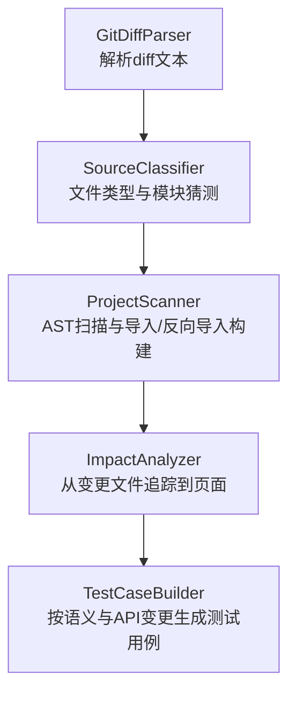
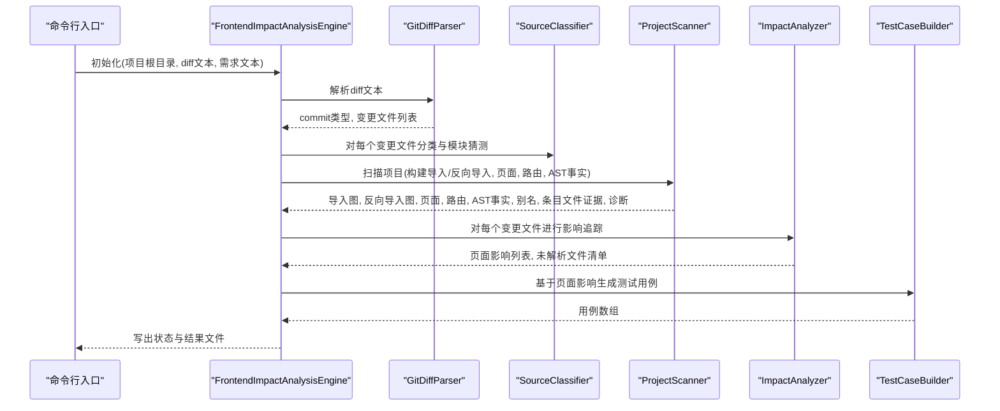
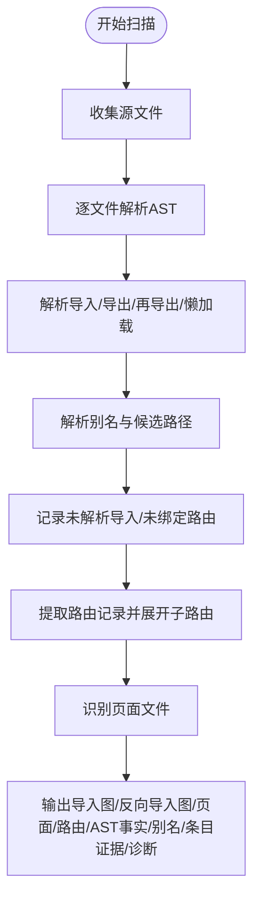
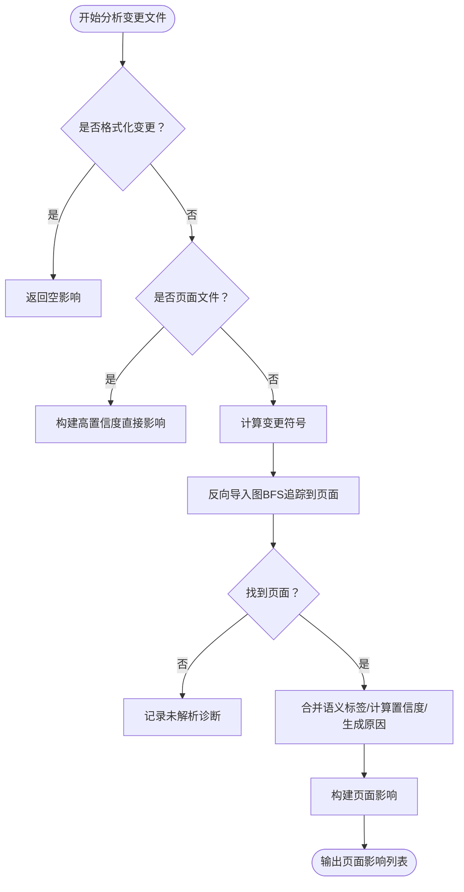
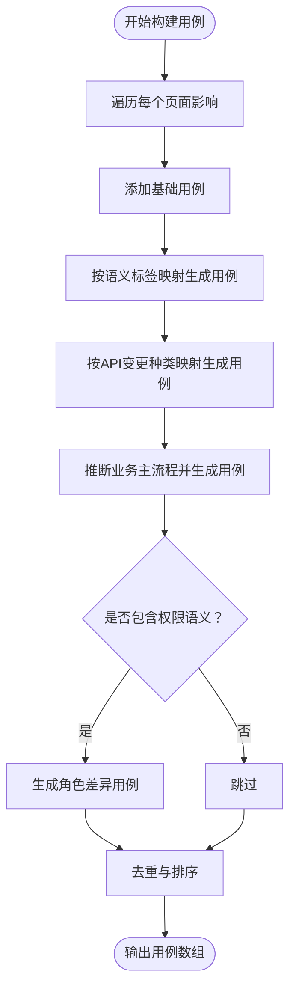
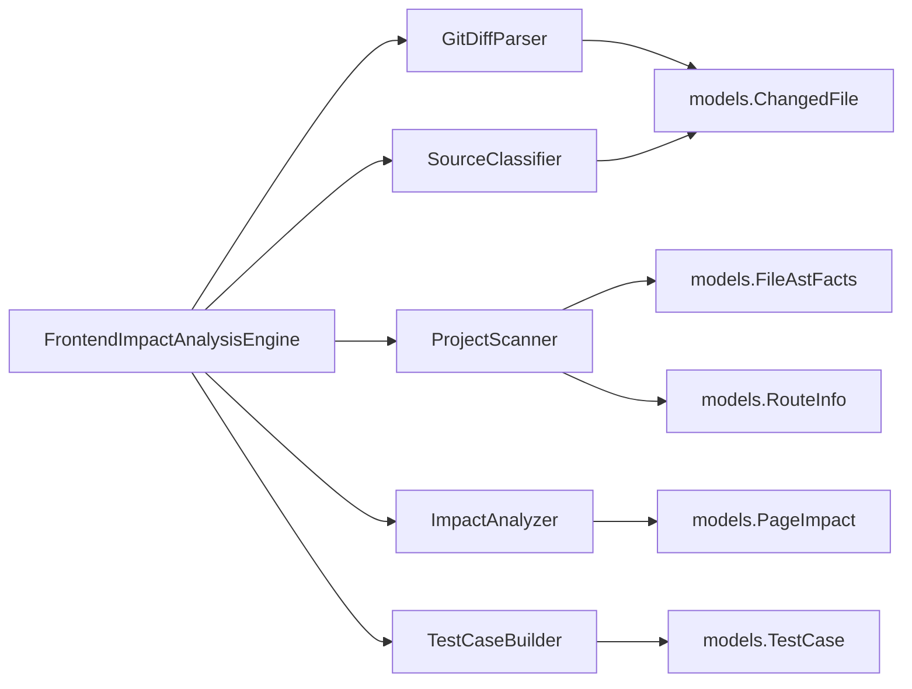
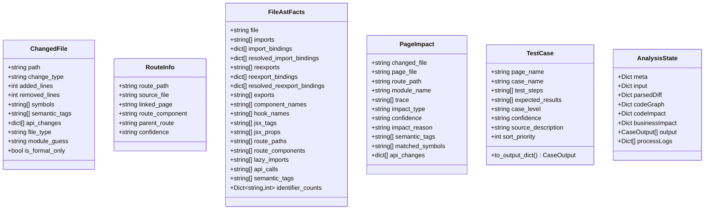

# 核心功能

<cite>
**本文引用的文件**
- [diff_parser.py](file://scripts/analyzer/diff_parser.py)
- [project_scanner.py](file://scripts/analyzer/project_scanner.py)
- [impact_engine.py](file://scripts/analyzer/impact_engine.py)
- [case_builder.py](file://scripts/analyzer/case_builder.py)
- [models.py](file://scripts/analyzer/models.py)
- [common.py](file://scripts/analyzer/common.py)
- [ast_analyzer.py](file://scripts/analyzer/ast_analyzer.py)
- [source_classifier.py](file://scripts/analyzer/source_classifier.py)
- [front_end_impact_analyzer.py](file://scripts/front_end_impact_analyzer.py)
- [workflow.py](file://scripts/analyzer/workflow.py)
</cite>

## 更新摘要
**所做更改**
- 新增用户确认机制章节，详细说明配置文件生成后的用户确认流程
- 更新配置管理系统安全控制章节，包含新的用户确认机制和STOP指令
- 增强配置管理最佳实践建议，涵盖用户确认和手动干预的重要性
- 更新工作流程图，反映用户确认步骤

## 目录
1. [简介](#简介)
2. [项目结构](#项目结构)
3. [核心组件](#核心组件)
4. [架构总览](#架构总览)
5. [详细组件分析](#详细组件分析)
6. [配置管理系统](#配置管理系统)
7. [用户确认机制](#用户确认机制)
8. [依赖关系分析](#依赖关系分析)
9. [性能考量](#性能考量)
10. [故障排查指南](#故障排查指南)
11. [结论](#结论)
12. [附录](#附录)

## 简介
本文件面向前端影响分析器的核心功能，系统化阐述四大模块：
- 代码变更分析（GitDiffParser）
- 项目结构扫描（ProjectScanner）
- 影响追踪（ImpactAnalyzer）
- 测试用例生成（TestCaseBuilder）

文档从实现原理、算法逻辑、数据流、模块协作到使用方法、性能与最佳实践进行深入说明，并提供可视化图示帮助理解。内容兼顾初学者与高级用户的需求。

## 项目结构
该分析器采用"流水线式"处理：解析变更 → 扫描项目 → 影响追踪 → 生成用例。核心代码位于 scripts/analyzer 下，入口脚本位于 scripts/front_end_impact_analyzer.py。

**图表来源**
- [front_end_impact_analyzer.py:40-99](file://scripts/front_end_impact_analyzer.py#L40-L99)
- [diff_parser.py:60-126](file://scripts/analyzer/diff_parser.py#L60-L126)
- [source_classifier.py:6-35](file://scripts/analyzer/source_classifier.py#L6-L35)
- [project_scanner.py:20-80](file://scripts/analyzer/project_scanner.py#L20-L80)
- [impact_engine.py:26-58](file://scripts/analyzer/impact_engine.py#L26-L58)
- [case_builder.py:10-16](file://scripts/analyzer/case_builder.py#L10-L16)

**章节来源**
- [front_end_impact_analyzer.py:40-99](file://scripts/front_end_impact_analyzer.py#L40-L99)

## 核心组件
- GitDiffParser：解析Git diff文本，提取变更文件、符号、语义标签、API变更等，识别格式化变更与API字段变更。
- ProjectScanner：基于AST扫描源码，构建导入/反向导入图、页面集合、路由信息、别名映射、条目文件证据等。
- ImpactAnalyzer：根据变更文件与符号传播，从反向导入图追踪到页面，计算置信度与影响原因。
- TestCaseBuilder：依据页面影响与语义标签、API变更，生成覆盖业务主流程与风险点的测试用例。

**章节来源**
- [diff_parser.py:10-126](file://scripts/analyzer/diff_parser.py#L10-L126)
- [project_scanner.py:13-80](file://scripts/analyzer/project_scanner.py#L13-L80)
- [impact_engine.py:10-58](file://scripts/analyzer/impact_engine.py#L10-L58)
- [case_builder.py:10-59](file://scripts/analyzer/case_builder.py#L10-L59)

## 架构总览
整体流程如下：引擎接收diff与项目根目录，依次执行解析、分类、扫描、追踪、生成，最终输出分析状态与用例数组。

**图表来源**
- [front_end_impact_analyzer.py:40-99](file://scripts/front_end_impact_analyzer.py#L40-L99)
- [diff_parser.py:60-126](file://scripts/analyzer/diff_parser.py#L60-L126)
- [project_scanner.py:20-80](file://scripts/analyzer/project_scanner.py#L20-L80)
- [impact_engine.py:26-58](file://scripts/analyzer/impact_engine.py#L26-L58)
- [case_builder.py:10-16](file://scripts/analyzer/case_builder.py#L10-L16)

## 详细组件分析

### 代码变更分析（GitDiffParser）
- 输入：Git diff文本
- 输出：commit类型列表、变更文件列表（含符号、语义标签、API变更、格式化标记等）
- 关键机制
  - 文件块识别与变更类型判定（新增/删除/修改）
  - 行级hunk解析，统计新增/删除行数
  - 符号抽取：函数、常量、类、首字母大写标识符、JSX标签
  - 语义标签抽取：按钮、弹窗、表单、表格、路由、权限、API、状态、导航、校验、列表查询、提交、列、详情、加载、禁用态、导出等
  - API变更识别：请求字段变更、响应字段变更、枚举变更、分页形状变更、详情/列表结构变更
  - 格式化变更检测：通过规范化比较判断仅空白/引号等变化
- 复杂度与优化
  - 时间复杂度近似O(N)，N为diff行数
  - 使用正则预编译与去重策略降低重复匹配成本
- 使用方法
  - 实例化后调用parse()，得到commit类型与变更文件列表
- 典型应用场景
  - 识别API层字段变更引发的UI展示问题
  - 识别共享组件变更带来的广泛影响
  - 区分格式化提交与实质代码变更

**图表来源**
- [diff_parser.py:60-126](file://scripts/analyzer/diff_parser.py#L60-L126)
- [diff_parser.py:128-300](file://scripts/analyzer/diff_parser.py#L128-L300)

**章节来源**
- [diff_parser.py:10-126](file://scripts/analyzer/diff_parser.py#L10-L126)
- [diff_parser.py:128-300](file://scripts/analyzer/diff_parser.py#L128-L300)

### 项目结构扫描（ProjectScanner）
- 输入：项目根目录
- 输出：导入图、反向导入图、页面列表、路由信息、AST事实、别名映射、条目文件证据、诊断信息
- 关键机制
  - 遍历源文件（支持ts/tsx/js/jsx），读取内容并交由TsAstAnalyzer解析
  - 解析导入/导出/再导出绑定，解析懒加载路由
  - 解析路由对象（路径、组件、懒加载、子路由），构建路由树
  - 解析页面：位于/pages/或/views/且包含组件/JSX标签
  - 解析别名：基于tsconfig的paths与baseUrl，支持继承
  - 未解析导入与未绑定路由生成诊断
- 复杂度与优化
  - 时间复杂度近似O(F·L)，F为源文件数，L为平均文件长度
  - 使用集合去重与缓存解析结果
- 使用方法
  - 实例化后调用scan()，得到上述九元组
- 典型应用场景
  - 构建反向导入图用于影响追踪
  - 提供路由与页面映射，辅助影响分析与用例生成

**图表来源**
- [project_scanner.py:20-80](file://scripts/analyzer/project_scanner.py#L20-L80)
- [project_scanner.py:128-234](file://scripts/analyzer/project_scanner.py#L128-L234)
- [ast_analyzer.py:18-29](file://scripts/analyzer/ast_analyzer.py#L18-L29)

**章节来源**
- [project_scanner.py:13-80](file://scripts/analyzer/project_scanner.py#L13-L80)
- [project_scanner.py:128-234](file://scripts/analyzer/project_scanner.py#L128-L234)
- [ast_analyzer.py:13-29](file://scripts/analyzer/ast_analyzer.py#L13-L29)

### 影响追踪（ImpactAnalyzer）
- 输入：导入图、反向导入图、页面集合、路由信息、AST事实
- 输出：页面影响列表（含置信度、影响原因、语义标签、匹配符号、API变更）
- 关键机制
  - 若为格式化变更，直接返回空影响
  - 若为页面文件，直接构建高置信度直接影响
  - 计算变更符号：取diff符号与AST导出/组件/钩子名的交集
  - BFS式反向追踪：从变更文件出发，沿反向导入边传播符号，遇到页面即记录路径与匹配符号
  - 合并语义标签：合并diff语义与AST语义
  - 置信度规则：页面/路由高；业务组件/接口/钩子/状态且层级<=3高；共享组件按语义中按钮/表格/弹窗/按钮等决定中低；工具/配置/样式低
  - 影响原因：文件类型、追踪步数、语义标签、匹配符号
- 复杂度与优化
  - 时间复杂度近似O(E+V)，E为反向导入边数，V为节点数
  - 使用集合去重与访问标记避免重复搜索
- 使用方法
  - 实例化后对每个变更文件调用analyze_file()，得到页面影响与未解析诊断
- 典型应用场景
  - 将后端API变更映射到前端页面，指导回归测试
  - 将共享组件变更映射到多页面，评估风险范围

**图表来源**
- [impact_engine.py:26-58](file://scripts/analyzer/impact_engine.py#L26-L58)
- [impact_engine.py:77-105](file://scripts/analyzer/impact_engine.py#L77-L105)
- [impact_engine.py:173-187](file://scripts/analyzer/impact_engine.py#L173-L187)

**章节来源**
- [impact_engine.py:10-58](file://scripts/analyzer/impact_engine.py#L10-L58)
- [impact_engine.py:77-105](file://scripts/analyzer/impact_engine.py#L77-L105)
- [impact_engine.py:173-187](file://scripts/analyzer/impact_engine.py#L173-L187)

### 测试用例生成（TestCaseBuilder）
- 输入：页面影响列表
- 输出：测试用例数组（含页面名、用例名、步骤、预期、等级、置信度、来源描述、排序优先级）
- 关键机制
  - 基础用例：页面基础回归
  - 语义映射：按钮、弹窗、表单/校验、表格/列、API、查询/筛选/分页/排序、详情、删除、权限、导航/路由、上传、禁用态
  - API变更映射：请求字段变更、响应字段变更、枚举值变更、分页参数结构变更、详情接口结构变更、列表接口结构变更
  - 业务操作推断：根据语义标签与文件名关键词推断list/detail/create/edit/delete等主流程
  - 角色变体：针对权限语义生成不同角色下的差异验证
  - 去重与排序：按页面名、优先级、等级、置信度、用例名排序
- 复杂度与优化
  - 时间复杂度近似O(P·(S+A+O))，P为页面影响数，S/A/O为语义/API/业务映射数量
  - 使用集合去重与稳定排序
- 使用方法
  - 实例化后调用build()，传入页面影响列表，得到用例数组
- 典型应用场景
  - 自动生成覆盖关键交互与接口变更的回归用例
  - 为不同角色与业务主流程提供针对性测试用例

**图表来源**
- [case_builder.py:10-16](file://scripts/analyzer/case_builder.py#L10-L16)
- [case_builder.py:17-59](file://scripts/analyzer/case_builder.py#L17-L59)
- [case_builder.py:149-170](file://scripts/analyzer/case_builder.py#L149-L170)
- [case_builder.py:204-223](file://scripts/analyzer/case_builder.py#L204-L223)

**章节来源**
- [case_builder.py:10-16](file://scripts/analyzer/case_builder.py#L10-L16)
- [case_builder.py:17-59](file://scripts/analyzer/case_builder.py#L17-L59)
- [case_builder.py:149-170](file://scripts/analyzer/case_builder.py#L149-L170)
- [case_builder.py:204-223](file://scripts/analyzer/case_builder.py#L204-L223)

## 配置管理系统

前端影响分析器包含一个完善的配置管理系统，提供安全控制和改进的初始化流程。该系统确保配置文件的安全性和可靠性。

### 配置文件结构
配置系统使用JSON格式的配置文件，支持以下主要配置项：

- **project**：项目基本信息配置
  - name：项目名称，默认"frontend-project"
  - defaultBaseBranch：默认基线分支，默认"main"
  - defaultCompareBranch：默认对比分支，默认"HEAD"
  - sourceRoot：源代码根目录，默认"."

- **paths**：路径配置
  - projectProfileFile：项目配置文件，默认"impact-analyzer-project-profile.md"
  - repoWikiDir：仓库Wiki目录，默认"repo-wiki"
  - requirementsDir：需求文档目录，默认"requirements"
  - specsDir：规格文档目录，默认"specs"
  - diffDir：diff文件存储目录，默认".impact-analysis/diffs"
  - outputDir：分析结果输出目录，默认".impact-analysis/runs"

- **diff**：diff过滤配置
  - ignoreDirs：忽略的目录列表
  - ignoreFiles：忽略的文件列表
  - ignoreGlobs：忽略的通配符模式列表

- **analysis**：分析行为配置
  - requireRepoWiki：是否要求仓库Wiki，默认True
  - requireRequirements：是否要求需求文档，默认False
  - requireSpecs：是否要求规格文档，默认False
  - maxClustersForDeepAnalysis：深度分析的最大集群数，默认30
  - maxFilesPerClusterContext：每个集群上下文的最大文件数，默认8
  - maxDocumentSnippetsPerCluster：每个集群的最大文档片段数，默认6
  - maxSnippetChars：最大片段字符数，默认5000
  - maxClusterContextChars：集群上下文最大字符数，默认60000
  - maxCommentEvidencePerCluster：每个集群的最大注释证据数，默认20

### 安全控制机制

#### 防止意外覆盖配置文件
配置管理系统包含多重安全控制机制，防止意外覆盖现有配置文件：

1. **存在性检查**：在初始化配置时，系统会检查目标路径是否存在配置文件
2. **强制覆盖标志**：只有在明确指定`--force-config`参数时才会覆盖现有配置
3. **状态报告**：系统返回详细的执行状态，包括"created"、"exists"、"overwritten"三种状态

**图表来源**
- [workflow.py:75-91](file://scripts/analyzer/workflow.py#L75-L91)

#### 配置加载与合并
系统采用"默认配置 + 用户配置"的合并策略：

1. **默认配置**：系统内置的标准配置作为基础
2. **用户配置**：用户自定义的配置文件
3. **深度合并**：递归合并配置，用户配置优先级更高

### 配置初始化流程

#### 命令行参数
配置管理系统提供了专门的命令行参数：

- `--init-config`：初始化默认配置文件
- `--force-config`：强制覆盖现有配置文件（需与--init-config配合使用）
- `--config-file`：指定配置文件路径

#### 初始化过程
配置初始化过程包含以下步骤：

1. **参数解析**：解析命令行参数，确定目标配置文件路径
2. **存在性检查**：检查目标路径是否存在配置文件
3. **安全确认**：如果没有指定强制覆盖且文件已存在，返回"exists"状态
4. **文件写入**：将默认配置写入目标文件
5. **状态报告**：返回详细的执行状态和消息

**章节来源**
- [workflow.py:16-63](file://scripts/analyzer/workflow.py#L16-L63)
- [workflow.py:75-91](file://scripts/analyzer/workflow.py#L75-L91)
- [front_end_impact_analyzer.py:246-247](file://scripts/front_end_impact_analyzer.py#L246-L247)

## 用户确认机制

**更新** 强化了用户确认机制，确保配置文件正确设置后再执行后续步骤

前端影响分析器引入了严格的用户确认机制，确保配置文件在使用前经过人工审核和确认。这一机制通过以下方式实现：

### 确认流程设计

#### 配置生成后的强制确认
当配置文件首次生成时，系统会返回包含`"userActionRequired": true`的状态，并显示明确的STOP指令：

#### 关键确认要点
用户需要特别关注以下配置项：

1. **diff.ignoreDirs** / **diff.ignoreFiles** / **diff.ignoreGlobs**：控制哪些文件被排除在git diff之外，这对减少diff大小至关重要
2. **paths.***：文档和输出目录的配置
3. **analysis.requireRepoWiki**：仓库Wiki是否为必需项

#### 强制STOP机制
系统会在配置生成后立即停止执行任何后续步骤，直到用户明确确认配置文件可接受为止。这确保了：

- 配置文件不会被意外覆盖
- 用户有时间审查和调整关键设置
- 分析过程基于正确的配置执行

### 用户交互流程

#### 第一次使用流程
1. **自动检测**：系统检测项目根目录是否存在`impact-analyzer.config.json`
2. **配置生成**：如不存在，运行`--init-config`生成默认配置
3. **强制确认**：系统返回包含STOP指令的状态，要求用户手动确认
4. **配置审查**：用户审查关键配置项，特别是diff忽略规则
5. **手动确认**：用户确认配置可接受后，系统才继续执行后续步骤

#### 后续使用流程
1. **直接加载**：配置文件已存在时，系统直接加载使用
2. **不覆盖**：不会重新生成或覆盖现有配置
3. **明确警告**：如用户尝试再次运行`--init-config`，系统会明确警告不要覆盖

### 最佳实践建议

#### 配置管理最佳实践
- **备份现有配置**：在覆盖前备份现有配置文件
- **版本控制**：将配置文件纳入版本控制系统
- **最小权限原则**：只授予必要的文件写入权限
- **定期审查**：定期审查配置文件的变更历史

#### 用户确认最佳实践
- **仔细审查**：特别关注diff忽略规则，确保它们符合项目实际情况
- **理解影响**：了解配置项对分析结果的影响
- **手动干预**：不要跳过用户确认步骤，即使看起来很安全
- **文档记录**：记录配置变更的原因和影响

**章节来源**
- [workflow.py:75-104](file://scripts/analyzer/workflow.py#L75-L104)
- [front_end_impact_analyzer.py:282-288](file://scripts/front_end_impact_analyzer.py#L282-L288)
- [SKILL.md:14-21](file://SKILL.md#L14-L21)
- [references/agent-usage.md:19-21](file://references/agent-usage.md#L19-L21)

## 依赖关系分析
- 模块内聚与耦合
  - GitDiffParser与SourceClassifier解耦，前者专注diff解析，后者专注文件分类
  - ProjectScanner依赖TsAstAnalyzer与common工具，负责构建静态结构图
  - ImpactAnalyzer依赖common与models，专注符号传播与置信度计算
  - TestCaseBuilder依赖models与common，专注用例模板与排序
- 外部依赖
  - tree-sitter-typescript：AST解析
  - 正则表达式：符号与语义匹配
- 数据模型
  - ChangedFile、RouteInfo、FileAstFacts、PageImpact、TestCase、AnalysisState等承载跨模块数据

**图表来源**
- [models.py:26-107](file://scripts/analyzer/models.py#L26-L107)
- [front_end_impact_analyzer.py:40-99](file://scripts/front_end_impact_analyzer.py#L40-L99)

**章节来源**
- [models.py:26-107](file://scripts/analyzer/models.py#L26-L107)
- [front_end_impact_analyzer.py:40-99](file://scripts/front_end_impact_analyzer.py#L40-L99)

## 性能考量
- 正则与字符串处理
  - 预编译正则表达式，减少重复编译开销
  - 统一归一化路径与大小写，避免重复匹配
- AST解析
  - tree-sitter解析器复用，避免重复初始化
  - 对导入/导出/再导出绑定进行一次性解析
- 图搜索
  - 使用集合去重与访问标记，避免重复搜索
  - BFS按层扩展，控制队列规模
- I/O与编码
  - 安全读取文件，忽略无法解码字符，保证稳定性
- 建议
  - 在大型项目中，优先缓存AST事实与导入图
  - 对频繁运行的场景，考虑增量扫描与增量追踪
  - 对正则匹配热点，可引入更高效的匹配库或缓存中间结果

## 故障排查指南
- 常见问题与诊断
  - 未解析导入：ProjectScanner会记录"unable to resolve import target"，检查别名配置与文件路径
  - 未绑定路由：记录"unable to bind route to page"，检查路由对象与组件/懒加载声明
  - 无法追踪到页面：ImpactAnalyzer返回未解析诊断，检查反向导入关系与页面识别规则
  - 格式化变更：GitDiffParser识别为格式化变更，不会生成影响
  - 配置文件覆盖：如果配置文件已存在且未指定--force-config，系统会阻止覆盖并返回"exists"状态
  - 用户确认阻塞：如果配置文件刚生成但未经过用户确认，系统会显示STOP指令并阻止继续执行
- 日志与状态
  - ProcessRecorder记录每一步状态，便于定位问题
  - AnalysisState包含processLogs与diagnostics，便于输出与审计
- 建议
  - 逐步缩小范围：先验证diff解析与分类，再验证扫描与追踪
  - 检查tsconfig别名与路径映射，确保解析准确
  - 对共享组件变更，结合语义标签与置信度综合评估
  - 在配置管理中，始终先备份现有配置，再进行覆盖操作
  - 严格遵守用户确认机制，不要跳过配置审查步骤

**章节来源**
- [project_scanner.py:45-50](file://scripts/analyzer/project_scanner.py#L45-L50)
- [project_scanner.py:193-199](file://scripts/analyzer/project_scanner.py#L193-L199)
- [impact_engine.py:33-39](file://scripts/analyzer/impact_engine.py#L33-L39)
- [models.py:141-147](file://scripts/analyzer/models.py#L141-L147)
- [workflow.py:92-104](file://scripts/analyzer/workflow.py#L92-L104)

## 结论
本分析器通过"解析diff → 扫描项目 → 影响追踪 → 生成用例"的流水线，实现了从前端代码变更到测试用例的自动化闭环。其核心优势在于：
- 基于AST与符号传播的影响追踪，提升准确性
- 丰富的语义标签与API变更识别，覆盖关键风险点
- 结构化的用例模板与排序，便于落地执行
- 完善的配置管理系统，提供安全控制和改进的初始化流程
- **强化的用户确认机制**，确保配置文件正确设置后再执行后续步骤

建议在实际工程中结合CI/CD与自动化测试平台，持续产出高质量回归用例，保障前端变更质量。同时，严格遵循用户确认机制，确保配置文件的质量和可靠性。

## 附录
- 数据模型概览

**图表来源**
- [models.py:26-139](file://scripts/analyzer/models.py#L26-L139)