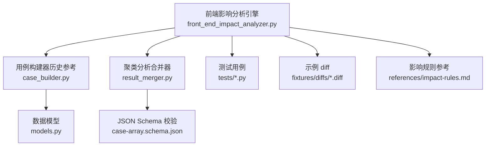
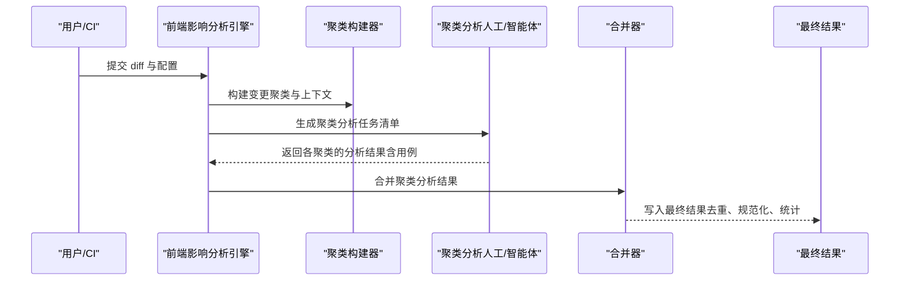
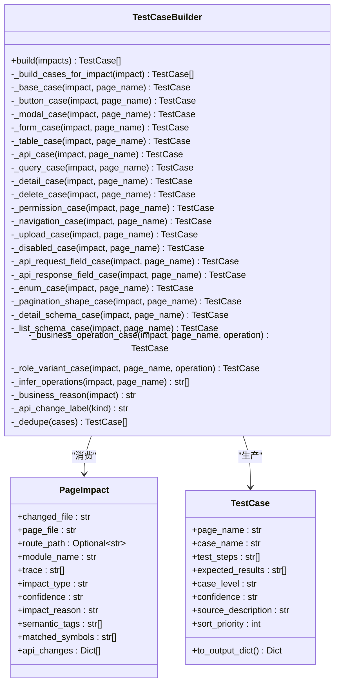
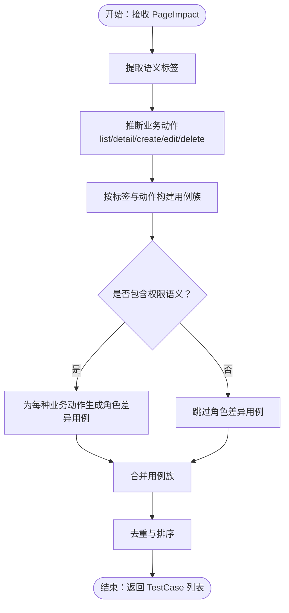
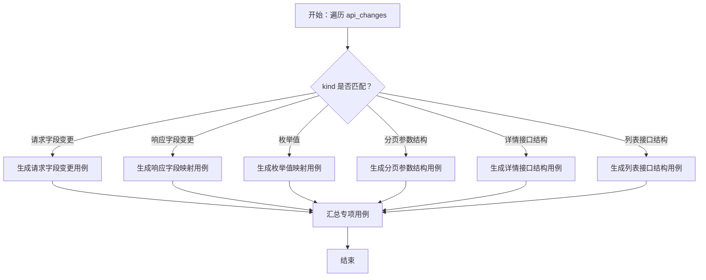
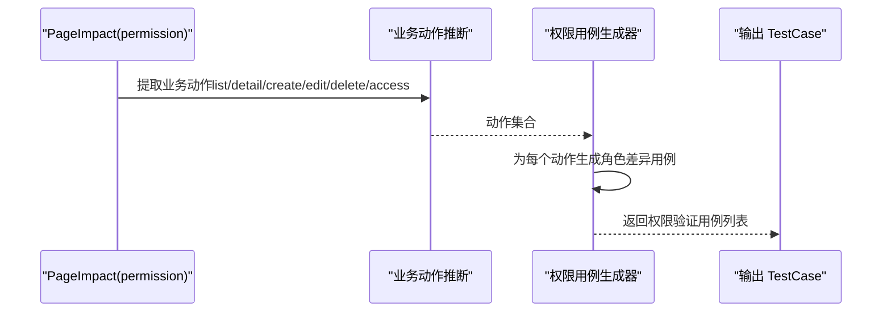
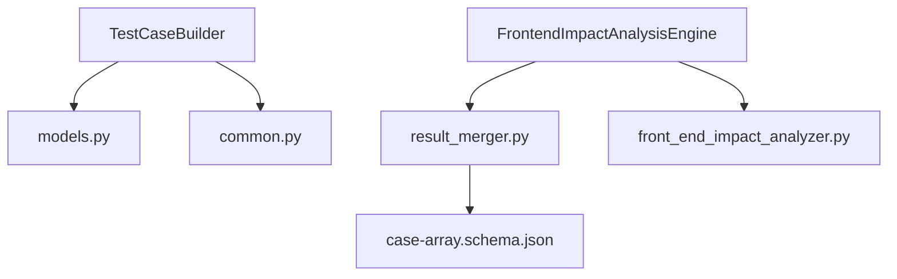

# 测试用例生成

<cite>
**本文引用的文件**
- [scripts/analyzer/case_builder.py](file://scripts/analyzer/case_builder.py)
- [scripts/analyzer/models.py](file://scripts/analyzer/models.py)
- [scripts/analyzer/common.py](file://scripts/analyzer/common.py)
- [scripts/front_end_impact_analyzer.py](file://scripts/front_end_impact_analyzer.py)
- [scripts/analyzer/result_merger.py](file://scripts/analyzer/result_merger.py)
- [schemas/case-array.schema.json](file://schemas/case-array.schema.json)
- [references/impact-rules.md](file://references/impact-rules.md)
- [tests/test_no_template_cases.py](file://tests/test_no_template_cases.py)
- [tests/test_integration_output.py](file://tests/test_integration_output.py)
- [fixtures/diffs/shared_search_form.diff](file://fixtures/diffs/shared_search_form.diff)
- [references/project-conventions.md](file://references/project-conventions.md)
</cite>

## 目录
1. [简介](#简介)
2. [项目结构](#项目结构)
3. [核心组件](#核心组件)
4. [架构总览](#架构总览)
5. [详细组件分析](#详细组件分析)
6. [依赖分析](#依赖分析)
7. [性能考量](#性能考量)
8. [故障排查指南](#故障排查指南)
9. [结论](#结论)
10. [附录](#附录)

## 简介
本文件围绕“测试用例生成”主题，系统化阐述前端影响分析流水线中的用例生成机制。当前仓库采用“模板用例生成已弃用”的策略：即不再由引擎直接生成基础模板用例，而是通过“聚类分析（Cluster Analysis）+ 人工/智能体编写 + 合并器”三段式产出高质量用例。TestCaseBuilder 作为历史参考模块，展示了工厂模式下的用例模板体系与扩展机制，便于理解用例生成的语义覆盖与优先级排序规则，并为后续扩展提供依据。

## 项目结构
- 影响分析主引擎位于 scripts/front_end_impact_analyzer.py，负责解析 diff、扫描项目、构建聚类、输出中间产物与最终结果包。
- 用例生成相关逻辑集中在 scripts/analyzer/case_builder.py（模板用例生成已弃用）、scripts/analyzer/result_merger.py（合并聚类分析产出的用例）。
- 数据模型定义于 scripts/analyzer/models.py，包括 PageImpact、TestCase 等。
- 工具函数 common.py 提供通用能力（如标题转换、去重、置信度映射等）。
- 测试用例位于 tests/，验证主流程不生成模板用例、输出结构与 JSON Schema 的一致性等。
- 参考文档 references/impact-rules.md 给出语义标签到测试映射的指导。

图表来源
- [scripts/front_end_impact_analyzer.py:1-403](file://scripts/front_end_impact_analyzer.py#L1-L403)
- [scripts/analyzer/case_builder.py:1-228](file://scripts/analyzer/case_builder.py#L1-L228)
- [scripts/analyzer/result_merger.py:1-217](file://scripts/analyzer/result_merger.py#L1-L217)
- [scripts/analyzer/models.py:1-201](file://scripts/analyzer/models.py#L1-L201)
- [schemas/case-array.schema.json:1-51](file://schemas/case-array.schema.json#L1-L51)
- [references/impact-rules.md:1-19](file://references/impact-rules.md#L1-L19)

章节来源
- [scripts/front_end_impact_analyzer.py:1-403](file://scripts/front_end_impact_analyzer.py#L1-L403)
- [references/impact-rules.md:1-19](file://references/impact-rules.md#L1-L19)

## 核心组件
- TestCaseBuilder（工厂模式）
  - 输入：PageImpact 列表
  - 输出：去重并按优先级排序的 TestCase 列表
  - 关键点：
    - 基础用例模板：页面基础回归
    - 语义标签驱动的用例族：按钮、弹窗、表单、校验、表格、API、查询筛选分页排序、详情、删除、权限、导航、上传、禁用态等
    - API 变更用例族：请求字段变更、响应字段变更、枚举值、分页形状、详情/列表结构变更
    - 业务主流程推断：基于语义与文本关键词推断 list/detail/create/edit/delete
    - 角色变体用例：针对权限语义，生成不同角色的差异验证
    - 去重与排序：按页面名、排序优先级、用例等级、置信度、用例名排序
- 数据模型
  - PageImpact：承载变更文件、页面文件、路由路径、模块名、置信度、影响原因、语义标签、匹配符号、API 变更等
  - TestCase：承载页面名、用例名、测试步骤、预期结果、用例等级、置信度、来源描述、排序优先级
  - CaseOutput：用于输出字典化的用例结构
- 工具函数
  - 标题转换、去重、置信度映射、模块名提取等

章节来源
- [scripts/analyzer/case_builder.py:15-228](file://scripts/analyzer/case_builder.py#L15-L228)
- [scripts/analyzer/models.py:77-113](file://scripts/analyzer/models.py#L77-L113)
- [scripts/analyzer/common.py:37-72](file://scripts/analyzer/common.py#L37-L72)

## 架构总览
当前用例生成采用“影响分析 + 聚类 + 人工/智能体 + 合并”的流水线，TestCaseBuilder 仅保留为历史参考，实际用例由聚类分析阶段产出并通过合并器统一归档与去重。

图表来源
- [scripts/front_end_impact_analyzer.py:116-149](file://scripts/front_end_impact_analyzer.py#L116-L149)
- [scripts/analyzer/result_merger.py:16-96](file://scripts/analyzer/result_merger.py#L16-L96)

章节来源
- [scripts/front_end_impact_analyzer.py:116-149](file://scripts/front_end_impact_analyzer.py#L116-L149)
- [scripts/analyzer/result_merger.py:16-96](file://scripts/analyzer/result_merger.py#L16-L96)

## 详细组件分析

### TestCaseBuilder 工厂模式与用例模板体系
- 设计要点
  - 工厂方法：build() 对每个 PageImpact 调用 _build_cases_for_impact()，再统一去重与排序
  - 映射表：语义标签到具体用例构建器的映射，支持多标签叠加
  - API 变更映射：针对不同 kind 的 API 变更生成专项用例
  - 业务主流程推断：从语义与文本关键词推断 list/detail/create/edit/delete
  - 角色变体：当存在 permission 语义时，为每种业务操作生成角色差异用例
  - 去重与排序：以页面名、排序优先级、用例等级、置信度、用例名为键进行稳定排序
- 用例模板类别与生成规则
  - 基础用例：页面基础回归（排序优先级最高）
  - 交互类：按钮、弹窗、表单/校验、表格/列、上传、禁用态
  - 数据类：API 调用与反馈、查询/筛选/分页/排序、详情、删除
  - 结构类：请求字段变更、响应字段映射、枚举值、分页参数结构、详情/列表字段结构
  - 权限类：权限可见性与可操作性验证、角色差异验证
  - 导航类：路由进入、跳转、刷新与返回
  - 业务主流程：根据推断的业务动作生成对应主流程验证用例

图表来源
- [scripts/analyzer/case_builder.py:15-228](file://scripts/analyzer/case_builder.py#L15-L228)
- [scripts/analyzer/models.py:77-113](file://scripts/analyzer/models.py#L77-L113)

章节来源
- [scripts/analyzer/case_builder.py:15-228](file://scripts/analyzer/case_builder.py#L15-L228)
- [scripts/analyzer/models.py:77-113](file://scripts/analyzer/models.py#L77-L113)

### 业务场景用例生成逻辑
- 语义标签驱动：当 PageImpact 包含特定语义标签（如 table、list-query、detail、form、api 等），会触发相应用例族
- 文本关键词推断：通过页面名、文件名、路由路径、变更文件名中的关键词，推断业务动作（list/detail/create/edit/delete）
- 业务主流程用例：针对推断出的业务动作生成主流程验证用例，覆盖加载、筛选、提交、编辑、删除等关键节点

图表来源
- [scripts/analyzer/case_builder.py:22-64](file://scripts/analyzer/case_builder.py#L22-L64)
- [scripts/analyzer/case_builder.py:154-175](file://scripts/analyzer/case_builder.py#L154-L175)
- [scripts/analyzer/case_builder.py:209-228](file://scripts/analyzer/case_builder.py#L209-L228)

章节来源
- [scripts/analyzer/case_builder.py:22-64](file://scripts/analyzer/case_builder.py#L22-L64)
- [scripts/analyzer/case_builder.py:154-175](file://scripts/analyzer/case_builder.py#L154-L175)
- [scripts/analyzer/case_builder.py:209-228](file://scripts/analyzer/case_builder.py#L209-L228)

### API 变更用例生成逻辑
- API 变更种类：请求字段变更、响应字段变更、枚举值、分页参数结构、详情接口结构、列表接口结构
- 生成策略：根据 PageImpact 中 api_changes 的 kind 字段匹配到对应的专项用例构建器
- 专项用例关注点：字段新增/删除/重命名、参数结构一致性、枚举映射正确性、分页参数与结果一致性、详情/列表字段映射与容错

图表来源
- [scripts/analyzer/case_builder.py:47-58](file://scripts/analyzer/case_builder.py#L47-L58)
- [scripts/analyzer/case_builder.py:110-121](file://scripts/analyzer/case_builder.py#L110-L121)

章节来源
- [scripts/analyzer/case_builder.py:47-58](file://scripts/analyzer/case_builder.py#L47-L58)
- [scripts/analyzer/case_builder.py:110-121](file://scripts/analyzer/case_builder.py#L110-L121)

### 权限验证用例生成逻辑
- 权限语义：当 PageImpact 包含 permission 语义时，生成“权限可见性与可操作性验证”
- 角色差异：为每种业务动作（list/detail/create/edit/delete/access）生成角色差异验证用例，覆盖不同角色下的入口、按钮、提交能力差异
- 生成策略：基于业务动作标签与权限语义组合，构造角色切换场景下的验证步骤与预期结果

图表来源
- [scripts/analyzer/case_builder.py:61-63](file://scripts/analyzer/case_builder.py#L61-L63)
- [scripts/analyzer/case_builder.py:136-152](file://scripts/analyzer/case_builder.py#L136-L152)

章节来源
- [scripts/analyzer/case_builder.py:61-63](file://scripts/analyzer/case_builder.py#L61-L63)
- [scripts/analyzer/case_builder.py:136-152](file://scripts/analyzer/case_builder.py#L136-L152)

### 用例模板系统的设计原理与扩展机制
- 设计原理
  - 工厂模式：集中管理用例构建器，按语义标签与 API 变更种类动态选择构建器
  - 映射表：将语义标签与 API kind 映射到具体构建器，便于扩展
  - 推断与组合：结合语义标签与文本关键词推断业务动作，叠加生成多类用例
  - 去重与排序：保证输出用例唯一且有序，便于人工审阅与自动化执行
- 扩展机制
  - 新增语义标签：在映射表中添加新标签与对应构建器
  - 新增 API 变更类型：在 API 映射表中添加新 kind 与对应构建器
  - 新增业务动作：在推断逻辑中加入新的关键词或规则
  - 自定义优先级：通过 sort_priority 控制排序优先级

章节来源
- [scripts/analyzer/case_builder.py:27-64](file://scripts/analyzer/case_builder.py#L27-L64)
- [scripts/analyzer/case_builder.py:48-58](file://scripts/analyzer/case_builder.py#L48-L58)
- [scripts/analyzer/case_builder.py:154-175](file://scripts/analyzer/case_builder.py#L154-L175)
- [scripts/analyzer/case_builder.py:209-228](file://scripts/analyzer/case_builder.py#L209-L228)

### 具体示例：根据影响分析结果生成针对性测试用例
- 示例 diff：共享搜索表单变更，涉及表单提交、按钮禁用状态等
- 影响分析结果：PageImpact 包含 form、submit、button、disabled-state 等语义标签
- 生成用例族：
  - 基础用例：页面基础回归
  - 表单用例：表单展示、校验与提交流程验证
  - 按钮用例：按钮入口与点击行为验证
  - 禁用态用例：禁用态与只读态验证
  - 权限用例：权限可见性与可操作性验证（若包含 permission 语义）

章节来源
- [fixtures/diffs/shared_search_form.diff:1-14](file://fixtures/diffs/shared_search_form.diff#L1-L14)
- [references/impact-rules.md:8-19](file://references/impact-rules.md#L8-L19)

### 用例质量评估标准与最佳实践
- 质量评估标准
  - 完整性：覆盖所有语义标签对应的用例族
  - 准确性：测试步骤与预期结果与语义标签一致
  - 可执行性：步骤清晰、可重复、可自动化
  - 可维护性：用例命名规范、来源描述明确、排序合理
- 最佳实践
  - 在聚类分析阶段明确“用户可见变更”，确保用例聚焦真实业务影响
  - 使用角色差异用例覆盖权限场景，避免越权问题
  - 对 API 变更用例进行字段映射与容错验证，确保前后兼容
  - 通过合并器进行去重与规范化，保持用例集的一致性

章节来源
- [scripts/analyzer/result_merger.py:152-166](file://scripts/analyzer/result_merger.py#L152-L166)
- [references/impact-rules.md:3-6](file://references/impact-rules.md#L3-L6)

### 与测试框架的集成方式
- 输出格式：用例以 JSON 数组形式输出，符合 schemas/case-array.schema.json 约束
- 合并器：通过 ClusterAnalysisMerger 将聚类分析产出的用例规范化、去重、统计
- 测试验证：tests/test_integration_output.py 验证输出结构与 JSON Schema 的一致性
- 执行建议：将合并后的用例导入测试框架（如 Jest/Playwright/Cypress），按页面名与用例名组织测试套件

章节来源
- [schemas/case-array.schema.json:1-51](file://schemas/case-array.schema.json#L1-L51)
- [scripts/analyzer/result_merger.py:110-134](file://scripts/analyzer/result_merger.py#L110-L134)
- [tests/test_integration_output.py:62-90](file://tests/test_integration_output.py#L62-L90)

## 依赖分析
- TestCaseBuilder 依赖 PageImpact 与 TestCase 数据模型，以及工具函数（标题转换、去重、置信度映射）
- 影响分析引擎负责生成聚类与上下文，用例生成阶段由聚类分析产出主导
- 合并器依赖聚类分析产物与路由显示名映射，进行规范化与去重

图表来源
- [scripts/analyzer/case_builder.py:11-12](file://scripts/analyzer/case_builder.py#L11-L12)
- [scripts/analyzer/models.py:92-113](file://scripts/analyzer/models.py#L92-L113)
- [scripts/analyzer/common.py:47-72](file://scripts/analyzer/common.py#L47-L72)
- [scripts/front_end_impact_analyzer.py:116-149](file://scripts/front_end_impact_analyzer.py#L116-L149)
- [scripts/analyzer/result_merger.py:110-134](file://scripts/analyzer/result_merger.py#L110-L134)
- [schemas/case-array.schema.json:1-51](file://schemas/case-array.schema.json#L1-L51)

章节来源
- [scripts/analyzer/case_builder.py:11-12](file://scripts/analyzer/case_builder.py#L11-L12)
- [scripts/analyzer/models.py:92-113](file://scripts/analyzer/models.py#L92-L113)
- [scripts/analyzer/common.py:47-72](file://scripts/analyzer/common.py#L47-L72)
- [scripts/front_end_impact_analyzer.py:116-149](file://scripts/front_end_impact_analyzer.py#L116-L149)
- [scripts/analyzer/result_merger.py:110-134](file://scripts/analyzer/result_merger.py#L110-L134)
- [schemas/case-array.schema.json:1-51](file://schemas/case-array.schema.json#L1-L51)

## 性能考量
- 工厂构建器的时间复杂度近似 O(N*M)，N 为 PageImpact 数量，M 为语义标签与 API 变更种类数量
- 去重与排序在输出阶段进行，整体开销可控
- 建议在大规模变更场景下，优先通过聚类减少用例规模，再由人工/智能体精细化补充

## 故障排查指南
- 主流程不生成模板用例
  - 现象：processLogs 中 build_cases 步骤标记为 skipped，cases 为空
  - 原因：模板用例生成已弃用，需依赖聚类分析产出
  - 处理：运行聚类分析任务，合并分析结果
- JSON Schema 校验失败
  - 现象：输出用例数组不符合 schemas/case-array.schema.json 约束
  - 原因：缺少必需字段或字段类型不符
  - 处理：检查用例字段完整性与类型，确保符合 schema
- 权限用例缺失
  - 现象：未生成角色差异用例
  - 原因：PageImpact 不包含 permission 语义
  - 处理：在聚类分析中明确权限相关影响

章节来源
- [tests/test_no_template_cases.py:8-21](file://tests/test_no_template_cases.py#L8-L21)
- [tests/test_integration_output.py:62-90](file://tests/test_integration_output.py#L62-L90)
- [scripts/analyzer/result_merger.py:110-134](file://scripts/analyzer/result_merger.py#L110-L134)

## 结论
TestCaseBuilder 展示了以工厂模式为核心的用例模板体系，覆盖交互、数据、结构、权限与导航等多维度语义标签，并通过 API 变更映射与业务动作推断实现高覆盖率的用例生成。当前流水线采用“聚类分析 + 合并”的策略，.TestCaseBuilder 作为历史参考模块，其设计原则与扩展机制仍可为后续用例生成提供重要借鉴。

## 附录
- 项目约定参考：references/project-conventions.md
- 影响规则参考：references/impact-rules.md
- 示例 diff：fixtures/diffs/shared_search_form.diff

章节来源
- [references/project-conventions.md:1-20](file://references/project-conventions.md#L1-L20)
- [references/impact-rules.md:1-19](file://references/impact-rules.md#L1-L19)
- [fixtures/diffs/shared_search_form.diff:1-14](file://fixtures/diffs/shared_search_form.diff#L1-L14)