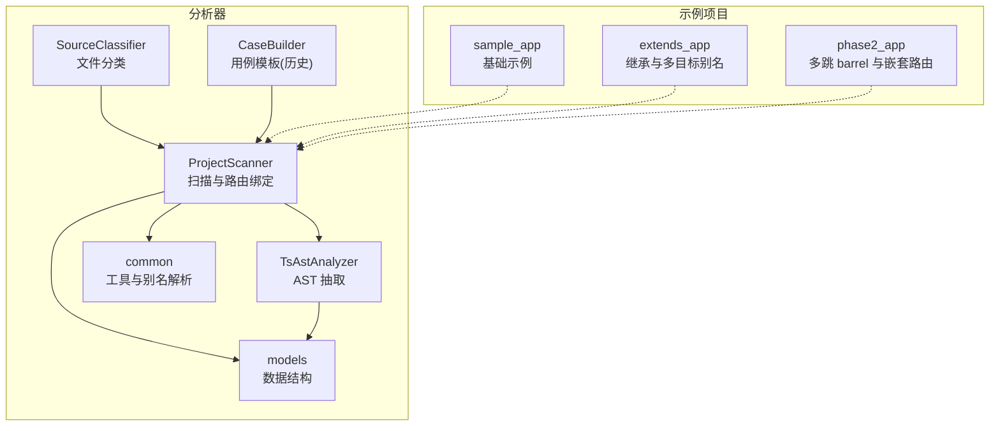
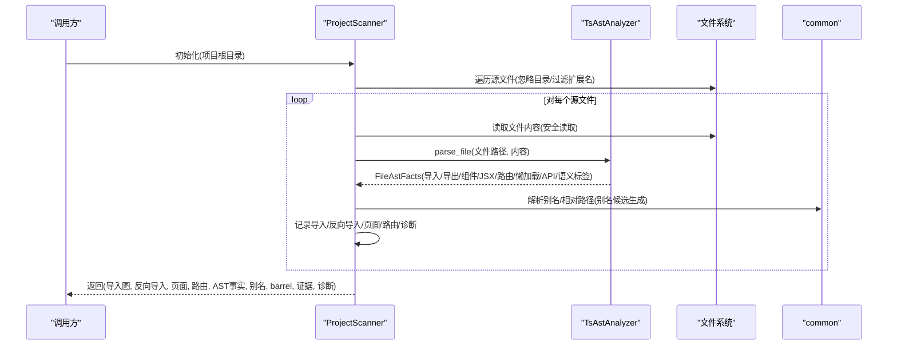
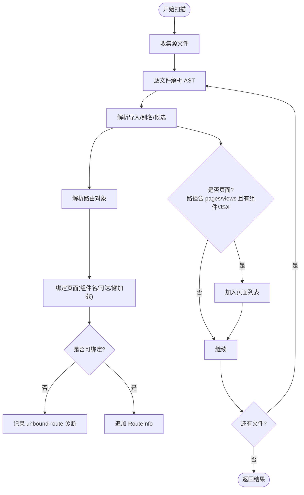
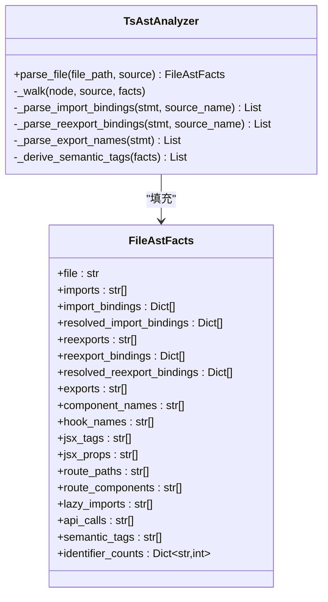
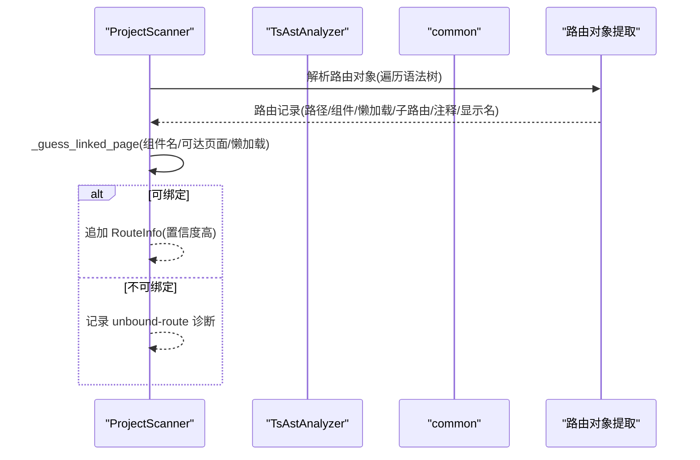
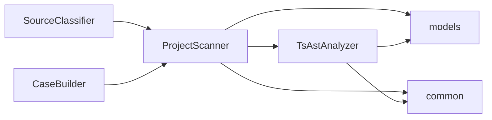

# 项目结构扫描

<cite>
**本文引用的文件**
- [scripts/analyzer/project_scanner.py](file://scripts/analyzer/project_scanner.py)
- [scripts/analyzer/ast_analyzer.py](file://scripts/analyzer/ast_analyzer.py)
- [scripts/analyzer/models.py](file://scripts/analyzer/models.py)
- [scripts/analyzer/common.py](file://scripts/analyzer/common.py)
- [scripts/analyzer/source_classifier.py](file://scripts/analyzer/source_classifier.py)
- [scripts/analyzer/case_builder.py](file://scripts/analyzer/case_builder.py)
- [tests/test_project_scanner.py](file://tests/test_project_scanner.py)
- [tests/test_ast_analyzer.py](file://tests/test_ast_analyzer.py)
- [fixtures/sample_app/tsconfig.json](file://fixtures/sample_app/tsconfig.json)
- [fixtures/extends_app/tsconfig.json](file://fixtures/extends_app/tsconfig.json)
- [fixtures/phase2_app/tsconfig.json](file://fixtures/phase2_app/tsconfig.json)
- [fixtures/sample_app/src/routes/index.tsx](file://fixtures/sample_app/src/routes/index.tsx)
- [fixtures/extends_app/src/routes/index.tsx](file://fixtures/extends_app/src/routes/index.tsx)
- [fixtures/phase2_app/src/routes/index.tsx](file://fixtures/phase2_app/src/routes/index.tsx)
- [fixtures/sample_app/src/pages/users/UserListPage.tsx](file://fixtures/sample_app/src/pages/users/UserListPage.tsx)
- [fixtures/sample_app/src/components/shared/SearchForm.tsx](file://fixtures/sample_app/src/components/shared/SearchForm.tsx)
</cite>

## 目录
1. [简介](#简介)
2. [项目结构](#项目结构)
3. [核心组件](#核心组件)
4. [架构总览](#架构总览)
5. [详细组件分析](#详细组件分析)
6. [依赖关系分析](#依赖关系分析)
7. [性能考虑](#性能考虑)
8. [故障排除指南](#故障排除指南)
9. [结论](#结论)
10. [附录](#附录)

## 简介
本文件围绕“项目结构扫描”功能展开，系统阐述 ProjectScanner 如何扫描前端项目结构，包括 AST 解析、导入关系追踪、页面识别与路由绑定；同时详解 TsAstAnalyzer 的工作原理：TypeScript/TSX 语法树解析、符号表构建与依赖关系提取。文档还给出算法流程与数据结构设计、复杂项目结构的处理示例、性能优化技巧与故障排除指南，并说明与其他模块（如模型、通用工具、用例生成）的集成关系。

## 项目结构
该项目采用脚本驱动的分析器组织方式，核心扫描逻辑集中在 analyzer 子包内，配合 fixtures 提供多套示例应用以覆盖不同配置与结构场景。关键文件职责如下：
- ProjectScanner：负责遍历源码、解析 AST、收集导入/反向导入、识别页面、解析路由、构建诊断信息与导出结构化图谱。
- TsAstAnalyzer：基于 Tree-sitter 对 TS/TSX 文件进行语法树遍历，抽取导入、导出、组件名、Hook 名、JSX 标签与属性、路由对象、懒加载、API 调用等事实，并派生语义标签。
- models：定义分析产物的数据结构，如 RouteInfo、FileAstFacts、AnalysisState 等。
- common：提供通用常量、路径处理、安全读取、去重、TS 路径别名解析等工具。
- source_classifier：对文件进行分类与模块名猜测，辅助后续影响分析。
- case_builder：根据页面影响推导测试用例模板（历史参考），体现扫描结果在测试侧的应用。
- tests：通过 fixtures 驱动的端到端断言，验证扫描结果的正确性与鲁棒性。

图表来源
- [scripts/analyzer/project_scanner.py:13-80](file://scripts/analyzer/project_scanner.py#L13-L80)
- [scripts/analyzer/ast_analyzer.py:13-31](file://scripts/analyzer/ast_analyzer.py#L13-L31)
- [scripts/analyzer/common.py:74-96](file://scripts/analyzer/common.py#L74-L96)
- [scripts/analyzer/models.py:42-75](file://scripts/analyzer/models.py#L42-L75)
- [scripts/analyzer/source_classifier.py:6-36](file://scripts/analyzer/source_classifier.py#L6-L36)
- [scripts/analyzer/case_builder.py:15-228](file://scripts/analyzer/case_builder.py#L15-L228)

章节来源
- [scripts/analyzer/project_scanner.py:13-80](file://scripts/analyzer/project_scanner.py#L13-L80)
- [scripts/analyzer/ast_analyzer.py:13-31](file://scripts/analyzer/ast_analyzer.py#L13-L31)
- [scripts/analyzer/models.py:42-75](file://scripts/analyzer/models.py#L42-L75)
- [scripts/analyzer/common.py:74-96](file://scripts/analyzer/common.py#L74-L96)
- [scripts/analyzer/source_classifier.py:6-36](file://scripts/analyzer/source_classifier.py#L6-L36)
- [scripts/analyzer/case_builder.py:15-228](file://scripts/analyzer/case_builder.py#L15-L228)

## 核心组件
- ProjectScanner
  - 扫描入口：遍历 src 或根目录下的源文件集合，逐个读取内容并调用 TsAstAnalyzer 解析。
  - 导入解析：统一处理 import、export、re-export、lazy-import 以及路由中的懒加载目标，支持相对路径与 TS 路径别名解析。
  - 反向导入：维护反向导入映射，便于从被依赖方回溯到依赖方。
  - 页面识别：依据路径模式与 AST 中的组件/JSX 特征判断页面文件。
  - 路由绑定：从路由对象中提取 path、component/lazy、children 等，递归展开子路由，结合导入图与页面集进行页面绑定与诊断。
  - 结果输出：返回导入图、反向导入、页面列表、路由信息、AST 事实、别名映射、barrel 文件及证据、诊断信息。
- TsAstAnalyzer
  - 解析器：按文件类型选择 TS 或 TSX 解析器，生成语法树。
  - 遍历抽取：在树上遍历节点，抽取 imports、exports、reexports、component_names、hook_names、jsx_tags、jsx_props、route_paths、route_components、lazy_imports、api_calls 等。
  - 绑定解析：解析 import/export 的命名/默认/命名空间/通配绑定，记录本地别名与导出名。
  - 语义标签：根据 JSX 标签、属性、API 调用、路由相关节点派生语义标签（如 button/modal/form/table/upload/route/api/state 等）。
- models
  - FileAstFacts：承载单文件的 AST 抽取结果与派生标签。
  - RouteInfo：承载路由路径、来源文件、绑定页面、组件名、父路由、置信度、显示名等。
  - AnalysisState：承载完整分析状态，包含 codeGraph、codeImpact、candidateImpact、businessImpact、workflow 等。
- common
  - 常量：源文件扩展名、样式扩展名、忽略目录、API 函数名集合。
  - 工具：路径规范化、相对路径计算、安全读取、去重、标题与模块名推断。
  - 别名解析：从 tsconfig.json 加载 baseUrl 与 paths，支持 extends 继承，支持多目标别名，生成候选绝对路径。
- source_classifier
  - 文件分类：按路径与文件名特征将文件归类为 page、route、api、store、hook、shared-component、business-component、utils、config-or-schema 等。
  - 模块名猜测：从路径中提取模块名。
- case_builder
  - 用例模板：根据页面影响与语义标签生成测试用例模板（历史参考，现主要由外部聚合并合并）。

章节来源
- [scripts/analyzer/project_scanner.py:20-80](file://scripts/analyzer/project_scanner.py#L20-L80)
- [scripts/analyzer/ast_analyzer.py:18-31](file://scripts/analyzer/ast_analyzer.py#L18-L31)
- [scripts/analyzer/models.py:42-75](file://scripts/analyzer/models.py#L42-L75)
- [scripts/analyzer/common.py:8-14](file://scripts/analyzer/common.py#L8-L14)
- [scripts/analyzer/common.py:74-96](file://scripts/analyzer/common.py#L74-L96)
- [scripts/analyzer/source_classifier.py:6-36](file://scripts/analyzer/source_classifier.py#L6-L36)
- [scripts/analyzer/case_builder.py:15-228](file://scripts/analyzer/case_builder.py#L15-L228)

## 架构总览
ProjectScanner 作为扫描编排者，协调 TsAstAnalyzer 完成 AST 抽取，再结合 common 的别名解析与路径处理，完成导入解析、反向导入、页面识别与路由绑定。最终将结果写入 AnalysisState 的 codeGraph 字段，供后续影响分析与用例生成使用。

图表来源
- [scripts/analyzer/project_scanner.py:20-80](file://scripts/analyzer/project_scanner.py#L20-L80)
- [scripts/analyzer/ast_analyzer.py:18-31](file://scripts/analyzer/ast_analyzer.py#L18-L31)
- [scripts/analyzer/common.py:74-96](file://scripts/analyzer/common.py#L74-L96)

## 详细组件分析

### ProjectScanner：扫描与路由绑定
- 扫描流程
  - 收集源文件：优先扫描 src 目录，否则回退到项目根目录；忽略 node_modules/.git 等目录，仅处理 TS/TSX/JS/JSX。
  - AST 抽取：逐文件读取内容，调用 TsAstAnalyzer.parse_file 获取 FileAstFacts。
  - 导入解析：合并 imports/reexports/lazy_imports 与路由中的懒加载目标，统一解析相对路径与别名，生成去重后的导入列表与反向导入映射。
  - 页面识别：若文件位于 pages/views 目录且包含组件名或 JSX 标签，则视为页面。
  - 路由解析：基于 TS/TSX 解析器解析路由对象，提取 path、component/lazy、children 等，递归展开子路由。
  - 页面绑定：根据 component 名称、可达页面集合、懒加载目标与 AST 中的组件/导出名进行匹配，无法绑定时生成诊断。
  - 结果汇总：去重并返回导入图、反向导入、页面、路由、AST 事实、别名、barrel 文件与证据、诊断。
- 关键算法
  - 路由路径拼接：支持绝对/相对路径、父子路径拼接与标准化。
  - 可达依赖收集：基于导入图进行广度优先搜索，得到从某文件可达的所有页面。
  - 路由对象提取：深度优先遍历语法树，收集对象节点，构建路由记录（含注释、显示名、子路由）。
- 数据结构
  - imports/reverse_imports：字典映射，键为相对路径，值为字符串列表。
  - pages：页面相对路径列表。
  - routes：RouteInfo 列表。
  - ast_facts：键为相对路径，值为 FileAstFacts 的字典。
  - diagnostics：包含 unresolved-import/unbound-route 等诊断项。

图表来源
- [scripts/analyzer/project_scanner.py:31-80](file://scripts/analyzer/project_scanner.py#L31-L80)
- [scripts/analyzer/project_scanner.py:128-227](file://scripts/analyzer/project_scanner.py#L128-L227)
- [scripts/analyzer/project_scanner.py:238-383](file://scripts/analyzer/project_scanner.py#L238-L383)

章节来源
- [scripts/analyzer/project_scanner.py:20-80](file://scripts/analyzer/project_scanner.py#L20-L80)
- [scripts/analyzer/project_scanner.py:122-227](file://scripts/analyzer/project_scanner.py#L122-L227)
- [scripts/analyzer/project_scanner.py:238-383](file://scripts/analyzer/project_scanner.py#L238-L383)

### TsAstAnalyzer：AST 解析与符号表
- 解析器选择：根据文件扩展名选择 TS 或 TSX 解析器，生成语法树。
- 遍历策略：深度优先遍历节点，按节点类型抽取信息：
  - import_statement：提取导入目标与命名/默认/命名空间绑定。
  - export_statement/export_clause：提取导出名与 re-export 目标及绑定。
  - function_declaration/variable_declarator：识别 Hook（use 开头）与组件（首字母大写）。
  - jsx_opening_element/jsx_self_closing_element：记录 JSX 标签与属性。
  - pair：当键为 path/element/component 时，记录路由路径与组件名。
  - call_expression：识别 lazy 包装的 import 与 API 调用（API_NAMES 集合）。
- 绑定解析：
  - import_bindings：解析 import 体中的默认、命名、命名空间导入，记录本地别名。
  - reexport_bindings：解析 export * from 与命名 re-export，记录 exported 名。
  - export_names：解析直接导出的函数/类/变量名。
- 语义标签派生：综合 JSX 标签、属性、API 调用、路由相关节点，派生 button/modal/form/table/upload/disabled-state/route/api/state/list-query/submit/delete/detail 等标签。
- 去重与排序：对各类列表进行去重并保持顺序。

图表来源
- [scripts/analyzer/ast_analyzer.py:13-31](file://scripts/analyzer/ast_analyzer.py#L13-L31)
- [scripts/analyzer/ast_analyzer.py:35-114](file://scripts/analyzer/ast_analyzer.py#L35-L114)
- [scripts/analyzer/ast_analyzer.py:116-190](file://scripts/analyzer/ast_analyzer.py#L116-L190)
- [scripts/analyzer/ast_analyzer.py:210-242](file://scripts/analyzer/ast_analyzer.py#L210-L242)
- [scripts/analyzer/models.py:56-75](file://scripts/analyzer/models.py#L56-L75)

章节来源
- [scripts/analyzer/ast_analyzer.py:13-31](file://scripts/analyzer/ast_analyzer.py#L13-L31)
- [scripts/analyzer/ast_analyzer.py:35-114](file://scripts/analyzer/ast_analyzer.py#L35-L114)
- [scripts/analyzer/ast_analyzer.py:116-190](file://scripts/analyzer/ast_analyzer.py#L116-L190)
- [scripts/analyzer/ast_analyzer.py:210-242](file://scripts/analyzer/ast_analyzer.py#L210-L242)
- [scripts/analyzer/models.py:56-75](file://scripts/analyzer/models.py#L56-L75)

### 路由绑定与页面识别
- 页面识别规则：文件路径包含 pages 或 views，且 AST 中存在组件名或 JSX 标签。
- 路由对象提取：遍历语法树，收集对象节点，提取 path、element/component、children、meta/name/title 等键值。
- 页面绑定策略：
  - 若路由记录包含 component/lazy，优先尝试匹配 AST 中的组件名或导出名；
  - 否则，收集从路由文件可达的所有页面，若唯一则绑定；
  - 若存在懒加载目标，解析别名并尝试匹配页面；
  - 无法绑定时记录 unbound-route 诊断。
- 路径拼接：支持绝对路径覆盖、父子路径拼接与标准化。

图表来源
- [scripts/analyzer/project_scanner.py:128-227](file://scripts/analyzer/project_scanner.py#L128-L227)
- [scripts/analyzer/project_scanner.py:238-383](file://scripts/analyzer/project_scanner.py#L238-L383)

章节来源
- [scripts/analyzer/project_scanner.py:122-227](file://scripts/analyzer/project_scanner.py#L122-L227)
- [scripts/analyzer/project_scanner.py:238-383](file://scripts/analyzer/project_scanner.py#L238-L383)

### 复杂项目结构示例
- 示例一：基础示例（sample_app）
  - 别名：@/* → src/*
  - 路由：根路由包含 /users 与子路由 /users/detail，分别绑定 UserListPage 与 UserDetailPage。
  - 页面：UserListPage、UserDetailPage 位于 pages 目录。
  - 组件：SearchForm 作为共享组件被页面引用。
  - 断言要点：别名解析、页面识别、路由绑定、显示名与注释来源、语义标签。
- 示例二：继承与多目标别名（extends_app）
  - 继承：tsconfig.json extends 基础配置，解析多目标别名 @views/* → ["src/does-not-exist/*","src/pages/*"]。
  - 路由：/account 绑定 AccountPage。
  - 断言要点：tsconfig 继承、多目标别名、页面绑定。
- 示例三：多跳 barrel 与嵌套路由（phase2_app）
  - barrel：src/pages/index.ts 与 src/pages/reports/index.ts 作为 barrel 文件，导出页面。
  - 路由：/reports、/audit、/admin 多层嵌套，部分路由未绑定页面（产生 unbound-route 诊断）。
  - 断言要点：barrel 文件识别、多跳依赖、嵌套路由、未解析导入与未绑定路由诊断。

章节来源
- [tests/test_project_scanner.py:8-34](file://tests/test_project_scanner.py#L8-L34)
- [tests/test_project_scanner.py:36-47](file://tests/test_project_scanner.py#L36-L47)
- [tests/test_project_scanner.py:49-80](file://tests/test_project_scanner.py#L49-L80)
- [fixtures/sample_app/tsconfig.json:1-9](file://fixtures/sample_app/tsconfig.json#L1-L9)
- [fixtures/extends_app/tsconfig.json:1-4](file://fixtures/extends_app/tsconfig.json#L1-L4)
- [fixtures/phase2_app/tsconfig.json:1-9](file://fixtures/phase2_app/tsconfig.json#L1-L9)
- [fixtures/sample_app/src/routes/index.tsx:1-20](file://fixtures/sample_app/src/routes/index.tsx#L1-L20)
- [fixtures/extends_app/src/routes/index.tsx:1-9](file://fixtures/extends_app/src/routes/index.tsx#L1-L9)
- [fixtures/phase2_app/src/routes/index.tsx:1-45](file://fixtures/phase2_app/src/routes/index.tsx#L1-L45)
- [fixtures/sample_app/src/pages/users/UserListPage.tsx:1-14](file://fixtures/sample_app/src/pages/users/UserListPage.tsx#L1-L14)
- [fixtures/sample_app/src/components/shared/SearchForm.tsx:1-9](file://fixtures/sample_app/src/components/shared/SearchForm.tsx#L1-L9)

## 依赖关系分析
- ProjectScanner 依赖
  - TsAstAnalyzer：用于 AST 抽取与符号表构建。
  - common：路径处理、别名解析、安全读取、去重。
  - models：RouteInfo、FileAstFacts 等数据结构。
- TsAstAnalyzer 依赖
  - tree_sitter 与 tree_sitter_typescript：TS/TSX 解析。
  - models：FileAstFacts。
  - common：API_NAMES 常量。
- 其他模块
  - source_classifier：文件分类与模块名猜测。
  - case_builder：用例模板（历史参考）。

图表来源
- [scripts/analyzer/project_scanner.py:8-10](file://scripts/analyzer/project_scanner.py#L8-L10)
- [scripts/analyzer/ast_analyzer.py:6-10](file://scripts/analyzer/ast_analyzer.py#L6-L10)
- [scripts/analyzer/models.py:42-75](file://scripts/analyzer/models.py#L42-L75)
- [scripts/analyzer/common.py:14](file://scripts/analyzer/common.py#L14)

章节来源
- [scripts/analyzer/project_scanner.py:8-10](file://scripts/analyzer/project_scanner.py#L8-L10)
- [scripts/analyzer/ast_analyzer.py:6-10](file://scripts/analyzer/ast_analyzer.py#L6-L10)
- [scripts/analyzer/models.py:42-75](file://scripts/analyzer/models.py#L42-L75)
- [scripts/analyzer/common.py:14](file://scripts/analyzer/common.py#L14)

## 性能考虑
- 文件遍历与 IO
  - 使用安全读取避免编码错误导致中断；忽略大量目录（node_modules/.git 等）减少 IO。
  - 建议：在大型仓库中限制扫描范围（如仅扫描 src 或指定子目录）。
- AST 解析
  - Tree-sitter 解析器按需解析，建议复用解析器实例（当前已按文件类型初始化）。
  - 建议：对大文件进行阈值控制或分批处理。
- 导入解析与别名展开
  - 别名多目标展开会产生多个候选路径，建议缓存解析结果或限制候选数量。
  - 建议：对常见别名前缀进行预过滤，减少无效候选。
- 路由对象提取
  - 递归遍历语法树，建议对超长路由数组进行截断或分段处理。
- 可达页面收集
  - 广度优先搜索可能在大型依赖图上耗时，建议：
    - 限制搜索深度；
    - 对已访问节点去重；
    - 将中间结果持久化以便增量更新。
- 去重与排序
  - uniq_keep_order 在长列表上开销较大，建议：
    - 使用集合快速去重后再转列表；
    - 对高频字段采用更高效的数据结构（如有序集合）。

## 故障排除指南
- 未解析导入（unresolved-import）
  - 现象：诊断中出现 unresolved-import，目标为无法解析的导入目标。
  - 排查：检查别名前缀是否正确、候选路径是否存在、tsconfig 是否正确继承与展开。
  - 参考断言：phase2_app 中对缺失页面的导入诊断。
- 未绑定路由（unbound-route）
  - 现象：诊断中出现 unbound-route，目标为无法绑定到页面的路由路径。
  - 排查：确认路由组件名与页面组件名一致、组件是否导出、懒加载目标是否可解析、可达页面是否唯一。
  - 参考断言：phase2_app 中 /broken 路由未绑定页面。
- 别名解析异常
  - 现象：@/* 等别名未生效或解析到多个目标。
  - 排查：确认 tsconfig.json 的 baseUrl 与 paths 设置、extends 是否正确、多目标别名是否符合预期。
  - 参考断言：extends_app 中 @views/* 多目标别名。
- 路由注释与显示名
  - 现象：路由显示名为空或来源不正确。
  - 排查：确认注释位置与格式、meta.title/meta.menuName/breadcrumb/name/title 键值是否正确。
  - 参考断言：sample_app 中 /users 与 /users/detail 的注释与显示名。
- 页面识别误判
  - 现象：非页面文件被识别为页面，或页面未被识别。
  - 排查：确认文件路径是否包含 pages/views、AST 是否包含组件名或 JSX 标签。
  - 参考断言：sample_app 与 phase2_app 的页面列表。

章节来源
- [tests/test_project_scanner.py:49-80](file://tests/test_project_scanner.py#L49-L80)
- [tests/test_project_scanner.py:36-47](file://tests/test_project_scanner.py#L36-L47)
- [tests/test_project_scanner.py:8-34](file://tests/test_project_scanner.py#L8-L34)
- [scripts/analyzer/project_scanner.py:44-50](file://scripts/analyzer/project_scanner.py#L44-L50)
- [scripts/analyzer/project_scanner.py:193-199](file://scripts/analyzer/project_scanner.py#L193-L199)

## 结论
ProjectScanner 与 TsAstAnalyzer 协同实现了对前端项目的结构化扫描：前者负责文件遍历、导入解析、页面识别与路由绑定，后者负责 AST 抽取与符号表构建。二者结合 common 的别名解析与 models 的数据结构，形成完整的代码图谱，支撑后续的影响分析与用例生成。通过 fixtures 的多场景验证，证明了该方案在复杂项目结构下的稳定性与可扩展性。

## 附录
- 术语
  - AST：抽象语法树
  - 符号表：由 AST 抽取的导入/导出/组件/Hook/JSX 等信息集合
  - 路由对象：包含 path、component/lazy、children 等键值的对象字面量
  - 反向导入：从被依赖方到依赖方的映射
- 相关文件路径
  - 扫描入口与路由绑定：[scripts/analyzer/project_scanner.py](file://scripts/analyzer/project_scanner.py)
  - AST 抽取与符号表：[scripts/analyzer/ast_analyzer.py](file://scripts/analyzer/ast_analyzer.py)
  - 数据结构定义：[scripts/analyzer/models.py](file://scripts/analyzer/models.py)
  - 通用工具与别名解析：[scripts/analyzer/common.py](file://scripts/analyzer/common.py)
  - 文件分类与模块名猜测：[scripts/analyzer/source_classifier.py](file://scripts/analyzer/source_classifier.py)
  - 用例模板（历史）：[scripts/analyzer/case_builder.py](file://scripts/analyzer/case_builder.py)
  - 测试与示例配置：
    - [tests/test_project_scanner.py](file://tests/test_project_scanner.py)
    - [tests/test_ast_analyzer.py](file://tests/test_ast_analyzer.py)
    - [fixtures/sample_app/tsconfig.json](file://fixtures/sample_app/tsconfig.json)
    - [fixtures/extends_app/tsconfig.json](file://fixtures/extends_app/tsconfig.json)
    - [fixtures/phase2_app/tsconfig.json](file://fixtures/phase2_app/tsconfig.json)
    - [fixtures/sample_app/src/routes/index.tsx](file://fixtures/sample_app/src/routes/index.tsx)
    - [fixtures/extends_app/src/routes/index.tsx](file://fixtures/extends_app/src/routes/index.tsx)
    - [fixtures/phase2_app/src/routes/index.tsx](file://fixtures/phase2_app/src/routes/index.tsx)
    - [fixtures/sample_app/src/pages/users/UserListPage.tsx](file://fixtures/sample_app/src/pages/users/UserListPage.tsx)
    - [fixtures/sample_app/src/components/shared/SearchForm.tsx](file://fixtures/sample_app/src/components/shared/SearchForm.tsx)