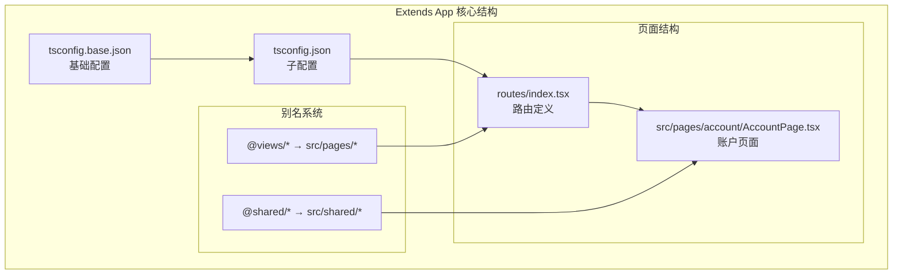
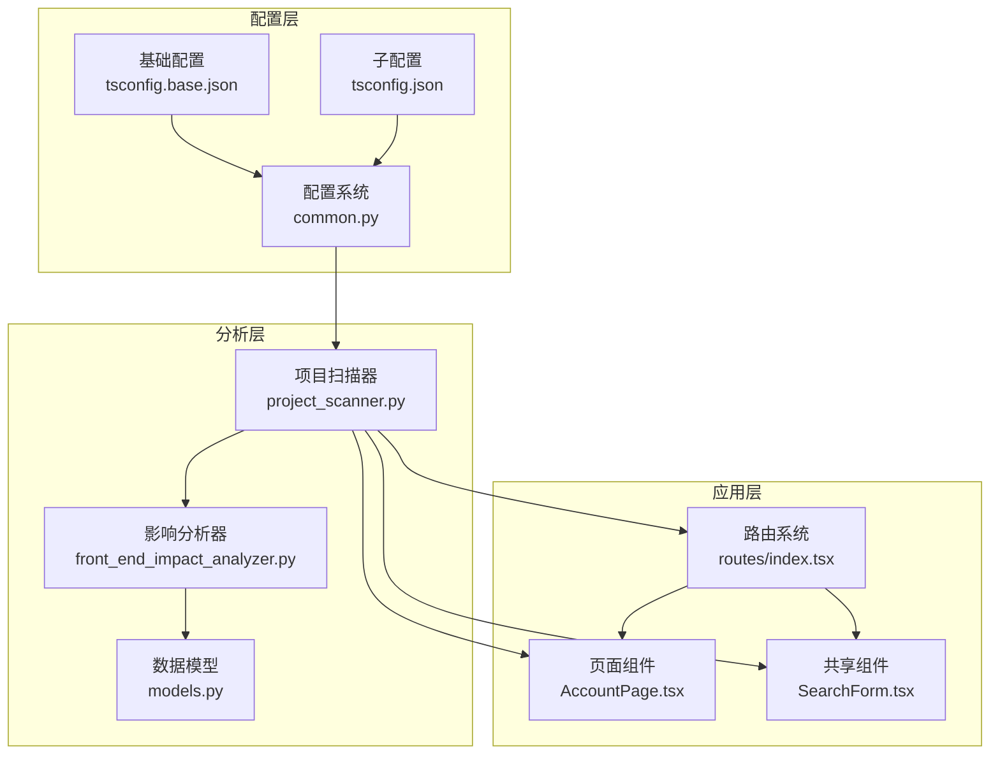
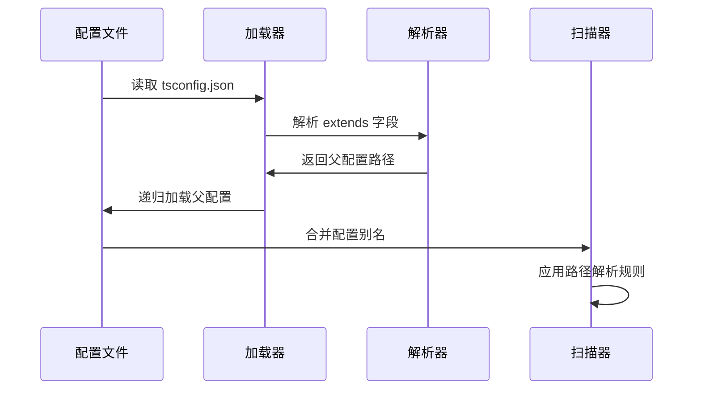
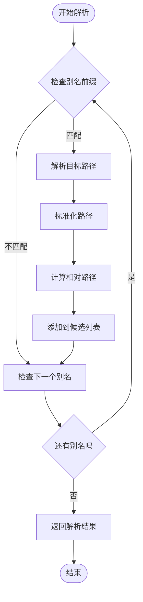
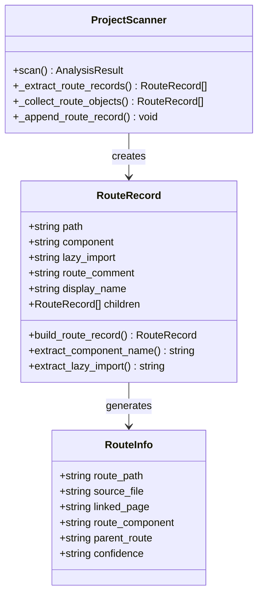
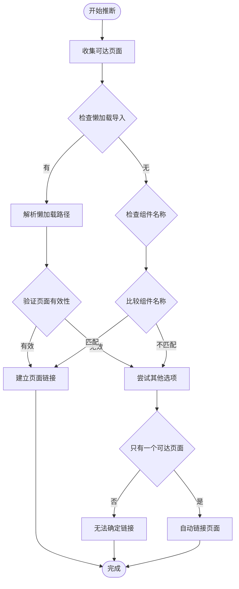
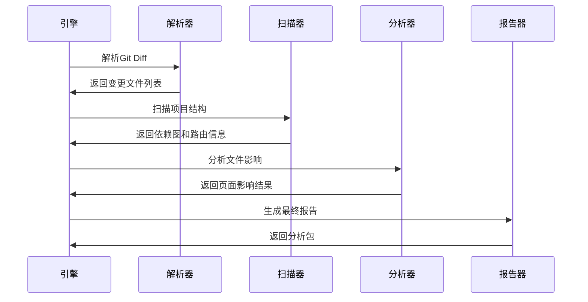
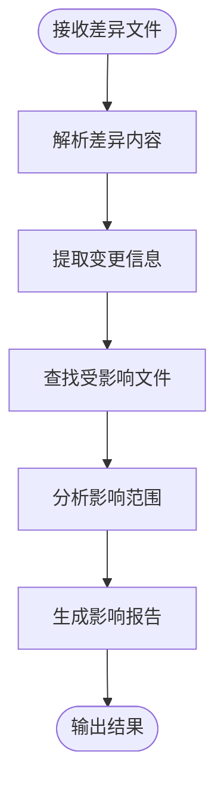
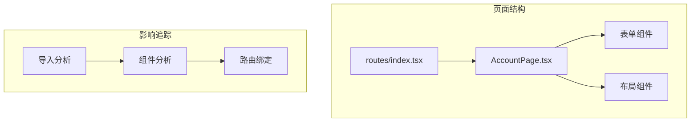

# Extends App 扩展功能演示

<cite>
**本文档引用的文件**
- [tsconfig.base.json](file://fixtures/extends_app/tsconfig.base.json)
- [tsconfig.json](file://fixtures/extends_app/tsconfig.json)
- [AccountPage.tsx](file://fixtures/extends_app/src/pages/account/AccountPage.tsx)
- [routes/index.tsx](file://fixtures/extends_app/src/routes/index.tsx)
- [project_scanner.py](file://scripts/analyzer/project_scanner.py)
- [common.py](file://scripts/analyzer/common.py)
- [models.py](file://scripts/analyzer/models.py)
- [front_end_impact_analyzer.py](file://scripts/front_end_impact_analyzer.py)
- [SearchForm.tsx](file://fixtures/sample_app/src/components/shared/SearchForm.tsx)
- [shared_search_form.diff](file://fixtures/diffs/shared_search_form.diff)
- [symbol_change.diff](file://fixtures/diffs/symbol_change.diff)
- [AdminHomePage.tsx](file://fixtures/phase2_app/src/pages/admin/AdminHomePage.tsx)
- [phase2_routes/index.tsx](file://fixtures/phase2_app/src/routes/index.tsx)
</cite>

## 目录
1. [简介](#简介)
2. [项目结构](#项目结构)
3. [核心组件](#核心组件)
4. [架构概览](#架构概览)
5. [详细组件分析](#详细组件分析)
6. [依赖关系分析](#依赖关系分析)
7. [性能考虑](#性能考虑)
8. [故障排除指南](#故障排除指南)
9. [结论](#结论)
10. [附录](#附录)

## 简介

本演示文档展示了Extends App示例项目的扩展功能，重点介绍`extends_app`的特殊配置和扩展特性。该示例项目通过TypeScript配置继承机制，实现了共享配置文件和页面结构的统一管理。

Extends App的核心特色在于其配置继承系统，允许子配置文件继承父配置的所有设置，同时可以覆盖特定选项。这种设计模式在大型前端项目中特别有用，因为它确保了团队间的一致性，同时保持了足够的灵活性来处理特定需求。

## 项目结构

Extends App示例项目采用标准的React + TypeScript项目结构，但包含了独特的配置继承机制：



**图表来源**
- [tsconfig.base.json:1-10](file://fixtures/extends_app/tsconfig.base.json#L1-L10)
- [tsconfig.json:1-4](file://fixtures/extends_app/tsconfig.json#L1-L4)
- [routes/index.tsx:1-9](file://fixtures/extends_app/src/routes/index.tsx#L1-L9)

**章节来源**
- [tsconfig.base.json:1-10](file://fixtures/extends_app/tsconfig.base.json#L1-L10)
- [tsconfig.json:1-4](file://fixtures/extends_app/tsconfig.json#L1-L4)
- [AccountPage.tsx:1-4](file://fixtures/extends_app/src/pages/account/AccountPage.tsx#L1-L4)
- [routes/index.tsx:1-9](file://fixtures/extends_app/src/routes/index.tsx#L1-L9)

## 核心组件

### 配置继承系统

Extends App的核心创新在于其配置继承机制，该机制通过TypeScript配置文件的`extends`字段实现：

#### 基础配置 (tsconfig.base.json)
基础配置文件定义了项目的核心设置，包括路径映射和编译选项。关键特性包括：
- **路径别名映射**：定义了`@shared/*`和`@views/*`的别名规则
- **基础URL设置**：为相对路径解析提供基准点
- **继承基础**：为所有子配置提供统一的基础设置

#### 子配置 (tsconfig.json)
子配置文件通过`extends`字段继承基础配置，实现配置的复用和扩展：
- **继承机制**：自动包含基础配置的所有设置
- **覆盖能力**：可以在子配置中覆盖特定选项
- **简化维护**：减少了重复配置的工作量

**章节来源**
- [tsconfig.base.json:1-10](file://fixtures/extends_app/tsconfig.base.json#L1-L10)
- [tsconfig.json:1-4](file://fixtures/extends_app/tsconfig.json#L1-L4)

### 路由系统

Extends App使用现代化的路由系统，支持复杂的嵌套路由结构：

#### 路由定义模式
路由系统采用对象字面量定义方式，支持：
- **静态路由**：直接映射到组件
- **动态路由**：支持懒加载组件
- **嵌套路由**：支持多级路由嵌套
- **路径组合**：自动处理路径拼接

#### 组件绑定机制
路由系统能够智能识别关联的页面组件，通过AST分析实现：
- **组件名称匹配**：根据JSX标签名称识别组件
- **导入路径解析**：支持别名导入路径
- **页面识别**：自动识别页面文件

**章节来源**
- [routes/index.tsx:1-9](file://fixtures/extends_app/src/routes/index.tsx#L1-L9)

## 架构概览

Extends App的整体架构基于配置继承和AST分析的双重机制：



**图表来源**
- [common.py:74-151](file://scripts/analyzer/common.py#L74-L151)
- [project_scanner.py:13-383](file://scripts/analyzer/project_scanner.py#L13-L383)
- [front_end_impact_analyzer.py:23-403](file://scripts/front_end_impact_analyzer.py#L23-L403)

## 详细组件分析

### 配置继承分析

#### 配置加载流程
配置继承系统通过以下流程实现：



**图表来源**
- [common.py:99-140](file://scripts/analyzer/common.py#L99-L140)
- [common.py:142-151](file://scripts/analyzer/common.py#L142-L151)

#### 别名解析机制
别名系统支持复杂的路径映射规则：



**图表来源**
- [common.py:82-96](file://scripts/analyzer/common.py#L82-L96)

**章节来源**
- [common.py:74-151](file://scripts/analyzer/common.py#L74-L151)

### 路由分析组件

#### 路由记录提取
路由系统通过AST解析提取路由信息：



**图表来源**
- [project_scanner.py:238-383](file://scripts/analyzer/project_scanner.py#L238-L383)
- [models.py:43-53](file://scripts/analyzer/models.py#L43-L53)

#### 页面链接推断
系统能够智能推断路由与页面的关联关系：



**图表来源**
- [project_scanner.py:134-154](file://scripts/analyzer/project_scanner.py#L134-L154)

**章节来源**
- [project_scanner.py:128-228](file://scripts/analyzer/project_scanner.py#L128-L228)
- [models.py:43-53](file://scripts/analyzer/models.py#L43-L53)

### 影响分析引擎

#### 分析流程
影响分析引擎执行完整的代码影响追踪：



**图表来源**
- [front_end_impact_analyzer.py:56-160](file://scripts/front_end_impact_analyzer.py#L56-L160)

**章节来源**
- [front_end_impact_analyzer.py:56-160](file://scripts/front_end_impact_analyzer.py#L56-L160)

## 依赖关系分析

### 配置依赖图

Extends App的配置系统展现了清晰的依赖层次：

```mermaid
graph TB
subgraph "配置层次"
Root[根配置<br/>tsconfig.json]
Base[基础配置<br/>tsconfig.base.json]
Compiler[编译选项]
Paths[路径映射]
end
subgraph "别名映射"
Shared[@shared/* → src/shared/*]
Views[@views/* → src/pages/*]
end
subgraph "解析过程"
LoadConfig[加载配置]
ParseExtends[解析 extends]
MergeConfig[合并配置]
ApplyPaths[应用路径映射]
end
Root --> Base
Base --> Compiler
Base --> Paths
Paths --> Shared
Paths --> Views
LoadConfig --> ParseExtends
ParseExtends --> MergeConfig
MergeConfig --> ApplyPaths
```

**图表来源**
- [common.py:99-123](file://scripts/analyzer/common.py#L99-L123)

### 项目依赖关系

项目扫描器构建了完整的依赖关系图：

```mermaid
graph LR
subgraph "源文件"
Routes[routes/index.tsx]
Account[AccountPage.tsx]
SearchForm[SearchForm.tsx]
end
subgraph "依赖关系"
Routes --> Account
Routes --> SearchForm
SearchForm --> SharedComponents[共享组件]
end
subgraph "别名解析"
AliasViews[@views/account/AccountPage]
AliasShared[@shared/SearchForm]
end
Routes -.-> AliasViews
SearchForm -.-> AliasShared
```

**图表来源**
- [project_scanner.py:31-80](file://scripts/analyzer/project_scanner.py#L31-L80)

**章节来源**
- [common.py:99-123](file://scripts/analyzer/common.py#L99-L123)
- [project_scanner.py:31-80](file://scripts/analyzer/project_scanner.py#L31-L80)

## 性能考虑

### 配置解析优化

配置系统通过以下机制优化性能：
- **缓存机制**：避免重复解析相同的配置文件
- **递归限制**：防止无限继承循环
- **路径规范化**：减少路径解析开销
- **增量更新**：只重新解析受影响的配置

### 扫描效率

项目扫描器采用高效的扫描策略：
- **并行处理**：同时处理多个文件
- **智能跳过**：跳过不需要分析的目录
- **AST缓存**：重用已解析的AST节点
- **早期终止**：在不可能找到更多结果时提前结束

## 故障排除指南

### 常见配置问题

#### 路径解析失败
当别名无法解析到实际文件时，系统会生成诊断信息：
- 检查别名映射是否正确
- 验证目标路径是否存在
- 确认相对路径基准设置

#### 路由绑定错误
路由与页面无法正确绑定时：
- 检查组件名称是否匹配
- 验证导入路径格式
- 确认页面文件结构

**章节来源**
- [project_scanner.py:44-50](file://scripts/analyzer/project_scanner.py#L44-L50)
- [project_scanner.py:193-199](file://scripts/analyzer/project_scanner.py#L193-L199)

### 分析结果验证

#### 结果准确性检查
- 验证页面影响追踪的完整性
- 检查路由绑定的正确性
- 确认共享组件变更的影响范围

#### 性能监控
- 监控扫描时间
- 检查内存使用情况
- 验证分析覆盖率

## 结论

Extends App示例项目成功展示了现代前端项目的配置管理和影响分析最佳实践。通过配置继承机制，项目实现了：
- 统一的开发体验
- 灵活的项目定制
- 高效的影响追踪
- 可扩展的架构设计

该示例为大型前端项目的配置管理提供了实用的参考模式，特别是在需要维护多个相关项目或模块时。

## 附录

### 配置变更影响分析示例

#### 共享组件变更案例
基于提供的差异文件，系统能够准确追踪共享组件变更的影响：



**图表来源**
- [shared_search_form.diff:1-14](file://fixtures/diffs/shared_search_form.diff#L1-L14)

### 账户管理页面分析案例

#### 页面结构分析
账户管理页面作为路由系统的典型应用：



**图表来源**
- [AccountPage.tsx:1-4](file://fixtures/extends_app/src/pages/account/AccountPage.tsx#L1-L4)
- [routes/index.tsx:1-9](file://fixtures/extends_app/src/routes/index.tsx#L1-L9)

**章节来源**
- [shared_search_form.diff:1-14](file://fixtures/diffs/shared_search_form.diff#L1-L14)
- [symbol_change.diff:1-12](file://fixtures/diffs/symbol_change.diff#L1-L12)
- [SearchForm.tsx:1-9](file://fixtures/sample_app/src/components/shared/SearchForm.tsx#L1-L9)