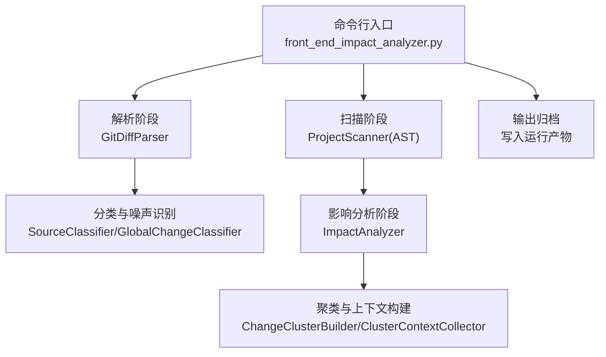
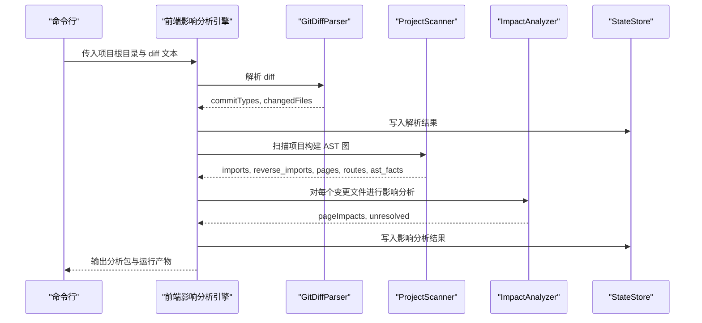
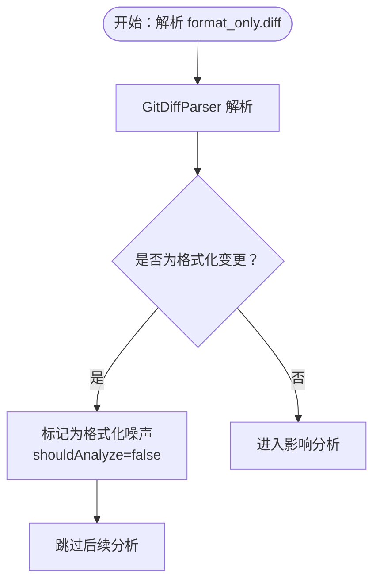
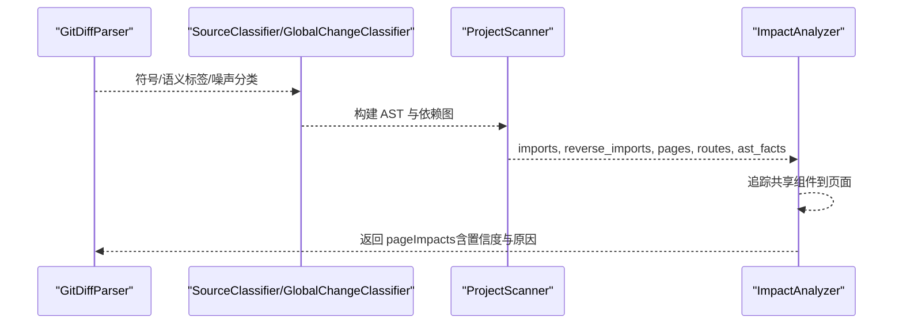
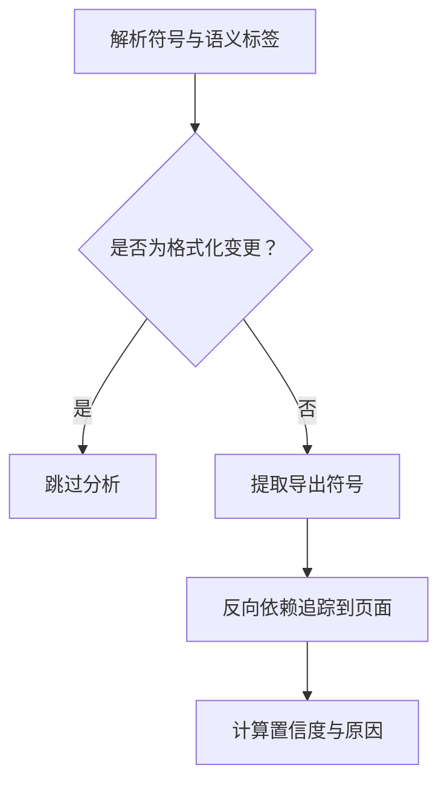
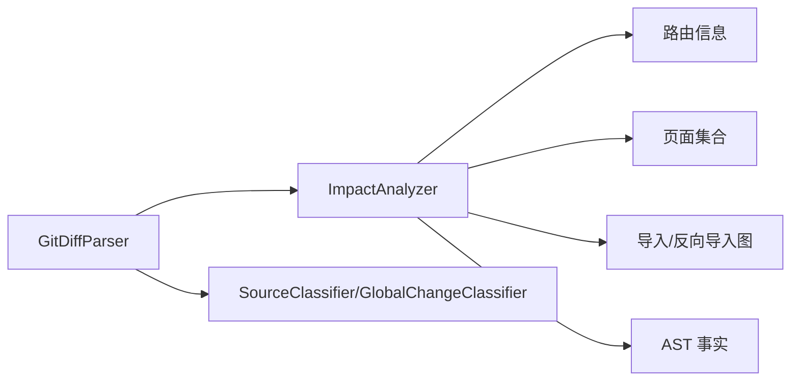

# Git Diff 分析案例

<cite>
**本文引用的文件**
- [fixtures/diffs/format_only.diff](file://fixtures/diffs/format_only.diff)
- [fixtures/diffs/shared_search_form.diff](file://fixtures/diffs/shared_search_form.diff)
- [fixtures/diffs/symbol_change.diff](file://fixtures/diffs/symbol_change.diff)
- [scripts/analyzer/diff_parser.py](file://scripts/analyzer/diff_parser.py)
- [scripts/analyzer/impact_engine.py](file://scripts/analyzer/impact_engine.py)
- [scripts/analyzer/models.py](file://scripts/analyzer/models.py)
- [scripts/front_end_impact_analyzer.py](file://scripts/front_end_impact_analyzer.py)
- [scripts/analyzer/common.py](file://scripts/analyzer/common.py)
- [fixtures/sample_app/src/components/shared/SearchForm.tsx](file://fixtures/sample_app/src/components/shared/SearchForm.tsx)
- [fixtures/symbol_app/src/utils/formatters.ts](file://fixtures/symbol_app/src/utils/formatters.ts)
- [fixtures/phase2_app/src/routes/index.tsx](file://fixtures/phase2_app/src/routes/index.tsx)
- [tests/test_diff_parser.py](file://tests/test_diff_parser.py)
- [tests/test_impact_engine.py](file://tests/test_impact_engine.py)
</cite>

## 目录
1. [简介](#简介)
2. [项目结构](#项目结构)
3. [核心组件](#核心组件)
4. [架构总览](#架构总览)
5. [详细组件分析](#详细组件分析)
6. [依赖分析](#依赖分析)
7. [性能考虑](#性能考虑)
8. [故障排查指南](#故障排查指南)
9. [结论](#结论)
10. [附录](#附录)

## 简介
本文件围绕 Git Diff 分析案例，系统性解析三种典型代码变更场景：
- format_only.diff：格式化变更
- shared_search_form.diff：共享组件变更
- symbol_change.diff：符号变更

我们将从变更类型特征、分析流程、预期结果与输出格式、结果解读（影响范围、置信度、测试用例生成建议）、稳定性影响与测试策略等方面进行深入说明。

## 项目结构
该仓库采用“脚手架 + 分析器 + 夹具（fixtures）”的组织方式：
- fixtures：包含示例应用与 diff 文件，用于演示不同类型的变更
- scripts/analyzer：核心分析模块（diff 解析、影响追踪、模型定义等）
- tests：单元测试，验证解析与影响分析行为
- scripts/front_end_impact_analyzer.py：端到端引擎入口

图表来源
- [scripts/front_end_impact_analyzer.py:56-160](file://scripts/front_end_impact_analyzer.py#L56-L160)
- [scripts/analyzer/diff_parser.py:62-130](file://scripts/analyzer/diff_parser.py#L62-L130)
- [scripts/analyzer/impact_engine.py:26-58](file://scripts/analyzer/impact_engine.py#L26-L58)

章节来源
- [scripts/front_end_impact_analyzer.py:56-160](file://scripts/front_end_impact_analyzer.py#L56-L160)

## 核心组件
- GitDiffParser：解析 diff 文本，提取变更文件、新增/删除行数、符号、语义标签、API 变更、格式化判断与噪声分类
- ImpactAnalyzer：基于反向依赖图与 AST 事实，从变更文件追踪到页面，计算影响类型、置信度与原因
- 模型与状态：ChangedFile、PageImpact、AnalysisState 等数据结构承载中间与最终结果
- 前端影响分析引擎：串联解析、扫描、影响分析、聚类与输出

章节来源
- [scripts/analyzer/diff_parser.py:11-130](file://scripts/analyzer/diff_parser.py#L11-L130)
- [scripts/analyzer/impact_engine.py:10-188](file://scripts/analyzer/impact_engine.py#L10-L188)
- [scripts/analyzer/models.py:26-201](file://scripts/analyzer/models.py#L26-L201)

## 架构总览
端到端工作流如下：

图表来源
- [scripts/front_end_impact_analyzer.py:56-160](file://scripts/front_end_impact_analyzer.py#L56-L160)
- [scripts/analyzer/diff_parser.py:62-130](file://scripts/analyzer/diff_parser.py#L62-L130)
- [scripts/analyzer/impact_engine.py:26-58](file://scripts/analyzer/impact_engine.py#L26-L58)

## 详细组件分析

### 变更类型一：格式化变更（format_only.diff）
- 特征
  - 仅空白、缩进或分号位置变化，不改变语义
  - 解析器通过“规范化比较”判断为格式化变更
  - 噪声分类标记为“格式化”，应跳过进一步分析
- 典型表现
  - 行内空格、括号位置调整
  - 不引入新符号或语义标签
- 影响范围
  - 通常无用户可见影响；对页面无追踪
- 置信度
  - 无需置信度评估
- 测试策略
  - 仅需确认解析器正确识别为格式化变更，且不产生页面影响

图表来源
- [scripts/analyzer/diff_parser.py:143-150](file://scripts/analyzer/diff_parser.py#L143-L150)
- [scripts/analyzer/impact_engine.py:27-28](file://scripts/analyzer/impact_engine.py#L27-L28)

章节来源
- [fixtures/diffs/format_only.diff:1-10](file://fixtures/diffs/format_only.diff#L1-L10)
- [tests/test_diff_parser.py:33-54](file://tests/test_diff_parser.py#L33-L54)
- [tests/test_impact_engine.py:66-85](file://tests/test_impact_engine.py#L66-L85)

### 变更类型二：共享组件变更（shared_search_form.diff）
- 特征
  - 共享组件（如 SearchForm）发生变更
  - 可能引入新的事件处理函数、属性或 JSX 结构
  - 解析器提取符号与语义标签（如 submit、form、button、list-query、disabled-state）
- 影响范围
  - 通过反向导入链路追踪到使用该组件的页面
  - 影响类型为间接，置信度中等
- 置信度
  - 基于文件类型与语义标签综合判定
- 测试策略
  - 针对受影响页面生成交互测试用例，覆盖提交、按钮禁用/启用、查询参数等

图表来源
- [scripts/analyzer/diff_parser.py:130-137](file://scripts/analyzer/diff_parser.py#L130-L137)
- [scripts/analyzer/impact_engine.py:26-58](file://scripts/analyzer/impact_engine.py#L26-L58)

章节来源
- [fixtures/diffs/shared_search_form.diff:1-14](file://fixtures/diffs/shared_search_form.diff#L1-L14)
- [fixtures/sample_app/src/components/shared/SearchForm.tsx:1-9](file://fixtures/sample_app/src/components/shared/SearchForm.tsx#L1-L9)
- [tests/test_diff_parser.py:6-31](file://tests/test_diff_parser.py#L6-L31)
- [tests/test_impact_engine.py:11-40](file://tests/test_impact_engine.py#L11-L40)

### 变更类型三：符号变更（symbol_change.diff）
- 特征
  - 函数体逻辑发生实际变化（例如新增返回值拼接）
  - 解析器识别为非格式化变更，可能触发 API 变更检测（取决于上下文）
  - 影响分析会匹配到导出符号并在反向依赖链上进行符号传播
- 影响范围
  - 若被其他模块导入并使用，将被追踪到对应页面
  - 匹配到的符号列表决定追踪的严格程度
- 置信度
  - 基于文件类型、链路深度与语义标签综合判定
- 测试策略
  - 针对受影响页面与符号调用点编写功能测试，验证输出与业务语义

图表来源
- [scripts/analyzer/diff_parser.py:152-189](file://scripts/analyzer/diff_parser.py#L152-L189)
- [scripts/analyzer/impact_engine.py:107-117](file://scripts/analyzer/impact_engine.py#L107-L117)

章节来源
- [fixtures/diffs/symbol_change.diff:1-12](file://fixtures/diffs/symbol_change.diff#L1-L12)
- [fixtures/symbol_app/src/utils/formatters.ts:1-8](file://fixtures/symbol_app/src/utils/formatters.ts#L1-L8)
- [tests/test_impact_engine.py:42-64](file://tests/test_impact_engine.py#L42-L64)

## 依赖分析
- 组件耦合
  - 前端影响分析引擎串联解析、扫描与分析三个阶段
  - 影响分析依赖反向导入图与 AST 事实，耦合度适中
- 关键依赖链
  - 解析阶段 → 分类与噪声识别 → 扫描阶段 → 影响分析 → 聚类与上下文
- 外部依赖
  - 项目路径、别名解析、TS 配置等由公共工具模块支持

图表来源
- [scripts/front_end_impact_analyzer.py:73-104](file://scripts/front_end_impact_analyzer.py#L73-L104)
- [scripts/analyzer/impact_engine.py:10-25](file://scripts/analyzer/impact_engine.py#L10-L25)

章节来源
- [scripts/analyzer/common.py:74-96](file://scripts/analyzer/common.py#L74-L96)

## 性能考虑
- 解析阶段
  - 正则匹配与行级遍历，时间复杂度近似 O(N)，N 为 diff 行数
- 影响分析阶段
  - BFS 追踪在反向导入图上进行，最坏情况下与节点数与边数线性相关
- 建议
  - 控制变更规模，避免一次性大范围 diff 导致追踪开销增大
  - 合理利用噪声过滤，减少无效分析

## 故障排查指南
- 常见问题
  - 无法追踪到页面：检查反向导入关系与 AST 事实是否正确
  - 置信度偏低：确认文件类型、语义标签与链路深度
  - 误判为格式化：核对规范化比较逻辑与输入 diff
- 定位方法
  - 查看解析阶段输出的符号与语义标签
  - 检查影响阶段的追踪链路与匹配符号
  - 使用测试用例对照期望结果

章节来源
- [tests/test_diff_parser.py:33-54](file://tests/test_diff_parser.py#L33-L54)
- [tests/test_impact_engine.py:66-85](file://tests/test_impact_engine.py#L66-L85)

## 结论
- format_only.diff：格式化变更应被快速识别并跳过深入分析，降低分析成本
- shared_search_form.diff：共享组件变更需关注跨页面影响，结合语义标签与置信度制定测试策略
- symbol_change.diff：符号变更可能带来业务逻辑变化，应重点验证受影响页面与调用点
- 建议在团队规范中明确三类变更的评审与测试策略，确保质量与效率平衡

## 附录

### 分析流程与输出格式（面向 diff 文件）
- 输入
  - 任一 diff 文件（format_only.diff、shared_search_form.diff、symbol_change.diff）
- 步骤
  - 解析：提取 commit 类型、变更文件、新增/删除行数、符号、语义标签、API 变更、格式化判断、噪声分类
  - 分类：按文件类型与全局分类标记风险
  - 扫描：构建导入/反向导入图与 AST 事实
  - 影响：追踪到页面，生成 PageImpact（含影响类型、置信度、原因、语义标签、匹配符号、API 变更）
  - 聚类：构建变更索引与变更簇，生成上下文与任务清单
- 输出
  - 运行产物：包含解析结果、影响分析、聚类与上下文等 JSON 文件
  - 最终结果：分析包（clusters、summary、cases 等）

章节来源
- [scripts/front_end_impact_analyzer.py:56-160](file://scripts/front_end_impact_analyzer.py#L56-L160)
- [scripts/analyzer/models.py:77-113](file://scripts/analyzer/models.py#L77-L113)

### 结果解读要点
- 影响范围
  - 直接：页面或路由文件变更
  - 间接：通过共享组件或工具函数影响多个页面
- 置信度
  - 高：页面/路由文件或关键模块（业务组件/API/钩子/状态）直接变更
  - 中：共享组件变更，视语义标签而定
  - 低：工具/样式/配置等文件变更
- 测试用例生成建议
  - 直接变更：覆盖页面行为与路由
  - 间接变更：覆盖共享组件交互、表单提交、按钮状态、查询参数等
  - 符号变更：覆盖函数返回值、格式化输出、业务逻辑分支

章节来源
- [scripts/analyzer/impact_engine.py:168-187](file://scripts/analyzer/impact_engine.py#L168-L187)

### 三类变更的稳定性影响与测试策略
- 格式化变更
  - 稳定性影响：极低
  - 测试策略：无需生成测试用例；仅需保证 CI 通过
- 共享组件变更
  - 稳定性影响：中高（可能影响多个页面）
  - 测试策略：生成交互测试，覆盖提交、禁用状态、查询参数、列表/表格渲染
- 符号变更
  - 稳定性影响：中（取决于业务逻辑）
  - 测试策略：生成功能测试，验证输出与业务规则一致性

章节来源
- [scripts/analyzer/impact_engine.py:173-182](file://scripts/analyzer/impact_engine.py#L173-L182)