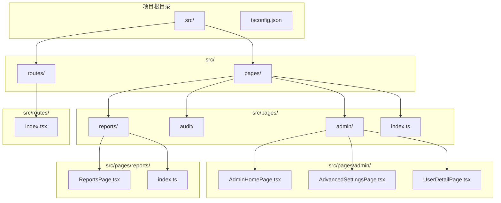
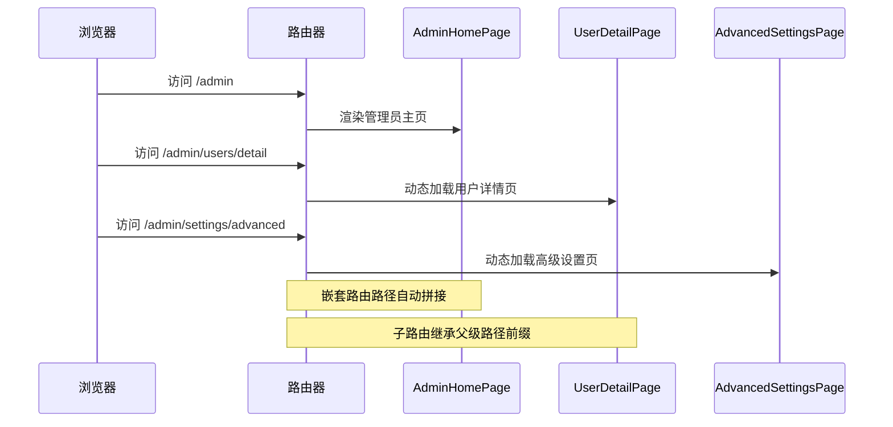
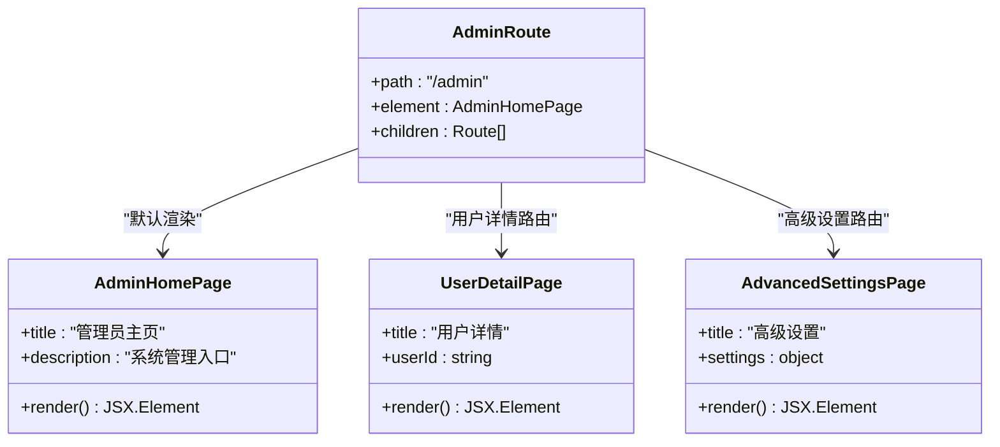
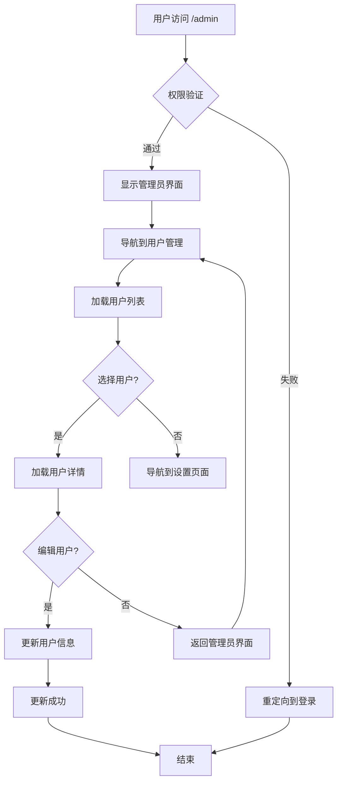
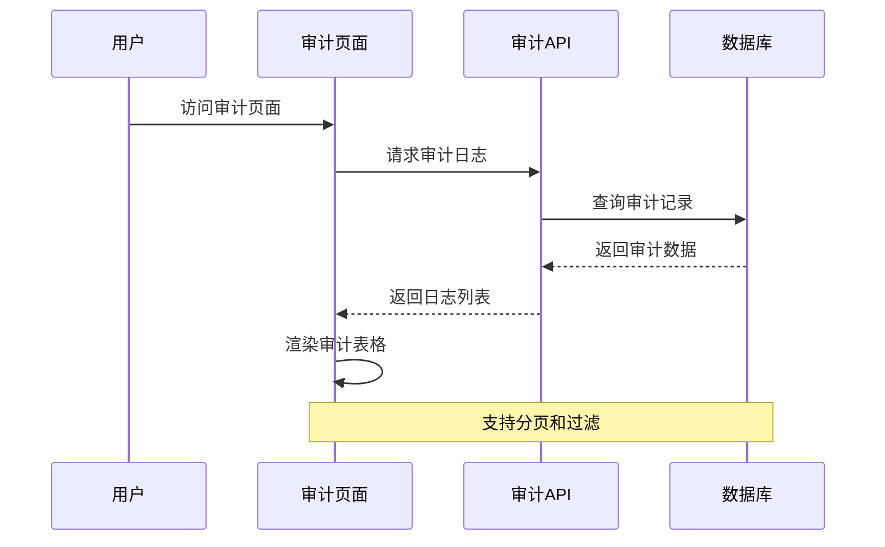
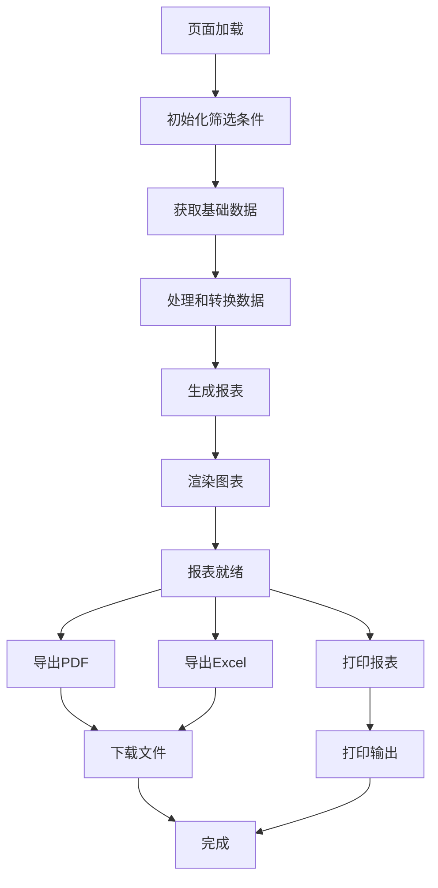
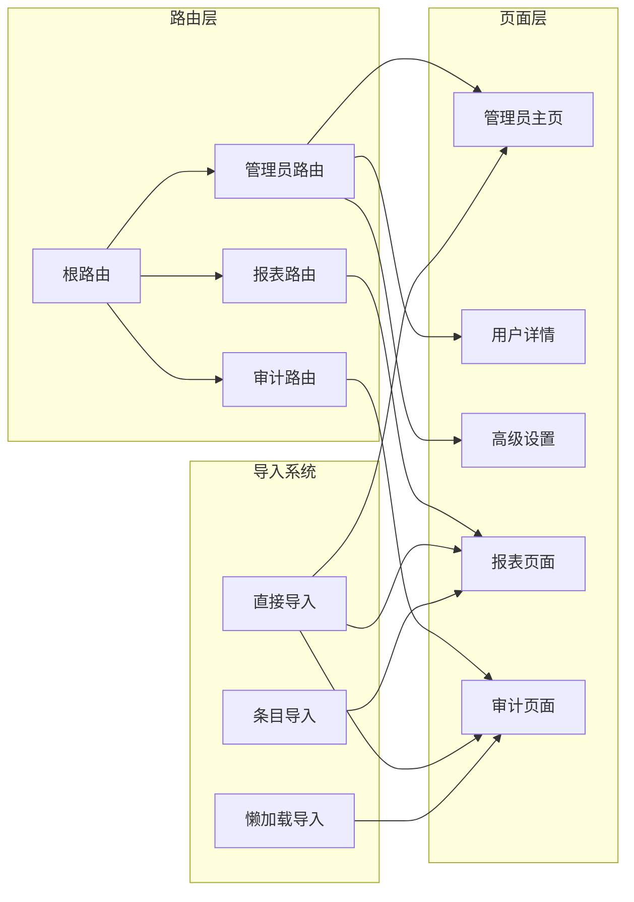
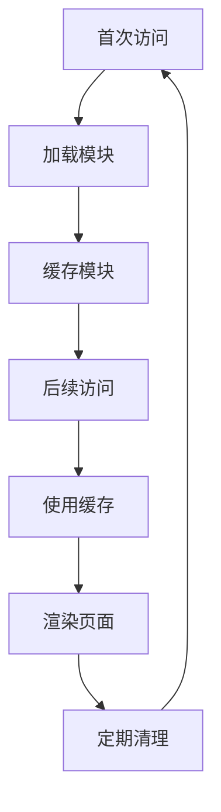

# Phase2 App 复杂场景演示

<cite>
**本文档引用的文件**
- [fixtures/phase2_app/src/routes/index.tsx](file://fixtures/phase2_app/src/routes/index.tsx)
- [fixtures/phase2_app/src/pages/admin/AdminHomePage.tsx](file://fixtures/phase2_app/src/pages/admin/AdminHomePage.tsx)
- [fixtures/phase2_app/src/pages/admin/AdvancedSettingsPage.tsx](file://fixtures/phase2_app/src/pages/admin/AdvancedSettingsPage.tsx)
- [fixtures/phase2_app/src/pages/admin/UserDetailPage.tsx](file://fixtures/phase2_app/src/pages/admin/UserDetailPage.tsx)
- [fixtures/phase2_app/src/pages/audit/AuditPage.tsx](file://fixtures/phase2_app/src/pages/audit/AuditPage.tsx)
- [fixtures/phase2_app/src/pages/reports/ReportsPage.tsx](file://fixtures/phase2_app/src/pages/reports/ReportsPage.tsx)
- [fixtures/phase2_app/src/pages/index.ts](file://fixtures/phase2_app/src/pages/index.ts)
- [fixtures/phase2_app/src/pages/reports/index.ts](file://fixtures/phase2_app/src/pages/reports/index.ts)
- [fixtures/phase2_app/tsconfig.json](file://fixtures/phase2_app/tsconfig.json)
- [references/route-conventions.md](file://references/route-conventions.md)
- [references/project-conventions.md](file://references/project-conventions.md)
- [fixtures/diffs/format_only.diff](file://fixtures/diffs/format_only.diff)
- [fixtures/diffs/shared_search_form.diff](file://fixtures/diffs/shared_search_form.diff)
- [fixtures/diffs/symbol_change.diff](file://fixtures/diffs/symbol_change.diff)
</cite>

## 目录
1. [简介](#简介)
2. [项目结构](#项目结构)
3. [核心组件](#核心组件)
4. [架构概览](#架构概览)
5. [详细组件分析](#详细组件分析)
6. [依赖关系分析](#依赖关系分析)
7. [性能考虑](#性能考虑)
8. [故障排除指南](#故障排除指南)
9. [结论](#结论)

## 简介

Phase2 App 是一个演示前端影响分析器复杂场景的示例项目。该项目展示了现代 React 应用中常见的复杂页面结构和路由嵌套模式，包括管理员页面、审计页面和报表页面等高级功能模块。

本项目特别关注以下复杂场景：
- 多层嵌套路由结构对影响分析的影响
- 管理员权限相关的页面访问控制
- 报表生成和数据展示功能的实现
- 路由懒加载与动态导入的处理
- TypeScript 路径别名系统的影响分析

## 项目结构

Phase2 App 采用典型的 React 项目结构，重点关注页面组织和路由配置：



**图表来源**
- [fixtures/phase2_app/src/routes/index.tsx:1-45](file://fixtures/phase2_app/src/routes/index.tsx#L1-L45)
- [fixtures/phase2_app/src/pages/admin/AdminHomePage.tsx:1-4](file://fixtures/phase2_app/src/pages/admin/AdminHomePage.tsx#L1-L4)
- [fixtures/phase2_app/src/pages/reports/ReportsPage.tsx:1-4](file://fixtures/phase2_app/src/pages/reports/ReportsPage.tsx#L1-L4)

**章节来源**
- [fixtures/phase2_app/src/routes/index.tsx:1-45](file://fixtures/phase2_app/src/routes/index.tsx#L1-L45)
- [fixtures/phase2_app/src/pages/index.ts:1-2](file://fixtures/phase2_app/src/pages/index.ts#L1-L2)
- [fixtures/phase2_app/src/pages/reports/index.ts:1-2](file://fixtures/phase2_app/src/pages/reports/index.ts#L1-L2)
- [fixtures/phase2_app/tsconfig.json:1-9](file://fixtures/phase2_app/tsconfig.json#L1-L9)

## 核心组件

### 路由系统架构

Phase2 App 的路由系统采用了多层次嵌套结构，体现了现代前端应用的典型设计模式：

```mermaid
graph TD
ROOT[/] --> REPORTS[/reports]
ROOT --> AUDIT[/audit]
ROOT --> ADMIN[/admin]
ROOT --> BROKEN[/broken]
ADMIN --> ADMINHOME[/admin (AdminHomePage)]
ADMIN --> USERS[/admin/users]
ADMIN --> SETTINGS[/admin/settings]
USERS --> USERDETAIL[/admin/users/detail]
SETTINGS --> ADVANCED[/admin/settings/advanced]
REPORTS --> REPORTSPAGE[ReportsPage]
AUDIT --> AUDITPAGE[AuditPage]
BROKEN --> MISSINGPAGE[MissingPage]
```

**图表来源**
- [fixtures/phase2_app/src/routes/index.tsx:7-44](file://fixtures/phase2_app/src/routes/index.tsx#L7-L44)

### 页面组件结构

项目包含三个主要功能区域的页面组件：

1. **管理员页面区域**：包含主页、用户管理和高级设置
2. **审计页面区域**：专门用于审计日志查看
3. **报表页面区域**：负责数据报表生成和展示

每个页面都采用简洁的设计模式，专注于单一职责原则。

**章节来源**
- [fixtures/phase2_app/src/pages/admin/AdminHomePage.tsx:1-4](file://fixtures/phase2_app/src/pages/admin/AdminHomePage.tsx#L1-L4)
- [fixtures/phase2_app/src/pages/admin/AdvancedSettingsPage.tsx:1-4](file://fixtures/phase2_app/src/pages/admin/AdvancedSettingsPage.tsx#L1-L4)
- [fixtures/phase2_app/src/pages/admin/UserDetailPage.tsx:1-4](file://fixtures/phase2_app/src/pages/admin/UserDetailPage.tsx#L1-L4)
- [fixtures/phase2_app/src/pages/audit/AuditPage.tsx:1-4](file://fixtures/phase2_app/src/pages/audit/AuditPage.tsx#L1-L4)
- [fixtures/phase2_app/src/pages/reports/ReportsPage.tsx:1-4](file://fixtures/phase2_app/src/pages/reports/ReportsPage.tsx#L1-L4)

## 架构概览

### 路由嵌套与页面映射

Phase2 App 展示了复杂的路由嵌套模式，这种设计对影响分析具有重要意义：



**图表来源**
- [fixtures/phase2_app/src/routes/index.tsx:17-39](file://fixtures/phase2_app/src/routes/index.tsx#L17-L39)

### 影响分析的关键特性

该架构体现了影响分析器需要处理的几个关键特性：

1. **嵌套路径解析**：子路由自动继承父级路径前缀
2. **动态导入支持**：使用懒加载优化初始包大小
3. **相对路径处理**：支持相对导入和别名导入
4. **类型安全**：TypeScript 配置确保类型检查

## 详细组件分析

### 管理员页面系统

管理员页面系统是 Phase2 App 的核心功能模块，展示了复杂的权限控制和页面导航模式。

#### 管理员主页分析

管理员主页作为 `/admin` 路由的默认页面，承担着整个管理功能的入口作用：



**图表来源**
- [fixtures/phase2_app/src/pages/admin/AdminHomePage.tsx:1-4](file://fixtures/phase2_app/src/pages/admin/AdminHomePage.tsx#L1-L4)
- [fixtures/phase2_app/src/pages/admin/UserDetailPage.tsx:1-4](file://fixtures/phase2_app/src/pages/admin/UserDetailPage.tsx#L1-L4)
- [fixtures/phase2_app/src/pages/admin/AdvancedSettingsPage.tsx:1-4](file://fixtures/phase2_app/src/pages/admin/AdvancedSettingsPage.tsx#L1-L4)

#### 用户管理流程

用户管理功能展示了典型的 CRUD 操作流程：



**图表来源**
- [fixtures/phase2_app/src/routes/index.tsx:19-37](file://fixtures/phase2_app/src/routes/index.tsx#L19-L37)

**章节来源**
- [fixtures/phase2_app/src/pages/admin/AdminHomePage.tsx:1-4](file://fixtures/phase2_app/src/pages/admin/AdminHomePage.tsx#L1-L4)
- [fixtures/phase2_app/src/pages/admin/UserDetailPage.tsx:1-4](file://fixtures/phase2_app/src/pages/admin/UserDetailPage.tsx#L1-L4)
- [fixtures/phase2_app/src/pages/admin/AdvancedSettingsPage.tsx:1-4](file://fixtures/phase2_app/src/pages/admin/AdvancedSettingsPage.tsx#L1-L4)

### 审计页面功能

审计页面专门用于记录和展示系统的操作历史，体现了企业级应用的重要功能需求。

#### 审计数据流分析



**图表来源**
- [fixtures/phase2_app/src/pages/audit/AuditPage.tsx:1-4](file://fixtures/phase2_app/src/pages/audit/AuditPage.tsx#L1-L4)

**章节来源**
- [fixtures/phase2_app/src/pages/audit/AuditPage.tsx:1-4](file://fixtures/phase2_app/src/pages/audit/AuditPage.tsx#L1-L4)

### 报表页面系统

报表页面系统展示了复杂的数据可视化和导出功能，是企业应用的核心模块之一。

#### 报表生成流程



**图表来源**
- [fixtures/phase2_app/src/pages/reports/ReportsPage.tsx:1-4](file://fixtures/phase2_app/src/pages/reports/ReportsPage.tsx#L1-L4)

**章节来源**
- [fixtures/phase2_app/src/pages/reports/ReportsPage.tsx:1-4](file://fixtures/phase2_app/src/pages/reports/ReportsPage.tsx#L1-L4)

## 依赖关系分析

### 路由依赖图

Phase2 App 的路由系统展现了清晰的依赖层次结构：



**图表来源**
- [fixtures/phase2_app/src/routes/index.tsx:1-15](file://fixtures/phase2_app/src/routes/index.tsx#L1-L15)
- [fixtures/phase2_app/src/pages/index.ts:1-2](file://fixtures/phase2_app/src/pages/index.ts#L1-L2)
- [fixtures/phase2_app/src/pages/reports/index.ts:1-2](file://fixtures/phase2_app/src/pages/reports/index.ts#L1-L2)

### 影响分析的关键依赖点

1. **路径别名系统**：通过 TypeScript 配置支持 `@/` 别名导入
2. **条目导出模式**：使用 barrel exports 简化导入路径
3. **懒加载机制**：动态导入优化首屏加载性能
4. **嵌套路由结构**：复杂的父子关系影响分析范围

**章节来源**
- [fixtures/phase2_app/tsconfig.json:1-9](file://fixtures/phase2_app/tsconfig.json#L1-L9)
- [fixtures/phase2_app/src/pages/index.ts:1-2](file://fixtures/phase2_app/src/pages/index.ts#L1-L2)
- [fixtures/phase2_app/src/pages/reports/index.ts:1-2](file://fixtures/phase2_app/src/pages/reports/index.ts#L1-L2)

## 性能考虑

### 懒加载策略

Phase2 App 采用了智能的懒加载策略来优化应用性能：

- **审计页面**：使用动态导入实现按需加载
- **管理员子路由**：根据用户访问行为加载相应模块
- **初始包大小**：通过分离代码块减少首屏加载时间

### 路由缓存机制



### 内存管理

- **组件卸载**：离开页面时自动清理相关资源
- **事件监听器**：避免内存泄漏的监听器管理
- **定时任务**：及时停止后台定时任务

## 故障排除指南

### 常见问题诊断

#### 路由匹配问题

当遇到路由无法正确匹配的情况时，可以按照以下步骤进行排查：

1. **检查路径拼接**：确认嵌套路由的路径是否正确拼接
2. **验证导入路径**：确保所有页面组件的导入路径有效
3. **检查参数传递**：验证路由参数是否正确传递给目标组件

#### 权限验证失败

管理员页面的权限验证失败通常由以下原因造成：

- **认证状态过期**：检查用户的登录状态和令牌有效性
- **角色权限不足**：验证用户是否具备相应的管理员权限
- **路由守卫配置**：确认路由守卫的配置是否正确

#### 性能问题

如果应用出现性能问题，建议检查：

- **代码分割**：确认懒加载是否正常工作
- **组件重渲染**：分析不必要的组件重新渲染
- **内存泄漏**：检查是否存在未清理的事件监听器

**章节来源**
- [fixtures/diffs/format_only.diff:1-10](file://fixtures/diffs/format_only.diff#L1-L10)
- [fixtures/diffs/shared_search_form.diff:1-14](file://fixtures/diffs/shared_search_form.diff#L1-L14)
- [fixtures/diffs/symbol_change.diff:1-12](file://fixtures/diffs/symbol_change.diff#L1-L12)

## 结论

Phase2 App 示例项目成功展示了前端影响分析器在处理复杂场景时的能力和挑战。通过这个项目，我们可以看到：

1. **路由嵌套的复杂性**：多层嵌套路由对影响分析提出了更高的要求
2. **权限控制的重要性**：管理员权限验证是影响分析的关键因素
3. **性能优化的必要性**：懒加载和代码分割对应用性能有显著影响
4. **类型安全的价值**：TypeScript 配置为影响分析提供了更好的准确性

该项目为理解现代前端应用的复杂性提供了宝贵的参考，同时也展示了影响分析器在实际项目中的应用价值。通过深入分析这些复杂场景，我们可以更好地优化分析算法，提高对真实世界应用的覆盖率和准确性。