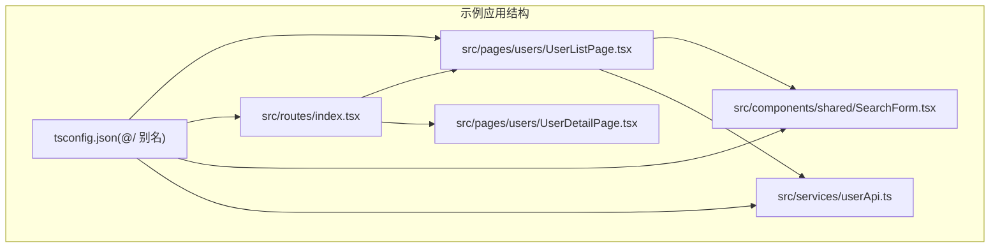
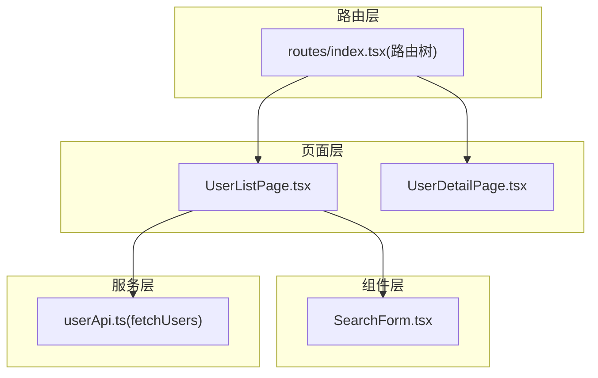
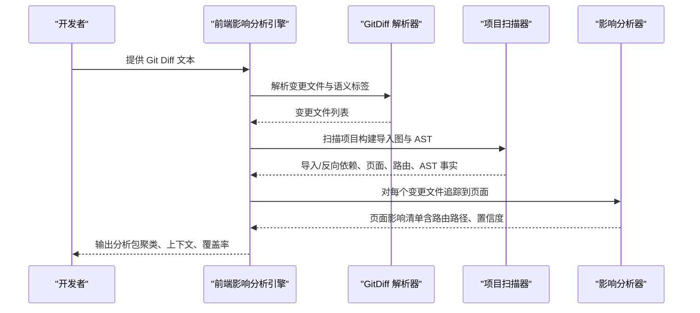

# Sample App 示例演示

<cite>
**本文引用的文件**
- [fixtures/sample_app/src/pages/users/UserListPage.tsx](file://fixtures/sample_app/src/pages/users/UserListPage.tsx)
- [fixtures/sample_app/src/pages/users/UserDetailPage.tsx](file://fixtures/sample_app/src/pages/users/UserDetailPage.tsx)
- [fixtures/sample_app/src/routes/index.tsx](file://fixtures/sample_app/src/routes/index.tsx)
- [fixtures/sample_app/src/services/userApi.ts](file://fixtures/sample_app/src/services/userApi.ts)
- [fixtures/sample_app/src/components/shared/SearchForm.tsx](file://fixtures/sample_app/src/components/shared/SearchForm.tsx)
- [fixtures/sample_app/tsconfig.json](file://fixtures/sample_app/tsconfig.json)
- [scripts/front_end_impact_analyzer.py](file://scripts/front_end_impact_analyzer.py)
- [scripts/analyzer/diff_parser.py](file://scripts/analyzer/diff_parser.py)
- [scripts/analyzer/impact_engine.py](file://scripts/analyzer/impact_engine.py)
- [scripts/analyzer/project_scanner.py](file://scripts/analyzer/project_scanner.py)
- [references/route-conventions.md](file://references/route-conventions.md)
- [references/project-conventions.md](file://references/project-conventions.md)
- [fixtures/diffs/shared_search_form.diff](file://fixtures/diffs/shared_search_form.diff)
- [fixtures/diffs/symbol_change.diff](file://fixtures/diffs/symbol_change.diff)
- [fixtures/diffs/format_only.diff](file://fixtures/diffs/format_only.diff)
- [pyproject.toml](file://pyproject.toml)
</cite>

## 目录
1. [简介](#简介)
2. [项目结构](#项目结构)
3. [核心组件](#核心组件)
4. [架构总览](#架构总览)
5. [详细组件分析](#详细组件分析)
6. [依赖关系分析](#依赖关系分析)
7. [性能考量](#性能考量)
8. [故障排查指南](#故障排查指南)
9. [结论](#结论)
10. [附录](#附录)

## 简介
本演示文档围绕 Sample App 示例项目，系统讲解其整体架构与特点，重点覆盖以下方面：
- 页面设计：用户列表页、用户详情页与共享组件的职责划分
- 路由与页面绑定：基于路由对象数组的嵌套路由与路径拼接规则
- API 服务：数据访问层的抽象与调用点
- 影响分析流程：从准备 Git Diff 到解读分析结果的完整步骤
- 场景化演示：常见组件修改（如共享表单）对页面与路由的影响追踪
- 工具在真实 React 应用中的表现：如何通过 AST 扫描、反向依赖与路由映射进行影响追踪

## 项目结构
Sample App 示例位于 fixtures/sample_app，采用典型的 React + React Router + Vite 项目布局：
- 页面层：src/pages/users 下包含用户列表页与用户详情页
- 路由层：src/routes/index.tsx 定义路由树，支持父子路由嵌套
- 组件层：src/components/shared 下提供共享组件（如搜索表单）
- 服务层：src/services 下封装 API 访问方法
- 配置：tsconfig.json 使用 @/ 路径别名，便于模块导入

图表来源
- [fixtures/sample_app/src/pages/users/UserListPage.tsx:1-14](file://fixtures/sample_app/src/pages/users/UserListPage.tsx#L1-L14)
- [fixtures/sample_app/src/pages/users/UserDetailPage.tsx:1-4](file://fixtures/sample_app/src/pages/users/UserDetailPage.tsx#L1-L4)
- [fixtures/sample_app/src/routes/index.tsx:1-20](file://fixtures/sample_app/src/routes/index.tsx#L1-L20)
- [fixtures/sample_app/src/components/shared/SearchForm.tsx:1-9](file://fixtures/sample_app/src/components/shared/SearchForm.tsx#L1-L9)
- [fixtures/sample_app/src/services/userApi.ts:1-4](file://fixtures/sample_app/src/services/userApi.ts#L1-L4)
- [fixtures/sample_app/tsconfig.json:1-9](file://fixtures/sample_app/tsconfig.json#L1-L9)

章节来源
- [fixtures/sample_app/src/pages/users/UserListPage.tsx:1-14](file://fixtures/sample_app/src/pages/users/UserListPage.tsx#L1-L14)
- [fixtures/sample_app/src/pages/users/UserDetailPage.tsx:1-4](file://fixtures/sample_app/src/pages/users/UserDetailPage.tsx#L1-L4)
- [fixtures/sample_app/src/routes/index.tsx:1-20](file://fixtures/sample_app/src/routes/index.tsx#L1-L20)
- [fixtures/sample_app/src/components/shared/SearchForm.tsx:1-9](file://fixtures/sample_app/src/components/shared/SearchForm.tsx#L1-L9)
- [fixtures/sample_app/src/services/userApi.ts:1-4](file://fixtures/sample_app/src/services/userApi.ts#L1-L4)
- [fixtures/sample_app/tsconfig.json:1-9](file://fixtures/sample_app/tsconfig.json#L1-L9)

## 核心组件
- 用户列表页：负责渲染页面标题、加载共享搜索表单，并调用用户 API 获取数据
- 用户详情页：占位式页面，用于演示嵌套路由与子路径
- 路由定义：以数组形式声明路由树，支持父子路由与路径拼接
- 共享搜索表单：被用户列表页复用，具备提交行为与按钮交互
- 用户 API 服务：封装请求方法，作为数据访问入口
- 路径别名：通过 tsconfig 的 baseUrl 与 paths 配置，统一使用 @/ 前缀导入

章节来源
- [fixtures/sample_app/src/pages/users/UserListPage.tsx:1-14](file://fixtures/sample_app/src/pages/users/UserListPage.tsx#L1-L14)
- [fixtures/sample_app/src/pages/users/UserDetailPage.tsx:1-4](file://fixtures/sample_app/src/pages/users/UserDetailPage.tsx#L1-L4)
- [fixtures/sample_app/src/routes/index.tsx:1-20](file://fixtures/sample_app/src/routes/index.tsx#L1-L20)
- [fixtures/sample_app/src/components/shared/SearchForm.tsx:1-9](file://fixtures/sample_app/src/components/shared/SearchForm.tsx#L1-L9)
- [fixtures/sample_app/src/services/userApi.ts:1-4](file://fixtures/sample_app/src/services/userApi.ts#L1-L4)
- [fixtures/sample_app/tsconfig.json:1-9](file://fixtures/sample_app/tsconfig.json#L1-L9)

## 架构总览
下图展示了 Sample App 的代码流与依赖关系：页面通过导入共享组件与服务函数产生影响；路由定义决定页面与路径的绑定关系；工具链通过 AST 分析与反向依赖追踪，将变更传播到受影响的页面。

图表来源
- [fixtures/sample_app/src/pages/users/UserListPage.tsx:1-14](file://fixtures/sample_app/src/pages/users/UserListPage.tsx#L1-L14)
- [fixtures/sample_app/src/pages/users/UserDetailPage.tsx:1-4](file://fixtures/sample_app/src/pages/users/UserDetailPage.tsx#L1-L4)
- [fixtures/sample_app/src/routes/index.tsx:1-20](file://fixtures/sample_app/src/routes/index.tsx#L1-L20)
- [fixtures/sample_app/src/components/shared/SearchForm.tsx:1-9](file://fixtures/sample_app/src/components/shared/SearchForm.tsx#L1-L9)
- [fixtures/sample_app/src/services/userApi.ts:1-4](file://fixtures/sample_app/src/services/userApi.ts#L1-L4)

## 详细组件分析

### 用户列表页（UserListPage）
- 职责：渲染页面标题、注入共享搜索表单、触发用户数据获取
- 关键点：调用服务函数 fetchUsers，体现页面与服务层的耦合点
- 影响面：当服务函数或共享组件发生变更时，可能影响该页面的渲染与交互

章节来源
- [fixtures/sample_app/src/pages/users/UserListPage.tsx:1-14](file://fixtures/sample_app/src/pages/users/UserListPage.tsx#L1-L14)
- [fixtures/sample_app/src/services/userApi.ts:1-4](file://fixtures/sample_app/src/services/userApi.ts#L1-L4)
- [fixtures/sample_app/src/components/shared/SearchForm.tsx:1-9](file://fixtures/sample_app/src/components/shared/SearchForm.tsx#L1-L9)

### 用户详情页（UserDetailPage）
- 职责：作为嵌套路由的目标页面，承载详情展示逻辑
- 关键点：与父级路由“/users”下的“detail”子路径绑定，形成层级关系

章节来源
- [fixtures/sample_app/src/pages/users/UserDetailPage.tsx:1-4](file://fixtures/sample_app/src/pages/users/UserDetailPage.tsx#L1-L4)
- [fixtures/sample_app/src/routes/index.tsx:1-20](file://fixtures/sample_app/src/routes/index.tsx#L1-L20)

### 路由配置（routes/index.tsx）
- 路由树：根路径“/users”，子路由“detail”
- 路由约定：支持对象数组、懒加载组件、父子路径拼接
- 绑定策略：通过直接导入页面文件或组件名匹配实现路由到页面的绑定

章节来源
- [fixtures/sample_app/src/routes/index.tsx:1-20](file://fixtures/sample_app/src/routes/index.tsx#L1-L20)
- [references/route-conventions.md:1-11](file://references/route-conventions.md#L1-L11)

### 共享搜索表单（SearchForm）
- 复用性：被用户列表页导入，体现共享组件在多页面中的影响范围
- 变更风险：若表单行为或属性发生变化，需评估对所有使用方的影响

章节来源
- [fixtures/sample_app/src/components/shared/SearchForm.tsx:1-9](file://fixtures/sample_app/src/components/shared/SearchForm.tsx#L1-L9)

### 用户 API 服务（userApi）
- 抽象层：封装请求方法，作为页面与外部接口的桥梁
- 影响面：当 API 签名或行为变化时，可能影响调用方页面与上层逻辑

章节来源
- [fixtures/sample_app/src/services/userApi.ts:1-4](file://fixtures/sample_app/src/services/userApi.ts#L1-L4)

### 路径别名（tsconfig.json）
- 别名：使用 @/ 指向 src，简化导入路径
- 影响：统一的导入风格有助于工具链正确解析模块关系与别名映射

章节来源
- [fixtures/sample_app/tsconfig.json:1-9](file://fixtures/sample_app/tsconfig.json#L1-L9)
- [references/project-conventions.md:1-20](file://references/project-conventions.md#L1-L20)

## 依赖关系分析
工具链通过以下步骤完成影响分析：
- 解析 Git Diff：识别变更文件、语义标签与 API 字段变化
- 项目扫描：构建导入图、反向依赖、页面集合、路由信息与 AST 事实
- 影响追踪：从变更文件出发，沿反向依赖回溯至页面，结合路由映射生成页面影响清单
- 结果聚合：输出候选页面、模块与结构化提示，以及聚类与上下文任务

图表来源
- [scripts/front_end_impact_analyzer.py:56-160](file://scripts/front_end_impact_analyzer.py#L56-L160)
- [scripts/analyzer/diff_parser.py:62-130](file://scripts/analyzer/diff_parser.py#L62-L130)
- [scripts/analyzer/project_scanner.py:20-80](file://scripts/analyzer/project_scanner.py#L20-L80)
- [scripts/analyzer/impact_engine.py:26-58](file://scripts/analyzer/impact_engine.py#L26-L58)

章节来源
- [scripts/front_end_impact_analyzer.py:56-160](file://scripts/front_end_impact_analyzer.py#L56-L160)
- [scripts/analyzer/diff_parser.py:62-130](file://scripts/analyzer/diff_parser.py#L62-L130)
- [scripts/analyzer/project_scanner.py:20-80](file://scripts/analyzer/project_scanner.py#L20-L80)
- [scripts/analyzer/impact_engine.py:26-58](file://scripts/analyzer/impact_engine.py#L26-L58)

## 性能考量
- AST 扫描规模：项目扫描阶段会遍历源文件并解析 AST，文件数量与复杂度直接影响耗时
- 反向依赖回溯：追踪深度与分支数量会影响回溯效率，建议合理控制变更范围
- 路由绑定启发式：通过导入可达性与组件名匹配减少误判，提升绑定准确率
- 工程化建议：保持清晰的目录与命名规范，减少深层嵌套与循环依赖，有助于提升分析性能

## 故障排查指南
- 预检阻塞：若预检报告状态为 blocked，需先解决阻塞项后再运行分析
- 未解析导入：扫描阶段发现无法解析的导入会记录诊断信息，检查路径别名与相对路径是否正确
- 未绑定路由：若路由无法绑定到页面，检查路由组件名、懒加载导入或页面导出是否一致
- 低置信度影响：共享组件变更可能影响多个页面，但置信度较低，建议结合上下文进一步验证

章节来源
- [scripts/front_end_impact_analyzer.py:314-359](file://scripts/front_end_impact_analyzer.py#L314-L359)
- [scripts/analyzer/project_scanner.py:193-199](file://scripts/analyzer/project_scanner.py#L193-L199)

## 结论
Sample App 示例项目展示了在 React + React Router 环境中，如何通过清晰的页面、路由与共享组件组织，配合工具链的 AST 扫描与反向依赖追踪，实现对代码变更的精准影响分析。通过本演示，用户可以掌握从准备 Git Diff 到解读分析结果的完整流程，并理解页面间依赖关系与路由配置对分析结果的重要影响。

## 附录

### 影响分析演示流程（从准备到结果）
- 准备 Git Diff
  - 使用工具生成或提供 diff 文件，确保包含新增/删除/修改的上下文
  - 示例 diff 文件：
    - [fixtures/diffs/shared_search_form.diff:1-14](file://fixtures/diffs/shared_search_form.diff#L1-L14)
    - [fixtures/diffs/symbol_change.diff:1-12](file://fixtures/diffs/symbol_change.diff#L1-L12)
    - [fixtures/diffs/format_only.diff:1-10](file://fixtures/diffs/format_only.diff#L1-L10)
- 运行分析
  - 使用前端影响分析引擎执行分析，生成中间产物与最终结果
  - 关键步骤参考：
    - [scripts/front_end_impact_analyzer.py:239-399](file://scripts/front_end_impact_analyzer.py#L239-L399)
- 解读结果
  - 查看候选页面、模块与结构化提示，结合聚类与上下文任务进行深入分析
  - 参考输出字段与状态说明：
    - [scripts/front_end_impact_analyzer.py:187-236](file://scripts/front_end_impact_analyzer.py#L187-L236)

章节来源
- [scripts/front_end_impact_analyzer.py:239-399](file://scripts/front_end_impact_analyzer.py#L239-L399)
- [fixtures/diffs/shared_search_form.diff:1-14](file://fixtures/diffs/shared_search_form.diff#L1-L14)
- [fixtures/diffs/symbol_change.diff:1-12](file://fixtures/diffs/symbol_change.diff#L1-L12)
- [fixtures/diffs/format_only.diff:1-10](file://fixtures/diffs/format_only.diff#L1-L10)

### 场景化演示：共享组件修改对页面的影响
- 场景：调整共享搜索表单的行为（例如添加提交处理函数与表单提交事件）
- 变更示例路径：
  - [fixtures/diffs/shared_search_form.diff:1-14](file://fixtures/diffs/shared_search_form.diff#L1-L14)
- 预期影响：
  - 影响分析会将该变更追溯到使用该共享组件的页面（如用户列表页）
  - 若页面未直接导入该组件，但通过共享组件间接使用，仍可通过反向依赖回溯定位
- 路由与页面绑定：
  - 用户列表页与详情页分别对应不同路由路径，分析器会为每个命中页面附带路由路径
  - 参考路由约定与绑定策略：
    - [references/route-conventions.md:1-11](file://references/route-conventions.md#L1-L11)
    - [fixtures/sample_app/src/routes/index.tsx:1-20](file://fixtures/sample_app/src/routes/index.tsx#L1-L20)

章节来源
- [fixtures/diffs/shared_search_form.diff:1-14](file://fixtures/diffs/shared_search_form.diff#L1-L14)
- [references/route-conventions.md:1-11](file://references/route-conventions.md#L1-L11)
- [fixtures/sample_app/src/routes/index.tsx:1-20](file://fixtures/sample_app/src/routes/index.tsx#L1-L20)

### 工具链与项目配置要点
- 项目约定与别名处理：
  - 支持相对导入、@/ 导入与 tsconfig 路径别名
  - 参考项目约定：
    - [references/project-conventions.md:1-20](file://references/project-conventions.md#L1-L20)
- 依赖与运行环境：
  - Python 版本要求与依赖声明：
    - [pyproject.toml:1-18](file://pyproject.toml#L1-L18)

章节来源
- [references/project-conventions.md:1-20](file://references/project-conventions.md#L1-L20)
- [pyproject.toml:1-18](file://pyproject.toml#L1-L18)