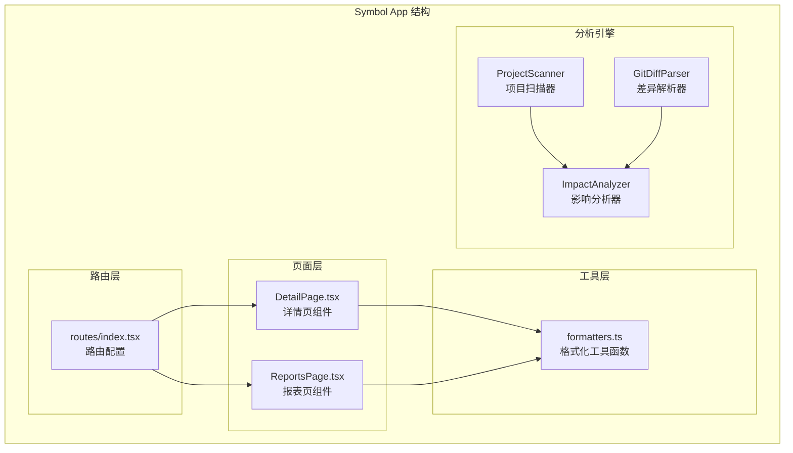
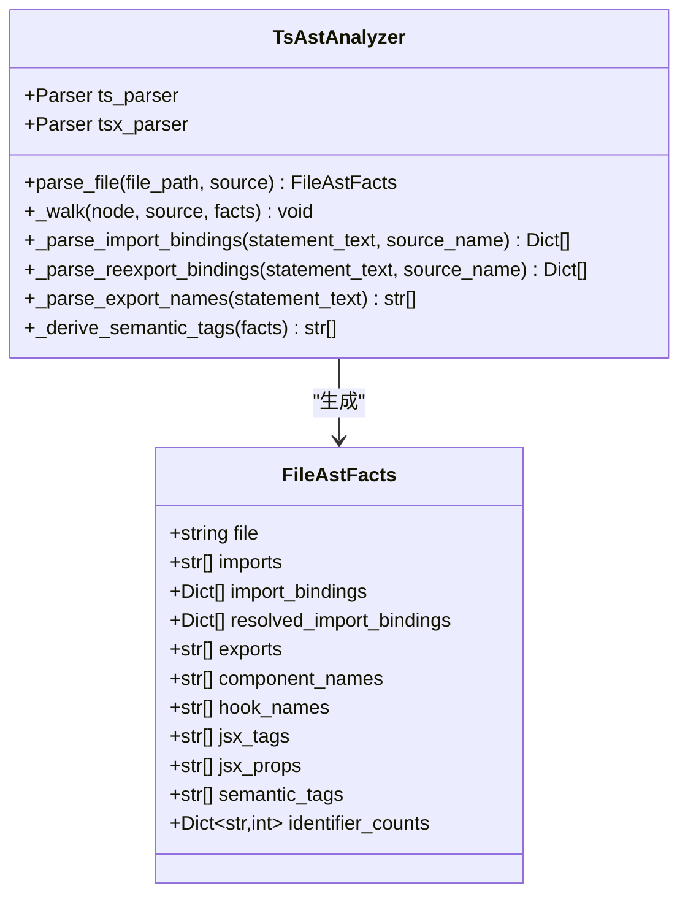
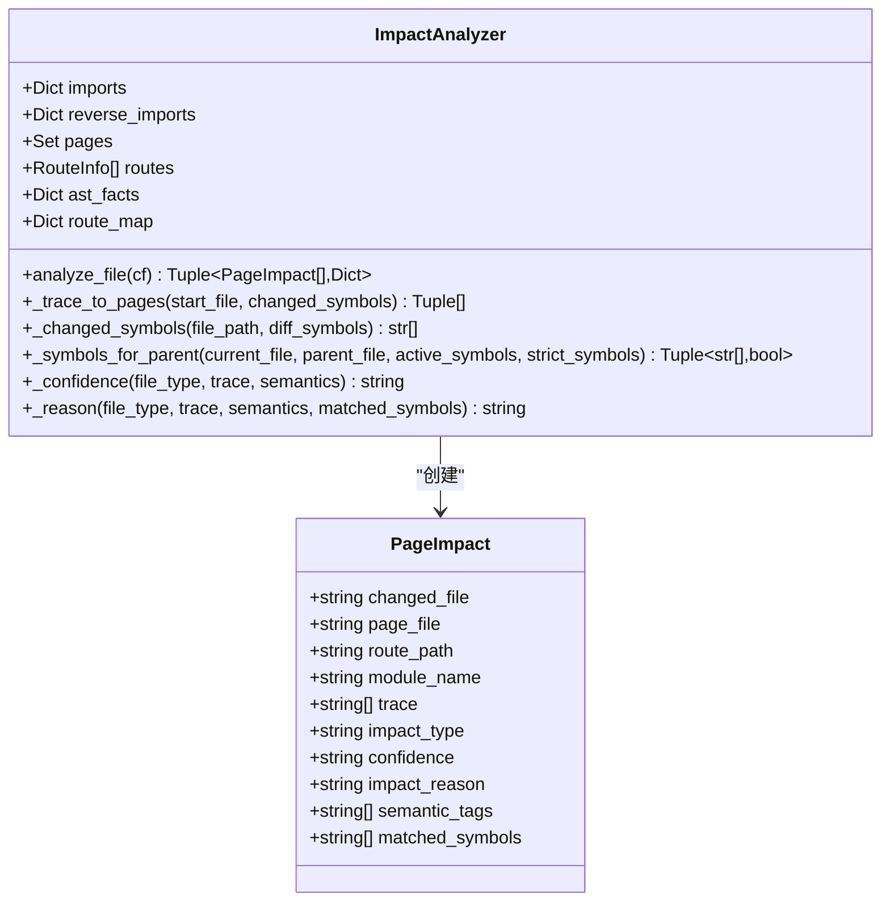
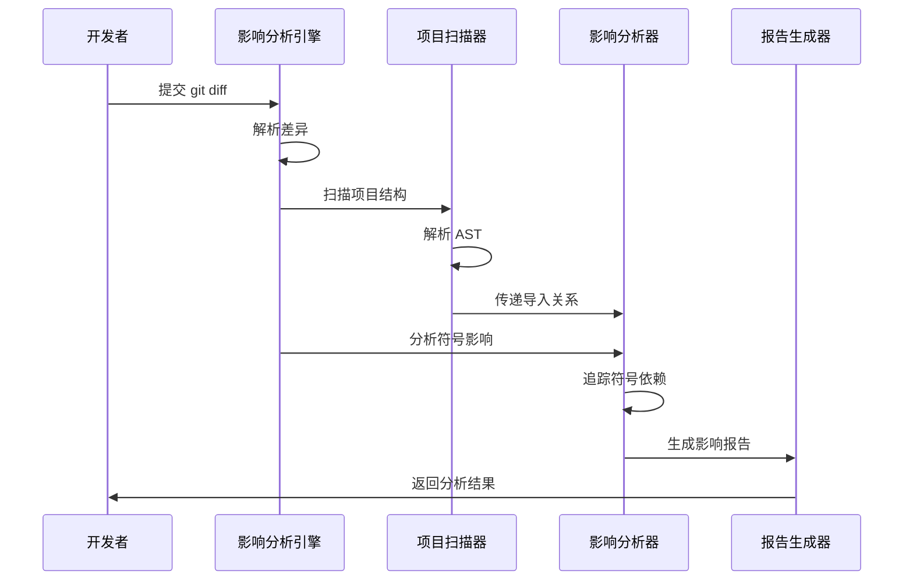
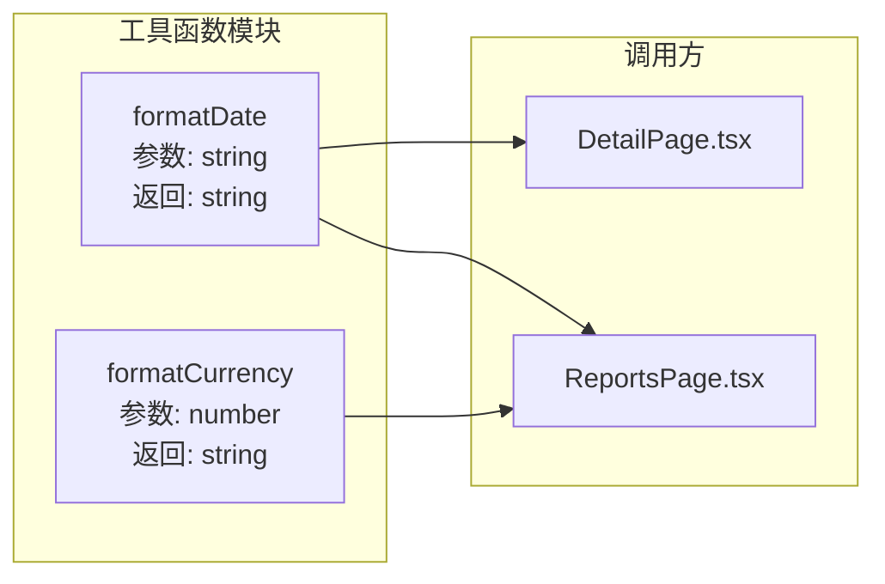
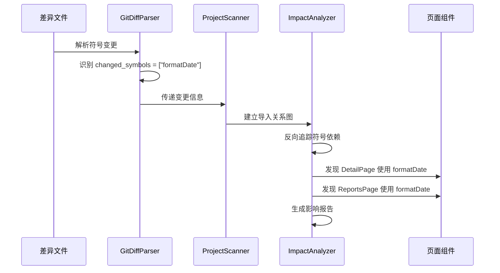
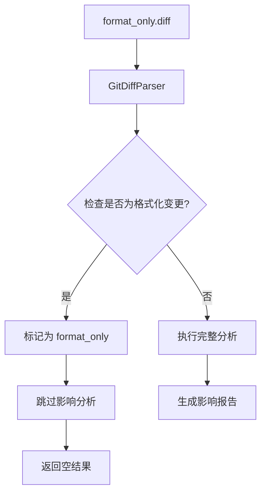
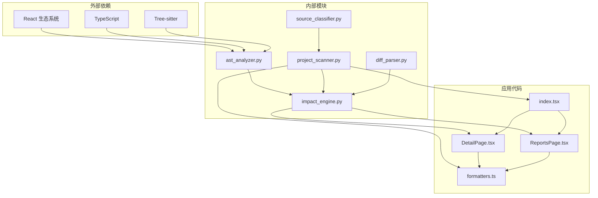

# Symbol App 符号分析演示

<cite>
**本文档中引用的文件**
- [DetailPage.tsx](file://fixtures/symbol_app/src/pages/DetailPage.tsx)
- [ReportsPage.tsx](file://fixtures/symbol_app/src/pages/ReportsPage.tsx)
- [formatters.ts](file://fixtures/symbol_app/src/utils/formatters.ts)
- [index.tsx](file://fixtures/symbol_app/src/routes/index.tsx)
- [ast_analyzer.py](file://scripts/analyzer/ast_analyzer.py)
- [impact_engine.py](file://scripts/analyzer/impact_engine.py)
- [project_scanner.py](file://scripts/analyzer/project_scanner.py)
- [source_classifier.py](file://scripts/analyzer/source_classifier.py)
- [diff_parser.py](file://scripts/analyzer/diff_parser.py)
- [front_end_impact_analyzer.py](file://scripts/front_end_impact_analyzer.py)
- [symbol_change.diff](file://fixtures/diffs/symbol_change.diff)
- [format_only.diff](file://fixtures/diffs/format_only.diff)
- [test_impact_engine.py](file://tests/test_impact_engine.py)
</cite>

## 目录
1. [简介](#简介)
2. [项目结构](#项目结构)
3. [核心组件](#核心组件)
4. [架构概览](#架构概览)
5. [详细组件分析](#详细组件分析)
6. [符号分析案例研究](#符号分析案例研究)
7. [依赖关系分析](#依赖关系分析)
8. [性能考虑](#性能考虑)
9. [故障排除指南](#故障排除指南)
10. [结论](#结论)

## 简介

Symbol App 是一个专门演示符号级别影响分析的示例项目。该项目展示了前端影响分析器如何专注于符号和工具函数分析，通过页面组件与工具函数的分离设计，实现精确的符号变更追踪。

该演示项目的核心特点包括：
- **符号级分析**：专注于函数、变量、常量等符号的识别和追踪
- **工具函数分离**：将业务逻辑与页面组件分离，便于影响范围分析
- **双向导入追踪**：支持从工具函数到页面组件的反向追踪
- **语义标签系统**：自动识别组件的功能语义（如表单、表格、模态框等）

## 项目结构

Symbol App 采用清晰的分层架构，将页面组件、工具函数和路由配置分离：



**图表来源**
- [DetailPage.tsx:1-6](file://fixtures/symbol_app/src/pages/DetailPage.tsx#L1-L6)
- [ReportsPage.tsx:1-6](file://fixtures/symbol_app/src/pages/ReportsPage.tsx#L1-L6)
- [formatters.ts:1-8](file://fixtures/symbol_app/src/utils/formatters.ts#L1-L8)
- [index.tsx:1-14](file://fixtures/symbol_app/src/routes/index.tsx#L1-L14)

**章节来源**
- [DetailPage.tsx:1-6](file://fixtures/symbol_app/src/pages/DetailPage.tsx#L1-L6)
- [ReportsPage.tsx:1-6](file://fixtures/symbol_app/src/pages/ReportsPage.tsx#L1-L6)
- [formatters.ts:1-8](file://fixtures/symbol_app/src/utils/formatters.ts#L1-L8)
- [index.tsx:1-14](file://fixtures/symbol_app/src/routes/index.tsx#L1-L14)

## 核心组件

### AST 分析器 (TsAstAnalyzer)

AST 分析器负责解析 TypeScript/TSX 文件，提取符号信息和导入导出关系：



**图表来源**
- [ast_analyzer.py:13-242](file://scripts/analyzer/ast_analyzer.py#L13-L242)
- [models.py:56-75](file://scripts/analyzer/models.py#L56-L75)

### 影响分析器 (ImpactAnalyzer)

影响分析器执行符号级的影响追踪，从变更的工具函数追溯到所有受影响的页面组件：



**图表来源**
- [impact_engine.py:10-188](file://scripts/analyzer/impact_engine.py#L10-L188)
- [models.py:78-90](file://scripts/analyzer/models.py#L78-L90)

**章节来源**
- [ast_analyzer.py:13-242](file://scripts/analyzer/ast_analyzer.py#L13-L242)
- [impact_engine.py:10-188](file://scripts/analyzer/impact_engine.py#L10-L188)

## 架构概览

Symbol App 的符号分析流程采用流水线式处理，从差异解析到最终的影响报告生成：



**图表来源**
- [front_end_impact_analyzer.py:56-160](file://scripts/front_end_impact_analyzer.py#L56-L160)
- [project_scanner.py:20-80](file://scripts/analyzer/project_scanner.py#L20-L80)
- [impact_engine.py:26-58](file://scripts/analyzer/impact_engine.py#L26-L58)

## 详细组件分析

### 页面组件分析

Symbol App 包含两个页面组件，都依赖于共享的格式化工具函数：

#### DetailPage 组件
DetailPage 组件导入并使用 `formatDate` 函数进行日期格式化：

```mermaid
flowchart TD
A[DetailPage.tsx] --> B[导入 formatDate]
B --> C[使用 formatDate("2026-03-29")]
C --> D[渲染格式化后的日期]
E[formatters.ts] --> F[导出 formatDate 函数]
F --> G[被 DetailPage 导入]
```

**图表来源**
- [DetailPage.tsx:1-6](file://fixtures/symbol_app/src/pages/DetailPage.tsx#L1-L6)
- [formatters.ts:1-3](file://fixtures/symbol_app/src/utils/formatters.ts#L1-L3)

#### ReportsPage 组件
ReportsPage 组件同时使用 `formatDate` 和 `formatCurrency` 两个格式化函数：

```mermaid
flowchart TD
A[ReportsPage.tsx] --> B[导入 formatCurrency]
A --> C[导入 formatDate]
B --> D[使用 formatCurrency(100)]
C --> E[使用 formatDate("2026-03-29")]
D --> F[渲染货币格式]
E --> G[渲染日期格式]
H[formatters.ts] --> I[导出 formatCurrency]
H --> J[导出 formatDate]
I --> K[被 ReportsPage 导入]
J --> L[被 ReportsPage 导入]
```

**图表来源**
- [ReportsPage.tsx:1-6](file://fixtures/symbol_app/src/pages/ReportsPage.tsx#L1-L6)
- [formatters.ts:1-8](file://fixtures/symbol_app/src/utils/formatters.ts#L1-L8)

**章节来源**
- [DetailPage.tsx:1-6](file://fixtures/symbol_app/src/pages/DetailPage.tsx#L1-L6)
- [ReportsPage.tsx:1-6](file://fixtures/symbol_app/src/pages/ReportsPage.tsx#L1-L6)
- [formatters.ts:1-8](file://fixtures/symbol_app/src/utils/formatters.ts#L1-L8)

### 工具函数分析

formatters.ts 文件包含两个独立的格式化函数，体现了工具函数的单一职责原则：



**图表来源**
- [formatters.ts:1-8](file://fixtures/symbol_app/src/utils/formatters.ts#L1-L8)

**章节来源**
- [formatters.ts:1-8](file://fixtures/symbol_app/src/utils/formatters.ts#L1-L8)

## 符号分析案例研究

### 案例一：符号变更追踪

当 `formatDate` 函数发生变更时，影响分析器能够精确追踪到所有使用该函数的页面组件：



**图表来源**
- [symbol_change.diff:1-12](file://fixtures/diffs/symbol_change.diff#L1-L12)
- [test_impact_engine.py:42-64](file://tests/test_impact_engine.py#L42-L64)

### 案例二：格式化变更过滤

当只有代码格式发生变化时，分析器会智能地跳过这些非功能性变更：



**图表来源**
- [format_only.diff:1-10](file://fixtures/diffs/format_only.diff#L1-L10)
- [test_impact_engine.py:66-85](file://tests/test_impact_engine.py#L66-L85)

**章节来源**
- [symbol_change.diff:1-12](file://fixtures/diffs/symbol_change.diff#L1-L12)
- [format_only.diff:1-10](file://fixtures/diffs/format_only.diff#L1-L10)
- [test_impact_engine.py:42-85](file://tests/test_impact_engine.py#L42-L85)

## 依赖关系分析

Symbol App 的依赖关系展现了清晰的分层架构：



**图表来源**
- [ast_analyzer.py:1-10](file://scripts/analyzer/ast_analyzer.py#L1-L10)
- [impact_engine.py:1-8](file://scripts/analyzer/impact_engine.py#L1-L8)
- [project_scanner.py:1-11](file://scripts/analyzer/project_scanner.py#L1-L11)

**章节来源**
- [ast_analyzer.py:1-10](file://scripts/analyzer/ast_analyzer.py#L1-L10)
- [impact_engine.py:1-8](file://scripts/analyzer/impact_engine.py#L1-L8)
- [project_scanner.py:1-11](file://scripts/analyzer/project_scanner.py#L1-L11)

## 性能考虑

Symbol App 的符号分析在设计上考虑了以下性能优化：

### 1. 符号缓存机制
- AST 解析结果缓存在内存中，避免重复解析
- 导入关系建立后进行去重处理
- 符号匹配使用集合操作提高效率

### 2. 智能过滤策略
- 格式化变更自动跳过，减少不必要的分析
- 非功能性变更（如注释修改）被识别并忽略
- 未使用的符号变更不会触发影响分析

### 3. 广度优先搜索优化
- 使用队列进行符号追踪，避免深度递归
- 访问记录防止重复计算
- 最短路径优先确保分析效率

## 故障排除指南

### 常见问题及解决方案

#### 1. 符号追踪失败
**症状**：工具函数变更后没有影响任何页面
**可能原因**：
- 符号名称不匹配
- 导入路径错误
- 变更被标记为格式化变更

**解决方法**：
- 检查符号名称的一致性
- 验证导入路径的正确性
- 确认变更内容不是纯格式化修改

#### 2. 影响范围过大
**症状**：分析结果显示影响了过多的页面组件
**可能原因**：
- 使用了通配符导入（`*`）
- 函数被多个页面广泛使用
- 符号绑定匹配过于宽松

**解决方法**：
- 检查并限制通配符导入的使用
- 评估函数的使用频率和影响范围
- 调整符号匹配的严格程度

#### 3. 性能问题
**症状**：分析过程耗时过长
**可能原因**：
- 项目规模过大
- 复杂的循环依赖
- 大量的格式化变更

**解决方法**：
- 优化项目结构，减少循环依赖
- 分批处理大型变更
- 利用缓存机制提升性能

**章节来源**
- [impact_engine.py:77-105](file://scripts/analyzer/impact_engine.py#L77-L105)
- [diff_parser.py:143-147](file://scripts/analyzer/diff_parser.py#L143-L147)

## 结论

Symbol App 展示了符号级别影响分析的强大能力，通过精心设计的分层架构和智能的符号追踪机制，实现了对前端代码变更的精确影响评估。

### 主要优势

1. **精确性**：基于符号级别的分析，避免了误报和漏报
2. **可扩展性**：模块化的架构设计支持功能扩展
3. **智能化**：自动过滤格式化变更，专注于功能性修改
4. **可视化**：清晰的依赖关系图帮助理解影响路径

### 应用价值

- **代码重构**：安全地重构工具函数而不担心影响范围
- **版本升级**：准确评估第三方库升级的影响
- **团队协作**：帮助开发者理解代码变更的潜在影响
- **质量保证**：自动化的影响分析提升代码质量

Symbol App 为前端符号分析提供了一个实用的参考实现，展示了如何在实际项目中应用符号级别的影响分析技术。