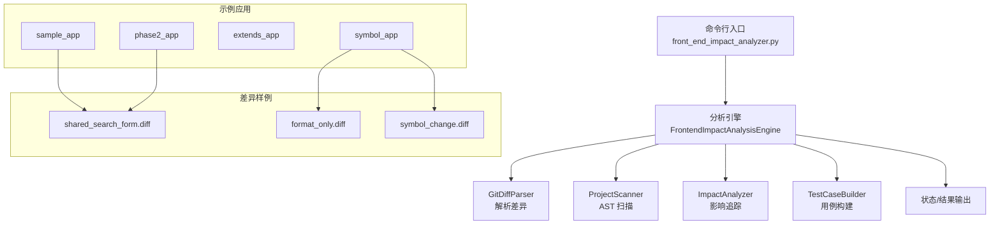
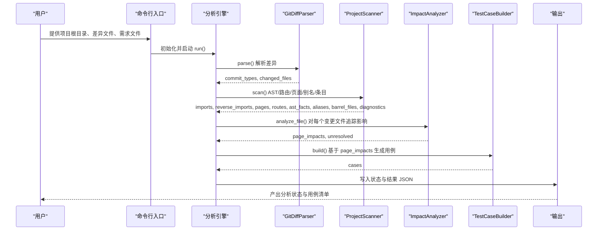
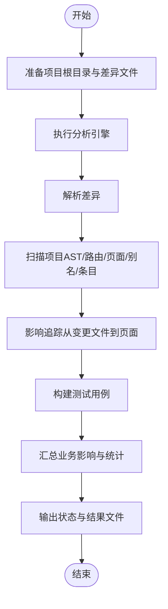
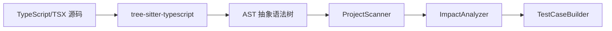

# 示例与演示

<cite>
**本文引用的文件**
- [pyproject.toml](file://pyproject.toml)
- [scripts/front_end_impact_analyzer.py](file://scripts/front_end_impact_analyzer.py)
- [fixtures/sample_app/src/components/shared/SearchForm.tsx](file://fixtures/sample_app/src/components/shared/SearchForm.tsx)
- [fixtures/sample_app/src/pages/users/UserListPage.tsx](file://fixtures/sample_app/src/pages/users/UserListPage.tsx)
- [fixtures/sample_app/src/pages/users/UserDetailPage.tsx](file://fixtures/sample_app/src/pages/users/UserDetailPage.tsx)
- [fixtures/sample_app/src/routes/index.tsx](file://fixtures/sample_app/src/routes/index.tsx)
- [fixtures/sample_app/src/services/userApi.ts](file://fixtures/sample_app/src/services/userApi.ts)
- [fixtures/sample_app/tsconfig.json](file://fixtures/sample_app/tsconfig.json)
- [fixtures/phase2_app/src/pages/admin/AdminHomePage.tsx](file://fixtures/phase2_app/src/pages/admin/AdminHomePage.tsx)
- [fixtures/phase2_app/src/pages/reports/ReportsPage.tsx](file://fixtures/phase2_app/src/pages/reports/ReportsPage.tsx)
- [fixtures/phase2_app/src/pages/audit/AuditPage.tsx](file://fixtures/phase2_app/src/pages/audit/AuditPage.tsx)
- [fixtures/phase2_app/src/pages/reports/index.ts](file://fixtures/phase2_app/src/pages/reports/index.ts)
- [fixtures/phase2_app/src/pages/index.ts](file://fixtures/phase2_app/src/pages/index.ts)
- [fixtures/phase2_app/src/routes/index.tsx](file://fixtures/phase2_app/src/routes/index.tsx)
- [fixtures/phase2_app/tsconfig.json](file://fixtures/phase2_app/tsconfig.json)
- [fixtures/extends_app/src/pages/account/AccountPage.tsx](file://fixtures/extends_app/src/pages/account/AccountPage.tsx)
- [fixtures/extends_app/src/routes/index.tsx](file://fixtures/extends_app/src/routes/index.tsx)
- [fixtures/extends_app/tsconfig.json](file://fixtures/extends_app/tsconfig.json)
- [fixtures/extends_app/tsconfig.base.json](file://fixtures/extends_app/tsconfig.base.json)
- [fixtures/symbol_app/src/pages/DetailPage.tsx](file://fixtures/symbol_app/src/pages/DetailPage.tsx)
- [fixtures/symbol_app/src/pages/ReportsPage.tsx](file://fixtures/symbol_app/src/pages/ReportsPage.tsx)
- [fixtures/symbol_app/src/routes/index.tsx](file://fixtures/symbol_app/src/routes/index.tsx)
- [fixtures/symbol_app/src/utils/formatters.ts](file://fixtures/symbol_app/src/utils/formatters.ts)
- [fixtures/diffs/format_only.diff](file://fixtures/diffs/format_only.diff)
- [fixtures/diffs/shared_search_form.diff](file://fixtures/diffs/shared_search_form.diff)
- [fixtures/diffs/symbol_change.diff](file://fixtures/diffs/symbol_change.diff)
</cite>

## 目录
1. [简介](#简介)
2. [项目结构](#项目结构)
3. [核心组件](#核心组件)
4. [架构总览](#架构总览)
5. [详细组件分析](#详细组件分析)
6. [依赖关系分析](#依赖关系分析)
7. [性能考量](#性能考量)
8. [故障排查指南](#故障排查指南)
9. [结论](#结论)
10. [附录](#附录)

## 简介
本文件面向“前端影响分析器”的示例与演示，围绕 sample_app、phase2_app、extends_app 与 symbol_app 四个示例应用，系统讲解如何基于 Git Diff 进行前端变更影响追踪与测试用例构建。文档覆盖从准备差异文件、执行分析、解读状态与结果，到针对组件修改、路由更新、API 变更等典型场景的完整流程示例；并结合不同类型的变更差异（仅格式化、共享组件改动、符号级语义变化）说明分析结果的可预期性与准确性，最后给出最佳实践与常见问题的解决方案。

## 项目结构
该仓库采用“脚本驱动 + 夹具示例 + 差异样例”的组织方式：
- 核心入口：命令行脚本负责解析参数、驱动分析流水线并输出状态与结果。
- 分析引擎：按阶段完成 Git Diff 解析、源码扫描、影响追踪、用例构建与汇总统计。
- 示例应用：sample_app 展示基础页面、路由与共享组件；phase2_app 展示多页面与嵌套路由；extends_app 展示 tsconfig 继承；symbol_app 展示工具函数与导入关系。
- 差异样例：提供三种典型变更场景，便于演示不同粒度的影响分析。

图表来源
- [scripts/front_end_impact_analyzer.py:18-99](file://scripts/front_end_impact_analyzer.py#L18-L99)

章节来源
- [pyproject.toml:1-18](file://pyproject.toml#L1-L18)
- [scripts/front_end_impact_analyzer.py:1-157](file://scripts/front_end_impact_analyzer.py#L1-L157)

## 核心组件
- 命令行入口与运行时控制
  - 负责读取项目根目录、差异文件与需求文本，初始化分析状态，调用引擎执行全流程，并输出状态文件与结果文件。
- 分析引擎
  - 解析差异 → 源码扫描（AST/路由/页面/别名/条目文件）→ 影响追踪（从变更文件到页面）→ 构建测试用例 → 汇总业务影响与统计信息。
- 数据模型与状态
  - AnalysisState、ProcessRecorder、StateStore 提供统一的状态记录与持久化接口，保证分析过程可观测、可回溯。

章节来源
- [scripts/front_end_impact_analyzer.py:18-99](file://scripts/front_end_impact_analyzer.py#L18-L99)

## 架构总览
下图展示了从差异输入到最终输出的关键步骤与模块交互：

图表来源
- [scripts/front_end_impact_analyzer.py:40-99](file://scripts/front_end_impact_analyzer.py#L40-L99)

## 详细组件分析

### 示例应用概览与用途
- sample_app
  - 特点：最小可用示例，包含共享组件、页面、路由与服务层，适合演示“共享组件变更对页面的影响”与“路由与页面映射”的基本路径追踪。
  - 典型文件路径参考：[routes/index.tsx](file://fixtures/sample_app/src/routes/index.tsx)，[UserListPage.tsx](file://fixtures/sample_app/src/pages/users/UserListPage.tsx)，[SearchForm.tsx](file://fixtures/sample_app/src/components/shared/SearchForm.tsx)，[userApi.ts](file://fixtures/sample_app/src/services/userApi.ts)。
- phase2_app
  - 特点：多页面、嵌套路由与子目录聚合导出，适合演示复杂路由结构下的影响范围与条目文件（barrel）的作用。
  - 典型文件路径参考：[routes/index.tsx](file://fixtures/phase2_app/src/routes/index.tsx)，[AdminHomePage.tsx](file://fixtures/phase2_app/src/pages/admin/AdminHomePage.tsx)，[ReportsPage.tsx](file://fixtures/phase2_app/src/pages/reports/ReportsPage.tsx)，[AuditPage.tsx](file://fixtures/phase2_app/src/pages/audit/AuditPage.tsx)，[reports/index.ts](file://fixtures/phase2_app/src/pages/reports/index.ts)。
- extends_app
  - 特点：使用 tsconfig 继承，体现大型工程中配置分层与共享基线，适合演示路径别名与继承配置对扫描与分类的影响。
  - 典型文件路径参考：[tsconfig.json](file://fixtures/extends_app/tsconfig.json)，[tsconfig.base.json](file://fixtures/extends_app/tsconfig.base.json)，[routes/index.tsx](file://fixtures/extends_app/src/routes/index.tsx)。
- symbol_app
  - 特点：强调工具函数与导入关系，适合演示“符号级变更”（如函数签名或实现细节调整）对下游调用方的影响。
  - 典型文件路径参考：[routes/index.tsx](file://fixtures/symbol_app/src/routes/index.tsx)，[DetailPage.tsx](file://fixtures/symbol_app/src/pages/DetailPage.tsx)，[formatters.ts](file://fixtures/symbol_app/src/utils/formatters.ts)。

章节来源
- [fixtures/sample_app/src/routes/index.tsx:1-16](file://fixtures/sample_app/src/routes/index.tsx#L1-L16)
- [fixtures/sample_app/src/pages/users/UserListPage.tsx:1-14](file://fixtures/sample_app/src/pages/users/UserListPage.tsx#L1-L14)
- [fixtures/sample_app/src/components/shared/SearchForm.tsx:1-8](file://fixtures/sample_app/src/components/shared/SearchForm.tsx#L1-L8)
- [fixtures/sample_app/src/services/userApi.ts:1-4](file://fixtures/sample_app/src/services/userApi.ts#L1-L4)
- [fixtures/phase2_app/src/routes/index.tsx](file://fixtures/phase2_app/src/routes/index.tsx)
- [fixtures/phase2_app/src/pages/admin/AdminHomePage.tsx:1-4](file://fixtures/phase2_app/src/pages/admin/AdminHomePage.tsx#L1-L4)
- [fixtures/phase2_app/src/pages/reports/ReportsPage.tsx:1-4](file://fixtures/phase2_app/src/pages/reports/ReportsPage.tsx#L1-L4)
- [fixtures/phase2_app/src/pages/audit/AuditPage.tsx](file://fixtures/phase2_app/src/pages/audit/AuditPage.tsx)
- [fixtures/phase2_app/src/pages/reports/index.ts](file://fixtures/phase2_app/src/pages/reports/index.ts)
- [fixtures/extends_app/tsconfig.json:1-4](file://fixtures/extends_app/tsconfig.json#L1-L4)
- [fixtures/extends_app/tsconfig.base.json](file://fixtures/extends_app/tsconfig.base.json)
- [fixtures/extends_app/src/routes/index.tsx](file://fixtures/extends_app/src/routes/index.tsx)
- [fixtures/symbol_app/src/routes/index.tsx](file://fixtures/symbol_app/src/routes/index.tsx)
- [fixtures/symbol_app/src/pages/DetailPage.tsx:1-6](file://fixtures/symbol_app/src/pages/DetailPage.tsx#L1-L6)
- [fixtures/symbol_app/src/utils/formatters.ts](file://fixtures/symbol_app/src/utils/formatters.ts)

### 差异样例与预期分析要点
- format_only.diff（仅格式化）
  - 场景：工具函数实现未变，仅空格/缩进调整。
  - 预期：影响较小，可能被识别为“格式化”而非语义变更；对下游调用方无功能性影响。
  - 参考路径：[format_only.diff:1-10](file://fixtures/diffs/format_only.diff#L1-L10)
- shared_search_form.diff（共享组件改动）
  - 场景：共享组件新增事件处理、表单提交绑定等。
  - 预期：应影响所有直接或间接引入该组件的页面；分析引擎会通过反向依赖图追踪到受影响页面。
  - 参考路径：[shared_search_form.diff:1-14](file://fixtures/diffs/shared_search_form.diff#L1-L14)
- symbol_change.diff（符号级语义变化）
  - 场景：工具函数返回值行为发生改变。
  - 预期：应影响所有调用该函数的页面或组件；需结合 AST 语义判断与调用链进行影响追踪。
  - 参考路径：[symbol_change.diff:1-12](file://fixtures/diffs/symbol_change.diff#L1-L12)

章节来源
- [fixtures/diffs/format_only.diff:1-10](file://fixtures/diffs/format_only.diff#L1-L10)
- [fixtures/diffs/shared_search_form.diff:1-14](file://fixtures/diffs/shared_search_form.diff#L1-L14)
- [fixtures/diffs/symbol_change.diff:1-12](file://fixtures/diffs/symbol_change.diff#L1-L12)

### 分析流程示例（从准备 Git Diff 到解读结果）

- 准备工作
  - 选择示例应用目录作为项目根目录。
  - 将对应差异文件内容保存为本地 diff 文件。
  - 如有需求说明，准备需求文件。
- 执行分析
  - 使用命令行入口传入参数：项目根目录、差异文件、可选需求文件；指定状态与结果输出文件名。
  - 引擎依次执行：解析差异、扫描项目、影响追踪、用例构建、汇总统计。
- 结果解读
  - 状态文件包含元数据（项目类型、分析时间、状态）、输入（差异与需求）、代码图谱（导入关系、页面、路由、诊断）、业务影响（受影响模块/页面/函数）与过程记录。
  - 结果文件为用例数组，每条用例描述了目标页面、受影响的语义标签、建议的测试关注点等。
  - 统计摘要用于快速评估分析覆盖面与潜在未决项。

图表来源
- [scripts/front_end_impact_analyzer.py:40-99](file://scripts/front_end_impact_analyzer.py#L40-L99)

章节来源
- [scripts/front_end_impact_analyzer.py:111-153](file://scripts/front_end_impact_analyzer.py#L111-L153)

### 不同类型代码变更场景的演示

- 组件修改（共享组件）
  - 示例：shared_search_form.diff 修改共享搜索表单。
  - 预期：影响所有使用该组件的页面；分析引擎通过反向导入关系定位受影响页面。
  - 参考路径：[UserListPage.tsx:1-14](file://fixtures/sample_app/src/pages/users/UserListPage.tsx#L1-L14)，[SearchForm.tsx:1-8](file://fixtures/sample_app/src/components/shared/SearchForm.tsx#L1-L8)
- 路由更新（嵌套路由）
  - 示例：phase2_app 的多页面与嵌套路由。
  - 预期：新增/删除路由节点会影响页面可达性；条目文件（barrel）会影响聚合导出与扫描结果。
  - 参考路径：[routes/index.tsx](file://fixtures/phase2_app/src/routes/index.tsx)，[reports/index.ts](file://fixtures/phase2_app/src/pages/reports/index.ts)
- API 变更（服务层）
  - 示例：sample_app 的 userApi.ts。
  - 预期：API 返回值或调用方式变化会影响调用方页面；分析引擎通过导入关系与调用链进行追踪。
  - 参考路径：[userApi.ts:1-4](file://fixtures/sample_app/src/services/userApi.ts#L1-L4)，[UserListPage.tsx:1-14](file://fixtures/sample_app/src/pages/users/UserListPage.tsx#L1-L14)
- 符号级语义变化（工具函数）
  - 示例：symbol_change.diff 改动格式化函数。
  - 预期：下游调用方（如 DetailPage）的显示逻辑可能受影响；需结合 AST 语义判断。
  - 参考路径：[DetailPage.tsx:1-6](file://fixtures/symbol_app/src/pages/DetailPage.tsx#L1-L6)，[formatters.ts](file://fixtures/symbol_app/src/utils/formatters.ts)

章节来源
- [fixtures/sample_app/src/pages/users/UserListPage.tsx:1-14](file://fixtures/sample_app/src/pages/users/UserListPage.tsx#L1-L14)
- [fixtures/sample_app/src/components/shared/SearchForm.tsx:1-8](file://fixtures/sample_app/src/components/shared/SearchForm.tsx#L1-L8)
- [fixtures/sample_app/src/services/userApi.ts:1-4](file://fixtures/sample_app/src/services/userApi.ts#L1-L4)
- [fixtures/phase2_app/src/routes/index.tsx](file://fixtures/phase2_app/src/routes/index.tsx)
- [fixtures/phase2_app/src/pages/reports/index.ts](file://fixtures/phase2_app/src/pages/reports/index.ts)
- [fixtures/symbol_app/src/pages/DetailPage.tsx:1-6](file://fixtures/symbol_app/src/pages/DetailPage.tsx#L1-L6)
- [fixtures/symbol_app/src/utils/formatters.ts](file://fixtures/symbol_app/src/utils/formatters.ts)

### 如何根据示例结果理解影响分析的准确性
- 页面命中率：对比“受影响页面”与实际业务页面数量，评估覆盖率。
- 语义标签一致性：检查用例中的语义标签是否与变更意图一致（如共享组件、API、路由等）。
- 未决文件与诊断：关注“未解析文件数”与“诊断数”，用于识别扫描失败或边界情况。
- 部分成功状态：当存在未解析或诊断时，分析状态为部分成功，提示需要人工复核。

章节来源
- [scripts/front_end_impact_analyzer.py:90-108](file://scripts/front_end_impact_analyzer.py#L90-L108)

## 依赖关系分析
- 语言与语法树
  - 项目依赖 tree-sitter 与 tree-sitter-typescript，用于解析 TypeScript/TSX 源码，支撑 AST 扫描与符号追踪。
- 项目约定
  - 示例应用普遍使用 baseUrl 与路径别名（@/*），便于在不同工程结构中保持一致的模块引用风格。
- 配置继承
  - extends_app 使用 tsconfig 继承，体现大型工程的配置分层策略。

图表来源
- [pyproject.toml:7-9](file://pyproject.toml#L7-L9)

章节来源
- [pyproject.toml:1-18](file://pyproject.toml#L1-L18)
- [fixtures/sample_app/tsconfig.json:1-9](file://fixtures/sample_app/tsconfig.json#L1-L9)
- [fixtures/phase2_app/tsconfig.json:1-9](file://fixtures/phase2_app/tsconfig.json#L1-L9)
- [fixtures/extends_app/tsconfig.json:1-4](file://fixtures/extends_app/tsconfig.json#L1-L4)
- [fixtures/extends_app/tsconfig.base.json](file://fixtures/extends_app/tsconfig.base.json)

## 性能考量
- AST 扫描规模：页面与路由越多、条目文件越复杂，扫描耗时越长。建议在 CI 中限制扫描范围或分批执行。
- 影响追踪复杂度：共享组件变更会扩大影响范围，建议优先对高频共享模块进行变更管控。
- 输出与存储：状态与结果均为 JSON，便于后续处理与归档；注意磁盘空间与日志轮转。

## 故障排查指南
- 常见错误类型
  - 语法错误：AST 解析失败导致诊断增加，需修复源码后重试。
  - 路径别名不匹配：baseUrl 或路径映射不正确会导致模块解析失败，需检查 tsconfig。
  - 未解析文件：某些文件无法被识别为变更类型或模块，需确认文件命名与导入规范。
- 定位方法
  - 查看状态文件中的诊断列表与过程记录，定位具体阶段与文件。
  - 在差异文件中核对变更范围，确认是否覆盖到目标文件。
- 处理建议
  - 修复语法与路径配置后重新执行。
  - 对于边界情况（如动态导入、条件导出），考虑补充规则或人工校验。

章节来源
- [scripts/front_end_impact_analyzer.py:124-153](file://scripts/front_end_impact_analyzer.py#L124-L153)

## 结论
通过 sample_app、phase2_app、extends_app 与 symbol_app 四类示例，结合 format_only.diff、shared_search_form.diff 与 symbol_change.diff 三类差异，本演示文档提供了从前端影响分析器的使用到结果解读的完整闭环。建议在团队内以这些示例为基准，建立差异准备、自动化分析与人工复核的标准流程，持续提升变更风险评估的准确性与效率。

## 附录
- 快速上手清单
  - 选择示例应用目录作为项目根目录。
  - 准备对应差异文件。
  - 运行命令行入口，获取状态与结果文件。
  - 对照“受影响页面/函数/模块”与“未决文件/诊断”进行复核。
- 最佳实践
  - 对共享组件与核心 API 的变更，优先进行影响分析与回归测试。
  - 在 CI 中集成分析流程，将“部分成功”状态纳入质量门禁。
  - 对条目文件（barrel）与路径别名进行统一管理，减少扫描歧义。
- 常见问题
  - 为什么某些页面未被命中？检查导入关系与路由映射是否正确。
  - 为什么诊断数较多？检查语法与 tsconfig 配置，必要时缩小扫描范围。