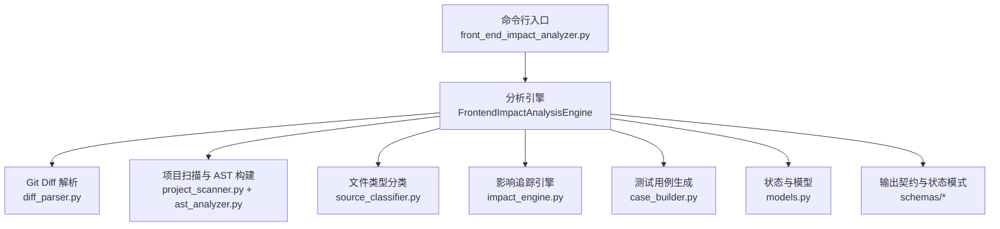
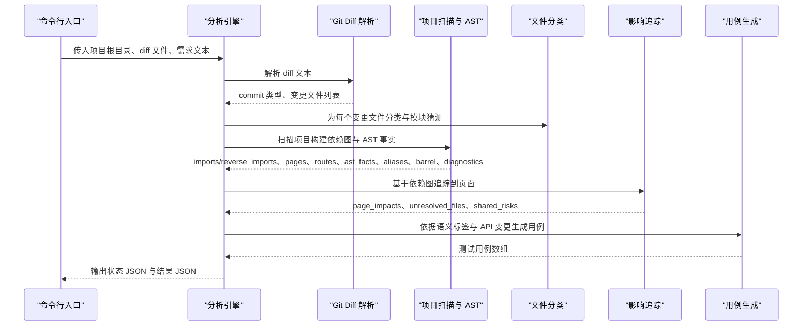
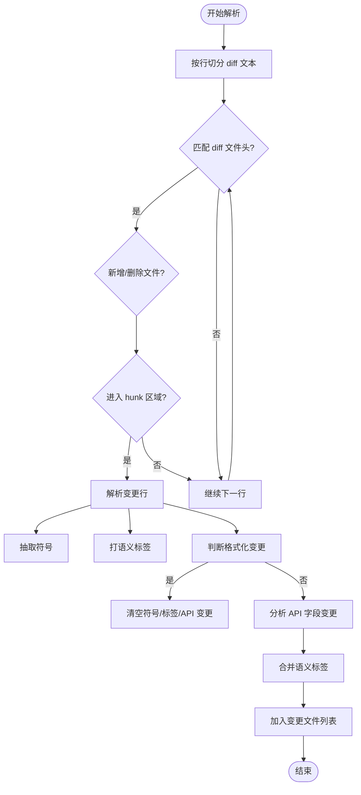
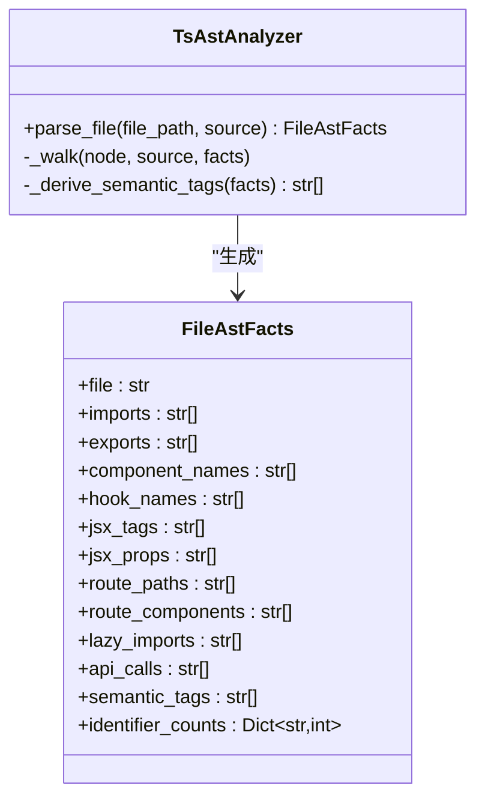
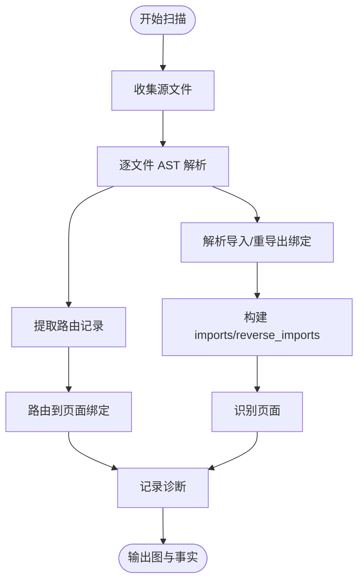
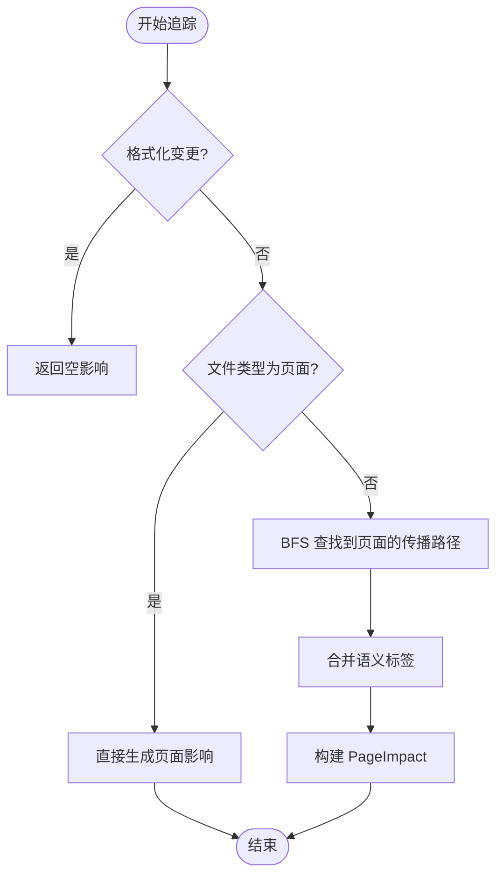
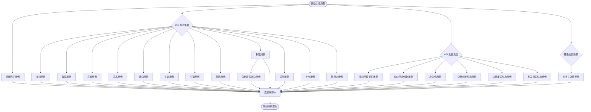
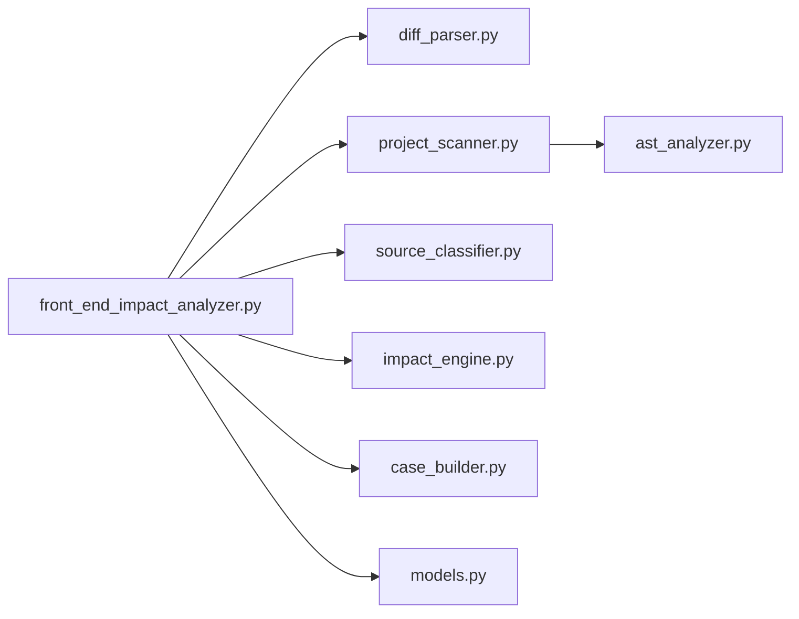

# 项目概述

<cite>
**本文档引用的文件**
- [pyproject.toml](file://pyproject.toml)
- [front_end_impact_analyzer.py](file://scripts/front_end_impact_analyzer.py)
- [diff_parser.py](file://scripts/analyzer/diff_parser.py)
- [ast_analyzer.py](file://scripts/analyzer/ast_analyzer.py)
- [project_scanner.py](file://scripts/analyzer/project_scanner.py)
- [impact_engine.py](file://scripts/analyzer/impact_engine.py)
- [source_classifier.py](file://scripts/analyzer/source_classifier.py)
- [case_builder.py](file://scripts/analyzer/case_builder.py)
- [models.py](file://scripts/analyzer/models.py)
- [_project.md](file://_project.md)
- [agent-usage.md](file://references/agent-usage.md)
- [project-conventions.md](file://references/project-conventions.md)
- [route-conventions.md](file://references/route-conventions.md)
- [format_only.diff](file://fixtures/diffs/format_only.diff)
- [shared_search_form.diff](file://fixtures/diffs/shared_search_form.diff)
- [symbol_change.diff](file://fixtures/diffs/symbol_change.diff)
</cite>

## 目录
1. [引言](#引言)
2. [项目结构](#项目结构)
3. [核心组件](#核心组件)
4. [架构总览](#架构总览)
5. [详细组件分析](#详细组件分析)
6. [依赖分析](#依赖分析)
7. [性能考虑](#性能考虑)
8. [故障排查指南](#故障排查指南)
9. [结论](#结论)
10. [附录](#附录)

## 引言
本项目是一个面向前端（尤其是 React + React Router + Vite 生态）的静态影响分析工具，旨在通过解析 Git Diff、结合 AST 分析与依赖图遍历，自动追踪前端代码变更对页面与业务流程的影响范围，并输出可直接用于测试用例生成的结构化结果。其核心价值在于：
- 将代码变更与最终用户体验（页面）建立可追溯的因果链
- 降低回归测试成本，聚焦高风险页面与功能
- 为代码审查、质量保证与自动化测试提供证据与建议

目标用户包括：
- 前端开发工程师：快速评估变更影响面，指导自测
- 测试工程师：基于分析结果生成针对性测试用例
- 项目经理与技术负责人：在代码评审与发布决策中参考影响范围与置信度

## 项目结构
项目采用 Python 脚本化架构，核心分析流程集中在 scripts/analyzer 目录下的若干模块，配合命令行入口 scripts/front_end_impact_analyzer.py。整体结构如下：

**图表来源**
- [front_end_impact_analyzer.py:18-100](file://scripts/front_end_impact_analyzer.py#L18-L100)
- [diff_parser.py:10-126](file://scripts/analyzer/diff_parser.py#L10-L126)
- [project_scanner.py:13-80](file://scripts/analyzer/project_scanner.py#L13-L80)
- [ast_analyzer.py:13-30](file://scripts/analyzer/ast_analyzer.py#L13-L30)
- [source_classifier.py:6-36](file://scripts/analyzer/source_classifier.py#L6-L36)
- [impact_engine.py:10-58](file://scripts/analyzer/impact_engine.py#L10-L58)
- [case_builder.py:10-60](file://scripts/analyzer/case_builder.py#L10-L60)
- [models.py:18-139](file://scripts/analyzer/models.py#L18-L139)

**章节来源**
- [pyproject.toml:1-18](file://pyproject.toml#L1-L18)
- [front_end_impact_analyzer.py:18-157](file://scripts/front_end_impact_analyzer.py#L18-L157)

## 核心组件
- 命令行入口与分析引擎：负责组织分析流程、记录过程日志、维护分析状态、产出最终结果与诊断信息。
- Git Diff 解析：提取变更文件、识别格式化变更、抽取符号与语义标签、推断 API 字段变更。
- AST 分析与项目扫描：解析 TS/TSX 源码，抽取导入/导出、组件/Hook/JSX 标签、路由定义、懒加载等信息，构建依赖图与页面集合。
- 文件类型分类：根据路径与命名约定识别页面、路由、API、共享组件等类型。
- 影响追踪引擎：基于反向依赖图进行广度优先搜索，将变更文件映射到受影响页面，计算置信度与影响原因。
- 测试用例生成：依据语义标签与 API 变更推断业务操作，生成覆盖按钮、表单、列表、详情、权限等维度的测试用例。

**章节来源**
- [front_end_impact_analyzer.py:40-99](file://scripts/front_end_impact_analyzer.py#L40-L99)
- [diff_parser.py:60-126](file://scripts/analyzer/diff_parser.py#L60-L126)
- [ast_analyzer.py:18-30](file://scripts/analyzer/ast_analyzer.py#L18-L30)
- [project_scanner.py:20-80](file://scripts/analyzer/project_scanner.py#L20-L80)
- [source_classifier.py:6-36](file://scripts/analyzer/source_classifier.py#L6-L36)
- [impact_engine.py:26-58](file://scripts/analyzer/impact_engine.py#L26-L58)
- [case_builder.py:10-60](file://scripts/analyzer/case_builder.py#L10-L60)

## 架构总览
下图展示了从输入 Git Diff 到输出测试用例的完整流程，以及各模块之间的协作关系：

**图表来源**
- [front_end_impact_analyzer.py:40-99](file://scripts/front_end_impact_analyzer.py#L40-L99)
- [diff_parser.py:60-126](file://scripts/analyzer/diff_parser.py#L60-L126)
- [project_scanner.py:20-80](file://scripts/analyzer/project_scanner.py#L20-L80)
- [impact_engine.py:26-58](file://scripts/analyzer/impact_engine.py#L26-L58)
- [case_builder.py:10-60](file://scripts/analyzer/case_builder.py#L10-L60)

## 详细组件分析

### Git Diff 解析器（GitDiffParser）
职责：
- 解析 diff 文本，识别新增/删除/修改文件
- 抽取变更行中的符号（函数、类、常量、组件名等）
- 基于语义模式打上标签（按钮、表单、路由、权限、API、状态、导航、校验、列表查询、提交、列、详情、加载、禁用态、导出等）
- 判断格式化变更（仅空白/换行变化），并标记为无需进一步追踪
- 推断 API 字段变更（请求/响应字段重命名、新增/删除、枚举值变化、分页/详情/列表结构变化）

**图表来源**
- [diff_parser.py:60-126](file://scripts/analyzer/diff_parser.py#L60-L126)
- [diff_parser.py:128-144](file://scripts/analyzer/diff_parser.py#L128-L144)
- [diff_parser.py:150-187](file://scripts/analyzer/diff_parser.py#L150-L187)
- [diff_parser.py:276-288](file://scripts/analyzer/diff_parser.py#L276-L288)

**章节来源**
- [diff_parser.py:10-300](file://scripts/analyzer/diff_parser.py#L10-L300)

### AST 分析器（TsAstAnalyzer）
职责：
- 使用 Tree-sitter 解析 TS/TSX 源码，抽取导入/导出、组件名、Hook 名、JSX 标签与属性、路由路径/组件、懒加载、API 调用等
- 衍生语义标签（按钮、模态框、表单、表格、上传、禁用态、路由、API、列表查询、提交、删除、详情、状态等）
- 统一去重标识符计数，为后续符号传播提供依据

**图表来源**
- [ast_analyzer.py:13-30](file://scripts/analyzer/ast_analyzer.py#L13-L30)
- [ast_analyzer.py:34-113](file://scripts/analyzer/ast_analyzer.py#L34-L113)
- [ast_analyzer.py:209-241](file://scripts/analyzer/ast_analyzer.py#L209-L241)

**章节来源**
- [ast_analyzer.py:1-241](file://scripts/analyzer/ast_analyzer.py#L1-L241)

### 项目扫描器（ProjectScanner）
职责：
- 遍历源码目录，读取文件内容，调用 AST 分析器抽取事实
- 解析导入/重导出绑定，解析路由对象（支持 path/element/component/lazy/children），推断路由到页面的绑定
- 识别页面文件（基于路径与 AST 中的组件/JSX 标签）
- 收集 barrel 文件与证据，记录未解析导入与未绑定路由等诊断信息

**图表来源**
- [project_scanner.py:20-80](file://scripts/analyzer/project_scanner.py#L20-L80)
- [project_scanner.py:128-224](file://scripts/analyzer/project_scanner.py#L128-L224)
- [project_scanner.py:235-294](file://scripts/analyzer/project_scanner.py#L235-L294)

**章节来源**
- [project_scanner.py:1-314](file://scripts/analyzer/project_scanner.py#L1-L314)

### 影响追踪引擎（ImpactAnalyzer）
职责：
- 基于反向依赖图进行广度优先搜索，将变更文件传播至页面
- 对页面文件与路由文件直接标注为“直接影响”
- 对共享组件与通用工具等根据语义标签与传播深度给出置信度
- 生成 PageImpact 结果，包含追踪路径、语义标签、匹配符号、API 变更等

**图表来源**
- [impact_engine.py:26-58](file://scripts/analyzer/impact_engine.py#L26-L58)
- [impact_engine.py:77-105](file://scripts/analyzer/impact_engine.py#L77-L105)
- [impact_engine.py:164-187](file://scripts/analyzer/impact_engine.py#L164-L187)

**章节来源**
- [impact_engine.py:1-188](file://scripts/analyzer/impact_engine.py#L1-L188)

### 测试用例生成器（TestCaseBuilder）
职责：
- 基于 PageImpact 的语义标签与 API 变更，推断业务操作（列表、详情、新增、编辑、删除等）
- 生成覆盖按钮、弹窗、表单、表格、接口调用、查询筛选分页排序、详情、删除、权限、导航、上传、禁用态等维度的测试用例
- 为不同用例设置优先级与置信度，便于下游 QA/测试平台消费

**图表来源**
- [case_builder.py:10-60](file://scripts/analyzer/case_builder.py#L10-L60)
- [case_builder.py:78-147](file://scripts/analyzer/case_builder.py#L78-L147)
- [case_builder.py:149-223](file://scripts/analyzer/case_builder.py#L149-L223)

**章节来源**
- [case_builder.py:1-223](file://scripts/analyzer/case_builder.py#L1-L223)

### 文件类型分类器（SourceClassifier）
职责：
- 根据文件路径与扩展名识别页面、路由、API、共享组件、业务组件、Hook、Store、Utils、Config/Schema 等类型
- 提供模块名猜测，辅助业务影响统计

**章节来源**
- [source_classifier.py:6-36](file://scripts/analyzer/source_classifier.py#L6-L36)

### 模型与状态（AnalysisState/Models）
职责：
- 统一的数据结构承载分析元信息、输入、代码图、代码影响、业务影响、输出用例与过程日志
- 提供状态存储与过程记录器，便于调试与审计

**章节来源**
- [models.py:18-173](file://scripts/analyzer/models.py#L18-L173)

## 依赖分析
- 外部依赖：Tree-sitter 与 Tree-sitter-TypeScript 用于高性能语法解析
- 内部模块耦合：
  - front_end_impact_analyzer.py 作为编排者，依赖所有分析模块
  - diff_parser 与 ast_analyzer 为上游输入与中间事实提供者
  - project_scanner 与 source_classifier 为图构建与分类提供基础
  - impact_engine 为核心传播引擎
  - case_builder 为下游输出生成器
- 依赖方向：自上而下（编排）→ 自下而上（事实与图）→ 中间引擎 → 输出

**图表来源**
- [front_end_impact_analyzer.py:9-15](file://scripts/front_end_impact_analyzer.py#L9-L15)
- [project_scanner.py:8-10](file://scripts/analyzer/project_scanner.py#L8-L10)
- [ast_analyzer.py:6-10](file://scripts/analyzer/ast_analyzer.py#L6-L10)

**章节来源**
- [pyproject.toml:6-9](file://pyproject.toml#L6-L9)

## 性能考虑
- AST 解析与依赖图构建是主要开销，建议：
  - 限制扫描目录（仅扫描 src/ 或指定子目录）
  - 使用增量分析策略：仅对变更文件及其依赖进行重算
  - 合理缓存 AST 事实与导入解析结果
- BFS 追踪深度与分支数量会影响性能，可通过设置最大深度或剪枝策略优化
- 语义标签与 API 变更推断的正则匹配与去重操作应保持简洁高效

## 故障排查指南
常见问题与定位要点：
- 未解析导入（unresolved-import）：检查 tsconfig alias、相对路径拼写与 barrel 导出一致性
- 未绑定路由（unbound-route）：确认路由对象中 component/lazy/import 是否能解析到页面文件，或页面导出名是否与组件名匹配
- 格式化变更误判：diff 解析器会自动识别纯格式化变更并忽略符号与语义标签，确保不会生成无效影响
- 共享组件风险：共享组件变更可能影响多个页面，但追踪置信度较低，建议人工复核关键页面
- 状态诊断：通过 meta.analysisStatus 与 codeGraph.diagnostics 判断分析是否成功，必要时查看 fatal-error 与 unresolvedFiles

**章节来源**
- [project_scanner.py:44-50](file://scripts/analyzer/project_scanner.py#L44-L50)
- [project_scanner.py:193-199](file://scripts/analyzer/project_scanner.py#L193-L199)
- [front_end_impact_analyzer.py:101-108](file://scripts/front_end_impact_analyzer.py#L101-L108)

## 结论
本项目通过“Git Diff + AST + 依赖图”的组合，实现了对前端变更的端到端影响追踪，并将结果转化为可执行的测试用例清单。它既适用于 React/Vite 应用，也具备良好的扩展性以适配不同的路由与别名约定。建议在团队中将其集成到 CI/CD 流水线与代码评审流程中，以持续提升质量与效率。

## 附录

### 实际使用场景与案例
- 代码审查：在 PR 审查阶段，快速识别受影响页面与关键交互，减少人工回溯成本
- 回归测试：基于生成的用例清单，优先执行高风险页面与核心业务流程
- 质量保证：结合项目画像与约定，针对 alias、barrel、路由绑定等边界情况做专项验证

**章节来源**
- [agent-usage.md:13-26](file://references/agent-usage.md#L13-L26)
- [agent-usage.md:44-74](file://references/agent-usage.md#L44-L74)

### 项目约定与最佳实践
- 源码目录与页面约定：遵循 src/pages 与 src/views 的页面组织方式
- 路由约定：支持对象数组、懒加载、嵌套子路由与多种绑定策略
- 别名与 barrel：支持相对导入、@/ 别名与 barrel 导出，扫描器会解析导入绑定与重导出绑定

**章节来源**
- [_project.md:132-191](file://_project.md#L132-L191)
- [route-conventions.md:1-11](file://references/route-conventions.md#L1-L11)
- [project-conventions.md:3-20](file://references/project-conventions.md#L3-L20)

### 示例 Diff 与预期行为
- 格式化变更：diff 中仅空白/换行变化，解析器应标记为格式化变更，不生成影响
- 共享组件变更：在 shared 目录下的组件变更，可能影响多个页面，置信度中等，需人工复核
- 符号变更：导出函数/组件名变化，影响导入方的符号传播与页面绑定

**章节来源**
- [format_only.diff:1-10](file://fixtures/diffs/format_only.diff#L1-L10)
- [shared_search_form.diff:1-14](file://fixtures/diffs/shared_search_form.diff#L1-L14)
- [symbol_change.diff:1-12](file://fixtures/diffs/symbol_change.diff#L1-L12)