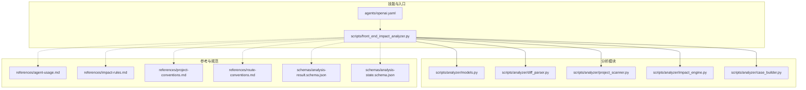
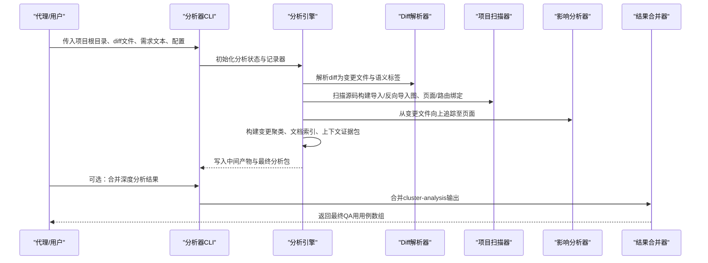
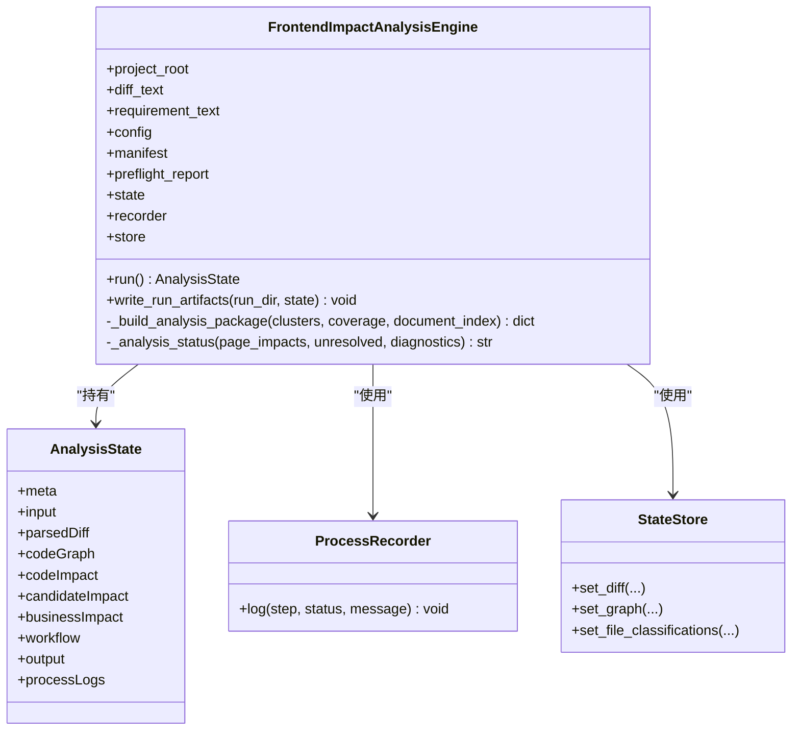
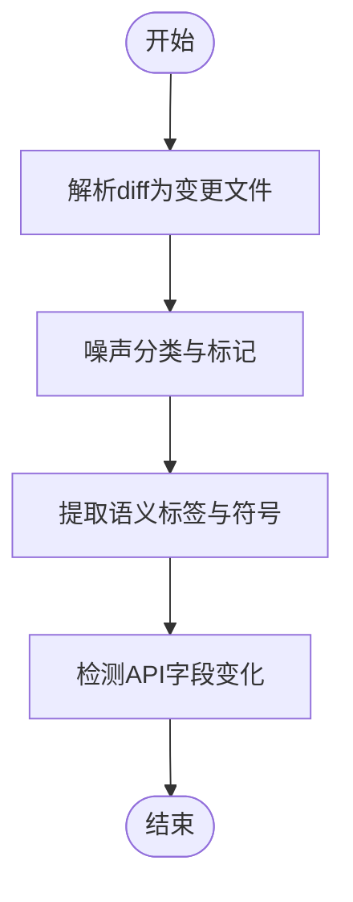
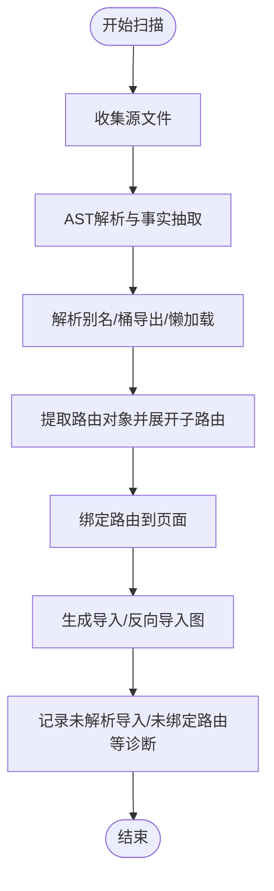
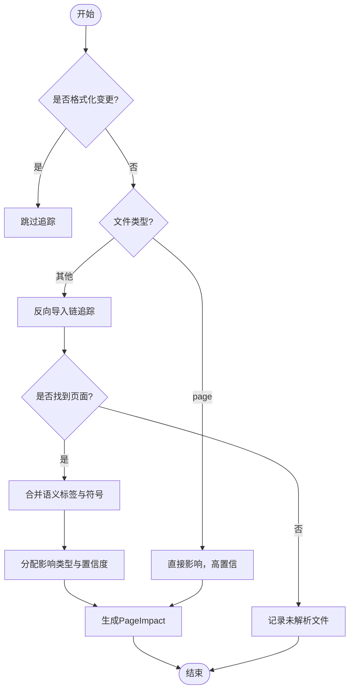
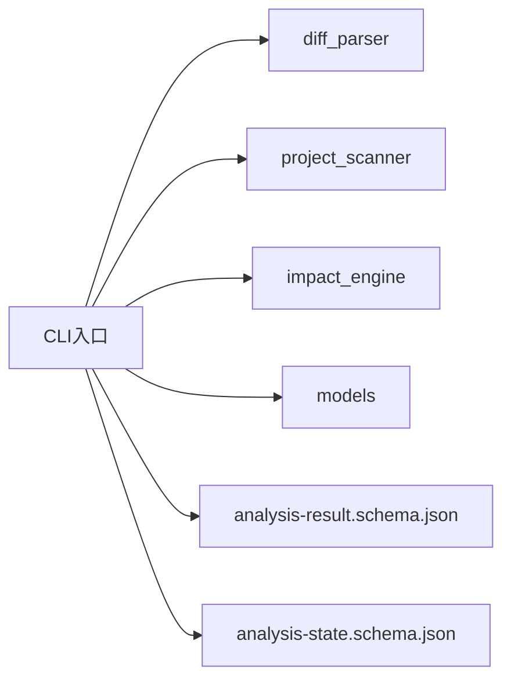

# 代理工具集成

<cite>
**本文引用的文件**
- [agents/openai.yaml](file://agents/openai.yaml)
- [scripts/front_end_impact_analyzer.py](file://scripts/front_end_impact_analyzer.py)
- [scripts/analyzer/models.py](file://scripts/analyzer/models.py)
- [scripts/analyzer/diff_parser.py](file://scripts/analyzer/diff_parser.py)
- [scripts/analyzer/project_scanner.py](file://scripts/analyzer/project_scanner.py)
- [scripts/analyzer/impact_engine.py](file://scripts/analyzer/impact_engine.py)
- [scripts/analyzer/case_builder.py](file://scripts/analyzer/case_builder.py)
- [schemas/analysis-result.schema.json](file://schemas/analysis-result.schema.json)
- [schemas/analysis-state.schema.json](file://schemas/analysis-state.schema.json)
- [AGENTS.md](file://AGENTS.md)
- [SKILL.md](file://SKILL.md)
- [references/agent-usage.md](file://references/agent-usage.md)
- [references/impact-rules.md](file://references/impact-rules.md)
- [references/project-conventions.md](file://references/project-conventions.md)
- [references/route-conventions.md](file://references/route-conventions.md)
- [pyproject.toml](file://pyproject.toml)
</cite>

## 目录
1. [简介](#简介)
2. [项目结构](#项目结构)
3. [核心组件](#核心组件)
4. [架构总览](#架构总览)
5. [详细组件分析](#详细组件分析)
6. [依赖关系分析](#依赖关系分析)
7. [性能考量](#性能考量)
8. [故障排除指南](#故障排除指南)
9. [结论](#结论)
10. [附录](#附录)

## 简介
本指南面向希望将前端影响分析器集成到AI代理系统（如OpenAI代理）中的工程师与测试工程师。文档围绕以下目标展开：
- 将前端影响分析器作为技能（Skill）在代理环境中运行，完成从项目配置到最终结果消费的完整工作流
- 解释OpenAI代理的配置与使用要点，确保代理能正确调用分析器并解析中间产物
- 提供推荐的工作流程模式，覆盖预检、分支diff生成、大diff索引、页面/路由追踪、变更聚类、证据包构建、深度分析合并等阶段
- 给出在代理环境中调用分析器的示例路径与最佳实践，包括错误处理与状态检查
- 说明项目画像文件（project profile）的作用与生成方法，并给出优化分析精度的建议
- 明确输出格式要求与最佳实践（JSON数组排序、状态文件使用）
- 提供常见集成问题的故障排除清单

## 项目结构
该仓库采用“技能化”组织方式，核心由一个CLI入口脚本与若干分析模块组成，配合参考文档与JSON Schema定义输出契约。

图示来源
- [scripts/front_end_impact_analyzer.py:239-403](file://scripts/front_end_impact_analyzer.py#L239-L403)
- [agents/openai.yaml:1-3](file://agents/openai.yaml#L1-L3)

章节来源
- [AGENTS.md:106-133](file://AGENTS.md#L106-L133)
- [SKILL.md:10-100](file://SKILL.md#L10-L100)

## 核心组件
- 前端影响分析引擎：封装从diff解析、项目扫描、影响追踪、聚类与证据包构建到最终分析包产出的全流程
- 数据模型与状态：统一的状态结构、过程日志、中间产物存储与导出
- 工具链模块：diff解析、项目扫描（含别名/桶导出/懒加载路由）、影响追踪、用例模板（已弃用，最终用例需经深度分析合并）

章节来源
- [scripts/front_end_impact_analyzer.py:23-160](file://scripts/front_end_impact_analyzer.py#L23-L160)
- [scripts/analyzer/models.py:115-201](file://scripts/analyzer/models.py#L115-L201)
- [scripts/analyzer/diff_parser.py:11-130](file://scripts/analyzer/diff_parser.py#L11-L130)
- [scripts/analyzer/project_scanner.py:13-80](file://scripts/analyzer/project_scanner.py#L13-L80)
- [scripts/analyzer/impact_engine.py:10-58](file://scripts/analyzer/impact_engine.py#L10-L58)
- [scripts/analyzer/case_builder.py:15-21](file://scripts/analyzer/case_builder.py#L15-L21)

## 架构总览
分析器以“状态驱动”的方式组织，CLI负责参数解析、运行编排与产物写盘；内部通过多个分析模块协作，最终产出分析包与状态快照。

图示来源
- [scripts/front_end_impact_analyzer.py:56-160](file://scripts/front_end_impact_analyzer.py#L56-L160)
- [scripts/analyzer/diff_parser.py:62-110](file://scripts/analyzer/diff_parser.py#L62-L110)
- [scripts/analyzer/project_scanner.py:20-80](file://scripts/analyzer/project_scanner.py#L20-L80)
- [scripts/analyzer/impact_engine.py:26-58](file://scripts/analyzer/impact_engine.py#L26-L58)

## 详细组件分析

### 组件A：分析引擎与工作流
- 负责组装各模块、维护AnalysisState、记录ProcessLog、产出AnalysisPackage
- 关键阶段：解析diff、分类噪声、扫描项目、影响追踪、聚类与证据包、构建分析包、状态与结果落盘
- 错误处理：捕获异常、写入致命诊断、设置状态为failed并退出

图示来源
- [scripts/front_end_impact_analyzer.py:23-175](file://scripts/front_end_impact_analyzer.py#L23-L175)
- [scripts/analyzer/models.py:115-169](file://scripts/analyzer/models.py#L115-L169)

章节来源
- [scripts/front_end_impact_analyzer.py:56-160](file://scripts/front_end_impact_analyzer.py#L56-L160)

### 组件B：Diff解析与噪声过滤
- 解析git diff，识别新增/删除/修改、统计增删行数、提取符号与语义标签
- 噪声分类：格式化、注释、导入、生成、锁文件、测试、样式等
- API字段级变化检测：请求/响应字段重命名、枚举值增删、分页/详情/列表结构变化

图示来源
- [scripts/analyzer/diff_parser.py:62-130](file://scripts/analyzer/diff_parser.py#L62-L130)
- [scripts/analyzer/diff_parser.py:152-190](file://scripts/analyzer/diff_parser.py#L152-L190)

章节来源
- [scripts/analyzer/diff_parser.py:11-302](file://scripts/analyzer/diff_parser.py#L11-L302)

### 组件C：项目扫描与路由绑定
- 收集源文件、解析AST、抽取导入/导出/组件/钩子/JSDoc等事实
- 解析tsconfig别名、桶导出、懒加载路由，构建导入/反向导入图
- 路由对象解析：支持path/element/component/lazy/children，父子路径拼接，注释标题提取

图示来源
- [scripts/analyzer/project_scanner.py:20-80](file://scripts/analyzer/project_scanner.py#L20-L80)
- [scripts/analyzer/project_scanner.py:128-227](file://scripts/analyzer/project_scanner.py#L128-L227)

章节来源
- [scripts/analyzer/project_scanner.py:13-383](file://scripts/analyzer/project_scanner.py#L13-L383)

### 组件D：影响追踪与置信度评估
- 从变更文件出发，沿反向导入链向上追溯至页面
- 结合文件类型、路径、语义标签与符号匹配，确定影响类型与置信度
- 对共享组件等弱证据场景保持保守

图示来源
- [scripts/analyzer/impact_engine.py:26-58](file://scripts/analyzer/impact_engine.py#L26-L58)
- [scripts/analyzer/impact_engine.py:168-187](file://scripts/analyzer/impact_engine.py#L168-L187)

章节来源
- [scripts/analyzer/impact_engine.py:10-188](file://scripts/analyzer/impact_engine.py#L10-L188)

### 组件E：用例生成与模板（已弃用）
- 用例模板基于语义标签与API变化自动生成，但当前主流程不直接产出用例数组
- 最终用例必须来自深度分析合并（cluster-analysis），并在合并后进行验证与精炼

章节来源
- [scripts/analyzer/case_builder.py:15-228](file://scripts/analyzer/case_builder.py#L15-L228)
- [SKILL.md:258-280](file://SKILL.md#L258-L280)

## 依赖关系分析
- CLI入口依赖所有分析模块与工具函数
- 分析模块之间存在清晰的输入/输出边界：diff解析→项目扫描→影响追踪→聚类与证据包→分析包
- JSON Schema用于约束最终输出结构，确保代理消费的一致性

图示来源
- [scripts/front_end_impact_analyzer.py:9-20](file://scripts/front_end_impact_analyzer.py#L9-L20)
- [schemas/analysis-result.schema.json:1-180](file://schemas/analysis-result.schema.json#L1-L180)
- [schemas/analysis-state.schema.json:1-238](file://schemas/analysis-state.schema.json#L1-L238)

章节来源
- [pyproject.toml:1-18](file://pyproject.toml#L1-L18)

## 性能考量
- 大型diff的聚类与证据包构建会占用较多内存与磁盘IO，建议合理设置聚类上限与上下文预算
- AST解析与导入图构建是CPU密集环节，建议在CI或专用机器上运行
- 通过噪声过滤减少无效文件的深入分析，提升整体吞吐

## 故障排除指南
- 预检阻塞：当repo wiki/需求/规格缺失或输出路径不可写时，分析会被阻断。请先生成所需文档或修正配置后再运行
- 未解析导入/未绑定路由：检查tsconfig别名、桶导出链与懒加载路由是否可达
- 格式化变更过多：噪声分类会跳过此类文件，不会产生用例
- 深度分析缺失：若未提供cluster-analysis文件，最终cases为空，需按指引继续分析并合并
- 合并失败：检查cluster-analysis输出是否满足schema要求，确保每个用例包含必需字段

章节来源
- [scripts/front_end_impact_analyzer.py:314-359](file://scripts/front_end_impact_analyzer.py#L314-L359)
- [references/agent-usage.md:83-102](file://references/agent-usage.md#L83-L102)

## 结论
该分析器以“状态驱动、模块解耦、证据可追溯”为核心设计，适合在代理环境中作为技能调用。通过合理的配置与工作流编排，代理可以稳定地完成从diff到最终QA用例的全链路分析，并借助中间产物与状态文件进行可视化与审计。

## 附录

### A. OpenAI代理配置与使用
- 在代理侧准备目标业务项目目录，确保具备可运行的Python环境与uv工具
- 使用提供的命令生成或检查配置、生成diff、运行分析、安装Claude子agent、合并深度分析结果
- 代理应优先读取99-final-result.json作为初始分析包，再根据needsDeepAnalysis队列推进深度分析

章节来源
- [SKILL.md:31-99](file://SKILL.md#L31-L99)
- [references/agent-usage.md:16-35](file://references/agent-usage.md#L16-L35)

### B. 项目画像文件（Project Profile）的作用与生成
- 作用：作为项目特定的示例与补充规则来源，帮助分析器提取可复用的页面根、路由风格、别名风格、桶导出与API文件约定
- 生成建议：在repo wiki或专门文档中整理典型页面/路由/组件/API的命名与组织方式，便于分析器在扫描阶段增强启发式判断
- 优化精度：将项目特有的别名约定扩展到扫描器中，避免硬编码路径，保持通用性

章节来源
- [references/project-conventions.md:1-20](file://references/project-conventions.md#L1-L20)
- [references/agent-usage.md:117-127](file://references/agent-usage.md#L117-L127)

### C. 输出格式与最佳实践
- 输出契约：analysis-package-v2，包含meta、summary、coverage、clusters、cases、fallbackCases、nextStepsForClaude
- JSON数组排序：最终用例数组应按模块、优先级、置信度、用例名排序，便于下游系统消费
- 状态文件使用：98-analysis-state.json用于合并阶段显示路由显示名与图证据；99-final-result.json为初始分析包；99-merged-result.json为合并后的最终结果
- 建议：代理在消费结果前先检查meta.analysisStatus与coverage.warnings，针对partial_success谨慎使用

章节来源
- [schemas/analysis-result.schema.json:1-180](file://schemas/analysis-result.schema.json#L1-L180)
- [scripts/front_end_impact_analyzer.py:176-186](file://scripts/front_end_impact_analyzer.py#L176-L186)
- [references/agent-usage.md:117-127](file://references/agent-usage.md#L117-L127)

### D. 推荐工作流程（代理视角）
- 配置与预检：检查/生成配置文件，doctor环境，确认repo wiki/需求/规格就绪
- Diff生成：指定基线分支与对比分支，生成diff文件
- 分析运行：解析diff、扫描项目、追踪影响、生成聚类与证据包
- 深度分析：按优先级逐个cluster进行证据检索与用例撰写
- 合并与精炼：合并cluster-analysis，生成最终用例数组，必要时进行精炼

章节来源
- [SKILL.md:12-28](file://SKILL.md#L12-L28)
- [references/agent-usage.md:36-68](file://references/agent-usage.md#L36-L68)