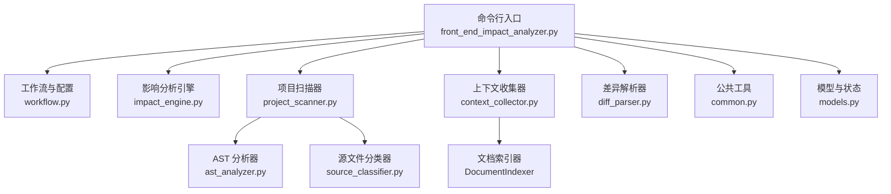
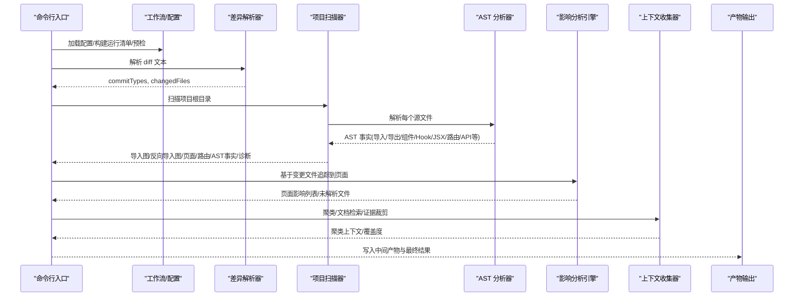
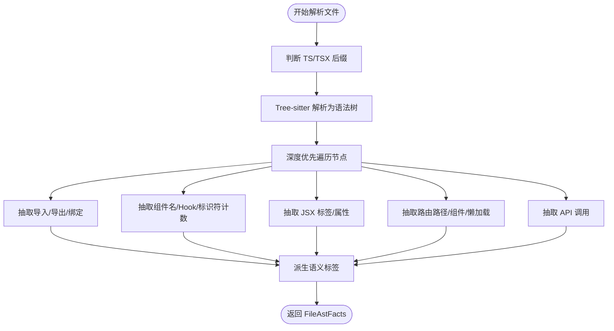
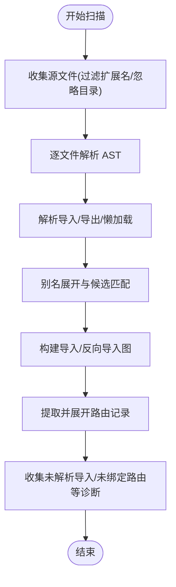
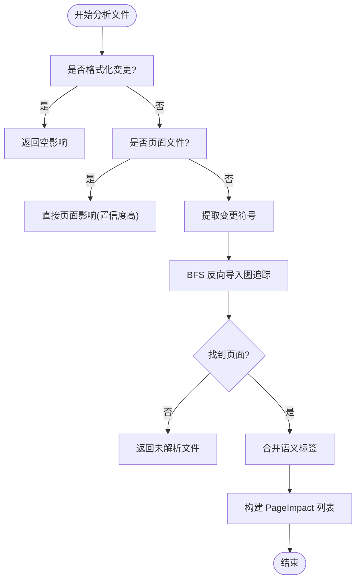
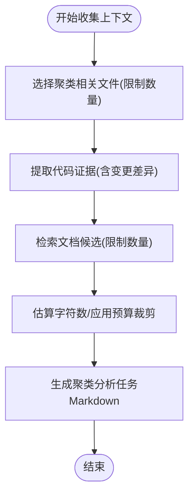
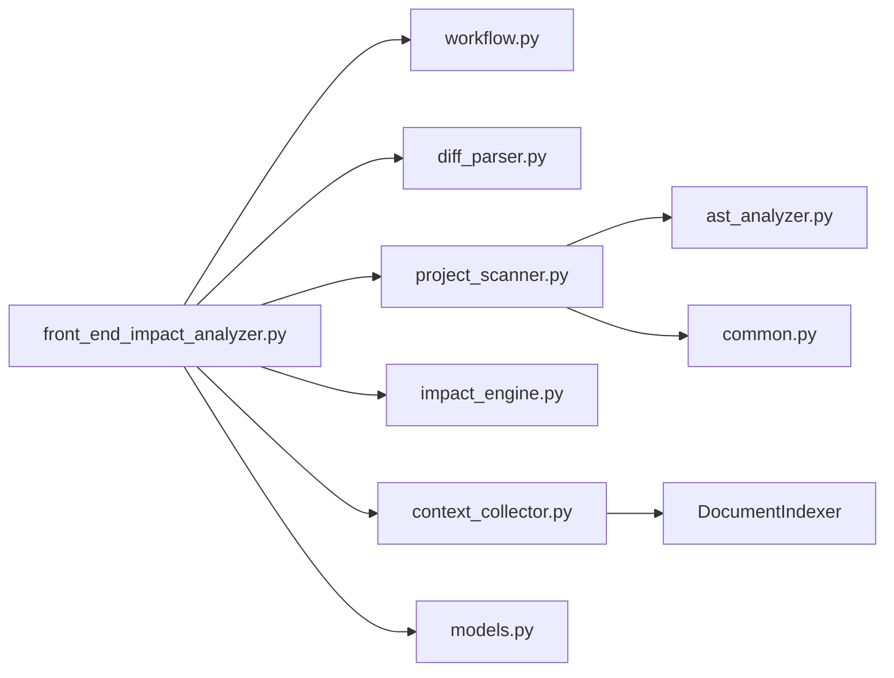

# 性能优化

<cite>
**本文引用的文件**
- [scripts/front_end_impact_analyzer.py](file://scripts/front_end_impact_analyzer.py)
- [scripts/analyzer/ast_analyzer.py](file://scripts/analyzer/ast_analyzer.py)
- [scripts/analyzer/project_scanner.py](file://scripts/analyzer/project_scanner.py)
- [scripts/analyzer/impact_engine.py](file://scripts/analyzer/impact_engine.py)
- [scripts/analyzer/workflow.py](file://scripts/analyzer/workflow.py)
- [scripts/analyzer/common.py](file://scripts/analyzer/common.py)
- [scripts/analyzer/models.py](file://scripts/analyzer/models.py)
- [scripts/analyzer/diff_parser.py](file://scripts/analyzer/diff_parser.py)
- [scripts/analyzer/context_collector.py](file://scripts/analyzer/context_collector.py)
- [scripts/analyzer/source_classifier.py](file://scripts/analyzer/source_classifier.py)
- [pyproject.toml](file://pyproject.toml)
</cite>

## 目录
1. [简介](#简介)
2. [项目结构](#项目结构)
3. [核心组件](#核心组件)
4. [架构总览](#架构总览)
5. [详细组件分析](#详细组件分析)
6. [依赖分析](#依赖分析)
7. [性能考虑](#性能考虑)
8. [故障排查指南](#故障排查指南)
9. [结论](#结论)
10. [附录](#附录)

## 简介
本指南聚焦于大规模前端项目的性能优化策略与实践，围绕内存使用、并发处理、缓存机制、AST 解析瓶颈与增量分析、配置参数调优（超时、并发、资源限制）、性能分析工具使用、不同项目规模的优化策略、监控与基准测试方法，以及在“分析精度”与“性能表现”之间的平衡进行系统阐述。文档以仓库中的实际实现为依据，结合可视化图示与分层讲解，帮助读者快速落地优化。

## 项目结构
该分析器采用模块化设计：命令行入口负责运行编排与状态持久化；扫描器负责项目全量/增量扫描与 AST 提取；影响分析引擎负责从变更文件追踪到页面；上下文收集器负责文档检索与证据打包；工作流模块提供默认配置与预检；公共模块提供通用工具与常量；模型模块定义状态与数据结构。

图表来源
- [scripts/front_end_impact_analyzer.py:56-160](file://scripts/front_end_impact_analyzer.py#L56-L160)
- [scripts/analyzer/project_scanner.py:13-80](file://scripts/analyzer/project_scanner.py#L13-L80)
- [scripts/analyzer/impact_engine.py:10-18](file://scripts/analyzer/impact_engine.py#L10-L18)
- [scripts/analyzer/context_collector.py:14-56](file://scripts/analyzer/context_collector.py#L14-L56)
- [scripts/analyzer/workflow.py:15-62](file://scripts/analyzer/workflow.py#L15-L62)
- [scripts/analyzer/common.py:1-151](file://scripts/analyzer/common.py#L1-L151)
- [scripts/analyzer/models.py:115-201](file://scripts/analyzer/models.py#L115-L201)

章节来源
- [scripts/front_end_impact_analyzer.py:23-160](file://scripts/front_end_impact_analyzer.py#L23-L160)
- [scripts/analyzer/project_scanner.py:13-80](file://scripts/analyzer/project_scanner.py#L13-L80)
- [scripts/analyzer/impact_engine.py:10-18](file://scripts/analyzer/impact_engine.py#L10-L18)
- [scripts/analyzer/context_collector.py:14-56](file://scripts/analyzer/context_collector.py#L14-L56)
- [scripts/analyzer/workflow.py:15-62](file://scripts/analyzer/workflow.py#L15-L62)
- [scripts/analyzer/common.py:1-151](file://scripts/analyzer/common.py#L1-L151)
- [scripts/analyzer/models.py:115-201](file://scripts/analyzer/models.py#L115-L201)

## 核心组件
- 命令行入口与运行编排：负责加载配置、构建运行清单、执行预检、驱动完整流程、写入中间产物与最终结果。
- 工作流与配置：提供默认配置字典、路径解析、预检与医生检查、生成运行清单等。
- 项目扫描器：遍历源码、读取文件、提取 AST、解析路由、建立导入/反向导入图、收集诊断信息。
- AST 分析器：基于 Tree-sitter 对 TS/TSX 进行语法树解析，抽取导入导出、组件名、Hook、JSX 属性、路由、懒加载、API 调用、语义标签等。
- 影响分析引擎：基于反向导入图与页面集合，从变更文件回溯到页面，计算影响类型、置信度与原因。
- 上下文收集器：根据聚类结果检索文档证据、裁剪代码片段、控制上下文大小，输出聚类分析任务。
- 公共工具：统一路径处理、安全读取、去重、别名解析、模块名推断、API 名称集合等。
- 模型与状态：定义分析状态、过程日志、变更文件、AST 事实、页面影响、路由信息等数据结构。
- 差异解析器：解析 Git diff，识别提交类型、统计增删行、提取符号与语义标签、识别格式化变更、分析 API 字段变更。
- 源文件分类器：对文件进行类型分类与模块猜测。

章节来源
- [scripts/front_end_impact_analyzer.py:23-160](file://scripts/front_end_impact_analyzer.py#L23-L160)
- [scripts/analyzer/workflow.py:15-62](file://scripts/analyzer/workflow.py#L15-L62)
- [scripts/analyzer/project_scanner.py:13-80](file://scripts/analyzer/project_scanner.py#L13-L80)
- [scripts/analyzer/ast_analyzer.py:13-31](file://scripts/analyzer/ast_analyzer.py#L13-L31)
- [scripts/analyzer/impact_engine.py:10-18](file://scripts/analyzer/impact_engine.py#L10-L18)
- [scripts/analyzer/context_collector.py:162-200](file://scripts/analyzer/context_collector.py#L162-L200)
- [scripts/analyzer/common.py:1-151](file://scripts/analyzer/common.py#L1-L151)
- [scripts/analyzer/models.py:115-201](file://scripts/analyzer/models.py#L115-L201)
- [scripts/analyzer/diff_parser.py:11-110](file://scripts/analyzer/diff_parser.py#L11-L110)
- [scripts/analyzer/source_classifier.py:6-36](file://scripts/analyzer/source_classifier.py#L6-L36)

## 架构总览
整体流程自上而下分为“输入与配置—扫描与建模—影响追踪—上下文与聚类—产物输出”。关键性能点集中在扫描阶段（文件遍历、AST 解析、导入解析）与影响追踪阶段（BFS 回溯、符号匹配）。

图表来源
- [scripts/front_end_impact_analyzer.py:56-160](file://scripts/front_end_impact_analyzer.py#L56-L160)
- [scripts/analyzer/diff_parser.py:62-110](file://scripts/analyzer/diff_parser.py#L62-L110)
- [scripts/analyzer/project_scanner.py:20-80](file://scripts/analyzer/project_scanner.py#L20-L80)
- [scripts/analyzer/ast_analyzer.py:18-31](file://scripts/analyzer/ast_analyzer.py#L18-L31)
- [scripts/analyzer/impact_engine.py:26-58](file://scripts/analyzer/impact_engine.py#L26-L58)
- [scripts/analyzer/context_collector.py:182-200](file://scripts/analyzer/context_collector.py#L182-L200)

## 详细组件分析

### 组件一：AST 解析与性能瓶颈
- 关键实现
  - 使用 Tree-sitter 的 TS/TSX 解析器，逐节点遍历并抽取所需信息。
  - 在单文件内进行正则与字段匹配，避免复杂回溯。
- 性能瓶颈
  - 文件数量与体积线性增加导致 CPU 与内存占用上升。
  - 大型项目中导入解析与别名展开可能产生重复 IO 与字符串操作。
- 优化建议
  - 文件过滤：仅扫描 src 目录与受支持扩展名，忽略 node_modules 等目录。
  - 增量解析：基于变更文件集合，仅对受影响的导入链路重新解析。
  - 缓存 AST 事实：将已解析的 AST 事实按文件缓存，避免重复解析。
  - 并发解析：在多核环境下对独立文件进行并发解析（注意 GIL 限制，可考虑进程池）。
  - 语义标签派生：将高频模式抽取为常量，减少重复正则编译。

图表来源
- [scripts/analyzer/ast_analyzer.py:18-31](file://scripts/analyzer/ast_analyzer.py#L18-L31)
- [scripts/analyzer/ast_analyzer.py:35-114](file://scripts/analyzer/ast_analyzer.py#L35-L114)
- [scripts/analyzer/ast_analyzer.py:210-242](file://scripts/analyzer/ast_analyzer.py#L210-L242)

章节来源
- [scripts/analyzer/ast_analyzer.py:13-242](file://scripts/analyzer/ast_analyzer.py#L13-L242)
- [scripts/analyzer/common.py:8-13](file://scripts/analyzer/common.py#L8-L13)

### 组件二：项目扫描与导入解析
- 关键实现
  - 遍历 src 或项目根目录，过滤扩展名与忽略目录。
  - 对每个文件调用 AST 分析器，解析导入/导出/懒加载与路由记录。
  - 解析别名目标，尝试多种候选后缀与 index 变体，建立导入/反向导入图。
  - 收集诊断（未解析导入、未绑定路由等）。
- 性能瓶颈
  - 递归解析别名与候选文件存在多次 IO。
  - 大量小文件导致频繁系统调用与字符串拼接。
- 优化建议
  - 引入“导入解析缓存”，命中则直接返回解析结果。
  - 将候选扩展名与 index 变体预构建为映射表，减少循环查找。
  - 对路由记录的展开采用“延迟求值”，仅在需要时解析具体文件。

图表来源
- [scripts/analyzer/project_scanner.py:82-121](file://scripts/analyzer/project_scanner.py#L82-L121)
- [scripts/analyzer/project_scanner.py:93-121](file://scripts/analyzer/project_scanner.py#L93-L121)
- [scripts/analyzer/project_scanner.py:128-228](file://scripts/analyzer/project_scanner.py#L128-L228)

章节来源
- [scripts/analyzer/project_scanner.py:13-383](file://scripts/analyzer/project_scanner.py#L13-L383)
- [scripts/analyzer/common.py:74-96](file://scripts/analyzer/common.py#L74-L96)

### 组件三：影响分析与回溯追踪
- 关键实现
  - 基于反向导入图进行 BFS，从变更文件向上回溯至页面。
  - 符号传播：根据导入/再导出绑定与标识符计数，决定是否保留活跃符号。
  - 计算影响类型、置信度与原因，合并语义标签。
- 性能瓶颈
  - 大型依赖图中 BFS 可能产生大量中间 trace，内存与去重成本高。
  - 符号匹配与去重逻辑在长链路中重复计算。
- 优化建议
  - 使用“访问键去重”（当前实现已采用），确保 (文件, 活跃符号, 是否严格) 唯一。
  - 控制最大回溯层级或 hop 数，避免深层链路无限扩散。
  - 对页面集合使用集合查询，提升命中速度。

图表来源
- [scripts/analyzer/impact_engine.py:26-58](file://scripts/analyzer/impact_engine.py#L26-L58)
- [scripts/analyzer/impact_engine.py:77-105](file://scripts/analyzer/impact_engine.py#L77-L105)
- [scripts/analyzer/impact_engine.py:119-162](file://scripts/analyzer/impact_engine.py#L119-L162)

章节来源
- [scripts/analyzer/impact_engine.py:10-188](file://scripts/analyzer/impact_engine.py#L10-L188)

### 组件四：上下文收集与证据裁剪
- 关键实现
  - 文档索引器：扫描项目 wiki/需求/规范等文档，构建关键词与标题索引。
  - 聚类上下文收集：按聚类关键字检索文档候选，裁剪代码片段长度，控制上下文字符上限。
- 性能瓶颈
  - 文档检索与段落切分在大文本上开销较高。
  - 代码证据片段过多会超出上下文预算，需反复裁剪。
- 优化建议
  - 文档索引与关键词抽取结果缓存。
  - 优先裁剪最长片段，先截断代码片段再截断文档片段。
  - 限制每聚类最大文件数与文档片段数，避免无界增长。

图表来源
- [scripts/analyzer/context_collector.py:182-200](file://scripts/analyzer/context_collector.py#L182-L200)
- [scripts/analyzer/context_collector.py:555-574](file://scripts/analyzer/context_collector.py#L555-L574)

章节来源
- [scripts/analyzer/context_collector.py:14-200](file://scripts/analyzer/context_collector.py#L14-L200)
- [scripts/analyzer/context_collector.py:555-574](file://scripts/analyzer/context_collector.py#L555-L574)

### 组件五：差异解析与噪声过滤
- 关键实现
  - 解析 diff，识别提交类型、文件变更、增删行统计。
  - 提取符号与语义标签，识别格式化变更，分析 API 字段变更。
  - 结合噪声分类器跳过无需分析的文件，减少后续开销。
- 性能瓶颈
  - 正则匹配在大 diff 上累积开销。
  - API 字段变更分析涉及多轮提取与去重。
- 优化建议
  - 对强信号 API 路径与关键词进行短路判定，避免全量分析。
  - 将语义标签与符号模式集中管理，减少重复编译。

章节来源
- [scripts/analyzer/diff_parser.py:11-110](file://scripts/analyzer/diff_parser.py#L11-L110)
- [scripts/analyzer/diff_parser.py:152-195](file://scripts/analyzer/diff_parser.py#L152-L195)

## 依赖分析
- 外部依赖
  - tree-sitter 与 tree-sitter-typescript：用于高性能语法树解析。
- 内部模块耦合
  - 扫描器依赖 AST 分析器与公共工具。
  - 影响分析引擎依赖扫描器产出的图结构与 AST 事实。
  - 上下文收集器依赖扫描器与文档索引器。
  - 命令行入口串联上述模块并写入状态与产物。
- 循环依赖
  - 未发现循环导入；模块职责清晰，接口稳定。

图表来源
- [scripts/front_end_impact_analyzer.py:9-20](file://scripts/front_end_impact_analyzer.py#L9-L20)
- [scripts/analyzer/project_scanner.py:8-10](file://scripts/analyzer/project_scanner.py#L8-L10)
- [scripts/analyzer/context_collector.py:162-180](file://scripts/analyzer/context_collector.py#L162-L180)
- [pyproject.toml:6-9](file://pyproject.toml#L6-L9)

章节来源
- [pyproject.toml:1-18](file://pyproject.toml#L1-L18)
- [scripts/front_end_impact_analyzer.py:9-20](file://scripts/front_end_impact_analyzer.py#L9-L20)
- [scripts/analyzer/project_scanner.py:8-10](file://scripts/analyzer/project_scanner.py#L8-L10)
- [scripts/analyzer/context_collector.py:162-180](file://scripts/analyzer/context_collector.py#L162-L180)

## 性能考虑

### 内存使用优化
- AST 事实缓存：将解析后的 FileAstFacts 按文件键缓存，避免重复解析。
- 去重与有序集合：使用 uniq_keep_order 保持顺序的同时去重，降低重复存储。
- 诊断与中间结构：及时清理不再使用的中间结构，避免累积。
- 文档与代码证据：按预算裁剪，避免一次性加载全部内容。

章节来源
- [scripts/analyzer/ast_analyzer.py:24-30](file://scripts/analyzer/ast_analyzer.py#L24-L30)
- [scripts/analyzer/common.py:37-44](file://scripts/analyzer/common.py#L37-L44)
- [scripts/analyzer/context_collector.py:555-574](file://scripts/analyzer/context_collector.py#L555-L574)

### 并发处理
- AST 解析并发：对独立文件进行并发解析（注意 GIL，可采用进程池）。
- 文档读取并发：对多个文档文件的读取与索引构建可并行。
- 导入解析并发：对不同别名目标的候选匹配可并行。
- 注意事项：并发需配合缓存与限流，避免 IO 抖动与锁竞争。

章节来源
- [scripts/analyzer/project_scanner.py:93-121](file://scripts/analyzer/project_scanner.py#L93-L121)
- [scripts/analyzer/context_collector.py:182-200](file://scripts/analyzer/context_collector.py#L182-L200)

### 缓存机制
- 导入解析缓存：对别名展开与候选匹配结果缓存。
- AST 事实缓存：对已解析文件的事实缓存。
- 文档索引缓存：对文档关键词、标题、段落切分结果缓存。
- 聚类上下文预算缓存：对裁剪策略与估算字符数缓存。

章节来源
- [scripts/analyzer/project_scanner.py:93-121](file://scripts/analyzer/project_scanner.py#L93-L121)
- [scripts/analyzer/context_collector.py:555-574](file://scripts/analyzer/context_collector.py#L555-L574)

### AST 解析瓶颈与增量分析
- 瓶颈定位
  - 文件遍历与 IO：src 目录与扩展名过滤有效，但忽略目录仍需合理配置。
  - AST 解析：Tree-sitter 解析器高效，但在大文件上仍占 CPU。
  - 符号匹配与去重：在长链路中重复计算。
- 增量策略
  - 基于变更文件集合，仅对受影响的导入链路重新解析。
  - 对已解析的 AST 事实与导入解析结果进行增量更新。
  - 对路由记录的展开采用“按需解析”，仅在需要时读取具体文件。

章节来源
- [scripts/analyzer/project_scanner.py:82-121](file://scripts/analyzer/project_scanner.py#L82-L121)
- [scripts/analyzer/ast_analyzer.py:18-31](file://scripts/analyzer/ast_analyzer.py#L18-L31)

### 配置参数调整建议
- 分析相关
  - maxClustersForDeepAnalysis：控制深度分析的聚类数量，避免过多人工介入。
  - maxFilesPerClusterContext：限制每聚类上下文文件数。
  - maxDocumentSnippetsPerCluster：限制每聚类文档片段数。
  - maxSnippetChars：限制单个代码片段字符数。
  - maxClusterContextChars：限制聚类上下文总字符数。
- 路径与预检
  - paths.outputDir：输出目录，建议指向本地 SSD。
  - paths.projectProfileFile/repoWikiDir/requirementsDir/specsDir：文档目录，建议按需启用。
- 预检与阻塞
  - requireRepoWiki/requireRequirements/requireSpecs：按需开启，避免不必要的阻塞。

章节来源
- [scripts/analyzer/workflow.py:15-62](file://scripts/analyzer/workflow.py#L15-L62)
- [scripts/analyzer/context_collector.py:555-574](file://scripts/analyzer/context_collector.py#L555-L574)

### 不同项目规模的优化策略
- 小型项目（<1K 文件）
  - 全量扫描即可满足性能；开启基本过滤与别名缓存。
  - 适当提高 maxClustersForDeepAnalysis 以提升覆盖率。
- 中型项目（1K–10K 文件）
  - 引入 AST 事实缓存与导入解析缓存。
  - 启用并发解析与并行文档读取。
  - 设置 maxFilesPerClusterContext 与 maxClusterContextChars 以控制上下文规模。
- 大型企业级应用（>10K 文件）
  - 强制增量分析：仅对变更文件及其导入链路解析。
  - 引入进程池并发与磁盘缓存（如 SQLite/Redis 存放 AST 事实）。
  - 严格控制聚类上下文预算，必要时拆分聚类任务。

章节来源
- [scripts/analyzer/workflow.py:51-61](file://scripts/analyzer/workflow.py#L51-L61)
- [scripts/analyzer/context_collector.py:182-200](file://scripts/analyzer/context_collector.py#L182-L200)

### 监控与基准测试
- 监控指标
  - 扫描耗时、AST 解析耗时、导入解析耗时、影响追踪耗时、上下文收集耗时。
  - 内存峰值、文件数、导入边数、页面数、诊断数。
- 基准测试
  - 使用不同规模的 fixtures 进行端到端基准，记录各阶段耗时与内存。
  - 对比启用/禁用缓存、并发与预算裁剪前后的性能差异。
- 可视化
  - 将各阶段耗时绘制成时间线图，定位瓶颈阶段。

章节来源
- [scripts/analyzer/models.py:163-169](file://scripts/analyzer/models.py#L163-L169)
- [scripts/analyzer/models.py:115-161](file://scripts/analyzer/models.py#L115-L161)

### 平衡分析精度与性能
- 精度保障
  - 保留反向导入图与符号传播规则，确保页面追踪准确。
  - 对未绑定路由与未解析导入保留诊断，便于人工复核。
- 性能让步
  - 通过预算裁剪与聚类限制，牺牲少量覆盖率换取可接受的响应时间。
  - 对非关键路径（如文档检索）采用近似策略，优先保证核心链路。

章节来源
- [scripts/analyzer/project_scanner.py:193-200](file://scripts/analyzer/project_scanner.py#L193-L200)
- [scripts/analyzer/context_collector.py:555-574](file://scripts/analyzer/context_collector.py#L555-L574)

## 故障排查指南
- 预检阻塞
  - 若 requireRepoWiki/requireRequirements/requireSpecs 为真且对应目录缺失，分析会被阻塞。
  - 解决：创建或生成相应目录，或在配置中关闭强制要求。
- 未解析导入/未绑定路由
  - 当导入目标无法解析或路由无法绑定到页面时，会生成诊断。
  - 解决：检查 tsconfig 别名、文件路径与命名导出一致性。
- 性能异常
  - 若扫描耗时过长，检查忽略目录与扩展名配置，确认缓存是否生效。
  - 若内存飙升，检查聚类上下文预算与文件/片段限制。
- 日志与状态
  - 使用 AnalysisState.processLogs 与 ProcessRecorder 定位慢点与错误。

章节来源
- [scripts/analyzer/workflow.py:105-134](file://scripts/analyzer/workflow.py#L105-L134)
- [scripts/analyzer/project_scanner.py:42-51](file://scripts/analyzer/project_scanner.py#L42-L51)
- [scripts/analyzer/models.py:163-169](file://scripts/analyzer/models.py#L163-L169)

## 结论
通过文件过滤、AST 缓存、导入解析缓存、上下文预算裁剪与并发处理，可在保证分析精度的前提下显著提升大规模前端项目的分析性能。建议在不同规模项目中采用差异化策略，并结合监控与基准测试持续优化。

## 附录
- 常用配置项速查
  - analysis.maxClustersForDeepAnalysis：深度分析聚类上限
  - analysis.maxFilesPerClusterContext：每聚类文件上限
  - analysis.maxDocumentSnippetsPerCluster：每聚类文档片段上限
  - analysis.maxSnippetChars：单片段最大字符数
  - analysis.maxClusterContextChars：聚类上下文总字符上限
  - paths.outputDir：输出目录
  - paths.projectProfileFile/repoWikiDir/requirementsDir/specsDir：文档目录
  - diff.ignoreDirs/ignoreFiles/ignoreGlobs：差异忽略规则

章节来源
- [scripts/analyzer/workflow.py:15-62](file://scripts/analyzer/workflow.py#L15-L62)