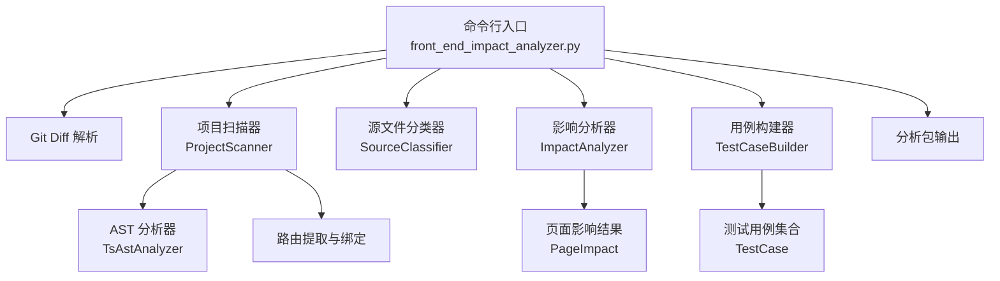
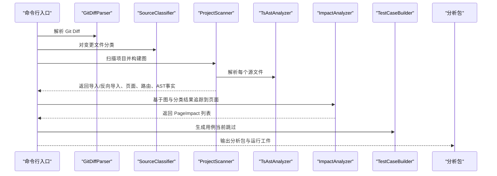
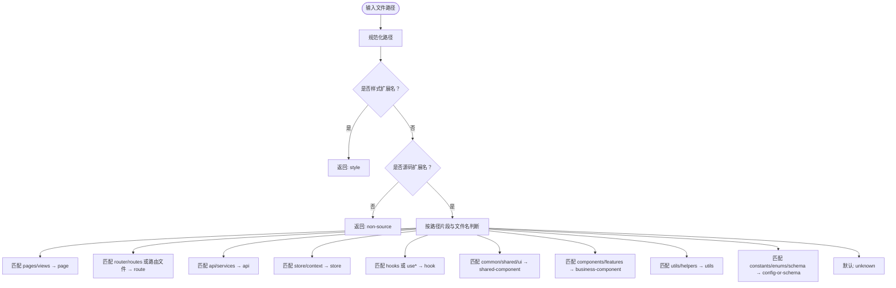
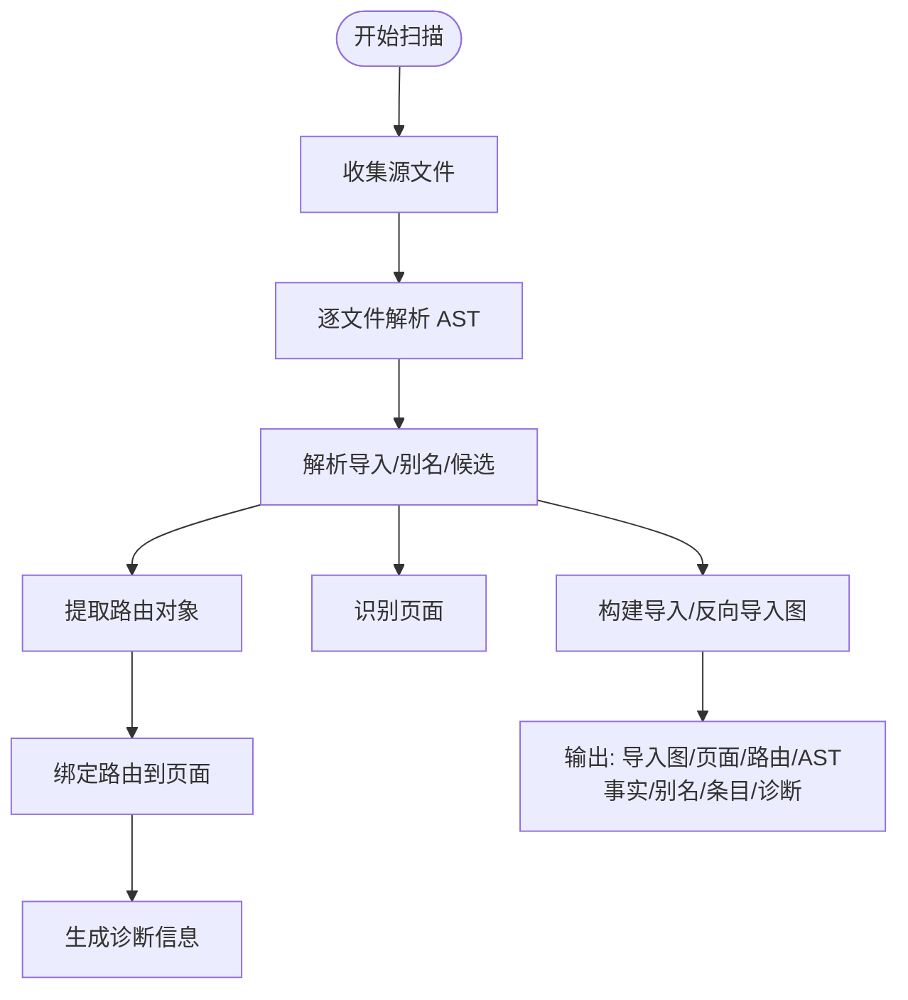
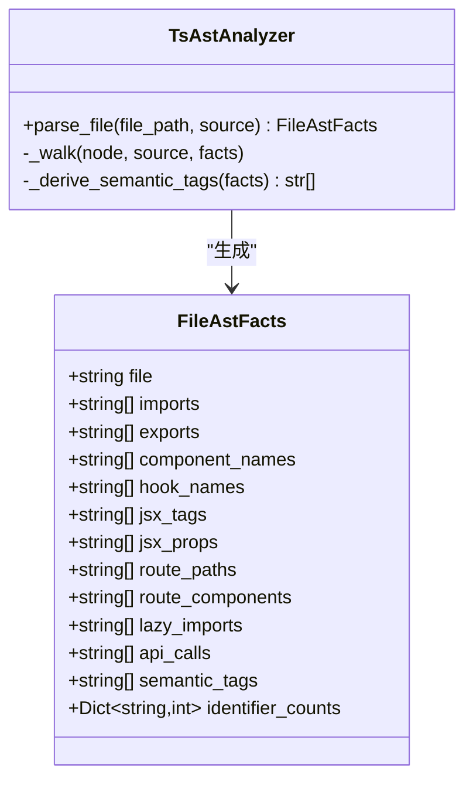
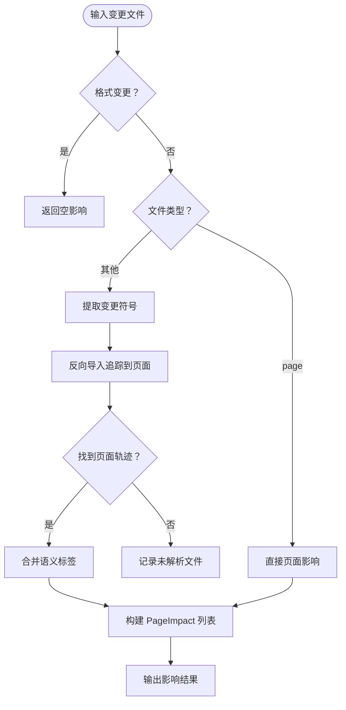
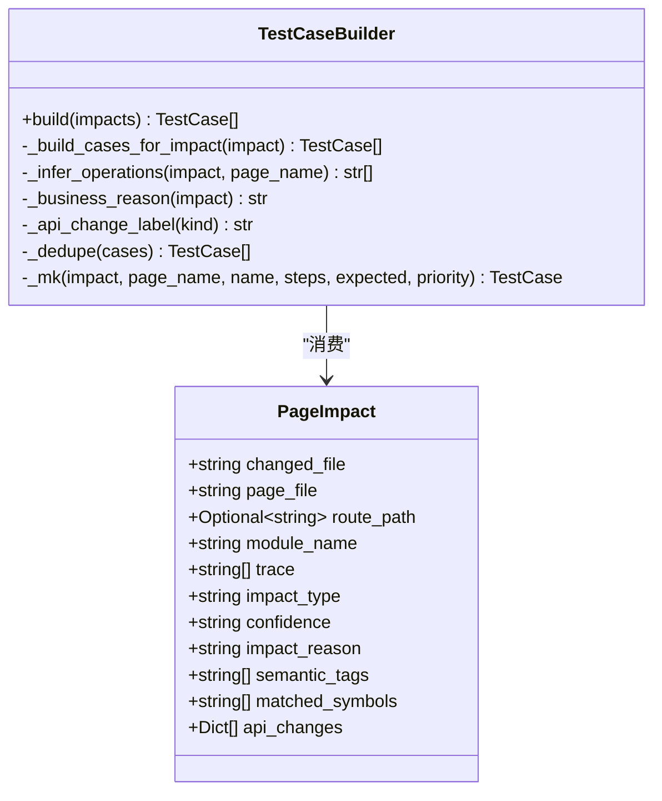
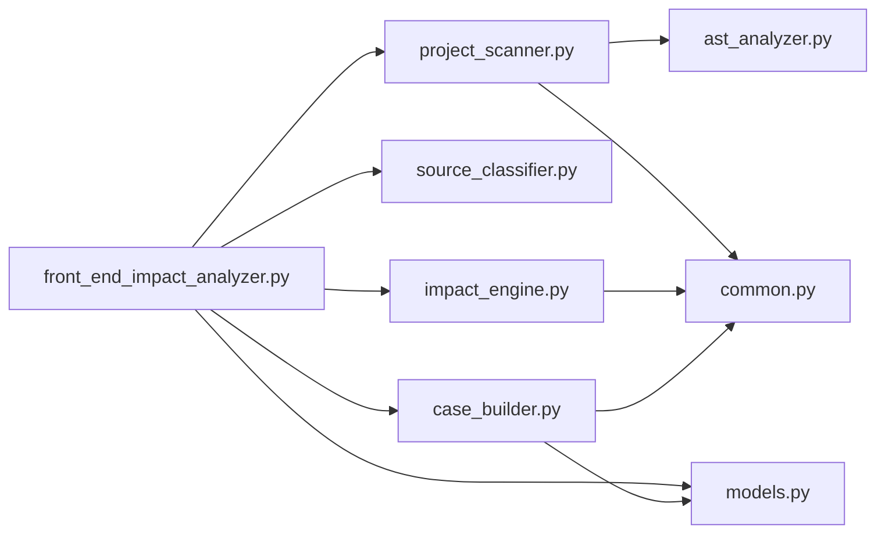

# 扩展开发

<cite>
**本文引用的文件**
- [scripts/analyzer/case_builder.py](file://scripts/analyzer/case_builder.py)
- [scripts/analyzer/source_classifier.py](file://scripts/analyzer/source_classifier.py)
- [scripts/analyzer/models.py](file://scripts/analyzer/models.py)
- [scripts/analyzer/project_scanner.py](file://scripts/analyzer/project_scanner.py)
- [scripts/analyzer/impact_engine.py](file://scripts/analyzer/impact_engine.py)
- [scripts/analyzer/ast_analyzer.py](file://scripts/analyzer/ast_analyzer.py)
- [scripts/analyzer/common.py](file://scripts/analyzer/common.py)
- [scripts/front_end_impact_analyzer.py](file://scripts/front_end_impact_analyzer.py)
- [pyproject.toml](file://pyproject.toml)
- [references/project-conventions.md](file://references/project-conventions.md)
- [references/route-conventions.md](file://references/route-conventions.md)
- [tests/test_project_scanner.py](file://tests/test_project_scanner.py)
</cite>

## 目录
1. [简介](#简介)
2. [项目结构](#项目结构)
3. [核心组件](#核心组件)
4. [架构总览](#架构总览)
5. [详细组件分析](#详细组件分析)
6. [依赖分析](#依赖分析)
7. [性能考虑](#性能考虑)
8. [故障排查指南](#故障排查指南)
9. [结论](#结论)
10. [附录](#附录)

## 简介
本指南面向希望扩展前端影响分析器的开发者，围绕如何为新前端框架、特殊项目结构或自定义需求进行扩展展开。文档聚焦于扩展点的设计原理与实现方式，包括 TestCaseBuilder、SourceClassifier 等核心组件的扩展机制，提供添加新的测试用例类型、文件类型支持与分析规则的具体方法，并阐述插件化与模块化设计原则、开发与测试策略、向后兼容与版本管理、发布与分发建议以及最佳实践。

## 项目结构
该分析器采用“模块化 + 工作流”的组织方式：命令行入口负责编排工作流，扫描器负责项目结构与 AST 解析，分类器负责文件类型与模块推断，影响分析器负责从变更文件到页面的追踪，最终生成分析包供后续人工/智能体补充用例。

图表来源
- [scripts/front_end_impact_analyzer.py:56-160](file://scripts/front_end_impact_analyzer.py#L56-L160)
- [scripts/analyzer/project_scanner.py:20-80](file://scripts/analyzer/project_scanner.py#L20-L80)
- [scripts/analyzer/ast_analyzer.py:13-31](file://scripts/analyzer/ast_analyzer.py#L13-L31)
- [scripts/analyzer/source_classifier.py:6-36](file://scripts/analyzer/source_classifier.py#L6-L36)
- [scripts/analyzer/impact_engine.py:10-58](file://scripts/analyzer/impact_engine.py#L10-L58)
- [scripts/analyzer/case_builder.py:15-64](file://scripts/analyzer/case_builder.py#L15-L64)

章节来源
- [scripts/front_end_impact_analyzer.py:23-160](file://scripts/front_end_impact_analyzer.py#L23-L160)
- [scripts/analyzer/project_scanner.py:13-80](file://scripts/analyzer/project_scanner.py#L13-L80)
- [scripts/analyzer/ast_analyzer.py:13-31](file://scripts/analyzer/ast_analyzer.py#L13-L31)
- [scripts/analyzer/source_classifier.py:6-36](file://scripts/analyzer/source_classifier.py#L6-L36)
- [scripts/analyzer/impact_engine.py:10-58](file://scripts/analyzer/impact_engine.py#L10-L58)
- [scripts/analyzer/case_builder.py:15-64](file://scripts/analyzer/case_builder.py#L15-L64)

## 核心组件
- 源文件分类器 SourceClassifier：根据路径与扩展名判断文件类型（如 page、route、api、store、hook、shared-component、business-component、utils、config-or-schema），并推断模块名。
- 项目扫描器 ProjectScanner：遍历源码、解析 AST、收集导入/反向导入、页面、路由、条目别名、条目证据与诊断信息。
- AST 分析器 TsAstAnalyzer：抽取导入导出、组件名、Hook 名、JSX 标签与属性、路由对象、懒加载、API 调用、语义标签等。
- 影响分析器 ImpactAnalyzer：基于反向导入图与页面集合，从变更文件追踪到页面，计算置信度与影响原因。
- 用例构建器 TestCaseBuilder：根据 PageImpact 的语义标签、API 变更与业务操作推断，生成多类测试用例模板。
- 数据模型 models：统一的数据结构（ChangedFile、PageImpact、TestCase、AnalysisState 等）与状态存储/记录器。

章节来源
- [scripts/analyzer/source_classifier.py:6-36](file://scripts/analyzer/source_classifier.py#L6-L36)
- [scripts/analyzer/project_scanner.py:13-80](file://scripts/analyzer/project_scanner.py#L13-L80)
- [scripts/analyzer/ast_analyzer.py:13-31](file://scripts/analyzer/ast_analyzer.py#L13-L31)
- [scripts/analyzer/impact_engine.py:10-58](file://scripts/analyzer/impact_engine.py#L10-L58)
- [scripts/analyzer/case_builder.py:15-64](file://scripts/analyzer/case_builder.py#L15-L64)
- [scripts/analyzer/models.py:18-201](file://scripts/analyzer/models.py#L18-L201)

## 架构总览
整体工作流从命令行入口开始，依次完成 Diff 解析、文件分类、项目扫描、影响分析、中间产物构建，最终输出分析包。其中，用例构建阶段当前为“跳过”，由外部智能体/人工根据聚类上下文生成用例，再通过合并器写入最终结果。

图表来源
- [scripts/front_end_impact_analyzer.py:56-160](file://scripts/front_end_impact_analyzer.py#L56-L160)
- [scripts/analyzer/project_scanner.py:20-80](file://scripts/analyzer/project_scanner.py#L20-L80)
- [scripts/analyzer/ast_analyzer.py:13-31](file://scripts/analyzer/ast_analyzer.py#L13-L31)
- [scripts/analyzer/impact_engine.py:26-58](file://scripts/analyzer/impact_engine.py#L26-L58)
- [scripts/analyzer/case_builder.py:15-20](file://scripts/analyzer/case_builder.py#L15-L20)

## 详细组件分析

### 组件一：源文件分类器 SourceClassifier 的扩展机制
- 设计要点
  - 基于路径片段与扩展名进行启发式分类，覆盖样式、页面、路由、API、状态/上下文、Hook、通用组件、业务组件、工具、配置/Schema 等类别。
  - 提供模块名推断辅助函数，便于后续影响分析与报告。
- 扩展建议
  - 若项目采用特殊目录命名（如 feature 目录下的页面），可在分类逻辑中增加匹配分支。
  - 若存在非标准扩展名（如 .ts 文件在特定目录下），可在扩展集常量处补充。
- 典型扩展点
  - 在分类器中新增分类分支，或在公共常量中补充扩展名集合。
  - 在模块名推断中加入新的分隔符或忽略词。

图表来源
- [scripts/analyzer/source_classifier.py:7-32](file://scripts/analyzer/source_classifier.py#L7-L32)

章节来源
- [scripts/analyzer/source_classifier.py:6-36](file://scripts/analyzer/source_classifier.py#L6-L36)
- [scripts/analyzer/common.py:8-13](file://scripts/analyzer/common.py#L8-L13)

### 组件二：项目扫描器 ProjectScanner 的扩展机制
- 设计要点
  - 支持相对导入、@/ 别名、tsconfig 路径别名与继承，自动解析候选目标文件（含 index.*）。
  - 识别页面（pages/views 下且包含组件/JSX 标签）、路由对象（path/element/component/lazy/children 等），并尝试将路由绑定到页面。
  - 产出导入图、反向导入图、页面列表、路由信息、AST 事实、条目文件与证据、诊断信息。
- 扩展建议
  - 若项目使用额外别名前缀或特殊模块解析规则，可在别名解析与候选解析处扩展。
  - 若路由定义风格多样（如函数式路由、第三方路由库），可在路由对象提取与绑定逻辑中增强。
- 典型扩展点
  - 在别名解析中加入自定义前缀与目标路径。
  - 在路由对象提取中支持新的键名或表达式模式。
  - 在页面判定中加入更多启发式规则。

图表来源
- [scripts/analyzer/project_scanner.py:20-80](file://scripts/analyzer/project_scanner.py#L20-L80)
- [scripts/analyzer/project_scanner.py:128-227](file://scripts/analyzer/project_scanner.py#L128-L227)
- [scripts/analyzer/ast_analyzer.py:13-31](file://scripts/analyzer/ast_analyzer.py#L13-L31)

章节来源
- [scripts/analyzer/project_scanner.py:13-80](file://scripts/analyzer/project_scanner.py#L13-L80)
- [scripts/analyzer/project_scanner.py:128-227](file://scripts/analyzer/project_scanner.py#L128-L227)
- [scripts/analyzer/ast_analyzer.py:13-31](file://scripts/analyzer/ast_analyzer.py#L13-L31)

### 组件三：AST 分析器 TsAstAnalyzer 的扩展机制
- 设计要点
  - 使用 Tree-Sitter 解析 TS/TSX，抽取导入/导出、组件名、Hook 名、JSX 标签与属性、路由对象、懒加载、API 调用、标识符计数等。
  - 基于 JSX 标签与属性推导语义标签（如 button/modal/form/table/upload/disabled-state/route/api/state 等）。
- 扩展建议
  - 若项目引入新的 UI 库或约定，可在 JSX 标签与属性匹配中加入新规则。
  - 若 API 调用命名不统一，可在 API 名称集合或正则匹配中扩展。
- 典型扩展点
  - 在语义标签派生逻辑中加入新的标签。
  - 在导入/导出绑定解析中支持新的语法变体。

图表来源
- [scripts/analyzer/ast_analyzer.py:13-31](file://scripts/analyzer/ast_analyzer.py#L13-L31)
- [scripts/analyzer/models.py:55-75](file://scripts/analyzer/models.py#L55-L75)

章节来源
- [scripts/analyzer/ast_analyzer.py:13-31](file://scripts/analyzer/ast_analyzer.py#L13-L31)
- [scripts/analyzer/ast_analyzer.py:210-242](file://scripts/analyzer/ast_analyzer.py#L210-L242)
- [scripts/analyzer/models.py:55-75](file://scripts/analyzer/models.py#L55-L75)

### 组件四：影响分析器 ImpactAnalyzer 的扩展机制
- 设计要点
  - 基于反向导入图与页面集合，从变更文件追踪到页面，支持严格/宽松符号传播。
  - 合并语义标签，计算影响类型（direct/indirect）与置信度，生成影响原因描述。
- 扩展建议
  - 若项目存在特殊的模块边界或共享组件传播规则，可在符号传播与置信度计算中调整。
  - 若需要区分更细粒度的影响类型，可在影响类型与置信度映射中扩展。
- 典型扩展点
  - 在符号传播中加入新的绑定/重导出规则。
  - 在置信度与影响类型映射中加入新的规则。

图表来源
- [scripts/analyzer/impact_engine.py:26-58](file://scripts/analyzer/impact_engine.py#L26-L58)
- [scripts/analyzer/impact_engine.py:77-105](file://scripts/analyzer/impact_engine.py#L77-L105)
- [scripts/analyzer/impact_engine.py:164-187](file://scripts/analyzer/impact_engine.py#L164-L187)

章节来源
- [scripts/analyzer/impact_engine.py:10-58](file://scripts/analyzer/impact_engine.py#L10-L58)
- [scripts/analyzer/impact_engine.py:77-105](file://scripts/analyzer/impact_engine.py#L77-L105)
- [scripts/analyzer/impact_engine.py:164-187](file://scripts/analyzer/impact_engine.py#L164-L187)

### 组件五：用例构建器 TestCaseBuilder 的扩展机制
- 设计要点
  - 基于 PageImpact 的语义标签、API 变更与业务操作推断，生成多种测试用例模板（基础回归、按钮、弹窗、表单、列表/查询/分页/排序、详情、删除、权限、导航、上传、禁用态、接口字段变更、枚举、分页参数、详情/列表结构等）。
  - 支持业务主流程与角色差异变体。
- 扩展建议
  - 若项目存在新的业务主流程（如审批、导出、复制等），可在业务操作推断与用例生成中加入新分支。
  - 若存在新的 API 变更类型，可在 API 变更映射中扩展。
- 典型扩展点
  - 在语义标签映射中加入新的标签与对应用例生成函数。
  - 在 API 变更映射中加入新的变更类型与对应用例生成函数。
  - 在业务操作推断中加入新的关键字或正则。

图表来源
- [scripts/analyzer/case_builder.py:15-64](file://scripts/analyzer/case_builder.py#L15-L64)
- [scripts/analyzer/case_builder.py:154-175](file://scripts/analyzer/case_builder.py#L154-L175)
- [scripts/analyzer/case_builder.py:177-196](file://scripts/analyzer/case_builder.py#L177-L196)
- [scripts/analyzer/models.py:77-90](file://scripts/analyzer/models.py#L77-L90)

章节来源
- [scripts/analyzer/case_builder.py:15-64](file://scripts/analyzer/case_builder.py#L15-L64)
- [scripts/analyzer/case_builder.py:154-175](file://scripts/analyzer/case_builder.py#L154-L175)
- [scripts/analyzer/case_builder.py:177-196](file://scripts/analyzer/case_builder.py#L177-L196)
- [scripts/analyzer/models.py:77-90](file://scripts/analyzer/models.py#L77-L90)

### 组件六：数据模型与状态管理
- 设计要点
  - 使用 dataclass 定义 ChangedFile、PageImpact、TestCase、AnalysisState 等核心数据结构，并提供序列化/反序列化辅助。
  - 提供 ProcessRecorder 与 StateStore 将中间状态持久化到 AnalysisState 中，便于调试与复现。
- 扩展建议
  - 若需要扩展新的分析维度（如覆盖率、复杂度指标），可在相应数据结构中新增字段。
  - 若需要扩展新的日志/诊断信息，可在 ProcessRecorder 中扩展记录项。
- 典型扩展点
  - 在 AnalysisState 中新增字段以承载新的中间结果。
  - 在 ChangedFile/RouteInfo/PageImpact 中新增字段以承载新的分析事实。

章节来源
- [scripts/analyzer/models.py:18-201](file://scripts/analyzer/models.py#L18-L201)

## 依赖分析
- 外部依赖
  - tree-sitter 与 tree-sitter-typescript：用于高性能解析 TS/TSX。
  - pytest：开发与测试。
- 内部模块依赖
  - 命令行入口依赖扫描器、分类器、影响分析器、用例构建器与状态存储。
  - 扫描器依赖 AST 分析器与公共工具。
  - 影响分析器依赖公共工具与模型。
  - 用例构建器依赖模型与公共工具。

图表来源
- [scripts/front_end_impact_analyzer.py:13-21](file://scripts/front_end_impact_analyzer.py#L13-L21)
- [scripts/analyzer/project_scanner.py:8-10](file://scripts/analyzer/project_scanner.py#L8-L10)
- [scripts/analyzer/impact_engine.py:6-7](file://scripts/analyzer/impact_engine.py#L6-L7)
- [scripts/analyzer/case_builder.py:11-12](file://scripts/analyzer/case_builder.py#L11-L12)
- [scripts/analyzer/models.py:4-5](file://scripts/analyzer/models.py#L4-L5)

章节来源
- [pyproject.toml:6-9](file://pyproject.toml#L6-L9)
- [scripts/front_end_impact_analyzer.py:13-21](file://scripts/front_end_impact_analyzer.py#L13-L21)

## 性能考虑
- AST 解析与图构建
  - 优先使用增量解析与缓存（若项目规模扩大，可考虑缓存已解析的 AST 与导入图）。
  - 控制扫描范围（忽略大型目录），避免不必要的 IO。
- 符号传播与追踪
  - 在符号传播中尽早剪枝（如严格模式下仅保留命中符号），减少搜索空间。
- 用例生成
  - 用例模板生成为纯内存操作，通常不是瓶颈；但应避免重复去重与排序开销。

## 故障排查指南
- 常见问题与定位
  - 未解析导入/未绑定路由：扫描器会生成诊断信息，检查导入路径、别名与路由对象定义。
  - 页面未识别：确认页面位于 pages/views 目录且包含组件/JSX 标签。
  - 影响追踪失败：检查反向导入关系与符号传播是否正确。
- 调试建议
  - 使用命令行 doctor 功能检查运行前置条件。
  - 查看 AnalysisState 中的 processLogs 与 diagnostics 字段。
  - 使用测试用例验证扫描器对别名、路由与页面的识别。

章节来源
- [scripts/front_end_impact_analyzer.py:263-268](file://scripts/front_end_impact_analyzer.py#L263-L268)
- [tests/test_project_scanner.py:8-80](file://tests/test_project_scanner.py#L8-L80)
- [scripts/analyzer/project_scanner.py:193-199](file://scripts/analyzer/project_scanner.py#L193-L199)

## 结论
通过以上扩展点与机制，开发者可以灵活地为新的前端框架、项目结构与自定义需求进行扩展。建议遵循“可配置优先、证据驱动、最小侵入”的原则，保持向后兼容与清晰的模块边界，配合完善的测试与诊断机制，确保扩展的稳定性与可维护性。

## 附录

### 开发环境搭建与测试策略
- 环境要求
  - Python 版本：>=3.12
  - 依赖安装：使用项目声明的 tree-sitter 与 tree-sitter-typescript，开发依赖 pytest。
- 快速启动
  - 初始化配置：使用命令行入口的初始化选项生成默认配置。
  - 运行分析：提供 diff 文件与可选的需求文件，生成分析包与运行工件。
- 测试策略
  - 单元测试：针对扫描器、分类器、AST 分析器的关键逻辑编写测试。
  - 集成测试：使用 fixtures 中的样例应用验证端到端流程。
  - 回归测试：在新增扩展后，运行现有测试确保不破坏既有功能。

章节来源
- [pyproject.toml:1-18](file://pyproject.toml#L1-L18)
- [scripts/front_end_impact_analyzer.py:239-403](file://scripts/front_end_impact_analyzer.py#L239-L403)
- [tests/test_project_scanner.py:8-80](file://tests/test_project_scanner.py#L8-L80)

### 插件架构与模块化设计原则
- 模块化
  - 将扫描、分类、分析、用例生成等功能拆分为独立模块，降低耦合。
- 可扩展性
  - 在分类器、扫描器、AST 分析器与影响分析器中预留扩展点（如新的标签、别名、路由模式）。
- 配置优先
  - 通过配置与公共常量控制行为，避免硬编码。
- 最小侵入
  - 通过继承或组合扩展核心组件，尽量不修改既有实现。

章节来源
- [references/project-conventions.md:13-20](file://references/project-conventions.md#L13-L20)
- [references/route-conventions.md:1-11](file://references/route-conventions.md#L1-L11)

### 向后兼容与版本管理
- 版本策略
  - 使用语义化版本管理，重大变更升级主版本，兼容性修复升级次版本。
- 兼容性保障
  - 保持数据模型字段的向后兼容，新增字段提供默认值。
  - 在公共常量与配置中明确默认行为，避免隐式变更。
- 发布与分发
  - 通过包管理器发布，提供清晰的变更日志与迁移指南。

章节来源
- [pyproject.toml:1-5](file://pyproject.toml#L1-L5)

### 发布与分发建议
- 包管理
  - 将项目作为可安装包发布，声明依赖与最低 Python 版本。
- 文档与示例
  - 提供扩展示例与最佳实践文档，便于社区贡献。
- 自动化
  - 使用 CI/CD 确保测试通过后再发布。

章节来源
- [pyproject.toml:6-14](file://pyproject.toml#L6-L14)

### 最佳实践与设计模式
- 设计模式
  - 工厂模式：用于创建不同类型的用例模板。
  - 观察者模式：用例构建器监听 PageImpact 变化并生成用例。
  - 策略模式：在分类器与扫描器中以策略形式替换或扩展规则。
- 最佳实践
  - 保持单一职责，每个模块专注于一个领域。
  - 使用数据类与类型注解提升可读性与可维护性。
  - 通过测试驱动扩展，确保每一步变更都有覆盖。