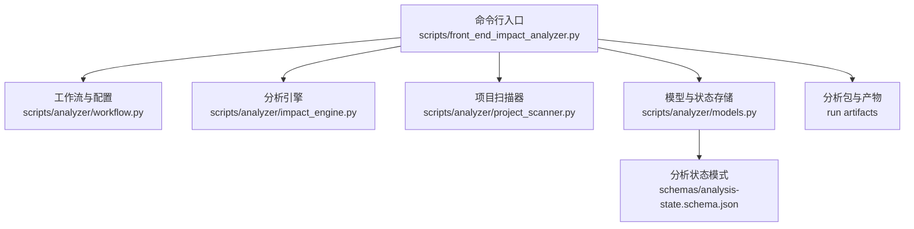
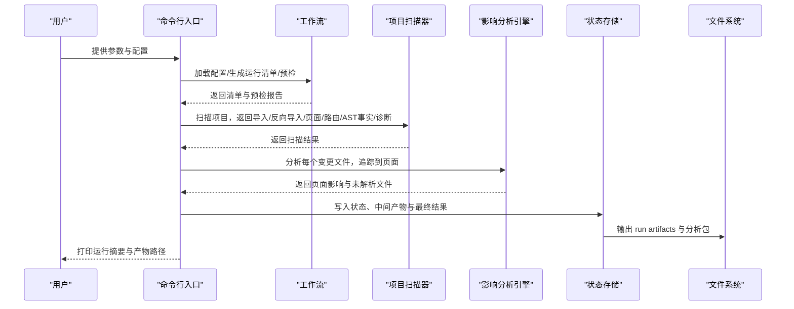
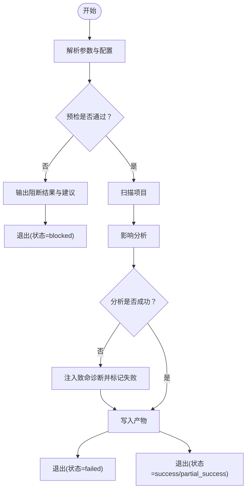
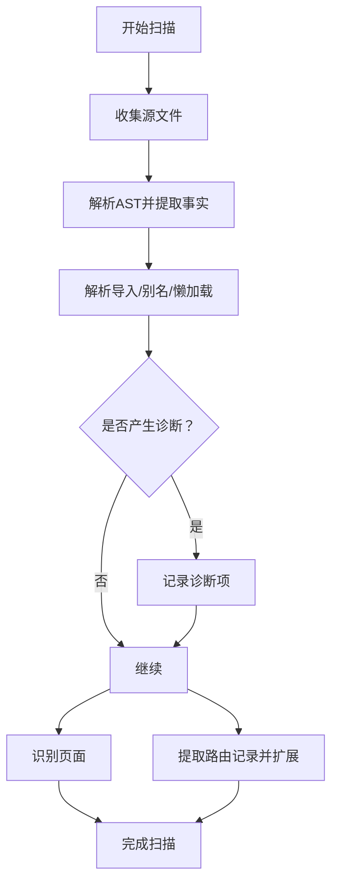
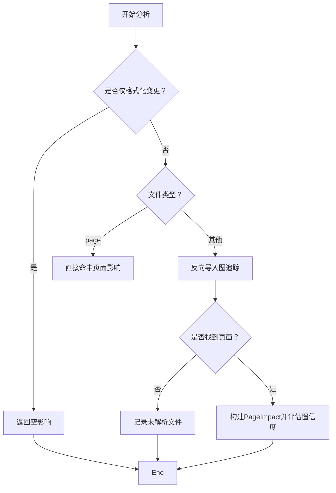
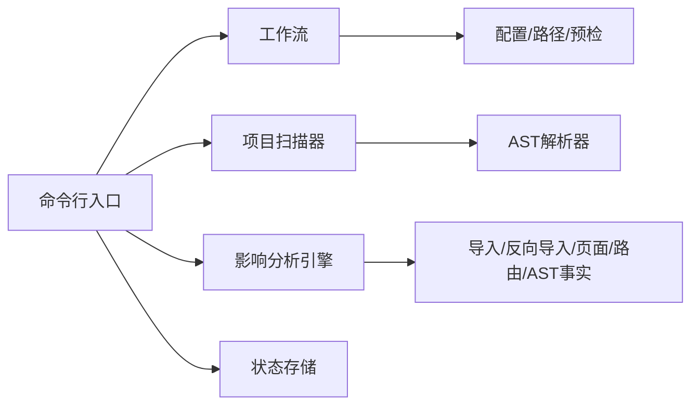

# 故障排除指南

<cite>
**本文引用的文件**
- [脚本入口与引擎](file://scripts/front_end_impact_analyzer.py)
- [工作流与配置](file://scripts/analyzer/workflow.py)
- [项目扫描器](file://scripts/analyzer/project_scanner.py)
- [影响分析引擎](file://scripts/analyzer/impact_engine.py)
- [模型与状态存储](file://scripts/analyzer/models.py)
- [分析状态模式](file://schemas/analysis-state.schema.json)
- [案例数组模式](file://schemas/case-array.schema.json)
- [影响规则](file://references/impact-rules.md)
- [代理使用说明](file://references/agent-usage.md)
- [测试：影响引擎](file://tests/test_impact_engine.py)
- [测试：项目扫描器](file://tests/test_project_scanner.py)
- [示例应用路由](file://fixtures/sample_app/src/routes/index.tsx)
</cite>

## 目录
1. [简介](#简介)
2. [项目结构](#项目结构)
3. [核心组件](#核心组件)
4. [架构总览](#架构总览)
5. [详细组件分析](#详细组件分析)
6. [依赖关系分析](#依赖关系分析)
7. [性能考量](#性能考量)
8. [故障排除指南](#故障排除指南)
9. [结论](#结论)
10. [附录](#附录)

## 简介
本指南面向使用前端影响分析器（React/React Router/Vite）进行变更影响追踪的工程师与质量保障人员。内容覆盖常见问题定位、性能优化、集成错误排查、诊断信息与状态文件解读（unresolvedFiles、diagnostics、sharedRisks），以及系统化的诊断流程与最佳实践。同时提供针对复杂路由、动态导入、第三方库集成等场景的处理建议，以及如何收集与上报问题。

## 项目结构
该工具以命令行入口为核心，通过工作流模块加载配置、生成运行清单、执行预检；随后由分析引擎扫描项目、构建代码图谱、追踪变更到页面、聚类并输出分析包与中间产物。状态与结果遵循 JSON Schema 校验，便于下游工具消费。

图表来源
- [脚本入口与引擎:23-186](file://scripts/front_end_impact_analyzer.py#L23-L186)
- [工作流与配置:65-102](file://scripts/analyzer/workflow.py#L65-L102)
- [项目扫描器:13-80](file://scripts/analyzer/project_scanner.py#L13-L80)
- [影响分析引擎:10-25](file://scripts/analyzer/impact_engine.py#L10-L25)
- [模型与状态存储:115-201](file://scripts/analyzer/models.py#L115-L201)
- [分析状态模式:1-238](file://schemas/analysis-state.schema.json#L1-L238)

章节来源
- [脚本入口与引擎:23-186](file://scripts/front_end_impact_analyzer.py#L23-L186)
- [工作流与配置:65-102](file://scripts/analyzer/workflow.py#L65-L102)

## 核心组件
- 命令行入口与主流程：负责参数解析、预检、运行目录准备、状态记录、异常捕获与产物写入。
- 工作流与配置：默认配置、路径解析、运行清单生成、预检与环境自检、diff生成、Claude子代理安装。
- 项目扫描器：遍历源码、解析AST、提取导入/导出/重导出/懒加载、识别页面与路由、收集诊断信息。
- 影响分析引擎：基于反向依赖图与符号传播，从变更文件追踪到页面，计算置信度与语义标签。
- 模型与状态存储：统一的状态结构、过程日志、数据持久化接口。
- JSON Schema：对分析状态与案例数组进行结构约束，确保输出一致性。

章节来源
- [脚本入口与引擎:23-186](file://scripts/front_end_impact_analyzer.py#L23-L186)
- [工作流与配置:65-102](file://scripts/analyzer/workflow.py#L65-L102)
- [项目扫描器:13-80](file://scripts/analyzer/project_scanner.py#L13-L80)
- [影响分析引擎:10-25](file://scripts/analyzer/impact_engine.py#L10-L25)
- [模型与状态存储:115-201](file://scripts/analyzer/models.py#L115-L201)
- [分析状态模式:1-238](file://schemas/analysis-state.schema.json#L1-L238)
- [案例数组模式:1-51](file://schemas/case-array.schema.json#L1-L51)

## 架构总览
下图展示从命令行到最终产物的关键交互与数据流。

图表来源
- [脚本入口与引擎:56-160](file://scripts/front_end_impact_analyzer.py#L56-L160)
- [工作流与配置:80-102](file://scripts/analyzer/workflow.py#L80-L102)
- [项目扫描器:20-80](file://scripts/analyzer/project_scanner.py#L20-L80)
- [影响分析引擎:26-58](file://scripts/analyzer/impact_engine.py#L26-L58)
- [模型与状态存储:171-201](file://scripts/analyzer/models.py#L171-L201)

## 详细组件分析

### 组件A：命令行入口与主流程
- 职责：解析参数、加载配置、生成运行清单、执行预检、运行分析、写入产物、异常兜底。
- 关键点：
  - 预检阻塞时直接输出阻断结果与下一步建议。
  - 异常捕获后注入致命诊断，设置状态为失败。
  - 运行成功时输出 run artifacts 与最终分析包。
- 常见问题：
  - 缺少 diff 文件或未启用自动 diff 生成。
  - 预检阻断（缺少 wiki/需求/规范目录）。
  - 依赖缺失导致运行失败。

图表来源
- [脚本入口与引擎:239-398](file://scripts/front_end_impact_analyzer.py#L239-L398)
- [工作流与配置:105-134](file://scripts/analyzer/workflow.py#L105-L134)

章节来源
- [脚本入口与引擎:239-398](file://scripts/front_end_impact_analyzer.py#L239-L398)
- [工作流与配置:105-134](file://scripts/analyzer/workflow.py#L105-L134)

### 组件B：项目扫描器
- 职责：遍历源文件、解析 AST、提取导入/导出/重导出/懒加载、识别页面与路由、收集诊断。
- 关键诊断类型：
  - 无法解析的导入（unresolved-import）。
  - 路由绑定不到页面（unbound-route）。
- 复杂场景：
  - 动态导入与懒加载路由。
  - 别名解析与多目标别名。
  - barrel 文件与多跳依赖。

图表来源
- [项目扫描器:20-80](file://scripts/analyzer/project_scanner.py#L20-L80)
- [项目扫描器:128-227](file://scripts/analyzer/project_scanner.py#L128-L227)

章节来源
- [项目扫描器:20-80](file://scripts/analyzer/project_scanner.py#L20-L80)
- [项目扫描器:128-227](file://scripts/analyzer/project_scanner.py#L128-L227)

### 组件C：影响分析引擎
- 职责：基于反向导入图与符号传播，从变更文件追踪到页面，生成 PageImpact 并评估置信度。
- 关键逻辑：
  - 忽略格式化变更。
  - 页面文件直接命中。
  - 符号匹配与严格/宽松传播策略。
  - 置信度与语义标签融合。
- 常见问题：
  - 变更文件无法反向追踪到页面，返回未解析文件。
  - 共享组件变更影响面广但需人工验证。

图表来源
- [影响分析引擎:26-58](file://scripts/analyzer/impact_engine.py#L26-L58)
- [影响分析引擎:77-105](file://scripts/analyzer/impact_engine.py#L77-L105)
- [影响规则:3-6](file://references/impact-rules.md#L3-L6)

章节来源
- [影响分析引擎:26-58](file://scripts/analyzer/impact_engine.py#L26-L58)
- [影响规则:3-6](file://references/impact-rules.md#L3-L6)

### 组件D：状态与产物
- AnalysisState 结构：meta/input/parsedDiff/codeGraph/codeImpact/candidateImpact/businessImpact/workflow/output/processLogs。
- 关键字段解读：
  - codeGraph.diagnostics：诊断集合，包含 unresolved-import、unbound-route 等。
  - codeImpact.unresolvedFiles：无法追踪到页面的变更文件。
  - codeImpact.sharedRisks：共享组件变更的风险提示。
  - workflow.coverage/warnings：覆盖率与警告。
- 产物文件：
  - run artifacts：00-99 系列 JSON 与 Markdown。
  - 分析包：clusters、summary、cases 等。

章节来源
- [模型与状态存储:115-201](file://scripts/analyzer/models.py#L115-L201)
- [分析状态模式:19-236](file://schemas/analysis-state.schema.json#L19-L236)
- [代理使用说明:83-126](file://references/agent-usage.md#L83-L126)

## 依赖关系分析
- 外部依赖：tree-sitter、tree-sitter-typescript。
- 运行时依赖：uv、Python 3.12+。
- 内部模块耦合：
  - 命令行入口依赖工作流、扫描器、分析引擎、状态存储。
  - 扫描器依赖 AST 解析器与通用工具。
  - 影响引擎依赖导入/反向导入、页面集、路由集、AST 事实。

图表来源
- [脚本入口与引擎:9-20](file://scripts/front_end_impact_analyzer.py#L9-L20)
- [工作流与配置:65-102](file://scripts/analyzer/workflow.py#L65-L102)
- [项目扫描器:13-18](file://scripts/analyzer/project_scanner.py#L13-L18)
- [影响分析引擎:10-17](file://scripts/analyzer/impact_engine.py#L10-L17)

章节来源
- [脚本入口与引擎:9-20](file://scripts/front_end_impact_analyzer.py#L9-L20)
- [工作流与配置:65-102](file://scripts/analyzer/workflow.py#L65-L102)

## 性能考量
- 大型项目扫描成本高，建议：
  - 合理设置忽略目录/文件/通配，减少扫描范围。
  - 控制最大聚簇深度与上下文大小，避免内存压力。
  - 使用 diff 限定分析范围，优先分析需要深挖的聚簇。
- 符号传播与反向导入图规模影响追踪效率，建议：
  - 清晰的模块边界与命名，减少模糊匹配。
  - 避免过度使用通配符与动态导入，必要时在路由中显式声明组件。

## 故障排除指南

### 一、基本检查与环境自检
- 使用 doctor 检查：
  - uv、Python 版本、tree-sitter、技能根目录、git 工作树。
  - 若缺失，按推荐命令修复并重试。
- 使用预检：
  - 检查 repo-wiki、requirements、specs 目录是否存在与是否必需。
  - 阻断项会给出明确的“创建/生成”建议。

章节来源
- [工作流与配置:137-189](file://scripts/analyzer/workflow.py#L137-L189)
- [工作流与配置:105-134](file://scripts/analyzer/workflow.py#L105-L134)

### 二、diff 与运行目录问题
- 必须提供 diff 文件或使用 --make-diff 自动生成。
- 运行目录不存在时自动创建；若被阻断，先解决阻断项再运行。
- 输出目录可通过配置覆盖。

章节来源
- [脚本入口与引擎:297-359](file://scripts/front_end_impact_analyzer.py#L297-L359)
- [工作流与配置:214-219](file://scripts/analyzer/workflow.py#L214-L219)

### 三、诊断信息与状态文件解读
- codeGraph.diagnostics
  - unresolved-import：导入目标无法解析，检查别名、相对路径与文件存在性。
  - unbound-route：路由无法绑定到页面，检查路由定义、组件名与可达性。
- codeImpact.unresolvedFiles
  - 表示无法从变更文件追踪到页面的文件，需人工确认或补充依赖。
- codeImpact.sharedRisks
  - 共享组件变更提示，需结合实际 trace 与语义验证。
- workflow.coverage/warnings
  - 覆盖率报告说明哪些文件被深入分析、浅层分析或跳过。

章节来源
- [项目扫描器:44-50](file://scripts/analyzer/project_scanner.py#L44-L50)
- [项目扫描器:193-199](file://scripts/analyzer/project_scanner.py#L193-L199)
- [脚本入口与引擎:95-103](file://scripts/front_end_impact_analyzer.py#L95-L103)
- [代理使用说明:89-101](file://references/agent-usage.md#L89-L101)

### 四、系统化诊断流程
- 第一步：doctor 与 preflight
  - 确认环境与依赖满足。
  - 按阻断项逐项补齐。
- 第二步：生成 diff
  - 使用 --make-diff 或提供 diff 文件。
  - 检查忽略目录/文件是否合理。
- 第三步：运行分析
  - 观察状态摘要与 run artifacts。
  - 若为 partial_success，重点关注 unresolvedFiles、diagnostics、sharedRisks、coverage.warnings。
- 第四步：Claude 聚簇分析
  - 读取 05-change-clusters.json 与 06-cluster-analysis-tasks.md。
  - 对 needsDeepAnalysis 的聚簇逐一分析并写入 cluster-analysis/*.analysis.json。
  - 合并后得到最终 cases。
- 第五步：合并与验证
  - 使用 --merge-cluster-analysis 生成最终结果。
  - 如有 validationReports，按建议修正。

章节来源
- [脚本入口与引擎:239-398](file://scripts/front_end_impact_analyzer.py#L239-L398)
- [代理使用说明:36-126](file://references/agent-usage.md#L36-L126)

### 五、特定场景处理

#### 场景A：复杂路由与嵌套路由
- 现象：路由路径拼接、嵌套子路由、display_name 来源多样。
- 处理：
  - 检查路由对象中的 path、element/component/lazy/children 字段。
  - 确保组件名与导出一致，避免通配符导致的模糊匹配。
  - 通过注释与 meta.title 提升显示名准确性。

章节来源
- [项目扫描器:128-227](file://scripts/analyzer/project_scanner.py#L128-L227)
- [示例应用路由:4-19](file://fixtures/sample_app/src/routes/index.tsx#L4-L19)

#### 场景B：动态导入与懒加载
- 现象：路由中使用 import(...) 懒加载，可能造成未绑定路由。
- 处理：
  - 确保懒加载路径可解析且指向有效页面。
  - 在路由记录中显式声明组件名或使用稳定别名。

章节来源
- [项目扫描器:138-142](file://scripts/analyzer/project_scanner.py#L138-L142)
- [项目扫描器:320-321](file://scripts/analyzer/project_scanner.py#L320-L321)

#### 场景C：第三方库与别名解析
- 现象：别名映射不生效或多目标别名导致歧义。
- 处理：
  - 校验 tsconfig 中的 baseUrl/path 映射。
  - 对多目标别名，确保解析候选唯一或显式指定。

章节来源
- [项目扫描器:93-103](file://scripts/analyzer/project_scanner.py#L93-L103)
- [测试：项目扫描器:36-46](file://tests/test_project_scanner.py#L36-L46)

#### 场景D：共享组件与全局变更
- 现象：共享组件变更影响多个页面，置信度中低。
- 处理：
  - 依据 sharedRisks 与实际 trace 评估风险。
  - 优先验证高频页面与关键功能。

章节来源
- [脚本入口与引擎:96-103](file://scripts/front_end_impact_analyzer.py#L96-L103)
- [影响规则:3-6](file://references/impact-rules.md#L3-L6)

### 六、错误与异常说明
- fatal-error：顶层异常被捕获后注入致命诊断，状态标记为 failed。
- unresolved-import/unbound-route：扫描阶段产生的诊断，需修复依赖或路由定义。
- blocked：预检阻断，需先创建/生成所需文档或满足前置条件。

章节来源
- [脚本入口与引擎:367-382](file://scripts/front_end_impact_analyzer.py#L367-L382)
- [项目扫描器:44-50](file://scripts/analyzer/project_scanner.py#L44-L50)
- [项目扫描器:193-199](file://scripts/analyzer/project_scanner.py#L193-L199)
- [脚本入口与引擎:315-359](file://scripts/front_end_impact_analyzer.py#L315-L359)

### 七、预防性措施与最佳实践
- 保持清晰的模块边界与稳定的导出/组件命名。
- 路由定义中尽量显式声明组件名与显示标题，减少注释依赖。
- 合理使用别名，避免多目标歧义；必要时固定解析顺序。
- 将共享组件变更纳入变更评审，配合 sharedRisks 进行风险评估。
- 定期运行 doctor 与 preflight，确保环境与文档齐备。

### 八、如何收集与报告问题
- 收集信息：
  - 运行清单（00-run-manifest.json）。
  - 预检报告（01-preflight-report.json）。
  - 分析状态（98-analysis-state.json）。
  - 最终结果（99-final-result.json）。
  - 未解析文件与诊断（codeImpact.unresolvedFiles 与 codeGraph.diagnostics）。
  - 聚簇与上下文（05-change-clusters.json、cluster-context/*.json）。
- 报告渠道：
  - 在仓库提交 issue，附带上述文件与最小复现 diff。
  - 描述环境（Python 版本、uv、tree-sitter 版本）、项目类型与路由/导入结构特征。

章节来源
- [脚本入口与引擎:162-174](file://scripts/front_end_impact_analyzer.py#L162-L174)
- [代理使用说明:8-14](file://references/agent-usage.md#L8-L14)

## 结论
通过 doctor 与 preflight 的前置校验、合理的 diff 与忽略策略、对诊断信息的系统化解读，以及对复杂路由与动态导入的针对性处理，可以显著提升分析成功率与质量。遇到失败或部分成功时，优先关注 unresolvedFiles、diagnostics 与 sharedRisks，并结合聚簇上下文进行人工验证与合并，最终形成可靠的测试用例集合。

## 附录

### A. 关键字段速查
- meta.analysisStatus：running/success/partial_success/failed
- codeGraph.diagnostics：unresolved-import、unbound-route 等
- codeImpact.unresolvedFiles：无法追踪到页面的文件
- codeImpact.sharedRisks：共享组件变更风险提示
- workflow.coverage：覆盖率与警告
- output.clusters：聚簇概要与分析任务

章节来源
- [分析状态模式:34-52](file://schemas/analysis-state.schema.json#L34-L52)
- [脚本入口与引擎:95-103](file://scripts/front_end_impact_analyzer.py#L95-L103)
- [代理使用说明:89-101](file://references/agent-usage.md#L89-L101)

### B. 常见测试用例参考
- 共享组件变更到页面的追踪。
- 符号传播在首跳的过滤。
- 格式化变更的跳过。

章节来源
- [测试：影响引擎:11-85](file://tests/test_impact_engine.py#L11-L85)
- [测试：项目扫描器:8-79](file://tests/test_project_scanner.py#L8-L79)