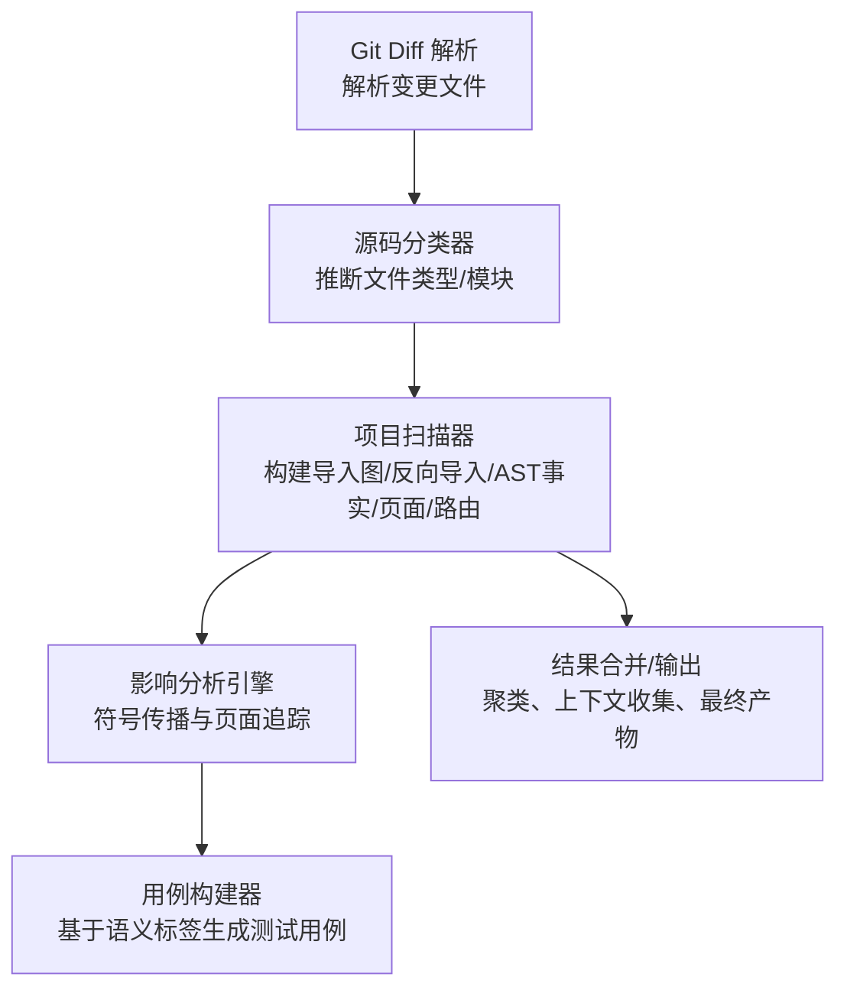
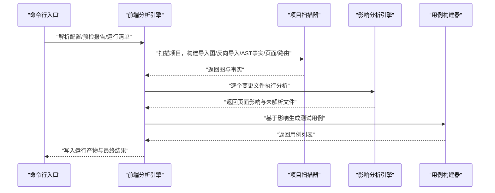
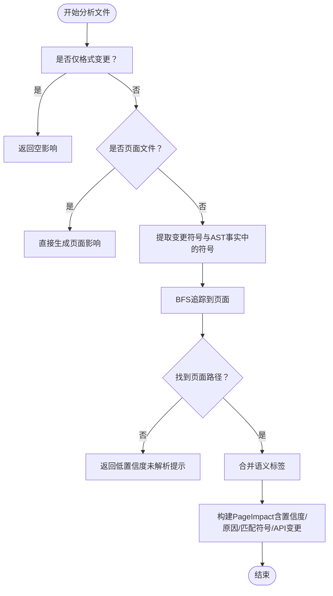
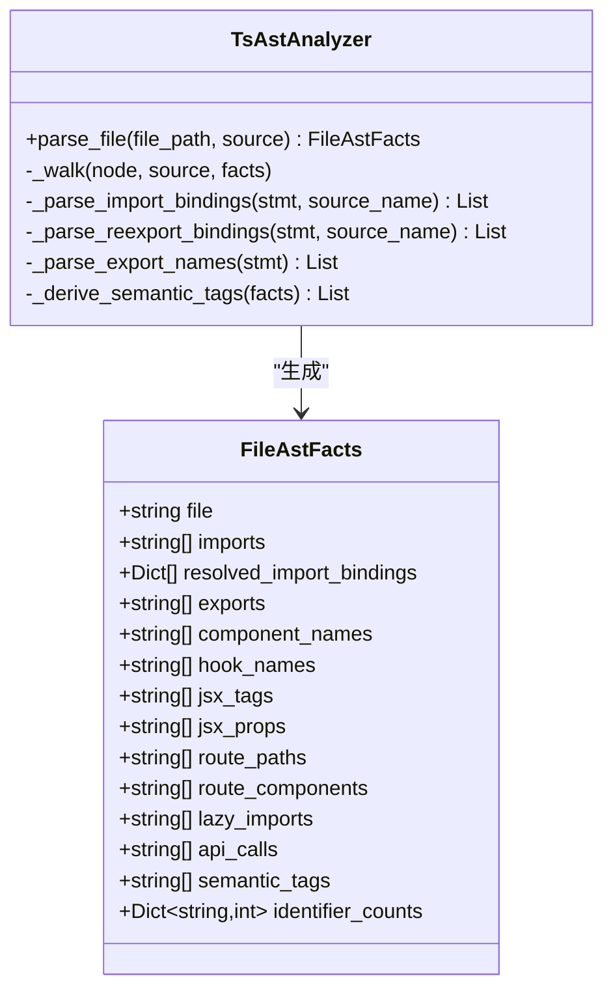
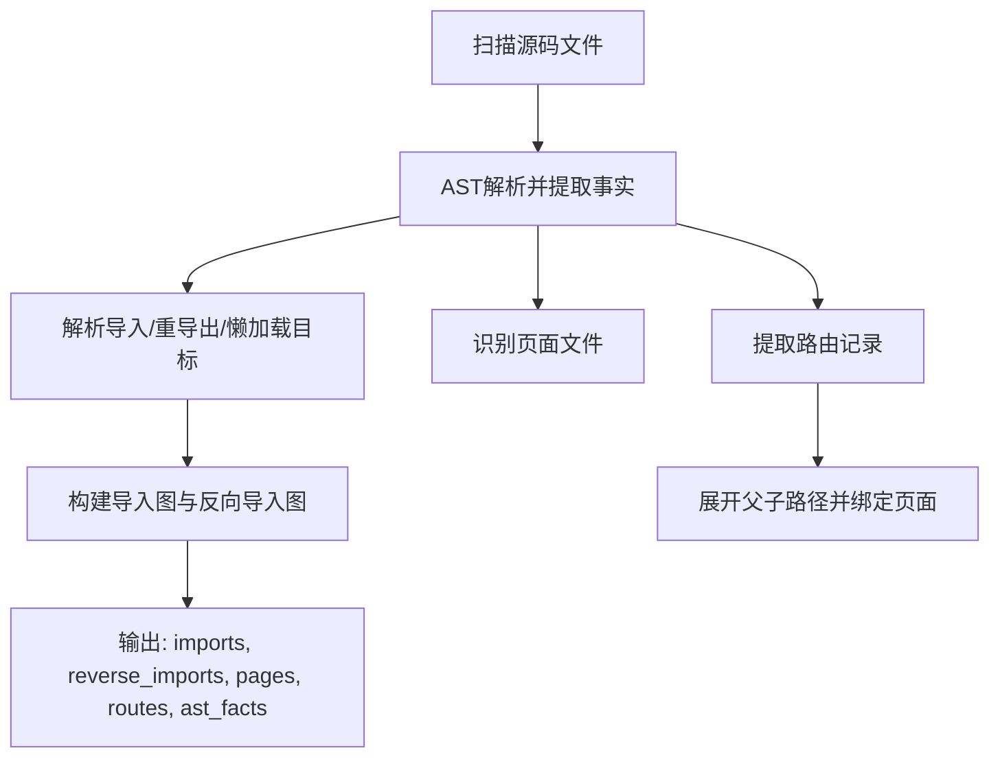
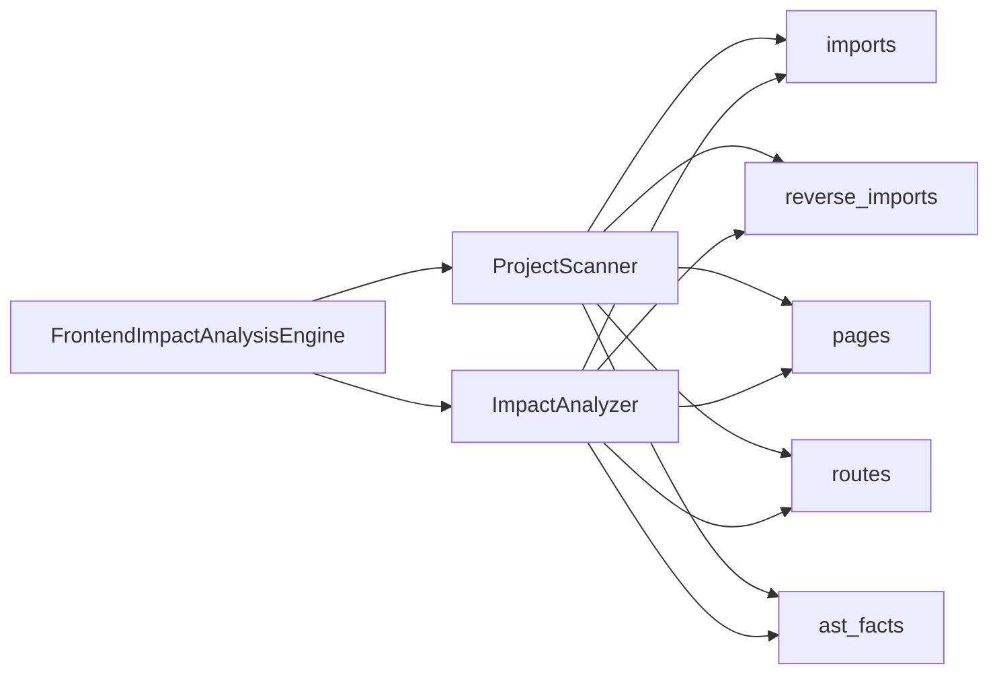

# 自定义分析规则

<cite>
**本文引用的文件**
- [scripts/analyzer/impact_engine.py](file://scripts/analyzer/impact_engine.py)
- [scripts/analyzer/models.py](file://scripts/analyzer/models.py)
- [references/impact-rules.md](file://references/impact-rules.md)
- [references/route-conventions.md](file://references/route-conventions.md)
- [scripts/analyzer/common.py](file://scripts/analyzer/common.py)
- [scripts/analyzer/case_builder.py](file://scripts/analyzer/case_builder.py)
- [scripts/analyzer/ast_analyzer.py](file://scripts/analyzer/ast_analyzer.py)
- [scripts/analyzer/project_scanner.py](file://scripts/analyzer/project_scanner.py)
- [scripts/analyzer/source_classifier.py](file://scripts/analyzer/source_classifier.py)
- [scripts/front_end_impact_analyzer.py](file://scripts/front_end_impact_analyzer.py)
- [tests/test_impact_engine.py](file://tests/test_impact_engine.py)
- [pyproject.toml](file://pyproject.toml)
</cite>

## 目录
1. [简介](#简介)
2. [项目结构](#项目结构)
3. [核心组件](#核心组件)
4. [架构总览](#架构总览)
5. [详细组件分析](#详细组件分析)
6. [依赖分析](#依赖分析)
7. [性能考量](#性能考量)
8. [故障排查指南](#故障排查指南)
9. [结论](#结论)
10. [附录](#附录)

## 简介
本指南面向需要扩展“前端影响分析器”的工程师，系统讲解如何在现有分析引擎中添加自定义分析规则与约束条件。文档覆盖以下主题：
- 规则配置格式与优先级设置
- 冲突处理机制
- 符号传播规则、页面识别规则、路由绑定规则的扩展方法
- 规则执行顺序与性能影响
- 最佳实践：在不破坏既有功能的前提下集成新规则
- 调试与测试自定义规则的方法

## 项目结构
该分析器采用分层设计：扫描层负责构建代码图（导入关系、AST事实、页面与路由），引擎层负责从变更文件追踪到页面并生成影响，最后由用例构建器将语义标签映射为测试用例模板。

图表来源
- [scripts/front_end_impact_analyzer.py:56-160](file://scripts/front_end_impact_analyzer.py#L56-L160)
- [scripts/analyzer/project_scanner.py:20-80](file://scripts/analyzer/project_scanner.py#L20-L80)
- [scripts/analyzer/impact_engine.py:26-58](file://scripts/analyzer/impact_engine.py#L26-L58)
- [scripts/analyzer/case_builder.py:15-21](file://scripts/analyzer/case_builder.py#L15-L21)

章节来源
- [scripts/front_end_impact_analyzer.py:56-160](file://scripts/front_end_impact_analyzer.py#L56-L160)

## 核心组件
- 影响分析引擎：负责从变更文件出发，通过反向导入图进行符号传播，识别可达页面并计算置信度与原因。
- AST分析器：解析TS/TSX文件，提取导入导出、组件名、Hook名、JSX标签与属性、路由对象、懒加载等信息，并派生语义标签。
- 项目扫描器：扫描源码，建立导入/反向导入图、页面集合、路由信息、AST事实字典，并进行路由到页面的绑定。
- 源码分类器：根据路径与文件名推断文件类型（页面、路由、业务组件、共享组件、API、Store、Hooks、工具、样式、配置/模式）。
- 用例构建器：将页面影响与语义标签映射为测试用例模板，支持优先级排序与去重。
- 数据模型：统一承载 ChangedFile、RouteInfo、PageImpact、TestCase、AnalysisState 等结构化数据。

章节来源
- [scripts/analyzer/impact_engine.py:10-188](file://scripts/analyzer/impact_engine.py#L10-L188)
- [scripts/analyzer/ast_analyzer.py:13-242](file://scripts/analyzer/ast_analyzer.py#L13-L242)
- [scripts/analyzer/project_scanner.py:13-383](file://scripts/analyzer/project_scanner.py#L13-L383)
- [scripts/analyzer/source_classifier.py:6-36](file://scripts/analyzer/source_classifier.py#L6-L36)
- [scripts/analyzer/case_builder.py:15-228](file://scripts/analyzer/case_builder.py#L15-L228)
- [scripts/analyzer/models.py:26-201](file://scripts/analyzer/models.py#L26-L201)

## 架构总览
影响分析的主流程如下：

图表来源
- [scripts/front_end_impact_analyzer.py:56-160](file://scripts/front_end_impact_analyzer.py#L56-L160)
- [scripts/analyzer/impact_engine.py:26-58](file://scripts/analyzer/impact_engine.py#L26-L58)
- [scripts/analyzer/case_builder.py:15-21](file://scripts/analyzer/case_builder.py#L15-L21)

## 详细组件分析

### 影响分析引擎（扩展点）
影响分析引擎是规则扩展的核心位置，涉及符号传播、页面追踪、置信度与原因计算等逻辑。要添加自定义规则，通常需要在以下方法中注入新逻辑：
- 符号传播与匹配：在符号传播阶段决定哪些符号能传递到父模块，以及是否严格匹配。
- 页面追踪：在 BFS 追踪过程中加入新的约束或启发式。
- 置信度与原因：在置信度与原因字符串中体现新规则的影响。

图表来源
- [scripts/analyzer/impact_engine.py:26-58](file://scripts/analyzer/impact_engine.py#L26-L58)
- [scripts/analyzer/impact_engine.py:77-105](file://scripts/analyzer/impact_engine.py#L77-L105)
- [scripts/analyzer/impact_engine.py:168-187](file://scripts/analyzer/impact_engine.py#L168-L187)

章节来源
- [scripts/analyzer/impact_engine.py:26-187](file://scripts/analyzer/impact_engine.py#L26-L187)

### AST分析器（扩展点：符号与语义标签）
AST分析器负责从源码中抽取导入/导出、组件/Hook名、JSX标签与属性、路由对象、懒加载、API调用等，并派生语义标签。这是“符号传播规则”和“页面识别规则”的基础来源。

- 导入/导出/重导出绑定：用于构建符号传播的“绑定矩阵”，决定符号能否沿导入链传递。
- 组件/Hook识别：用于页面识别与符号传播的“活跃符号”集合。
- JSX标签/属性：用于识别页面特征（如存在表单/表格/按钮等）。
- 路由对象：用于“路由绑定规则”的识别与展开。
- API调用：用于识别API相关语义标签（列表查询/详情/提交/删除等）。

图表来源
- [scripts/analyzer/ast_analyzer.py:13-242](file://scripts/analyzer/ast_analyzer.py#L13-L242)
- [scripts/analyzer/models.py:55-75](file://scripts/analyzer/models.py#L55-L75)

章节来源
- [scripts/analyzer/ast_analyzer.py:13-242](file://scripts/analyzer/ast_analyzer.py#L13-L242)
- [scripts/analyzer/models.py:55-75](file://scripts/analyzer/models.py#L55-L75)

### 项目扫描器（扩展点：页面识别与路由绑定）
项目扫描器负责：
- 扫描源码，建立导入/反向导入图
- 提取AST事实并写入字典
- 识别页面文件（基于路径与AST事实）
- 解析路由对象，展开父子路径，绑定路由到页面

图表来源
- [scripts/analyzer/project_scanner.py:20-80](file://scripts/analyzer/project_scanner.py#L20-L80)
- [scripts/analyzer/project_scanner.py:128-227](file://scripts/analyzer/project_scanner.py#L128-L227)

章节来源
- [scripts/analyzer/project_scanner.py:13-383](file://scripts/analyzer/project_scanner.py#L13-L383)

### 源码分类器（扩展点：文件类型与模块名）
源码分类器用于推断文件类型与模块名，影响后续的置信度与模块聚合。你可以在此处增加新的分类规则以影响引擎行为。

章节来源
- [scripts/analyzer/source_classifier.py:6-36](file://scripts/analyzer/source_classifier.py#L6-L36)

### 用例构建器（扩展点：语义标签到测试用例）
用例构建器将 PageImpact 的语义标签映射为测试用例模板，并支持优先级排序与去重。你可以在映射表中新增标签到用例的映射，或调整优先级策略。

章节来源
- [scripts/analyzer/case_builder.py:15-228](file://scripts/analyzer/case_builder.py#L15-L228)

## 依赖分析
- 影响分析引擎依赖于导入/反向导入图、页面集合、路由信息与AST事实字典。
- 项目扫描器依赖AST分析器与TS配置别名解析。
- 前端分析引擎串联上述组件，并将中间状态写入 AnalysisState。

图表来源
- [scripts/analyzer/project_scanner.py:20-80](file://scripts/analyzer/project_scanner.py#L20-L80)
- [scripts/analyzer/impact_engine.py:10-17](file://scripts/analyzer/impact_engine.py#L10-L17)
- [scripts/front_end_impact_analyzer.py:73-95](file://scripts/front_end_impact_analyzer.py#L73-L95)

章节来源
- [scripts/analyzer/project_scanner.py:20-80](file://scripts/analyzer/project_scanner.py#L20-L80)
- [scripts/analyzer/impact_engine.py:10-17](file://scripts/analyzer/impact_engine.py#L10-L17)
- [scripts/front_end_impact_analyzer.py:73-95](file://scripts/front_end_impact_analyzer.py#L73-L95)

## 性能考量
- 符号传播复杂度：BFS遍历反向导入图，时间复杂度近似 O(V+E)，受导入/反向导入图规模影响。
- AST解析：对每个源码文件进行一次解析，复杂度与代码体量线性相关。
- 语义标签派生：在AST解析阶段一次性完成，避免重复计算。
- 去重与排序：在用例构建阶段进行去重与排序，成本与用例数量相关。

优化建议
- 在符号传播阶段尽早剪枝：当活跃符号为空或已到达页面时停止扩展。
- 合理缓存AST事实与导入解析结果，避免重复扫描。
- 控制路由展开深度与范围，减少不必要的节点扩展。
- 将高代价规则延迟到必要时再执行（例如仅在特定文件类型或语义标签下启用）。

[本节为通用性能讨论，无需列出章节来源]

## 故障排查指南
- 无法追踪到页面：检查反向导入图是否正确、页面识别是否准确、符号传播是否被错误过滤。
- 置信度偏低：检查文件类型、路径与语义标签是否合理，必要时调整置信度计算逻辑。
- 路由绑定失败：检查路由对象解析、懒加载目标解析与页面可达性。
- 用例缺失：确认语义标签是否被映射到用例模板，优先级与去重逻辑是否导致被过滤。

章节来源
- [tests/test_impact_engine.py:11-85](file://tests/test_impact_engine.py#L11-L85)
- [scripts/analyzer/impact_engine.py:33-39](file://scripts/analyzer/impact_engine.py#L33-L39)
- [scripts/analyzer/project_scanner.py:193-199](file://scripts/analyzer/project_scanner.py#L193-L199)

## 结论
通过在 AST分析器、项目扫描器与影响分析引擎的关键方法中注入自定义规则，可以有效扩展分析能力。建议遵循“先识别、再传播、后评估”的原则，确保新规则与现有逻辑协同工作，并通过测试用例验证效果与性能。

[本节为总结性内容，无需列出章节来源]

## 附录

### 规则配置格式与优先级设置
- 文件类型与模块名：由源码分类器推断，影响置信度与模块聚合。
- 语义标签：由AST分析器派生，影响用例构建与优先级。
- 置信度：由影响分析引擎根据文件类型、追踪长度与语义标签综合计算。
- 优先级：用例构建器按页面名、排序优先级、置信度等维度排序。

章节来源
- [scripts/analyzer/source_classifier.py:6-36](file://scripts/analyzer/source_classifier.py#L6-L36)
- [scripts/analyzer/ast_analyzer.py:210-242](file://scripts/analyzer/ast_analyzer.py#L210-L242)
- [scripts/analyzer/impact_engine.py:168-187](file://scripts/analyzer/impact_engine.py#L168-L187)
- [scripts/analyzer/case_builder.py:209-227](file://scripts/analyzer/case_builder.py#L209-L227)

### 冲突处理机制
- 符号传播冲突：当同时存在导入绑定与重导出绑定时，优先采用重导出匹配，其次采用导入绑定匹配。
- 页面识别冲突：当多个页面都可达时，优先采用显式绑定（懒加载/组件名匹配），否则回退到唯一可达页面。
- 置信度冲突：若语义标签与文件类型矛盾，以文件类型为主（例如页面/路由变更应获得更高置信度）。

章节来源
- [scripts/analyzer/impact_engine.py:119-162](file://scripts/analyzer/impact_engine.py#L119-L162)
- [scripts/analyzer/project_scanner.py:134-154](file://scripts/analyzer/project_scanner.py#L134-L154)
- [references/impact-rules.md:3-6](file://references/impact-rules.md#L3-L6)

### 具体扩展示例（步骤说明）
以下为添加自定义规则的通用步骤，不包含具体代码内容，请参考相应文件路径定位实现位置：

- 添加符号传播规则
  - 在符号传播方法中增加新的匹配条件，例如仅在特定导入/导出组合下才允许符号传递。
  - 参考路径：[scripts/analyzer/impact_engine.py:119-162](file://scripts/analyzer/impact_engine.py#L119-L162)

- 添加页面识别规则
  - 在页面识别逻辑中增加新的判定条件，例如基于文件名模式或特定注释标记。
  - 参考路径：[scripts/analyzer/project_scanner.py:122-126](file://scripts/analyzer/project_scanner.py#L122-L126)

- 添加路由绑定规则
  - 在路由绑定逻辑中增加新的绑定策略，例如基于注释或约定的显示名。
  - 参考路径：[scripts/analyzer/project_scanner.py:134-154](file://scripts/analyzer/project_scanner.py#L134-L154)、[references/route-conventions.md:7-11](file://references/route-conventions.md#L7-L11)

- 添加语义标签映射
  - 在用例构建器的映射表中新增标签到用例的映射，并设置合适的排序优先级。
  - 参考路径：[scripts/analyzer/case_builder.py:27-64](file://scripts/analyzer/case_builder.py#L27-L64)

- 调整置信度与原因
  - 在置信度与原因计算方法中增加新的分支，结合文件类型、语义标签与追踪长度。
  - 参考路径：[scripts/analyzer/impact_engine.py:168-187](file://scripts/analyzer/impact_engine.py#L168-L187)

- 验证与测试
  - 使用现有测试用例作为基准，新增针对新规则的行为断言。
  - 参考路径：[tests/test_impact_engine.py:11-85](file://tests/test_impact_engine.py#L11-L85)

### 规则执行顺序与性能影响
- 执行顺序
  1) 源码分类器 → 2) 项目扫描器 → 3) 影响分析引擎 → 4) 用例构建器
- 性能影响
  - AST解析与导入解析为O(N)级别，符号传播为BFS，路由展开需控制深度。
  - 建议在AST解析阶段完成尽可能多的派生信息，减少后续重复计算。

章节来源
- [scripts/front_end_impact_analyzer.py:56-160](file://scripts/front_end_impact_analyzer.py#L56-L160)
- [scripts/analyzer/ast_analyzer.py:18-30](file://scripts/analyzer/ast_analyzer.py#L18-L30)
- [scripts/analyzer/project_scanner.py:20-80](file://scripts/analyzer/project_scanner.py#L20-L80)
- [scripts/analyzer/impact_engine.py:77-105](file://scripts/analyzer/impact_engine.py#L77-L105)

### 最佳实践
- 保持规则的原子性与可测试性，尽量通过小步增量方式引入。
- 在置信度与原因中明确体现规则的影响，便于审计与回溯。
- 对高成本规则进行条件化执行，避免对所有文件类型都执行。
- 与既有规则保持兼容，优先采用“增强而非替换”的策略。

[本节为通用最佳实践，无需列出章节来源]

### 依赖与环境
- Python版本要求与依赖声明见项目配置文件。

章节来源
- [pyproject.toml:1-18](file://pyproject.toml#L1-L18)