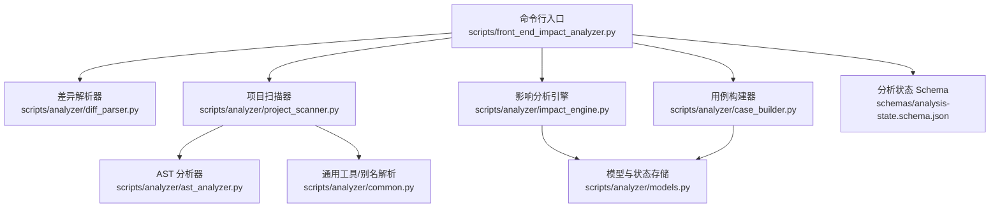
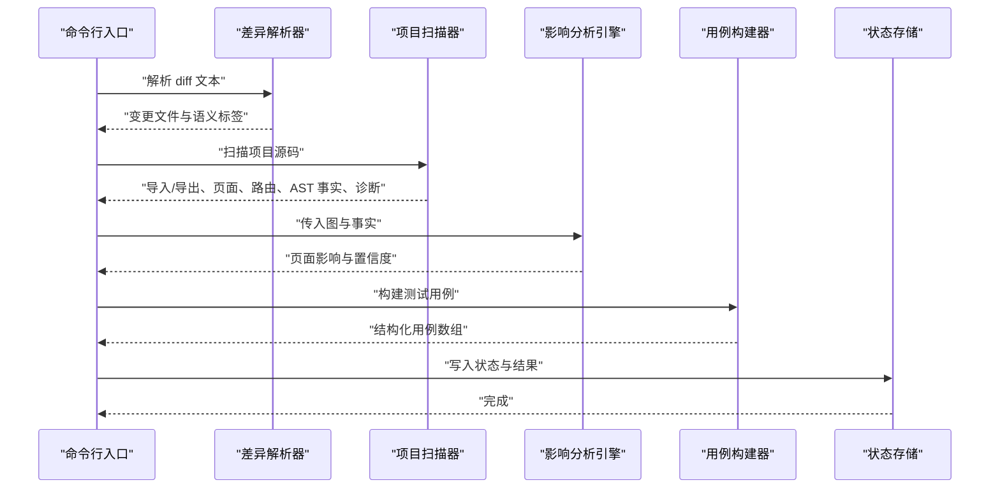
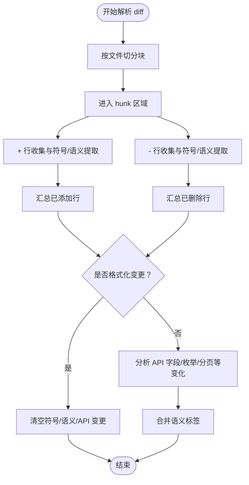
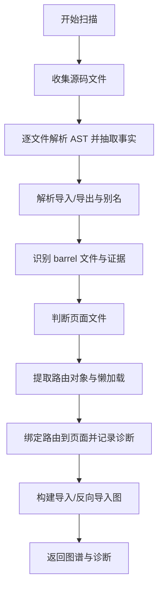
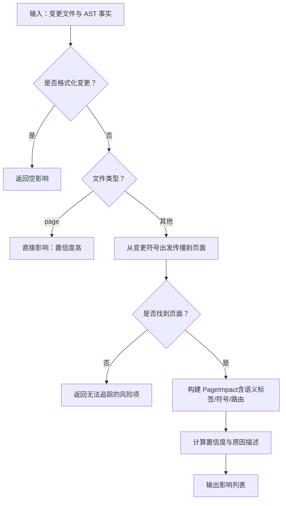
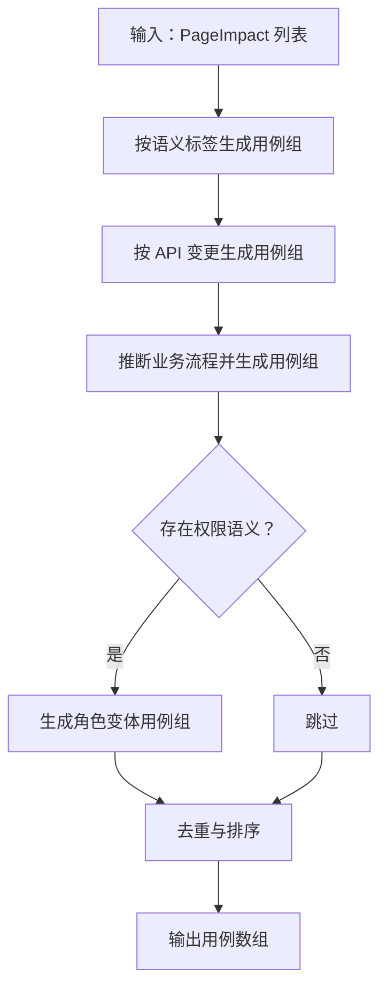
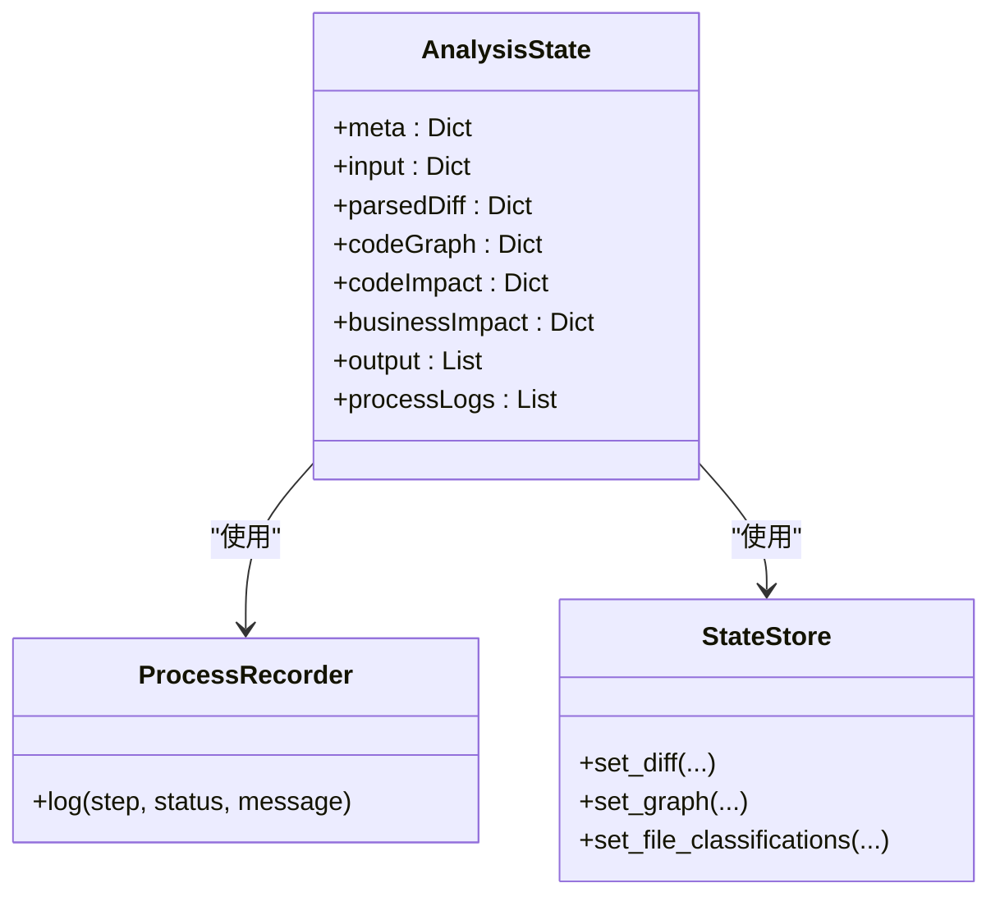
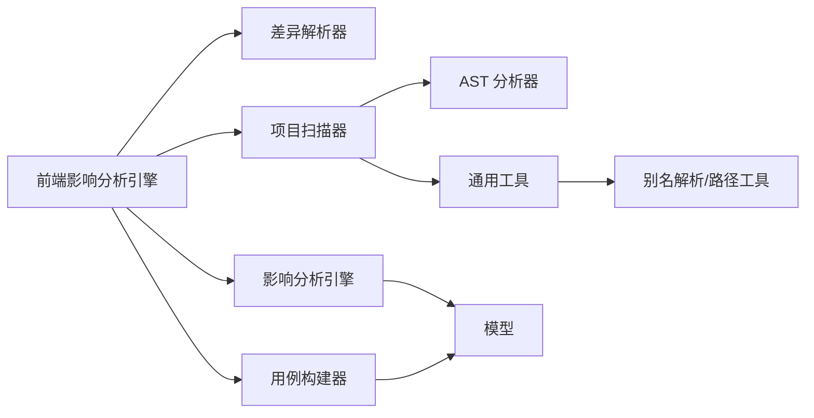

# 高级用法

<cite>
**本文引用的文件**
- [脚本入口与引擎](file://scripts/front_end_impact_analyzer.py)
- [AST 分析器](file://scripts/analyzer/ast_analyzer.py)
- [项目扫描器](file://scripts/analyzer/project_scanner.py)
- [差异解析器](file://scripts/analyzer/diff_parser.py)
- [源码分类器](file://scripts/analyzer/source_classifier.py)
- [影响分析引擎](file://scripts/analyzer/impact_engine.py)
- [用例构建器](file://scripts/analyzer/case_builder.py)
- [模型与状态存储](file://scripts/analyzer/models.py)
- [通用工具与别名解析](file://scripts/analyzer/common.py)
- [分析状态 Schema](file://schemas/analysis-state.schema.json)
- [项目约定](file://references/project-conventions.md)
- [路由约定](file://references/route-conventions.md)
- [影响规则](file://references/impact-rules.md)
- [Agent 使用说明](file://references/agent-usage.md)
- [OpenAI 代理配置](file://agents/openai.yaml)
- [项目配置](file://pyproject.toml)
</cite>

## 目录
1. [简介](#简介)
2. [项目结构](#项目结构)
3. [核心组件](#核心组件)
4. [架构总览](#架构总览)
5. [详细组件分析](#详细组件分析)
6. [依赖关系分析](#依赖关系分析)
7. [性能考量](#性能考量)
8. [故障排除指南](#故障排除指南)
9. [结论](#结论)
10. [附录](#附录)

## 简介
本指南面向高级用户，系统讲解前端影响分析器的高级用法与扩展策略，覆盖以下主题：
- 自定义分析规则的配置与扩展（语义标签、影响置信度、用例模板）
- 代理工具集成最佳实践（含 OpenAI 代理）
- 项目约定与路由约定对分析结果的影响与应对
- 性能优化技巧与大规模项目的处理策略
- 故障排除与常见问题定位
- 扩展工具以支持新前端框架或特殊需求
- 监控与日志配置建议
- CI/CD 集成实施方案

## 项目结构
该工具采用分层设计：命令行入口负责组装分析流程，扫描器与解析器抽取代码图谱，影响引擎进行传播追踪，用例构建器生成测试用例，最终输出结构化结果与诊断。

**图表来源**
- [脚本入口与引擎:18-99](file://scripts/front_end_impact_analyzer.py#L18-L99)
- [差异解析器:10-126](file://scripts/analyzer/diff_parser.py#L10-L126)
- [项目扫描器:13-80](file://scripts/analyzer/project_scanner.py#L13-L80)
- [AST 分析器:13-29](file://scripts/analyzer/ast_analyzer.py#L13-L29)
- [通用工具与别名解析:74-96](file://scripts/analyzer/common.py#L74-L96)
- [模型与状态存储:111-173](file://scripts/analyzer/models.py#L111-L173)
- [分析状态 Schema:1-46](file://schemas/analysis-state.schema.json#L1-L46)

**章节来源**
- [脚本入口与引擎:18-99](file://scripts/front_end_impact_analyzer.py#L18-L99)
- [项目扫描器:13-80](file://scripts/analyzer/project_scanner.py#L13-L80)
- [差异解析器:10-126](file://scripts/analyzer/diff_parser.py#L10-L126)
- [AST 分析器:13-29](file://scripts/analyzer/ast_analyzer.py#L13-L29)
- [通用工具与别名解析:74-96](file://scripts/analyzer/common.py#L74-L96)
- [模型与状态存储:111-173](file://scripts/analyzer/models.py#L111-L173)
- [分析状态 Schema:1-46](file://schemas/analysis-state.schema.json#L1-L46)

## 核心组件
- 命令行入口与引擎：负责解析参数、组织分析流程、记录过程日志与状态、输出结果与诊断。
- 差异解析器：从 Git diff 中提取变更文件、格式化变更判断、语义标签与 API 变更。
- 项目扫描器：遍历源码、解析 AST、建立导入/导出关系、识别页面与路由、解析别名与条目。
- 影响分析引擎：基于反向导入图与路由映射，从变更文件追踪到页面，计算影响类型与置信度。
- 用例构建器：根据语义标签与 API 变更推导业务用例，生成结构化测试用例。
- 模型与状态存储：统一的数据结构、状态持久化与 Schema 校验。
- 通用工具：路径规范化、别名解析、去重、标题生成等。

**章节来源**
- [脚本入口与引擎:18-99](file://scripts/front_end_impact_analyzer.py#L18-L99)
- [差异解析器:10-126](file://scripts/analyzer/diff_parser.py#L10-L126)
- [项目扫描器:13-80](file://scripts/analyzer/project_scanner.py#L13-L80)
- [影响分析引擎:10-58](file://scripts/analyzer/impact_engine.py#L10-L58)
- [用例构建器:10-59](file://scripts/analyzer/case_builder.py#L10-L59)
- [模型与状态存储:111-173](file://scripts/analyzer/models.py#L111-L173)
- [通用工具与别名解析:74-96](file://scripts/analyzer/common.py#L74-L96)

## 架构总览
整体流程为：读取 diff → 解析差异 → 扫描项目 → 建图与诊断 → 影响追踪 → 用例生成 → 输出状态与结果。

**图表来源**
- [脚本入口与引擎:40-99](file://scripts/front_end_impact_analyzer.py#L40-L99)
- [差异解析器:60-126](file://scripts/analyzer/diff_parser.py#L60-L126)
- [项目扫描器:20-80](file://scripts/analyzer/project_scanner.py#L20-L80)
- [影响分析引擎:26-58](file://scripts/analyzer/impact_engine.py#L26-L58)
- [用例构建器:11-15](file://scripts/analyzer/case_builder.py#L11-L15)
- [模型与状态存储:149-173](file://scripts/analyzer/models.py#L149-L173)

## 详细组件分析

### 组件一：差异解析器（GitDiffParser）
- 功能要点
  - 提取变更文件、新增/删除/修改类型
  - 格式化变更快速判定（仅空白/引号变化）
  - 语义标签抽取（按钮、弹窗、表单、表格、路由、权限、API、状态、导航、校验、列表/详情/删除、上传、禁用态等）
  - API 变更分析（请求/响应字段重命名、枚举增删、分页/详情/列表结构变化）
- 关键实现位置
  - 符号与语义模式匹配、API 变更抽取与去重
  - 语义标签到 API 类别的映射
- 扩展建议
  - 在语义模式与 API 变更映射处增加新标签与类别
  - 结合项目约定与路由约定，细化语义识别

**图表来源**
- [差异解析器:60-126](file://scripts/analyzer/diff_parser.py#L60-L126)
- [差异解析器:150-187](file://scripts/analyzer/diff_parser.py#L150-L187)
- [差异解析器:276-288](file://scripts/analyzer/diff_parser.py#L276-L288)

**章节来源**
- [差异解析器:10-126](file://scripts/analyzer/diff_parser.py#L10-L126)
- [差异解析器:150-187](file://scripts/analyzer/diff_parser.py#L150-L187)
- [差异解析器:276-288](file://scripts/analyzer/diff_parser.py#L276-L288)

### 组件二：项目扫描器（ProjectScanner）
- 功能要点
  - 遍历源码文件，解析 AST，抽取导入/导出、组件名、Hook 名、JSX 标签/属性、路由对象、懒加载、API 调用、语义标签
  - 解析别名（tsconfig paths）与 barrel 导出证据
  - 识别页面（基于目录与组件/JSX）
  - 路由绑定：组件名、懒加载、父子路径拼接、未绑定路由诊断
- 关键实现位置
  - 路由记录提取与展开、页面猜测、导入解析候选
  - 别名解析与候选文件探测
- 扩展建议
  - 在别名解析处增加额外约定（如多级别名前缀）
  - 在页面识别处加入更多启发式规则

**图表来源**
- [项目扫描器:20-80](file://scripts/analyzer/project_scanner.py#L20-L80)
- [项目扫描器:128-224](file://scripts/analyzer/project_scanner.py#L128-L224)
- [项目扫描器:93-120](file://scripts/analyzer/project_scanner.py#L93-L120)
- [通用工具与别名解析:74-96](file://scripts/analyzer/common.py#L74-L96)

**章节来源**
- [项目扫描器:13-80](file://scripts/analyzer/project_scanner.py#L13-L80)
- [项目扫描器:128-224](file://scripts/analyzer/project_scanner.py#L128-L224)
- [项目扫描器:93-120](file://scripts/analyzer/project_scanner.py#L93-L120)
- [通用工具与别名解析:74-96](file://scripts/analyzer/common.py#L74-L96)

### 组件三：影响分析引擎（ImpactAnalyzer）
- 功能要点
  - 基于反向导入图与页面集合进行广度优先传播
  - 计算影响类型（直接/间接）、置信度（高/中/低）、原因描述
  - 合并语义标签与匹配符号，生成页面影响
- 关键实现位置
  - 传播与符号传递逻辑（严格/宽松符号）
  - 置信度与原因描述策略
- 扩展建议
  - 在置信度与原因描述中引入更多上下文（如路由绑定强度、trace 长度阈值）

**图表来源**
- [影响分析引擎:26-58](file://scripts/analyzer/impact_engine.py#L26-L58)
- [影响分析引擎:77-105](file://scripts/analyzer/impact_engine.py#L77-L105)
- [影响分析引擎:168-182](file://scripts/analyzer/impact_engine.py#L168-L182)

**章节来源**
- [影响分析引擎:10-58](file://scripts/analyzer/impact_engine.py#L10-L58)
- [影响分析引擎:77-105](file://scripts/analyzer/impact_engine.py#L77-L105)
- [影响分析引擎:168-182](file://scripts/analyzer/impact_engine.py#L168-L182)

### 组件四：用例构建器（TestCaseBuilder）
- 功能要点
  - 基于语义标签与 API 变更推导业务用例
  - 生成基础用例与各类功能用例（按钮、弹窗、表单、表格、API、查询、详情、删除、权限、导航、上传、禁用态）
  - 推断业务主流程（列表/详情/新增/编辑/删除），并生成角色变体
  - 去重与排序（按页面、优先级、置信度）
- 关键实现位置
  - 语义标签到用例模板映射
  - API 变更到用例模板映射
  - 业务流程推断与角色变体
- 扩展建议
  - 新增语义标签与 API 变更类别时，同步增加用例模板与排序优先级

**图表来源**
- [用例构建器:11-59](file://scripts/analyzer/case_builder.py#L11-L59)
- [用例构建器:149-170](file://scripts/analyzer/case_builder.py#L149-L170)
- [用例构建器:204-222](file://scripts/analyzer/case_builder.py#L204-L222)

**章节来源**
- [用例构建器:10-59](file://scripts/analyzer/case_builder.py#L10-L59)
- [用例构建器:149-170](file://scripts/analyzer/case_builder.py#L149-L170)
- [用例构建器:204-222](file://scripts/analyzer/case_builder.py#L204-L222)

### 组件五：模型与状态存储（AnalysisState/ProcessRecorder/StateStore）
- 功能要点
  - 统一的状态结构（meta/input/parsedDiff/codeGraph/codeImpact/businessImpact/output/processLogs）
  - 过程日志记录与状态持久化
  - Schema 校验（分析状态与用例数组）
- 关键实现位置
  - 状态字段与默认值
  - 日志记录与状态写入

**图表来源**
- [模型与状态存储:111-173](file://scripts/analyzer/models.py#L111-L173)
- [分析状态 Schema:1-46](file://schemas/analysis-state.schema.json#L1-L46)

**章节来源**
- [模型与状态存储:111-173](file://scripts/analyzer/models.py#L111-L173)
- [分析状态 Schema:1-46](file://schemas/analysis-state.schema.json#L1-L46)

## 依赖关系分析
- 组件耦合
  - 命令行入口依赖解析器、扫描器、引擎、构建器与状态存储
  - 扫描器依赖 AST 分析器与通用工具
  - 引擎依赖模型与通用工具
  - 构建器依赖模型与通用工具
- 外部依赖
  - Tree-sitter 语言库用于 TS/TSX 解析
  - Python 版本要求与开发依赖

**图表来源**
- [脚本入口与引擎:9-15](file://scripts/front_end_impact_analyzer.py#L9-L15)
- [项目扫描器:8-18](file://scripts/analyzer/project_scanner.py#L8-L18)
- [AST 分析器:6-9](file://scripts/analyzer/ast_analyzer.py#L6-L9)
- [通用工具与别名解析:74-96](file://scripts/analyzer/common.py#L74-L96)
- [模型与状态存储:111-173](file://scripts/analyzer/models.py#L111-L173)

**章节来源**
- [脚本入口与引擎:9-15](file://scripts/front_end_impact_analyzer.py#L9-L15)
- [项目扫描器:8-18](file://scripts/analyzer/project_scanner.py#L8-L18)
- [AST 分析器:6-9](file://scripts/analyzer/ast_analyzer.py#L6-L9)
- [通用工具与别名解析:74-96](file://scripts/analyzer/common.py#L74-L96)
- [模型与状态存储:111-173](file://scripts/analyzer/models.py#L111-L173)

## 性能考量
- 大规模项目扫描优化
  - 忽略目录与扩展名过滤：避免扫描 node_modules、.git、dist 等
  - 仅在需要时解析 AST，减少不必要的树遍历
  - 去重与有序集合：保持导入/导出与页面列表的顺序一致性，降低重复处理
- 影响传播优化
  - 严格/宽松符号传递策略：在符号匹配失败时及时剪枝
  - trace 去重与去环：避免重复访问与无限循环
- 用例构建优化
  - 按语义标签与 API 变更分组生成，减少重复模板构造
  - 去重与稳定排序，保证输出一致性
- I/O 与编码
  - 安全读取文件并忽略解码错误，避免中断

**章节来源**
- [通用工具与别名解析:8-13](file://scripts/analyzer/common.py#L8-L13)
- [项目扫描器:82-91](file://scripts/analyzer/project_scanner.py#L82-L91)
- [影响分析引擎:77-105](file://scripts/analyzer/impact_engine.py#L77-L105)
- [用例构建器:204-222](file://scripts/analyzer/case_builder.py#L204-L222)
- [差异解析器:28-48](file://scripts/analyzer/diff_parser.py#L28-L48)

## 故障排除指南
- 常见问题与定位
  - 无法解析导入/未绑定路由：检查别名配置与路由对象结构
  - 无法追踪到页面：检查反向导入关系与页面识别规则
  - 仅格式化变更导致无影响：确认 diff 是否仅空白/引号变化
  - 诊断信息缺失：检查状态中的 diagnostics 字段
- 建议排查步骤
  - 优先查看状态中的 processLogs 与 diagnostics
  - 对照项目约定与路由约定，核对页面/路由/别名设置
  - 在复杂项目中先生成项目画像文件以提升识别精度
- 相关参考
  - Agent 使用模式与输出规范
  - 影响规则与语义标签映射

**章节来源**
- [项目扫描器:42-50](file://scripts/analyzer/project_scanner.py#L42-L50)
- [项目扫描器:193-199](file://scripts/analyzer/project_scanner.py#L193-L199)
- [差异解析器:141-144](file://scripts/analyzer/diff_parser.py#L141-L144)
- [Agent 使用说明:13-26](file://references/agent-usage.md#L13-L26)
- [影响规则:3-19](file://references/impact-rules.md#L3-L19)

## 结论
通过上述高级用法与扩展策略，用户可以：
- 精准配置与扩展语义标签、影响规则与用例模板
- 将工具与代理（如 OpenAI）集成，提升复杂项目的识别精度
- 基于项目约定与路由约定定制扫描与绑定策略
- 在大规模项目中通过优化与监控保障性能与稳定性
- 快速定位与解决常见问题，结合 CI/CD 实现自动化质量门禁

## 附录

### 自定义分析规则配置与扩展
- 语义标签与 API 变更映射
  - 在差异解析器中新增语义模式与 API 变更类别
  - 在用例构建器中增加对应模板与排序优先级
- 影响置信度与原因描述
  - 在影响分析引擎中调整置信度策略与原因描述
- 页面/路由识别增强
  - 在项目扫描器中扩展页面识别与路由绑定逻辑
- 别名与路径约定
  - 在通用工具中扩展别名解析策略

**章节来源**
- [差异解析器:24-42](file://scripts/analyzer/diff_parser.py#L24-L42)
- [差异解析器:276-288](file://scripts/analyzer/diff_parser.py#L276-L288)
- [用例构建器:22-59](file://scripts/analyzer/case_builder.py#L22-L59)
- [影响分析引擎:168-182](file://scripts/analyzer/impact_engine.py#L168-L182)
- [项目扫描器:122-126](file://scripts/analyzer/project_scanner.py#L122-L126)
- [项目扫描器:134-154](file://scripts/analyzer/project_scanner.py#L134-L154)
- [通用工具与别名解析:74-96](file://scripts/analyzer/common.py#L74-L96)

### 代理工具集成最佳实践（含 OpenAI 代理）
- 代理显示名称与接口配置
  - 代理配置文件中定义显示名称
- 推荐工作流
  - 先检查项目画像文件是否存在，再准备 diff 与需求文件
  - 运行分析器，依据状态中的 analysisStatus 决策后续步骤
  - 仅在 partial_success 或 failed 时深入查看 diagnostics
- 输出约束
  - 不虚构输出，不硬编码特定项目结构，提取可泛化的模式

**章节来源**
- [OpenAI 代理配置:1-3](file://agents/openai.yaml#L1-L3)
- [Agent 使用说明:13-26](file://references/agent-usage.md#L13-L26)
- [Agent 使用说明:44-74](file://references/agent-usage.md#L44-L74)

### 项目约定与路由约定对分析结果的影响
- 项目约定
  - 源码根目录、页面/视图目录、别名与 barrel 导出支持
  - 抽象可泛化模式，避免固化单一项目结构
- 路由约定
  - 支持路由对象数组、懒加载、嵌套路由路径拼接
  - 通过导入/导出与组件名匹配实现路由到页面绑定

**章节来源**
- [项目约定:3-19](file://references/project-conventions.md#L3-L19)
- [路由约定:3-11](file://references/route-conventions.md#L3-L11)

### 性能优化技巧与大规模项目处理策略
- 忽略目录与扩展名过滤
- AST 解析按需进行
- 传播与去重策略
- 去重与稳定排序
- 安全读取与编码容错

**章节来源**
- [通用工具与别名解析:8-13](file://scripts/analyzer/common.py#L8-L13)
- [项目扫描器:82-91](file://scripts/analyzer/project_scanner.py#L82-L91)
- [影响分析引擎:77-105](file://scripts/analyzer/impact_engine.py#L77-L105)
- [用例构建器:204-222](file://scripts/analyzer/case_builder.py#L204-L222)
- [差异解析器:28-48](file://scripts/analyzer/diff_parser.py#L28-L48)

### 故障排除清单
- 诊断缺失：检查状态中的 diagnostics
- 未绑定路由：核对路由对象与懒加载
- 无法追踪到页面：检查导入/导出与页面识别
- 仅格式化变更：确认 diff 内容
- Agent 使用：遵循推荐模式与输出约束

**章节来源**
- [项目扫描器:42-50](file://scripts/analyzer/project_scanner.py#L42-L50)
- [项目扫描器:193-199](file://scripts/analyzer/project_scanner.py#L193-L199)
- [差异解析器:141-144](file://scripts/analyzer/diff_parser.py#L141-L144)
- [Agent 使用说明:44-74](file://references/agent-usage.md#L44-L74)

### 扩展工具以支持新前端框架或特殊需求
- 新框架支持
  - 在 AST 分析器中增加新语法节点识别
  - 在扫描器中扩展导入/导出与页面识别
- 特殊需求
  - 在差异解析器中增加语义模式与 API 变更类别
  - 在用例构建器中增加模板与排序
  - 在影响分析引擎中调整置信度策略

**章节来源**
- [AST 分析器:34-113](file://scripts/analyzer/ast_analyzer.py#L34-L113)
- [项目扫描器:122-126](file://scripts/analyzer/project_scanner.py#L122-L126)
- [差异解析器:24-42](file://scripts/analyzer/diff_parser.py#L24-L42)
- [用例构建器:22-59](file://scripts/analyzer/case_builder.py#L22-L59)
- [影响分析引擎:168-182](file://scripts/analyzer/impact_engine.py#L168-L182)

### 监控与日志配置建议
- 过程日志
  - 使用 ProcessRecorder 记录每一步状态与消息
- 状态输出
  - 保存完整 AnalysisState 以便下游消费与审计
- Schema 校验
  - 使用 analysis-state.schema.json 与用例数组 Schema 确保输出契约

**章节来源**
- [模型与状态存储:141-146](file://scripts/analyzer/models.py#L141-L146)
- [分析状态 Schema:1-46](file://schemas/analysis-state.schema.json#L1-L46)

### CI/CD 集成实施方案
- 步骤建议
  - 生成项目画像文件（可选，复杂项目）
  - 准备 diff 与需求文件
  - 运行分析器，读取状态与结果
  - 根据 analysisStatus 决策后续动作
- 输出消费
  - 将结果 JSON 数组导入 QA/规划流程
  - 仅在 partial_success 时关注未解析文件与共享风险

**章节来源**
- [Agent 使用说明:13-26](file://references/agent-usage.md#L13-L26)
- [Agent 使用说明:44-74](file://references/agent-usage.md#L44-L74)